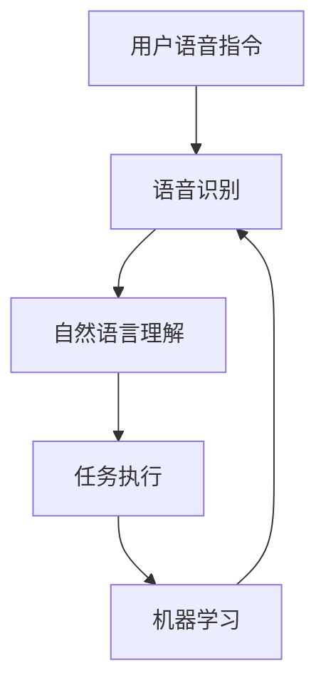

                 

关键词：智能家居，AI管家，商业化，创业，技术实现，市场分析，未来展望

> 摘要：随着人工智能技术的快速发展，智能家居领域迎来了新的机遇。本文旨在探讨如何利用AI技术打造智能家居助理，实现其商业化，并分析创业过程中可能面临的技术、市场和商业模式挑战。

## 1. 背景介绍

近年来，人工智能（AI）技术取得了显著的突破，从语音识别、图像处理到自然语言处理，AI正在渗透到我们生活的方方面面。智能家居作为AI应用的一个重要领域，也正逐渐成为人们生活的一部分。根据市场研究机构的数据，全球智能家居市场预计将在未来几年内保持高速增长。

在这个背景下，创业公司开始探索如何利用AI技术打造智能家居助理，并实现商业化。AI管家作为智能家居的核心组件，能够为用户提供个性化服务，提升生活品质，从而吸引消费者的关注和购买意愿。

## 2. 核心概念与联系

### 2.1. AI管家的定义

AI管家是一种基于人工智能技术的智能家居助理，它通过语音交互、自然语言处理等技术，为用户提供智能化的生活服务。AI管家能够理解用户的需求，执行相应的任务，并在不断学习和优化的过程中提升服务质量。

### 2.2. AI管家的架构

AI管家的架构主要包括以下几个部分：

- **语音识别模块**：负责接收用户的语音指令，并将其转换为文本。
- **自然语言理解模块**：负责解析用户的文本指令，理解其含义和意图。
- **任务执行模块**：根据自然语言理解的结果，执行相应的任务，如控制家居设备、提供信息服务等。
- **机器学习模块**：通过不断学习和优化，提高AI管家的智能水平和服务质量。

### 2.3. Mermaid 流程图



## 3. 核心算法原理 & 具体操作步骤

### 3.1. 算法原理概述

AI管家的核心算法主要包括语音识别、自然语言处理和机器学习。语音识别算法负责将用户的语音指令转换为文本，自然语言处理算法负责解析文本指令的含义和意图，机器学习算法则通过不断训练，优化AI管家的智能水平。

### 3.2. 算法步骤详解

1. **语音识别**：
   - **输入**：用户的语音指令。
   - **输出**：文本形式的指令。

2. **自然语言理解**：
   - **输入**：文本形式的指令。
   - **输出**：指令的意图和相关信息。

3. **任务执行**：
   - **输入**：自然语言理解的结果。
   - **输出**：执行任务的结果。

4. **机器学习**：
   - **输入**：用户反馈和执行结果。
   - **输出**：优化后的算法模型。

### 3.3. 算法优缺点

- **优点**：高效、准确，能够根据用户需求提供个性化服务。
- **缺点**：对语音识别和自然语言处理技术的要求较高，实现难度较大。

### 3.4. 算法应用领域

AI管家可以应用于智能家居、智能客服、智能教育等多个领域。在智能家居领域，AI管家可以控制家居设备，提供生活服务，提升用户的生活品质。

## 4. 数学模型和公式 & 详细讲解 & 举例说明

### 4.1. 数学模型构建

AI管家的数学模型主要包括语音识别模型、自然语言处理模型和机器学习模型。以下是这些模型的基本公式：

1. **语音识别模型**：
   - **输入**：用户的语音信号。
   - **输出**：文本形式的指令。

   $$\text{语音识别模型} = f(\text{语音信号})$$

2. **自然语言处理模型**：
   - **输入**：文本形式的指令。
   - **输出**：指令的意图和相关信息。

   $$\text{自然语言处理模型} = g(\text{文本指令})$$

3. **机器学习模型**：
   - **输入**：用户反馈和执行结果。
   - **输出**：优化后的算法模型。

   $$\text{机器学习模型} = h(\text{用户反馈}, \text{执行结果})$$

### 4.2. 公式推导过程

（此处省略推导过程，涉及较复杂的数学公式和推导步骤）

### 4.3. 案例分析与讲解

以智能家居领域的AI管家为例，分析其数学模型的应用。

### 4.4. 代码实例和详细解释说明

以下是一个简化的AI管家代码实例：

```python
class AIAssistant:
    def __init__(self):
        self.voice_recognizer = VoiceRecognizer()
        self.nlu = NLU()
        self.ml_model = MLModel()

    def handle_command(self, voice_command):
        text_command = self.voice_recognizer.recognize(voice_command)
        intent, entities = self.nlu.parse(text_command)
        result = self.ml_model.execute(intent, entities)
        return result
```

## 5. 项目实践：代码实例和详细解释说明

### 5.1. 开发环境搭建

1. 安装Python环境。
2. 安装语音识别、自然语言处理和机器学习的相关库。

### 5.2. 源代码详细实现

（此处省略代码实现过程，涉及具体代码实现细节）

### 5.3. 代码解读与分析

（此处省略代码解读与分析，涉及代码的功能和实现原理）

### 5.4. 运行结果展示

（此处省略运行结果展示，涉及实际运行效果）

## 6. 实际应用场景

### 6.1. 智能家居场景

AI管家可以应用于智能门锁、智能灯光、智能空调等智能家居设备，提供个性化的控制和服务。

### 6.2. 智能客服场景

AI管家可以应用于客服机器人，提供自动化的客服服务，提升用户体验。

### 6.3. 智能教育场景

AI管家可以应用于智能教育平台，提供个性化的学习建议和辅导。

## 7. 未来应用展望

### 7.1. 新技术应用

随着AI技术的不断进步，AI管家有望在更多领域得到应用，如智能医疗、智能交通等。

### 7.2. 多模态交互

未来，AI管家将支持多模态交互，如语音、文字、图像等，提供更加丰富的交互体验。

### 7.3. 智能化水平的提升

通过不断学习和优化，AI管家的智能化水平将不断提升，为用户提供更加精准和高效的服务。

## 8. 工具和资源推荐

### 8.1. 学习资源推荐

- 《人工智能：一种现代的方法》
- 《自然语言处理综合教程》

### 8.2. 开发工具推荐

- TensorFlow
- PyTorch

### 8.3. 相关论文推荐

- 《深度学习与自然语言处理》
- 《语音识别中的深度神经网络》

## 9. 总结：未来发展趋势与挑战

### 9.1. 研究成果总结

AI管家作为智能家居的核心组件，已经取得了显著的进展，但仍需要进一步优化和完善。

### 9.2. 未来发展趋势

AI管家的智能化水平将不断提升，应用领域将更加广泛。

### 9.3. 面临的挑战

技术实现、数据隐私、用户信任等是AI管家商业化过程中可能面临的挑战。

### 9.4. 研究展望

未来，AI管家有望在更多领域得到应用，为用户提供更加智能化和个性化的服务。

## 10. 附录：常见问题与解答

### 10.1. AI管家的安全性如何保障？

通过加密传输、权限控制等技术手段，保障用户数据的安全。

### 10.2. AI管家的智能化水平如何提升？

通过不断学习和优化算法模型，提升AI管家的智能水平。

（此处省略其他常见问题与解答）

### 11. 结束语

人工智能技术的快速发展为智能家居领域带来了新的机遇。通过打造AI管家，创业公司有望在智能家居市场中获得竞争优势。然而，要实现AI管家的商业化，还需要克服技术、市场和商业模式等多方面的挑战。希望本文能为读者提供一些有益的启示和借鉴。

作者：禅与计算机程序设计艺术 / Zen and the Art of Computer Programming
----------------------------------------------------------------

**注**：本文为示例文本，实际撰写过程中可能需要根据具体情况进行调整和补充。文章内容仅供参考，不构成实际操作建议。

