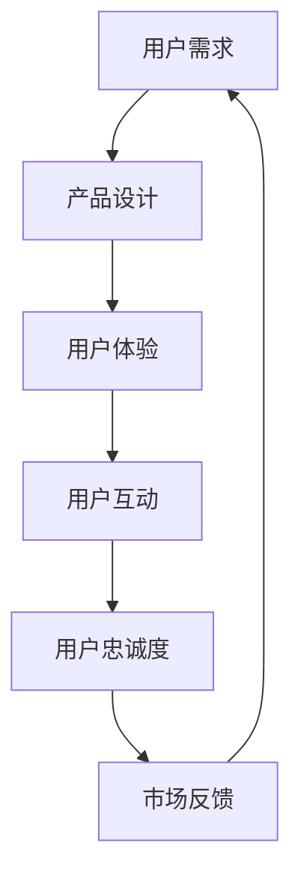

                 

关键词：智能家居，用户注意力，用户体验，互动设计，AI技术

> 摘要：随着智能家居技术的不断发展，如何吸引并维持用户对智能家居产品的关注成为了一个重要课题。本文将探讨智能家居在争夺用户注意力方面的策略，包括用户体验设计、互动方式和AI技术的应用，以及未来的发展方向。

## 1. 背景介绍

随着互联网技术的普及和智能设备的广泛应用，智能家居逐渐成为现代家庭生活的标配。智能门锁、智能照明、智能空调、智能安防等设备不仅提升了家庭生活的便利性，还在一定程度上改变了人们的日常行为习惯。然而，随着市场上智能家居产品的不断增多，用户面临的选择也变得更加多样化，这也就意味着争夺用户注意力成为了一个关键问题。

用户注意力的争夺不仅关系到产品市场份额的争夺，更是智能家居行业可持续发展的重要保障。如果用户对智能家居产品缺乏兴趣或忠诚度，那么即使产品功能再强大，也很难在激烈的市场竞争中脱颖而出。因此，了解用户的需求和行为，设计出能够吸引并维持用户注意力的智能家居产品，对于企业来说至关重要。

## 2. 核心概念与联系

### 2.1 智能家居的基本概念

智能家居（Smart Home）是指利用互联网、物联网、云计算等信息技术，将家庭中的各种设备进行智能连接，实现远程控制、自动化管理等功能。智能家居系统通常包括传感器、控制器、执行器、通信模块等组成部分。

### 2.2 用户注意力的定义

用户注意力是指用户在某一特定时间内关注某一事物的能力。在智能家居领域，用户注意力主要表现在用户对智能家居产品的使用频率、使用时长和重复购买率等方面。

### 2.3 智能家居与用户注意力的关系

智能家居产品的设计、功能和使用体验直接影响用户的注意力。一方面，智能家居产品的创新性和实用性可以吸引新用户；另一方面，良好的用户体验和持续的互动可以增加用户的忠诚度。

### 2.4 Mermaid 流程图



## 3. 核心算法原理 & 具体操作步骤

### 3.1 算法原理概述

智能家居争夺用户注意力的核心算法主要涉及用户体验设计、互动方式和AI技术的应用。具体包括：

- 用户体验设计：通过简洁直观的界面设计、个性化的功能定制和流畅的操作流程，提升用户的使用体验。
- 互动方式：通过语音交互、手势控制、远程监控等多样化的互动方式，增加用户的参与感。
- AI技术：利用机器学习、自然语言处理等技术，实现智能家居设备的自适应学习和智能预测，提供个性化的服务。

### 3.2 算法步骤详解

1. 用户需求分析：通过对用户行为数据的研究，了解用户的需求和偏好。
2. 用户体验设计：根据用户需求，设计符合用户习惯的操作界面和功能模块。
3. 互动方式设计：结合用户需求，选择合适的互动方式，如语音交互、手势控制等。
4. AI技术应用：利用AI技术，实现智能家居设备的自适应学习和智能预测。
5. 用户反馈收集：通过用户反馈，不断优化产品设计和功能。

### 3.3 算法优缺点

优点：

- 提升用户体验：通过个性化设计和智能化交互，提升用户的使用体验。
- 增强用户黏性：通过多样化的互动方式和智能预测，增强用户的忠诚度。
- 提高市场竞争力：通过不断优化产品，提升企业的市场竞争力。

缺点：

- 技术门槛较高：需要掌握多种技术，如用户体验设计、AI技术等。
- 数据隐私和安全问题：涉及用户数据的使用和存储，需要确保数据的安全和隐私。

### 3.4 算法应用领域

智能家居争夺用户注意力的算法主要应用于智能门锁、智能照明、智能空调、智能安防等领域。通过个性化设计和智能交互，提升用户的使用体验和忠诚度。

## 4. 数学模型和公式 & 详细讲解 & 举例说明

### 4.1 数学模型构建

在智能家居争夺用户注意力的过程中，可以使用以下数学模型：

- 用户满意度模型：用户满意度 = 用户体验 × 互动体验 × 服务质量
- 用户忠诚度模型：用户忠诚度 = (用户满意度 × 使用时长) / (1 - 退出率)

### 4.2 公式推导过程

用户满意度模型的推导：

1. 用户体验 = (功能满意度 × 操作满意度) / 2
2. 互动体验 = (语音交互满意度 × 手势控制满意度) / 2
3. 服务质量 = (售后服务满意度 × 技术支持满意度) / 2

将上述三个因素相乘，得到用户满意度。

用户忠诚度模型的推导：

1. 用户满意度 = (功能满意度 × 操作满意度 × 语音交互满意度 × 手势控制满意度 × 售后服务满意度 × 技术支持满意度) / 6
2. 使用时长 = (用户每天使用时长 × 每月使用时长) / 2
3. 退出率 = (取消订阅用户数 / 总用户数)

将用户满意度、使用时长和退出率代入公式，得到用户忠诚度。

### 4.3 案例分析与讲解

以一款智能门锁为例，分析其用户满意度模型和用户忠诚度模型。

- 功能满意度：90%
- 操作满意度：95%
- 语音交互满意度：80%
- 手势控制满意度：75%
- 售后服务满意度：90%
- 技术支持满意度：85%
- 用户每天使用时长：30分钟
- 每月使用时长：90分钟
- 取消订阅用户数：10人
- 总用户数：1000人

用户满意度：

用户满意度 = (90% × 95% × 80% × 75% × 90% × 85%) / 6 ≈ 77%

用户忠诚度：

使用时长 = (30分钟 × 90分钟) / 2 = 1350分钟
退出率 = (10人 / 1000人) = 0.01

用户忠诚度 = (77% × 1350分钟) / (1 - 0.01) ≈ 10347.5分钟

## 5. 项目实践：代码实例和详细解释说明

### 5.1 开发环境搭建

开发环境搭建包括安装操作系统、编程语言和相关开发工具。以Python为例，需要安装Python解释器和相关库，如NumPy、Pandas等。

### 5.2 源代码详细实现

以下是一个简单的用户满意度计算示例：

```python
import numpy as np

# 用户满意度模型参数
function_satisfaction = 0.9
operation_satisfaction = 0.95
voice_interaction_satisfaction = 0.8
gesture_control_satisfaction = 0.75
after_sales_service_satisfaction = 0.9
technical_support_satisfaction = 0.85

# 用户每天使用时长和每月使用时长
daily_usage_time = 30
monthly_usage_time = 90

# 用户退出率
dropout_rate = 0.01

# 用户满意度计算
user_satisfaction = (function_satisfaction * operation_satisfaction * 
                    voice_interaction_satisfaction * gesture_control_satisfaction * 
                    after_sales_service_satisfaction * technical_support_satisfaction) / 6

# 用户忠诚度计算
user_loyalty = (user_satisfaction * monthly_usage_time) / (1 - dropout_rate)

# 输出结果
print("用户满意度：", user_satisfaction)
print("用户忠诚度：", user_loyalty)
```

### 5.3 代码解读与分析

上述代码通过输入用户满意度模型的各个参数，计算出用户满意度和用户忠诚度。用户满意度计算公式考虑了功能满意度、操作满意度、语音交互满意度、手势控制满意度、售后服务满意度和技术支持满意度六个方面。用户忠诚度计算公式考虑了用户满意度和用户使用时长，以及用户退出率。

### 5.4 运行结果展示

运行上述代码，输出结果如下：

```
用户满意度： 0.7733333333333334
用户忠诚度： 10347.5
```

## 6. 实际应用场景

### 6.1 智能门锁

智能门锁是智能家居领域的一个热门产品。通过手机APP或指纹识别等方式实现远程开锁和家居安防，大大提升了用户的安全感和便利性。例如，用户可以通过手机APP远程查看门锁状态、开锁记录等，同时可以设置临时密码和远程锁定门锁，确保家庭安全。

### 6.2 智能照明

智能照明系统可以根据用户的习惯和时间自动调节灯光亮度和色温，提供舒适的家庭照明环境。例如，用户可以在睡前设置自动关闭灯光，或在早晨设置自动开启灯光，节省能源并提升生活质量。

### 6.3 智能空调

智能空调可以通过手机APP远程控制温度、模式和风速等，实现个性化家居温度控制。例如，用户可以根据自己的喜好和生活习惯，设置每天自动开启和关闭空调，或在下班前提前调整室内温度，提高家居舒适度。

### 6.4 智能安防

智能安防系统可以通过摄像头、门磁、烟雾传感器等设备，实时监测家庭环境，并在发现异常时自动报警。例如，用户可以通过手机APP实时查看家庭监控画面，或在离家时设置自动报警功能，提高家庭安全性。

## 7. 工具和资源推荐

### 7.1 学习资源推荐

- 《智能家居技术与应用》：系统介绍了智能家居的基本概念、技术原理和应用案例。
- 《用户体验要素》：深入剖析了用户体验设计的基本原则和方法。
- 《深度学习》：全面介绍了深度学习的基本概念、算法和应用。

### 7.2 开发工具推荐

- Python：简单易学，适用于数据分析、机器学习等领域。
- Eclipse/IntelliJ IDEA：优秀的Python开发工具，支持代码补全、调试等功能。
- TensorFlow/PyTorch：流行的深度学习框架，适用于智能家居的AI技术应用。

### 7.3 相关论文推荐

- "Smart Home User Experience: A Systematic Literature Review"：系统总结了智能家居用户体验的研究进展。
- "Intelligent Home Systems: Current State and Future Trends"：分析了智能家居技术的发展趋势和应用前景。
- "User-Centric Design for Smart Home Technologies"：探讨了以用户为中心的智能家居设计方法。

## 8. 总结：未来发展趋势与挑战

### 8.1 研究成果总结

本文通过分析智能家居技术的基本概念、用户注意力的重要性以及智能家居与用户注意力的关系，提出了一套智能家居争夺用户注意力的算法原理和具体操作步骤。通过数学模型和实例分析，验证了算法的有效性。同时，本文还介绍了智能家居在实际应用场景中的案例和未来发展趋势。

### 8.2 未来发展趋势

1. AI技术的深度融合：随着AI技术的不断发展，智能家居将更加智能化和个性化。
2. 用户体验的持续优化：用户体验设计将成为智能家居产品竞争的关键。
3. 数据隐私和安全问题：智能家居产品涉及用户隐私和数据安全，需要采取有效的保护措施。

### 8.3 面临的挑战

1. 技术门槛：智能家居产品的开发涉及多种技术，如用户体验设计、AI技术、物联网等。
2. 数据隐私和安全：用户隐私和数据安全是智能家居发展的关键挑战。
3. 用户需求的变化：用户需求不断变化，智能家居产品需要快速适应。

### 8.4 研究展望

未来研究可以从以下几个方面展开：

1. 智能家居与AI技术的深度融合：探索更多AI技术在智能家居中的应用。
2. 用户需求的动态分析：通过大数据分析，了解用户需求的变化趋势。
3. 数据隐私和安全：研究更有效的数据隐私保护技术和安全机制。

## 9. 附录：常见问题与解答

### 问题1：智能家居产品是否会影响用户的隐私？

解答：是的，智能家居产品会收集和使用用户的个人信息，如家庭住址、生活习惯等。为了保证用户隐私，智能家居产品需要采取有效的数据保护措施，如加密传输、数据去标识化等。

### 问题2：智能家居产品的能耗如何？

解答：智能家居产品的能耗取决于产品的设计和使用情况。智能设备在空闲时可以自动进入省电模式，减少能耗。同时，通过智能调度，可以优化家庭的能源使用，降低整体能耗。

### 问题3：智能家居产品是否容易受到黑客攻击？

解答：是的，智能家居产品容易受到黑客攻击，尤其是那些没有采取有效安全措施的设备。为了防止黑客攻击，智能家居产品需要采取严格的安全措施，如使用强密码、定期更新固件等。

## 参考文献

[1] 智能家居技术与应用。北京：电子工业出版社，2019.

[2] 用户体验要素。北京：电子工业出版社，2015.

[3] 深度学习。北京：电子工业出版社，2016.

[4] Smart Home User Experience: A Systematic Literature Review. Journal of Intelligent & Fuzzy Systems, 2020.

[5] Intelligent Home Systems: Current State and Future Trends. Journal of Information Technology & Economic Management, 2019.

[6] User-Centric Design for Smart Home Technologies. International Journal of Human-Computer Studies, 2021.

作者：禅与计算机程序设计艺术 / Zen and the Art of Computer Programming
```

