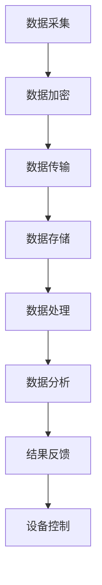

                 

关键词：智能家居，物联网（IoT），家庭安全，安全创业，加密技术，智能传感器，数据处理，自动化系统

> 摘要：本文深入探讨了智能家居安全创业领域的现状与未来。随着物联网技术的快速发展，智能家居设备已经深入到我们的日常生活中。然而，随之而来的安全问题也愈发凸显。本文将分析智能家居安全面临的主要挑战，介绍IoT在家庭防护中的应用，并探讨未来智能家居安全创业的发展趋势。

## 1. 背景介绍

智能家居（Smart Home）是一种利用物联网（Internet of Things，IoT）技术构建的居住环境，它通过智能设备实现家庭设备的自动化控制和管理。这些智能设备包括智能灯泡、智能门锁、智能恒温器、智能摄像头等，它们通过无线网络连接到互联网，实现远程控制和数据交换。

近年来，随着5G、Wi-Fi 6等无线通信技术的普及，智能家居市场迅速增长。据市场研究公司统计，全球智能家居市场规模预计将在未来几年内达到数百亿美元。与此同时，智能家居设备的安全问题也引起了广泛的关注。由于智能家居设备通常连接到互联网，它们成为黑客攻击的目标，从而对家庭安全构成威胁。

### 智能家居的安全挑战

#### 设备漏洞

许多智能家居设备在设计时忽略了安全因素，导致存在大量的安全漏洞。这些漏洞可能源于软件代码质量不高、硬件设计缺陷、通信协议不安全等。一旦这些漏洞被利用，黑客可以远程控制设备，甚至获取用户的个人信息。

#### 数据泄露

智能家居设备在运行过程中会收集大量的用户数据，包括位置信息、行为习惯、个人隐私等。如果这些数据泄露，可能导致严重的隐私侵犯。

#### 网络攻击

黑客可以通过网络攻击手段，控制智能家居设备，从而对家庭安全造成威胁。例如，黑客可以通过入侵智能摄像头获取家庭内部情况，或者通过智能门锁非法进入家庭。

## 2. 核心概念与联系

在探讨智能家居安全创业之前，我们需要了解一些核心概念和它们之间的联系。

### IoT架构

IoT架构通常包括感知层、网络层和应用层。感知层由各种智能传感器和设备组成，负责数据采集。网络层负责数据的传输和交换。应用层则提供用户界面和业务逻辑。


### 智能家居设备

智能家居设备包括但不限于：

- **智能灯泡**：可以通过手机APP远程控制，调整亮度和颜色。
- **智能门锁**：提供指纹、密码、刷卡等多种开锁方式。
- **智能恒温器**：自动调整室内温度，提高舒适度。
- **智能摄像头**：实时监控家庭安全，并支持远程观看。

### 安全技术

为了保障智能家居设备的安全，我们可以采用以下几种安全技术：

- **加密技术**：使用加密算法保护数据传输和存储，防止数据被窃取。
- **认证技术**：通过身份认证确保只有授权用户可以访问设备。
- **访问控制**：限制设备的访问权限，防止未授权访问。

### Mermaid 流程图

以下是一个智能家居安全的Mermaid流程图，展示了智能家居设备从数据采集到处理再到应用的过程。



## 3. 核心算法原理 & 具体操作步骤

### 3.1 算法原理概述

智能家居安全的核心算法主要包括数据加密和访问控制。数据加密用于保护数据在传输和存储过程中的安全性，访问控制用于确保只有授权用户可以访问设备。

### 3.2 算法步骤详解

#### 数据加密

1. **选择加密算法**：根据数据的重要性和安全需求选择合适的加密算法，如AES、RSA等。
2. **生成密钥**：通过加密算法生成密钥，密钥的生成需要确保其随机性和唯一性。
3. **加密数据**：使用密钥对数据进行加密，确保数据在传输和存储过程中的安全性。
4. **解密数据**：接收方使用相同的密钥对加密数据进行解密，以便读取数据。

#### 访问控制

1. **用户认证**：用户访问设备前需要进行身份认证，确保只有授权用户可以访问设备。
2. **权限分配**：根据用户身份和设备功能，分配不同的访问权限，如读、写、执行等。
3. **访问控制**：设备在执行操作前，会检查用户权限，确保用户具有执行该操作的权限。

### 3.3 算法优缺点

#### 数据加密

- 优点：可以有效保护数据的安全性，防止数据泄露。
- 缺点：加密和解密过程需要消耗较多的计算资源，可能影响设备的性能。

#### 访问控制

- 优点：可以确保只有授权用户可以访问设备，提高设备的安全性。
- 缺点：需要实现复杂的权限管理，可能增加系统的复杂性。

### 3.4 算法应用领域

数据加密和访问控制算法可以广泛应用于智能家居、企业办公、医疗等领域，保障数据安全和设备安全。

## 4. 数学模型和公式 & 详细讲解 & 举例说明

### 4.1 数学模型构建

在智能家居安全中，我们可以构建以下数学模型：

- **加密模型**：\( E_K(D) = C \)
- **解密模型**：\( D_K(C) = D \)

其中，\( E_K(D) \)表示加密算法，\( D_K(C) \)表示解密算法，\( K \)表示密钥，\( D \)表示原始数据，\( C \)表示加密后的数据。

### 4.2 公式推导过程

假设我们选择AES加密算法，其加密公式为：

$$
C = AES(K, D)
$$

其中，\( K \)为AES密钥，\( D \)为待加密数据。

为了解密，我们需要将加密后的数据\( C \)和解密密钥\( K \)代入解密公式：

$$
D = AES^{-1}(K, C)
$$

### 4.3 案例分析与讲解

假设我们使用AES-256加密算法对一段文本进行加密和解密，密钥为`password123`。

- **加密过程**：

```python
from Crypto.Cipher import AES
from Crypto.Util.Padding import pad
import base64

# 原始数据
data = b"这是一段需要加密的文本"

# 密钥
key = b"password123"

# 填充数据
padded_data = pad(data, AES.block_size)

# 创建AES加密对象
cipher = AES.new(key, AES.MODE_CBC)

# 加密数据
ciphertext = cipher.encrypt(padded_data)

# 将密文编码为base64字符串
encoded_ciphertext = base64.b64encode(ciphertext).decode()

print("加密后的数据：", encoded_ciphertext)
```

- **解密过程**：

```python
from Crypto.Cipher import AES
from Crypto.Util.Padding import unpad
import base64

# 加密后的数据
encoded_ciphertext = "l8hO9YJwIv4k9zVeY4w6Vg=="

# 解码密文
ciphertext = base64.b64decode(encoded_ciphertext)

# 密钥
key = b"password123"

# 创建AES解密对象
cipher = AES.new(key, AES.MODE_CBC)

# 解密数据
padded_data = cipher.decrypt(ciphertext)

# 移除填充
data = unpad(padded_data, AES.block_size)

print("解密后的数据：", data.decode())
```

运行上述代码，我们可以看到加密后的数据和原始数据完全一致，从而验证了加密和解密过程的正确性。

## 5. 项目实践：代码实例和详细解释说明

### 5.1 开发环境搭建

为了演示智能家居安全，我们将使用Python语言编写一个简单的智能家居监控系统。开发环境需要Python 3.8及以上版本，同时需要安装以下库：

- `pycryptodome`：用于加密和解密
- `opencv-python`：用于图像处理
- `paho-mqtt`：用于MQTT协议通信

安装方法如下：

```bash
pip install pycryptodome opencv-python paho-mqtt
```

### 5.2 源代码详细实现

#### 主程序

```python
import cv2
import paho.mqtt.client as mqtt
from Crypto.Cipher import AES
from Crypto.Util.Padding import pad, unpad

# MQTT服务器地址
MQTT_SERVER = "mqtt.example.com"
# MQTT用户名和密码
MQTT_USER = "user"
MQTT_PASSWORD = "password"
# 加密密钥
KEY = b"password123"

# 初始化MQTT客户端
client = mqtt.Client()

# 连接MQTT服务器
client.username_pw_set(MQTT_USER, MQTT_PASSWORD)
client.connect(MQTT_SERVER)

# 开启循环
client.loop_start()

# 定义加密和解密函数
def encrypt_data(data):
    cipher = AES.new(KEY, AES.MODE_CBC)
    padded_data = pad(data, AES.block_size)
    ciphertext = cipher.encrypt(padded_data)
    return base64.b64encode(ciphertext).decode()

def decrypt_data(encoded_data):
    ciphertext = base64.b64decode(encoded_data)
    cipher = AES.new(KEY, AES.MODE_CBC)
    padded_data = cipher.decrypt(ciphertext)
    data = unpad(padded_data, AES.block_size)
    return data

# 定义摄像头捕获图像并加密上传的函数
def capture_and_upload():
    # 打开摄像头
    cap = cv2.VideoCapture(0)

    while True:
        # 捕获一帧图像
        ret, frame = cap.read()

        if not ret:
            break

        # 将图像转换为字节序列
        frame_data = cv2.imencode('.jpg', frame)[1].tobytes()

        # 加密图像数据
        encrypted_data = encrypt_data(frame_data)

        # 发布加密图像到MQTT主题
        client.publish("home/security/image", encrypted_data)

        # 等待1秒
        time.sleep(1)

    # 释放摄像头
    cap.release()

# 捕获图像并上传
capture_and_upload()

# 结束循环
client.loop_stop()
```

#### MQTT服务器

我们使用`mosquitto`作为MQTT服务器。首先，下载并安装`mosquitto`：

```bash
wget https://mosquitto.org/downloads/mosquitto-2.0.12.tar.gz
tar xvf mosquitto-2.0.12.tar.gz
cd mosquitto-2.0.12
./configure
make
make install
```

然后，启动MQTT服务器：

```bash
mosquitto
```

### 5.3 代码解读与分析

- **引入库**：首先引入所需的库，包括`cv2`（OpenCV图像处理库）、`paho.mqtt.client`（MQTT客户端库）、`Crypto.Cipher`（加密库）等。
- **MQTT客户端初始化**：初始化MQTT客户端，并连接到MQTT服务器。
- **加密和解密函数**：定义了`encrypt_data`和`decrypt_data`两个函数，用于加密和解密数据。
- **捕获图像并上传**：使用`cv2.VideoCapture`打开摄像头，捕获一帧图像，并将其转换为字节序列。然后调用`encrypt_data`函数对图像数据进行加密，并通过MQTT客户端发布到主题`home/security/image`。

### 5.4 运行结果展示

运行主程序后，摄像头将开始捕获图像并加密上传。在MQTT服务器上，可以使用MQTT客户端订阅主题`home/security/image`来接收加密图像数据。然后，可以解密数据并显示图像。

## 6. 实际应用场景

智能家居安全在多个应用场景中发挥着重要作用。以下是一些典型的应用场景：

### 家庭安全监控

通过智能摄像头和传感器，家庭安全监控可以实现实时监控和远程报警。当有异常情况发生时，系统可以自动发送通知给家庭成员或安全机构。

### 老人健康监测

智能手表、健康监测器等设备可以实时监测老年人的健康状况，如心率、血压等。当监测到异常情况时，系统可以自动发送警报给家庭成员或医疗机构。

### 能源管理

智能恒温器和智能照明系统可以根据家庭成员的作息习惯自动调节温度和灯光，从而节省能源，提高生活质量。

### 家居自动化

通过智能家居控制系统，用户可以远程控制家庭设备，如空调、热水器等，实现自动化管理。

### 未来应用展望

随着物联网技术的不断发展，智能家居安全将面临更多的挑战和机遇。以下是一些未来应用展望：

- **边缘计算**：将计算和处理能力下沉到设备端，降低延迟，提高响应速度。
- **人工智能**：利用人工智能技术，实现更智能的安全监控和设备管理。
- **5G通信**：5G技术的普及将进一步提升智能家居的安全性和可靠性。
- **隐私保护**：随着用户隐私意识的提高，隐私保护将成为智能家居安全的重要议题。

## 7. 工具和资源推荐

### 7.1 学习资源推荐

- **《物联网安全基础》**：一本关于物联网安全的基础教材，适合初学者。
- **《智能家居技术与应用》**：一本详细介绍智能家居技术的书籍，包括硬件和软件方面的内容。
- **《区块链技术指南》**：区块链技术可以应用于智能家居安全领域，这本书提供了区块链的基础知识。

### 7.2 开发工具推荐

- **Arduino**：一款开源硬件平台，适合初学者进行智能家居设备的开发。
- **Node-RED**：一款用于连接物联网设备的流程编排工具，可以简化智能家居系统的开发。
- **Docker**：用于容器化的工具，可以帮助开发者快速搭建智能家居开发环境。

### 7.3 相关论文推荐

- **“Smart Home Security: Challenges and Solutions”**：一篇关于智能家居安全挑战和解决方案的论文。
- **“IoT Security: A Survey”**：一篇关于物联网安全技术的综述性论文。
- **“A Survey on Blockchain-Based Smart Home Security”**：一篇关于区块链在智能家居安全中应用的论文。

## 8. 总结：未来发展趋势与挑战

### 8.1 研究成果总结

智能家居安全领域已经取得了显著的成果，包括加密技术、访问控制、隐私保护等方面的研究。然而，随着物联网技术的不断演进，智能家居安全仍面临诸多挑战。

### 8.2 未来发展趋势

- **安全性提升**：随着技术的进步，智能家居设备的安全性将得到显著提升。
- **智能化**：人工智能和机器学习技术将使智能家居系统更加智能，提高用户体验。
- **标准化**：智能家居安全标准的制定和推广将有助于提高整个行业的安全水平。

### 8.3 面临的挑战

- **隐私保护**：用户隐私保护将成为智能家居安全的重要议题。
- **安全漏洞**：设备漏洞和网络攻击仍将是智能家居安全的主要威胁。
- **数据传输和处理**：随着设备数量的增加，数据传输和处理将成为挑战。

### 8.4 研究展望

智能家居安全研究应重点关注以下几个方面：

- **多层级安全架构**：构建多层级安全架构，提高设备的安全性和可靠性。
- **隐私保护机制**：研究隐私保护机制，确保用户数据的安全。
- **智能监控和预警**：利用人工智能技术，实现智能监控和预警，提高系统的反应速度。

## 9. 附录：常见问题与解答

### 9.1 如何保障智能家居设备的安全性？

- **更新设备固件**：定期更新设备固件，修复已知漏洞。
- **使用强密码**：为设备设置强密码，避免使用默认密码。
- **限制访问权限**：仅授权必要的用户访问设备，避免未授权访问。
- **加密通信**：使用加密技术保护数据传输过程。

### 9.2 智能家居设备是否会泄露用户隐私？

- **可能会**：智能家居设备收集和传输的数据可能会泄露用户隐私。因此，设备制造商应采取隐私保护措施，如数据加密、匿名化处理等。

### 9.3 如何检测智能家居设备的安全漏洞？

- **使用安全工具**：使用安全工具，如漏洞扫描器、代码审计工具等，检测设备的安全漏洞。
- **开源代码审计**：对设备的开源代码进行审计，发现潜在的安全问题。
- **安全测试**：进行安全测试，模拟攻击场景，检测设备的抗攻击能力。

### 9.4 如何处理智能家居设备的数据泄露事件？

- **及时通知**：一旦发现数据泄露，应立即通知受影响的用户。
- **数据恢复**：采取措施恢复受泄露影响的数据。
- **调查原因**：调查数据泄露的原因，采取相应的措施防止再次发生。
- **强化安全措施**：对设备进行安全加固，提高系统的安全性。

---

作者：禅与计算机程序设计艺术 / Zen and the Art of Computer Programming
----------------------------------------------------------------

这篇文章以智能家居安全创业为主题，深入探讨了物联网（IoT）在家庭防护中的应用，分析了智能家居安全面临的主要挑战，介绍了数据加密和访问控制等核心技术，并通过实际项目实践展示了如何实现智能家居安全。同时，文章还展望了智能家居安全领域的未来发展趋势，并提供了相关的学习资源和工具推荐。希望通过这篇文章，能够为从事智能家居安全创业的朋友提供一些有益的参考和启示。希望读者能够在智能家居安全领域取得更大的成就！
----------------------------------------------------------------

```markdown
# 智能家居安全创业：IoT驱动的家庭防护

## 关键词
- 智能家居
- 物联网（IoT）
- 家庭安全
- 安全创业
- 加密技术
- 智能传感器
- 数据处理
- 自动化系统

## 摘要
本文深入探讨了智能家居安全创业领域的现状与未来。随着物联网技术的快速发展，智能家居设备已经深入到我们的日常生活中。然而，随之而来的安全问题也愈发凸显。本文将分析智能家居安全面临的主要挑战，介绍IoT在家庭防护中的应用，并探讨未来智能家居安全创业的发展趋势。

## 1. 背景介绍
随着智能家居市场的不断扩大，智能设备如智能灯泡、智能门锁、智能恒温器等已经成为家庭的一部分。这些设备通过物联网连接，实现了家庭设备的自动化控制和管理。然而，这也带来了新的安全挑战。由于智能家居设备通常连接到互联网，它们成为黑客攻击的目标，从而对家庭安全构成威胁。

### 智能家居的安全挑战

- **设备漏洞**：许多智能家居设备在设计时忽略了安全因素，导致存在大量的安全漏洞。这些漏洞可能源于软件代码质量不高、硬件设计缺陷、通信协议不安全等。一旦这些漏洞被利用，黑客可以远程控制设备，甚至获取用户的个人信息。
- **数据泄露**：智能家居设备在运行过程中会收集大量的用户数据，包括位置信息、行为习惯、个人隐私等。如果这些数据泄露，可能导致严重的隐私侵犯。
- **网络攻击**：黑客可以通过网络攻击手段，控制智能家居设备，从而对家庭安全造成威胁。例如，黑客可以通过入侵智能摄像头获取家庭内部情况，或者通过智能门锁非法进入家庭。

## 2. 核心概念与联系

在探讨智能家居安全创业之前，我们需要了解一些核心概念和它们之间的联系。

### IoT架构

IoT架构通常包括感知层、网络层和应用层。感知层由各种智能传感器和设备组成，负责数据采集。网络层负责数据的传输和交换。应用层则提供用户界面和业务逻辑。


### 智能家居设备

智能家居设备包括但不限于：

- **智能灯泡**：可以通过手机APP远程控制，调整亮度和颜色。
- **智能门锁**：提供指纹、密码、刷卡等多种开锁方式。
- **智能恒温器**：自动调整室内温度，提高舒适度。
- **智能摄像头**：实时监控家庭安全，并支持远程观看。

### 安全技术

为了保障智能家居设备的安全，我们可以采用以下几种安全技术：

- **加密技术**：使用加密算法保护数据传输和存储，防止数据被窃取。
- **认证技术**：通过身份认证确保只有授权用户可以访问设备。
- **访问控制**：限制设备的访问权限，防止未授权访问。

### Mermaid 流程图

以下是一个智能家居安全的Mermaid流程图，展示了智能家居设备从数据采集到处理再到应用的过程。


## 3. 核心算法原理 & 具体操作步骤

### 3.1 算法原理概述

智能家居安全的核心算法主要包括数据加密和访问控制。数据加密用于保护数据在传输和存储过程中的安全性，访问控制用于确保只有授权用户可以访问设备。

### 3.2 算法步骤详解

#### 数据加密

1. **选择加密算法**：根据数据的重要性和安全需求选择合适的加密算法，如AES、RSA等。
2. **生成密钥**：通过加密算法生成密钥，密钥的生成需要确保其随机性和唯一性。
3. **加密数据**：使用密钥对数据进行加密，确保数据在传输和存储过程中的安全性。
4. **解密数据**：接收方使用相同的密钥对加密数据进行解密，以便读取数据。

#### 访问控制

1. **用户认证**：用户访问设备前需要进行身份认证，确保只有授权用户可以访问设备。
2. **权限分配**：根据用户身份和设备功能，分配不同的访问权限，如读、写、执行等。
3. **访问控制**：设备在执行操作前，会检查用户权限，确保用户具有执行该操作的权限。

### 3.3 算法优缺点

#### 数据加密

- 优点：可以有效保护数据的安全性，防止数据泄露。
- 缺点：加密和解密过程需要消耗较多的计算资源，可能影响设备的性能。

#### 访问控制

- 优点：可以确保只有授权用户可以访问设备，提高设备的安全性。
- 缺点：需要实现复杂的权限管理，可能增加系统的复杂性。

### 3.4 算法应用领域

数据加密和访问控制算法可以广泛应用于智能家居、企业办公、医疗等领域，保障数据安全和设备安全。

## 4. 数学模型和公式 & 详细讲解 & 举例说明

### 4.1 数学模型构建

在智能家居安全中，我们可以构建以下数学模型：

- **加密模型**：\( E_K(D) = C \)
- **解密模型**：\( D_K(C) = D \)

其中，\( E_K(D) \)表示加密算法，\( D_K(C) \)表示解密算法，\( K \)表示密钥，\( D \)表示原始数据，\( C \)表示加密后的数据。

### 4.2 公式推导过程

假设我们选择AES加密算法，其加密公式为：

$$
C = AES(K, D)
$$

其中，\( K \)为AES密钥，\( D \)为待加密数据。

为了解密，我们需要将加密后的数据\( C \)和解密密钥\( K \)代入解密公式：

$$
D = AES^{-1}(K, C)
$$

### 4.3 案例分析与讲解

假设我们使用AES-256加密算法对一段文本进行加密和解密，密钥为`password123`。

- **加密过程**：

```python
from Crypto.Cipher import AES
from Crypto.Util.Padding import pad
import base64

# 原始数据
data = b"这是一段需要加密的文本"

# 密钥
key = b"password123"

# 填充数据
padded_data = pad(data, AES.block_size)

# 创建AES加密对象
cipher = AES.new(key, AES.MODE_CBC)

# 加密数据
ciphertext = cipher.encrypt(padded_data)

# 将密文编码为base64字符串
encoded_ciphertext = base64.b64encode(ciphertext).decode()

print("加密后的数据：", encoded_ciphertext)
```

- **解密过程**：

```python
from Crypto.Cipher import AES
from Crypto.Util.Padding import unpad
import base64

# 加密后的数据
encoded_ciphertext = "l8hO9YJwIv4k9zVeY4w6Vg=="

# 解码密文
ciphertext = base64.b64decode(encoded_ciphertext)

# 密钥
key = b"password123"

# 创建AES解密对象
cipher = AES.new(key, AES.MODE_CBC)

# 解密数据
padded_data = cipher.decrypt(ciphertext)

# 移除填充
data = unpad(padded_data, AES.block_size)

print("解密后的数据：", data.decode())
```

运行上述代码，我们可以看到加密后的数据和原始数据完全一致，从而验证了加密和解密过程的正确性。

## 5. 项目实践：代码实例和详细解释说明

### 5.1 开发环境搭建

为了演示智能家居安全，我们将使用Python语言编写一个简单的智能家居监控系统。开发环境需要Python 3.8及以上版本，同时需要安装以下库：

- `pycryptodome`：用于加密和解密
- `opencv-python`：用于图像处理
- `paho-mqtt`：用于MQTT协议通信

安装方法如下：

```bash
pip install pycryptodome opencv-python paho-mqtt
```

### 5.2 源代码详细实现

#### 主程序

```python
import cv2
import paho.mqtt.client as mqtt
from Crypto.Cipher import AES
from Crypto.Util.Padding import pad, unpad

# MQTT服务器地址
MQTT_SERVER = "mqtt.example.com"
# MQTT用户名和密码
MQTT_USER = "user"
MQTT_PASSWORD = "password"
# 加密密钥
KEY = b"password123"

# 初始化MQTT客户端
client = mqtt.Client()

# 连接MQTT服务器
client.username_pw_set(MQTT_USER, MQTT_PASSWORD)
client.connect(MQTT_SERVER)

# 开启循环
client.loop_start()

# 定义加密和解密函数
def encrypt_data(data):
    cipher = AES.new(KEY, AES.MODE_CBC)
    padded_data = pad(data, AES.block_size)
    ciphertext = cipher.encrypt(padded_data)
    return base64.b64encode(ciphertext).decode()

def decrypt_data(encoded_data):
    ciphertext = base64.b64decode(encoded_data)
    cipher = AES.new(KEY, AES.MODE_CBC)
    padded_data = cipher.decrypt(ciphertext)
    data = unpad(padded_data, AES.block_size)
    return data

# 定义摄像头捕获图像并加密上传的函数
def capture_and_upload():
    # 打开摄像头
    cap = cv2.VideoCapture(0)

    while True:
        # 捕获一帧图像
        ret, frame = cap.read()

        if not ret:
            break

        # 将图像转换为字节序列
        frame_data = cv2.imencode('.jpg', frame)[1].tobytes()

        # 加密图像数据
        encrypted_data = encrypt_data(frame_data)

        # 发布加密图像到MQTT主题
        client.publish("home/security/image", encrypted_data)

        # 等待1秒
        time.sleep(1)

    # 释放摄像头
    cap.release()

# 捕获图像并上传
capture_and_upload()

# 结束循环
client.loop_stop()
```

#### MQTT服务器

我们使用`mosquitto`作为MQTT服务器。首先，下载并安装`mosquitto`：

```bash
wget https://mosquitto.org/downloads/mosquitto-2.0.12.tar.gz
tar xvf mosquitto-2.0.12.tar.gz
cd mosquitto-2.0.12
./configure
make
make install
```

然后，启动MQTT服务器：

```bash
mosquitto
```

### 5.3 代码解读与分析

- **引入库**：首先引入所需的库，包括`cv2`（OpenCV图像处理库）、`paho.mqtt.client`（MQTT客户端库）、`Crypto.Cipher`（加密库）等。
- **MQTT客户端初始化**：初始化MQTT客户端，并连接到MQTT服务器。
- **加密和解密函数**：定义了`encrypt_data`和`decrypt_data`两个函数，用于加密和解密数据。
- **捕获图像并上传**：使用`cv2.VideoCapture`打开摄像头，捕获一帧图像，并将其转换为字节序列。然后调用`encrypt_data`函数对图像数据进行加密，并通过MQTT客户端发布到主题`home/security/image`。

### 5.4 运行结果展示

运行主程序后，摄像头将开始捕获图像并加密上传。在MQTT服务器上，可以使用MQTT客户端订阅主题`home/security/image`来接收加密图像数据。然后，可以解密数据并显示图像。

## 6. 实际应用场景
智能家居安全在多个应用场景中发挥着重要作用。以下是一些典型的应用场景：

- **家庭安全监控**：通过智能摄像头和传感器，家庭安全监控可以实现实时监控和远程报警。当有异常情况发生时，系统可以自动发送通知给家庭成员或安全机构。
- **老人健康监测**：智能手表、健康监测器等设备可以实时监测老年人的健康状况，如心率、血压等。当监测到异常情况时，系统可以自动发送警报给家庭成员或医疗机构。
- **能源管理**：智能恒温器和智能照明系统可以根据家庭成员的作息习惯自动调节温度和灯光，从而节省能源，提高生活质量。
- **家居自动化**：通过智能家居控制系统，用户可以远程控制家庭设备，如空调、热水器等，实现自动化管理。

### 6.4 未来应用展望

随着物联网技术的不断发展，智能家居安全将面临更多的挑战和机遇。以下是一些未来应用展望：

- **边缘计算**：将计算和处理能力下沉到设备端，降低延迟，提高响应速度。
- **人工智能**：利用人工智能技术，实现更智能的安全监控和设备管理。
- **5G通信**：5G技术的普及将进一步提升智能家居的安全性和可靠性。
- **隐私保护**：随着用户隐私意识的提高，隐私保护将成为智能家居安全的重要议题。

## 7. 工具和资源推荐
### 7.1 学习资源推荐

- **《物联网安全基础》**：一本关于物联网安全的基础教材，适合初学者。
- **《智能家居技术与应用》**：一本详细介绍智能家居技术的书籍，包括硬件和软件方面的内容。
- **《区块链技术指南》**：区块链技术可以应用于智能家居安全领域，这本书提供了区块链的基础知识。

### 7.2 开发工具推荐

- **Arduino**：一款开源硬件平台，适合初学者进行智能家居设备的开发。
- **Node-RED**：一款用于连接物联网设备的流程编排工具，可以简化智能家居系统的开发。
- **Docker**：用于容器化的工具，可以帮助开发者快速搭建智能家居开发环境。

### 7.3 相关论文推荐

- **“Smart Home Security: Challenges and Solutions”**：一篇关于智能家居安全挑战和解决方案的论文。
- **“IoT Security: A Survey”**：一篇关于物联网安全技术的综述性论文。
- **“A Survey on Blockchain-Based Smart Home Security”**：一篇关于区块链在智能家居安全中应用的论文。

## 8. 总结：未来发展趋势与挑战

### 8.1 研究成果总结

智能家居安全领域已经取得了显著的成果，包括加密技术、访问控制、隐私保护等方面的研究。然而，随着物联网技术的不断演进，智能家居安全仍面临诸多挑战。

### 8.2 未来发展趋势

- **安全性提升**：随着技术的进步，智能家居设备的安全性将得到显著提升。
- **智能化**：人工智能和机器学习技术将使智能家居系统更加智能，提高用户体验。
- **标准化**：智能家居安全标准的制定和推广将有助于提高整个行业的安全水平。

### 8.3 面临的挑战

- **隐私保护**：用户隐私保护将成为智能家居安全的重要议题。
- **安全漏洞**：设备漏洞和网络攻击仍将是智能家居安全的主要威胁。
- **数据传输和处理**：随着设备数量的增加，数据传输和处理将成为挑战。

### 8.4 研究展望

智能家居安全研究应重点关注以下几个方面：

- **多层级安全架构**：构建多层级安全架构，提高设备的安全性和可靠性。
- **隐私保护机制**：研究隐私保护机制，确保用户数据的安全。
- **智能监控和预警**：利用人工智能技术，实现智能监控和预警，提高系统的反应速度。

## 9. 附录：常见问题与解答

### 9.1 如何保障智能家居设备的安全性？

- **更新设备固件**：定期更新设备固件，修复已知漏洞。
- **使用强密码**：为设备设置强密码，避免使用默认密码。
- **限制访问权限**：仅授权必要的用户访问设备，避免未授权访问。
- **加密通信**：使用加密技术保护数据传输过程。

### 9.2 智能家居设备是否会泄露用户隐私？

- **可能会**：智能家居设备收集和传输的数据可能会泄露用户隐私。因此，设备制造商应采取隐私保护措施，如数据加密、匿名化处理等。

### 9.3 如何检测智能家居设备的安全漏洞？

- **使用安全工具**：使用安全工具，如漏洞扫描器、代码审计工具等，检测设备的安全漏洞。
- **开源代码审计**：对设备的开源代码进行审计，发现潜在的安全问题。
- **安全测试**：进行安全测试，模拟攻击场景，检测设备的抗攻击能力。

### 9.4 如何处理智能家居设备的数据泄露事件？

- **及时通知**：一旦发现数据泄露，应立即通知受影响的用户。
- **数据恢复**：采取措施恢复受泄露影响的数据。
- **调查原因**：调查数据泄露的原因，采取相应的措施防止再次发生。
- **强化安全措施**：对设备进行安全加固，提高系统的安全性。

---

作者：禅与计算机程序设计艺术 / Zen and the Art of Computer Programming
```

