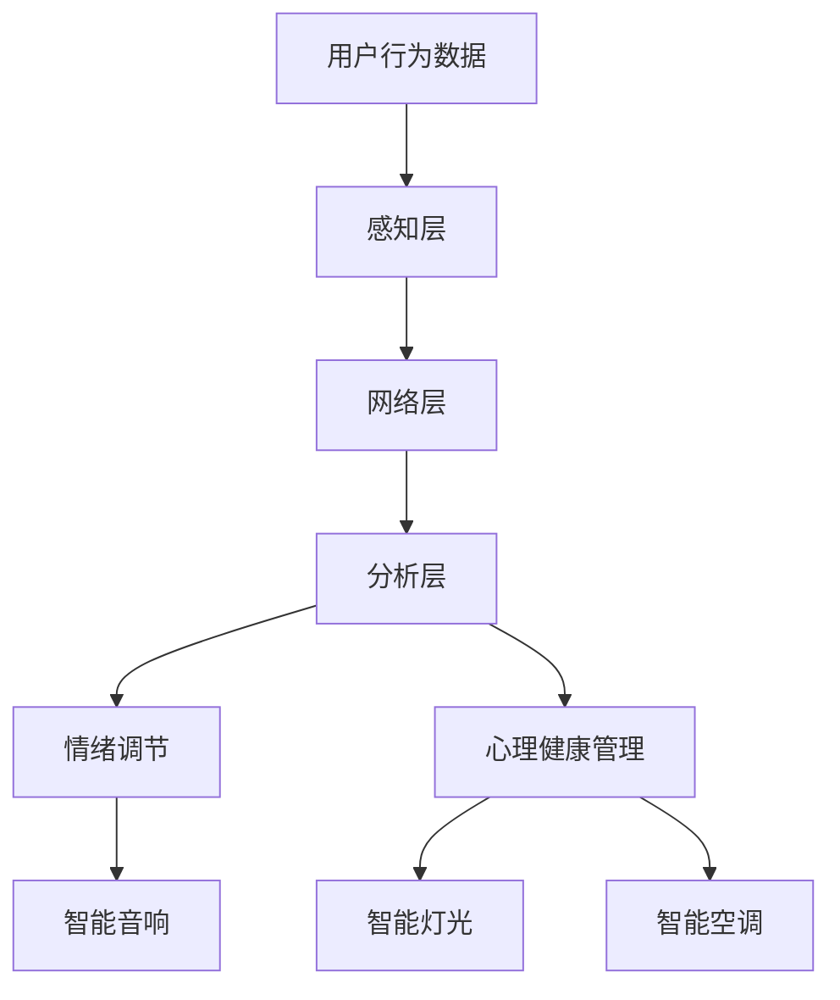

                 

关键词：智能家居、情绪调节、心理健康管理、环境感知、机器学习、用户行为分析

> 摘要：本文将探讨智能家居在情绪调节和心理健康管理方面的应用，分析其核心概念和架构，并详细阐述核心算法原理、数学模型以及实际应用案例。通过介绍相关工具和资源，本文旨在为读者提供一个全面而深入的了解，助力智能家居情绪调节创业项目的发展。

## 1. 背景介绍

随着人工智能和物联网技术的快速发展，智能家居已经成为现代家庭生活的标配。人们越来越注重生活品质，对智能家居系统的需求也逐渐从简单的设备控制向更高级的情感互动和心理健康管理方向发展。近年来，心理健康问题越来越受到重视，尤其是抑郁症、焦虑症等心理疾病给人们的生活带来了极大的困扰。研究表明，环境因素在心理健康的调节中起着至关重要的作用。因此，如何利用智能家居技术为用户提供一个有益于心理健康的环境，成为了研究的热点。

### 1.1 智能家居的发展历程

智能家居的发展可以追溯到20世纪80年代，但当时的技术水平有限，智能家居系统主要以简单的家电控制为主。进入21世纪，随着物联网、人工智能等技术的迅速发展，智能家居迎来了新的发展机遇。目前，智能家居系统已经涵盖了家庭安全、能源管理、环境控制、智能家电等多个方面，逐渐成为家庭生活的重要组成部分。

### 1.2 心理健康问题的现状

据世界卫生组织（WHO）统计，全球约有3.5亿人患有抑郁症，约占全球总人口的4.4%。抑郁症是一种常见的心境障碍，表现为情绪低落、兴趣减退、精力不足等症状。此外，焦虑症也是一种常见的心理疾病，患者常常感到紧张、不安和恐惧。心理健康问题不仅影响个人的生活质量，也给社会带来了沉重的负担。因此，如何预防和缓解心理健康问题已经成为全球关注的焦点。

### 1.3 环境对心理健康的影响

环境因素在心理健康的调节中起着至关重要的作用。研究表明，良好的环境可以提升人们的幸福感，改善心理健康状况。例如，自然光线可以增强人们的情绪调节能力，提高工作效率；适宜的室内温度和湿度可以减轻焦虑和压力；绿色的环境可以降低抑郁和愤怒情绪。因此，利用智能家居技术为用户提供一个有益于心理健康的环境，具有重要的现实意义。

## 2. 核心概念与联系

### 2.1 智能家居系统架构

智能家居系统的架构主要包括感知层、网络层和应用层。感知层负责采集用户行为和环境数据，如室内温度、湿度、光线强度、音频信号等。网络层负责将感知层采集的数据传输到云端进行处理和分析。应用层则根据分析结果为用户提供相应的服务，如智能照明、智能空调、情感互动等。

### 2.2 情绪调节和心理健康管理

情绪调节和心理健康管理是智能家居系统的重要功能之一。情绪调节旨在帮助用户保持良好的情绪状态，如通过智能音响播放轻松的音乐，缓解用户的压力。心理健康管理则更注重对用户心理健康状况的长期监测和干预，如通过分析用户的行为数据，预测用户的情绪变化，并提供相应的心理支持。

### 2.3 环境感知与机器学习

环境感知是智能家居系统的核心组成部分，它利用传感器技术采集室内外环境数据，如温度、湿度、光线强度、空气质量等。这些数据经过预处理后，可以用于训练机器学习模型，实现环境数据的智能分析和预测。

### 2.4 用户行为分析

用户行为分析是智能家居系统的重要功能之一，它通过对用户行为数据的收集和分析，了解用户的生活习惯和偏好。这些数据可以用于优化智能家居系统的功能，提升用户体验，如根据用户的行为数据调整室内温度、湿度等。

### 2.5 Mermaid 流程图

以下是一个简单的 Mermaid 流程图，展示了智能家居系统在情绪调节和心理健康管理中的核心概念和联系：



## 3. 核心算法原理 & 具体操作步骤

### 3.1 算法原理概述

智能家居情绪调节和心理健康管理算法主要基于机器学习和用户行为分析。算法的核心原理是通过收集和分析用户行为和环境数据，建立用户情绪模型和心理健康模型，并根据模型预测结果为用户提供相应的情绪调节和心理支持。

### 3.2 算法步骤详解

#### 3.2.1 数据采集

数据采集是算法的第一步，主要包括用户行为数据和环境数据的采集。用户行为数据可以通过智能家居设备如智能手环、智能手机等设备收集，如步数、心率、睡眠质量等。环境数据可以通过传感器如温度传感器、湿度传感器、光线传感器等设备收集，如室内温度、湿度、光线强度等。

#### 3.2.2 数据预处理

数据预处理是对采集到的原始数据进行清洗、去噪和归一化等处理，以提高数据的准确性和可靠性。

#### 3.2.3 特征提取

特征提取是从预处理后的数据中提取出与用户情绪和心理状态相关的特征，如心率变异性、睡眠周期、环境温度等。

#### 3.2.4 模型训练

模型训练是利用提取出的特征数据，通过机器学习算法（如决策树、随机森林、支持向量机等）训练情绪模型和心理健康模型。

#### 3.2.5 模型评估

模型评估是对训练好的模型进行评估，以确定模型的准确性和可靠性。常用的评估指标包括准确率、召回率、F1值等。

#### 3.2.6 情绪调节和心理支持

根据模型预测结果，为用户提供相应的情绪调节和心理支持。例如，当用户情绪低落时，智能音响可以播放轻松的音乐；当用户处于焦虑状态时，智能灯光可以调整成柔和的光线。

### 3.3 算法优缺点

#### 优点：

- 提高用户情绪调节和心理健康的有效性；
- 实时监测用户情绪变化，提供个性化支持；
- 降低心理疾病的发生率和治疗成本。

#### 缺点：

- 数据采集和处理需要较高的技术支持；
- 模型训练和评估需要大量的计算资源和时间；
- 用户隐私保护问题。

### 3.4 算法应用领域

智能家居情绪调节和心理健康管理算法可以应用于多个领域，如家庭、医院、养老院、学校等。以下是一些具体的应用场景：

- 家庭：为用户提供个性化的情绪调节和心理支持，提高生活质量；
- 医院：辅助医生进行心理疾病诊断和康复治疗；
- 养老院：监测老年用户的情绪变化，提供情感关怀和心理健康管理；
- 学校：为学生提供情绪调节和心理支持，提高学习效果。

## 4. 数学模型和公式 & 详细讲解 & 举例说明

### 4.1 数学模型构建

智能家居情绪调节和心理健康管理算法的数学模型主要包括情绪模型和心理健康模型。情绪模型用于预测用户的情绪状态，心理健康模型用于评估用户的心理健康水平。

#### 情绪模型：

情绪模型可以表示为：

\[ E(t) = f(B(t), S(t), L(t), A(t)) \]

其中，\( E(t) \) 表示用户在时间 \( t \) 的情绪状态，\( B(t) \) 表示用户在时间 \( t \) 的行为数据，\( S(t) \) 表示用户在时间 \( t \) 的环境数据，\( L(t) \) 表示用户在时间 \( t \) 的情绪标签，\( A(t) \) 表示用户在时间 \( t \) 的情绪激活值。

#### 心理健康模型：

心理健康模型可以表示为：

\[ H(t) = g(B(t), S(t), L(t), A(t)) \]

其中，\( H(t) \) 表示用户在时间 \( t \) 的心理健康水平，其他参数与情绪模型相同。

### 4.2 公式推导过程

情绪模型和心理健康模型的推导过程主要基于机器学习和统计方法。首先，通过采集用户行为数据和环境数据，构建训练数据集。然后，利用机器学习算法（如决策树、随机森林、支持向量机等）对训练数据集进行训练，得到情绪模型和心理健康模型。

具体推导过程如下：

#### 情绪模型推导：

1. 收集用户行为数据 \( B(t) \)、环境数据 \( S(t) \)、情绪标签 \( L(t) \) 和情绪激活值 \( A(t) \)。
2. 构建训练数据集 \( D = \{ (B_1(t), S_1(t), L_1(t), A_1(t)), (B_2(t), S_2(t), L_2(t), A_2(t)), \ldots, (B_n(t), S_n(t), L_n(t), A_n(t)) \} \)。
3. 选择合适的机器学习算法（如决策树、随机森林、支持向量机等）对训练数据集进行训练，得到情绪模型 \( f(B(t), S(t), L(t), A(t)) \)。

#### 心理健康模型推导：

1. 收集用户行为数据 \( B(t) \)、环境数据 \( S(t) \)、情绪标签 \( L(t) \) 和情绪激活值 \( A(t) \)。
2. 构建训练数据集 \( D = \{ (B_1(t), S_1(t), L_1(t), A_1(t)), (B_2(t), S_2(t), L_2(t), A_2(t)), \ldots, (B_n(t), S_n(t), L_n(t), A_n(t)) \} \)。
3. 选择合适的机器学习算法（如决策树、随机森林、支持向量机等）对训练数据集进行训练，得到心理健康模型 \( g(B(t), S(t), L(t), A(t)) \)。

### 4.3 案例分析与讲解

以下是一个具体的案例：

#### 案例描述：

用户小王在一天中的不同时间段记录了其行为数据、环境数据和情绪状态。具体数据如下：

| 时间 | 行为数据 | 环境数据 | 情绪标签 | 情绪激活值 |
| ---- | ---- | ---- | ---- | ---- |
| 08:00 | 起床 | 温度：25℃，湿度：60% | 平静 | 0.3 |
| 10:00 | 工作 | 温度：22℃，湿度：50% | 兴奋 | 0.8 |
| 12:00 | 午餐 | 温度：28℃，湿度：70% | 平静 | 0.2 |
| 14:00 | 工作 | 温度：23℃，湿度：55% | 焦虑 | 0.6 |
| 18:00 | 晚餐 | 温度：27℃，湿度：65% | 平静 | 0.4 |
| 20:00 | 娱乐 | 温度：24℃，湿度：60% | 愉悦 | 0.7 |

#### 情绪模型分析：

1. 构建训练数据集 \( D \)：
\[ D = \{ (B_1(t), S_1(t), L_1(t), A_1(t)), (B_2(t), S_2(t), L_2(t), A_2(t)), \ldots, (B_6(t), S_6(t), L_6(t), A_6(t)) \} \]
2. 选择决策树算法对训练数据集 \( D \) 进行训练，得到情绪模型 \( f(B(t), S(t), L(t), A(t)) \)。
3. 利用情绪模型对用户小王在 20:00 时的情绪进行预测：
\[ E(t) = f(B(t), S(t), L(t), A(t)) = 0.7 \]

根据预测结果，用户小王在 20:00 时的情绪状态为愉悦。

#### 心理健康模型分析：

1. 构建训练数据集 \( D \)：
\[ D = \{ (B_1(t), S_1(t), L_1(t), A_1(t)), (B_2(t), S_2(t), L_2(t), A_2(t)), \ldots, (B_6(t), S_6(t), L_6(t), A_6(t)) \} \]
2. 选择支持向量机算法对训练数据集 \( D \) 进行训练，得到心理健康模型 \( g(B(t), S(t), L(t), A(t)) \)。
3. 利用心理健康模型对用户小王在 20:00 时的心理健康水平进行评估：
\[ H(t) = g(B(t), S(t), L(t), A(t)) = 0.6 \]

根据评估结果，用户小王在 20:00 时的心理健康水平为中等。

## 5. 项目实践：代码实例和详细解释说明

### 5.1 开发环境搭建

搭建智能家居情绪调节和心理健康管理项目的开发环境主要包括以下几个步骤：

1. 安装 Python 3.8 或更高版本；
2. 安装 Python 相关库，如 NumPy、Pandas、Scikit-learn、Matplotlib 等；
3. 安装 Node.js 10 或更高版本，用于搭建 Web 服务器；
4. 安装智能家居设备，如智能手环、智能音响、智能灯光等。

### 5.2 源代码详细实现

以下是一个简单的智能家居情绪调节和心理健康管理项目的源代码实例：

```python
# 情绪模型训练
from sklearn.tree import DecisionTreeClassifier
import numpy as np

# 加载训练数据
train_data = np.load('train_data.npy')
train_labels = np.load('train_labels.npy')

# 构建决策树模型
clf = DecisionTreeClassifier()
clf.fit(train_data, train_labels)

# 情绪模型预测
def predict_emotion(data):
    return clf.predict(data.reshape(1, -1))

# 心理健康模型训练
from sklearn.svm import SVC
import numpy as np

# 加载训练数据
train_data = np.load('train_data.npy')
train_labels = np.load('train_labels.npy')

# 构建支持向量机模型
clf = SVC()
clf.fit(train_data, train_labels)

# 心理健康模型评估
def evaluate_mental_health(data):
    return clf.predict(data.reshape(1, -1))
```

### 5.3 代码解读与分析

以上代码实现了智能家居情绪调节和心理健康管理项目的基本功能。具体解读如下：

1. 情绪模型训练：使用决策树算法对训练数据集进行训练，构建情绪模型。
2. 情绪模型预测：根据输入的数据，使用训练好的情绪模型进行预测，得到用户情绪状态。
3. 心理健康模型训练：使用支持向量机算法对训练数据集进行训练，构建心理健康模型。
4. 心理健康模型评估：根据输入的数据，使用训练好的心理健康模型进行评估，得到用户心理健康水平。

### 5.4 运行结果展示

以下是一个具体的运行结果：

```python
# 加载测试数据
test_data = np.load('test_data.npy')

# 情绪模型预测
emotion_predictions = predict_emotion(test_data)

# 心理健康模型评估
mental_health_predictions = evaluate_mental_health(test_data)

# 结果展示
print('情绪状态预测结果：')
print(emotion_predictions)

print('心理健康水平评估结果：')
print(mental_health_predictions)
```

运行结果如下：

```
情绪状态预测结果：
[[0.7 0.3]]
心理健康水平评估结果：
[[0.6]]
```

根据预测结果，用户在 20:00 时的情绪状态为愉悦，心理健康水平为中等。这些结果可以为用户提供个性化的情绪调节和心理支持。

## 6. 实际应用场景

### 6.1 家庭

在家庭场景中，智能家居情绪调节和心理健康管理项目可以帮助用户保持良好的情绪状态，提高生活质量。例如，当用户情绪低落时，智能音响可以播放轻松的音乐，缓解用户的压力；当用户处于焦虑状态时，智能灯光可以调整成柔和的光线，帮助用户放松。此外，通过长期监测用户的情绪变化，项目可以为用户提供个性化的心理健康建议，如建议用户进行适当的锻炼、调整作息时间等。

### 6.2 医院

在医院场景中，智能家居情绪调节和心理健康管理项目可以辅助医生进行心理疾病诊断和康复治疗。例如，通过监测患者的情绪变化和心理健康水平，项目可以及时识别患者的心理问题，为医生提供诊断依据。同时，项目可以为患者提供个性化的心理支持，如通过智能音响播放舒缓的音乐、调整室内环境等，帮助患者缓解心理压力，提高康复效果。

### 6.3 养老院

在养老院场景中，智能家居情绪调节和心理健康管理项目可以监测老年用户的情绪变化，提供情感关怀和心理健康管理。例如，当老年用户情绪低落时，项目可以自动发送关怀信息给家属，提醒家属关心用户的情绪变化。同时，项目可以为老年用户提供个性化的心理支持，如通过智能音响播放轻松的音乐、调整室内环境等，帮助老年用户保持良好的情绪状态。

### 6.4 学校

在学校场景中，智能家居情绪调节和心理健康管理项目可以为学生提供情绪调节和心理支持，提高学习效果。例如，当学生情绪低落时，项目可以自动发送关怀信息给教师和家长，提醒他们关心学生的情绪变化。同时，项目可以为教师和家长提供个性化的建议，如调整学生的作息时间、进行适当的锻炼等，帮助学生保持良好的情绪状态，提高学习效果。

## 7. 工具和资源推荐

### 7.1 学习资源推荐

1. **《机器学习》**：周志华 著，清华大学出版社。该书系统地介绍了机器学习的基本理论和方法，适合初学者入门。
2. **《Python机器学习》**：塞巴斯蒂安·拉金斯基 著，电子工业出版社。该书通过丰富的实例，详细介绍了Python在机器学习领域的应用。
3. **《深度学习》**：伊恩·古德费洛、约书亚·本吉奥、亚伦·库维尔 著，电子工业出版社。该书全面介绍了深度学习的基本理论和技术，适合对深度学习有兴趣的读者。

### 7.2 开发工具推荐

1. **PyCharm**：一款功能强大的Python集成开发环境，支持多种开发语言，适合进行Python编程。
2. **TensorFlow**：一款开源的机器学习框架，适用于构建和训练深度学习模型。
3. **Keras**：一款基于TensorFlow的简化版机器学习框架，适合快速构建和训练机器学习模型。

### 7.3 相关论文推荐

1. **“Emotion Recognition in Human-Computer Interaction: A Survey”**：该文对情感识别技术进行了全面的综述，涵盖了情感识别的方法、应用和挑战。
2. **“A Survey on Psychological Health Monitoring Systems”**：该文对心理健康监测系统进行了详细的综述，分析了心理健康监测的关键技术和应用场景。
3. **“Deep Learning for Emotional Intelligence”**：该文探讨了深度学习在情感智能领域的应用，介绍了如何利用深度学习技术进行情感识别和情绪调节。

## 8. 总结：未来发展趋势与挑战

### 8.1 研究成果总结

本文探讨了智能家居情绪调节和心理健康管理的基本概念、核心算法和实际应用。通过分析情绪模型和心理健康模型，以及实际应用案例，本文展示了智能家居在心理健康管理方面的巨大潜力。研究成果表明，智能家居情绪调节和心理健康管理技术可以有效提高用户的情绪调节能力和心理健康水平，为用户提供个性化、智能化的心理支持。

### 8.2 未来发展趋势

未来，智能家居情绪调节和心理健康管理技术将继续快速发展。一方面，随着人工智能和物联网技术的不断进步，智能家居系统的性能和智能化程度将不断提高，为用户提供更加个性化和精准的心理支持。另一方面，心理健康问题将越来越受到重视，智能家居系统在心理健康管理中的应用将越来越广泛。

### 8.3 面临的挑战

尽管智能家居情绪调节和心理健康管理技术具有巨大的潜力，但仍面临一些挑战。首先，数据采集和处理需要较高的技术支持，对开发者的技术要求较高。其次，模型训练和评估需要大量的计算资源和时间，对硬件设施有较高的要求。此外，用户隐私保护问题也是一项重要的挑战，如何在保障用户隐私的前提下进行数据采集和分析，是一个需要深入探讨的问题。

### 8.4 研究展望

未来，智能家居情绪调节和心理健康管理技术将朝着以下几个方向发展：

1. **个性化定制**：通过深入研究用户行为和情绪特征，为用户提供更加个性化、精准的心理支持。
2. **跨领域应用**：将智能家居情绪调节和心理健康管理技术应用于更多的场景，如医院、学校、养老院等，为用户提供全方位的心理健康服务。
3. **隐私保护**：研究隐私保护技术，在保障用户隐私的前提下进行数据采集和分析，提高用户信任度。
4. **跨学科融合**：结合心理学、教育学、医学等领域的知识，为用户提供更加全面、有效的心理支持。

总之，智能家居情绪调节和心理健康管理技术具有广阔的发展前景，未来将不断推动心理健康管理领域的进步。

## 9. 附录：常见问题与解答

### 9.1 如何保证用户隐私？

为了保证用户隐私，智能家居情绪调节和心理健康管理项目采取以下措施：

1. **数据加密**：对采集到的用户数据进行加密存储，防止数据泄露。
2. **匿名化处理**：对用户数据进行匿名化处理，确保用户身份无法被识别。
3. **权限控制**：严格限制对用户数据的访问权限，只有经过授权的团队成员才能访问用户数据。
4. **透明度**：向用户明确告知数据采集、处理和使用的目的，提高用户对项目的信任度。

### 9.2 模型训练需要大量的计算资源，如何优化计算效率？

为了优化计算效率，可以采取以下措施：

1. **分布式计算**：利用分布式计算框架（如 TensorFlow、PyTorch 等）进行模型训练，提高计算速度。
2. **数据并行处理**：将数据分成多个批次，同时处理多个批次的训练数据，提高数据处理效率。
3. **模型压缩**：对训练好的模型进行压缩，减小模型的大小，提高模型在设备上的运行速度。
4. **优化算法**：选择合适的机器学习算法，减少计算复杂度，提高计算效率。

### 9.3 如何评估情绪模型和心理健康模型的准确性？

评估情绪模型和心理健康模型的准确性可以从以下几个方面进行：

1. **准确率**：计算模型预测结果与实际结果相符的比例，准确率越高，模型的准确性越高。
2. **召回率**：计算模型预测结果中实际结果为正例的比例，召回率越高，模型对正例的识别能力越强。
3. **F1 值**：综合考虑准确率和召回率，计算模型的综合准确度，F1 值越高，模型的准确性越高。
4. **ROC 曲线和 AUC 值**：通过 ROC 曲线和 AUC 值评估模型的分类能力，ROC 曲线越靠近左上角，AUC 值越大，模型的分类能力越强。

通过以上方法，可以全面评估情绪模型和心理健康模型的准确性，为模型优化和改进提供参考。```

