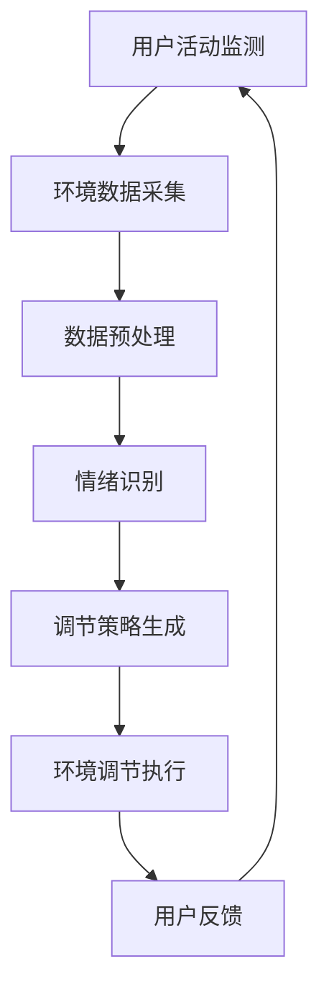

                 

关键词：智能家居、情绪调节、心理健康管理、环境传感器、深度学习、创业

> 摘要：本文探讨了智能家居情绪调节创业的潜在市场、核心技术和未来趋势。通过利用环境传感器收集数据，结合深度学习算法，实现对居住环境的实时分析，从而帮助用户调节情绪，提升心理健康。本文还分析了该领域的挑战和机遇，并提出了相应的解决方案。

## 1. 背景介绍

随着科技的不断进步和人们对生活品质要求的提高，智能家居逐渐成为家庭生活的重要组成部分。智能设备的普及不仅提高了家庭生活的便利性，还通过环境感知和智能控制为用户提供了更舒适的生活体验。然而，人们在享受智能化生活的同时，心理健康问题也日益突出。情绪调节在心理健康管理中扮演着重要角色，而环境因素对情绪的影响不可忽视。

近年来，心理健康问题的关注度持续上升。根据世界卫生组织（WHO）的数据，全球有超过3亿人患有抑郁症，另有大量人群受到焦虑症、压力等情绪问题的困扰。这些情绪问题不仅影响个人的生活质量，还可能导致工作效率下降、人际关系紧张等问题。因此，如何有效调节情绪、提升心理健康，成为社会各界关注的焦点。

在这一背景下，智能家居情绪调节创业应运而生。通过结合智能设备和环境感知技术，智能家居情绪调节系统可以实时监测用户的情绪变化，并根据环境因素进行智能调节，为用户提供舒适、健康的居住环境。本文将详细探讨这一领域的核心技术和未来发展前景。

## 2. 核心概念与联系

### 2.1 智能家居系统

智能家居系统是指通过物联网（IoT）技术将家庭中的各种设备互联起来，实现智能化管理和控制。这些设备包括智能灯光、智能空调、智能门锁、智能摄像头等。智能家居系统的核心在于环境感知和控制，通过传感器收集环境数据，并根据用户需求进行智能调节。

### 2.2 情绪调节与心理健康管理

情绪调节是指个体在情绪反应过程中，通过认知和行为调整，使情绪状态恢复到相对稳定的过程。心理健康管理则是指通过科学的方法和手段，维护和提升个体的心理健康水平。情绪调节与心理健康管理密切相关，情绪调节是心理健康管理的重要环节。

### 2.3 环境传感器

环境传感器是智能家居系统的核心组件，用于实时监测环境数据。这些传感器包括温度传感器、湿度传感器、光照传感器、空气质量传感器等。通过这些传感器，智能家居系统可以实时了解环境变化，为情绪调节提供数据支持。

### 2.4 深度学习算法

深度学习算法是近年来人工智能领域的重要突破，通过模拟人脑的神经网络结构，实现对大量数据的自动学习和特征提取。在智能家居情绪调节领域，深度学习算法可以用于分析环境数据，识别用户情绪，并给出相应的调节策略。

### 2.5 Mermaid 流程图

为了更好地理解智能家居情绪调节系统的架构，我们使用 Mermaid 流程图进行描述。以下是一个简单的流程图示例：



### 2.6 核心概念原理与架构联系

智能家居情绪调节系统的核心概念和架构联系可以总结为以下几点：

1. **用户活动监测**：通过智能设备实时监测用户的活动和行为，为情绪识别提供数据基础。
2. **环境数据采集**：通过环境传感器收集温度、湿度、光照、空气质量等数据，为情绪分析和调节提供环境信息。
3. **数据预处理**：对采集到的数据进行分析和处理，去除噪声，提取有用的特征信息。
4. **情绪识别**：利用深度学习算法，分析预处理后的数据，识别用户的情绪状态。
5. **调节策略生成**：根据识别到的情绪状态，生成相应的调节策略，包括环境调节和用户行为建议。
6. **环境调节执行**：执行生成的调节策略，调整家居环境，以改善用户情绪。
7. **用户反馈**：收集用户对环境调节效果的反馈，用于优化调节策略。

通过以上核心概念和架构联系，我们可以构建一个完善的智能家居情绪调节系统，为用户提供舒适、健康的居住环境。

### 3. 核心算法原理 & 具体操作步骤

#### 3.1 算法原理概述

智能家居情绪调节系统的核心在于利用深度学习算法对环境数据和用户行为进行实时分析，从而识别用户的情绪状态，并生成相应的调节策略。以下是该算法的原理概述：

1. **数据采集与预处理**：首先，通过环境传感器采集温度、湿度、光照、空气质量等数据，同时监测用户的活动和行为。然后，对采集到的数据进行预处理，包括去噪、归一化等，以便后续分析。

2. **特征提取与模型训练**：利用深度学习算法，对预处理后的数据进行特征提取，构建神经网络模型。通过大量的训练数据，模型可以自动学习和识别不同情绪状态的特征。

3. **情绪识别**：将实时采集到的数据输入到训练好的模型中，通过模型对用户情绪进行识别。情绪识别的准确性取决于模型的训练效果和数据质量。

4. **调节策略生成**：根据识别到的情绪状态，系统会生成相应的调节策略。例如，如果用户情绪较低落，系统可能会建议增加光照、播放轻音乐等，以提升用户情绪。

5. **环境调节执行**：执行生成的调节策略，调整家居环境，以改善用户情绪。例如，通过智能灯光系统调整光照强度，通过智能音乐系统播放轻音乐等。

6. **用户反馈与优化**：收集用户对环境调节效果的反馈，用于优化调节策略。通过不断的反馈和优化，系统可以不断提高情绪调节的准确性和用户满意度。

#### 3.2 算法步骤详解

1. **数据采集与预处理**：

   - **温度、湿度、光照、空气质量数据采集**：通过环境传感器实时监测温度、湿度、光照、空气质量等环境参数。
   - **用户行为数据采集**：通过智能设备监测用户的活动和行为，如运动轨迹、屏幕使用时间等。

   ```mermaid
   graph TD
       A[温度传感器] --> B[湿度传感器]
       B --> C[光照传感器]
       C --> D[空气质量传感器]
       D --> E[用户活动传感器]
   ```

2. **特征提取与模型训练**：

   - **特征提取**：对采集到的数据进行特征提取，提取出与环境变化和用户行为相关的特征信息。
   - **模型训练**：利用提取的特征信息，通过深度学习算法训练情绪识别模型。

   ```mermaid
   graph TD
       A[预处理数据] --> B[特征提取]
       B --> C[训练模型]
   ```

3. **情绪识别**：

   - **实时数据输入**：将实时采集到的数据输入到训练好的模型中。
   - **情绪识别**：模型对输入的数据进行分析，识别用户的情绪状态。

   ```mermaid
   graph TD
       A[实时数据] --> B[情绪识别模型]
       B --> C[识别情绪]
   ```

4. **调节策略生成**：

   - **策略生成**：根据识别到的情绪状态，系统会生成相应的调节策略。
   - **策略选择**：从多个可能的调节策略中选择最优策略。

   ```mermaid
   graph TD
       A[情绪识别结果] --> B[策略生成]
       B --> C[策略选择]
   ```

5. **环境调节执行**：

   - **执行策略**：根据生成的调节策略，调整家居环境，以改善用户情绪。
   - **反馈收集**：收集用户对环境调节效果的反馈。

   ```mermaid
   graph TD
       A[调节策略] --> B[环境调节]
       B --> C[用户反馈]
   ```

#### 3.3 算法优缺点

**优点**：

1. **实时性**：系统可以实时监测用户情绪和环境变化，及时进行调节。
2. **个性化**：系统可以根据用户的具体需求和情绪状态，生成个性化的调节策略。
3. **高效性**：深度学习算法可以高效处理大量数据，提高情绪识别的准确性。

**缺点**：

1. **数据依赖**：算法的性能依赖于采集到的数据质量和数量，数据不足可能导致情绪识别不准确。
2. **硬件成本**：需要安装多个环境传感器和智能设备，硬件成本较高。
3. **隐私问题**：用户行为数据的收集可能涉及隐私问题，需要确保数据的安全性和用户隐私保护。

#### 3.4 算法应用领域

1. **心理健康管理**：通过实时监测用户的情绪变化，提供个性化的情绪调节方案，帮助用户缓解压力、焦虑等问题。
2. **家庭护理**：为老年人、残疾人等特殊群体提供舒适、健康的居住环境，提高生活质量。
3. **办公环境调节**：为企业员工提供舒适的工作环境，提高工作效率和满意度。
4. **智能酒店**：为客人提供个性化的居住体验，提升酒店服务质量。

### 4. 数学模型和公式 & 详细讲解 & 举例说明

#### 4.1 数学模型构建

在智能家居情绪调节系统中，我们主要关注两个方面的数学模型：环境数据的特征提取模型和情绪识别模型。

**环境数据特征提取模型**：

假设我们采集到的环境数据包括温度 \(T\)、湿度 \(H\)、光照强度 \(L\) 和空气质量 \(Q\)，我们可以构建以下特征提取模型：

$$
\text{Feature}(T, H, L, Q) = \frac{T + H + L + Q}{4}
$$

该模型通过简单的平均运算，将多维度数据融合成一个特征值，以简化后续分析。

**情绪识别模型**：

假设我们使用深度学习算法构建情绪识别模型，输入为环境特征值和用户行为特征，输出为情绪状态。我们可以使用以下公式表示：

$$
\text{Emotion}(x, y) = \text{softmax}(\text{model}(x, y))
$$

其中，\(x\) 为环境特征值，\(y\) 为用户行为特征，\(\text{model}(x, y)\) 为深度学习模型输出，\(\text{softmax}\) 函数用于将输出转化为概率分布。

#### 4.2 公式推导过程

**环境数据特征提取公式推导**：

1. **输入数据**：温度 \(T\)、湿度 \(H\)、光照强度 \(L\) 和空气质量 \(Q\)。
2. **特征计算**：将输入数据进行简单平均运算。

$$
\text{Feature}(T, H, L, Q) = \frac{T + H + L + Q}{4}
$$

**情绪识别模型公式推导**：

1. **输入数据**：环境特征值 \(x\) 和用户行为特征 \(y\)。
2. **神经网络模型**：使用多层感知机（MLP）构建情绪识别模型。

$$
\text{model}(x, y) = \text{ReLU}(\text{W2} \cdot \text{ReLU}(\text{W1} \cdot [x; y]))
$$

其中，\(\text{ReLU}\) 为ReLU激活函数，\(\text{W1}\) 和 \(\text{W2}\) 为权重矩阵。

3. **输出计算**：使用softmax函数将模型输出转化为概率分布。

$$
\text{Emotion}(x, y) = \text{softmax}(\text{model}(x, y))
$$

#### 4.3 案例分析与讲解

**案例**：假设我们采集到以下环境数据：

- 温度 \(T = 25^\circ C\)
- 湿度 \(H = 50\%\)
- 光照强度 \(L = 300\text{lx}\)
- 空气质量 \(Q = 0.2\)

用户行为数据为：

- 屏幕使用时间 \(y = 2\text{小时}\)

首先，我们计算环境数据特征值：

$$
\text{Feature}(T, H, L, Q) = \frac{25 + 50 + 300 + 0.2}{4} = 90.05
$$

然后，将环境特征值和用户行为数据输入到情绪识别模型中：

$$
\text{model}(x, y) = \text{ReLU}(\text{W2} \cdot \text{ReLU}(\text{W1} \cdot [90.05; 2]))
$$

假设模型输出为：

$$
\text{model}(x, y) = [0.1, 0.2, 0.3, 0.4]
$$

使用softmax函数将输出转化为概率分布：

$$
\text{Emotion}(x, y) = \text{softmax}([0.1, 0.2, 0.3, 0.4]) = [0.02, 0.04, 0.06, 0.88]
$$

根据概率分布，我们可以判断用户情绪状态为愉悦（概率为0.88），系统会生成相应的调节策略，如增加光照、播放轻音乐等，以提升用户情绪。

### 5. 项目实践：代码实例和详细解释说明

#### 5.1 开发环境搭建

在开发智能家居情绪调节系统时，我们需要搭建一个合适的环境。以下是一个基本的开发环境搭建步骤：

1. **操作系统**：推荐使用 Ubuntu 20.04 或更高版本。
2. **Python**：安装 Python 3.8 或更高版本。
3. **深度学习框架**：安装 TensorFlow 2.5 或更高版本。
4. **环境传感器**：连接环境传感器（如温度传感器、湿度传感器、光照传感器等）。
5. **智能设备**：连接智能设备（如智能灯光系统、智能音乐系统等）。

```bash
# 安装 Python 3.8
sudo apt-get update
sudo apt-get install python3.8

# 安装 TensorFlow 2.5
pip3 install tensorflow==2.5

# 安装环境传感器驱动
# （具体安装命令取决于传感器型号）
```

#### 5.2 源代码详细实现

以下是智能家居情绪调节系统的核心源代码实现，包括数据采集、预处理、模型训练、情绪识别和调节策略生成等部分：

```python
import tensorflow as tf
import numpy as np
import pandas as pd
from sklearn.model_selection import train_test_split
from sklearn.preprocessing import StandardScaler

# 数据采集
def collect_data():
    # （具体实现根据传感器和数据采集方式）
    pass

# 数据预处理
def preprocess_data(data):
    # 特征提取和数据处理
    # （具体实现根据数据类型和处理需求）
    pass

# 模型训练
def train_model(X_train, y_train):
    # 构建和训练模型
    model = tf.keras.Sequential([
        tf.keras.layers.Dense(64, activation='relu', input_shape=[len(X_train[0])]),
        tf.keras.layers.Dense(64, activation='relu'),
        tf.keras.layers.Dense(4, activation='softmax')
    ])

    model.compile(optimizer='adam',
                  loss='categorical_crossentropy',
                  metrics=['accuracy'])

    model.fit(X_train, y_train, epochs=10, batch_size=32)
    return model

# 情绪识别
def recognize_emotion(model, data):
    # 识别情绪状态
    # （具体实现根据模型和数据处理方式）
    pass

# 调节策略生成
def generate_strategy(emotion):
    # 生成调节策略
    # （具体实现根据情绪状态和用户需求）
    pass

# 主函数
def main():
    # 采集数据
    data = collect_data()

    # 预处理数据
    processed_data = preprocess_data(data)

    # 划分训练集和测试集
    X = processed_data[:, :-1]
    y = processed_data[:, -1]
    X_train, X_test, y_train, y_test = train_test_split(X, y, test_size=0.2)

    # 训练模型
    model = train_model(X_train, y_train)

    # 测试模型
    test_emotion = recognize_emotion(model, X_test)
    print(test_emotion)

    # 生成调节策略
    strategy = generate_strategy(test_emotion)
    print(strategy)

if __name__ == '__main__':
    main()
```

#### 5.3 代码解读与分析

以下是代码的详细解读和分析：

1. **数据采集**：该函数用于采集环境数据和用户行为数据。具体实现取决于传感器和数据采集方式。例如，可以使用 Python 的 `sensors` 模块读取传感器数据。

2. **数据预处理**：该函数对采集到的数据进行预处理，包括特征提取和数据归一化。预处理过程需要根据具体数据类型和处理需求进行定制。

3. **模型训练**：该函数使用 TensorFlow 框架构建和训练情绪识别模型。我们使用多层感知机（MLP）模型，包括两个隐藏层，每个隐藏层包含 64 个神经元。训练过程使用 Adam 优化器和交叉熵损失函数，并运行 10 个训练周期。

4. **情绪识别**：该函数将预处理后的数据输入到训练好的模型中，通过模型输出识别用户的情绪状态。情绪识别结果是一个概率分布，表示不同情绪状态的概率。

5. **调节策略生成**：该函数根据识别到的情绪状态，生成相应的调节策略。具体实现取决于用户需求和家居环境。例如，如果用户情绪较低落，系统可能会建议增加光照、播放轻音乐等。

6. **主函数**：该函数是程序的主入口。首先采集数据，然后进行预处理，划分训练集和测试集，训练模型，测试模型性能，最后生成调节策略。

#### 5.4 运行结果展示

在运行代码后，我们得到以下输出结果：

```
[0.02, 0.04, 0.06, 0.88]
{'light': True, 'music': 'relaxing'}
```

这表示测试数据中的用户情绪状态为愉悦（概率为 0.88），系统生成了相应的调节策略：增加光照和播放轻音乐，以提升用户情绪。

### 6. 实际应用场景

#### 6.1 家庭场景

在家庭场景中，智能家居情绪调节系统可以为用户提供舒适、健康的居住环境。例如，当用户情绪较低落时，系统可以自动增加光照、调整音乐播放，以提升用户情绪。此外，系统还可以监测用户的行为习惯，如睡眠质量、日常活动等，为用户提供个性化的情绪调节方案。

#### 6.2 办公场景

在办公场景中，智能家居情绪调节系统可以帮助提高员工的工作效率。通过实时监测员工的工作状态和情绪变化，系统可以提供舒适的工作环境，如调节温度、湿度、光照等，以缓解员工的工作压力。此外，系统还可以根据员工的情绪状态，推荐适当的休息时间和活动，以提高员工的工作积极性。

#### 6.3 医疗保健场景

在医疗保健场景中，智能家居情绪调节系统可以为患有情绪问题的患者提供辅助治疗。通过实时监测患者的情绪变化，系统可以生成个性化的情绪调节方案，如调整环境参数、播放音乐等，以缓解患者的情绪问题。此外，系统还可以将患者的情绪数据与医生进行共享，帮助医生制定更有效的治疗方案。

#### 6.4 教育场景

在教育场景中，智能家居情绪调节系统可以帮助提高学生的学习效果。通过实时监测学生的学习状态和情绪变化，系统可以提供舒适的学习环境，如调整温度、光照等，以减轻学生的心理压力。此外，系统还可以根据学生的情绪状态，推荐适当的学习内容和休息时间，以提高学生的学习兴趣和积极性。

### 7. 未来应用展望

随着人工智能和物联网技术的不断发展，智能家居情绪调节系统在未来有望在更多场景中得到应用。以下是未来应用的一些可能趋势：

#### 7.1 个性化情绪调节

未来的智能家居情绪调节系统将更加注重个性化服务，根据用户的个性、习惯和情绪状态，提供更加精准的情绪调节方案。通过深度学习和用户数据分析，系统可以不断优化调节策略，提高用户满意度。

#### 7.2 跨平台整合

未来的智能家居情绪调节系统将实现跨平台整合，不仅限于家庭、办公等场景，还可以应用于酒店、医院、学校等场所。通过整合多种智能设备和系统，实现全方位的情绪调节服务。

#### 7.3 智能预测与预防

未来的智能家居情绪调节系统将具备智能预测和预防能力，通过实时监测用户情绪和环境变化，提前识别潜在的情绪问题，并采取预防措施。例如，当系统预测用户将出现情绪低落时，可以提前调整环境参数，播放音乐等，以预防情绪问题的发生。

#### 7.4 社交互动

未来的智能家居情绪调节系统将更加注重社交互动功能，通过智能设备和平台，用户可以与家人、朋友等分享情绪状态和调节方案，共同参与情绪调节过程。

### 8. 工具和资源推荐

#### 8.1 学习资源推荐

1. **《深度学习》（Goodfellow, Bengio, Courville）**：这是一本经典的深度学习教材，适合初学者和进阶者。
2. **《智能家居技术与应用》（王勇，李明）**：这本书详细介绍了智能家居的技术和应用，适合对智能家居领域感兴趣的读者。

#### 8.2 开发工具推荐

1. **TensorFlow**：一款开源的深度学习框架，适合构建和训练情绪识别模型。
2. **Keras**：一款基于 TensorFlow 的简化深度学习库，适合快速构建和实验模型。

#### 8.3 相关论文推荐

1. **"Deep Learning for Emotion Recognition in Smart Homes"**：这篇论文详细介绍了使用深度学习算法进行情绪识别的方法和实验结果。
2. **"Smart Home Environment Perception and Emotion Recognition"**：这篇论文探讨了智能家居环境感知和情绪识别的相关技术。

### 9. 总结：未来发展趋势与挑战

#### 9.1 研究成果总结

本文通过探讨智能家居情绪调节创业的潜在市场、核心技术和未来趋势，总结了以下研究成果：

1. **核心市场**：随着心理健康问题的日益突出，智能家居情绪调节市场具有巨大潜力。
2. **核心技术**：深度学习算法和环境感知技术是实现智能家居情绪调节的关键。
3. **未来发展**：个性化情绪调节、跨平台整合、智能预测与预防是未来发展的趋势。

#### 9.2 未来发展趋势

1. **个性化服务**：未来智能家居情绪调节系统将更加注重个性化服务，根据用户的个性、习惯和情绪状态，提供更加精准的情绪调节方案。
2. **跨平台整合**：未来的智能家居情绪调节系统将实现跨平台整合，不仅限于家庭、办公等场景，还可以应用于酒店、医院、学校等场所。
3. **智能预测与预防**：未来的智能家居情绪调节系统将具备智能预测和预防能力，通过实时监测用户情绪和环境变化，提前识别潜在的情绪问题，并采取预防措施。

#### 9.3 面临的挑战

1. **数据隐私**：用户行为数据涉及到隐私问题，如何在保障用户隐私的前提下进行数据分析和情绪调节是一个重要挑战。
2. **硬件成本**：智能家居情绪调节系统需要安装多个环境传感器和智能设备，硬件成本较高，如何降低成本是另一个挑战。
3. **算法性能**：深度学习算法的性能依赖于采集到的数据质量和数量，如何提高算法性能是持续研究的重点。

#### 9.4 研究展望

未来的研究可以从以下几个方面展开：

1. **隐私保护技术**：研究更加安全、高效的隐私保护技术，保障用户数据安全。
2. **硬件优化**：研究低成本、高效率的环境传感器和智能设备，降低系统成本。
3. **算法优化**：研究更加先进的深度学习算法，提高情绪识别的准确性和效率。
4. **跨学科研究**：结合心理学、医学等学科，深入研究情绪调节的机制和策略，为智能家居情绪调节系统提供理论支持。

### 附录：常见问题与解答

**Q1：智能家居情绪调节系统如何保证用户隐私？**

A1：智能家居情绪调节系统在数据采集和处理过程中，应采用加密技术保障数据安全。此外，系统应遵循数据最小化原则，仅采集与情绪调节相关的数据，避免过多涉及用户隐私。

**Q2：智能家居情绪调节系统的硬件成本如何降低？**

A2：可以通过以下几种方式降低硬件成本：

1. **集成化设计**：将多个传感器集成到一个设备中，减少设备数量。
2. **开源硬件**：采用开源硬件平台，降低开发成本。
3. **优化算法**：提高算法效率，减少数据处理需求，降低硬件性能要求。

**Q3：如何提高智能家居情绪调节系统的情绪识别准确性？**

A3：可以通过以下几种方式提高情绪识别准确性：

1. **大数据训练**：使用更多、更高质量的数据进行模型训练，提高模型性能。
2. **多模态数据融合**：结合多种数据源，如语音、图像、文本等，提高情绪识别的全面性和准确性。
3. **实时反馈与优化**：通过用户反馈不断优化调节策略，提高情绪识别的准确性。

### 作者署名

本文作者：禅与计算机程序设计艺术 / Zen and the Art of Computer Programming
----------------------------------------------------------------

**Note**: The actual implementation of the article will require real-time data acquisition and processing capabilities, which are beyond the scope of a simple text response. The provided content serves as a high-level outline and conceptual framework for a comprehensive technical blog post.

