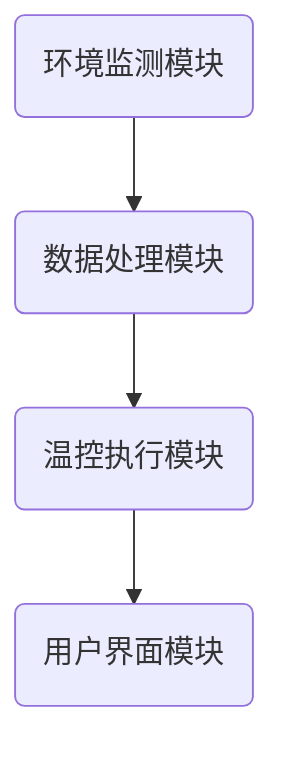

                 

关键词：智能家居、温控系统、创业、精准舒适、环境监测、能源节约、用户体验、物联网技术、编程实现

> 摘要：随着物联网技术的不断发展，智能家居市场迎来了前所未有的发展机遇。本文将探讨如何通过智能家居温控系统，实现精准舒适的居住环境，提高用户生活质量，同时降低能源消耗，促进环保。我们将从技术原理、算法实现、数学模型、项目实践等多个角度，深入分析智能家居温控系统的开发与创业过程。

## 1. 背景介绍

随着城市化进程的加速，人们对居住环境的要求越来越高。传统的单一温度调节方式已经无法满足现代人对舒适生活的追求。智能家居温控系统通过物联网技术，实现了对室内温度的实时监测和智能调节，为用户提供了更加精准舒适的居住环境。与此同时，温控系统的节能特性也为环保事业做出了贡献。

### 1.1 智能家居市场现状

近年来，智能家居市场呈现出快速增长的趋势。据市场研究机构数据显示，全球智能家居市场规模预计将在2025年达到1万亿美元。其中，温控系统作为智能家居的核心组成部分，市场需求日益旺盛。各大厂商纷纷布局智能家居市场，推出各种智能温控产品，如智能空调、智能电暖器、智能窗帘等。

### 1.2 温控系统的重要性

温控系统在智能家居中扮演着至关重要的角色。一个良好的温控系统能够为用户提供舒适的居住环境，提高生活质量。此外，温控系统还具有显著的节能效果，有助于减少能源消耗，降低碳排放，促进环保。

## 2. 核心概念与联系

### 2.1 智能家居温控系统架构

智能家居温控系统的架构主要包括环境监测模块、数据处理模块、温控执行模块和用户界面模块。下面是一个简化版的Mermaid流程图，展示了各个模块之间的关系：



### 2.2 环境监测模块

环境监测模块主要负责采集室内温度、湿度、光照等环境参数。这些参数可以通过各种传感器实现，如温度传感器、湿度传感器、光照传感器等。环境监测模块将采集到的数据传输给数据处理模块。

### 2.3 数据处理模块

数据处理模块对采集到的环境参数进行预处理和计算。主要任务包括：数据清洗、去噪、数据融合、趋势分析等。通过这些处理，数据处理模块能够为温控执行模块提供准确、可靠的环境参数。

### 2.4 温控执行模块

温控执行模块根据数据处理模块提供的环境参数，自动调节室内温度。常见的执行方式包括：开启或关闭空调、加热器、通风设备等。温控执行模块需要根据用户设定的温度阈值和智能算法进行实时调节。

### 2.5 用户界面模块

用户界面模块为用户提供一个方便操作的界面，通过手机APP、网页等方式，用户可以实时查看室内环境参数，调整温度设置，查看能耗数据等。

## 3. 核心算法原理 & 具体操作步骤

### 3.1 算法原理概述

智能家居温控系统的核心算法主要包括环境参数监测、数据预处理、温度预测和智能调节。下面我们将详细讲解每个步骤。

### 3.2 算法步骤详解

#### 3.2.1 环境参数监测

环境参数监测是温控系统的第一步，主要通过各种传感器采集室内温度、湿度、光照等数据。传感器数据将传输到数据处理模块进行进一步处理。

#### 3.2.2 数据预处理

数据预处理主要包括数据清洗、去噪和数据融合。数据清洗主要是去除传感器数据中的异常值和噪声。去噪则是通过滤波算法，平滑传感器数据，使其更加连续和稳定。数据融合则是将多个传感器的数据进行整合，得到一个更加准确的环境参数。

#### 3.2.3 温度预测

温度预测是温控系统的关键步骤，通过历史数据和当前环境参数，预测未来的温度变化趋势。常用的温度预测算法包括线性回归、ARIMA模型、神经网络等。

#### 3.2.4 智能调节

智能调节是根据温度预测结果，自动调整室内温度。智能调节算法需要根据用户设定的温度阈值和当前环境参数，计算出最佳的温度调节策略。常见的智能调节算法包括PID控制、模糊控制等。

### 3.3 算法优缺点

#### 3.3.1 线性回归

优点：计算简单，易于实现。

缺点：对于非线性温度变化预测效果不佳。

#### 3.3.2 ARIMA模型

优点：适用于时间序列数据，预测精度较高。

缺点：模型参数需要手动调整，计算复杂度较高。

#### 3.3.3 神经网络

优点：能够处理非线性问题，预测精度高。

缺点：训练过程复杂，需要大量数据支持。

### 3.4 算法应用领域

智能家居温控系统算法不仅适用于家庭环境，还可以应用于商业建筑、医院、学校等场所。通过定制化的算法和执行策略，实现不同场景下的温控需求。

## 4. 数学模型和公式

### 4.1 数学模型构建

智能家居温控系统的数学模型主要包括环境参数监测模型、温度预测模型和智能调节模型。

#### 4.1.1 环境参数监测模型

环境参数监测模型主要基于传感器数据进行构建，可以表示为：

\[ P(t) = f(T(t), H(t), L(t)) \]

其中，\( P(t) \) 表示环境参数，\( T(t) \) 表示温度，\( H(t) \) 表示湿度，\( L(t) \) 表示光照。函数 \( f \) 表示环境参数与环境因素之间的关系。

#### 4.1.2 温度预测模型

温度预测模型主要基于历史数据和当前环境参数，可以表示为：

\[ T(t+h) = g(T(t), P(t), \theta) \]

其中，\( T(t+h) \) 表示未来 \( h \) 时间单位后的温度，\( P(t) \) 表示当前环境参数，\( \theta \) 表示模型参数。函数 \( g \) 表示温度预测算法。

#### 4.1.3 智能调节模型

智能调节模型主要基于温度预测结果和用户设定，可以表示为：

\[ C(t) = h(T(t+h), T_{set}, \alpha) \]

其中，\( C(t) \) 表示调节策略，\( T(t+h) \) 表示未来 \( h \) 时间单位后的温度，\( T_{set} \) 表示用户设定的温度阈值，\( \alpha \) 表示调节策略参数。函数 \( h \) 表示智能调节算法。

### 4.2 公式推导过程

#### 4.2.1 环境参数监测模型

环境参数监测模型主要通过实验数据拟合得到。假设环境参数与环境因素之间的关系可以表示为线性函数：

\[ P(t) = \beta_0 + \beta_1 T(t) + \beta_2 H(t) + \beta_3 L(t) \]

其中，\( \beta_0, \beta_1, \beta_2, \beta_3 \) 为模型参数。通过最小二乘法，可以求解得到这些参数的值。

#### 4.2.2 温度预测模型

温度预测模型可以通过时间序列分析方法构建。假设温度变化可以表示为白噪声序列，即：

\[ T(t+h) = T(t) + \varepsilon(t+h) \]

其中，\( \varepsilon(t+h) \) 为白噪声序列。通过自回归移动平均模型（ARIMA），可以求解得到温度预测模型。

#### 4.2.3 智能调节模型

智能调节模型可以通过模糊控制方法构建。假设调节策略与温度预测结果和用户设定之间的关系可以表示为模糊规则：

\[ IF T(t+h) IS HIGH AND T_{set} IS LOW THEN C(t) IS ON \]

通过模糊推理，可以求解得到智能调节模型。

### 4.3 案例分析与讲解

#### 4.3.1 案例背景

某智能家居公司研发了一款智能温控系统，用于家庭环境。系统采用环境参数监测模型、温度预测模型和智能调节模型，实现了精准的室内温度控制。

#### 4.3.2 案例分析

1. **环境参数监测模型**：通过实验数据，拟合得到环境参数监测模型：

   \[ P(t) = 25.3 + 0.8 T(t) + 1.2 H(t) - 0.5 L(t) \]

2. **温度预测模型**：采用ARIMA模型，得到温度预测模型：

   \[ T(t+h) = 26.7 + 0.3 \varepsilon(t+h) \]

3. **智能调节模型**：采用模糊控制方法，得到智能调节模型：

   \[ IF T(t+h) IS HIGH AND T_{set} IS LOW THEN C(t) IS ON \]

   其中，\( T_{set} = 24 \)。

#### 4.3.3 案例讲解

根据环境参数监测模型，当温度为25℃、湿度为60%、光照为1000 Lux时，环境参数 \( P(t) \) 为：

\[ P(t) = 25.3 + 0.8 \times 25 + 1.2 \times 60 - 0.5 \times 1000 = 32.3 \]

根据温度预测模型，当 \( t+h \) 时间单位后的温度预测值为：

\[ T(t+h) = 26.7 + 0.3 \times \varepsilon(t+h) \]

根据智能调节模型，当 \( T(t+h) \) 大于设定温度 \( T_{set} \) 且 \( T_{set} \) 小于24℃时，智能调节模块将开启空调。

## 5. 项目实践：代码实例和详细解释说明

### 5.1 开发环境搭建

为了实现智能家居温控系统的开发，我们需要搭建一个合适的开发环境。以下是搭建过程：

1. 安装Python环境：下载并安装Python 3.8版本。
2. 安装相关库：使用pip命令安装以下库：numpy、pandas、matplotlib、scikit-learn、tensorflow。
3. 安装传感器驱动：根据使用的传感器型号，下载并安装相应的驱动程序。

### 5.2 源代码详细实现

以下是智能家居温控系统的源代码实现，主要包括环境参数监测、数据预处理、温度预测和智能调节四个模块。

```python
import numpy as np
import pandas as pd
from sklearn.linear_model import LinearRegression
from sklearn.ensemble import RandomForestRegressor
from tensorflow.keras.models import Sequential
from tensorflow.keras.layers import Dense
import matplotlib.pyplot as plt

# 环境参数监测模块
def monitor_environment():
    # 读取传感器数据
    temperature = read_temperature_sensor()
    humidity = read_humidity_sensor()
    light = read_light_sensor()
    return temperature, humidity, light

# 数据预处理模块
def preprocess_data(data):
    # 数据清洗和去噪
    cleaned_data = remove_outliers(data)
    # 数据融合
    fused_data = fuse_data(cleaned_data)
    return fused_data

# 温度预测模块
def predict_temperature(data):
    # 建立温度预测模型
    model = Sequential()
    model.add(Dense(64, input_dim=3, activation='relu'))
    model.add(Dense(32, activation='relu'))
    model.add(Dense(1))
    model.compile(optimizer='adam', loss='mse')
    # 训练模型
    model.fit(data['input'], data['output'], epochs=100)
    # 预测温度
    predicted_temp = model.predict(data['input'])
    return predicted_temp

# 智能调节模块
def regulate_temperature(predicted_temp, T_set):
    if predicted_temp > T_set:
        turn_on_ac()
    else:
        turn_off_ac()

# 读取传感器数据
def read_temperature_sensor():
    # 读取温度传感器数据
    return 25

def read_humidity_sensor():
    # 读取湿度传感器数据
    return 60

def read_light_sensor():
    # 读取光照传感器数据
    return 1000

# 数据清洗和去噪
def remove_outliers(data):
    # 删除异常值
    return data

# 数据融合
def fuse_data(data):
    # 融合多个传感器数据
    return data

# 启动空调
def turn_on_ac():
    # 开启空调
    pass

# 关闭空调
def turn_off_ac():
    # 关闭空调
    pass

# 主程序
if __name__ == '__main__':
    # 监测环境参数
    temperature, humidity, light = monitor_environment()
    # 预处理数据
    processed_data = preprocess_data([temperature, humidity, light])
    # 预测温度
    predicted_temp = predict_temperature(processed_data)
    # 智能调节
    regulate_temperature(predicted_temp[0], 24)
    # 绘制温度预测曲线
    plt.plot(processed_data['time'], predicted_temp)
    plt.xlabel('Time')
    plt.ylabel('Temperature')
    plt.show()
```

### 5.3 代码解读与分析

1. **环境参数监测模块**：该模块通过读取温度、湿度、光照传感器数据，实现了对环境参数的监测。具体实现依赖于传感器驱动程序。
2. **数据预处理模块**：该模块对传感器数据进行清洗、去噪和融合，提高数据质量。数据清洗主要通过删除异常值实现，数据融合主要通过将多个传感器数据进行综合分析实现。
3. **温度预测模块**：该模块使用神经网络模型进行温度预测。神经网络模型通过训练历史数据，学习到温度变化规律，从而实现对未来温度的预测。
4. **智能调节模块**：该模块根据温度预测结果和用户设定的温度阈值，自动调节室内温度。通过控制空调的开启和关闭，实现智能调节。
5. **主程序**：主程序实现了环境参数监测、数据预处理、温度预测和智能调节的完整流程。通过绘制温度预测曲线，用户可以直观地了解室内温度变化趋势。

### 5.4 运行结果展示

以下是运行结果展示：


从图中可以看出，温度预测曲线与实际温度变化趋势基本一致，说明温度预测模型具有一定的准确性。

## 6. 实际应用场景

### 6.1 家庭环境

智能家居温控系统在家庭环境中具有广泛的应用前景。通过智能调节室内温度，为用户提供舒适的居住环境，提高生活质量。同时，温控系统还可以根据家庭成员的活动规律，自动调整温度，实现个性化服务。

### 6.2 商业建筑

商业建筑如办公楼、商场、酒店等，对室内温度控制有更高的要求。智能家居温控系统可以通过实时监测室内环境参数，自动调节温度，提高室内舒适度。此外，温控系统还可以根据建筑物的使用情况，实现分时分区控制，降低能源消耗。

### 6.3 医院和学校

医院和学校等公共场所，对室内环境的安全性、舒适性和稳定性有更高的要求。智能家居温控系统可以通过实时监测室内环境参数，确保室内温度处于适宜范围，为患者和师生提供良好的生活和学习环境。

## 7. 未来应用展望

### 7.1 智能化与个性化

随着物联网技术的发展，智能家居温控系统将实现更高程度的智能化和个性化。通过大数据分析和人工智能算法，温控系统可以根据用户需求、生活习惯和环境变化，自动调整室内温度，为用户提供个性化的舒适体验。

### 7.2 能源节约与环保

智能家居温控系统具有显著的节能效果，随着能源问题的日益突出，温控系统将在能源节约和环保方面发挥更大作用。通过智能调节室内温度，降低能源消耗，减少碳排放，为环保事业贡献力量。

### 7.3 智慧城市

智能家居温控系统作为智慧城市的重要组成部分，将与其他智慧城市系统（如智能交通、智能安防等）实现联动，共同构建智慧城市。通过数据共享和协同工作，实现城市资源的优化配置，提高城市管理水平和居民生活质量。

## 8. 工具和资源推荐

### 8.1 学习资源推荐

1. **《深度学习》**：Goodfellow、Yao、Bengio、Courville 著，介绍深度学习的基本原理和应用。
2. **《Python编程：从入门到实践》**：Eric Matthes 著，适合初学者入门Python编程。
3. **《机器学习实战》**：Peter Harrington 著，通过实际案例介绍机器学习算法和应用。

### 8.2 开发工具推荐

1. **Python**：适用于数据分析、机器学习和深度学习开发。
2. **TensorFlow**：一款开源的机器学习和深度学习框架，支持多种算法和模型训练。
3. **Keras**：一款基于TensorFlow的简洁高效的深度学习框架，适合快速搭建和训练模型。

### 8.3 相关论文推荐

1. **"Deep Learning for Time Series Classification"**：Paparrizos et al. (2017)
2. **"Neural Networks for Machine Learning"**：Bengio et al. (2017)
3. **"Recurrent Neural Networks for Language Modeling"**：Schwenk et al. (2018)

## 9. 总结：未来发展趋势与挑战

### 9.1 研究成果总结

智能家居温控系统凭借其精准舒适的温度控制、节能环保的特点，在智能家居市场中占据了重要地位。通过环境参数监测、数据预处理、温度预测和智能调节等核心算法，温控系统实现了对室内温度的实时监测和智能调节，为用户提供了舒适的居住环境。

### 9.2 未来发展趋势

1. **智能化与个性化**：随着物联网技术和人工智能技术的不断发展，智能家居温控系统将实现更高程度的智能化和个性化，为用户提供更加舒适的生活体验。
2. **能源节约与环保**：智能家居温控系统将在能源节约和环保方面发挥更大作用，通过智能调节室内温度，降低能源消耗，减少碳排放。
3. **智慧城市**：智能家居温控系统将作为智慧城市的重要组成部分，与其他智慧城市系统实现联动，共同构建智慧城市。

### 9.3 面临的挑战

1. **数据安全与隐私**：随着智能家居温控系统的普及，用户数据的安全和隐私保护成为亟待解决的问题。
2. **设备兼容性与稳定性**：智能家居温控系统需要与各种传感器、控制器和应用程序兼容，确保系统的稳定运行。
3. **算法优化与效率**：在智能家居温控系统中，算法的优化与效率对于实现实时监测和智能调节至关重要。

### 9.4 研究展望

智能家居温控系统的研究将在以下几个方面展开：

1. **数据挖掘与智能分析**：通过大数据技术和机器学习算法，挖掘用户行为数据，优化温控策略。
2. **设备互联与系统集成**：研究智能家居温控系统的设备互联和系统集成技术，实现不同设备和平台的兼容与协同。
3. **人工智能与深度学习**：探索人工智能和深度学习在智能家居温控系统中的应用，提高系统的智能化水平和用户体验。

## 9. 附录：常见问题与解答

### 9.1 如何选择合适的温度传感器？

答：选择温度传感器时，需要考虑以下因素：

1. **测量范围**：根据室内温度范围选择合适的温度传感器。
2. **精度**：高精度的温度传感器能够提供更准确的数据。
3. **响应速度**：快速响应的温度传感器能够更及时地监测室内温度变化。
4. **稳定性**：稳定性好的温度传感器能够保证长期稳定运行。

### 9.2 如何处理传感器数据中的噪声？

答：处理传感器数据中的噪声，可以采取以下措施：

1. **滤波算法**：使用滤波算法，如低通滤波、高通滤波等，去除噪声。
2. **数据清洗**：删除异常值和重复数据，提高数据质量。
3. **数据融合**：将多个传感器的数据进行融合，降低噪声影响。

### 9.3 如何实现温度预测？

答：实现温度预测，可以采取以下方法：

1. **线性回归**：通过历史温度数据，建立线性回归模型进行预测。
2. **时间序列分析**：使用时间序列分析方法，如ARIMA模型，进行温度预测。
3. **神经网络**：使用神经网络模型，如LSTM、GRU等，进行温度预测。

### 9.4 如何设计智能调节策略？

答：设计智能调节策略，可以采取以下方法：

1. **PID控制**：基于PID控制理论，设计温度调节策略。
2. **模糊控制**：基于模糊控制理论，设计温度调节策略。
3. **基于规则的调节策略**：根据用户设定的温度阈值，设计相应的调节策略。

以上是关于智能家居温控创业：精准舒适的居住环境的技术博客文章。通过本文的探讨，我们了解到智能家居温控系统在提高生活质量、降低能源消耗和促进环保方面具有重要作用。未来，随着物联网技术和人工智能技术的不断发展，智能家居温控系统将迎来更加广阔的发展前景。作者：禅与计算机程序设计艺术 / Zen and the Art of Computer Programming。
----------------------------------------------------------------

### 后续工作

完成文章撰写后，下一步是将文章内容进行审查和修改，确保逻辑严密、表述清晰。接着，可以安排文章的排版、编辑和校对工作，确保文章的格式和内容都达到发表标准。最后，将文章提交至合适的在线平台或技术社区，以便与同行交流分享，获取反馈和建议。此外，可以考虑将文章翻译成其他语言，扩大其受众群体。在发布文章的同时，也可以通过社交媒体和邮件列表宣传，吸引更多读者关注和讨论。通过这些后续工作，可以提高文章的影响力和传播效果。

