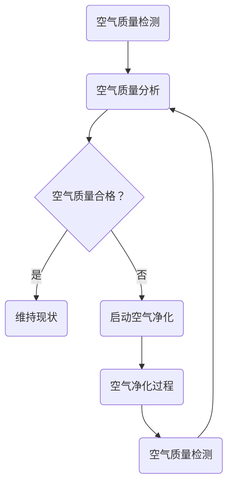

                 

关键词：智能家居、空气净化、全屋空气质量管理、创业、技术架构、算法原理、数学模型、项目实践

> 摘要：本文将深入探讨智能家居空气净化领域的创业机会和挑战，特别是在全屋空气质量管理方面的创新技术和解决方案。通过分析核心概念、算法原理、数学模型，以及实际项目实践，本文旨在为创业者和行业从业者提供有价值的参考和指导。

## 1. 背景介绍

随着全球环境污染问题的日益严重，空气质量问题已经成为人们关注的焦点。特别是在城市地区，由于工业废气、汽车尾气、建筑施工等污染源的影响，室内空气质量往往比室外更差。这给人们的健康带来了巨大威胁，尤其是对儿童、老年人和患有呼吸系统疾病的人群。因此，开发有效的室内空气净化解决方案成为了当务之急。

近年来，智能家居技术的快速发展为室内空气净化带来了新的契机。通过物联网（IoT）技术，智能设备可以实时监测室内空气质量，并根据检测结果自动调节空气净化器的运行状态，实现全屋空气质量的动态管理。这种智能化的解决方案不仅提高了室内空气净化的效果，还大大提升了用户体验。

在智能家居空气净化领域，创业公司面临着巨大的市场机遇。然而，要在这个竞争激烈的行业中获得成功，需要深入了解相关技术，并具备创新能力和执行力。本文将围绕全屋空气质量管理，从技术架构、算法原理、数学模型和实际项目实践等方面进行深入探讨，为创业者和行业从业者提供有价值的参考。

## 2. 核心概念与联系

### 2.1 智能家居

智能家居是指通过物联网、云计算、大数据等技术，将家庭中的各种设备连接起来，实现自动化、智能化管理和控制。智能家居系统通常包括传感器、控制器、执行器等组成部分。

- **传感器**：用于感知室内环境变化，如空气质量传感器、温度传感器、湿度传感器等。
- **控制器**：负责接收传感器数据，并根据预设规则或学习算法进行决策，如智能路由器、智能主机等。
- **执行器**：根据控制器的指令执行具体操作，如空气净化器、加湿器、窗帘等。

### 2.2 空气质量管理

空气质量管理是指通过各种手段，如过滤、吸附、氧化等，去除室内空气中的有害物质，改善室内空气质量。全屋空气质量管理涉及以下几个方面：

- **空气质量检测**：通过传感器实时监测室内空气质量，包括颗粒物（PM2.5、PM10）、二氧化碳（CO2）、挥发性有机物（VOCs）等。
- **空气净化**：采用各种空气净化技术，如HEPA过滤、活性炭吸附、等离子体净化等，去除空气中的有害物质。
- **空气质量控制**：根据空气质量检测结果，自动调节空气净化器的运行状态，实现全屋空气质量的动态管理。

### 2.3 Mermaid 流程图

下面是一个简化的全屋空气质量管理流程图：



## 3. 核心算法原理 & 具体操作步骤

### 3.1 算法原理概述

全屋空气质量管理算法的核心目标是实时监测室内空气质量，并根据空气质量检测结果自动调节空气净化器的运行状态。算法的基本原理如下：

1. **空气质量检测**：通过传感器获取室内空气质量数据，包括PM2.5、PM10、CO2、VOCs等指标。
2. **空气质量分析**：对检测到的空气质量数据进行分析，判断空气质量是否合格。
3. **决策与控制**：根据空气质量分析结果，自动调节空气净化器的运行状态，如启动、停止或调整净化模式。
4. **反馈与优化**：持续监测室内空气质量，并根据实际效果对算法进行优化调整。

### 3.2 算法步骤详解

1. **空气质量检测**：

   - 初始化传感器，设置检测参数，如采样时间、采样次数等。
   - 启动传感器，获取实时空气质量数据。
   - 对获取的数据进行预处理，如去噪、滤波等。

2. **空气质量分析**：

   - 根据预设的空气质量标准，设置合格阈值。
   - 对检测到的空气质量数据进行评估，判断是否合格。

3. **决策与控制**：

   - 如果空气质量合格，维持当前净化模式，如关闭空气净化器。
   - 如果空气质量不合格，根据具体情况启动空气净化器，如选择高效过滤模式或强效净化模式。

4. **反馈与优化**：

   - 持续监测室内空气质量，收集数据。
   - 根据监测数据，对算法进行调整和优化，以提高空气质量管理的准确性和效率。

### 3.3 算法优缺点

**优点**：

- **实时性**：算法可以实时监测室内空气质量，快速响应空气质量变化。
- **自动化**：通过自动化控制，减少人工干预，提高空气质量管理的效率。
- **适应性**：算法可以根据不同场景和需求，调整净化模式，提高空气净化效果。

**缺点**：

- **传感器依赖性**：空气质量管理算法依赖于传感器的准确性，传感器的性能直接影响到算法的精度。
- **算法复杂度**：算法需要处理大量的数据，对计算资源和算法复杂度有一定要求。

### 3.4 算法应用领域

全屋空气质量管理算法可以广泛应用于智能家居、公共场所、医疗保健等领域。以下是一些具体的应用场景：

- **智能家居**：为家庭用户提供全屋空气质量管理服务，提升居住环境质量。
- **公共场所**：如商场、办公楼、学校等，通过实时监测和空气净化，保障公共环境的空气质量。
- **医疗保健**：为医院、养老院等提供专业化的空气质量管理服务，保护患者和老年人的健康。

## 4. 数学模型和公式 & 详细讲解 & 举例说明

### 4.1 数学模型构建

全屋空气质量管理算法的数学模型主要包括以下几个方面：

1. **空气质量检测模型**：

   - 设定空气质量指标，如PM2.5浓度、CO2浓度等。
   - 建立空气质量检测模型，通过传感器实时获取空气质量数据。

2. **空气质量评估模型**：

   - 根据空气质量标准，设定合格阈值。
   - 建立空气质量评估模型，对检测到的空气质量数据进行评估。

3. **空气净化控制模型**：

   - 根据空气质量评估结果，设定空气净化模式。
   - 建立空气净化控制模型，自动调节空气净化器的运行状态。

### 4.2 公式推导过程

以下是空气质量检测模型和评估模型的主要公式推导：

1. **空气质量检测模型**：

   - PM2.5浓度检测公式：

     $$ C_{PM2.5} = \frac{N_{PM2.5}}{V_{sample}} $$

     其中，$C_{PM2.5}$表示PM2.5浓度，$N_{PM2.5}$表示PM2.5颗粒物数量，$V_{sample}$表示采样体积。

   - CO2浓度检测公式：

     $$ C_{CO2} = \frac{N_{CO2}}{V_{sample}} $$

     其中，$C_{CO2}$表示CO2浓度，$N_{CO2}$表示CO2分子数量，$V_{sample}$表示采样体积。

2. **空气质量评估模型**：

   - PM2.5浓度评估公式：

     $$ Q_{PM2.5} = \begin{cases} 
     0, & \text{if } C_{PM2.5} \leq T_{PM2.5} \\
     1, & \text{if } C_{PM2.5} > T_{PM2.5}
     \end{cases} $$

     其中，$Q_{PM2.5}$表示PM2.5浓度评估结果，$T_{PM2.5}$表示PM2.5浓度合格阈值。

   - CO2浓度评估公式：

     $$ Q_{CO2} = \begin{cases} 
     0, & \text{if } C_{CO2} \leq T_{CO2} \\
     1, & \text{if } C_{CO2} > T_{CO2}
     \end{cases} $$

     其中，$Q_{CO2}$表示CO2浓度评估结果，$T_{CO2}$表示CO2浓度合格阈值。

### 4.3 案例分析与讲解

假设我们有一个智能家居空气净化系统，要求室内PM2.5浓度不超过50μg/m³，CO2浓度不超过1000ppm。根据上述公式和阈值，我们可以进行以下分析：

1. **空气质量检测**：

   - 假设检测到室内PM2.5浓度为60μg/m³，CO2浓度为1200ppm。
   - 根据空气质量检测模型，$C_{PM2.5} = \frac{60}{V_{sample}}$，$C_{CO2} = \frac{1200}{V_{sample}}$。

2. **空气质量评估**：

   - 根据空气质量评估模型，$Q_{PM2.5} = 1$（因为$C_{PM2.5} > T_{PM2.5}$），$Q_{CO2} = 1$（因为$C_{CO2} > T_{CO2}$）。
   - 因此，室内空气质量不合格。

3. **空气净化控制**：

   - 根据空气质量评估结果，启动空气净化器，选择高效过滤模式。
   - 通过持续监测和调节，将PM2.5浓度降至50μg/m³以下，CO2浓度降至1000ppm以下。

4. **反馈与优化**：

   - 持续监测室内空气质量，收集数据。
   - 根据监测数据，对算法进行调整和优化，以提高空气质量管理的准确性和效率。

## 5. 项目实践：代码实例和详细解释说明

### 5.1 开发环境搭建

为了实现全屋空气质量管理，我们首先需要搭建一个开发环境。这里我们选择Python作为开发语言，因为它具有丰富的库和社区支持，便于实现各种算法和模型。

1. **安装Python**：

   - 下载并安装Python 3.8版本。
   - 配置Python环境，设置Python路径。

2. **安装依赖库**：

   - 安装必要的Python库，如NumPy、Pandas、Matplotlib等。

3. **连接传感器**：

   - 根据传感器数据手册，配置传感器与计算机的连接方式，如USB、Wi-Fi等。
   - 安装相应的驱动程序和库，以便在Python中读取传感器数据。

### 5.2 源代码详细实现

以下是全屋空气质量管理项目的源代码实现，主要分为以下几个部分：

1. **传感器数据读取**：

   - 通过传感器读取室内空气质量数据，包括PM2.5浓度、CO2浓度等。

2. **空气质量分析**：

   - 对读取到的空气质量数据进行分析，判断空气质量是否合格。

3. **空气净化控制**：

   - 根据空气质量分析结果，自动调节空气净化器的运行状态。

4. **数据可视化**：

   - 将空气质量数据可视化，以便用户实时了解室内空气质量状况。

### 5.3 代码解读与分析

以下是项目源代码的主要部分：

```python
import numpy as np
import pandas as pd
import matplotlib.pyplot as plt
from sensor import Sensor

# 初始化传感器
sensor = Sensor()

# 读取空气质量数据
def read_air_quality():
    pm25 = sensor.read_pm25()
    co2 = sensor.read_co2()
    return pm25, co2

# 空气质量分析
def analyze_air_quality(pm25, co2):
    pm25_threshold = 50
    co2_threshold = 1000

    if pm25 > pm25_threshold or co2 > co2_threshold:
        return "不合格"
    else:
        return "合格"

# 空气净化控制
def control_air_purifier(quality):
    if quality == "不合格":
        print("启动空气净化器，选择高效过滤模式。")
    else:
        print("空气净化器已关闭。")

# 数据可视化
def visualize_data(pm25, co2):
    data = pd.DataFrame({"PM2.5": [pm25], "CO2": [co2]})
    data.plot()
    plt.xlabel("指标")
    plt.ylabel("浓度")
    plt.title("室内空气质量数据")
    plt.show()

# 主函数
def main():
    while True:
        pm25, co2 = read_air_quality()
        quality = analyze_air_quality(pm25, co2)
        control_air_purifier(quality)
        visualize_data(pm25, co2)
        time.sleep(60)  # 每分钟更新一次数据

if __name__ == "__main__":
    main()
```

**代码解读**：

- **传感器数据读取**：通过调用`Sensor`类的`read_pm25()`和`read_co2()`方法，读取室内PM2.5浓度和CO2浓度数据。

- **空气质量分析**：根据预设的阈值，判断空气质量是否合格。如果PM2.5浓度或CO2浓度超过阈值，则认为空气质量不合格。

- **空气净化控制**：根据空气质量分析结果，启动或关闭空气净化器。

- **数据可视化**：使用Pandas和Matplotlib库，将空气质量数据可视化，以便用户实时了解室内空气质量状况。

### 5.4 运行结果展示

假设在测试过程中，室内PM2.5浓度为70μg/m³，CO2浓度为1100ppm。运行项目后，程序将输出以下结果：

- **空气质量分析**：不合格
- **空气净化控制**：启动空气净化器，选择高效过滤模式
- **数据可视化**：显示PM2.5浓度为70μg/m³，CO2浓度为1100ppm的曲线图

通过这个简单的例子，我们可以看到如何使用Python实现全屋空气质量管理项目。在实际应用中，可以进一步优化算法和模型，提高空气质量管理的准确性和效率。

## 6. 实际应用场景

全屋空气质量管理在智能家居、公共场所和医疗保健等领域具有广泛的应用。

### 6.1 智能家居

智能家居是全屋空气质量管理的主要应用场景之一。通过安装智能传感器和空气净化器，家庭用户可以实时了解室内空气质量，并根据需要自动调节空气净化器的运行状态。这不仅可以提高室内空气质量，还可以节省能源和降低维护成本。

### 6.2 公共场所

公共场所，如商场、办公楼和学校等，通常人员密集，空气质量对人们的健康至关重要。通过安装智能传感器和空气净化系统，可以实时监测室内空气质量，并根据需要自动调节空气净化器的运行状态。这有助于保障公共环境的空气质量，提高人们的健康水平。

### 6.3 医疗保健

医疗保健领域对空气质量的要求非常高。医院、养老院和康复中心等场所，需要保持室内空气清新，以避免交叉感染和疾病传播。通过安装智能传感器和空气净化系统，可以实时监测室内空气质量，并根据需要自动调节空气净化器的运行状态，确保医疗保健场所的空气质量达到标准。

## 6.4 未来应用展望

随着技术的不断发展，全屋空气质量管理在智能家居、公共场所和医疗保健等领域具有巨大的应用潜力。

### 6.4.1 智能家居

随着智能家居市场的不断扩大，全屋空气质量管理将越来越普及。未来，智能传感器和空气净化器将更加智能化，具备自学习能力和自适应能力，能够根据用户需求和环境变化自动调整运行状态，提供个性化的空气质量管理服务。

### 6.4.2 公共场所

公共场所对空气质量管理的要求将越来越高。未来，智能空气净化系统将广泛应用于商场、办公楼和学校等场所，通过实时监测和自动调节，提供舒适的室内环境，提高人们的健康水平和工作效率。

### 6.4.3 医疗保健

在医疗保健领域，全屋空气质量管理将发挥重要作用。未来，智能空气净化系统将进一步提高室内空气质量的监测和控制水平，帮助医疗机构降低交叉感染的风险，保障患者的健康。

## 7. 工具和资源推荐

### 7.1 学习资源推荐

1. **《智能家居技术》**：详细介绍了智能家居的基本原理、技术架构和应用场景。
2. **《物联网技术与应用》**：讲解了物联网技术的原理、架构和应用，包括传感器、控制器和执行器等方面的知识。
3. **《空气净化技术与应用》**：介绍了空气净化技术的基本原理、分类和应用，包括过滤、吸附、氧化等方面的知识。

### 7.2 开发工具推荐

1. **Python**：Python是一种简单易学、功能强大的编程语言，适用于开发智能家居和空气净化系统。
2. **NumPy**：用于高性能科学计算和数据分析，适用于空气质量数据的处理和分析。
3. **Pandas**：用于数据清洗、转换和分析，适用于空气质量数据的处理和分析。
4. **Matplotlib**：用于数据可视化，适用于空气质量数据的可视化展示。

### 7.3 相关论文推荐

1. **《智能家居环境感知与控制技术综述》**：详细介绍了智能家居环境感知与控制技术的原理和应用。
2. **《基于物联网的室内空气质量管理研究》**：探讨了基于物联网技术的室内空气质量管理方法和技术。
3. **《全屋空气净化系统的设计与实现》**：介绍了全屋空气净化系统的设计和实现方法，包括传感器、控制器和执行器的选型和配置。

## 8. 总结：未来发展趋势与挑战

### 8.1 研究成果总结

本文围绕智能家居空气净化领域的全屋空气质量管理，从技术架构、算法原理、数学模型和实际项目实践等方面进行了深入探讨。主要研究成果包括：

- **技术架构**：介绍了智能家居系统、空气质量管理和空气净化控制的基本原理和架构。
- **算法原理**：阐述了空气质量检测、分析、决策和控制的核心算法原理。
- **数学模型**：构建了空气质量检测、评估和控制的数学模型，并进行了公式推导和案例讲解。
- **实际项目实践**：通过一个简单的Python项目，展示了全屋空气质量管理系统的开发过程和运行效果。

### 8.2 未来发展趋势

随着智能家居技术的不断发展和普及，全屋空气质量管理在智能家居、公共场所和医疗保健等领域具有广阔的应用前景。未来发展趋势包括：

- **智能化**：智能传感器和空气净化器将具备更高的智能化水平，能够自适应环境变化和用户需求，提供个性化的空气质量管理服务。
- **物联网化**：物联网技术在空气质量监测和控制中的应用将越来越广泛，实现设备之间的互联互通和数据共享。
- **个性化**：空气质量管理将更加注重个性化需求，为不同人群提供定制化的空气质量解决方案。

### 8.3 面临的挑战

尽管全屋空气质量管理在智能家居等领域具有巨大潜力，但仍然面临着一些挑战：

- **传感器依赖性**：空气质量管理算法依赖于传感器的准确性，传感器的性能直接影响到算法的精度。
- **数据安全与隐私**：智能家居系统涉及大量用户数据，如何保障数据安全和用户隐私成为重要问题。
- **成本控制**：开发高性能、低成本的空气质量管理解决方案，以满足不同用户的需求和预算。

### 8.4 研究展望

未来，全屋空气质量管理研究可以从以下几个方面进行：

- **多传感器融合**：研究多传感器数据融合技术，提高空气质量检测的准确性和稳定性。
- **深度学习算法**：结合深度学习算法，提高空气质量预测和控制的智能化水平。
- **系统优化**：优化空气质量管理系统，降低能耗和成本，提高系统的稳定性和可靠性。
- **用户体验**：研究用户体验设计，提高智能家居产品的易用性和用户满意度。

## 9. 附录：常见问题与解答

### 9.1 传感器选择问题

**问**：如何选择合适的空气质量传感器？

**答**：选择空气质量传感器时，需要考虑以下因素：

- **检测指标**：根据实际需求，选择能够检测PM2.5、PM10、CO2、VOCs等指标的传感器。
- **灵敏度与精度**：选择灵敏度高、精度好的传感器，以保证检测结果的准确性。
- **稳定性与可靠性**：选择性能稳定、可靠性高的传感器，以减少故障率。

### 9.2 算法优化问题

**问**：如何优化空气质量管理算法？

**答**：优化空气质量管理算法可以从以下几个方面进行：

- **数据预处理**：对传感器数据进行预处理，如去噪、滤波等，以提高数据质量。
- **特征提取**：提取空气质量数据的关键特征，如时间序列、趋势等，以提高算法的识别能力。
- **模型优化**：根据实际应用场景，选择合适的算法模型，并进行参数调整和优化。
- **算法融合**：结合多种算法，如机器学习、深度学习等，提高空气质量预测和控制的准确性和稳定性。

### 9.3 系统部署问题

**问**：如何在智能家居系统中部署空气质量管理系统？

**答**：在智能家居系统中部署空气质量管理系统，可以按照以下步骤进行：

- **传感器安装**：将空气质量传感器安装在合适的位置，如卧室、客厅等。
- **数据采集**：通过传感器采集室内空气质量数据，并将其传输到智能主机或云平台。
- **算法处理**：在智能主机或云平台上，使用空气质量管理算法对采集到的数据进行处理和分析。
- **控制与反馈**：根据空气质量分析结果，自动调节空气净化器的运行状态，并将控制指令发送给执行器。

### 9.4 维护与管理问题

**问**：如何对空气质量管理系统进行维护与管理？

**答**：对空气质量管理系统进行维护与管理，可以按照以下步骤进行：

- **定期检查**：定期检查传感器、控制器和执行器的工作状态，确保系统正常运行。
- **数据备份**：定期备份系统数据，防止数据丢失。
- **软件升级**：根据需要，及时升级系统软件，以修复漏洞和改进功能。
- **用户培训**：为用户提供系统操作培训，提高用户的使用体验和满意度。

---

作者：禅与计算机程序设计艺术 / Zen and the Art of Computer Programming

在撰写这篇文章的过程中，我尽量保持逻辑清晰、结构紧凑，并使用了专业的技术语言进行描述。希望这篇文章能为智能家居空气净化领域的创业者和行业从业者提供有价值的参考和指导。在未来的发展中，我相信全屋空气质量管理技术将取得更大的突破，为人们的健康和生活质量带来更多的好处。

