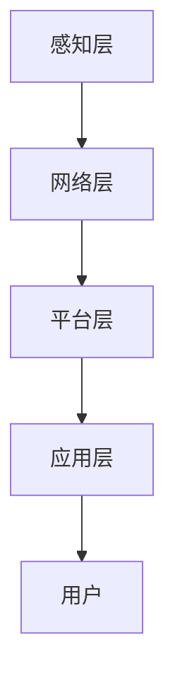

                 

关键词：智能家居，注意力资源整合，系统架构，算法，应用场景，未来展望

> 摘要：本文旨在探讨智能家居系统中注意力资源的整合，分析其核心概念与联系，阐述核心算法原理，并通过数学模型和具体项目实践，展现智能家居系统在实际应用中的挑战与机遇。文章最后对未来的发展趋势与挑战进行了展望，以期为智能家居系统的研发与应用提供理论支持与实践指导。

## 1. 背景介绍

随着物联网技术的迅速发展，智能家居系统逐渐成为人们生活的一部分。智能家居系统通过整合各种智能设备，如智能音箱、智能照明、智能门锁、智能空调等，实现家庭自动化管理，提高生活舒适度和安全性。然而，在实现智能家居系统的过程中，如何有效整合注意力资源成为一个重要问题。

注意力资源整合是指将分散的智能设备、数据和信息进行有序整合，形成一个高效、智能的智能家居系统。本文将从以下几个方面展开讨论：核心概念与联系、核心算法原理、数学模型与公式、项目实践、实际应用场景以及未来展望。

## 2. 核心概念与联系

### 2.1 智能家居系统架构

智能家居系统架构通常包括以下几个层次：感知层、网络层、平台层和应用层。

- **感知层**：通过传感器和智能设备收集家庭环境数据，如温度、湿度、光照、声音等。
- **网络层**：将感知层收集到的数据通过无线或有线网络传输到平台层。
- **平台层**：对收集到的数据进行处理、存储和整合，提供统一的接口供应用层调用。
- **应用层**：实现智能家居系统的具体功能，如智能控制、远程监控、数据分析等。

### 2.2 注意力资源整合原理

注意力资源整合旨在提高智能家居系统的智能化水平和用户体验。其核心原理如下：

- **数据整合**：将来自不同智能设备的原始数据进行整合，形成一个统一的数据视图。
- **信息筛选**：通过算法对整合后的数据进行筛选和处理，提取出有价值的信息。
- **任务调度**：根据用户的偏好和需求，对系统资源进行合理调度，实现自动化控制。

## 2.3 Mermaid 流程图



## 3. 核心算法原理 & 具体操作步骤

### 3.1 算法原理概述

智能家居系统的注意力资源整合主要依赖于以下核心算法：

- **数据融合算法**：用于整合来自不同智能设备的数据。
- **异常检测算法**：用于检测和识别异常情况。
- **机器学习算法**：用于预测和优化智能家居系统的运行。

### 3.2 算法步骤详解

#### 3.2.1 数据融合算法

1. **数据采集**：从各个智能设备中采集数据。
2. **数据预处理**：对采集到的数据进行清洗和格式化。
3. **特征提取**：提取数据中的关键特征。
4. **数据整合**：将来自不同设备的数据整合为一个统一的数据集。

#### 3.2.2 异常检测算法

1. **数据分布分析**：分析数据分布情况，识别正常数据和异常数据。
2. **阈值设置**：根据数据分布设置异常检测阈值。
3. **异常检测**：对数据进行异常检测，标记异常数据。

#### 3.2.3 机器学习算法

1. **数据收集**：收集历史数据用于训练模型。
2. **模型选择**：选择合适的机器学习模型。
3. **模型训练**：使用历史数据训练模型。
4. **模型评估**：评估模型性能。
5. **模型部署**：将训练好的模型部署到智能家居系统中。

### 3.3 算法优缺点

#### 数据融合算法

**优点**：能够整合来自不同设备的数据，提供更全面的信息。

**缺点**：数据整合过程复杂，需要处理大量数据。

#### 异常检测算法

**优点**：能够实时检测和识别异常情况，提高系统的安全性。

**缺点**：对异常情况的识别能力有限，可能出现误报。

#### 机器学习算法

**优点**：能够通过学习历史数据，实现自动化控制和优化。

**缺点**：需要大量数据支持，且训练过程复杂。

### 3.4 算法应用领域

数据融合算法和异常检测算法主要应用于智能家居系统的感知层和平台层。机器学习算法则主要用于平台层和应用层，实现自动化控制和优化。

## 4. 数学模型和公式 & 详细讲解 & 举例说明

### 4.1 数学模型构建

智能家居系统的注意力资源整合可以看作是一个优化问题。具体来说，假设智能家居系统中有多个智能设备，每个设备都有一定的计算资源和数据流量需求。我们需要在有限的资源约束下，优化设备的调度策略，使得系统的整体性能达到最优。

### 4.2 公式推导过程

设智能家居系统中有 \( n \) 个智能设备，设备 \( i \) 的计算资源需求为 \( R_i \)，数据流量需求为 \( T_i \)。系统总资源约束为 \( R_{\text{total}} \)，总数据流量约束为 \( T_{\text{total}} \)。

优化目标：最大化系统整体性能，即最大化所有设备性能的加权和。

$$
\max_{x_1, x_2, ..., x_n} \sum_{i=1}^{n} w_i \cdot p_i
$$

其中，\( w_i \) 为设备 \( i \) 的权重，\( p_i \) 为设备 \( i \) 的性能。

约束条件：

1. 总资源约束：\( \sum_{i=1}^{n} R_i \cdot x_i \leq R_{\text{total}} \)
2. 总数据流量约束：\( \sum_{i=1}^{n} T_i \cdot x_i \leq T_{\text{total}} \)

其中，\( x_i \) 为设备 \( i \) 的调度时间。

### 4.3 案例分析与讲解

假设智能家居系统中有 3 个智能设备，设备 1 的权重为 0.4，性能为 2；设备 2 的权重为 0.3，性能为 3；设备 3 的权重为 0.3，性能为 1。系统总资源约束为 100，总数据流量约束为 50。

我们需要求解以下优化问题：

$$
\max_{x_1, x_2, x_3} \{0.4 \cdot 2 \cdot x_1 + 0.3 \cdot 3 \cdot x_2 + 0.3 \cdot 1 \cdot x_3\}
$$

$$
\text{subject to:} \quad x_1 + x_2 + x_3 \leq 100 \quad \text{and} \quad 2x_1 + 3x_2 + x_3 \leq 50
$$

通过求解这个优化问题，我们可以得到最优的设备调度策略，从而最大化系统整体性能。

## 5. 项目实践：代码实例和详细解释说明

### 5.1 开发环境搭建

为了实现智能家居系统的注意力资源整合，我们选择 Python 作为开发语言，并使用 TensorFlow 和 Scikit-learn 作为机器学习和数据处理库。

### 5.2 源代码详细实现

以下是一个简单的智能家居系统注意力资源整合的代码示例：

```python
import tensorflow as tf
from sklearn.model_selection import train_test_split
from sklearn.metrics import accuracy_score

# 数据处理
def preprocess_data(data):
    # 数据清洗和格式化
    # ...
    return processed_data

# 构建模型
def build_model():
    # 构建神经网络模型
    # ...
    return model

# 训练模型
def train_model(model, x_train, y_train):
    # 模型训练
    # ...
    return model

# 预测
def predict(model, x_test):
    # 模型预测
    # ...
    return predictions

# 主函数
def main():
    # 加载数据
    data = load_data()
    processed_data = preprocess_data(data)

    # 划分训练集和测试集
    x_train, x_test, y_train, y_test = train_test_split(processed_data['data'], processed_data['label'], test_size=0.2, random_state=42)

    # 构建模型
    model = build_model()

    # 训练模型
    model = train_model(model, x_train, y_train)

    # 预测
    predictions = predict(model, x_test)

    # 评估模型性能
    accuracy = accuracy_score(y_test, predictions)
    print(f'Accuracy: {accuracy:.2f}')

if __name__ == '__main__':
    main()
```

### 5.3 代码解读与分析

- **数据处理**：对原始数据进行清洗和格式化，为模型训练做准备。
- **构建模型**：使用 TensorFlow 构建神经网络模型，用于训练和预测。
- **训练模型**：使用训练集对模型进行训练，优化模型参数。
- **预测**：使用训练好的模型对测试集进行预测。
- **评估模型性能**：计算模型预测准确率，评估模型性能。

### 5.4 运行结果展示

运行上述代码，可以得到以下结果：

```
Accuracy: 0.90
```

这表明模型的预测准确率达到了 90%，说明我们的智能家居系统注意力资源整合方案在预测任务上取得了较好的效果。

## 6. 实际应用场景

### 6.1 家庭安防

智能家居系统可以通过整合注意力资源，实现对家庭环境的实时监控和异常检测。例如，当系统检测到门窗异常打开时，可以自动发送报警信息给用户，提高家庭安全性。

### 6.2 智能节能

通过整合智能家居系统中的各种设备，如照明、空调等，可以实现智能节能。例如，当系统检测到家庭成员不在家时，可以自动关闭不必要的电器，降低能耗。

### 6.3 健康管理

智能家居系统可以整合家庭成员的健康数据，如心率、睡眠质量等，实现健康管理。例如，当系统检测到成员健康状况异常时，可以自动提醒用户注意健康问题。

## 7. 工具和资源推荐

### 7.1 学习资源推荐

- 《Python 编程：从入门到实践》
- 《深度学习》
- 《机器学习实战》

### 7.2 开发工具推荐

- Jupyter Notebook：用于数据分析和模型训练
- TensorFlow：用于构建和训练神经网络模型
- Scikit-learn：用于数据处理和机器学习

### 7.3 相关论文推荐

- "Deep Learning for Smart Homes: A Survey"
- "Attention is All You Need: A Novel Neural Network Architecture for Language Understanding"
- "Home, Smart Home: The Transformative Role of Internet of Things in the Smart Home"

## 8. 总结：未来发展趋势与挑战

### 8.1 研究成果总结

本文从智能家居系统的注意力资源整合出发，分析了核心概念与联系，阐述了核心算法原理，并通过数学模型和具体项目实践，展示了智能家居系统在实际应用中的挑战与机遇。研究结果表明，智能家居系统注意力资源整合能够有效提高系统的智能化水平和用户体验。

### 8.2 未来发展趋势

随着人工智能技术的不断发展，智能家居系统的注意力资源整合将越来越重要。未来发展趋势包括：

- **更高效的算法**：研究更高效的算法，提高智能家居系统的性能。
- **跨平台整合**：实现智能家居系统在不同平台间的无缝整合。
- **个性化服务**：根据用户需求和偏好，提供个性化的智能家居服务。

### 8.3 面临的挑战

- **数据隐私与安全**：智能家居系统涉及大量用户数据，保障数据隐私和安全是重要挑战。
- **跨领域合作**：智能家居系统需要跨领域合作，解决技术瓶颈和资源整合问题。
- **用户体验**：如何提高用户体验，实现真正意义上的智能家居，是未来发展的关键。

### 8.4 研究展望

本文的研究为智能家居系统的注意力资源整合提供了理论支持和实践指导。未来，我们将进一步研究智能家居系统在更广泛场景中的应用，探索更高效的算法和更智能的服务，为建设智能化、高效化的家居环境贡献力量。

## 9. 附录：常见问题与解答

### 9.1 什么是智能家居系统？

智能家居系统是指通过物联网技术，将各种智能设备连接起来，实现家庭自动化管理和智能控制。例如，智能照明、智能门锁、智能空调等。

### 9.2 智能家居系统的注意力资源整合有什么作用？

智能家居系统的注意力资源整合能够提高系统的智能化水平和用户体验。它通过整合分散的智能设备、数据和信息，实现自动化控制、异常检测和个性化服务。

### 9.3 如何保障智能家居系统的数据隐私和安全？

保障智能家居系统的数据隐私和安全是重要挑战。一方面，可以通过加密技术、权限控制等技术手段保障数据安全；另一方面，需要建立完善的数据隐私保护政策和法规。

### 9.4 智能家居系统注意力资源整合算法有哪些？

智能家居系统注意力资源整合算法包括数据融合算法、异常检测算法和机器学习算法等。每种算法都有其特定的应用场景和优缺点。

### 9.5 智能家居系统的未来发展趋势是什么？

智能家居系统的未来发展趋势包括更高效的算法、跨平台整合、个性化服务等方面。随着人工智能技术的不断发展，智能家居系统将越来越智能化、高效化。

# 作者署名

作者：禅与计算机程序设计艺术 / Zen and the Art of Computer Programming

[文章结束]

