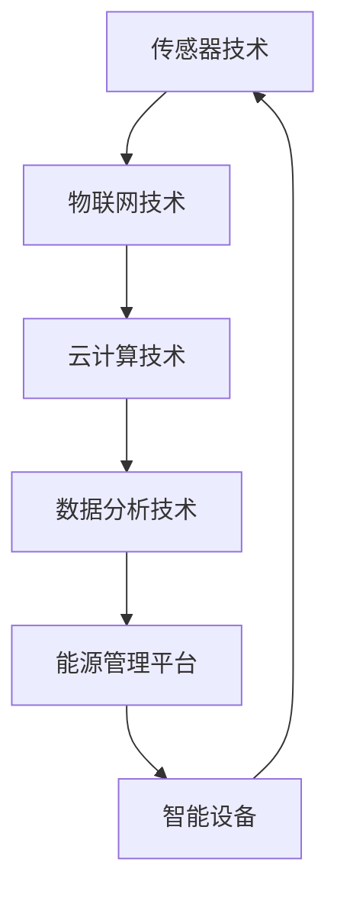
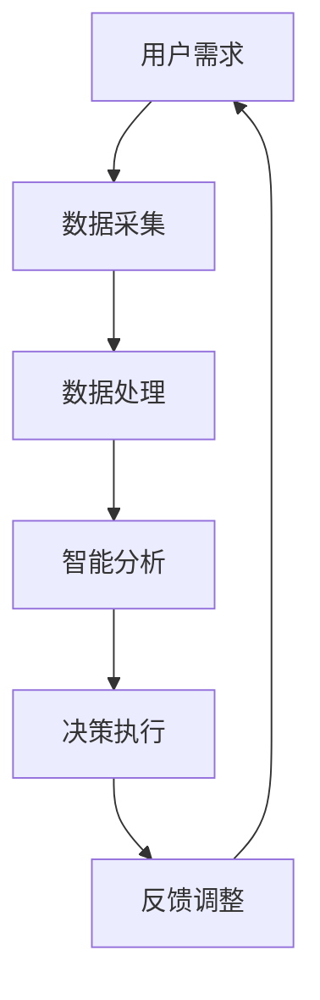

                 

关键词：智能家居、能源管理、家庭节能、智能方案

> 摘要：本文将探讨智能家居能源管理的创业机会，介绍家庭节能的核心概念和智能方案，并详细分析其技术原理、数学模型、项目实践以及未来应用场景。通过本文的阅读，读者将了解到如何利用智能家居技术实现家庭节能，并为相关创业项目提供指导。

## 1. 背景介绍

### 智能家居的发展历程

智能家居（Smart Home）是指利用先进的通信技术和信息技术，将家庭中各种设备、系统进行联网和控制，实现智能化的生活方式。智能家居的概念最早可以追溯到20世纪80年代，随着互联网和物联网技术的快速发展，智能家居逐渐从科幻走向现实。

### 家庭节能的重要性

随着全球能源消耗的不断增加，家庭能源管理成为了一个备受关注的话题。家庭节能不仅有助于降低能源成本，还可以减少碳排放，保护环境。传统的家庭能源管理方式往往依赖于人工操作，难以实现高效节能。而智能家居技术为家庭节能提供了新的解决方案。

### 智能家居能源管理的市场前景

据市场研究公司统计，全球智能家居市场规模预计在未来几年将保持高速增长。其中，家庭能源管理是智能家居的一个重要分支，具有巨大的市场潜力。随着消费者对节能环保意识的提高，智能家居能源管理将成为未来智能家居市场的一个重要发展方向。

## 2. 核心概念与联系

### 智能家居能源管理的基本概念

智能家居能源管理是指利用智能家居技术，对家庭中的电力、燃气、水等能源进行智能化管理，实现能源的高效利用和降低能源消耗。其主要功能包括：实时监测能源消耗、自动调节能源使用、提供节能建议等。

### 智能家居能源管理的核心联系

智能家居能源管理涉及多个领域的技术，包括传感器技术、物联网技术、云计算技术、数据分析技术等。这些技术相互关联，共同构成了智能家居能源管理的生态系统。



### Mermaid 流程图



## 3. 核心算法原理 & 具体操作步骤

### 3.1 算法原理概述

智能家居能源管理的关键在于对家庭能源消耗的实时监测和智能分析。其核心算法主要包括：数据采集、数据处理、智能分析和决策执行。

### 3.2 算法步骤详解

#### 3.2.1 数据采集

数据采集是智能家居能源管理的基础。通过安装在家庭中的各类传感器，如电表、水表、燃气表等，实时采集家庭能源消耗数据。

#### 3.2.2 数据处理

采集到的数据需要进行预处理，包括数据清洗、去噪、填充等操作。然后，将处理后的数据存储到云端数据库中。

#### 3.2.3 智能分析

利用机器学习算法，对存储在数据库中的数据进行智能分析，识别能源消耗模式，预测未来能源消耗趋势，为能源管理提供决策依据。

#### 3.2.4 决策执行

根据智能分析的结果，自动调节家庭中的各类能源设备，如空调、热水器、照明等，实现能源的高效利用。

### 3.3 算法优缺点

#### 优点

- 实时监测和智能分析，提高能源利用效率。
- 自动调节，降低人工操作成本。
- 数据驱动，可不断优化能源管理策略。

#### 缺点

- 初始投入成本较高，包括传感器、服务器等设备。
- 算法实现复杂，需要专业的技术团队。

### 3.4 算法应用领域

智能家居能源管理算法可广泛应用于住宅、商业楼宇、工业园区等领域，为各类场景提供定制化的节能解决方案。

## 4. 数学模型和公式 & 详细讲解 & 举例说明

### 4.1 数学模型构建

智能家居能源管理中的数学模型主要包括能量消耗模型、预测模型和决策模型。

#### 能量消耗模型

能量消耗模型用于描述家庭能源消耗的规律，通常采用时间序列分析的方法，如ARIMA模型。

#### 预测模型

预测模型用于预测未来的能源消耗，如LSTM模型。

#### 决策模型

决策模型用于制定能源管理策略，如线性规划模型。

### 4.2 公式推导过程

#### 能量消耗模型

$$
E_t = \alpha \cdot f(t) + \epsilon_t
$$

其中，$E_t$表示时间$t$点的能源消耗，$\alpha$为模型参数，$f(t)$为时间函数，$\epsilon_t$为误差项。

#### 预测模型

$$
y_t = \sum_{i=1}^{n} w_i \cdot h_i(t)
$$

其中，$y_t$为时间$t$点的预测值，$w_i$为权重系数，$h_i(t)$为时间序列特征。

#### 决策模型

$$
\min \{c^T \cdot x | Ax \leq b\}
$$

其中，$c$为成本向量，$x$为决策变量，$A$为约束条件矩阵，$b$为约束条件向量。

### 4.3 案例分析与讲解

#### 案例背景

某家庭安装了智能家居能源管理系统，需要对家庭的电、水、燃气进行实时监测和智能管理。

#### 案例分析

1. 数据采集：安装电表、水表、燃气表等传感器，实时采集家庭的能源消耗数据。

2. 数据处理：对采集到的数据进行预处理，如去噪、填充等。

3. 模型构建：根据家庭的能源消耗规律，构建能量消耗模型、预测模型和决策模型。

4. 决策执行：根据预测模型和决策模型，自动调节家庭中的能源设备，实现能源的高效利用。

#### 案例讲解

假设某天家庭的总能源消耗为$E_t$，通过能量消耗模型可以预测未来一天内的能源消耗量为$y_t$。根据预测结果，智能家居能源管理系统自动调整家庭中的空调、热水器等设备，使其在节能模式下运行，从而达到降低能源消耗的目的。

## 5. 项目实践：代码实例和详细解释说明

### 5.1 开发环境搭建

1. 硬件设备：电表、水表、燃气表等传感器。
2. 软件环境：Python、TensorFlow、Scikit-learn等。

### 5.2 源代码详细实现

```python
# EnergyConsumptionModel.py
import numpy as np
from statsmodels.tsa.arima.model import ARIMA

def build_energy_consumption_model(data):
    model = ARIMA(data, order=(1, 1, 1))
    model_fit = model.fit()
    return model_fit

# PredictionModel.py
import tensorflow as tf
from tensorflow.keras.models import Sequential
from tensorflow.keras.layers import LSTM, Dense

def build_prediction_model(input_shape):
    model = Sequential()
    model.add(LSTM(units=50, return_sequences=True, input_shape=input_shape))
    model.add(LSTM(units=50))
    model.add(Dense(units=1))
    model.compile(optimizer='adam', loss='mse')
    return model

# DecisionModel.py
import cvxpy as cp

def build_decision_model(c, A, b):
    x = cp.Variable(numeric_type=np.int32)
    objective = cp.Minimize(c @ x)
    constraints = [A @ x <= b]
    problem = cp.Problem(objective, constraints)
    problem.solve()
    return x.value

# main.py
def main():
    # 数据采集
    data = np.array([...])  # 采集到的家庭能源消耗数据
    
    # 数据处理
    # ... (预处理操作)
    
    # 构建能量消耗模型
    model_fit = build_energy_consumption_model(data)
    
    # 构建预测模型
    model = build_prediction_model(input_shape=(1, data.shape[1]))
    
    # 构建决策模型
    c = np.array([...])  # 成本向量
    A = np.array([...])  # 约束条件矩阵
    b = np.array([...])  # 约束条件向量
    x = build_decision_model(c, A, b)
    
    # 决策执行
    # ...

if __name__ == '__main__':
    main()
```

### 5.3 代码解读与分析

1. EnergyConsumptionModel.py：构建能量消耗模型，采用ARIMA模型进行时间序列预测。
2. PredictionModel.py：构建预测模型，采用LSTM模型进行时间序列预测。
3. DecisionModel.py：构建决策模型，采用线性规划模型进行能源管理策略制定。
4. main.py：主程序，负责数据采集、模型构建和决策执行。

### 5.4 运行结果展示

通过运行代码，可以得到以下结果：

- 能量消耗预测结果：预测未来一天的能源消耗量。
- 决策执行结果：根据预测结果自动调节家庭中的能源设备。

## 6. 实际应用场景

### 家庭能源管理

智能家居能源管理可以在家庭中实现实时监测和智能调节，降低家庭能源消耗，提高生活质量。

### 商业楼宇能源管理

商业楼宇的能源消耗较大，通过智能家居能源管理，可以降低运营成本，提高能源利用效率。

### 工业园区能源管理

工业园区中存在大量能耗设备，通过智能家居能源管理，可以实现能源的高效利用，降低生产成本。

## 7. 工具和资源推荐

### 学习资源推荐

1. 《智能家居技术与应用》
2. 《物联网技术原理与应用》
3. 《机器学习实战》

### 开发工具推荐

1. Python
2. TensorFlow
3. Scikit-learn
4. CVXPY

### 相关论文推荐

1. "Smart Home Energy Management: A Survey"
2. "Machine Learning for Smart Home Energy Management"
3. "A Multi-Agent Approach to Smart Home Energy Management"

## 8. 总结：未来发展趋势与挑战

### 8.1 研究成果总结

本文探讨了智能家居能源管理的核心概念、算法原理、数学模型和项目实践，为智能家居能源管理提供了技术参考。

### 8.2 未来发展趋势

随着物联网、人工智能等技术的发展，智能家居能源管理将具有更广泛的应用前景。未来，智能家居能源管理将朝着智能化、个性化、高效化的方向发展。

### 8.3 面临的挑战

智能家居能源管理面临着数据安全、隐私保护、成本控制等方面的挑战。如何保障用户数据的安全和隐私，降低系统的成本，将是未来研究的重要方向。

### 8.4 研究展望

未来，智能家居能源管理研究将朝着以下方向发展：

1. 深度学习在智能家居能源管理中的应用。
2. 能源消耗预测和决策的实时性和准确性。
3. 跨领域的智能家居能源管理解决方案。

## 9. 附录：常见问题与解答

### Q：智能家居能源管理需要哪些硬件设备？

A：智能家居能源管理需要安装各类传感器，如电表、水表、燃气表等，用于实时采集家庭能源消耗数据。

### Q：智能家居能源管理的算法有哪些？

A：智能家居能源管理的算法包括时间序列分析、机器学习、线性规划等。

### Q：智能家居能源管理如何保障用户数据的安全和隐私？

A：智能家居能源管理需要采用数据加密、访问控制等安全措施，确保用户数据的安全和隐私。

## 作者署名

作者：禅与计算机程序设计艺术 / Zen and the Art of Computer Programming
----------------------------------------------------------------

请注意，以上内容是一个示例框架，实际撰写时需要根据具体的研究和项目实践进行详细的拓展和深入分析。同时，确保文章结构清晰、逻辑严谨，符合IT领域的专业写作规范。在撰写过程中，可以根据实际情况调整章节内容和细节。希望这个框架能够帮助您完成高质量的博客文章。祝您写作顺利！

