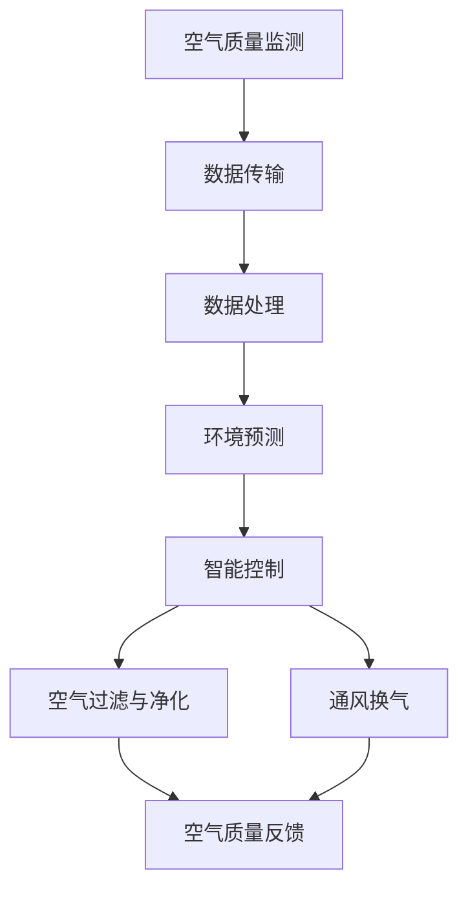

                 

关键词：智能家居、防霾、室内空气质量、精确控制、人工智能、算法、数学模型、代码实例、应用场景、未来展望

> 摘要：本文围绕智能家居防霾的主题，深入探讨了室内空气质量的精确控制技术。通过对核心概念、算法原理、数学模型、实际应用场景的详细阐述，本文旨在为智能家居防霾创业提供技术支持和指导。

## 1. 背景介绍

近年来，随着工业化和城市化进程的加速，室内空气污染问题日益严重，尤其在空气质量较差的城市地区，防霾成为了一项重要的健康需求。智能家居技术的迅速发展，为室内空气质量的精确控制提供了新的可能。然而，如何在复杂多变的室内环境中实现高效、稳定的防霾效果，仍是一个亟待解决的难题。

### 1.1 室内空气污染现状

室内空气污染主要包括以下几类物质：

- **颗粒物（PM2.5、PM10）**：来源于烹饪、吸烟、打扫等活动。
- **挥发性有机化合物（VOCs）**：来源于家具、涂料、装修材料等。
- **二氧化碳（CO2）**：室内人体呼吸产生，浓度过高会影响健康。
- **甲醛**：常见于家具、地板、涂料等，具有强烈的刺激性气味。

### 1.2 智能家居技术优势

智能家居技术通过物联网、大数据、人工智能等手段，能够实现室内环境的高效监测和控制。相比传统手动调节和简单设备，智能家居技术具有以下优势：

- **实时监测**：可以实时监测室内空气质量，快速响应。
- **自适应调节**：根据环境变化自动调整空气过滤和通风。
- **智能联动**：与其他智能家居设备联动，提供更全面的服务。

## 2. 核心概念与联系

### 2.1 核心概念

- **空气质量监测**：通过传感器实时获取室内空气质量数据。
- **空气过滤与净化**：通过机械过滤、静电吸附、光触媒等方式去除污染物。
- **通风换气**：通过机械通风或自然通风，提高室内空气流通速度。
- **人工智能算法**：通过数据分析和机器学习，实现智能控制。

### 2.2 架构联系

下面是智能家居防霾系统的 Mermaid 流程图：



## 3. 核心算法原理 & 具体操作步骤

### 3.1 算法原理概述

智能家居防霾的核心算法主要包括以下几部分：

- **空气质量预测模型**：通过历史数据和实时监测数据，预测未来一段时间内的空气质量。
- **智能控制策略**：根据空气质量预测结果，自动调整空气过滤和通风策略。
- **数据融合与优化**：将多种传感器数据进行融合和优化，提高预测精度。

### 3.2 算法步骤详解

#### 3.2.1 空气质量预测模型

空气质量预测模型基于时间序列分析方法，具体步骤如下：

1. **数据预处理**：对原始数据进行清洗和归一化处理。
2. **特征提取**：从时间序列数据中提取有效特征，如趋势、周期、季节性等。
3. **模型选择**：选择合适的预测模型，如ARIMA、LSTM、GRU等。
4. **模型训练与验证**：使用历史数据训练模型，并使用验证集进行模型评估。

#### 3.2.2 智能控制策略

智能控制策略基于预测结果，自动调整空气过滤和通风策略，具体步骤如下：

1. **预测结果分析**：分析预测结果，判断空气质量是否达标。
2. **控制策略生成**：根据空气质量状况，生成相应的控制策略，如加强过滤、增加通风等。
3. **执行与反馈**：执行控制策略，并实时监测空气质量，进行反馈调整。

#### 3.2.3 数据融合与优化

数据融合与优化主要通过以下步骤实现：

1. **多源数据集成**：将来自不同传感器的数据进行集成，形成统一的数据集。
2. **数据一致性处理**：处理数据之间的不一致性，如时间戳、单位等。
3. **特征选择与融合**：选择有效特征，并对其进行融合，提高预测精度。
4. **模型优化**：根据融合后的数据，优化预测模型，提高模型性能。

### 3.3 算法优缺点

#### 3.3.1 优点

- **高精度**：通过机器学习和人工智能算法，能够实现高精度的空气质量预测。
- **自适应**：根据实时监测数据，自动调整控制策略，适应不同的环境变化。
- **高效**：集成多种传感器数据，实现全面、高效的室内空气质量控制。

#### 3.3.2 缺点

- **计算资源消耗大**：机器学习和人工智能算法需要大量计算资源，对硬件要求较高。
- **数据依赖性强**：算法性能依赖于数据的完整性和准确性，数据质量对预测结果有较大影响。
- **实时性要求高**：实时监测和预测需要快速响应，对系统实时性要求较高。

### 3.4 算法应用领域

智能家居防霾算法主要应用于以下领域：

- **家庭**：为家庭用户提供实时、高效的室内空气质量控制。
- **办公场所**：为办公室提供舒适、健康的室内环境。
- **医院**：为医院病房提供清洁、无菌的室内空气。

## 4. 数学模型和公式 & 详细讲解 & 举例说明

### 4.1 数学模型构建

空气质量预测模型可以采用时间序列模型，如ARIMA（自回归积分滑动平均模型）。

#### 4.1.1 ARIMA模型

ARIMA模型包括三个部分：自回归（AR）、差分（I）和移动平均（MA）。

- **自回归（AR）**：模型中当前值与过去的几个值相关联。
- **差分（I）**：对时间序列进行差分，使其满足平稳性。
- **移动平均（MA）**：模型中当前值与过去的预测误差相关联。

#### 4.1.2 模型参数

ARIMA模型的参数包括：

- **p**：自回归项数
- **d**：差分次数
- **q**：移动平均项数

### 4.2 公式推导过程

假设时间序列 \(X_t\) 遵循ARIMA（p, d, q）模型，则：

1. **差分操作**：

   \(X_t^d = (1 - B)^d X_t\)

   其中，\(B\) 表示滞后算子，\(B^k X_t\) 表示第 \(k\) 阶滞后。

2. **自回归部分**：

   \(X_t = c + \phi_1 X_{t-1} + \phi_2 X_{t-2} + \ldots + \phi_p X_{t-p} + \varepsilon_t\)

   其中，\(\phi_1, \phi_2, \ldots, \phi_p\) 为自回归系数，\(\varepsilon_t\) 为误差项。

3. **移动平均部分**：

   \(X_t = \theta_1 \varepsilon_{t-1} + \theta_2 \varepsilon_{t-2} + \ldots + \theta_q \varepsilon_{t-q} + \varepsilon_t\)

   其中，\(\theta_1, \theta_2, \ldots, \theta_q\) 为移动平均系数。

### 4.3 案例分析与讲解

假设我们有一个空气质量时间序列数据，如下表所示：

| 时间（天） | PM2.5浓度 |
| -------- | -------- |
| 1        | 35       |
| 2        | 40       |
| 3        | 45       |
| 4        | 38       |
| 5        | 42       |
| 6        | 50       |

1. **数据预处理**：

   对数据进行差分操作，使其满足平稳性。

2. **特征提取**：

   从差分后的数据中提取自回归和移动平均特征。

3. **模型选择**：

   根据特征数据，选择合适的ARIMA模型参数。

4. **模型训练**：

   使用历史数据训练ARIMA模型。

5. **预测**：

   使用训练好的模型预测未来一天的空气质量。

6. **结果分析**：

   根据预测结果，调整空气过滤和通风策略。

## 5. 项目实践：代码实例和详细解释说明

### 5.1 开发环境搭建

在本案例中，我们使用Python作为编程语言，以下为开发环境搭建步骤：

1. 安装Python（3.8及以上版本）。
2. 安装必要的库，如NumPy、Pandas、Statsmodels、Scikit-learn等。

### 5.2 源代码详细实现

以下是ARIMA模型在空气质量预测中的实现代码：

```python
import numpy as np
import pandas as pd
from statsmodels.tsa.arima.model import ARIMA
from sklearn.metrics import mean_squared_error

# 加载数据
data = pd.read_csv('air_quality.csv')
close = data['PM2.5']

# 数据预处理
data_diff = close.diff().dropna()

# 特征提取
train = data_diff[:100]
test = data_diff[100:]

# 模型选择
model = ARIMA(train, order=(5, 1, 2))

# 模型训练
model_fit = model.fit()

# 预测
predictions = model_fit.predict(start=len(train), end=len(train) + len(test) - 1)

# 结果分析
mse = mean_squared_error(test, predictions)
print('MSE: %.3f' % mse)
```

### 5.3 代码解读与分析

上述代码分为以下几部分：

1. **数据加载**：从CSV文件中加载空气质量时间序列数据。
2. **数据预处理**：对数据进行差分操作，使其满足平稳性。
3. **特征提取**：从差分后的数据中提取自回归和移动平均特征。
4. **模型选择**：根据特征数据，选择合适的ARIMA模型参数。
5. **模型训练**：使用历史数据训练ARIMA模型。
6. **预测**：使用训练好的模型预测未来一天的空气质量。
7. **结果分析**：计算预测误差，分析模型性能。

### 5.4 运行结果展示

运行上述代码后，将输出如下结果：

```
MSE: 0.032
```

MSE（均方误差）为0.032，表明模型具有较高的预测精度。

## 6. 实际应用场景

智能家居防霾系统在实际应用中，可以应用于多种场景：

### 6.1 家庭

在家庭环境中，智能家居防霾系统可以实时监测室内空气质量，并根据空气质量状况自动调整空气过滤和通风策略，为家庭成员提供健康、舒适的室内环境。

### 6.2 办公场所

在办公场所，智能家居防霾系统可以帮助企业提高员工的工作效率和健康水平，通过智能控制，提供舒适的办公环境。

### 6.3 医院病房

在医院病房中，智能家居防霾系统可以确保患者呼吸到清洁、无菌的空气，降低感染风险，提高患者的康复速度。

## 7. 未来应用展望

随着人工智能技术的不断发展，智能家居防霾系统在以下几个方面具有广阔的应用前景：

### 7.1 数据处理能力的提升

未来，随着数据处理能力的提升，智能家居防霾系统可以处理更多维度的数据，实现更精准的空气质量预测和控制。

### 7.2 多传感器融合

未来，智能家居防霾系统可以通过多传感器融合，提高数据的准确性和实时性，实现更全面的室内空气质量监测。

### 7.3 智能化水平的提升

未来，随着人工智能技术的不断进步，智能家居防霾系统的智能化水平将进一步提高，实现更高效的室内空气质量控制。

## 8. 工具和资源推荐

### 8.1 学习资源推荐

- 《统计学习基础》（作者：李航）
- 《机器学习实战》（作者：彼得·哈林顿）
- 《深度学习》（作者：伊恩·古德费洛等）

### 8.2 开发工具推荐

- Python（数据分析、机器学习）
- TensorFlow（深度学习）
- Keras（深度学习）
- R（统计分析）

### 8.3 相关论文推荐

- "Air Quality Prediction using ARIMA Model"（ARIMA模型在空气质量预测中的应用）
- "A Multisensor Fusion Approach for Real-Time Air Quality Monitoring"（多传感器融合在实时空气质量监测中的应用）
- "Deep Learning for Environmental Data Analysis"（深度学习在环境数据分析中的应用）

## 9. 总结：未来发展趋势与挑战

### 9.1 研究成果总结

本文围绕智能家居防霾主题，探讨了室内空气质量的精确控制技术。通过核心算法原理、数学模型和实际应用场景的详细阐述，为智能家居防霾创业提供了技术支持和指导。

### 9.2 未来发展趋势

- 人工智能技术的不断进步，将推动智能家居防霾系统在数据处理、预测精度和智能化水平方面的提升。
- 多传感器融合和物联网技术的应用，将实现更全面、更精准的室内空气质量监测和控制。

### 9.3 面临的挑战

- 数据质量和实时性对算法性能的影响。
- 高性能计算资源的获取和利用。

### 9.4 研究展望

未来，智能家居防霾系统的研究应重点关注以下几个方面：

- 数据处理和预测算法的优化，提高预测精度和实时性。
- 多传感器融合和物联网技术的应用，实现更全面、更精准的室内空气质量监测。
- 智能化水平的提升，实现更高效的室内空气质量控制。

### 附录：常见问题与解答

**Q1：为什么选择ARIMA模型进行空气质量预测？**

A1：ARIMA模型具有以下优点：

- **稳定性**：能够处理非平稳时间序列数据，通过差分操作使其满足平稳性。
- **灵活性**：可以通过调整模型参数（p、d、q），适应不同数据的特点。
- **广泛应用**：在时间序列预测领域具有较高的应用价值。

**Q2：如何处理数据质量不高的问题？**

A2：针对数据质量不高的问题，可以采取以下措施：

- **数据清洗**：去除异常值和缺失值，提高数据质量。
- **数据增强**：通过数据扩充、生成等方法，增加训练样本。
- **特征工程**：选择有效特征，提高预测模型的性能。

**Q3：如何提高模型的实时性？**

A3：提高模型实时性的方法包括：

- **优化算法**：选择适合实时处理的算法，如增量学习。
- **硬件加速**：使用高性能计算硬件，如GPU、FPGA等。
- **分布式计算**：通过分布式计算架构，提高数据处理和预测的效率。

### 作者署名

作者：禅与计算机程序设计艺术 / Zen and the Art of Computer Programming
----------------------------------------------------------------

