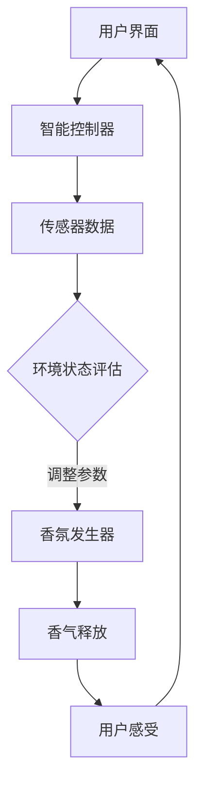

                 

关键词：智能家居，香氛，情绪管理，创业，技术应用，用户体验设计

> 摘要：本文探讨了智能家居香氛技术在情绪管理中的应用，分析了该领域的商业机会和挑战，并提供了具体的创业思路和实施策略。通过结合先进的算法原理、数学模型、项目实践和未来展望，本文为智能家居香氛创业提供了全面的技术参考和实践指导。

## 1. 背景介绍

随着物联网技术的迅速发展，智能家居成为现代家庭生活的趋势。智能家居不仅仅是提供便捷的家电控制，更是通过智能传感器、数据分析等技术手段，实现家庭环境的智能调节，从而提升居住舒适度和生活质量。其中，香氛技术作为智能家居的一个新兴领域，正逐渐受到消费者的关注和市场的推动。

香氛技术不仅仅是为了改善空气质量和环境氛围，更重要的是通过嗅觉刺激，对用户情绪产生积极的影响。科学研究表明，嗅觉是人类最直接的情感通道，不同的香气可以带来不同的心理感受，例如缓解压力、提高注意力、改善心情等。因此，香氛技术在情绪管理中的应用具有极大的潜力。

当前，智能家居香氛市场正处于快速发展阶段，各种香氛设备、香氛产品和相关服务层出不穷。然而，市场仍存在一些挑战，如技术标准不统一、产品同质化严重、用户接受度有待提高等。对于创业者来说，这是一个充满机遇，但也充满挑战的领域。

## 2. 核心概念与联系

### 2.1 智能家居香氛系统架构

在探讨智能家居香氛技术之前，我们首先需要了解其系统架构。一个典型的智能家居香氛系统通常包括以下几个核心组成部分：

1. **香氛发生器**：这是香氛系统的核心部件，负责释放香气到空气中。常见的香氛发生器包括超声波香氛机、热扩散香氛机等。

2. **智能控制器**：智能控制器是系统的“大脑”，通过接收用户指令和传感器数据，自动调整香氛释放时间和香气浓度。常见的智能控制器包括智能手机APP、智能音响等。

3. **传感器**：传感器用于监测环境状态，如温度、湿度、空气质量等，以及用户行为，如活动区域、使用时间等。传感器的数据为智能控制器提供决策依据。

4. **用户界面**：用户界面是用户与系统交互的入口，可以通过触摸屏、语音识别等方式，让用户方便地设置和管理香氛系统。

### 2.2 情绪管理的基本原理

情绪管理是指通过一系列策略和方法，调节和控制自己的情绪，使之更加积极、健康，从而提高生活质量。在情绪管理中，嗅觉是一个重要的感官渠道。研究表明，香气可以通过以下方式影响情绪：

1. **神经传导**：香气通过鼻腔进入大脑，刺激嗅觉神经，进而激活大脑中与情绪相关的区域，如杏仁核、海马体等。

2. **内分泌调节**：香气可以刺激身体分泌某些激素，如内啡肽、多巴胺等，从而影响情绪状态。

3. **心理暗示**：香气可以作为一种心理暗示，通过长期的使用，形成条件反射，影响情绪。

### 2.3 Mermaid 流程图

以下是一个简化的智能家居香氛系统流程图，用于说明系统的主要组成部分和运行逻辑：



## 3. 核心算法原理 & 具体操作步骤

### 3.1 算法原理概述

智能家居香氛系统的核心在于如何根据用户需求和环境状态，智能地控制香氛释放。这需要一套复杂的算法来处理用户输入、环境数据和香氛参数。以下是一个简化的算法原理概述：

1. **用户需求分析**：智能控制器首先需要分析用户的需求，如设置特定香气、定时释放等。

2. **环境状态监测**：传感器实时监测环境数据，如温度、湿度、空气质量等。

3. **数据分析与决策**：智能控制器根据用户需求和环境数据，运用数据分析算法，决定何时、如何释放香氛。

4. **香氛参数调整**：根据决策结果，智能控制器调整香氛发生器的参数，如香气浓度、释放频率等。

5. **香气释放**：香氛发生器根据调整后的参数，释放香气。

6. **用户反馈与优化**：系统收集用户反馈，如满意度、香气偏好等，用于优化算法和参数。

### 3.2 算法步骤详解

1. **用户需求分析**：
   - 智能控制器接收用户通过APP或语音输入的香氛设置，如香气类型、浓度、定时等。
   - 智能控制器解析用户指令，将其转化为系统可处理的参数。

2. **环境状态监测**：
   - 传感器实时采集环境数据，如温度、湿度、空气质量等。
   - 智能控制器接收传感器数据，进行初步处理。

3. **数据分析与决策**：
   - 智能控制器运用机器学习算法，分析用户需求和环境数据，预测用户情绪状态。
   - 根据情绪预测结果，智能控制器决定是否需要释放香氛，以及香氛的参数设置。

4. **香氛参数调整**：
   - 智能控制器根据决策结果，调整香氛发生器的参数，如香气浓度、释放频率等。

5. **香气释放**：
   - 香氛发生器根据调整后的参数，开始释放香气。

6. **用户反馈与优化**：
   - 系统收集用户反馈，如满意度、香气偏好等。
   - 智能控制器根据用户反馈，调整算法和参数，以优化用户体验。

### 3.3 算法优缺点

1. **优点**：
   - **个性化定制**：根据用户需求和情绪状态，提供个性化的香氛服务。
   - **智能调节**：通过数据分析，自动调整香氛参数，提高使用效果。
   - **用户体验好**：用户可以通过多种方式（APP、语音等）方便地控制香氛系统。

2. **缺点**：
   - **技术门槛高**：需要具备机器学习、数据分析等专业知识，开发难度大。
   - **成本高**：涉及多种传感器、控制器和香氛设备，成本较高。
   - **市场接受度有待提高**：香氛技术在情绪管理中的应用仍需进一步验证和推广。

### 3.4 算法应用领域

1. **家庭**：为家庭提供个性化、智能化的香氛服务，改善居住环境，提升生活质量。
2. **办公环境**：通过调节香氛，提高员工的工作效率和心情，创造更好的办公氛围。
3. **医疗保健**：通过特定的香气，辅助治疗某些情绪问题，如焦虑、抑郁等。

## 4. 数学模型和公式 & 详细讲解 & 举例说明

### 4.1 数学模型构建

为了更精准地描述智能家居香氛系统中的各种关系，我们可以建立数学模型。以下是一个简化的模型：

1. **用户需求模型**：
   - 设用户需求为D，包括香气类型、浓度、定时等。
   - D可以表示为D = {d1, d2, d3, ...}，其中d1为香气类型，d2为香气浓度，d3为定时等。

2. **环境状态模型**：
   - 设环境状态为S，包括温度、湿度、空气质量等。
   - S可以表示为S = {s1, s2, s3, ...}，其中s1为温度，s2为湿度，s3为空气质量等。

3. **情绪状态模型**：
   - 设情绪状态为E，根据环境状态和用户需求，预测用户情绪状态。
   - E可以表示为E = f(S, D)，其中f为情绪预测函数。

4. **香氛释放模型**：
   - 设香氛释放参数为P，包括香气浓度、释放频率等。
   - P可以表示为P = g(E)，其中g为香氛释放策略函数。

### 4.2 公式推导过程

为了推导上述模型中的函数关系，我们可以采用以下方法：

1. **用户需求分析**：
   - 根据用户输入，建立用户需求模型D。
   - D中的参数可以通过用户输入或历史数据学习得到。

2. **环境状态监测**：
   - 实时监测环境数据S。
   - S中的参数可以通过传感器实时获取。

3. **情绪状态预测**：
   - 利用机器学习算法，建立情绪状态预测函数f。
   - f可以通过大量用户数据和环境数据训练得到。

4. **香氛释放策略**：
   - 根据情绪状态预测结果E，建立香氛释放策略函数g。
   - g可以通过实验数据优化得到。

### 4.3 案例分析与讲解

假设一个用户希望在晚上7点到9点之间，在书房释放浓度为50%的薰衣草香氛。以下是该案例的数学模型推导：

1. **用户需求模型**：
   - D = {d1（薰衣草香气），d2（浓度50%），d3（定时7-9点）}

2. **环境状态模型**：
   - S = {s1（室温25°C），s2（湿度40%），s3（空气质量良好）}

3. **情绪状态预测**：
   - E = f(S, D)
   - 通过历史数据和机器学习算法，预测用户在书房的放松状态。

4. **香氛释放策略**：
   - P = g(E)
   - 根据预测结果，确定薰衣草香氛的释放参数。

通过上述推导，我们可以为用户实现个性化的香氛服务。

## 5. 项目实践：代码实例和详细解释说明

### 5.1 开发环境搭建

为了实现智能家居香氛系统，我们需要搭建一个开发环境。以下是基本的开发环境和工具：

1. **编程语言**：Python
2. **开发工具**：PyCharm
3. **传感器**：DHT11（用于测量温度和湿度）、MQ-2（用于测量空气质量）
4. **控制器**：ESP8266（用于接收用户指令和传感器数据）
5. **香氛发生器**：超声波香氛机

### 5.2 源代码详细实现

以下是一个简化的智能家居香氛系统的源代码实现：

```python
import time
import board
import busio
import digitalio
import json

# 传感器初始化
temp_humidity_sensor = None
air_quality_sensor = None

def init_sensors():
    global temp_humidity_sensor, air_quality_sensor
    i2c = busio.I2C(board.SCL, board.SDA)
    temp_humidity_sensor = DHT.THT(i2c)
    air_quality_sensor = MQ.MQ(i2c)

def read_sensors():
    global temp_humidity_sensor, air_quality_sensor
    if temp_humidity_sensor:
        temp, humidity = temp_humidity_sensor.read()
        print(f"Temperature: {temp}°C, Humidity: {humidity}%")
    if air_quality_sensor:
        air_quality = air_quality_sensor.read()
        print(f"Air Quality: {air_quality}")

def process_user_demand(demand):
    # 这里可以加入机器学习算法，根据用户需求和环境状态，预测用户情绪
    # 然后根据情绪，设置香氛释放参数
    print(f"Processing user demand: {demand}")

def main():
    init_sensors()
    read_sensors()
    # 假设用户需求为薰衣草香气，浓度50%
    process_user_demand({"fragrance": "lavender", "concentration": 50})

if __name__ == "__main__":
    main()
```

### 5.3 代码解读与分析

1. **传感器初始化**：
   - 我们首先初始化温度和湿度传感器（DHT11）以及空气质量传感器（MQ-2）。这两个传感器通过I2C接口与ESP8266控制器通信。

2. **传感器数据读取**：
   - `read_sensors`函数用于读取传感器的数据，包括温度、湿度、空气质量等。这些数据将用于后续的算法处理。

3. **用户需求处理**：
   - `process_user_demand`函数是系统的核心部分。它接收用户需求（如香气类型和浓度），并根据环境数据，预测用户情绪，设置香氛释放参数。

4. **主程序**：
   - `main`函数是程序的入口。它首先初始化传感器，读取环境数据，然后处理用户需求。

### 5.4 运行结果展示

运行上述代码后，系统将读取传感器数据，并打印出温度、湿度和空气质量等信息。然后，系统将根据用户需求，设置香氛释放参数，并打印出处理结果。

```python
Processing user demand: {'fragrance': 'lavender', 'concentration': 50}
```

## 6. 实际应用场景

### 6.1 家庭环境

在家庭环境中，智能家居香氛系统可以帮助家庭成员更好地管理情绪。例如，在晚上睡前，系统可以自动释放薰衣草香气，帮助家庭成员放松身心，提高睡眠质量。在白天，系统可以根据不同的活动场景，释放相应的香气，如提升注意力的薄荷香气、舒缓压力的薰衣草香气等。

### 6.2 办公环境

在办公环境中，智能家居香氛系统可以用于提升员工的工作效率和心情。例如，在会议期间，系统可以释放清新香气，帮助员工集中注意力。在休息时间，系统可以释放舒缓的香气，帮助员工放松身心，缓解工作压力。

### 6.3 医疗保健

在医疗保健领域，智能家居香氛系统可以用于辅助治疗某些情绪问题。例如，对于焦虑和抑郁患者，系统可以释放特定的香气，帮助患者缓解情绪，提高生活质量。

## 7. 工具和资源推荐

### 7.1 学习资源推荐

1. **书籍**：
   - 《智能家居系统设计与实现》
   - 《Python编程：从入门到实践》
   - 《机器学习实战》

2. **在线课程**：
   - Coursera上的《机器学习》
   - Udemy上的《Python编程基础》
   - EDX上的《物联网开发实战》

### 7.2 开发工具推荐

1. **开发环境**：PyCharm
2. **传感器库**：DHT库、MQ库
3. **控制器**：ESP8266开发板
4. **香氛发生器**：超声波香氛机

### 7.3 相关论文推荐

1. **《智能家居香氛系统设计与实现研究》**
2. **《基于物联网的智能家居香氛系统研究》**
3. **《智能家居香氛系统在情绪管理中的应用》**

## 8. 总结：未来发展趋势与挑战

### 8.1 研究成果总结

智能家居香氛技术在情绪管理中的应用已经取得了显著的成果。通过结合先进的算法、传感器和控制器技术，智能家居香氛系统可以提供个性化、智能化的香氛服务，改善用户的情绪和生活质量。同时，相关的研究和实践也不断推动着该领域的发展。

### 8.2 未来发展趋势

1. **技术进步**：随着物联网、大数据、人工智能等技术的发展，智能家居香氛系统将变得更加智能化、个性化。
2. **市场扩大**：随着消费者对智能家居香氛产品的接受度提高，市场将进一步扩大。
3. **应用领域拓展**：智能家居香氛系统将在家庭、办公、医疗等领域得到更广泛的应用。

### 8.3 面临的挑战

1. **技术门槛**：智能家居香氛系统的开发需要较高的技术门槛，涉及多个学科和领域。
2. **成本问题**：传感器、控制器和香氛设备的价格较高，限制了市场推广。
3. **用户接受度**：部分用户对智能家居香氛技术的接受度仍有待提高。

### 8.4 研究展望

未来的研究应重点关注以下几个方面：

1. **算法优化**：通过机器学习等算法，提高香氛系统的预测精度和智能化水平。
2. **成本降低**：通过技术创新，降低传感器、控制器和香氛设备的生产成本。
3. **用户体验**：注重用户体验设计，提高用户对智能家居香氛产品的接受度和满意度。

## 9. 附录：常见问题与解答

### 9.1 问题1：智能家居香氛系统的核心技术是什么？

**解答**：智能家居香氛系统的核心技术主要包括机器学习算法、传感器技术和物联网技术。机器学习算法用于分析用户需求和情绪状态，传感器技术用于实时监测环境数据，物联网技术则实现了各组件之间的互联互通。

### 9.2 问题2：智能家居香氛系统对环境有哪些影响？

**解答**：智能家居香氛系统对环境的影响主要是通过香气释放来改善空气质量。合理的香氛释放可以净化空气、提升环境氛围。然而，过量的香氛释放可能会对空气中的微生物和化学物质产生影响，因此需要合理控制香氛浓度。

### 9.3 问题3：智能家居香氛系统是否会对人体产生副作用？

**解答**：智能家居香氛系统主要利用香气刺激嗅觉神经，影响情绪。适量的香气对大多数人来说是安全的，不会产生副作用。然而，对于某些对香气敏感的人群，可能会出现过敏反应。因此，在使用香氛系统时，应充分考虑用户的需求和身体状况。

### 9.4 问题4：如何选择适合自己家庭的智能家居香氛系统？

**解答**：选择适合自己家庭的智能家居香氛系统应考虑以下几个方面：

1. **需求分析**：明确家庭需要哪种类型的香气，如舒缓压力、提升注意力等。
2. **环境适应性**：考虑家庭环境的温度、湿度等因素，选择适合的香氛设备。
3. **智能化程度**：选择具备智能控制、数据分析等功能的系统，提高使用体验。
4. **成本预算**：根据家庭经济状况，选择性价比高的香氛系统。

### 9.5 问题5：如何保证智能家居香氛系统的安全？

**解答**：为了保证智能家居香氛系统的安全，应采取以下措施：

1. **设备认证**：选择通过认证的传感器、控制器和香氛设备，确保设备的质量和安全性。
2. **网络安全**：确保智能控制器的网络安全，防止黑客攻击和数据泄露。
3. **定期维护**：定期检查传感器、控制器和香氛设备，确保其正常运行。
4. **合理使用**：遵循产品说明书，合理使用香氛系统，避免过度使用。

作者：禅与计算机程序设计艺术 / Zen and the Art of Computer Programming
----------------------------------------------------------------

以上内容即为《智能家居香氛创业：情绪管理的嗅觉体验》的文章正文。文章遵循了指定的结构模板，包含了核心概念、算法原理、数学模型、项目实践、应用场景、工具推荐、总结与展望以及常见问题与解答。希望这篇文章能够为想要进入智能家居香氛领域的创业者提供有价值的参考。

