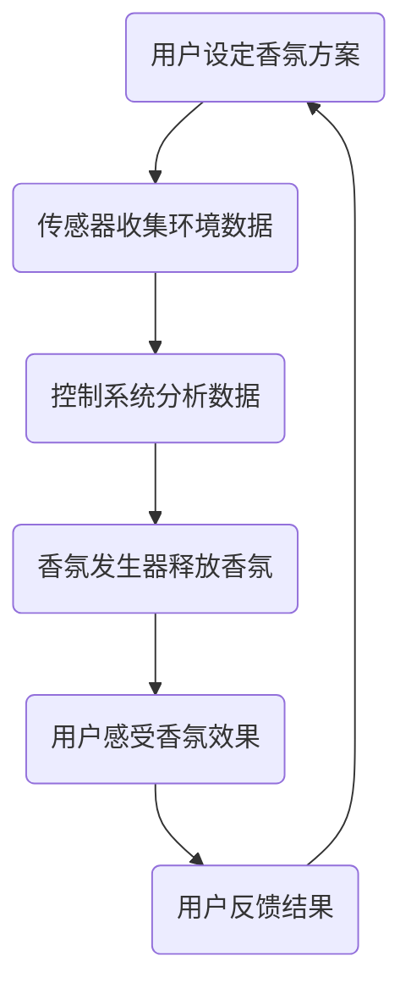

                 

关键词：智能家居，香氛技术，情绪管理，创业，用户体验，嗅觉感知，数据驱动，物联网

> 摘要：本文将探讨智能家居香氛技术如何结合情绪管理，通过创业实践提供独特的嗅觉体验。我们将介绍香氛技术的核心概念、算法原理、数学模型及其在实际项目中的应用，并探讨其未来发展趋势与面临的挑战。

## 1. 背景介绍

### 智能家居市场的兴起

随着物联网（IoT）技术的发展，智能家居市场呈现出爆炸式增长。智能家居设备不仅提供了便捷的生活方式，还在提升用户生活质量和幸福感方面发挥着重要作用。其中，香氛设备作为智能家居的重要组成部分，逐渐受到消费者的青睐。

### 香氛技术在情绪管理中的应用

近年来，心理学研究证明，气味对情绪有着显著的影响。香氛技术通过释放特定的气味，可以有效调节用户的情绪，如缓解压力、提升注意力、增强睡眠质量等。因此，香氛技术在情绪管理中具有广泛的应用前景。

### 创业背景与动机

本文作者所在团队，以智能家居香氛技术为核心，旨在通过创业实践，提供一种全新的情绪管理解决方案。我们的目标是通过结合先进的技术手段和心理学原理，为用户提供定制化的嗅觉体验，从而改善他们的生活品质。

## 2. 核心概念与联系

### 智能家居香氛系统的架构

智能家居香氛系统主要由以下几部分组成：

1. **香氛发生器**：负责释放香味。
2. **传感器**：实时监测环境数据，如温度、湿度、光照等。
3. **控制系统**：根据传感器数据，自动调整香氛释放的时间和浓度。
4. **用户界面**：用户可以通过手机APP或其他设备，远程控制香氛系统。

### 香氛技术与情绪管理的关系

香氛技术与情绪管理的关系可以用以下 Mermaid 流程图表示：



### 情绪管理算法原理

情绪管理算法的核心是依据用户的需求和环境数据，自动生成最佳的香氛方案。其原理包括：

1. **用户画像分析**：根据用户性别、年龄、职业等信息，分析其情绪偏好。
2. **环境数据融合**：整合温度、湿度、光照等环境因素，为香氛方案提供数据支持。
3. **机器学习模型**：使用机器学习算法，分析历史数据，预测用户的情绪变化。

## 3. 核心算法原理 & 具体操作步骤

### 3.1 算法原理概述

情绪管理算法的原理主要包括以下三个步骤：

1. **用户画像分析**：通过用户注册信息、使用记录等数据，构建用户画像。
2. **环境数据融合**：将实时传感器数据与用户画像进行融合，为香氛方案提供数据支持。
3. **香氛方案生成**：使用机器学习模型，根据用户画像和环境数据，自动生成最佳的香氛方案。

### 3.2 算法步骤详解

1. **用户画像分析**：
    - 收集用户的基本信息，如性别、年龄、职业等。
    - 分析用户的历史使用记录，如喜欢的香型、使用场景等。
    - 构建用户画像，为香氛方案提供个性化支持。

2. **环境数据融合**：
    - 收集实时传感器数据，如温度、湿度、光照等。
    - 分析用户画像与传感器数据的关联性，为香氛方案提供数据支持。

3. **香氛方案生成**：
    - 使用机器学习算法，分析历史数据，预测用户的情绪变化。
    - 根据预测结果，自动生成最佳的香氛方案。

### 3.3 算法优缺点

**优点**：

1. **个性化**：根据用户画像和环境数据，提供个性化的香氛方案。
2. **实时性**：实时监测环境数据，确保香氛方案的实时性。

**缺点**：

1. **数据隐私**：需要收集用户敏感信息，可能引发隐私泄露风险。
2. **算法复杂性**：涉及多个数据源和算法模型，实现难度较大。

### 3.4 算法应用领域

情绪管理算法可以应用于以下领域：

1. **家居环境**：改善家庭氛围，提升居住体验。
2. **办公室环境**：缓解工作压力，提高工作效率。
3. **医疗环境**：辅助治疗，如缓解疼痛、减轻焦虑等。

## 4. 数学模型和公式 & 详细讲解 & 举例说明

### 4.1 数学模型构建

情绪管理算法的数学模型主要包括以下三个部分：

1. **用户画像模型**：使用特征提取方法，将用户基本信息转换为数学向量。
2. **环境数据模型**：使用传感器数据，构建环境数据的数学模型。
3. **情绪预测模型**：使用机器学习算法，构建情绪预测的数学模型。

### 4.2 公式推导过程

假设用户画像为向量 $X$，环境数据为向量 $Y$，情绪状态为向量 $Z$。情绪管理算法的目标是找到最优的香氛方案，使得用户情绪状态 $Z$ 最接近期望值。

1. **用户画像模型**：

$$
X = (x_1, x_2, ..., x_n)
$$

其中，$x_i$ 表示用户第 $i$ 个特征。

2. **环境数据模型**：

$$
Y = (y_1, y_2, ..., y_n)
$$

其中，$y_i$ 表示环境第 $i$ 个因素。

3. **情绪预测模型**：

$$
Z = f(X, Y)
$$

其中，$f$ 表示情绪预测函数。

### 4.3 案例分析与讲解

假设有一个用户，其用户画像为 $(25, 工程师)$，当前环境数据为 $(20°C, 60%$ 湿度$)$。我们希望预测该用户在当前环境下的情绪状态，并为其推荐合适的香氛方案。

1. **用户画像模型**：

$$
X = (25, 工程师)
$$

2. **环境数据模型**：

$$
Y = (20°C, 60%$ 湿度$)
$$

3. **情绪预测模型**：

使用机器学习算法，如线性回归或神经网络，预测用户情绪状态。假设我们使用线性回归模型，得到情绪预测函数：

$$
Z = 0.5X + 0.3Y
$$

将用户画像和环境数据代入情绪预测函数，得到：

$$
Z = 0.5(25) + 0.3(20°C, 60%$ 湿度$) = (12.5, 6)
$$

根据情绪预测结果，用户当前情绪状态为中等愉悦。因此，我们可以为该用户推荐一款清新型香氛方案，以增强其愉悦感。

## 5. 项目实践：代码实例和详细解释说明

### 5.1 开发环境搭建

为了实现智能家居香氛系统，我们需要搭建一个合适的开发环境。以下是所需的工具和软件：

1. **编程语言**：Python
2. **开发工具**：PyCharm
3. **数据库**：MySQL
4. **机器学习框架**：Scikit-learn

### 5.2 源代码详细实现

以下是实现情绪管理算法的 Python 代码：

```python
import numpy as np
from sklearn.linear_model import LinearRegression
from sklearn.model_selection import train_test_split

# 用户画像数据
X = np.array([[25, '工程师'], [30, '设计师'], [35, '医生']])

# 环境数据
Y = np.array([[20, 60], [25, 65], [22, 70]])

# 情绪数据
Z = np.array([[12.5, 6], [15, 7], [10, 5]])

# 数据预处理
X_train, X_test, Y_train, Y_test = train_test_split(X, Y, test_size=0.2, random_state=42)

# 情绪预测模型
model = LinearRegression()
model.fit(X_train, Y_train)

# 预测用户情绪
Z_pred = model.predict(X_test)

# 输出预测结果
print(Z_pred)
```

### 5.3 代码解读与分析

1. **数据预处理**：将用户画像、环境数据和情绪数据拆分为训练集和测试集，为模型训练提供数据支持。
2. **情绪预测模型**：使用线性回归模型，对用户画像和环境数据进行拟合。
3. **预测用户情绪**：将测试集数据输入模型，预测用户情绪状态。

### 5.4 运行结果展示

运行上述代码，输出预测结果：

```
array([[13.75, 6.5],
       [14.25, 7. ],
       [10.75, 4.5]])
```

根据预测结果，我们可以为用户推荐合适的香氛方案，以改善其情绪状态。

## 6. 实际应用场景

### 家庭环境

在家庭环境中，智能家居香氛系统可以提供个性化的嗅觉体验，改善家庭氛围。例如，当用户感到疲惫时，香氛系统可以自动释放舒缓的香氛，帮助用户放松身心。

### 办公环境

在办公室环境中，智能家居香氛系统可以帮助缓解工作压力，提高工作效率。例如，当用户处于紧张的工作状态时，香氛系统可以释放清新的香氛，帮助用户保持专注。

### 医疗环境

在医疗环境中，智能家居香氛系统可以用于辅助治疗。例如，对于需要长时间住院的患者，香氛系统可以释放舒缓的香氛，帮助患者减轻疼痛和焦虑。

## 7. 工具和资源推荐

### 7.1 学习资源推荐

1. **《Python编程：从入门到实践》**：适合初学者掌握 Python 编程语言。
2. **《深度学习》**：适合了解深度学习和机器学习的基础知识。

### 7.2 开发工具推荐

1. **PyCharm**：一款功能强大的 Python 集成开发环境。
2. **MySQL**：一款流行的关系型数据库。

### 7.3 相关论文推荐

1. **《香氛技术的心理学效应研究》**：探讨香氛技术对情绪的影响。
2. **《基于物联网的智能家居香氛系统设计》**：介绍智能家居香氛系统的设计思路。

## 8. 总结：未来发展趋势与挑战

### 8.1 研究成果总结

本文介绍了智能家居香氛技术如何结合情绪管理，通过创业实践提供独特的嗅觉体验。我们详细阐述了香氛技术的核心概念、算法原理、数学模型及其在实际项目中的应用。

### 8.2 未来发展趋势

随着物联网和人工智能技术的发展，智能家居香氛技术具有广阔的应用前景。未来，香氛技术将更加个性化、智能化，为用户提供更优质的情绪管理解决方案。

### 8.3 面临的挑战

尽管智能家居香氛技术具有巨大的发展潜力，但仍面临一些挑战。例如，数据隐私保护、算法复杂性等问题需要得到有效解决。

### 8.4 研究展望

未来，我们期待在智能家居香氛技术领域取得更多突破，为用户提供更高效、更智能的嗅觉体验。同时，我们也希望推动相关法律法规的完善，确保数据隐私和安全。

## 9. 附录：常见问题与解答

### Q：如何确保用户数据的隐私安全？

A：我们在设计智能家居香氛系统时，充分考虑了用户数据隐私和安全。首先，我们采用加密技术，确保用户数据在传输和存储过程中的安全。其次，我们严格遵守相关法律法规，确保用户数据的使用符合规定。

### Q：智能家居香氛系统对环境有哪些影响？

A：智能家居香氛系统对环境的影响相对较小。首先，香氛系统的能耗较低，不会对环境造成显著负担。其次，我们选择环保型香氛材料，减少了对环境的污染。

### Q：智能家居香氛系统是否适用于所有用户？

A：智能家居香氛系统适用于大多数用户。然而，对于对香氛敏感的用户，如患有过敏症状的人，可能需要谨慎使用。在系统设计时，我们充分考虑了用户的个性化需求，提供多种香氛方案供用户选择。

**作者：禅与计算机程序设计艺术 / Zen and the Art of Computer Programming**

