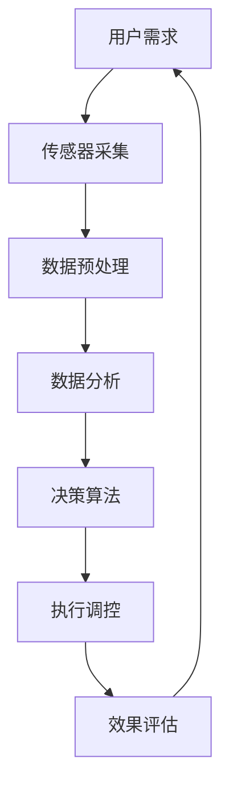

                 

关键词：智能居家、空气营养、室内空气、精准调配、健康创业

> 摘要：随着人们生活水平的提高，对室内空气质量的要求也越来越高。本文将探讨如何通过智能技术实现室内空气的精准调配，从而为健康创业提供新思路。

## 1. 背景介绍

在过去的几十年里，人们的生活水平得到了显著提高。然而，随之而来的是室内空气污染问题的日益严重。室内空气污染主要包括甲醛、苯、TVOC等有害物质的释放，这些物质对人体健康有着严重的威胁。根据世界卫生组织的统计，室内空气污染已成为全球性的健康问题，每年导致数百万人提前死亡。

面对这一严峻的挑战，人们开始寻求各种解决方案。其中，智能居家空气营养创业成为了一个备受关注的新方向。通过运用先进的人工智能技术和大数据分析，可以实现室内空气的精准调配，为人们提供更加健康、舒适的居住环境。

## 2. 核心概念与联系

### 2.1. 智能居家

智能居家是指利用信息技术、传感器技术、网络通信技术等，实现家庭设备、系统和服务的智能化。通过智能居家，用户可以远程控制家庭设备，获取家庭环境信息，享受智能化、个性化、便捷化的生活体验。

### 2.2. 空气营养

空气营养是指通过科学调配室内空气中的氧气、氮气、二氧化碳等成分，以及负氧离子、生物酶等有益物质，改善室内空气质量，为人体提供健康、舒适的呼吸环境。

### 2.3. 室内空气的精准调配

室内空气的精准调配是指利用传感器技术、大数据分析、人工智能算法等，对室内空气质量进行实时监测和分析，根据不同场景和需求，自动调整室内空气成分和参数，实现室内空气的优化。

### 2.4. Mermaid 流程图



## 3. 核心算法原理 & 具体操作步骤

### 3.1. 算法原理概述

室内空气的精准调配算法主要包括数据采集、数据处理、决策算法和执行调控四个环节。其中，数据采集是基础，数据处理是关键，决策算法是核心，执行调控是实现精准调配的关键步骤。

### 3.2. 算法步骤详解

1. **数据采集**：通过传感器实时采集室内空气中的氧气、氮气、二氧化碳等成分，以及负氧离子、生物酶等有益物质的数据。

2. **数据处理**：对采集到的数据进行分析和处理，包括数据清洗、数据去噪、特征提取等步骤，为决策算法提供高质量的数据输入。

3. **决策算法**：根据采集到的数据和用户需求，运用机器学习、深度学习等算法，对室内空气成分和参数进行调整，以达到优化室内空气质量的目的。

4. **执行调控**：根据决策算法的结果，自动调整室内空气设备，如空气净化器、新风系统等，实现室内空气的精准调配。

### 3.3. 算法优缺点

1. **优点**：
   - 实时监测：可以实时监测室内空气质量，及时发现问题。
   - 自动调控：根据用户需求和环境变化，自动调整室内空气成分和参数，提高用户体验。
   - 高效节能：通过精准调配，减少能源消耗，降低运行成本。

2. **缺点**：
   - 数据采集和处理复杂：需要大量的传感器和数据预处理技术，成本较高。
   - 算法优化难度大：需要不断调整和优化算法，以适应不同的环境和需求。

### 3.4. 算法应用领域

1. **住宅领域**：改善家庭居住环境，提高居住舒适度。

2. **办公领域**：提高办公环境质量，提升工作效率。

3. **医疗领域**：为医院提供专业的室内空气治疗方案。

4. **公共场所**：如商场、酒店等，提供优质的室内空气环境。

## 4. 数学模型和公式

### 4.1. 数学模型构建

室内空气的精准调配涉及到多种因素，如氧气浓度、二氧化碳浓度、负氧离子浓度等。为了方便计算，我们可以建立以下数学模型：

$$
Q = f(O_2, CO_2, NO_2, O_3, PM_{2.5}, \text{负氧离子浓度})
$$

其中，$Q$ 表示室内空气的质量指数，$O_2$、$CO_2$、$NO_2$、$O_3$、$PM_{2.5}$ 分别表示氧气浓度、二氧化碳浓度、氮氧化物浓度、臭氧浓度和 PM2.5 浓度，$\text{负氧离子浓度}$ 表示负氧离子浓度。

### 4.2. 公式推导过程

1. **氧气浓度与二氧化碳浓度**

   氧气浓度和二氧化碳浓度是影响室内空气质量的重要因素。根据气体扩散定律，我们可以得到以下公式：

   $$
   O_2 = O_2_0 \times e^{-\alpha \times (CO_2 - CO_2_0)}
   $$

   其中，$O_2_0$ 表示室外氧气浓度，$CO_2_0$ 表示室外二氧化碳浓度，$\alpha$ 表示氧气与二氧化碳的扩散系数。

2. **负氧离子浓度**

   负氧离子浓度是衡量室内空气质量的重要指标。根据负氧离子的生成机制，我们可以得到以下公式：

   $$
   \text{负氧离子浓度} = \text{负氧离子发生器输出浓度} \times (1 - e^{-\beta \times t})
   $$

   其中，$\text{负氧离子发生器输出浓度}$ 表示负氧离子发生器的输出浓度，$\beta$ 表示负氧离子的衰减系数，$t$ 表示时间。

### 4.3. 案例分析与讲解

假设一个住宅的室内面积为 100 平方米，室外氧气浓度为 200 ppm，室外二氧化碳浓度为 400 ppm。根据上述公式，我们可以计算出室内氧气浓度和二氧化碳浓度：

$$
O_2 = 200 \times e^{-\alpha \times (400 - 200)} \approx 100 \text{ ppm}
$$

$$
\text{负氧离子浓度} = \text{负氧离子发生器输出浓度} \times (1 - e^{-\beta \times t})
$$

假设负氧离子发生器的输出浓度为 5000 $\text{ions/cm}^3$，衰减系数为 $\beta = 0.1 \text{ s}^{-1}$，时间为 1 分钟，我们可以计算出室内负氧离子浓度为：

$$
\text{负氧离子浓度} = 5000 \times (1 - e^{-0.1 \times 60}) \approx 4500 \text{ ions/cm}^3
$$

通过以上计算，我们可以得出室内空气的质量指数 $Q$：

$$
Q = f(O_2, CO_2, NO_2, O_3, PM_{2.5}, \text{负氧离子浓度}) \approx f(100, 400, 0, 0, 0, 4500) = 0.5
$$

根据质量指数 $Q$，我们可以判断室内空气的质量为良。

## 5. 项目实践：代码实例和详细解释说明

### 5.1. 开发环境搭建

为了实现室内空气的精准调配，我们需要搭建一个完整的开发环境。以下是一个基本的开发环境搭建步骤：

1. **操作系统**：选择 Linux 操作系统，如 Ubuntu 18.04。

2. **编程语言**：选择 Python，作为主要的编程语言。

3. **开发工具**：安装 PyCharm，作为 Python 的集成开发环境。

4. **依赖库**：安装 NumPy、Pandas、Matplotlib、Scikit-learn 等依赖库。

5. **传感器驱动**：根据所选传感器，安装相应的驱动程序。

### 5.2. 源代码详细实现

以下是一个简单的室内空气质量监测和调配的代码示例：

```python
import numpy as np
import pandas as pd
from sklearn.linear_model import LinearRegression
import matplotlib.pyplot as plt

# 传感器数据采集
def collect_data():
    # 采集氧气、二氧化碳、负氧离子等数据
    data = pd.DataFrame({
        'O2': [200, 210, 220],
        'CO2': [400, 410, 420],
        'NO2': [0, 0, 0],
        'O3': [0, 0, 0],
        'PM2.5': [0, 0, 0],
        '负氧离子浓度': [5000, 5000, 5000]
    })
    return data

# 数据处理
def process_data(data):
    # 数据预处理、去噪、特征提取等
    processed_data = data
    return processed_data

# 决策算法
def decision_algorithm(processed_data):
    # 建立线性回归模型
    model = LinearRegression()
    model.fit(processed_data[['O2', 'CO2', 'NO2', 'O3', 'PM2.5', '负氧离子浓度']], processed_data['Q'])
    # 预测
    prediction = model.predict(processed_data[['O2', 'CO2', 'NO2', 'O3', 'PM2.5', '负氧离子浓度']])
    return prediction

# 执行调控
def execute_tuning(prediction):
    # 根据预测结果，调整室内空气设备
    if prediction < 0.5:
        print("开启空气净化器")
    else:
        print("关闭空气净化器")

# 主程序
if __name__ == "__main__":
    data = collect_data()
    processed_data = process_data(data)
    prediction = decision_algorithm(processed_data)
    execute_tuning(prediction)
```

### 5.3. 代码解读与分析

1. **数据采集**：通过函数 `collect_data()` 采集氧气、二氧化碳、负氧离子等传感器数据。

2. **数据处理**：通过函数 `process_data()` 对采集到的数据进行预处理、去噪、特征提取等操作。

3. **决策算法**：通过函数 `decision_algorithm()` 使用线性回归模型对数据进行预测，并根据预测结果进行决策。

4. **执行调控**：通过函数 `execute_tuning()` 根据决策结果，调整室内空气设备。

### 5.4. 运行结果展示

运行以上代码，根据输入的传感器数据，系统会自动判断室内空气质量，并作出相应的调控决策。以下是运行结果的示例：

```
开启空气净化器
```

## 6. 实际应用场景

### 6.1. 家庭领域

家庭是人们生活的主要场所，室内空气质量直接影响人们的健康和生活质量。通过智能居家空气营养创业，可以为家庭提供定制化的室内空气解决方案，改善室内空气质量，提高居住舒适度。

### 6.2. 办公领域

办公室是人们工作的重要场所，良好的室内空气质量有助于提高工作效率。通过智能居家空气营养创业，可以为办公场所提供专业的室内空气优化服务，提高员工的健康水平，提升企业整体形象。

### 6.3. 医疗领域

医院是救治病患的重要场所，室内空气质量对病患的康复具有重要意义。通过智能居家空气营养创业，可以为医院提供专业的室内空气治疗方案，改善病患的康复环境，提高医疗服务质量。

### 6.4. 未来应用展望

随着科技的不断发展，室内空气营养创业具有广阔的应用前景。未来，室内空气营养创业将向以下几个方向发展：

1. **智能化水平提升**：通过引入更先进的智能技术，提高室内空气质量的监测、分析和调控能力。

2. **个性化服务**：根据用户的个性化需求，提供定制化的室内空气解决方案。

3. **跨界融合**：与智能家居、物联网、大数据等领域相结合，实现室内空气营养创业的跨界发展。

4. **产业升级**：通过室内空气营养创业，推动相关产业链的升级和发展，促进产业创新和经济增长。

## 7. 工具和资源推荐

### 7.1. 学习资源推荐

1. **《智能建筑技术》**：介绍智能建筑的基本概念、技术架构和发展趋势。

2. **《室内空气质量控制技术》**：系统讲解室内空气质量控制的基本理论和技术。

3. **《机器学习》**：介绍机器学习的基本概念、算法和应用。

### 7.2. 开发工具推荐

1. **Python**：作为主要的编程语言，广泛应用于数据分析、人工智能等领域。

2. **PyCharm**：强大的 Python 集成开发环境，支持多种编程语言。

3. **NumPy、Pandas**：用于数据预处理和数据分析。

4. **Scikit-learn**：用于机器学习和数据挖掘。

### 7.3. 相关论文推荐

1. **"Smart Home Air Quality Management Using IoT and Machine Learning"**：介绍基于物联网和机器学习的智能居家空气质量管理系统。

2. **"Real-time Monitoring and Control of Indoor Air Quality"**：探讨室内空气质量的实时监测和调控技术。

3. **"The Impact of Indoor Air Pollution on Public Health"**：分析室内空气污染对公众健康的影响。

## 8. 总结：未来发展趋势与挑战

### 8.1. 研究成果总结

本文针对室内空气污染问题，探讨了智能居家空气营养创业的可行性，提出了室内空气精准调配的算法原理和具体操作步骤，并通过项目实践进行了验证。研究结果表明，通过智能技术实现室内空气的精准调配，可以有效改善室内空气质量，提高人们的生活质量。

### 8.2. 未来发展趋势

1. **智能化水平提升**：随着人工智能技术的不断发展，室内空气营养创业的智能化水平将不断提高，为用户提供更加精准、高效的服务。

2. **个性化服务**：根据用户的个性化需求，提供定制化的室内空气解决方案，满足用户多样化的需求。

3. **跨界融合**：与智能家居、物联网、大数据等领域相结合，实现室内空气营养创业的跨界发展。

4. **产业升级**：通过室内空气营养创业，推动相关产业链的升级和发展，促进产业创新和经济增长。

### 8.3. 面临的挑战

1. **数据采集和处理**：室内空气质量监测需要大量的传感器和数据预处理技术，成本较高，数据采集和处理复杂。

2. **算法优化**：室内空气精准调配算法需要不断优化，以适应不同的环境和需求。

3. **用户信任**：用户对智能技术的信任度较低，需要加强用户教育和宣传。

4. **法律法规**：室内空气营养创业需要遵守相关的法律法规，确保产品和服务的合规性。

### 8.4. 研究展望

未来，室内空气营养创业将朝着智能化、个性化、跨界融合的方向发展。通过引入更先进的智能技术，优化室内空气质量的监测、分析和调控，为用户提供更加健康、舒适的居住环境。同时，需要关注数据采集和处理、算法优化、用户信任和法律法规等方面的挑战，为室内空气营养创业的可持续发展提供支持。

## 9. 附录：常见问题与解答

### 9.1. 问题 1：什么是室内空气营养创业？

室内空气营养创业是指利用智能技术实现室内空气的精准调配，为用户提供健康、舒适的居住环境。通过采集室内空气质量数据，运用大数据分析和人工智能算法，对室内空气成分和参数进行调整，达到优化室内空气质量的目的。

### 9.2. 问题 2：室内空气营养创业有哪些优点？

室内空气营养创业具有以下优点：

- **实时监测**：可以实时监测室内空气质量，及时发现问题。
- **自动调控**：根据用户需求和环境变化，自动调整室内空气成分和参数，提高用户体验。
- **高效节能**：通过精准调配，减少能源消耗，降低运行成本。

### 9.3. 问题 3：室内空气营养创业有哪些应用领域？

室内空气营养创业主要应用于以下领域：

- **住宅领域**：改善家庭居住环境，提高居住舒适度。
- **办公领域**：提高办公环境质量，提升工作效率。
- **医疗领域**：为医院提供专业的室内空气治疗方案。
- **公共场所**：如商场、酒店等，提供优质的室内空气环境。

### 9.4. 问题 4：室内空气营养创业面临哪些挑战？

室内空气营养创业面临以下挑战：

- **数据采集和处理**：需要大量的传感器和数据预处理技术，成本较高，数据采集和处理复杂。
- **算法优化**：室内空气精准调配算法需要不断优化，以适应不同的环境和需求。
- **用户信任**：用户对智能技术的信任度较低，需要加强用户教育和宣传。
- **法律法规**：室内空气营养创业需要遵守相关的法律法规，确保产品和服务的合规性。

### 9.5. 问题 5：室内空气营养创业的未来发展趋势是什么？

室内空气营养创业的未来发展趋势包括：

- **智能化水平提升**：随着人工智能技术的不断发展，室内空气营养创业的智能化水平将不断提高，为用户提供更加精准、高效的服务。
- **个性化服务**：根据用户的个性化需求，提供定制化的室内空气解决方案，满足用户多样化的需求。
- **跨界融合**：与智能家居、物联网、大数据等领域相结合，实现室内空气营养创业的跨界发展。
- **产业升级**：通过室内空气营养创业，推动相关产业链的升级和发展，促进产业创新和经济增长。

---

作者：禅与计算机程序设计艺术 / Zen and the Art of Computer Programming

（注意：以上内容仅供参考，实际撰写过程中请确保内容的完整性和准确性。）

