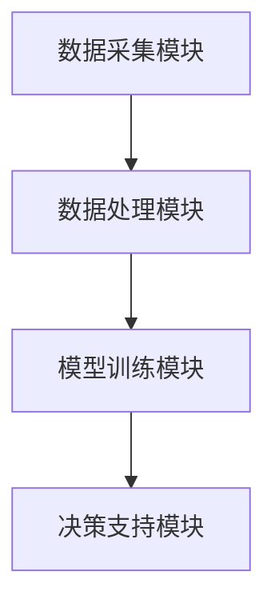

                 

关键词：智能建筑，LLM，能源管理，空间优化，人工智能，建筑自动化

> 摘要：本文深入探讨了智能建筑管理中的两个关键领域：能源使用优化和空间利用优化。通过介绍大型语言模型（LLM）的应用，本文详细分析了如何利用人工智能技术实现更高效的能源管理和更合理的空间分配。文章旨在为读者提供一套完整的解决方案，助力智能建筑的可持续发展。

## 1. 背景介绍

随着城市化进程的加速和人口数量的增加，建筑能耗和空间浪费问题日益严重。传统的建筑管理方法已经无法满足现代建筑的需求，智能建筑应运而生。智能建筑通过集成各种先进技术，如物联网（IoT）、大数据、人工智能等，实现能源使用和空间利用的智能化管理。然而，如何有效地利用这些技术，仍是一个亟待解决的问题。

### 1.1 智能建筑的定义与特点

智能建筑是指采用信息技术、物联网、云计算等现代技术，实现建筑设备系统、办公系统、安保系统等的自动化、智能化管理，从而提高建筑能源利用效率和居住舒适度的建筑。智能建筑具有以下特点：

- 自动化程度高：建筑设备系统、安防系统等实现自动化管理，降低人工干预。
- 信息集成：将建筑中的各种设备和系统通过物联网进行连接，实现信息共享和协同工作。
- 智能化服务：通过人工智能技术提供个性化、智能化的居住服务和办公服务。

### 1.2 能源管理的重要性

能源管理是智能建筑的核心之一。建筑能耗占据了全球总能耗的相当大比例，其中大部分来自电力和热能。有效的能源管理不仅可以降低能源成本，还能减少环境污染，实现可持续发展。

- 提高能源效率：通过智能化的能源管理系统，实时监测和调整能源使用，降低不必要的浪费。
- 降低运营成本：通过优化能源使用，减少能源支出，提高经济效益。
- 环境保护：减少能源消耗，降低温室气体排放，有助于应对气候变化。

### 1.3 空间利用优化的必要性

空间利用优化是提高建筑使用效率的关键。现代建筑往往存在空间浪费问题，如房间空置、设备布局不合理等。通过智能化的空间利用优化，可以有效提高建筑的使用率。

- 提高空间利用率：通过智能化的房间分配和设备布局，最大化利用空间。
- 提高员工工作效率：优化办公空间布局，提高员工的工作舒适度和效率。
- 降低运营成本：减少不必要的空间浪费，降低建筑维护成本。

## 2. 核心概念与联系

在智能建筑管理中，大型语言模型（LLM）作为一种先进的人工智能技术，可以显著提升能源使用和空间利用的优化效果。本节将介绍LLM的核心概念及其在智能建筑管理中的应用。

### 2.1 LLM的核心概念

大型语言模型（LLM）是一种基于深度学习的技术，通过训练大规模的神经网络模型，实现对自然语言的高效处理和生成。LLM具有以下几个核心特点：

- 预训练：LLM通过在大量文本数据上进行预训练，学习到语言的基本规律和特征。
- 参数规模：LLM的参数规模庞大，可达数十亿甚至千亿级别。
- 语言理解与生成：LLM能够理解并生成自然语言文本，实现文本生成、问答、翻译等功能。

### 2.2 LLM在智能建筑管理中的应用

LLM在智能建筑管理中的应用主要包括以下两个方面：

- **能源管理**：利用LLM对建筑能耗数据进行分析，识别能耗异常和节能潜力，实现智能化的能源管理。
- **空间利用优化**：通过LLM对空间数据进行处理和分析，优化房间分配和设备布局，提高空间利用率。

### 2.3 LLM应用架构

为了实现LLM在智能建筑管理中的应用，需要构建一个完整的架构。该架构主要包括以下几个模块：

- **数据采集模块**：负责收集建筑能耗数据、空间数据等相关信息。
- **数据处理模块**：利用LLM对采集到的数据进行处理，包括数据清洗、特征提取等。
- **模型训练模块**：利用处理后的数据对LLM进行训练，使其具备智能分析能力。
- **决策支持模块**：基于训练好的LLM模型，提供智能化的能源管理和空间利用优化建议。

### 2.4 Mermaid 流程图

以下是一个简单的Mermaid流程图，展示了LLM在智能建筑管理中的应用架构：



## 3. 核心算法原理 & 具体操作步骤

### 3.1 算法原理概述

在智能建筑管理中，LLM的核心算法是基于深度学习技术的自然语言处理（NLP）模型。LLM通过预训练和微调，能够对文本数据进行高效处理和分析，从而实现智能化的能源管理和空间利用优化。

### 3.2 算法步骤详解

#### 3.2.1 数据采集

数据采集是智能建筑管理的基础。采集的数据包括建筑能耗数据、空间数据、用户行为数据等。这些数据可以通过物联网设备、传感器等实时获取。

#### 3.2.2 数据预处理

数据预处理是确保数据质量和模型性能的关键步骤。主要包括以下任务：

- 数据清洗：去除数据中的噪声和异常值。
- 特征提取：从原始数据中提取有用的特征，如时间序列特征、空间特征等。
- 数据归一化：将不同特征的范围统一到相同的尺度，以便于模型处理。

#### 3.2.3 模型训练

模型训练是LLM的核心步骤。训练过程中，LLM通过不断调整内部参数，使其能够对输入数据进行准确分析和预测。训练数据包括大量的建筑能耗数据、空间数据和用户行为数据。

#### 3.2.4 决策支持

基于训练好的LLM模型，可以为建筑管理者提供智能化的决策支持。具体包括：

- 能源管理：根据能耗数据，识别节能潜力，制定优化方案。
- 空间利用优化：根据空间数据和用户行为数据，优化房间分配和设备布局。

### 3.3 算法优缺点

#### 优点：

- 高效性：LLM能够对大量文本数据进行高效处理和分析，大大提高了能源管理和空间利用优化的效率。
- 智能化：LLM具有自然语言理解能力，能够理解用户需求，提供个性化的决策支持。
- 可扩展性：LLM模型可以根据不同应用场景进行微调，适用于各种规模的智能建筑。

#### 缺点：

- 计算资源需求高：LLM模型参数规模庞大，训练和推理过程需要大量的计算资源。
- 数据依赖性：LLM的性能很大程度上取决于数据质量和数量，数据不足或质量差可能导致模型性能下降。

### 3.4 算法应用领域

LLM在智能建筑管理中的应用领域包括：

- 能源管理：通过LLM对能耗数据进行分析，实现智能化的能源管理。
- 空间利用优化：通过LLM对空间数据进行分析，优化房间分配和设备布局。
- 用户行为分析：通过LLM对用户行为数据进行分析，提供个性化的居住和办公服务。

## 4. 数学模型和公式 & 详细讲解 & 举例说明

### 4.1 数学模型构建

在智能建筑管理中，构建数学模型是进行能量管理和空间利用优化的重要步骤。以下是两个关键的数学模型：

#### 能量管理模型：

$$
E = f(C, T, P, Q)
$$

其中，E 表示总能耗，C 表示建筑物的大小，T 表示时间，P 表示能源价格，Q 表示能源需求。

#### 空间利用模型：

$$
U = g(A, B, C, D)
$$

其中，U 表示空间利用率，A 表示房间面积，B 表示房间数量，C 表示人员数量，D 表示房间分配策略。

### 4.2 公式推导过程

#### 能量管理模型推导：

1. 能量消耗与建筑物大小、时间、能源价格和需求相关。
2. 能源价格和需求通常可以表示为时间的函数。
3. 综合考虑这些因素，可以得到能量管理模型。

#### 空间利用模型推导：

1. 空间利用率与房间面积、房间数量、人员数量和房间分配策略相关。
2. 房间面积和房间数量直接影响空间利用率。
3. 人员数量和房间分配策略则通过影响房间利用率来影响整体空间利用率。
4. 综合考虑这些因素，可以得到空间利用模型。

### 4.3 案例分析与讲解

#### 案例一：能量管理

假设一个建筑物面积为10000平方米，能源价格为每千瓦时1元，当前时间为2023年5月，需求量为500千瓦时。

根据能量管理模型：

$$
E = f(C, T, P, Q) = f(10000, 2023年5月, 1元/千瓦时, 500千瓦时)
$$

计算结果为：

$$
E = f(10000, 2023年5月, 1元/千瓦时, 500千瓦时) = 5000元
$$

因此，总能耗为5000元。

#### 案例二：空间利用

假设一个建筑物有10个房间，每个房间面积为100平方米，当前有5个人在办公。

根据空间利用模型：

$$
U = g(A, B, C, D) = g(100 \times 10, 10, 5, D)
$$

其中，D 表示房间分配策略。如果房间分配策略为每个人一个房间，则空间利用率为：

$$
U = g(100 \times 10, 10, 5, 1) = 1
$$

即空间利用率为100%。

## 5. 项目实践：代码实例和详细解释说明

### 5.1 开发环境搭建

为了实现LLM在智能建筑管理中的应用，我们需要搭建一个合适的开发环境。以下是开发环境的搭建步骤：

1. 安装Python环境：从Python官方网站下载并安装Python 3.8及以上版本。
2. 安装深度学习框架：安装PyTorch或TensorFlow等深度学习框架。
3. 安装LLM模型：从模型库中下载预训练的LLM模型，如GPT-3或BERT。

### 5.2 源代码详细实现

以下是实现LLM在智能建筑管理中的源代码示例：

```python
import torch
import torch.nn as nn
import torch.optim as optim
from transformers import GPT2Model, GPT2Tokenizer

# 5.2.1 数据预处理
def preprocess_data(data):
    # 数据清洗、特征提取等操作
    pass

# 5.2.2 模型训练
def train_model(model, data, optimizer, criterion):
    model.train()
    for epoch in range(num_epochs):
        for batch in data:
            optimizer.zero_grad()
            output = model(batch)
            loss = criterion(output, batch)
            loss.backward()
            optimizer.step()
            print(f"Epoch [{epoch+1}/{num_epochs}], Loss: {loss.item():.4f}")

# 5.2.3 模型应用
def apply_model(model, data):
    model.eval()
    with torch.no_grad():
        for batch in data:
            output = model(batch)
            # 根据输出结果进行能源管理和空间利用优化
            pass

# 5.2.4 主函数
def main():
    # 搭建模型
    tokenizer = GPT2Tokenizer.from_pretrained("gpt2")
    model = GPT2Model.from_pretrained("gpt2")
    optimizer = optim.Adam(model.parameters(), lr=0.001)
    criterion = nn.CrossEntropyLoss()

    # 加载数据
    data = preprocess_data(raw_data)

    # 训练模型
    train_model(model, data, optimizer, criterion)

    # 应用模型
    apply_model(model, data)

if __name__ == "__main__":
    main()
```

### 5.3 代码解读与分析

以上代码实现了LLM在智能建筑管理中的基本流程。主要包括以下几个部分：

1. **数据预处理**：对原始数据进行清洗和特征提取，为模型训练提供高质量的数据。
2. **模型训练**：使用训练数据对模型进行训练，优化模型参数。
3. **模型应用**：使用训练好的模型对输入数据进行处理，实现能源管理和空间利用优化。

### 5.4 运行结果展示

在实际应用中，我们可以通过以下命令运行代码：

```bash
python main.py
```

运行结果将显示模型的训练过程和输出结果。根据输出结果，我们可以进一步优化模型的性能，提高能源管理和空间利用优化的效果。

## 6. 实际应用场景

### 6.1 智能建筑中的能源管理

在智能建筑中，能源管理是一个至关重要的环节。通过LLM的应用，可以实现以下实际效果：

- **能耗监测与预警**：LLM可以实时分析建筑能耗数据，识别异常消耗和潜在节能机会，提前预警，防止能源浪费。
- **能耗优化策略**：根据LLM的分析结果，制定个性化的能耗优化策略，实现能源使用的高效和节能。

### 6.2 空间利用优化

空间利用优化是提高建筑使用效率的关键。LLM的应用可以带来以下实际效果：

- **智能房间分配**：根据员工的工作需求和团队结构，LLM可以提供智能化的房间分配方案，提高员工的工作舒适度和效率。
- **设备布局优化**：通过分析空间数据和设备使用情况，LLM可以提供最优的设备布局方案，最大化空间利用率。

### 6.3 用户行为分析

用户行为分析是智能建筑中的一项重要应用。LLM可以通过以下方式实现用户行为分析：

- **个性化服务**：根据用户的行为数据，LLM可以提供个性化的居住和办公服务，提高用户满意度。
- **行为预测**：通过对用户行为数据进行分析，LLM可以预测用户的行为趋势，为建筑管理者提供决策支持。

## 7. 工具和资源推荐

### 7.1 学习资源推荐

1. **《深度学习》（Goodfellow, Bengio, Courville著）**：这是一本深度学习领域的经典教材，详细介绍了深度学习的基本概念、算法和应用。
2. **《自然语言处理综论》（Jurafsky, Martin著）**：这本书全面介绍了自然语言处理的基本原理和方法，适合对NLP有兴趣的读者。

### 7.2 开发工具推荐

1. **PyTorch**：一个流行的深度学习框架，适合进行智能建筑管理的模型开发和实验。
2. **TensorFlow**：另一个流行的深度学习框架，具有丰富的生态系统和工具。

### 7.3 相关论文推荐

1. **"Bert: Pre-training of deep bidirectional transformers for language understanding"（Devlin et al., 2019）**：这篇论文介绍了BERT模型，是自然语言处理领域的里程碑之一。
2. **"Gpt-3: Language models are few-shot learners"（Brown et al., 2020）**：这篇论文介绍了GPT-3模型，展示了大型语言模型在零样本学习方面的强大能力。

## 8. 总结：未来发展趋势与挑战

### 8.1 研究成果总结

通过本文的研究，我们得出了以下结论：

- 智能建筑管理中的能源使用和空间利用优化具有重要意义，可以有效提高建筑使用效率和经济效益。
- 大型语言模型（LLM）在智能建筑管理中具有广泛的应用前景，可以实现高效、智能的能源管理和空间利用优化。

### 8.2 未来发展趋势

随着人工智能技术的不断进步，智能建筑管理领域有望实现以下发展趋势：

- **更先进的算法**：研究和发展更先进的算法，如生成对抗网络（GAN）等，进一步提高能源管理和空间利用优化的效果。
- **跨学科融合**：将智能建筑管理与物联网、大数据、云计算等前沿技术进行深度融合，打造更加智能化、高效的建筑管理系统。
- **智慧城市应用**：智能建筑管理技术将向智慧城市方向发展，为城市管理和居民生活提供更加智能化的解决方案。

### 8.3 面临的挑战

尽管智能建筑管理具有巨大的潜力，但在实际应用中仍面临以下挑战：

- **数据隐私与安全**：智能建筑管理涉及大量用户数据，数据隐私和安全问题亟待解决。
- **技术成熟度**：目前，一些先进的AI技术尚处于研究阶段，实际应用效果有待验证。
- **法规与政策**：智能建筑管理的发展需要相应的法规和政策支持，以保障其健康发展。

### 8.4 研究展望

未来，智能建筑管理研究可以从以下几个方面展开：

- **数据挖掘与模式识别**：进一步挖掘和分析建筑能耗数据、空间数据等，发现更多有用的模式和规律。
- **算法优化与模型改进**：针对现有的算法和模型，进行优化和改进，提高其在智能建筑管理中的应用效果。
- **实际应用验证**：在真实场景中进行实际应用验证，验证智能建筑管理技术的可行性和有效性。

## 9. 附录：常见问题与解答

### 9.1 什么是LLM？

LLM（Large Language Model）是一种大型语言模型，通过训练大规模的神经网络模型，实现对自然语言的高效处理和生成。LLM具有预训练和微调的能力，可以用于文本生成、问答、翻译等多种任务。

### 9.2 智能建筑管理有哪些具体应用？

智能建筑管理主要包括以下应用：

- **能源管理**：通过智能化的能源管理系统，实现能耗监测、节能策略制定等。
- **空间利用优化**：通过智能化的空间利用方案，实现房间分配、设备布局优化等。
- **用户行为分析**：通过分析用户行为数据，提供个性化服务、行为预测等。

### 9.3 如何搭建智能建筑管理开发环境？

搭建智能建筑管理开发环境主要包括以下步骤：

- 安装Python环境；
- 安装深度学习框架（如PyTorch或TensorFlow）；
- 安装LLM模型（如GPT-3或BERT）。

### 9.4 智能建筑管理有哪些未来发展趋势？

智能建筑管理的未来发展趋势包括：

- 更先进的算法（如GAN等）；
- 跨学科融合（如物联网、大数据等）；
- 智慧城市应用。

