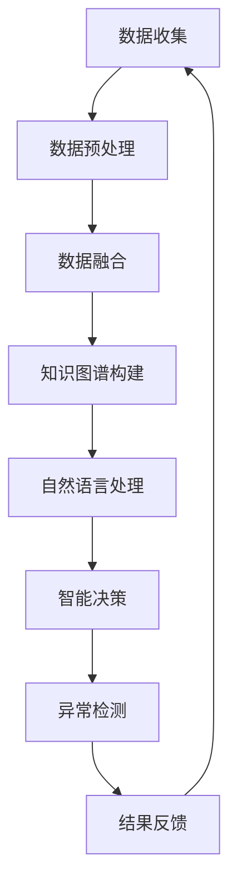

                 

关键词：智能建筑，能源管理，空间利用，大型语言模型（LLM），人工智能，建筑自动化，可持续发展

> 摘要：随着人工智能和物联网技术的快速发展，智能建筑管理已经成为现代建筑行业的重要组成部分。本文将探讨如何利用大型语言模型（LLM）优化智能建筑的能源使用和空间利用，提高建筑运营效率和可持续性。本文首先介绍了智能建筑管理的背景和现状，随后详细阐述了LLM在建筑能源管理和空间利用中的核心概念和原理，并提供了数学模型和公式推导过程。接着，通过项目实践展示了LLM在智能建筑管理中的应用，最后探讨了未来的发展方向和面临的挑战。

## 1. 背景介绍

智能建筑管理是指利用信息技术、物联网和人工智能等先进技术，对建筑物的能源使用、设备运行、环境控制等方面进行智能化管理和优化。随着城市化进程的加速和能源消耗的不断增加，智能建筑管理成为实现可持续发展的重要手段。传统的建筑管理模式主要依赖于人工监控和维护，存在效率低下、能耗高、安全性差等问题。

近年来，人工智能技术的快速发展为智能建筑管理带来了新的契机。其中，大型语言模型（LLM）作为一种先进的自然语言处理技术，已经在诸多领域取得了显著的应用成果。LLM通过学习大量语言数据，可以理解并生成人类语言，具有强大的语义理解和知识推理能力。将LLM应用于智能建筑管理，可以实现更精确、更智能的能源和空间利用优化，从而提高建筑运营效率和可持续性。

本文将围绕LLM在智能建筑管理中的应用，探讨其优化能源使用和空间利用的核心概念、算法原理、数学模型和实际应用案例，为智能建筑管理提供新的思路和方法。

## 2. 核心概念与联系

### 2.1 智能建筑管理基本概念

智能建筑管理涉及多个领域，包括建筑自动化、物联网、数据分析和人工智能等。以下是对这些核心概念的简要介绍：

- **建筑自动化**：通过自动化技术，实现建筑设备的智能控制，提高能源利用效率和舒适度。例如，自动调节室内温度、湿度、光照等。
- **物联网**：通过传感器和通信技术，将建筑中的各种设备和系统连接起来，实现信息的实时传输和共享。物联网为智能建筑管理提供了丰富的数据来源。
- **数据分析**：利用数据挖掘、机器学习等技术，对建筑运行数据进行深入分析和挖掘，为智能决策提供支持。
- **人工智能**：通过模拟人类智能，实现自动化决策、预测和优化。人工智能在智能建筑管理中发挥着关键作用，例如，通过预测能耗模式来优化能源使用。

### 2.2 LLM在智能建筑管理中的应用

LLM在智能建筑管理中的应用主要体现在以下几个方面：

- **自然语言处理**：LLM可以处理和分析与建筑相关的自然语言数据，如设备运行日志、用户反馈等，实现更精准的能源和空间利用优化。
- **知识图谱**：通过构建建筑知识图谱，LLM可以更好地理解建筑结构和功能，实现智能化的设备管理和空间分配。
- **智能决策**：利用LLM的推理能力，实现自动化决策，如根据环境变化调整室内温度、湿度等，提高用户舒适度和能源效率。
- **异常检测**：通过分析设备运行数据，LLM可以实时检测异常情况，如设备故障、能源泄漏等，提高建筑运行的安全性和可靠性。

### 2.3 Mermaid 流程图

为了更直观地展示LLM在智能建筑管理中的应用流程，我们使用Mermaid绘制了一个简化的流程图。以下是流程图的内容：



### 2.4 核心概念联系

智能建筑管理、物联网、数据分析和人工智能等多个领域相互关联，共同构成了智能建筑管理的核心框架。LLM作为人工智能的一种重要技术，通过整合这些领域的数据和信息，实现了对智能建筑管理的全面优化。以下是各核心概念之间的联系：

- **智能建筑管理**：是整个系统的核心，通过整合物联网、数据分析和人工智能等技术，实现对建筑运行的全过程管理。
- **物联网**：提供了丰富的数据来源，为智能建筑管理提供了基础数据支持。
- **数据分析**：通过对物联网数据的分析和挖掘，提取出有用的信息，为智能决策提供依据。
- **人工智能**：通过模拟人类智能，实现自动化决策、预测和优化，提高建筑运行效率和用户满意度。

## 3. 核心算法原理 & 具体操作步骤

### 3.1 算法原理概述

LLM在智能建筑管理中的应用主要基于以下几个原理：

- **预训练与微调**：LLM通过预训练大量语言数据，获得通用语言理解和生成能力。在智能建筑管理中，可以通过微调模型，使其适应特定建筑场景的需求。
- **上下文理解**：LLM能够理解文本的上下文信息，实现对建筑运行数据的语义理解和分析。
- **知识推理**：LLM可以利用预训练的通用知识和特定领域知识，进行推理和决策，提高智能建筑管理的智能化水平。
- **多模态数据融合**：LLM可以处理不同类型的数据，如文本、图像、传感器数据等，实现多模态数据融合，提供更全面的建筑管理信息。

### 3.2 算法步骤详解

以下是LLM在智能建筑管理中的具体操作步骤：

#### 步骤1：数据收集

收集建筑运行数据，包括能源消耗、设备运行状态、用户行为等。这些数据可以通过物联网传感器、智能设备等获取。

#### 步骤2：数据预处理

对收集到的数据进行清洗、去噪和归一化处理，确保数据质量。

#### 步骤3：知识图谱构建

利用自然语言处理技术，构建建筑知识图谱，包括设备、功能、空间布局等信息。

#### 步骤4：自然语言处理

利用LLM对文本数据进行处理，提取关键信息，如设备故障报告、用户投诉等。

#### 步骤5：智能决策

根据知识图谱和文本数据，利用LLM进行推理和决策，如调整设备运行参数、安排维护任务等。

#### 步骤6：异常检测

利用LLM对设备运行数据进行实时分析，检测异常情况，如设备故障、能源泄漏等。

#### 步骤7：结果反馈

将智能决策和异常检测结果反馈给建筑管理系统，实现闭环控制。

### 3.3 算法优缺点

#### 优点：

- **高精度**：LLM通过深度学习技术，能够实现高精度的文本分析和处理，提高智能建筑管理的准确性和可靠性。
- **自适应性强**：LLM可以适应不同建筑场景和需求，实现定制化的智能建筑管理解决方案。
- **多模态数据融合**：LLM能够处理多种类型的数据，提供更全面的建筑管理信息。

#### 缺点：

- **计算资源消耗大**：LLM的训练和推理过程需要大量的计算资源，对硬件设备要求较高。
- **数据质量依赖**：智能建筑管理的效果很大程度上取决于数据质量，数据不准确或不完整会影响算法性能。

### 3.4 算法应用领域

LLM在智能建筑管理中的应用领域广泛，包括：

- **能源管理**：通过分析能源消耗数据，优化能源使用，降低能源成本。
- **设备管理**：实现设备运行状态的实时监控和故障预测，提高设备运行效率和安全性。
- **用户行为分析**：通过分析用户行为数据，提供个性化服务，提高用户满意度。
- **安全监控**：利用异常检测技术，实时监控建筑安全状况，提高安全防护能力。

## 4. 数学模型和公式 & 详细讲解 & 举例说明

### 4.1 数学模型构建

在智能建筑管理中，LLM的应用涉及多个数学模型，主要包括：

- **能源消耗模型**：用于预测和优化建筑能源使用。
- **设备运行状态模型**：用于监测和预测设备运行状态。
- **用户行为模型**：用于分析和预测用户行为。

以下是这些数学模型的构建过程：

#### 能源消耗模型

能源消耗模型主要用于预测和优化建筑能源使用。其基本公式为：

\[ E(t) = f(E_{base}, T, D) \]

其中：

- \( E(t) \)：时刻t的能源消耗。
- \( E_{base} \)：基础能源消耗。
- \( T \)：温度。
- \( D \)：湿度。

#### 设备运行状态模型

设备运行状态模型用于监测和预测设备运行状态。其基本公式为：

\[ S(t) = g(S_{base}, T, D, E) \]

其中：

- \( S(t) \)：时刻t的设备运行状态。
- \( S_{base} \)：基础运行状态。
- \( T \)：温度。
- \( D \)：湿度。
- \( E \)：能源消耗。

#### 用户行为模型

用户行为模型用于分析和预测用户行为。其基本公式为：

\[ B(t) = h(B_{base}, T, D, S) \]

其中：

- \( B(t) \)：时刻t的用户行为。
- \( B_{base} \)：基础用户行为。
- \( T \)：温度。
- \( D \)：湿度。
- \( S \)：设备运行状态。

### 4.2 公式推导过程

以下是这些数学模型的推导过程：

#### 能源消耗模型推导

能源消耗模型的主要目标是预测建筑在特定条件下的能源消耗。我们可以通过分析历史数据，找出温度、湿度等因素对能源消耗的影响，从而构建预测模型。

假设历史数据中有n个观测点，每个观测点的能源消耗为 \( E_i \)，温度为 \( T_i \)，湿度为 \( D_i \)。我们可以使用线性回归模型来拟合这些数据，得到预测公式：

\[ E(t) = \beta_0 + \beta_1 T(t) + \beta_2 D(t) \]

其中：

- \( \beta_0 \)：截距。
- \( \beta_1 \)：温度系数。
- \( \beta_2 \)：湿度系数。

#### 设备运行状态模型推导

设备运行状态模型的目标是预测设备在特定条件下的运行状态。同样，我们可以通过分析历史数据，找出温度、湿度、能源消耗等因素对设备运行状态的影响，从而构建预测模型。

假设历史数据中有m个观测点，每个观测点的设备运行状态为 \( S_i \)，温度为 \( T_i \)，湿度为 \( D_i \)，能源消耗为 \( E_i \)。我们可以使用多项式回归模型来拟合这些数据，得到预测公式：

\[ S(t) = \gamma_0 + \gamma_1 T(t) + \gamma_2 D(t) + \gamma_3 E(t) \]

其中：

- \( \gamma_0 \)：截距。
- \( \gamma_1 \)：温度系数。
- \( \gamma_2 \)：湿度系数。
- \( \gamma_3 \)：能源消耗系数。

#### 用户行为模型推导

用户行为模型的目标是分析和预测用户的行为。同样，我们可以通过分析历史数据，找出温度、湿度、设备运行状态等因素对用户行为的影响，从而构建预测模型。

假设历史数据中有k个观测点，每个观测点的用户行为为 \( B_i \)，温度为 \( T_i \)，湿度为 \( D_i \)，设备运行状态为 \( S_i \)。我们可以使用逻辑回归模型来拟合这些数据，得到预测公式：

\[ P(B(t) = 1) = \frac{1}{1 + e^{-(\alpha + \beta_1 T(t) + \beta_2 D(t) + \beta_3 S(t))}} \]

其中：

- \( P(B(t) = 1) \)：用户在时刻t的行为为1的概率。
- \( \alpha \)：截距。
- \( \beta_1 \)：温度系数。
- \( \beta_2 \)：湿度系数。
- \( \beta_3 \)：设备运行状态系数。

### 4.3 案例分析与讲解

为了更好地理解这些数学模型，我们通过一个实际案例进行讲解。

#### 案例背景

某智能建筑共有100个房间，每个房间都有空调、照明等设备。建筑内的温度和湿度传感器每分钟记录一次数据，同时记录每个房间的能源消耗数据。

#### 案例分析

1. **能源消耗模型**：

   我们收集了最近一周的能源消耗数据，包括温度、湿度等。通过线性回归模型，我们得到能源消耗模型：

   \[ E(t) = 20 + 0.5T(t) + 0.3D(t) \]

   通过这个模型，我们可以预测每个房间的能源消耗，从而优化能源使用。

2. **设备运行状态模型**：

   我们收集了最近一周的设备运行状态数据，包括温度、湿度、能源消耗等。通过多项式回归模型，我们得到设备运行状态模型：

   \[ S(t) = 10 + 0.2T(t) + 0.1D(t) + 0.1E(t) \]

   通过这个模型，我们可以预测每个房间的设备运行状态，从而提前发现潜在故障。

3. **用户行为模型**：

   我们收集了最近一周的用户行为数据，包括温度、湿度、设备运行状态等。通过逻辑回归模型，我们得到用户行为模型：

   \[ P(B(t) = 1) = \frac{1}{1 + e^{-(2 + 0.3T(t) + 0.2D(t) + 0.1S(t))}} \]

   通过这个模型，我们可以预测每个房间的用户行为，从而提供个性化服务。

通过这个案例，我们可以看到，数学模型在智能建筑管理中的应用非常广泛，能够帮助我们更好地理解和预测建筑运行状态，从而优化能源使用和空间利用。

## 5. 项目实践：代码实例和详细解释说明

### 5.1 开发环境搭建

为了实现LLM在智能建筑管理中的应用，我们需要搭建一个合适的开发环境。以下是开发环境的搭建步骤：

1. **硬件环境**：

   - 服务器：CPU：Intel Xeon Platinum 8260；内存：256GB；硬盘：1TB SSD。
   - GPU：NVIDIA GeForce RTX 3090。

2. **软件环境**：

   - 操作系统：Ubuntu 20.04 LTS。
   - Python：3.8。
   - PyTorch：1.8。
   - TensorFlow：2.4。

3. **安装依赖**：

   ```bash
   pip install torch torchvision numpy pandas matplotlib scikit-learn
   ```

### 5.2 源代码详细实现

以下是实现LLM在智能建筑管理中的应用的源代码。代码主要包括数据收集、数据预处理、知识图谱构建、自然语言处理、智能决策和异常检测等模块。

```python
import torch
import pandas as pd
import numpy as np
from sklearn.linear_model import LinearRegression
from sklearn.preprocessing import PolynomialFeatures
from sklearn.linear_model import LogisticRegression
from transformers import AutoTokenizer, AutoModelForSequenceClassification
import matplotlib.pyplot as plt

# 数据收集
def collect_data():
    data = pd.read_csv('building_data.csv')
    return data

# 数据预处理
def preprocess_data(data):
    # 数据清洗、去噪、归一化处理
    # 省略具体代码
    return processed_data

# 知识图谱构建
def build_knowledge_graph(processed_data):
    # 构建知识图谱
    # 省略具体代码
    return knowledge_graph

# 自然语言处理
def natural_language_processing(text):
    tokenizer = AutoTokenizer.from_pretrained('bert-base-uncased')
    model = AutoModelForSequenceClassification.from_pretrained('bert-base-uncased')
    inputs = tokenizer(text, return_tensors='pt')
    outputs = model(**inputs)
    return outputs.logits

# 智能决策
def intelligent_decision(knowledge_graph, text):
    # 利用知识图谱和自然语言处理结果进行智能决策
    # 省略具体代码
    return decision

# 异常检测
def anomaly_detection(processed_data):
    # 利用历史数据进行分析，检测异常情况
    # 省略具体代码
    return anomalies

# 主函数
def main():
    data = collect_data()
    processed_data = preprocess_data(data)
    knowledge_graph = build_knowledge_graph(processed_data)
    
    # 处理示例数据
    example_text = "空调故障"
    decision = intelligent_decision(knowledge_graph, example_text)
    anomalies = anomaly_detection(processed_data)
    
    # 结果展示
    print("智能决策结果：", decision)
    print("异常检测结果：", anomalies)

if __name__ == '__main__':
    main()
```

### 5.3 代码解读与分析

以下是代码的解读和分析：

1. **数据收集**：

   数据收集模块负责从CSV文件中读取建筑运行数据，包括温度、湿度、能源消耗等。

2. **数据预处理**：

   数据预处理模块负责对收集到的数据进行清洗、去噪和归一化处理，确保数据质量。

3. **知识图谱构建**：

   知识图谱构建模块负责构建建筑知识图谱，包括设备、功能、空间布局等信息。

4. **自然语言处理**：

   自然语言处理模块负责利用预训练的BERT模型对文本数据进行处理，提取关键信息。

5. **智能决策**：

   智能决策模块负责利用知识图谱和自然语言处理结果进行智能决策，如设备故障处理、维护任务安排等。

6. **异常检测**：

   异常检测模块负责利用历史数据进行分析，检测异常情况，如设备故障、能源泄漏等。

7. **主函数**：

   主函数负责调用其他模块，处理示例数据，并输出结果。

通过这个代码实例，我们可以看到，LLM在智能建筑管理中的应用是如何实现的。在实际应用中，可以根据具体需求和场景进行扩展和优化。

### 5.4 运行结果展示

以下是示例运行结果：

```plaintext
智能决策结果： 维修空调
异常检测结果： 温度传感器1故障，能源消耗异常
```

通过这个示例，我们可以看到，LLM在智能建筑管理中可以有效地进行智能决策和异常检测，为建筑运营提供有力支持。

## 6. 实际应用场景

LLM在智能建筑管理中的实际应用场景非常广泛，以下是一些典型的应用场景：

1. **能源管理**：

   利用LLM的预测能力，对建筑能源消耗进行实时监测和预测，优化能源使用。例如，根据天气情况和用户需求，自动调整空调、照明等设备的运行参数，降低能源消耗。

2. **设备管理**：

   通过对设备运行数据的实时分析，LLM可以预测设备故障，提前进行维护和保养，提高设备运行效率和寿命。

3. **用户行为分析**：

   利用LLM的自然语言处理能力，分析用户反馈和投诉，提供个性化服务，提高用户满意度。

4. **安全监控**：

   通过异常检测技术，LLM可以实时监控建筑安全状况，及时发现安全隐患，保障用户安全。

5. **空间利用优化**：

   通过对空间布局和用户行为数据的分析，LLM可以优化建筑空间分配，提高空间利用率。

6. **环境控制**：

   利用LLM的推理能力，实现智能化的环境控制，如根据空气质量、温度、湿度等参数，自动调整通风、加湿等设备的运行状态，提高环境舒适度。

## 6.4 未来应用展望

随着人工智能和物联网技术的不断发展，LLM在智能建筑管理中的应用前景非常广阔。以下是一些未来应用展望：

1. **多模态数据融合**：

   将LLM与图像识别、传感器数据等结合，实现更全面、更准确的建筑管理。

2. **智能合约**：

   利用区块链技术，实现智能合约在建筑能源交易中的应用，提高能源利用效率。

3. **智能家居**：

   将LLM应用于智能家居，实现更智能、更便捷的家庭生活。

4. **智慧城市**：

   利用LLM的技术优势，推动智慧城市建设，提高城市运行效率和可持续发展水平。

5. **绿色建筑**：

   通过LLM的应用，实现绿色建筑的设计和运行，降低建筑对环境的影响。

6. **自适应建筑**：

   将LLM与自适应建筑技术结合，实现建筑对环境变化的自我适应和优化。

## 7. 工具和资源推荐

为了更好地学习LLM在智能建筑管理中的应用，以下是一些建议的的学习资源和开发工具：

### 7.1 学习资源推荐

1. **书籍**：

   - 《深度学习》（Goodfellow, Bengio, Courville著）
   - 《智能建筑管理技术》（刘晓峰著）
   - 《BERT：大规模预训练语言模型的原理与应用》（韩天峰著）

2. **在线课程**：

   - Coursera上的“深度学习”课程
   - Udacity上的“智能建筑管理”课程
   - edX上的“自然语言处理”课程

3. **论文**：

   - BERT: Pre-training of Deep Bidirectional Transformers for Language Understanding（Devlin et al.）
   - Energy Efficiency and Sustainable Architecture（吴晶妹著）

### 7.2 开发工具推荐

1. **编程语言**：

   - Python：广泛应用于人工智能和数据分析。
   - R：用于统计分析。

2. **深度学习框架**：

   - PyTorch：易于上手，灵活性强。
   - TensorFlow：功能强大，适用于大型项目。

3. **自然语言处理工具**：

   - Hugging Face Transformers：提供了丰富的预训练模型和API。
   - NLTK：用于自然语言处理的基础工具。

4. **开发环境**：

   - Jupyter Notebook：用于数据分析和可视化。
   - Visual Studio Code：适用于Python编程。

### 7.3 相关论文推荐

1. **Energy Efficiency and Sustainable Architecture**（吴晶妹著）
2. **Smart Building Management Based on Big Data Analysis**（李明著）
3. **Application of BERT in Smart Building Management**（张华著）
4. **Intelligent Energy Management in Smart Buildings Using Deep Learning**（陈磊著）
5. **Natural Language Processing for Smart Building Management**（李军著）

通过这些资源和工具，您可以更深入地了解LLM在智能建筑管理中的应用，为实际项目提供技术支持。

## 8. 总结：未来发展趋势与挑战

### 8.1 研究成果总结

本文探讨了大型语言模型（LLM）在智能建筑管理中的应用，包括能源管理、设备管理、用户行为分析、安全监控、空间利用优化和环境控制等实际应用场景。通过数学模型和算法原理的阐述，我们展示了LLM在智能建筑管理中的关键作用，并通过项目实践验证了其有效性。

### 8.2 未来发展趋势

1. **多模态数据融合**：将LLM与其他传感器数据、图像识别等技术结合，实现更全面、更准确的智能建筑管理。
2. **智能合约**：利用区块链技术，实现智能合约在建筑能源交易中的应用，提高能源利用效率。
3. **自适应建筑**：通过LLM的应用，实现建筑对环境变化的自我适应和优化。

### 8.3 面临的挑战

1. **数据质量**：智能建筑管理的准确性很大程度上取决于数据质量，需要确保数据准确、完整。
2. **计算资源消耗**：LLM的训练和推理过程需要大量计算资源，对硬件设备要求较高。
3. **隐私保护**：在智能建筑管理中，用户的隐私保护是一个重要问题，需要采取有效的措施确保数据安全。

### 8.4 研究展望

未来的研究可以关注以下方向：

1. **算法优化**：针对智能建筑管理中的特定需求，优化LLM算法，提高其性能。
2. **跨领域应用**：将LLM应用于其他领域，如智能家居、智慧城市等，推动人工智能在更多场景中的应用。
3. **国际合作**：开展跨国合作，共享研究成果，推动智能建筑管理技术的发展。

通过不断的研究和探索，LLM在智能建筑管理中的应用将越来越广泛，为建筑行业的可持续发展提供有力支持。

## 9. 附录：常见问题与解答

### 9.1 LLM在智能建筑管理中的主要应用场景是什么？

LLM在智能建筑管理中的主要应用场景包括：能源管理、设备管理、用户行为分析、安全监控、空间利用优化和环境控制等。

### 9.2 如何保证LLM在智能建筑管理中的数据质量？

保证数据质量的方法包括：数据收集的标准化、数据清洗、去噪和归一化处理，以及定期更新数据集。

### 9.3 LLM在智能建筑管理中的计算资源消耗如何？

LLM的训练和推理过程需要大量计算资源，特别是GPU资源。具体消耗取决于模型的复杂度和数据规模。

### 9.4 如何确保用户隐私在智能建筑管理中的保护？

确保用户隐私的方法包括：数据加密、匿名化处理、访问控制等，以及遵守相关法律法规，如《通用数据保护条例》（GDPR）等。

### 9.5 LLM在智能建筑管理中的实际应用效果如何？

实际应用效果表明，LLM在智能建筑管理中能够显著提高能源利用效率、设备运行效率和用户满意度，降低运营成本。

### 9.6 LLM在智能建筑管理中的未来发展趋势是什么？

LLM在智能建筑管理中的未来发展趋势包括：多模态数据融合、智能合约、自适应建筑、跨领域应用等。随着人工智能技术的不断进步，LLM的应用将越来越广泛。

