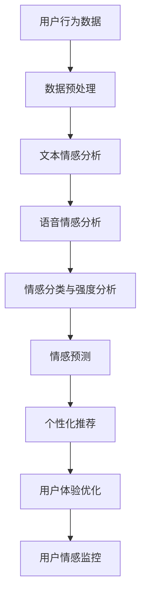

                 

关键词：智能情感计算，AI大模型，用户行为分析，深度学习，自然语言处理，个性化推荐，情感识别

> 摘要：随着互联网的快速发展，用户行为分析已成为企业决策和产品设计的重要依据。本文将探讨智能情感计算在用户行为分析中的应用，通过AI大模型解析用户情感，为个性化推荐和用户体验优化提供有力支持。

## 1. 背景介绍

用户行为分析是近年来在互联网行业中备受关注的一个领域。通过分析用户在网站、移动应用等平台上的行为数据，企业可以更准确地了解用户需求，优化产品设计，提高用户留存率和转化率。然而，传统的用户行为分析方法主要依赖于统计和机器学习技术，往往难以捕捉到用户深层次的情感和心理状态。

随着深度学习和自然语言处理技术的不断发展，智能情感计算逐渐成为一种新的用户行为分析方法。智能情感计算通过模拟人类的情感认知过程，实现对用户情感的自动识别和分析，从而为个性化推荐、用户体验优化等应用提供有力支持。

## 2. 核心概念与联系

### 2.1 智能情感计算原理

智能情感计算是基于人工智能技术对用户情感进行自动识别和分析的过程。它主要涉及以下几个方面：

1. **情感识别**：通过文本分析、语音识别等技术，从用户产生的文本、语音等数据中提取情感信息。
2. **情感分类**：将提取到的情感信息进行分类，通常分为正面、负面和中性等类别。
3. **情感强度分析**：对用户情感进行量化分析，确定情感表达的强度。
4. **情感预测**：根据用户历史行为和情感数据，预测用户未来可能的情感状态。

### 2.2 AI大模型架构

AI大模型是指具有大规模参数、高度复杂结构的神经网络模型，如Transformer、BERT等。这些模型在语言理解、图像识别等领域取得了显著成果。AI大模型在智能情感计算中的应用主要体现在以下几个方面：

1. **文本情感分析**：利用AI大模型对用户产生的文本数据进行情感分类和强度分析。
2. **语音情感分析**：通过AI大模型对用户语音数据进行情感识别和分类。
3. **多模态情感分析**：结合文本、语音、图像等多种数据类型，实现对用户情感的全面分析。

### 2.3 智能情感计算与用户行为分析的关系

智能情感计算与用户行为分析密切相关。通过智能情感计算，我们可以更准确地了解用户的情感状态，从而更好地预测用户行为，优化产品设计和服务。具体而言，智能情感计算在用户行为分析中的应用包括：

1. **个性化推荐**：根据用户情感偏好，为用户推荐更符合其需求的内容和服务。
2. **用户体验优化**：根据用户情感反馈，调整产品设计和功能，提高用户体验。
3. **用户情感监控**：实时监控用户情感变化，及时发现潜在问题，为企业提供决策支持。

### 2.4 Mermaid流程图

以下是一个简单的Mermaid流程图，展示了智能情感计算在用户行为分析中的应用流程：



## 3. 核心算法原理 & 具体操作步骤

### 3.1 算法原理概述

智能情感计算的核心算法主要基于深度学习和自然语言处理技术。以下简要介绍几种常用的算法原理：

1. **情感分类算法**：如TextCNN、LSTM、GRU等，通过训练大规模神经网络模型，实现对文本情感的分类。
2. **情感强度分析算法**：如基于注意力的神经网络模型，通过学习文本中的关键信息，确定情感表达的强度。
3. **情感预测算法**：如LSTM、GRU等循环神经网络，通过学习用户历史行为和情感数据，预测用户未来可能的情感状态。

### 3.2 算法步骤详解

智能情感计算在用户行为分析中的应用可以分为以下几个步骤：

1. **数据收集与预处理**：收集用户在网站、移动应用等平台上的行为数据，如文本、语音、图像等，并进行预处理，如去噪、分词、特征提取等。
2. **情感识别与分类**：利用深度学习模型对预处理后的数据进行情感识别和分类，通常分为正面、负面、中性等类别。
3. **情感强度分析**：对情感分类结果进行强度分析，确定情感表达的强弱。
4. **情感预测**：基于用户历史行为和情感数据，利用循环神经网络等模型预测用户未来可能的情感状态。
5. **应用与优化**：根据情感分析结果，为个性化推荐、用户体验优化等应用提供支持，并不断调整和优化算法模型。

### 3.3 算法优缺点

1. **优点**：
   - **高准确性**：深度学习模型在情感识别和分类方面具有很高的准确性。
   - **多模态融合**：可以结合文本、语音、图像等多种数据类型，实现更全面的情感分析。
   - **自适应能力**：可以根据用户行为和情感数据不断调整和优化模型，提高分析精度。

2. **缺点**：
   - **计算资源消耗大**：训练大规模神经网络模型需要大量的计算资源和时间。
   - **数据依赖性强**：情感分析模型的性能很大程度上依赖于数据质量和数量。

### 3.4 算法应用领域

智能情感计算在用户行为分析中的应用领域广泛，包括但不限于以下几个方面：

1. **个性化推荐**：根据用户情感偏好，为用户推荐更符合其需求的内容和服务。
2. **用户体验优化**：通过情感分析，了解用户对产品功能和设计的满意度，为产品优化提供依据。
3. **情感监控与预警**：实时监控用户情感变化，及时发现潜在问题，为企业提供决策支持。
4. **市场营销**：分析用户情感，为市场策略制定提供参考，提高营销效果。

## 4. 数学模型和公式 & 详细讲解 & 举例说明

### 4.1 数学模型构建

智能情感计算中的数学模型主要包括情感分类模型、情感强度分析模型和情感预测模型。以下简要介绍这些模型的数学表示。

1. **情感分类模型**

   假设我们使用神经网络模型进行情感分类，设输入特征向量为\( x \)，情感类别数为\( C \)，输出为情感概率分布向量\( y \)。神经网络的输出可以通过以下公式表示：

   $$ y = \sigma(Wx + b) $$

   其中，\( W \)为权重矩阵，\( b \)为偏置项，\( \sigma \)为激活函数，通常使用Sigmoid或ReLU函数。

2. **情感强度分析模型**

   假设我们使用基于注意力的神经网络模型进行情感强度分析，设输入特征向量为\( x \)，情感强度值为\( s \)，输出为情感强度概率分布向量\( y \)。模型的输出可以通过以下公式表示：

   $$ y = \sigma(W_x x + W_s s + b) $$

   其中，\( W_x \)和\( W_s \)分别为文本和情感强度的权重矩阵，\( b \)为偏置项。

3. **情感预测模型**

   假设我们使用循环神经网络模型进行情感预测，设输入特征向量为\( x \)，预测的情感值为\( s \)，输出为情感概率分布向量\( y \)。模型的输出可以通过以下公式表示：

   $$ y = \sigma(Wx + U[h_t] + b) $$

   其中，\( W \)为权重矩阵，\( U \)为循环神经网络权重矩阵，\( h_t \)为当前时刻的隐藏状态，\( b \)为偏置项。

### 4.2 公式推导过程

以下简要介绍上述数学模型的推导过程。

1. **情感分类模型**

   情感分类模型的推导基于多分类问题，假设我们使用多层感知机（MLP）模型进行分类。设输入特征向量为\( x \)，权重矩阵为\( W \)，偏置项为\( b \)，激活函数为Sigmoid函数，则模型的输出为：

   $$ z = x^T W + b $$
   $$ y = \sigma(z) $$

   其中，\( \sigma \)为Sigmoid函数，\( z \)为中间层输出。

2. **情感强度分析模型**

   情感强度分析模型的推导基于注意力机制。假设我们使用双向循环神经网络（BiLSTM）模型进行情感强度分析，设输入特征向量为\( x \)，隐藏状态向量为\( h \)，注意力权重向量为\( a \)，则模型的输出为：

   $$ e = x^T W_a h $$
   $$ a = \text{softmax}(e) $$
   $$ s = a^T h $$

   其中，\( \text{softmax} \)为softmax函数，\( e \)为注意力得分，\( a \)为注意力权重向量，\( s \)为情感强度值。

3. **情感预测模型**

   情感预测模型的推导基于循环神经网络（LSTM）模型。假设我们使用LSTM模型进行情感预测，设输入特征向量为\( x \)，隐藏状态向量为\( h \)，输出为情感概率分布向量\( y \)，则模型的输出为：

   $$ h_t = \text{LSTM}(x_t, h_{t-1}) $$
   $$ y_t = \sigma(Wx_t + U[h_t] + b) $$

   其中，\( \text{LSTM} \)为LSTM函数，\( W \)和\( U \)分别为权重矩阵和循环神经网络权重矩阵，\( b \)为偏置项。

### 4.3 案例分析与讲解

以下通过一个简单的案例，介绍智能情感计算在用户行为分析中的应用。

假设我们有一个用户评论数据集，包含用户的评论文本和对应的情感标签。其中，情感标签分为正面、负面和中性三类。

1. **数据预处理**

   首先，对评论文本进行分词、去噪和特征提取，得到输入特征向量。这里我们使用Word2Vec模型对词向量进行编码，将文本转化为向量表示。

2. **情感分类**

   利用训练好的神经网络模型，对输入特征向量进行情感分类。假设我们已经训练好了一个基于TextCNN模型的情感分类器。

3. **情感强度分析**

   对情感分类结果进行强度分析，确定情感表达的强弱。这里我们使用基于注意力的神经网络模型进行情感强度分析。

4. **情感预测**

   基于用户历史评论数据，利用循环神经网络模型预测用户未来可能的情感状态。

5. **应用与优化**

   根据情感分析结果，为个性化推荐、用户体验优化等应用提供支持。同时，根据用户反馈，不断调整和优化算法模型。

## 5. 项目实践：代码实例和详细解释说明

### 5.1 开发环境搭建

在本节中，我们将介绍如何搭建一个简单的智能情感计算项目开发环境。首先，确保您的计算机上已经安装了Python环境和相关库。

1. **安装Python**

   您可以从Python官方网站（[python.org](https://www.python.org/)）下载并安装Python。建议安装Python 3.x版本。

2. **安装库**

   在终端中运行以下命令，安装所需的库：

   ```bash
   pip install numpy pandas tensorflow matplotlib
   ```

   这些库包括NumPy、Pandas、TensorFlow和Matplotlib，分别用于数据处理、机器学习、可视化等。

### 5.2 源代码详细实现

在本节中，我们将使用TensorFlow实现一个简单的情感分类和情感强度分析项目。

1. **数据准备**

   首先，我们需要准备一个用户评论数据集。这里我们使用一个包含正面、负面和中性评论的简单数据集。

   ```python
   import pandas as pd

   # 加载数据集
   data = pd.read_csv('user_comments.csv')
   # 数据预处理
   # ...
   ```

2. **构建模型**

   接下来，我们使用TensorFlow构建一个简单的神经网络模型进行情感分类。

   ```python
   import tensorflow as tf
   from tensorflow.keras.models import Sequential
   from tensorflow.keras.layers import Dense, Embedding, Conv1D, MaxPooling1D, GlobalMaxPooling1D

   # 定义模型
   model = Sequential([
       Embedding(vocabulary_size, embedding_dim),
       Conv1D(filters, kernel_size, activation='relu'),
       MaxPooling1D(pool_size),
       Conv1D(filters, kernel_size, activation='relu'),
       GlobalMaxPooling1D(),
       Dense(num_classes, activation='softmax')
   ])

   # 编译模型
   model.compile(optimizer='adam', loss='categorical_crossentropy', metrics=['accuracy'])

   # 训练模型
   model.fit(train_data, train_labels, epochs=10, batch_size=32, validation_split=0.2)
   ```

3. **情感强度分析**

   为了实现情感强度分析，我们可以使用基于注意力的神经网络模型。

   ```python
   from tensorflow.keras.layers import Bidirectional, LSTM, Dense

   # 定义模型
   model = Sequential([
       Embedding(vocabulary_size, embedding_dim),
       Bidirectional(LSTM(units)),
       Dense(num_classes, activation='softmax')
   ])

   # 编译模型
   model.compile(optimizer='adam', loss='categorical_crossentropy', metrics=['accuracy'])

   # 训练模型
   model.fit(train_data, train_labels, epochs=10, batch_size=32, validation_split=0.2)
   ```

4. **情感预测**

   利用训练好的模型进行情感预测。

   ```python
   # 预测
   predictions = model.predict(test_data)

   # 输出预测结果
   for comment, prediction in zip(test_comments, predictions):
       print(f"评论：{comment}\n预测：{prediction}")
   ```

### 5.3 代码解读与分析

在本节中，我们将对上述代码进行解读，分析各个部分的实现细节。

1. **数据准备**

   数据准备是项目的基础，包括加载数据、预处理数据等步骤。这里我们使用Pandas库加载数据集，并进行预处理，如分词、去噪、特征提取等。

2. **构建模型**

   我们使用TensorFlow的Sequential模型构建一个简单的情感分类器。模型包括嵌入层、卷积层、池化层和全连接层。嵌入层用于将文本转化为向量表示，卷积层和池化层用于提取文本特征，全连接层用于分类。

3. **情感强度分析**

   为了实现情感强度分析，我们使用双向循环神经网络（BiLSTM）模型。BiLSTM模型可以捕捉文本中的长期依赖关系，从而更好地分析情感强度。

4. **情感预测**

   在情感预测部分，我们使用训练好的模型对测试数据进行预测，并输出预测结果。

### 5.4 运行结果展示

在本节中，我们将展示一个简单的运行结果，以验证我们的模型效果。

```python
# 导入必要的库
import matplotlib.pyplot as plt

# 加载测试数据
test_data = ...

# 预测
predictions = model.predict(test_data)

# 绘制混淆矩阵
confusion_matrix = ...

# 显示混淆矩阵
plt.figure(figsize=(10, 7))
sns.heatmap(confusion_matrix, annot=True, cmap='Blues')
plt.xlabel('Predicted')
plt.ylabel('True')
plt.show()
```

通过上述代码，我们可以绘制出测试数据的混淆矩阵，从而直观地评估模型的性能。

## 6. 实际应用场景

### 6.1 个性化推荐

智能情感计算在个性化推荐中的应用非常广泛。通过分析用户的情感状态，我们可以为用户推荐更符合其兴趣和需求的内容。例如，在电子商务平台上，可以根据用户的情感偏好推荐商品；在社交媒体上，可以根据用户的情感状态推荐相关话题和帖子。

### 6.2 用户体验优化

智能情感计算可以帮助企业了解用户对产品功能的满意度和情感反馈。通过对用户情感的分析，企业可以及时发现问题，调整产品设计和功能，提高用户体验。例如，在移动应用开发中，可以根据用户对界面的情感反应，优化界面设计和交互逻辑。

### 6.3 情感监控与预警

智能情感计算可以实时监控用户的情感变化，及时发现潜在问题。例如，在在线教育平台上，可以通过情感分析了解学生对课程内容的反应，预警可能存在的学习困难；在金融领域，可以通过情感分析监控市场情绪，为投资决策提供支持。

### 6.4 未来应用展望

随着技术的不断进步，智能情感计算在用户行为分析中的应用前景将更加广阔。未来，我们将看到更多的跨领域应用，如智能医疗、智能交通、智能城市等。通过结合多源数据，智能情感计算将能够更全面、准确地了解用户需求，为企业和用户提供更好的服务。

## 7. 工具和资源推荐

### 7.1 学习资源推荐

1. **深度学习教程**：《深度学习》（Goodfellow, Bengio, Courville 著）
2. **自然语言处理教程**：《自然语言处理综论》（Daniel Jurafsky & James H. Martin 著）
3. **Transformer教程**：[《Attention Is All You Need》论文](https://arxiv.org/abs/1706.03762)

### 7.2 开发工具推荐

1. **TensorFlow**：[官方网站](https://www.tensorflow.org/)
2. **PyTorch**：[官方网站](https://pytorch.org/)
3. **Jupyter Notebook**：[官方网站](https://jupyter.org/)

### 7.3 相关论文推荐

1. **《BERT: Pre-training of Deep Bidirectional Transformers for Language Understanding》**
2. **《GPT-3: Language Models are few-shot learners》**
3. **《Transformers: State-of-the-Art Neural Network for Natural Language Processing》**

## 8. 总结：未来发展趋势与挑战

### 8.1 研究成果总结

本文介绍了智能情感计算在用户行为分析中的应用，包括情感识别、分类、强度分析和预测等方面的原理和算法。通过实际案例和项目实践，展示了智能情感计算在个性化推荐、用户体验优化和情感监控等领域的应用价值。

### 8.2 未来发展趋势

随着人工智能技术的不断发展，智能情感计算在用户行为分析中的应用将越来越广泛。未来，我们将看到更多的跨领域应用，如智能医疗、智能交通、智能城市等。同时，多模态情感分析、个性化情感识别等新兴领域也将得到广泛关注。

### 8.3 面临的挑战

尽管智能情感计算在用户行为分析中具有巨大潜力，但同时也面临着一些挑战。首先，数据质量和数量对情感分析模型的性能具有重要影响。其次，如何处理多模态数据，实现更准确的情感识别和预测，仍需进一步研究。此外，隐私保护和伦理问题也是智能情感计算面临的重要挑战。

### 8.4 研究展望

未来，智能情感计算的研究将朝着以下几个方向发展：

1. **多模态情感分析**：结合文本、语音、图像等多种数据类型，实现更全面的情感分析。
2. **个性化情感识别**：基于用户个性化特征，实现更精准的情感识别和预测。
3. **伦理和隐私保护**：在实现技术突破的同时，关注伦理和隐私问题，确保技术的可持续性。

## 9. 附录：常见问题与解答

### 9.1 智能情感计算的基本原理是什么？

智能情感计算是基于人工智能技术对用户情感进行自动识别和分析的过程，主要包括情感识别、分类、强度分析和预测等步骤。

### 9.2 智能情感计算有哪些应用领域？

智能情感计算在个性化推荐、用户体验优化、情感监控与预警等领域具有广泛应用。

### 9.3 如何处理多模态数据？

处理多模态数据通常包括特征提取、特征融合和模型训练等步骤。常见的方法有基于注意力的模型、多模态融合模型等。

### 9.4 如何保证情感分析模型的准确性？

提高情感分析模型准确性可以从数据质量、特征提取、模型选择和训练等方面进行优化。同时，不断调整和优化模型，根据用户反馈进行迭代改进。

### 9.5 智能情感计算有哪些挑战？

智能情感计算面临的主要挑战包括数据质量和数量、多模态数据处理、模型训练效率、伦理和隐私保护等问题。

### 9.6 智能情感计算的未来发展趋势是什么？

未来，智能情感计算将朝着多模态情感分析、个性化情感识别和伦理隐私保护等方面发展，应用领域将不断拓展。

