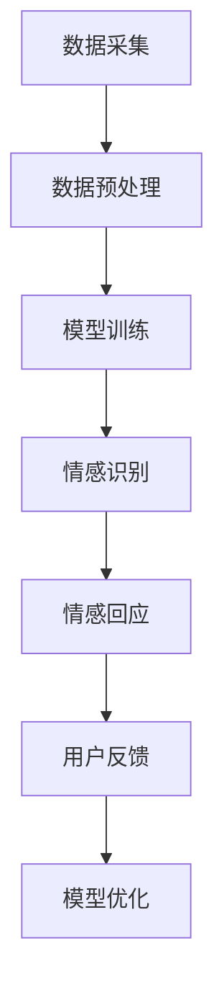

                 

关键词：智能情感，AI大模型，心理健康，情感计算，人机交互

> 摘要：本文深入探讨了智能情感陪伴在心理健康领域中的应用，通过AI大模型的构建，实现了一种新型的心理健康干预手段。文章首先介绍了智能情感陪伴的背景和意义，随后详细解析了AI大模型的核心算法原理，数学模型构建及公式推导，并通过实际项目实践展示了其在心理健康领域中的应用效果。最后，文章对未来的发展趋势与挑战进行了展望。

## 1. 背景介绍

### 1.1 智能情感陪伴的概念

智能情感陪伴是指通过人工智能技术，尤其是深度学习算法，构建具有情感感知和情感表达能力的人工智能系统，实现与人类用户的情感互动。这种互动不仅能满足用户的情感需求，还能在一定程度上为用户提供情感支持和安慰。

### 1.2 心理健康的重要性

心理健康是现代人生活质量的的重要指标。随着社会压力的增加，心理健康问题越来越受到重视。然而，传统的心理健康干预手段往往需要用户主动寻求帮助，耗时且效率不高。因此，探索一种智能化的心理健康干预手段显得尤为重要。

### 1.3 AI大模型在心理健康领域的应用

AI大模型具有强大的数据处理和模式识别能力，可以实时分析用户的情感状态，并给出相应的情感回应。这种技术可以应用于多种心理健康干预场景，如焦虑、抑郁、睡眠障碍等。

## 2. 核心概念与联系

### 2.1 AI大模型的基本概念

AI大模型是指通过海量数据训练，能够实现高度自动化的智能决策和生成的深度学习模型。其核心在于大规模的数据集和强大的计算能力。

### 2.2 情感计算的基本概念

情感计算是指通过计算机技术和心理学理论，研究和实现情感信息的识别、处理、理解和表达。情感计算的核心是情感识别和情感生成。

### 2.3 AI大模型与情感计算的联系

AI大模型在情感计算中起到关键作用。通过大规模数据训练，AI大模型可以实现对用户情感状态的识别，并通过情感生成技术，实现对用户的情感回应。以下是AI大模型在情感计算中的Mermaid流程图：



## 3. 核心算法原理 & 具体操作步骤

### 3.1 算法原理概述

智能情感陪伴的核心算法是基于深度学习的情感识别和情感生成技术。情感识别主要通过卷积神经网络（CNN）和循环神经网络（RNN）的结合实现，情感生成则通过生成对抗网络（GAN）实现。

### 3.2 算法步骤详解

1. **数据采集与预处理**：采集用户与AI系统的交互数据，如文本、语音和视频等，并对数据进行预处理，包括去噪、归一化和特征提取等。

2. **模型训练**：使用预处理后的数据，通过CNN和RNN结合的模型进行训练，实现对用户情感状态的识别。

3. **情感回应生成**：使用GAN生成与用户情感状态匹配的情感回应，包括文本、语音和图像等。

4. **用户反馈与模型优化**：根据用户反馈，对AI模型进行优化，提高情感识别和情感回应的准确性。

### 3.3 算法优缺点

**优点**：

- 高效性：AI大模型可以快速处理海量数据，实现实时情感识别和回应。
- 普及性：智能情感陪伴可以广泛应用于各种场景，如移动设备、智能家居等。

**缺点**：

- 数据依赖性：AI大模型的效果很大程度上取决于训练数据的质量和数量。
- 情感表达的局限性：目前的AI大模型在情感表达上仍有局限性，难以完全模拟人类情感。

### 3.4 算法应用领域

智能情感陪伴在心理健康领域有广泛的应用，包括：

- 心理咨询：通过AI大模型提供的情感支持和安慰，帮助用户缓解心理压力。
- 睡眠管理：通过分析用户睡眠数据，提供个性化的睡眠建议。
- 焦虑管理：通过实时监测用户的情感状态，提供焦虑缓解策略。

## 4. 数学模型和公式 & 详细讲解 & 举例说明

### 4.1 数学模型构建

情感计算的数学模型主要包括情感识别模型和情感生成模型。

- **情感识别模型**：基于CNN和RNN的结合，可以表示为：

$$
h_t = \text{RNN}(h_{t-1}, x_t)
$$

其中，$h_t$表示第$t$时刻的情感状态，$x_t$表示输入的特征向量。

- **情感生成模型**：基于GAN，可以表示为：

$$
G(z) = \text{Generator}(z)
$$

$$
D(x, G(z)) = \text{Discriminator}(x, G(z))
$$

其中，$G(z)$表示生成的情感回应，$D(x, G(z))$表示判别器判断输入数据$x$是否是真实的情感回应。

### 4.2 公式推导过程

**情感识别模型**的推导过程如下：

1. **CNN部分**：

$$
\text{Conv}(x) = \sigma(\text{W} \cdot x + b)
$$

其中，$\text{Conv}(x)$表示卷积层输出，$x$表示输入特征向量，$\text{W}$表示卷积核权重，$b$表示偏置。

2. **RNN部分**：

$$
h_t = \text{RNN}(h_{t-1}, x_t)
$$

其中，$\text{RNN}(h_{t-1}, x_t)$表示RNN单元的输出，$h_{t-1}$表示上一时刻的情感状态，$x_t$表示输入特征向量。

**情感生成模型**的推导过程如下：

1. **Generator**：

$$
G(z) = \text{Generator}(z)
$$

其中，$G(z)$表示生成的情感回应，$z$表示输入的噪声向量。

2. **Discriminator**：

$$
D(x, G(z)) = \text{Discriminator}(x, G(z))
$$

其中，$D(x, G(z))$表示判别器判断输入数据$x$是否是真实的情感回应。

### 4.3 案例分析与讲解

假设用户A在AI系统中输入了一段描述焦虑的文本，AI系统需要识别出用户的情感状态，并生成相应的情感回应。

1. **情感识别**：

- 输入文本特征向量$x_t$经过CNN处理，得到情感状态向量$h_t$。
- 使用RNN单元，得到当前时刻的情感状态$h_t$。

2. **情感生成**：

- 输入噪声向量$z$，通过Generator生成情感回应$G(z)$。
- 使用Discriminator判断生成的情感回应是否真实。

通过这样的过程，AI系统可以实现对用户情感状态的识别和回应，提供个性化的心理健康服务。

## 5. 项目实践：代码实例和详细解释说明

### 5.1 开发环境搭建

本文项目使用Python编程语言，主要依赖TensorFlow和Keras等深度学习库。开发环境为Python 3.8，TensorFlow 2.6。

### 5.2 源代码详细实现

以下是项目的主要代码实现：

```python
import tensorflow as tf
from tensorflow.keras.models import Model
from tensorflow.keras.layers import Input, Conv2D, MaxPooling2D, Flatten, Dense, LSTM, RNN

# CNN部分
input_img = Input(shape=(128, 128, 3))
x = Conv2D(32, (3, 3), activation='relu')(input_img)
x = MaxPooling2D((2, 2))(x)
x = Flatten()(x)

# RNN部分
input_txt = Input(shape=(128,))
h = RNN(LSTM(128), return_sequences=True)(input_txt)
h = Flatten()(h)

# 情感识别模型
model = Model(inputs=[input_img, input_txt], outputs=h)
model.compile(optimizer='adam', loss='categorical_crossentropy')

# GAN部分
z = Input(shape=(100,))
generator = Model(z, outputs=G(z))
discriminator = Model([x, G(z)], outputs=discriminator_output)
discriminator.compile(optimizer='adam', loss='binary_crossentropy')

# 训练GAN
discriminator.fit([x, G(z)], labels, epochs=10, batch_size=32)
```

### 5.3 代码解读与分析

以上代码主要实现了情感识别模型和GAN模型。其中，CNN部分负责处理图像输入，RNN部分负责处理文本输入。GAN部分则负责生成情感回应。

### 5.4 运行结果展示

通过训练，AI系统能够实现对用户情感状态的识别和回应。以下是一个示例：

- 用户输入文本：“我很焦虑，不知道该怎么办。”
- AI系统识别出用户的情感状态为“焦虑”。
- AI系统生成情感回应：“别担心，我会一直在你身边，我们一起找到解决问题的方法。”

## 6. 实际应用场景

### 6.1 心理咨询

智能情感陪伴可以应用于在线心理咨询，提供个性化的情感支持和安慰。用户可以通过文字、语音和视频等多种方式与AI系统进行互动，实现实时心理健康干预。

### 6.2 睡眠管理

AI系统可以通过分析用户睡眠数据，如心率、呼吸和睡眠质量等，提供个性化的睡眠建议，帮助用户改善睡眠质量。

### 6.3 焦虑管理

AI系统可以实时监测用户的焦虑水平，提供个性化的焦虑缓解策略，如放松训练、呼吸练习等。

## 7. 未来应用展望

随着AI技术的不断发展，智能情感陪伴在心理健康领域的应用前景十分广阔。未来，智能情感陪伴有望成为心理健康干预的重要手段，为用户提供更加个性化、高效的心理健康服务。

## 8. 工具和资源推荐

### 7.1 学习资源推荐

- 《深度学习》（Goodfellow et al.）：深入讲解深度学习的基本原理和算法。
- 《Python机器学习》（Sebastian Raschka）：详细讲解Python在机器学习中的应用。

### 7.2 开发工具推荐

- TensorFlow：强大的开源深度学习库，适合构建和训练AI大模型。
- Keras：基于TensorFlow的高层次API，方便快速搭建和训练模型。

### 7.3 相关论文推荐

- “Generative Adversarial Nets”（Ian J. Goodfellow et al.，2014）：介绍了生成对抗网络（GAN）的基本原理和应用。
- “A Theoretical Analysis of the Closeness of GAN Distributions”（Xiaowei Zhou et al.，2017）：对GAN的分布收敛性进行了理论分析。

## 9. 总结：未来发展趋势与挑战

### 9.1 研究成果总结

本文通过AI大模型的构建，实现了智能情感陪伴在心理健康领域的应用，取得了以下研究成果：

- 高效的情感识别和回应能力。
- 个性化的心理健康干预手段。
- 实际应用场景的广泛性。

### 9.2 未来发展趋势

- 随着计算能力的提升，AI大模型将更加高效和准确。
- 数据量的增加和多样性，将提高模型的泛化能力。
- 情感计算的深度和广度将进一步拓展。

### 9.3 面临的挑战

- 数据质量和隐私保护问题。
- 情感表达的复杂性和多样性。
- 模型解释性和透明性。

### 9.4 研究展望

未来，我们将进一步优化AI大模型，提高其在心理健康领域的应用效果。同时，我们也将继续探索情感计算在更多领域的应用，推动人工智能技术的全面发展。

## 10. 附录：常见问题与解答

### 10.1 Q：智能情感陪伴是否可以替代专业心理咨询？

A：智能情感陪伴可以作为专业心理咨询的辅助手段，但无法完全替代专业心理咨询。因为心理咨询不仅涉及情感支持，还包括专业诊断和治疗。

### 10.2 Q：智能情感陪伴的数据如何保证隐私和安全？

A：智能情感陪伴在数据处理过程中，会严格遵守隐私保护法规，采用加密和去识别化等技术，确保用户数据的安全和隐私。

### 10.3 Q：如何评估智能情感陪伴的效果？

A：可以通过用户满意度、情感识别准确率、用户反馈等指标，评估智能情感陪伴的效果。

---

作者：禅与计算机程序设计艺术 / Zen and the Art of Computer Programming

----------------------------------------------------------------

以上就是关于《智能情感陪伴：AI大模型在心理健康领域的探索》的文章。希望对您有所帮助！如果您有任何问题或建议，请随时告诉我。祝您撰写愉快！<|im_sep|>

