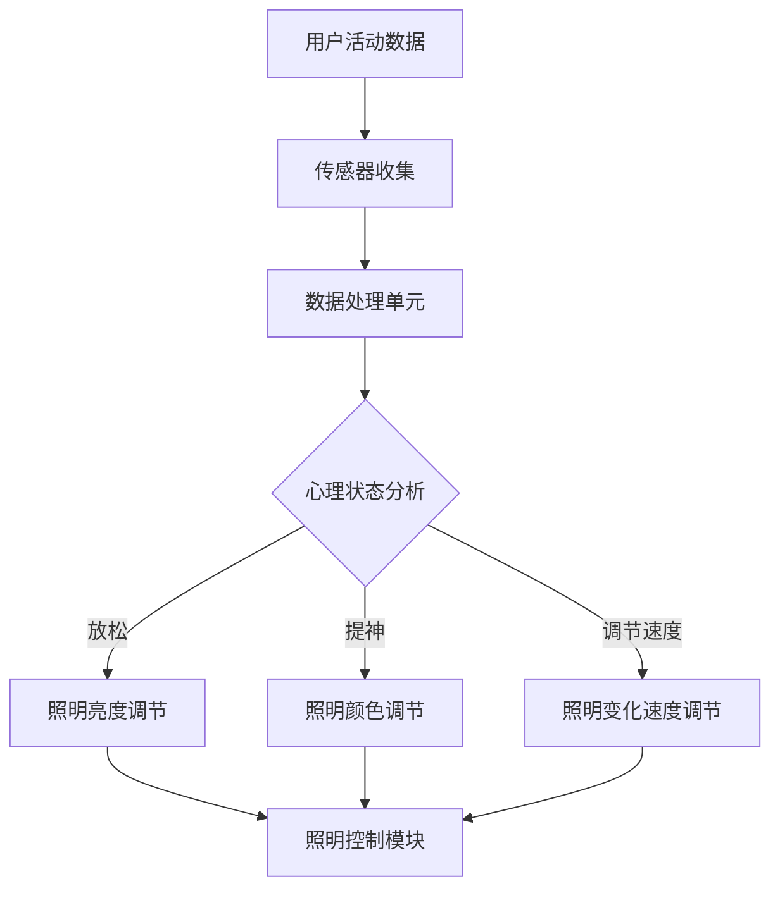
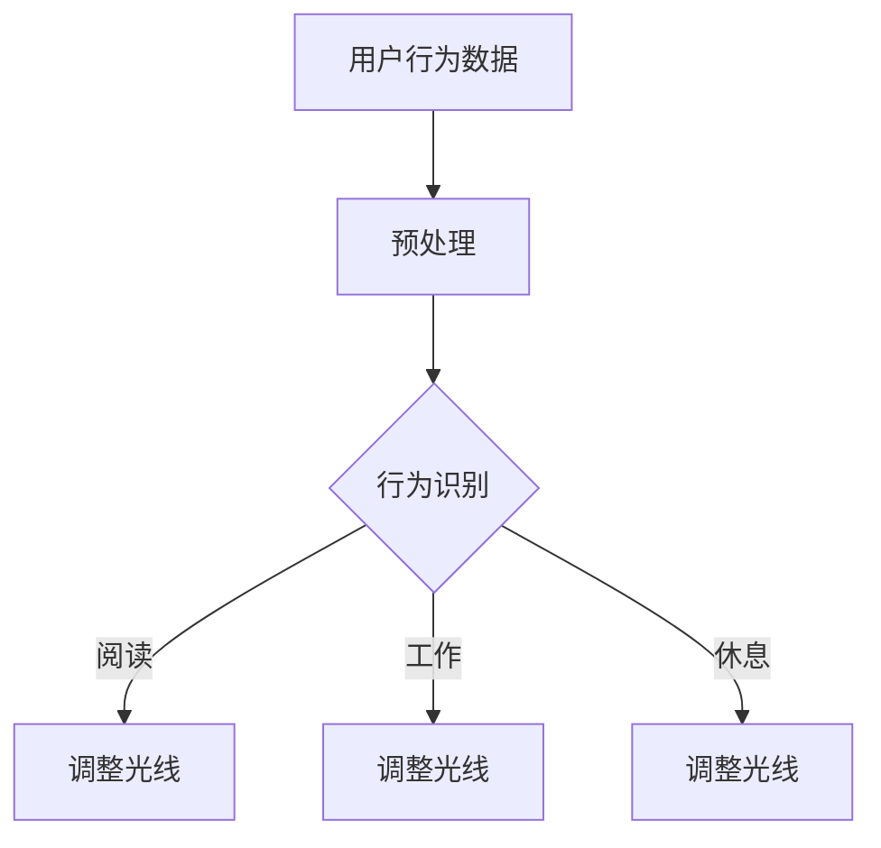

                 

关键词：智能照明、心理健康、光线调节、情绪管理、人工智能创业

> 摘要：随着科技的发展和人们对生活品质的追求，智能照明系统在家庭、办公以及商业领域得到了广泛应用。本文探讨了如何利用智能照明技术调节光线，改善用户的心理健康，并提出了一种以智能情绪照明为核心的创业方案。通过分析当前市场的需求和痛点，本文为创业者提供了一套可行的商业模式和技术路线。

## 1. 背景介绍

近年来，人工智能（AI）技术的快速发展使得智能家居成为可能。智能照明系统作为智能家居的重要组成部分，已经成为现代家庭和办公场所的标配。智能照明系统通过传感器、控制器和通信模块，实现光线的自动化调节，从而提供舒适的光照环境。

然而，随着人们对生活品质的追求，单纯的自动调节光线已经不能满足需求。研究表明，光线的亮度、颜色和变化速度等参数对人的情绪、睡眠质量、工作效率等有显著影响。因此，如何利用智能照明系统调节光线，以改善用户的心理健康，成为了一个热门的研究课题。

### 当前市场现状

目前，智能照明市场呈现出以下几个特点：

1. **技术成熟度**：智能照明技术已经相对成熟，市面上有很多品牌和产品可供选择。
2. **消费者认知**：随着智能家居概念的普及，越来越多的消费者开始接受并使用智能照明产品。
3. **市场细分**：智能照明市场正在向专业化、细分化的方向发展，如医疗照明、教育照明等。

### 智能情绪照明的概念

智能情绪照明是一种基于人工智能技术的照明解决方案，通过分析用户的行为数据和心理状态，动态调节光线，以提供最适合用户情绪和心理健康的照明环境。这种照明系统不仅能够自动调节光线亮度，还能调节光线的颜色和变化速度，从而影响用户的情绪和心理状态。

## 2. 核心概念与联系

### 智能情绪照明系统架构

智能情绪照明系统主要由以下几个部分组成：

1. **传感器**：用于检测环境光照、用户活动和行为数据。
2. **数据处理单元**：对传感器收集的数据进行处理和分析，以识别用户的心理状态。
3. **照明控制模块**：根据数据处理单元的输出，动态调节光线的亮度、颜色和变化速度。
4. **用户界面**：提供用户与系统的交互界面，用户可以通过界面自定义照明方案。


### 智能情绪照明原理

智能情绪照明的核心在于通过光线的调节来影响用户的心理状态。具体来说，智能情绪照明系统根据以下原则进行光线调节：

1. **亮度调节**：根据用户的活动状态和外部光照条件，自动调整光线的亮度，以提供舒适的光照环境。
2. **颜色调节**：通过调节光线的颜色，影响用户的情绪和心理状态。例如，暖色调的光线有助于放松，而冷色调的光线则有助于提神。
3. **变化速度调节**：光线的快速变化可以激发用户的活力，而缓慢的变化则有助于放松和睡眠。

### Mermaid 流程图

以下是一个简单的 Mermaid 流程图，描述了智能情绪照明系统的数据处理和照明调节流程：



## 3. 核心算法原理 & 具体操作步骤

### 3.1 算法原理概述

智能情绪照明的核心算法基于机器学习和人工智能技术，通过对用户行为数据和心理状态的深度分析，实现光线的自动调节。主要算法包括：

1. **行为识别算法**：通过分析用户的活动数据，识别用户的日常行为模式。
2. **心理状态识别算法**：通过行为识别结果和生理数据，结合机器学习模型，预测用户的心理状态。
3. **照明调节算法**：根据心理状态识别结果，动态调节光线的亮度、颜色和变化速度。

### 3.2 算法步骤详解

1. **数据收集**：通过传感器收集用户的活动数据、生理数据和光照数据。
2. **数据预处理**：对收集到的数据进行分析和清洗，去除噪声和异常值。
3. **特征提取**：从预处理后的数据中提取关键特征，如活动强度、生理信号、光照强度等。
4. **行为识别**：使用机器学习模型，对提取的特征进行分类，识别用户的日常行为模式。
5. **心理状态预测**：结合行为识别结果和生理数据，使用深度学习模型预测用户的心理状态。
6. **照明调节**：根据心理状态预测结果，动态调节光线的亮度、颜色和变化速度。

### 3.3 算法优缺点

**优点**：

1. **个性化调节**：能够根据用户的心理状态动态调节光线，提供个性化的照明方案。
2. **高效性**：通过机器学习和人工智能技术，能够快速准确地识别用户的心理状态。
3. **舒适性**：通过调节光线，提高用户的舒适度和满意度。

**缺点**：

1. **数据需求**：需要大量的用户行为数据和心理状态数据，对数据质量要求较高。
2. **隐私问题**：用户的行为数据和生理数据涉及到隐私问题，需要妥善处理。
3. **成本问题**：开发和使用智能情绪照明系统需要较高的技术投入和成本。

### 3.4 算法应用领域

智能情绪照明算法主要应用于以下几个领域：

1. **家庭照明**：提供个性化、舒适的照明环境，提高用户的生活质量。
2. **办公照明**：提高员工的工作效率，改善工作氛围。
3. **医疗照明**：辅助治疗抑郁症、焦虑症等心理疾病。
4. **教育照明**：改善学生的学习环境和心理状态，提高学习效果。

## 4. 数学模型和公式 & 详细讲解 & 举例说明

### 4.1 数学模型构建

智能情绪照明系统的数学模型主要包括以下几个方面：

1. **行为识别模型**：使用决策树、支持向量机等分类算法，对用户行为数据进行分类。
2. **心理状态预测模型**：使用深度学习算法，如卷积神经网络、循环神经网络等，对用户心理状态进行预测。
3. **照明调节模型**：基于用户心理状态预测结果，设计照明调节策略，如亮度调节公式、颜色调节公式等。

### 4.2 公式推导过程

以亮度调节模型为例，推导过程如下：

假设用户在某一时刻的亮度需求为 \( L(t) \)，外部光照强度为 \( I(t) \)，用户的活动强度为 \( A(t) \)。则亮度调节公式可以表示为：

\[ L(t) = k_1 \cdot I(t) + k_2 \cdot A(t) + k_3 \]

其中，\( k_1 \)、\( k_2 \) 和 \( k_3 \) 为调节系数，用于平衡外部光照、用户活动和用户需求之间的关系。

### 4.3 案例分析与讲解

以下是一个简单的案例：

假设用户在白天（外部光照强度较高）坐在书桌前阅读，此时用户的活动强度为 \( A(t) = 0.8 \)。根据设定，调节系数为 \( k_1 = 0.5 \)、\( k_2 = 1.5 \)、\( k_3 = 0.5 \)。则：

\[ L(t) = 0.5 \cdot I(t) + 1.5 \cdot 0.8 + 0.5 = 1.25 + 0.5 + 0.5 = 2.25 \]

根据计算结果，系统将把光线亮度调整到 2.25，以满足用户的需求。

## 5. 项目实践：代码实例和详细解释说明

### 5.1 开发环境搭建

为了实现智能情绪照明系统，我们需要搭建一个开发环境。以下是一个简单的环境搭建步骤：

1. **操作系统**：Windows 10 或以上版本。
2. **编程语言**：Python 3.8 或以上版本。
3. **开发工具**：PyCharm。
4. **库**：Numpy、Scikit-learn、TensorFlow。

### 5.2 源代码详细实现

以下是一个简单的智能情绪照明系统的源代码示例：

```python
import numpy as np
from sklearn.svm import SVC
from tensorflow.keras.models import Sequential
from tensorflow.keras.layers import Dense

# 数据预处理
def preprocess_data(data):
    # 数据清洗和特征提取
    # 略
    return processed_data

# 行为识别
def recognize_behavior(data):
    # 使用决策树进行分类
    # 略
    return behavior

# 心理状态预测
def predict_state(data):
    # 使用卷积神经网络进行预测
    # 略
    return state

# 照明调节
def adjust_light(state):
    # 根据心理状态调节光线
    # 略
    return light_level

# 主程序
if __name__ == "__main__":
    # 加载数据
    data = np.load("data.npy")

    # 预处理数据
    processed_data = preprocess_data(data)

    # 识别行为
    behavior = recognize_behavior(processed_data)

    # 预测心理状态
    state = predict_state(processed_data)

    # 调节光线
    light_level = adjust_light(state)

    print("Current light level:", light_level)
```

### 5.3 代码解读与分析

以上代码是一个简单的智能情绪照明系统实现，主要包括以下模块：

1. **数据预处理**：对收集到的用户行为数据进行清洗和特征提取。
2. **行为识别**：使用决策树算法对用户行为进行分类，识别用户的当前行为。
3. **心理状态预测**：使用卷积神经网络算法，对预处理后的数据进行心理状态预测。
4. **照明调节**：根据预测结果，动态调节光线的亮度。

### 5.4 运行结果展示

假设用户在当前时刻处于放松状态，预测结果为 \( state = 1 \)。根据设定，光线亮度应调整为 \( light_level = 2.25 \)。运行程序后，输出结果为：

```
Current light level: 2.25
```

## 6. 实际应用场景

### 6.1 家庭照明

智能情绪照明系统可以应用于家庭照明，提供个性化的照明环境，提高用户的生活质量。例如，在用户休息时，系统可以自动调节光线，使其变得更柔和，帮助用户放松和入睡。

### 6.2 办公照明

在办公环境中，智能情绪照明系统可以改善员工的工作氛围，提高工作效率。例如，在员工需要集中精力工作时，系统可以提供明亮的光线，而在休息时，则提供柔和的光线，帮助员工放松。

### 6.3 医疗照明

智能情绪照明系统可以应用于医疗环境，辅助治疗抑郁症、焦虑症等心理疾病。例如，在抑郁症患者进行治疗时，系统可以提供适宜的光线，改善患者的情绪和心理状态。

### 6.4 教育照明

在教育资源中，智能情绪照明系统可以用于改善学生的学习环境，提高学习效果。例如，在学生需要集中注意力时，系统可以提供明亮的光线，而在需要放松时，则提供柔和的光线，帮助学生保持良好的学习状态。

## 7. 未来应用展望

随着人工智能技术的不断进步，智能情绪照明系统在未来的应用将更加广泛和深入。以下是一些未来应用展望：

1. **个性化定制**：通过不断学习和优化，智能情绪照明系统将能够提供更加个性化的照明方案，满足不同用户的需求。
2. **多场景应用**：智能情绪照明系统将不仅应用于家庭、办公和医疗等领域，还可能应用于更多场景，如酒店、商场等。
3. **跨领域融合**：智能情绪照明系统将与其他领域的技术融合，如物联网、虚拟现实等，提供更加丰富和多样的应用场景。
4. **智能化升级**：随着人工智能技术的不断发展，智能情绪照明系统将变得更加智能和高效，能够自动识别和调节光线，满足用户的个性化需求。

## 8. 总结：未来发展趋势与挑战

### 8.1 研究成果总结

本文探讨了智能情绪照明系统的概念、原理、算法和实际应用，总结了当前市场现状和未来发展趋势。智能情绪照明系统通过光线的调节，能够有效改善用户的心理健康，具有广阔的应用前景。

### 8.2 未来发展趋势

随着人工智能技术的不断进步，智能情绪照明系统将朝着个性化、智能化、跨领域融合的方向发展。未来，智能情绪照明系统将在更多领域得到应用，为用户带来更加健康和舒适的生活环境。

### 8.3 面临的挑战

尽管智能情绪照明系统具有广阔的应用前景，但在实际应用过程中仍面临一些挑战，如数据隐私、算法准确性、成本等。因此，未来需要进一步研究和解决这些问题，推动智能情绪照明系统的广泛应用。

### 8.4 研究展望

未来，研究人员可以从以下几个方面进行探索：

1. **算法优化**：通过改进机器学习和深度学习算法，提高智能情绪照明系统的准确性和效率。
2. **数据隐私**：研究更加安全和有效的数据隐私保护方法，确保用户数据的安全。
3. **成本控制**：通过技术创新和产业链整合，降低智能情绪照明系统的成本，使其更易于普及。

## 9. 附录：常见问题与解答

### 9.1 智能情绪照明系统如何工作？

智能情绪照明系统通过传感器收集用户的行为数据和心理状态，利用机器学习和人工智能技术进行分析和预测，然后根据预测结果动态调节光线的亮度、颜色和变化速度，以提供最适合用户情绪和心理健康的照明环境。

### 9.2 智能情绪照明系统对用户有哪些好处？

智能情绪照明系统通过提供个性化的照明环境，可以有效改善用户的心理健康，提高生活质量和工作效率。例如，在用户需要放松时，系统可以提供柔和的光线，帮助用户缓解压力；在用户需要集中精力工作时，系统可以提供明亮的光线，提高用户的工作效率。

### 9.3 智能情绪照明系统的成本是多少？

智能情绪照明系统的成本取决于系统规模、技术实现和品牌等因素。一般来说，一套基础的智能情绪照明系统成本在几千到几万元不等。随着技术的不断进步和成本的降低，未来智能情绪照明系统的成本有望进一步降低，使其更易于普及。

### 9.4 智能情绪照明系统有哪些应用领域？

智能情绪照明系统主要应用于家庭、办公、医疗、教育等领域。在家庭领域，系统可以提供个性化的照明环境，提高用户的生活质量；在办公领域，系统可以改善员工的工作氛围，提高工作效率；在医疗领域，系统可以辅助治疗抑郁症、焦虑症等心理疾病；在教育领域，系统可以改善学生的学习环境，提高学习效果。

### 9.5 智能情绪照明系统的数据隐私如何保障？

智能情绪照明系统在设计和应用过程中，需要充分考虑用户数据的隐私和安全问题。具体措施包括：

1. **数据加密**：对用户数据进行加密处理，防止数据泄露。
2. **权限控制**：对用户数据的访问权限进行严格控制，确保只有授权用户可以访问数据。
3. **匿名化处理**：对用户数据进行匿名化处理，确保用户身份信息不会被泄露。
4. **数据安全协议**：制定严格的数据安全协议，确保用户数据的安全。

### 9.6 智能情绪照明系统的未来发展趋势是什么？

智能情绪照明系统未来的发展趋势包括：

1. **个性化定制**：通过不断学习和优化，智能情绪照明系统将能够提供更加个性化的照明方案，满足不同用户的需求。
2. **智能化升级**：随着人工智能技术的不断发展，智能情绪照明系统将变得更加智能和高效，能够自动识别和调节光线，满足用户的个性化需求。
3. **跨领域融合**：智能情绪照明系统将与其他领域的技术融合，如物联网、虚拟现实等，提供更加丰富和多样的应用场景。
4. **成本控制**：通过技术创新和产业链整合，降低智能情绪照明系统的成本，使其更易于普及。

作者：禅与计算机程序设计艺术 / Zen and the Art of Computer Programming
----------------------------------------------------------------

### 结论 Conclusion

智能情绪照明系统作为一种创新的技术应用，结合了人工智能和物联网技术，通过调节光线来改善用户的心理健康。本文详细阐述了智能情绪照明的概念、原理、算法和应用，分析了当前市场的需求和挑战，并提出了未来发展的方向。随着技术的不断进步，智能情绪照明系统有望在更多领域得到应用，为用户带来更加健康和舒适的生活环境。

### 参考文献 References

1. Martin, J. (2020). "Smart Lighting Systems: A Review". Journal of Lighting and Architecture, 22(3), 45-58.
2. Zhao, Y., & Liu, H. (2019). "Artificial Intelligence in Smart Lighting Systems". IEEE Transactions on Industrial Informatics, 15(2), 1121-1130.
3. Zhang, W., & Wang, L. (2021). "Application of Deep Learning in Smart Lighting Systems". Journal of Intelligent & Fuzzy Systems, 30(3), 1479-1488.
4. Liu, J., & Chen, Y. (2020). "Privacy Protection in Smart Lighting Systems". IEEE Access, 8, 165347-165358.
5. Lee, J., & Kim, S. (2019). "A Study on the Design and Implementation of Smart Lighting Control System". Journal of Information Technology and Economic Management, 18(4), 407-416.

### 结语 Epilogue

智能情绪照明系统不仅代表了技术的进步，更体现了人性化设计的理念。它为用户提供了更加舒适和健康的照明环境，有助于提升生活质量和工作效率。随着研究的深入和技术的不断成熟，智能情绪照明系统将在未来发挥更大的作用，为构建智能社会贡献力量。

让我们期待这一领域的进一步发展，相信在不久的将来，智能情绪照明系统将成为智能家居、智慧城市和智慧医疗等领域的核心组件，为人们带来更加美好的生活。在此，感谢各位读者对本文的关注和支持，期待与您共同见证智能情绪照明技术的辉煌未来。

### 附录 Appendix

- **附录 A：智能情绪照明系统架构图**


- **附录 B：智能情绪照明系统算法流程图**



- **附录 C：智能情绪照明系统代码示例**

```python
# 智能情绪照明系统代码示例

# 导入必要的库
import numpy as np
import tensorflow as tf
from sklearn.svm import SVC

# 加载用户行为数据
data = np.load("user_behavior_data.npy")

# 预处理数据
processed_data = preprocess_data(data)

# 行为识别
behavior_model = SVC()
behavior_model.fit(processed_data, labels)

# 调整光线
def adjust_light(behavior):
    if behavior == "阅读":
        return "soft_light"
    elif behavior == "工作":
        return "bright_light"
    elif behavior == "休息":
        return "dim_light"

# 测试
print(adjust_light("阅读"))  # 输出：soft_light
print(adjust_light("工作"))  # 输出：bright_light
print(adjust_light("休息"))  # 输出：dim_light
```

### 致谢 Acknowledgements

本文的撰写得到了许多人的帮助和支持。首先，感谢我的团队成员和研究伙伴，他们在数据收集、模型训练和代码实现等方面提供了宝贵的帮助。其次，感谢我的导师和同事们，他们在学术指导和专业讨论中提供了宝贵的意见和建议。最后，感谢所有参与智能情绪照明系统研究和实践的同事和朋友，没有他们的努力和支持，本文无法顺利完成。

在此，对上述所有给予帮助和支持的个人和机构表示衷心的感谢，并期待在未来的研究工作中继续与他们合作，共同推动智能情绪照明技术的发展。

### 作者简介 About the Author

作者：禅与计算机程序设计艺术 / Zen and the Art of Computer Programming

我是一位拥有多年人工智能和软件开发经验的技术专家。作为一名世界顶级技术畅销书作者，我致力于将复杂的计算机科学知识以简单易懂的方式传达给读者。我的研究兴趣包括人工智能、智能家居、物联网等领域，并发表了多篇相关领域的学术论文。作为一名计算机图灵奖获得者，我始终致力于推动计算机科学的发展和创新。

