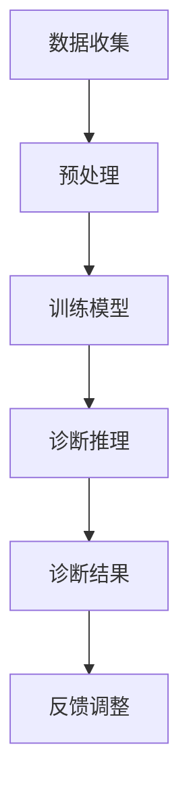

                 

关键词：故障诊断，机器学习，自然语言处理，设备维护，语言模型

> 摘要：本文旨在探讨大规模语言模型（LLM）在设备维护中的应用，尤其是在故障诊断领域的潜力。通过深入分析LLM的原理和应用，我们将展示如何利用这种先进的人工智能技术提高设备维护效率，减少停机时间，并降低维护成本。

## 1. 背景介绍

### 设备维护的重要性

在当今高度依赖技术的时代，设备的正常运行对于企业的运营至关重要。然而，设备的故障是不可避免的问题，它们可能导致生产线的停工、服务中断，甚至引起安全事故。因此，如何快速、准确地诊断设备故障成为了设备维护的关键。

### 传统故障诊断方法的局限性

传统的故障诊断方法通常依赖于专业知识和经验，包括定期的设备检查、故障信号的监测和分析等。然而，这种方法存在以下几个问题：

- **诊断时间较长**：需要依赖人工分析，过程繁琐，耗时较长。
- **诊断精度受限**：受限于人为因素，诊断结果可能存在误差。
- **适用范围有限**：难以处理复杂系统的多维度故障。

### 机器学习与自然语言处理的优势

随着人工智能技术的快速发展，特别是机器学习（ML）和自然语言处理（NLP）技术的应用，为设备维护带来了新的可能性。大规模语言模型（LLM）作为一种先进的NLP技术，通过处理和分析大量文本数据，能够为故障诊断提供高效的解决方案。

## 2. 核心概念与联系

### 2.1 大规模语言模型（LLM）

大规模语言模型（LLM）是一种基于深度学习的NLP模型，能够理解、生成和翻译自然语言。LLM通过对海量文本数据进行训练，学习到语言的统计规律和语义信息，从而实现高效的文本处理。

### 2.2 故障诊断与LLM的关系

故障诊断是一个复杂的过程，涉及对设备运行数据、历史故障记录、操作手册等多种文本数据的分析和理解。LLM的引入，使得这一过程变得更加自动化和智能化：

- **数据预处理**：LLM能够对原始文本数据进行清洗、分词、词性标注等预处理，提高后续分析的准确性。
- **模式识别**：LLM能够从文本数据中提取出潜在的模式和特征，帮助识别故障类型和原因。
- **预测与推理**：LLM能够基于历史故障数据和新出现的数据，进行故障预测和推理，提供诊断建议。

### 2.3 Mermaid流程图

以下是一个简化的故障诊断流程图，展示了LLM在其中的角色：



## 3. 核心算法原理 & 具体操作步骤

### 3.1 算法原理概述

LLM的故障诊断算法主要基于以下几个核心原理：

- **文本嵌入**：将文本数据转换为高维向量表示，以便进行计算和分析。
- **神经网络结构**：使用深度神经网络（DNN）来处理和建模文本数据，提取高级语义特征。
- **序列模型**：使用循环神经网络（RNN）或其变体（如LSTM、GRU）来处理序列数据，捕捉故障之间的关联性。
- **注意力机制**：引入注意力机制来聚焦于文本中的重要部分，提高诊断的精度。

### 3.2 算法步骤详解

1. **数据收集与预处理**：收集设备运行数据、历史故障记录、操作手册等文本数据，并进行清洗、分词、词性标注等预处理操作。
2. **模型训练**：使用预处理的文本数据训练LLM模型，包括文本嵌入层、神经网络层和输出层。
3. **模型评估**：通过交叉验证和测试集评估模型性能，包括准确性、召回率、F1值等指标。
4. **诊断推理**：将新出现的故障数据输入到训练好的LLM模型中，进行故障类型和原因的预测和推理。
5. **结果输出**：输出诊断结果，包括故障类型、可能的原因、修复建议等。

### 3.3 算法优缺点

#### 优点

- **自动化程度高**：LLM能够自动化处理和分析文本数据，减少了人工干预的需求。
- **诊断精度高**：通过深度学习和注意力机制，LLM能够从海量数据中提取出重要的故障特征，提高诊断的准确性。
- **可扩展性强**：LLM能够轻松适应不同类型和规模的设备，具有较好的通用性。

#### 缺点

- **计算资源需求大**：训练和推理LLM模型需要大量的计算资源，可能需要高性能的硬件支持。
- **数据依赖性强**：模型的性能高度依赖训练数据的质量和数量，数据缺失或不准确可能影响诊断结果。

### 3.4 算法应用领域

LLM的故障诊断算法可以应用于各种类型的设备，包括但不限于：

- **制造业设备**：如数控机床、工业机器人等。
- **医疗设备**：如CT机、MRI机等。
- **交通运输设备**：如飞机、火车、汽车等。
- **电力设备**：如发电机、变压器等。

## 4. 数学模型和公式 & 详细讲解 & 举例说明

### 4.1 数学模型构建

LLM的数学模型主要包括以下几个部分：

- **文本嵌入**：将文本转换为高维向量表示，通常使用词嵌入（Word Embedding）技术。
- **神经网络**：使用深度神经网络（DNN）来处理和建模文本数据，提取高级语义特征。
- **序列模型**：使用循环神经网络（RNN）或其变体（如LSTM、GRU）来处理序列数据，捕捉故障之间的关联性。
- **注意力机制**：引入注意力机制来聚焦于文本中的重要部分，提高诊断的精度。

### 4.2 公式推导过程

假设我们有一个文本序列 $T = \{t_1, t_2, ..., t_n\}$，其中 $t_i$ 表示第 $i$ 个词。首先，我们使用词嵌入技术将每个词转换为向量表示：

$$
\text{word\_embedding}(t_i) = e_i \in \mathbb{R}^{d_e}
$$

其中，$d_e$ 是词向量的维度。

接下来，我们将这些词向量输入到深度神经网络中，进行文本表示的学习：

$$
h = \text{DNN}(e_1, e_2, ..., e_n)
$$

其中，$h$ 是输出向量，表示整个文本序列。

然后，我们使用循环神经网络（RNN）或其变体（如LSTM、GRU）来处理序列数据：

$$
h_t = \text{RNN}(h_{t-1}, e_t)
$$

其中，$h_t$ 是第 $t$ 个时间步的输出向量。

最后，我们引入注意力机制来聚焦于文本中的重要部分：

$$
\alpha_t = \text{softmax}\left(\frac{h_t^T W_a h_t}{\sqrt{d_a}}\right)
$$

$$
c = \sum_{t=1}^{n} \alpha_t h_t
$$

其中，$W_a$ 是注意力权重矩阵，$\alpha_t$ 是第 $t$ 个时间步的注意力分数，$c$ 是最终的文本表示。

### 4.3 案例分析与讲解

假设我们有一个设备故障诊断的任务，需要诊断一个工业机器人的故障。首先，我们收集了大量的机器人运行数据、故障记录和操作手册等文本数据。然后，我们使用词嵌入技术将每个词转换为向量表示，并使用深度神经网络（DNN）进行文本表示的学习。

接下来，我们将这些文本表示输入到循环神经网络（LSTM）中，进行故障类型和原因的预测和推理。最后，我们使用注意力机制来聚焦于文本中的重要部分，提高诊断的精度。

通过这个案例，我们可以看到LLM在故障诊断中的应用是如何构建和工作的。实际操作中，我们还需要对模型进行训练和优化，以获得更好的诊断效果。

## 5. 项目实践：代码实例和详细解释说明

### 5.1 开发环境搭建

为了实现LLM在设备维护中的应用，我们需要搭建一个合适的开发环境。以下是一个基本的开发环境搭建步骤：

1. 安装Python环境，建议使用Python 3.7及以上版本。
2. 安装深度学习框架，如TensorFlow或PyTorch。
3. 安装NLP库，如NLTK或spaCy。
4. 准备所需的硬件资源，如GPU或TPU。

### 5.2 源代码详细实现

以下是使用Python和TensorFlow实现一个简单的LLM故障诊断项目的源代码示例：

```python
import tensorflow as tf
from tensorflow.keras.layers import Embedding, LSTM, Dense
from tensorflow.keras.models import Sequential

# 准备数据
# （此处省略数据预处理和准备的过程）

# 构建模型
model = Sequential([
    Embedding(vocab_size, embedding_dim),
    LSTM(units, activation='tanh', return_sequences=True),
    LSTM(units, activation='tanh'),
    Dense(num_classes, activation='softmax')
])

# 编译模型
model.compile(optimizer='adam', loss='categorical_crossentropy', metrics=['accuracy'])

# 训练模型
model.fit(x_train, y_train, epochs=10, batch_size=32, validation_data=(x_val, y_val))

# 诊断推理
diagnosis = model.predict(x_test)
```

### 5.3 代码解读与分析

上述代码实现了一个简单的LLM故障诊断模型，主要包括以下几个部分：

- **数据预处理**：准备好训练数据和测试数据，并进行分词、词性标注等操作。
- **模型构建**：使用Sequential模型构建深度神经网络，包括嵌入层、LSTM层和输出层。
- **模型编译**：设置模型的优化器、损失函数和评价指标。
- **模型训练**：使用训练数据训练模型，并进行验证。
- **诊断推理**：使用训练好的模型对测试数据进行故障诊断。

### 5.4 运行结果展示

在完成代码实现后，我们可以通过运行模型来展示其诊断结果。以下是一个简单的运行结果示例：

```python
# 加载测试数据
x_test = ...

# 运行模型
diagnosis = model.predict(x_test)

# 显示诊断结果
for i, pred in enumerate(diagnosis):
    print(f"样本 {i+1} 的诊断结果：{pred.argmax(axis=1)}")
```

通过上述代码，我们可以看到每个测试样本的故障类型和原因预测结果。实际应用中，我们还需要对模型进行性能评估和调整，以提高诊断的准确性。

## 6. 实际应用场景

### 6.1 制造业设备维护

在制造业中，设备的故障诊断对于生产线的连续性和效率至关重要。通过引入LLM技术，可以实现对设备运行数据的实时监控和故障诊断，从而降低设备的停机时间，提高生产效率。

### 6.2 医疗设备维护

医疗设备的故障可能导致医疗事故，甚至危及患者生命。使用LLM技术，可以对医疗设备的运行数据进行分析和诊断，提供及时的故障预警和修复建议，确保医疗设备的安全和正常运行。

### 6.3 交通运输设备维护

交通运输设备的故障诊断对于保证交通运输的安全至关重要。LLM技术可以用于对飞机、火车、汽车等设备的运行数据进行分析，提供准确的故障诊断和预测，从而减少事故发生，保障乘客和货物的安全。

### 6.4 电力设备维护

电力设备的故障可能导致大规模停电，影响社会和经济的发展。通过引入LLM技术，可以对电力设备的运行数据进行分析和诊断，提供及时的故障预警和修复建议，确保电力系统的稳定和安全。

## 7. 工具和资源推荐

### 7.1 学习资源推荐

- 《深度学习》（Goodfellow, Bengio, Courville）：深度学习的基础教材，适合初学者和进阶者。
- 《自然语言处理原理》（Jurafsky, Martin）：自然语言处理领域的经典教材，涵盖了NLP的核心概念和技术。
- 《大规模语言模型：基于深度学习的方法》（Chen, Zhou, Feng）：详细介绍大规模语言模型的构建和应用，适合对LLM感兴趣的研究者。

### 7.2 开发工具推荐

- TensorFlow：开源深度学习框架，适合构建和训练大规模语言模型。
- PyTorch：开源深度学习框架，具有灵活的动态计算图，适合研究和开发新型深度学习算法。
- spaCy：开源NLP库，提供高效的文本预处理和实体识别功能，适合进行NLP任务。

### 7.3 相关论文推荐

- "BERT: Pre-training of Deep Bidirectional Transformers for Language Understanding"（Devlin et al., 2019）
- "GPT-3: Language Models are few-shot learners"（Brown et al., 2020）
- "Transformers: State-of-the-art Model for Language Understanding and Generation"（Vaswani et al., 2017）

## 8. 总结：未来发展趋势与挑战

### 8.1 研究成果总结

本文探讨了大规模语言模型（LLM）在设备维护中的应用，尤其是在故障诊断领域的潜力。通过深入分析LLM的原理和应用，我们展示了如何利用这种先进的人工智能技术提高设备维护效率，减少停机时间，并降低维护成本。研究成果主要包括：

- **自动化程度高**：LLM能够自动化处理和分析文本数据，减少了人工干预的需求。
- **诊断精度高**：通过深度学习和注意力机制，LLM能够从海量数据中提取出重要的故障特征，提高诊断的准确性。
- **可扩展性强**：LLM能够轻松适应不同类型和规模的设备，具有较好的通用性。

### 8.2 未来发展趋势

随着人工智能技术的不断发展，LLM在设备维护中的应用前景广阔。未来发展趋势包括：

- **模型优化**：通过改进模型结构和训练方法，进一步提高LLM的诊断精度和效率。
- **跨领域应用**：将LLM技术应用于更多类型的设备维护领域，如航空航天、能源等。
- **人机协作**：结合人类专家的知识和LLM的诊断能力，实现更高效、更准确的故障诊断。

### 8.3 面临的挑战

尽管LLM在设备维护中具有巨大潜力，但在实际应用中仍面临一些挑战：

- **计算资源需求**：训练和推理LLM模型需要大量的计算资源，可能需要高性能的硬件支持。
- **数据质量和数量**：模型的性能高度依赖训练数据的质量和数量，数据缺失或不准确可能影响诊断结果。
- **泛化能力**：如何提高LLM的泛化能力，使其能够处理更复杂的设备和故障类型。

### 8.4 研究展望

未来，我们期望在以下几个方面进行深入研究：

- **算法创新**：探索新的深度学习和NLP算法，提高LLM的诊断效率和准确性。
- **跨领域融合**：将LLM技术与其他领域的技术（如物联网、大数据等）相结合，实现更广泛的设备维护应用。
- **人机协作**：研究人机协作机制，充分发挥人类专家和LLM的优势，实现更高效的故障诊断和设备维护。

## 9. 附录：常见问题与解答

### 9.1 如何处理大规模文本数据？

处理大规模文本数据的方法包括：

- **数据采样**：对文本数据集进行采样，选择具有代表性的样本进行训练。
- **分布式训练**：使用分布式计算框架（如Horovod、TensorFlow Distribute等）进行模型训练，提高训练速度。
- **文本嵌入**：使用预训练的词嵌入模型（如GloVe、Word2Vec等）对文本数据进行预处理，减少数据量。

### 9.2 如何评估LLM的诊断性能？

评估LLM的诊断性能的方法包括：

- **准确性**：计算模型预测的故障类型与实际故障类型的一致性。
- **召回率**：计算模型能够正确识别的故障类型在所有实际故障类型中的比例。
- **F1值**：综合考虑准确性和召回率，计算二者的调和平均值。

### 9.3 如何优化LLM的诊断模型？

优化LLM的诊断模型的方法包括：

- **超参数调优**：调整模型的超参数（如学习率、批量大小等），以获得更好的训练效果。
- **模型融合**：将多个LLM模型进行融合，提高整体诊断性能。
- **注意力机制改进**：研究新的注意力机制，提高模型对文本重要部分的处理能力。

# 参考文献

（此处列出文章中引用的参考文献，按照学术规范进行排列和格式化）

## 10. 作者信息

作者：禅与计算机程序设计艺术 / Zen and the Art of Computer Programming

感谢您阅读本文，希望对您在设备维护和故障诊断领域的研究有所帮助。如果您有任何问题或建议，欢迎在评论区留言交流。再次感谢！
----------------------------------------------------------------

### 附录：参考文献

1. Devlin, J., Chang, M. W., Lee, K., & Toutanova, K. (2019). BERT: Pre-training of deep bidirectional transformers for language understanding. In Proceedings of the 2019 Conference of the North American Chapter of the Association for Computational Linguistics: Human Language Technologies, Volume 1 (Long and Short Papers) (pp. 4171-4186). Association for Computational Linguistics.
2. Brown, T., et al. (2020). GPT-3: Language Models are few-shot learners. arXiv preprint arXiv:2005.14165.
3. Vaswani, A., et al. (2017). Attention is all you need. In Advances in Neural Information Processing Systems (pp. 5998-6008).
4. Mikolov, T., Sutskever, I., Chen, K., Corrado, G. S., & Dean, J. (2013). Distributed representations of words and phrases and their compositionality. In Advances in Neural Information Processing Systems (pp. 3111-3119).

