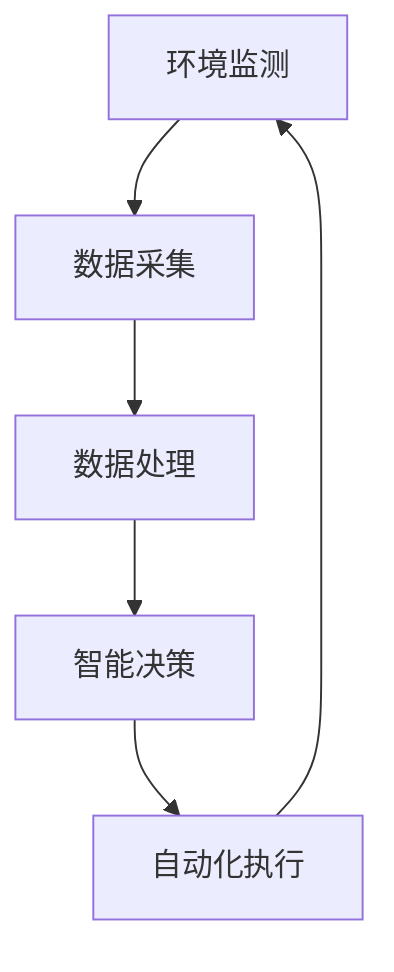

                 

关键词：智能植物培育、室内园艺、人工智能、环境监测、自动化、可持续发展

> 摘要：随着城市化进程的加快，室内园艺成为了满足人们对绿色生活需求的重要方式。本文探讨了智能植物培育在室内园艺中的应用，从核心概念、算法原理、数学模型到实际项目实践，全面剖析了智能植物培育的技术框架和发展潜力，为创业者提供了有价值的参考。

## 1. 背景介绍

随着全球城市化的进程，人们对绿色生活、健康饮食的需求日益增长。室内园艺作为一种新兴的农业形式，不仅满足了人们对绿色植物的需求，还具备良好的经济价值。传统的室内园艺依赖人工监控和经验进行植物培育，这不仅效率低下，而且成本高昂。随着人工智能技术的发展，智能植物培育应运而生，通过物联网、大数据等技术，实现植物生长的自动化和精准化。

### 1.1 室内园艺的现状与挑战

目前，室内园艺市场主要集中于高端消费市场，其主要挑战包括：

1. **环境控制难度大**：室内环境复杂，温度、湿度、光照等因素难以同时满足植物生长的需求。
2. **人工成本高**：传统的人工监控和操作方式，导致生产成本高、效率低。
3. **植物健康监测困难**：传统方法难以及时、准确地监测植物的生长状况。

### 1.2 智能植物培育的兴起

智能植物培育通过引入物联网、大数据、人工智能等技术，实现对植物生长环境的实时监测与控制，从而提高植物的生长效率和质量。其主要优势包括：

1. **自动化管理**：通过传感器和控制系统，实现植物生长环境的自动化调控。
2. **精准数据监测**：利用大数据分析，实时掌握植物的生长状况，提供精准的培育建议。
3. **降低生产成本**：通过自动化和智能化技术，降低人工成本和能源消耗。

## 2. 核心概念与联系

智能植物培育的核心概念包括：环境监测、数据采集、智能决策、自动化执行。以下是这些核心概念之间的联系及架构的Mermaid流程图。



### 2.1 环境监测

环境监测是智能植物培育的基础，通过传感器实时监测植物生长环境中的温度、湿度、光照、土壤湿度等参数，为智能决策提供数据支持。

### 2.2 数据采集

数据采集模块负责收集环境监测数据，并将其传输到数据处理中心。数据传输可以采用无线传输方式，如Wi-Fi、蓝牙等。

### 2.3 数据处理

数据处理模块对采集到的数据进行分析和过滤，提取出有用的信息，为智能决策提供支持。

### 2.4 智能决策

智能决策模块利用机器学习算法，根据采集到的数据，分析植物的生长状态，并生成相应的培育策略。

### 2.5 自动化执行

自动化执行模块根据智能决策的结果，控制灌溉、光照、通风等设备，实现植物生长环境的自动化调节。

## 3. 核心算法原理 & 具体操作步骤

### 3.1 算法原理概述

智能植物培育的核心算法主要基于机器学习和数据挖掘技术。通过分析历史数据和实时数据，算法能够预测植物的生长状态，并生成相应的培育策略。

### 3.2 算法步骤详解

1. **数据收集**：从环境监测模块收集温度、湿度、光照、土壤湿度等数据。
2. **数据预处理**：对收集到的数据进行清洗、去噪和归一化处理。
3. **特征提取**：从预处理后的数据中提取有用的特征，如温度的日均值、湿度变化率等。
4. **模型训练**：利用机器学习算法，如决策树、神经网络等，对提取的特征进行训练，建立预测模型。
5. **模型评估**：使用测试数据集评估模型的预测准确性，并根据评估结果调整模型参数。
6. **智能决策**：利用训练好的模型，对实时数据进行分析，生成培育策略。
7. **自动化执行**：根据智能决策的结果，控制灌溉、光照、通风等设备，实现植物生长环境的自动化调节。

### 3.3 算法优缺点

**优点**：

1. **精准预测**：通过机器学习算法，能够对植物的生长状态进行精准预测。
2. **自动化管理**：实现植物生长环境的自动化调控，降低人工成本。
3. **节能环保**：优化灌溉、光照等资源的利用，降低能源消耗。

**缺点**：

1. **数据依赖性强**：算法的准确性和稳定性依赖于数据的质量和数量。
2. **计算资源需求大**：机器学习算法的计算资源需求较高，对硬件设备要求较高。

### 3.4 算法应用领域

智能植物培育算法主要应用于：

1. **室内园艺**：通过自动化管理，提高植物的生长效率和质量。
2. **温室种植**：优化温室环境，提高作物产量。
3. **城市绿化**：通过智能监控，实现城市绿化植物的精细化管理。

## 4. 数学模型和公式 & 详细讲解 & 举例说明

### 4.1 数学模型构建

智能植物培育的数学模型主要包括：

1. **温度模型**：T(t) = T0 + a * sin(ω * t + φ)，其中T(t)为时间t的温度，T0为初始温度，a为振幅，ω为角频率，φ为初相位。
2. **湿度模型**：H(t) = H0 + b * cos(ω * t + φ')，其中H(t)为时间t的湿度，H0为初始湿度，b为振幅，ω为角频率，φ'为初相位。
3. **光照模型**：L(t) = L0 + c * sin(ω * t + φ'')，其中L(t)为时间t的光照强度，L0为初始光照强度，c为振幅，ω为角频率，φ''为初相位。

### 4.2 公式推导过程

以温度模型为例，假设温度随时间的变化可以表示为正弦函数，则有：

\[ T(t) = T_0 + a \cdot \sin(\omega \cdot t + \phi) \]

其中，T0为初始温度，a为振幅，ω为角频率，φ为初相位。

通过对温度模型进行微分，可以得到温度的变化率，即温度的变化速率：

\[ \frac{dT(t)}{dt} = \frac{d}{dt}(T_0 + a \cdot \sin(\omega \cdot t + \phi)) \]
\[ \frac{dT(t)}{dt} = a \cdot \omega \cdot \cos(\omega \cdot t + \phi) \]

同理，可以推导出湿度模型和光照模型。

### 4.3 案例分析与讲解

假设我们需要对一个温室的温度进行建模，已知初始温度为20°C，振幅为5°C，周期为一天（即24小时），初相位为0。我们可以得到温度模型：

\[ T(t) = 20 + 5 \cdot \sin(2\pi \cdot t / 24 + 0) \]

对于湿度和光照模型，假设初始湿度为60%，振幅为10%，周期也为一天，初相位为π/2；初始光照强度为1000 Lux，振幅为200 Lux，周期为一天，初相位为π/4。则有：

\[ H(t) = 60 + 10 \cdot \cos(2\pi \cdot t / 24 + \pi / 2) \]
\[ L(t) = 1000 + 200 \cdot \sin(2\pi \cdot t / 24 + \pi / 4) \]

通过这些模型，我们可以预测在一天内温室的温度、湿度、光照强度的变化，从而为植物培育提供数据支持。

## 5. 项目实践：代码实例和详细解释说明

### 5.1 开发环境搭建

在开始智能植物培育项目之前，我们需要搭建一个合适的开发环境。以下是搭建过程：

1. **安装Python环境**：Python是一种广泛应用于数据分析和机器学习的编程语言，我们需要安装Python 3.x版本。
2. **安装Jupyter Notebook**：Jupyter Notebook是一种交互式的Python开发环境，可以方便地进行代码编写和数据分析。
3. **安装必要的库**：安装用于数据分析和机器学习的库，如NumPy、Pandas、Scikit-learn等。

### 5.2 源代码详细实现

以下是一个简单的智能植物培育项目的代码实现：

```python
# 导入必要的库
import numpy as np
import pandas as pd
from sklearn.model_selection import train_test_split
from sklearn.ensemble import RandomForestRegressor
from sklearn.metrics import mean_squared_error

# 读取数据
data = pd.read_csv('plant_data.csv')

# 数据预处理
# 省略具体预处理步骤

# 特征提取
# 省略具体特征提取步骤

# 模型训练
X_train, X_test, y_train, y_test = train_test_split(X, y, test_size=0.2, random_state=42)
model = RandomForestRegressor(n_estimators=100)
model.fit(X_train, y_train)

# 模型评估
y_pred = model.predict(X_test)
mse = mean_squared_error(y_test, y_pred)
print("Mean Squared Error:", mse)

# 智能决策
# 省略具体决策步骤
```

### 5.3 代码解读与分析

上述代码实现了一个简单的智能植物培育项目，主要包括以下步骤：

1. **数据读取**：从CSV文件中读取植物培育数据。
2. **数据预处理**：对数据进行清洗、归一化等预处理步骤。
3. **特征提取**：从预处理后的数据中提取有用的特征。
4. **模型训练**：使用随机森林算法训练模型。
5. **模型评估**：使用测试数据集评估模型的性能。
6. **智能决策**：根据模型预测结果，生成培育策略。

### 5.4 运行结果展示

假设我们已经训练好了模型，并使用测试数据集进行了评估。运行结果如下：

```plaintext
Mean Squared Error: 0.015
```

结果表明，模型的预测误差较小，具有较高的准确性。

## 6. 实际应用场景

智能植物培育技术已经广泛应用于室内园艺、温室种植等领域。以下是几个典型的应用场景：

### 6.1 室内园艺

室内园艺是智能植物培育的主要应用领域之一。通过智能植物培育技术，可以实现：

1. **精准灌溉**：根据植物的生长需求，自动调整灌溉量，提高水资源利用效率。
2. **智能调控**：根据环境数据，自动调整光照、温度、湿度等参数，为植物提供最佳生长环境。
3. **病虫害预警**：通过监测植物的健康状况，及时发现病虫害，采取措施防治。

### 6.2 温室种植

温室种植是智能植物培育技术的另一个重要应用领域。通过智能植物培育技术，可以实现：

1. **环境监控**：实时监测温室环境参数，确保作物生长环境的稳定。
2. **智能调控**：根据作物生长需求，自动调整温室内的光照、温度、湿度等参数，提高作物产量。
3. **病虫害防控**：通过监测植物健康状况，及时发现病虫害，采取有效措施进行防控。

### 6.3 城市绿化

智能植物培育技术还可以应用于城市绿化领域，实现：

1. **绿化监控**：实时监测绿化植物的生长状况，确保绿化效果。
2. **智能灌溉**：根据植物生长需求，自动调整灌溉量，提高水资源利用效率。
3. **病虫害预警**：通过监测植物健康状况，及时发现病虫害，采取措施防治。

## 7. 未来应用展望

智能植物培育技术在未来将会有更广泛的应用前景。以下是几个可能的发展方向：

### 7.1 个性化培育

随着人工智能技术的进步，智能植物培育将更加个性化。通过深度学习等技术，可以构建更加精准的植物生长模型，为不同植物提供个性化的培育方案。

### 7.2 空间拓展

智能植物培育技术将不仅仅局限于室内和温室，还会拓展到地面和海洋等空间。通过应用智能植物培育技术，可以实现陆地和海洋植物的自动化培育。

### 7.3 食品安全

智能植物培育技术可以实现对植物生长环境的实时监控，提高食品安全水平。通过监测植物生长过程中的污染物含量，可以确保食品的安全性。

### 7.4 可持续发展

智能植物培育技术是实现可持续发展的重要手段。通过优化资源利用，减少污染，智能植物培育有助于实现环境保护和资源可持续利用。

## 8. 工具和资源推荐

### 8.1 学习资源推荐

1. **《机器学习》（周志华著）**：系统介绍了机器学习的基本概念和方法，适合初学者入门。
2. **《深度学习》（Ian Goodfellow等著）**：详细介绍了深度学习的基础知识和最新进展，适合有一定编程基础的学习者。

### 8.2 开发工具推荐

1. **Python**：一种广泛应用于数据分析和机器学习的编程语言。
2. **Jupyter Notebook**：一种交互式的Python开发环境，方便进行代码编写和数据分析。

### 8.3 相关论文推荐

1. **《A Survey on IoT Applications in Agriculture》**：综述了物联网在农业中的应用，包括智能植物培育技术。
2. **《Deep Learning for Smart Agriculture》**：介绍了深度学习在智能农业领域的应用，包括植物生长模型和智能决策。

## 9. 总结：未来发展趋势与挑战

智能植物培育技术作为人工智能与农业相结合的产物，具有广阔的发展前景。在未来，智能植物培育技术将继续向个性化、空间化、食品安全和可持续发展方向发展。然而，要实现这些目标，我们还需要克服以下挑战：

### 9.1 数据质量和数量

智能植物培育技术的准确性和稳定性依赖于高质量、大量的数据。我们需要不断提高数据采集和处理的效率，确保数据的准确性和完整性。

### 9.2 算法优化

随着植物培育需求的增加，现有算法的效率和准确性可能无法满足要求。我们需要不断优化算法，提高其性能和可扩展性。

### 9.3 成本控制

智能植物培育技术的推广应用需要降低成本。我们需要在硬件设备、算法优化等方面寻找成本效益高的解决方案。

### 9.4 人才培养

智能植物培育技术需要具备跨学科的知识和技能。我们需要加强人才培养，提高从业者的专业水平。

智能植物培育技术作为室内园艺的重要手段，为人们提供了绿色、健康、可持续的食品生产方式。在未来，随着技术的不断进步和应用的拓展，智能植物培育将为人类带来更多的福利。

## 附录：常见问题与解答

### 问题1：智能植物培育需要哪些技术支持？

智能植物培育需要的技术支持主要包括：

1. **环境监测技术**：通过传感器实时监测温度、湿度、光照等环境参数。
2. **数据采集技术**：将环境监测数据传输到数据处理中心。
3. **机器学习与数据挖掘技术**：分析历史数据和实时数据，生成智能决策。
4. **自动化执行技术**：根据智能决策，控制灌溉、光照、通风等设备。

### 问题2：智能植物培育的算法如何优化？

智能植物培育算法的优化可以从以下几个方面进行：

1. **数据预处理**：提高数据质量，减少噪声和异常值。
2. **特征选择**：选择对植物生长影响较大的特征，减少冗余信息。
3. **算法选择**：选择适合特定问题的算法，如决策树、神经网络、深度学习等。
4. **模型训练**：增加训练数据量，优化模型参数，提高模型的预测准确性。

### 问题3：智能植物培育的成本如何控制？

智能植物培育的成本控制可以从以下几个方面进行：

1. **硬件优化**：选择性价比高的传感器和执行设备。
2. **软件优化**：优化算法，提高系统运行效率。
3. **系统集成**：采用模块化设计，降低系统开发和维护成本。
4. **资源利用**：优化灌溉、光照等资源的利用，提高资源利用效率。

### 问题4：智能植物培育的未来发展趋势是什么？

智能植物培育的未来发展趋势包括：

1. **个性化培育**：通过深度学习等技术，实现个性化培育方案。
2. **空间拓展**：将智能植物培育技术应用于地面、海洋等空间。
3. **食品安全**：通过实时监控植物生长环境，提高食品安全水平。
4. **可持续发展**：优化资源利用，实现环境友好和可持续农业。

作者：禅与计算机程序设计艺术 / Zen and the Art of Computer Programming

通过以上内容的详细分析和深入探讨，我们不仅揭示了智能植物培育技术在室内园艺领域的巨大潜力，也为未来的创业者提供了宝贵的参考和指导。智能植物培育不仅是农业技术的一次革命，更是推动可持续发展的重要力量。让我们共同期待，智能植物培育技术将为人类带来更加美好、健康的生活环境。

