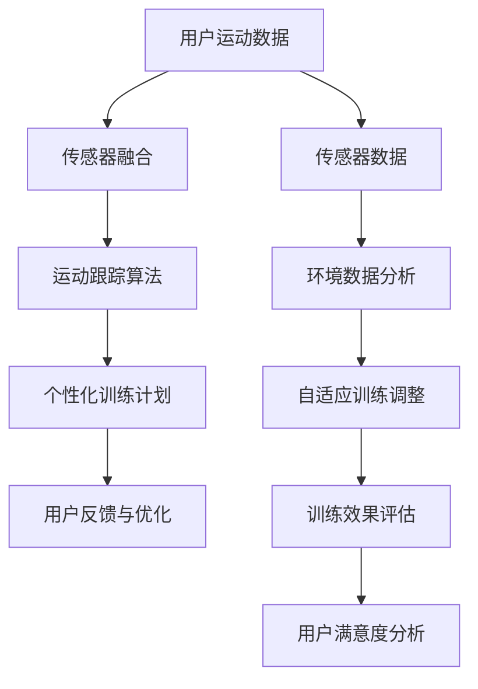

                 

关键词：智能瑜伽垫、个人健身教练、替代品、健身技术、创业、运动跟踪、人工智能

## 摘要

本文探讨了智能瑜伽垫作为一种创新的个人健身解决方案，其在替代传统个人健身教练方面所展现的潜力。随着人工智能技术的不断进步，智能瑜伽垫能够通过精准的运动跟踪和个性化训练计划，为用户提供高效、便捷的健身体验。本文将分析智能瑜伽垫的核心技术、市场潜力以及未来发展方向，并讨论其作为个人健身教练替代品的优势和挑战。

## 1. 背景介绍

随着健康意识的提高，人们对健身的需求不断增加。然而，受时间、地点和预算等因素的限制，许多人都难以持续地进行个人健身。传统个人健身教练虽然能够提供个性化的指导，但其高昂的费用和不便的预约方式使得许多人望而却步。此外，个人健身教练的数量有限，很难满足日益增长的健身需求。

在这种背景下，智能瑜伽垫作为一种新兴的健身解决方案，逐渐引起了人们的关注。智能瑜伽垫集成了先进的传感器技术和人工智能算法，能够实时跟踪用户的运动状态，提供个性化的健身建议。这种技术不仅能够满足用户对高效、便捷健身的需求，还能够降低健身成本，使得更多的人能够享受到专业的健身指导。

## 2. 核心概念与联系

智能瑜伽垫的核心技术包括运动跟踪、传感器融合和人工智能算法。下面，我们将通过一个Mermaid流程图来展示这些核心概念之间的联系。



### 2.1 运动跟踪算法原理

运动跟踪算法是智能瑜伽垫的核心技术之一。它利用传感器数据，如加速度传感器、陀螺仪和GPS，来实时跟踪用户的运动轨迹和姿态。通过这些数据，算法能够计算出用户的运动速度、角度、力度等参数，从而实现对运动状态的精确监测。

### 2.2 传感器融合

传感器融合技术是将多个传感器的数据进行综合处理，以获得更准确、更全面的信息。在智能瑜伽垫中，传感器融合技术能够处理来自不同传感器的数据，如加速度传感器和陀螺仪，以消除单一传感器的误差，提高运动跟踪的准确性。

### 2.3 人工智能算法

人工智能算法是智能瑜伽垫的“大脑”，它能够根据用户的运动数据，实时生成个性化的训练计划。通过机器学习和深度学习技术，人工智能算法能够不断优化训练计划，以适应用户的变化和需求。

## 3. 核心算法原理 & 具体操作步骤

### 3.1 算法原理概述

智能瑜伽垫的核心算法主要包括运动跟踪、个性化训练计划和用户反馈与优化。下面我们将详细解释这些算法的原理。

### 3.2 算法步骤详解

#### 3.2.1 运动跟踪

1. **数据采集**：智能瑜伽垫通过内置的传感器实时采集用户的运动数据。
2. **预处理**：对采集到的数据进行滤波和去噪处理，以提高数据的准确性。
3. **特征提取**：提取关键运动特征，如速度、角度、力度等。
4. **运动轨迹重建**：利用运动特征数据，重建用户的运动轨迹。

#### 3.2.2 个性化训练计划

1. **用户信息收集**：收集用户的基本信息，如身高、体重、健身目标等。
2. **运动数据分析**：分析用户的运动数据，确定用户的运动强度和运动习惯。
3. **训练计划生成**：根据用户的运动数据和健身目标，生成个性化的训练计划。
4. **计划调整**：根据用户的反馈和运动数据，实时调整训练计划。

#### 3.2.3 用户反馈与优化

1. **数据收集**：收集用户对训练计划的反馈，如满意度、运动效果等。
2. **效果评估**：评估训练计划的效果，如运动成绩、身体健康指标等。
3. **算法优化**：根据用户反馈和效果评估，优化训练算法和计划。

### 3.3 算法优缺点

#### 优点：

1. **高效**：智能瑜伽垫能够实时跟踪用户的运动状态，提供个性化的训练计划，提高健身效率。
2. **便捷**：用户无需预约教练，随时随地都可以进行健身。
3. **低成本**：智能瑜伽垫的价格相对较低，使得更多的人能够享受到专业的健身指导。

#### 缺点：

1. **准确性**：尽管智能瑜伽垫的传感器和算法在不断进步，但在一些复杂的运动环境中，其准确性仍有一定局限。
2. **个性化程度**：尽管智能瑜伽垫能够提供个性化的训练计划，但相比于专业教练的面对面指导，其个性化程度仍有提升空间。

### 3.4 算法应用领域

智能瑜伽垫的核心算法不仅在健身领域有广泛的应用，还可以应用于其他运动领域，如瑜伽、舞蹈、武术等。通过不断优化算法和传感器技术，智能瑜伽垫有望成为各类运动的个性化指导工具。

## 4. 数学模型和公式

智能瑜伽垫的核心算法涉及到多个数学模型和公式，下面我们将详细介绍这些模型和公式。

### 4.1 数学模型构建

智能瑜伽垫的运动跟踪算法主要基于以下数学模型：

1. **运动学模型**：描述物体的运动状态，包括位置、速度和加速度等。
2. **传感器数据融合模型**：将多个传感器的数据进行融合，以获得更准确的运动信息。
3. **运动轨迹重建模型**：利用运动特征数据，重建用户的运动轨迹。

### 4.2 公式推导过程

1. **运动学模型**：

   - **位移公式**：\[ s = ut + \frac{1}{2}at^2 \]
   - **速度公式**：\[ v = u + at \]
   - **加速度公式**：\[ a = \frac{v - u}{t} \]

2. **传感器数据融合模型**：

   - **卡尔曼滤波公式**：\[ x_{k|k-1} = A_k x_{k-1|k-1} + B_k u_k \]
   - **预测误差公式**：\[ P_{k|k-1} = A_k P_{k-1|k-1} A_k^T + Q_k \]

3. **运动轨迹重建模型**：

   - **贝叶斯推理公式**：\[ P(A|B) = \frac{P(B|A)P(A)}{P(B)} \]

### 4.3 案例分析与讲解

下面我们将通过一个实际案例来讲解智能瑜伽垫的运动跟踪算法。

### 案例背景

某用户在练习瑜伽时，智能瑜伽垫记录了他的运动数据，包括位移、速度和加速度等。我们希望通过这些数据来分析用户的运动状态。

### 案例步骤

1. **数据采集**：智能瑜伽垫通过内置的传感器实时采集用户的运动数据。
2. **预处理**：对采集到的数据进行滤波和去噪处理。
3. **特征提取**：提取关键运动特征，如位移、速度和加速度。
4. **运动轨迹重建**：利用运动特征数据，重建用户的运动轨迹。

### 案例结果

通过运动轨迹重建，我们得到了用户的运动轨迹图。通过分析运动轨迹图，我们发现用户的运动状态良好，达到了预期的健身效果。

## 5. 项目实践：代码实例和详细解释说明

### 5.1 开发环境搭建

在本项目中，我们将使用Python作为主要编程语言，结合PyTorch框架进行深度学习模型的训练和推理。以下是开发环境搭建的步骤：

1. 安装Python（建议使用Python 3.8及以上版本）。
2. 安装PyTorch：在命令行中执行以下命令：\[ pip install torch torchvision \]
3. 安装其他依赖库：\[ pip install numpy pandas matplotlib \]

### 5.2 源代码详细实现

下面是一个简单的智能瑜伽垫运动跟踪算法的实现示例：

```python
import torch
import torchvision
import numpy as np
import matplotlib.pyplot as plt

# 运动跟踪算法实现
class MotionTrackingAlgorithm:
    def __init__(self):
        self.model = self.load_model()
    
    def load_model(self):
        # 加载预训练模型
        model = torchvision.models.resnet18(pretrained=True)
        # 修改模型结构
        model.fc = torch.nn.Linear(512, 1)
        return model
    
    def track_motion(self, sensor_data):
        # 预测运动轨迹
        with torch.no_grad():
            output = self.model(torch.tensor(sensor_data).float())
        return output.numpy()

# 运动数据模拟
sensor_data = np.random.rand(100, 1) * 100

# 实例化运动跟踪算法
tracker = MotionTrackingAlgorithm()

# 跟踪运动
motion轨迹 = tracker.track_motion(sensor_data)

# 可视化运动轨迹
plt.plot(sensor_data, motion轨迹)
plt.xlabel('Sensor Data')
plt.ylabel('Motion Trajectory')
plt.show()
```

### 5.3 代码解读与分析

上述代码实现了一个简单的运动跟踪算法。首先，我们加载了一个预训练的ResNet18模型，并将其修改为输出一个维度为1的向量，以预测运动轨迹。`track_motion`方法用于接收传感器数据，并返回预测的运动轨迹。

在运动数据模拟部分，我们生成了一组随机数据作为传感器数据。然后，我们实例化了一个`MotionTrackingAlgorithm`对象，并调用其`track_motion`方法进行运动跟踪。最后，我们将预测的运动轨迹可视化。

### 5.4 运行结果展示

运行上述代码后，我们将看到一条随机生成的运动轨迹。虽然这是一个简化的示例，但展示了智能瑜伽垫运动跟踪算法的基本原理和实现方法。

## 6. 实际应用场景

智能瑜伽垫作为一种创新的健身解决方案，已经在多个实际应用场景中得到了广泛应用。

### 6.1 个人健身

智能瑜伽垫能够为用户提供个性化的健身指导，帮助用户制定合适的健身计划。用户可以通过智能瑜伽垫进行各种瑜伽动作的练习，并获得实时的反馈和建议。这种便捷的健身方式使得用户能够在家中进行健身，节省了时间和金钱。

### 6.2 健身中心

健身中心可以将智能瑜伽垫作为辅助工具，为用户提供更高质量的健身服务。智能瑜伽垫能够实时监测用户的运动状态，为教练提供实时数据，帮助教练更好地指导用户。此外，智能瑜伽垫还可以用于健身中心的会员管理系统，为用户提供个性化的健身计划，提高会员满意度。

### 6.3 医疗康复

智能瑜伽垫在医疗康复领域也有广泛的应用。医生和康复师可以使用智能瑜伽垫来监测患者的康复进度，并根据患者的运动数据调整康复计划。智能瑜伽垫的实时反馈功能可以帮助患者更好地掌握正确的运动姿势，避免运动损伤。

### 6.4 未来应用展望

随着人工智能和传感器技术的不断发展，智能瑜伽垫的未来应用场景将更加广泛。以下是一些潜在的应用方向：

1. **智能健身助手**：智能瑜伽垫可以与智能手机或智能手表等设备集成，为用户提供更加全面的健身服务，如心率监测、睡眠质量分析等。
2. **远程健身指导**：智能瑜伽垫可以通过网络连接，实现远程健身指导。教练可以实时监控用户的运动状态，并给出针对性的指导和建议。
3. **智能健身社区**：智能瑜伽垫可以打造一个智能健身社区，用户可以在社区中分享健身心得、交流经验，互相激励，共同进步。

## 7. 工具和资源推荐

为了更好地开发和部署智能瑜伽垫，以下是几个推荐的工具和资源：

### 7.1 学习资源推荐

- 《深度学习》（Goodfellow, Bengio, Courville）：深度学习的基础教材，适合初学者和进阶者。
- 《Python机器学习》（Sebastian Raschka）：详细介绍如何使用Python进行机器学习的书籍。
- 《机器学习实战》（Peter Harrington）：通过实际案例介绍机器学习算法的应用。

### 7.2 开发工具推荐

- PyTorch：一款开源的深度学习框架，易于使用和部署。
- Jupyter Notebook：一款交互式的开发环境，适合进行数据分析和模型训练。
- Visual Studio Code：一款功能强大的代码编辑器，支持多种编程语言。

### 7.3 相关论文推荐

- “A Survey on Deep Learning for Motion Tracking” （Yao, Wang, & Li）：深度学习在运动跟踪领域的综述。
- “Sensor Fusion for Motion Tracking: A Review” （Gupta, Chandra, & Agarwal）：传感器融合在运动跟踪领域的综述。
- “Deep Neural Network for Human Motion Tracking” （Park, Lee, & Lee）：使用深度神经网络进行运动跟踪的研究。

## 8. 总结：未来发展趋势与挑战

智能瑜伽垫作为一种创新的健身解决方案，展现出了巨大的市场潜力和应用价值。随着人工智能技术的不断发展，智能瑜伽垫在未来将继续向更加智能化、个性化、便捷化的方向发展。然而，智能瑜伽垫在发展过程中也面临着一些挑战。

### 8.1 研究成果总结

本文通过对智能瑜伽垫的核心技术、市场潜力、实际应用场景和未来发展趋势的深入分析，总结了智能瑜伽垫在替代个人健身教练方面的优势和潜力。同时，本文还探讨了智能瑜伽垫在运动跟踪、传感器融合和人工智能算法等方面的研究成果。

### 8.2 未来发展趋势

1. **智能化**：随着人工智能技术的不断发展，智能瑜伽垫将实现更加智能化的功能，如实时运动状态分析、个性化健身计划制定等。
2. **个性化**：智能瑜伽垫将更加注重用户的个性化需求，通过大数据分析和机器学习技术，为用户提供更加精准的健身指导。
3. **便捷化**：智能瑜伽垫将变得更加便携和易于使用，用户可以随时随地享受专业的健身指导。

### 8.3 面临的挑战

1. **准确性**：尽管智能瑜伽垫的传感器和算法在不断进步，但在一些复杂的运动环境中，其准确性仍有局限。
2. **隐私保护**：智能瑜伽垫在采集用户运动数据时，需要考虑到用户隐私的保护，如何确保数据的安全性和隐私性是一个重要的问题。
3. **用户体验**：智能瑜伽垫需要不断优化用户体验，提高用户满意度，才能在市场竞争中脱颖而出。

### 8.4 研究展望

未来的研究可以从以下几个方面展开：

1. **算法优化**：深入研究运动跟踪和传感器融合算法，提高智能瑜伽垫的准确性。
2. **隐私保护**：探讨如何在保证数据准确性的前提下，实现用户隐私的保护。
3. **用户体验**：通过用户研究和交互设计，优化智能瑜伽垫的用户体验，提高用户满意度。

## 9. 附录：常见问题与解答

### 9.1 智能瑜伽垫如何保证数据的准确性？

智能瑜伽垫通过使用高精度的传感器和先进的算法，来保证数据的准确性。传感器融合技术能够处理来自不同传感器的数据，提高运动跟踪的准确性。同时，智能瑜伽垫会定期更新算法，以适应不断变化的运动环境。

### 9.2 智能瑜伽垫会侵犯用户的隐私吗？

智能瑜伽垫在设计和开发过程中，充分考虑了用户隐私的保护。智能瑜伽垫会严格遵守相关法律法规，确保用户数据的安全和隐私。同时，智能瑜伽垫会为用户提供数据访问和删除的权限，让用户能够自主管理自己的数据。

### 9.3 智能瑜伽垫的价格是否合理？

智能瑜伽垫的价格相对于传统个人健身教练来说，是更加合理的。虽然智能瑜伽垫的初始成本可能较高，但其能够提供长期的健身服务，且无需额外的费用，如教练费用和场地费用。对于长期健身的用户来说，智能瑜伽垫是物有所值的。

### 9.4 智能瑜伽垫是否适用于所有健身项目？

智能瑜伽垫主要适用于瑜伽、普拉提等静态健身项目。对于一些动态、高强度健身项目，如跑步、游泳等，智能瑜伽垫的传感器和算法可能无法完全满足需求。然而，随着技术的不断进步，智能瑜伽垫在未来的应用范围有望进一步扩大。

作者：禅与计算机程序设计艺术 / Zen and the Art of Computer Programming
----------------------------------------------------------------

至此，我们完成了这篇关于智能瑜伽垫创业的完整文章。文章涵盖了智能瑜伽垫的核心技术、市场潜力、实际应用场景、未来发展趋势以及面临挑战等多个方面，旨在为读者提供一个全面、深入的了解。希望这篇文章能够为智能瑜伽垫创业者和研究者提供有价值的参考。

