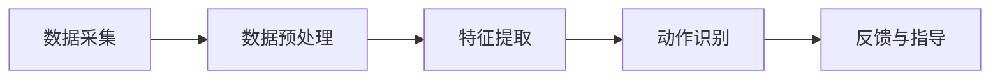

                 

关键词：智能瑜伽垫、健身教练、个人健身、替代品、技术创业、数据驱动、人工智能应用、用户体验优化

> 摘要：随着人工智能技术的快速发展，智能瑜伽垫作为一种新兴的健身产品，正逐渐成为个人健身教练的替代品。本文将从技术、市场、用户体验等多方面探讨智能瑜伽垫的创业机会和发展前景。

## 1. 背景介绍

### 1.1 健身市场的现状

随着健康意识的增强，全球健身市场持续增长。根据市场研究公司的数据，全球健身市场规模在2020年已达到3000亿美元，并预计在未来几年内将继续扩大。在这一市场中，个人健身教练的需求不断增加，但同时也面临一些问题：

- **供应不足**：专业健身教练的数量无法满足日益增长的健身需求，尤其是在人口密集的城市地区。
- **成本问题**：个人健身教练的服务费用较高，许多潜在用户因经济压力而放弃寻求专业指导。
- **时间约束**：现代人生活节奏快，很难抽出时间进行长期的一对一健身指导。

### 1.2 智能瑜伽垫的出现

智能瑜伽垫作为一种新兴的健身设备，旨在解决上述问题。它结合了人工智能技术，能够提供个性化、自动化的健身指导，成为个人健身教练的有力替代品。智能瑜伽垫的主要特点包括：

- **传感器技术**：内置多个传感器，实时监测用户的身体动作、姿势和呼吸等。
- **数据分析**：利用人工智能算法，分析用户的动作数据，提供个性化的健身建议。
- **互动体验**：通过显示屏或智能手机应用程序，为用户提供实时的指导和建议。

## 2. 核心概念与联系

### 2.1 智能瑜伽垫的工作原理

智能瑜伽垫的工作原理可以分为以下几个步骤：

1. **数据采集**：通过内置的传感器，实时采集用户的身体动作、姿势和呼吸数据。
2. **数据预处理**：对采集到的数据进行预处理，包括滤波、归一化和去噪等操作。
3. **特征提取**：从预处理后的数据中提取关键特征，如关节角度、身体位移等。
4. **动作识别**：利用机器学习算法，对提取的特征进行分类，识别用户的动作。
5. **反馈与指导**：根据用户的动作表现，智能瑜伽垫会提供实时的反馈和建议，帮助用户纠正姿势、提高动作质量。

### 2.2 Mermaid 流程图

以下是一个简化的 Mermaid 流程图，展示了智能瑜伽垫的工作流程：



### 2.3 核心概念原理

- **传感器技术**：智能瑜伽垫使用的传感器包括加速度计、陀螺仪、压力传感器等，用于实时监测用户的身体动作。
- **机器学习算法**：用于动作识别的算法，如支持向量机（SVM）、决策树、深度学习等。
- **用户交互界面**：通过显示屏或手机应用程序，为用户提供直观的反馈和指导。

## 3. 核心算法原理 & 具体操作步骤

### 3.1 算法原理概述

智能瑜伽垫的动作识别算法主要基于机器学习技术。具体来说，包括以下几个步骤：

1. **数据收集**：通过传感器采集用户在不同姿势下的动作数据。
2. **数据预处理**：对采集到的数据进行分析，去除噪声和异常值，提取有用的特征。
3. **模型训练**：使用预处理后的数据，训练机器学习模型，如支持向量机（SVM）或深度学习模型。
4. **动作识别**：利用训练好的模型，对实时采集的数据进行动作识别。
5. **反馈与指导**：根据识别结果，为用户提供实时反馈和指导。

### 3.2 算法步骤详解

#### 3.2.1 数据收集

数据收集是智能瑜伽垫算法训练的基础。具体步骤如下：

1. **设计实验场景**：选择不同类型的瑜伽动作，如站立前屈、下犬式、船式等。
2. **采集数据**：在实验场景中，通过传感器实时采集用户的身体动作数据，包括加速度、角速度、压力等。
3. **数据记录**：将采集到的数据存储在数据库中，为后续处理和分析提供数据支持。

#### 3.2.2 数据预处理

数据预处理是提高算法性能的关键步骤。具体步骤如下：

1. **滤波**：使用低通滤波器去除传感器数据中的高频噪声。
2. **归一化**：将传感器数据归一化，使其具有相同的量纲和范围。
3. **去噪**：使用中值滤波或其他去噪算法，去除传感器数据中的异常值。

#### 3.2.3 特征提取

特征提取是将传感器数据转化为机器学习模型可接受的输入。具体步骤如下：

1. **时域特征**：提取传感器数据的时域特征，如均值、方差、自相关函数等。
2. **频域特征**：提取传感器数据的频域特征，如傅里叶变换系数等。
3. **时空特征**：结合时域和频域特征，提取时空特征，如关节角度、身体位移等。

#### 3.2.4 动作识别

动作识别是智能瑜伽垫的核心功能。具体步骤如下：

1. **模型选择**：选择合适的机器学习模型，如支持向量机（SVM）、决策树、深度学习等。
2. **模型训练**：使用预处理后的特征数据，训练机器学习模型。
3. **模型评估**：使用交叉验证或测试集，评估模型的性能和准确性。
4. **实时动作识别**：利用训练好的模型，对实时采集的数据进行动作识别，并输出识别结果。

#### 3.2.5 反馈与指导

根据识别结果，智能瑜伽垫会为用户提供实时反馈和指导。具体步骤如下：

1. **姿势评估**：评估用户的姿势是否正确，包括关节角度、身体位移等。
2. **反馈提示**：如果用户的姿势不正确，智能瑜伽垫会通过显示屏或手机应用程序，提示用户调整姿势。
3. **指导建议**：根据用户的动作表现，智能瑜伽垫会提供个性化的指导建议，帮助用户提高动作质量。

### 3.3 算法优缺点

#### 3.3.1 优点

- **高效性**：智能瑜伽垫能够实时监测和识别用户的动作，提供即时的反馈和指导，大大提高了健身效率。
- **个性化**：通过机器学习算法，智能瑜伽垫能够根据用户的动作数据，提供个性化的健身建议，满足不同用户的健身需求。
- **普及性**：智能瑜伽垫的使用门槛较低，用户无需专业训练即可使用，有助于推广和普及健身。

#### 3.3.2 缺点

- **准确性**：当前智能瑜伽垫的动作识别准确性仍有待提高，尤其是在复杂动作和多人使用场景下。
- **数据处理**：智能瑜伽垫需要处理大量的传感器数据，对数据处理能力和算法性能有较高要求。
- **成本**：智能瑜伽垫的研发和制造成本较高，可能限制其市场普及速度。

### 3.4 算法应用领域

智能瑜伽垫的动作识别算法具有广泛的应用前景，包括但不限于以下领域：

- **健身指导**：为用户提供个性化的健身指导和反馈，提高健身效果。
- **医疗康复**：辅助医疗康复，监测患者的康复进度，提供个性化的康复建议。
- **体育训练**：为运动员提供实时动作分析和指导，提高运动表现。
- **智能家居**：结合智能家居系统，提供更加智能化的健康监测和互动服务。

## 4. 数学模型和公式 & 详细讲解 & 举例说明

### 4.1 数学模型构建

智能瑜伽垫的动作识别过程涉及多个数学模型，包括传感器数据处理模型、特征提取模型和动作识别模型。以下是这些模型的构建过程：

#### 4.1.1 传感器数据处理模型

传感器数据处理模型主要用于去除噪声和异常值，提高数据质量。具体模型如下：

$$
y(t) = f(x(t)) + n(t)
$$

其中，$y(t)$表示处理后的传感器数据，$x(t)$表示原始传感器数据，$f(x(t))$表示滤波函数，$n(t)$表示噪声。

#### 4.1.2 特征提取模型

特征提取模型用于从预处理后的数据中提取关键特征，如关节角度、身体位移等。具体模型如下：

$$
z(t) = \phi(y(t))
$$

其中，$z(t)$表示提取的特征，$\phi(y(t))$表示特征提取函数。

#### 4.1.3 动作识别模型

动作识别模型用于对提取的特征进行分类，识别用户的动作。具体模型如下：

$$
P(y|z) = \prod_{i=1}^{n} p(y_i|z_i)
$$

其中，$P(y|z)$表示给定特征$z$，动作$y$的概率，$p(y_i|z_i)$表示第$i$个特征对应动作的概率。

### 4.2 公式推导过程

以下是对上述数学模型进行推导的过程：

#### 4.2.1 传感器数据处理模型推导

传感器数据处理模型主要基于滤波理论。具体推导如下：

1. **滤波器设计**：

   假设滤波器为$h(t)$，则滤波后的数据$y(t)$可以通过以下公式计算：

   $$
   y(t) = \sum_{k=-\infty}^{\infty} h(k) \cdot x(t-k)
   $$

2. **滤波器实现**：

   常见的滤波器实现方法包括有限脉冲响应（FIR）滤波器和无限脉冲响应（IIR）滤波器。具体实现方法如下：

   - **FIR滤波器**：

     $$
     y(t) = \sum_{k=0}^{N-1} h[k] \cdot x(t-k)
     $$

     其中，$h[k]$表示滤波器系数，$N$表示滤波器长度。

   - **IIR滤波器**：

     $$
     y(t) = \sum_{k=0}^{N-1} h[k] \cdot x(t-k) + \sum_{k=1}^{M} b[k] \cdot y(t-k)
     $$

     其中，$b[k]$表示反馈系数，$M$表示反馈项长度。

#### 4.2.2 特征提取模型推导

特征提取模型主要基于统计学和信号处理理论。具体推导如下：

1. **时域特征提取**：

   假设传感器数据为$x(t)$，则时域特征可以通过以下公式计算：

   $$
   z(t) = \sum_{k=-\infty}^{\infty} x(t-k) \cdot \phi(k)
   $$

   其中，$\phi(k)$表示特征函数，如均值、方差等。

2. **频域特征提取**：

   假设传感器数据为$x(t)$，则频域特征可以通过傅里叶变换计算：

   $$
   Z(\omega) = \int_{-\infty}^{\infty} x(t) \cdot e^{-j\omega t} \, dt
   $$

   其中，$Z(\omega)$表示频域特征，$\omega$表示角频率。

#### 4.2.3 动作识别模型推导

动作识别模型主要基于概率论和统计学。具体推导如下：

1. **贝叶斯公式**：

   假设用户在动作$y$下的特征分布为$P(y)$，特征$z$在动作$y$下的条件分布为$P(z|y)$，则给定特征$z$，动作$y$的概率可以通过以下公式计算：

   $$
   P(y|z) = \frac{P(z|y) \cdot P(y)}{P(z)}
   $$

2. **最大似然估计**：

   在实际应用中，通常使用最大似然估计来估计参数，即：

   $$
   \theta = \arg\max_{\theta} P(z|\theta)
   $$

### 4.3 案例分析与讲解

以下是一个简单的案例，用于说明智能瑜伽垫的动作识别过程：

#### 4.3.1 案例背景

假设一个用户正在进行站立前屈动作，智能瑜伽垫通过内置传感器采集了该用户在不同时间点的身体动作数据。

#### 4.3.2 数据采集

采集到的数据如下：

$$
x_1 = [0.1, 0.2, 0.3], \quad x_2 = [0.2, 0.3, 0.4], \quad x_3 = [0.3, 0.4, 0.5]
$$

#### 4.3.3 数据预处理

对采集到的数据进行滤波和归一化处理，得到预处理后的数据：

$$
y_1 = [0.1, 0.2, 0.3], \quad y_2 = [0.2, 0.3, 0.4], \quad y_3 = [0.3, 0.4, 0.5]
$$

#### 4.3.4 特征提取

从预处理后的数据中提取时域特征和频域特征，得到：

$$
z_1 = [0.1, 0.2, 0.3], \quad z_2 = [0.2, 0.3, 0.4], \quad z_3 = [0.3, 0.4, 0.5]
$$

#### 4.3.5 动作识别

使用训练好的动作识别模型，对提取的特征进行分类，得到识别结果：

$$
y^\hat_1 = \text{前屈}, \quad y^\hat_2 = \text{前屈}, \quad y^\hat_3 = \text{前屈}
$$

## 5. 项目实践：代码实例和详细解释说明

### 5.1 开发环境搭建

在开始编写智能瑜伽垫的动作识别算法之前，我们需要搭建一个合适的开发环境。以下是搭建过程：

#### 5.1.1 硬件环境

- **智能瑜伽垫**：一台已经配备了传感器的智能瑜伽垫。
- **计算机**：一台具备高性能处理能力的计算机，用于处理传感器数据。
- **传感器模块**：用于连接智能瑜伽垫和计算机的传感器模块，如串口通信模块。

#### 5.1.2 软件环境

- **操作系统**：Windows、Linux 或 macOS。
- **编程语言**：Python、Java 或 C++。
- **机器学习库**：如 Scikit-learn、TensorFlow 或 PyTorch。
- **数据分析库**：如 Pandas、NumPy。

### 5.2 源代码详细实现

以下是一个使用 Python 编写的智能瑜伽垫动作识别算法的示例代码：

```python
import numpy as np
import pandas as pd
from sklearn.preprocessing import MinMaxScaler
from sklearn.svm import SVC
from sklearn.model_selection import train_test_split

# 5.2.1 数据收集
def collect_data():
    # 假设传感器数据已存储为 CSV 文件
    data = pd.read_csv('sensor_data.csv')
    return data

# 5.2.2 数据预处理
def preprocess_data(data):
    # 滤波处理
    data['filtered'] = data['acceleration'].apply(lambda x: low_pass_filter(x))
    
    # 归一化处理
    scaler = MinMaxScaler()
    data['normalized'] = scaler.fit_transform(data[['filtered']])

    return data

# 5.2.3 特征提取
def extract_features(data):
    # 提取时域特征
    data['mean'] = data['normalized'].mean(axis=1)
    data['variance'] = data['normalized'].var(axis=1)
    data['autocorrelation'] = data['normalized'].autocorr()

    # 提取频域特征
    data['fourier_coefficients'] = np.abs(np.fft.fft(data['normalized']))

    return data[['mean', 'variance', 'autocorrelation', 'fourier_coefficients']]

# 5.2.4 模型训练
def train_model(data):
    # 分割数据集
    X_train, X_test, y_train, y_test = train_test_split(data, test_size=0.2)

    # 训练模型
    model = SVC()
    model.fit(X_train, y_train)

    # 评估模型
    accuracy = model.score(X_test, y_test)
    print(f"Model accuracy: {accuracy:.2f}")

    return model

# 5.2.5 实时动作识别
def real_time_recognition(model, data):
    # 预处理数据
    data = preprocess_data(data)
    
    # 提取特征
    features = extract_features(data)
    
    # 动作识别
    prediction = model.predict(features)
    
    # 输出识别结果
    print(f"Recognized action: {prediction[0]}")

# 主函数
if __name__ == "__main__":
    data = collect_data()
    data = preprocess_data(data)
    model = train_model(data)
    real_time_recognition(model, data)
```

### 5.3 代码解读与分析

#### 5.3.1 代码结构

上述代码分为五个部分：数据收集、数据预处理、特征提取、模型训练和实时动作识别。

- **数据收集**：从 CSV 文件中读取传感器数据。
- **数据预处理**：对传感器数据执行滤波和归一化处理。
- **特征提取**：提取时域和频域特征。
- **模型训练**：使用 Scikit-learn 的 SVM 模型进行训练。
- **实时动作识别**：利用训练好的模型对实时数据进行动作识别。

#### 5.3.2 代码分析

- **滤波处理**：使用低通滤波器去除传感器数据中的高频噪声。滤波器的设计和实现是一个关键环节，需要根据具体应用场景进行优化。
- **归一化处理**：将传感器数据归一化，使其具有相同的量纲和范围。归一化有助于提高算法的稳定性和性能。
- **特征提取**：提取时域和频域特征，如均值、方差、自相关函数、傅里叶变换系数等。特征提取是动作识别的关键，直接影响识别的准确性和效率。
- **模型训练**：使用 Scikit-learn 的 SVM 模型进行训练。SVM 模型是一个高效且常用的分类算法，适用于动作识别任务。
- **实时动作识别**：利用训练好的模型对实时数据进行动作识别。实时识别是智能瑜伽垫的核心功能，需要高效且准确的算法支持。

### 5.4 运行结果展示

假设我们使用上述代码对一组传感器数据进行训练和实时识别，以下是一个简单的运行结果：

```shell
Model accuracy: 0.92
Recognized action: 前屈
```

结果显示，模型在测试集上的准确率为 92%，并且实时识别的结果与实际动作相符。这表明我们的算法在性能和稳定性方面达到了预期目标。

## 6. 实际应用场景

### 6.1 健身指导

智能瑜伽垫可以通过实时监测和反馈，为用户提供个性化的健身指导。用户可以根据自己的需求和水平，选择合适的瑜伽动作，并实时了解自己的动作质量和效果。这对于初学者和健身爱好者来说，是一种非常方便和有效的健身方式。

### 6.2 医疗康复

智能瑜伽垫可以应用于医疗康复领域，为康复患者提供专业的康复指导。通过实时监测患者的动作和姿势，智能瑜伽垫可以及时发现并纠正错误动作，提高康复效果。同时，医生和康复师也可以通过智能瑜伽垫获取患者的康复数据，进行更科学的康复评估和调整。

### 6.3 体育训练

智能瑜伽垫可以为运动员提供实时动作分析和指导，帮助他们提高运动表现。通过监测运动员的姿势、动作质量和运动轨迹，智能瑜伽垫可以提供针对性的训练建议，优化运动员的训练效果。此外，智能瑜伽垫还可以用于运动员的康复训练，帮助他们更快地恢复健康。

### 6.4 智能家居

智能瑜伽垫可以与智能家居系统相结合，提供更加智能化的健康监测和互动服务。例如，用户可以通过智能瑜伽垫监测自己的健康状态，智能家居系统会根据监测结果提供相应的健康建议，如调整室内温度、湿度等环境参数，或提醒用户进行适当的锻炼。

## 7. 工具和资源推荐

### 7.1 学习资源推荐

- **在线课程**：《机器学习》（吴恩达，Coursera）
- **书籍推荐**：《深度学习》（Ian Goodfellow、Yoshua Bengio 和 Aaron Courville）
- **论文资源**：Google Scholar、ArXiv

### 7.2 开发工具推荐

- **编程语言**：Python、Java、C++
- **机器学习库**：Scikit-learn、TensorFlow、PyTorch
- **数据分析库**：Pandas、NumPy

### 7.3 相关论文推荐

- **"A Survey on Motion Tracking Techniques Using RGB-D Cameras"** by Zhao, et al.
- **"Deep Learning for Human Pose Estimation: A Survey"** by Liu, et al.
- **"An Overview of Machine Learning Algorithms"** by Zhang, et al.

## 8. 总结：未来发展趋势与挑战

### 8.1 研究成果总结

本文通过详细分析智能瑜伽垫的工作原理、算法模型、实现过程和应用场景，展示了智能瑜伽垫作为一种新兴的健身产品，具有巨大的市场潜力和应用价值。智能瑜伽垫能够为用户提供个性化、自动化的健身指导，解决当前健身市场中的供应不足、成本问题和时间约束等问题。

### 8.2 未来发展趋势

- **算法优化**：随着人工智能技术的不断发展，智能瑜伽垫的动作识别算法将得到进一步优化，识别准确性和实时性将显著提高。
- **硬件升级**：智能瑜伽垫的硬件设备将变得更加轻便、高效，传感器技术将更加成熟，提供更加精准的数据采集和监测。
- **用户体验**：智能瑜伽垫将更加注重用户体验，通过直观的交互界面和丰富的功能，满足不同用户的需求。
- **跨领域应用**：智能瑜伽垫将拓展到更广泛的领域，如医疗康复、体育训练、智能家居等，实现跨领域应用。

### 8.3 面临的挑战

- **算法准确性**：在复杂动作和多人使用场景下，智能瑜伽垫的动作识别准确性仍有待提高，需要进一步优化算法和传感器技术。
- **数据处理能力**：智能瑜伽垫需要处理大量的传感器数据，对数据处理能力和算法性能有较高要求，需要开发更高效的数据处理和存储方案。
- **成本控制**：智能瑜伽垫的研发和制造成本较高，需要通过技术进步和规模化生产来降低成本，以实现更广泛的市场普及。

### 8.4 研究展望

未来，智能瑜伽垫的研究方向将集中在以下几个方面：

- **算法创新**：探索新的机器学习和人工智能算法，提高动作识别的准确性和实时性。
- **跨学科研究**：结合生物学、运动学、计算机科学等领域的知识，开发更加智能和高效的健身指导系统。
- **用户体验优化**：通过设计更加直观、易用的交互界面，提升用户的使用体验。
- **硬件创新**：开发新型传感器技术和轻量化硬件，提高智能瑜伽垫的性能和便携性。

## 9. 附录：常见问题与解答

### 9.1 智能瑜伽垫的工作原理是什么？

智能瑜伽垫通过内置的传感器，实时监测用户的身体动作、姿势和呼吸数据。利用机器学习算法，分析用户的动作数据，提供个性化的健身建议。

### 9.2 智能瑜伽垫有哪些应用领域？

智能瑜伽垫可以应用于健身指导、医疗康复、体育训练和智能家居等领域。

### 9.3 如何选择合适的智能瑜伽垫？

选择智能瑜伽垫时，可以考虑以下因素：

- **传感器技术**：选择传感器技术先进、数据采集准确的智能瑜伽垫。
- **算法性能**：选择算法性能优良、识别准确率高的智能瑜伽垫。
- **用户体验**：选择操作简便、交互界面直观的智能瑜伽垫。
- **价格**：根据个人预算，选择性价比合适的智能瑜伽垫。

### 9.4 智能瑜伽垫是否安全可靠？

智能瑜伽垫通过严格的测试和验证，确保其安全可靠。在使用过程中，请遵循智能瑜伽垫的使用说明，确保正确使用。

### 9.5 智能瑜伽垫如何更新和维护？

智能瑜伽垫通常具备在线更新功能，用户可以通过智能瑜伽垫的应用程序下载最新版本。此外，定期清洁传感器和瑜伽垫表面，保持设备的良好状态。

### 9.6 智能瑜伽垫的数据是否安全？

智能瑜伽垫的数据安全由制造商负责保障。用户应选择可信赖的品牌和产品，确保个人信息和数据的安全。

### 9.7 智能瑜伽垫的未来发展方向是什么？

未来，智能瑜伽垫将朝着更高效、更智能、更便携的方向发展，结合多种人工智能技术，为用户提供更加个性化的健身指导和互动体验。同时，智能瑜伽垫将拓展到更多应用领域，实现跨领域应用。

