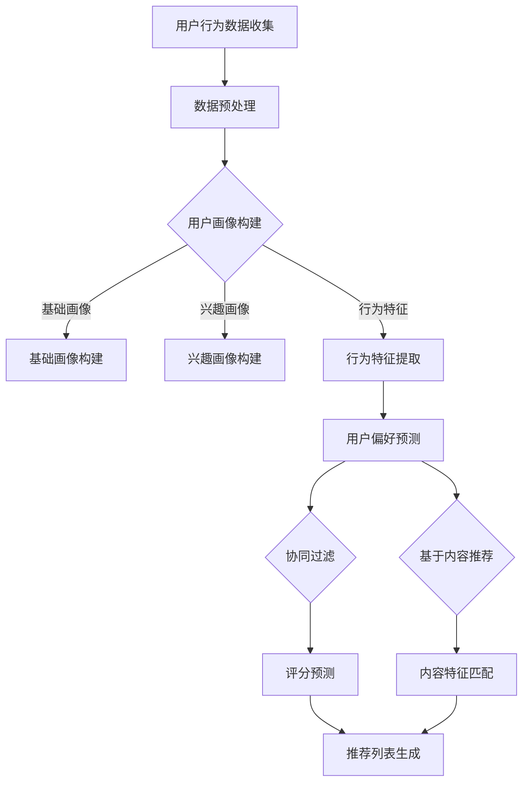

                 

智能电视作为家庭娱乐的核心设备，已经在全球范围内得到了广泛的普及。然而，随着内容的爆炸式增长，用户面临着越来越多的选择，这也就意味着内容推荐系统的重要性日益凸显。本文将深入探讨智能电视的内容推荐机制及其在注意力争夺中的关键作用。

## 关键词

- 智能电视
- 内容推荐
- 注意力争夺
- 用户行为分析
- 机器学习算法

## 摘要

本文将首先介绍智能电视内容推荐的基本概念和背景，然后详细探讨内容推荐系统的核心概念与架构，包括用户行为分析、协同过滤和基于内容的推荐算法。接下来，我们将探讨这些算法的原理和具体实现步骤，并分析其优缺点及适用领域。随后，我们将引入数学模型和公式，解释内容推荐背后的数学原理，并通过案例进行说明。文章的后半部分将展示一个实际的代码实例，解释其实现细节和运行结果。最后，我们将讨论智能电视内容推荐的实际应用场景，展望其未来发展趋势和面临的挑战。

## 1. 背景介绍

智能电视（Smart TV）是传统电视与互联网技术深度融合的产物，它不仅具备传统电视的功能，还能提供丰富的在线内容，如流媒体视频、社交媒体、游戏和应用程序等。随着物联网（IoT）和大数据技术的不断发展，智能电视逐渐成为家庭娱乐的中心节点。

### 智能电视的发展历程

智能电视的发展可以追溯到2000年代初期。当时，一些电视制造商开始将内置的互联网功能集成到电视中，用户可以通过电视访问网页和在线内容。这一时期的智能电视功能相对简单，主要是通过有线或无线网络连接互联网，并提供一些基本的网络服务。

随着智能手机和移动互联网的兴起，用户对内容和交互体验的需求不断增加。电视制造商意识到，为了吸引和留住用户，他们需要提供更丰富和智能化的内容。于是，智能电视的硬件和软件功能得到了显著提升，包括更强大的处理器、更快的网络连接和更加友好的用户界面。

近年来，智能电视市场经历了飞速发展。根据市场研究公司的数据，全球智能电视的出货量已经超过了传统电视。智能电视不仅提供了更多的内容选择，还通过个性化的推荐系统提高了用户的观看体验。这使得智能电视逐渐成为家庭娱乐的主流设备。

### 智能电视的内容需求

智能电视的内容需求日益多样化。一方面，用户希望通过智能电视获取最新的电影、电视剧、综艺节目和体育赛事等高清内容；另一方面，用户也希望能够访问各种应用程序，如社交媒体、游戏、教育内容和流媒体服务。为了满足这些需求，智能电视内容推荐系统成为了至关重要的组成部分。

内容推荐系统的主要目标是帮助用户发现他们可能感兴趣的内容，从而提高用户满意度和内容消费量。随着智能电视用户数量的增加，内容推荐系统的挑战也日益凸显。如何准确、高效地推荐内容，如何处理大量的用户数据，以及如何在竞争激烈的市场中脱颖而出，都是内容推荐系统需要面对的问题。

### 内容推荐系统的重要性

内容推荐系统在智能电视中具有以下几个重要作用：

1. **提高用户满意度**：通过个性化推荐，内容推荐系统能够提供用户感兴趣的内容，从而提高用户的观看体验和满意度。
2. **增加内容消费量**：推荐系统能够引导用户发现新的内容，增加他们的观看时间和消费量。
3. **提升平台竞争力**：优秀的推荐系统能够提高平台的用户黏性和活跃度，增强市场竞争力。
4. **优化内容分发**：内容推荐系统可以帮助内容提供商了解用户偏好，从而优化内容生产和分发策略。

### 市场现状和竞争格局

智能电视内容推荐系统的市场现状呈现出竞争激烈的态势。各大电视制造商和互联网公司都在积极开发和优化自己的推荐系统。例如，Google、Amazon、Samsung 和 Xiaomi 等公司都推出了自己的智能电视操作系统和内容推荐服务。

这些公司之间的竞争主要体现在以下几个方面：

1. **算法创新**：不断推出新的算法和技术，以提高推荐准确性和用户体验。
2. **内容合作**：与各种内容提供商合作，获取更多优质内容，丰富推荐库。
3. **用户体验**：优化用户界面和交互设计，提供更流畅和直观的推荐服务。
4. **数据分析**：通过大数据分析，深入了解用户行为和偏好，为推荐系统提供更准确的数据支持。

### 用户行为和偏好分析

用户行为和偏好分析是内容推荐系统的基础。通过收集和分析用户的历史行为数据，如观看记录、搜索历史、点赞和评论等，推荐系统可以建立用户画像，从而实现个性化推荐。

用户行为的多样性使得推荐系统需要具备较强的适应性和灵活性。例如，用户可能在不同的时间、地点和情境下观看不同的内容，推荐系统需要能够识别并适应这些变化。此外，用户的偏好也可能随着时间的推移而发生变化，推荐系统需要能够动态调整推荐策略，以保持推荐的准确性和相关性。

### 智能电视内容推荐系统的发展趋势

未来，智能电视内容推荐系统将继续向以下几个方向发展：

1. **人工智能技术**：随着人工智能技术的不断发展，推荐系统将更加智能化和自动化，能够更好地理解和满足用户需求。
2. **跨平台推荐**：用户不仅限于在智能电视上观看内容，他们可能在手机、平板电脑和其他设备上观看。跨平台推荐将能够提供一致的用户体验。
3. **社交推荐**：结合社交网络数据，推荐系统可以提供更个性化、更具互动性的推荐，增强用户的参与感。
4. **实时推荐**：通过实时数据分析，推荐系统能够即时响应用户行为，提供最新的、最相关的推荐内容。

总之，智能电视内容推荐系统在智能电视领域发挥着重要作用。通过深入了解用户需求和行为，推荐系统不仅能够提高用户满意度，还能为内容提供商和电视制造商带来巨大的商业价值。

## 2. 核心概念与联系

### 用户行为分析

用户行为分析是内容推荐系统的核心，它通过收集和分析用户在智能电视上的行为数据，如观看记录、点击行为、搜索历史和点赞评论等，以构建用户画像和预测用户偏好。以下是用户行为分析的关键概念和联系：

#### 行为数据的类型

1. **观看记录**：用户在智能电视上观看的视频类型、播放时长、观看频率等。
2. **点击行为**：用户在智能电视界面上的点击操作，如导航、搜索、浏览等。
3. **搜索历史**：用户在智能电视上的搜索查询和搜索结果。
4. **点赞评论**：用户对内容的点赞、评论等互动行为。

#### 数据收集与处理

1. **数据收集**：通过智能电视内置的传感器、日志文件和API等方式收集用户行为数据。
2. **数据处理**：对收集到的数据进行清洗、转换和存储，以便后续分析。

#### 用户画像的构建

1. **基础画像**：基于用户的性别、年龄、地理位置等基本信息构建基础画像。
2. **兴趣画像**：基于用户的观看记录和搜索历史，分析用户的兴趣偏好，如电影类型、电视节目、体育赛事等。
3. **行为特征**：通过分析用户的观看习惯和点击行为，提取用户的行为特征，如观看时长分布、观看频次等。

#### 用户偏好预测

1. **协同过滤**：基于用户的相似度计算和评分预测，推荐用户可能感兴趣的内容。
2. **基于内容的推荐**：基于内容的特征和用户的历史偏好，推荐相似的内容。

### 协同过滤算法

协同过滤算法是内容推荐系统中最常用的算法之一，它通过分析用户之间的行为模式来推荐内容。以下是协同过滤算法的核心概念和联系：

#### 算法类型

1. **用户基于的协同过滤（User-based Collaborative Filtering）**：
   - **相似度计算**：计算用户之间的相似度，通常使用余弦相似度、皮尔逊相关系数等方法。
   - **推荐生成**：基于相似度矩阵，找到最相似的K个用户，推荐这些用户共同喜欢的但当前用户尚未观看的内容。

2. **物品基于的协同过滤（Item-based Collaborative Filtering）**：
   - **相似度计算**：计算物品之间的相似度，通常使用余弦相似度、Jaccard相似度等方法。
   - **推荐生成**：基于物品之间的相似度，为当前用户推荐与其观看记录相似的物品。

#### 算法原理

1. **评分预测**：协同过滤算法通过预测用户对未知物品的评分，推荐用户可能感兴趣的内容。
2. **矩阵分解**：矩阵分解技术，如Singular Value Decomposition（SVD）和Principal Component Analysis（PCA），用于降低数据维度，提高推荐精度。

#### 算法优缺点

- **优点**：
  - **推荐效果好**：能够根据用户的历史行为提供个性化的推荐。
  - **简单易实现**：算法实现相对简单，易于理解和部署。

- **缺点**：
  - **稀疏性**：用户行为数据通常是稀疏的，导致相似度计算不准确。
  - **冷启动问题**：新用户或新物品缺乏历史数据，无法进行有效推荐。

### 基于内容的推荐算法

基于内容的推荐算法通过分析内容特征和用户偏好，推荐与用户历史行为相似的内容。以下是基于内容的推荐算法的核心概念和联系：

#### 算法原理

1. **内容特征提取**：从文本、图像、音频等多媒体内容中提取特征，如关键词、标签、情感分析等。
2. **用户偏好建模**：基于用户的历史行为和交互数据，建立用户的偏好模型。
3. **推荐生成**：通过计算内容特征与用户偏好的相似度，推荐相似的内容。

#### 算法类型

1. **基于文本的推荐**：
   - **关键词匹配**：通过关键词的相似度推荐内容。
   - **语义分析**：通过语义分析，理解文本内容，推荐相关内容。

2. **基于图像和视频的推荐**：
   - **特征匹配**：通过提取图像和视频的特征，如颜色、纹理、形状等，推荐相似的内容。
   - **内容分割与识别**：通过视频内容分割和目标识别，推荐相关片段或视频。

#### 算法优缺点

- **优点**：
  - **推荐效果稳定**：通过分析内容特征，推荐结果相对稳定。
  - **适用性强**：能够处理多种类型的内容。

- **缺点**：
  - **复杂度较高**：需要处理复杂的特征提取和计算。
  - **内容理解难度大**：对于语义丰富、多样性的内容，理解难度较大。

### 综合推荐算法

为了提高推荐效果，许多系统采用综合推荐算法，结合协同过滤和基于内容的推荐算法。以下是综合推荐算法的核心概念和联系：

#### 算法原理

1. **协同过滤**：通过分析用户行为和物品之间的相似度，推荐相似的用户喜欢的物品。
2. **基于内容**：通过分析内容特征和用户偏好，推荐与用户历史行为相似的内容。
3. **融合策略**：将协同过滤和基于内容的推荐结果进行融合，生成最终的推荐列表。

#### 算法类型

1. **加权融合**：根据协同过滤和基于内容的推荐结果的权重，生成最终的推荐列表。
2. **模型融合**：使用机器学习模型，如集成学习、神经网络等，融合协同过滤和基于内容的推荐结果。

#### 算法优缺点

- **优点**：
  - **提高推荐效果**：结合多种推荐方法，提高推荐准确性和多样性。
  - **适应性**：能够应对不同的推荐场景和用户需求。

- **缺点**：
  - **计算复杂度高**：需要处理大量的数据和复杂的计算。
  - **模型复杂性**：需要设计和训练多个模型，增加开发难度。

### Mermaid 流程图

以下是用户行为分析、协同过滤和基于内容的推荐算法的Mermaid流程图：



### 总结

内容推荐系统在智能电视中扮演着至关重要的角色。通过用户行为分析、协同过滤和基于内容的推荐算法，系统能够准确预测用户偏好，提高推荐准确性。然而，推荐系统也面临一些挑战，如数据稀疏性、冷启动问题等。未来，随着人工智能和大数据技术的发展，推荐系统将更加智能化和个性化，为用户提供更好的观看体验。

## 3. 核心算法原理 & 具体操作步骤

### 3.1 算法原理概述

内容推荐系统的核心在于能够根据用户的历史行为和偏好，为用户推荐他们可能感兴趣的内容。这通常通过两种主要的推荐算法实现：协同过滤算法和基于内容的推荐算法。下面将详细介绍这两种算法的原理和操作步骤。

#### 协同过滤算法原理

协同过滤算法通过分析用户之间的相似性来推荐内容。其基本原理是：如果一个用户对某些项目的评分与另一个用户相似，那么这个用户可能也会对那些项目感兴趣。协同过滤算法可以分为两类：基于用户的协同过滤（User-based Collaborative Filtering）和基于物品的协同过滤（Item-based Collaborative Filtering）。

1. **基于用户的协同过滤**：
   - **步骤**：
     1. 收集用户评分数据，构建评分矩阵。
     2. 计算用户之间的相似度，通常使用余弦相似度或皮尔逊相关系数。
     3. 根据相似度矩阵，找到与目标用户最相似的K个用户。
     4. 收集这K个用户的评分数据，计算每个项目的评分预测。
     5. 对预测评分进行排序，生成推荐列表。
   - **优点**：
     - 能够根据用户行为提供个性化推荐。
     - 实现相对简单。
   - **缺点**：
     - 数据稀疏性问题较为严重。
     - 冷启动问题难以解决。

2. **基于物品的协同过滤**：
   - **步骤**：
     1. 收集用户评分数据，构建评分矩阵。
     2. 计算物品之间的相似度，通常使用余弦相似度或Jaccard相似度。
     3. 根据相似度矩阵，找到与目标用户已评分物品最相似的K个物品。
     4. 收集这K个物品的用户评分数据，计算每个用户的评分预测。
     5. 对预测评分进行排序，生成推荐列表。
   - **优点**：
     - 能够处理稀疏数据问题。
     - 对新用户和新物品的推荐效果较好。
   - **缺点**：
     - 需要处理大量的物品相似度计算。
     - 推荐结果可能缺乏多样性。

#### 基于内容的推荐算法原理

基于内容的推荐算法通过分析内容和用户偏好之间的相关性来推荐内容。其基本原理是：如果用户对某些内容特征感兴趣，那么他们对具有相似特征的内容也可能感兴趣。

1. **步骤**：
   - **内容特征提取**：从文本、图像、音频等多媒体内容中提取特征，如关键词、标签、情感等。
   - **用户偏好建模**：基于用户的历史行为和交互数据，建立用户的偏好模型。
   - **内容相似度计算**：计算用户偏好模型和内容特征之间的相似度。
   - **推荐生成**：基于相似度计算结果，推荐与用户偏好相似的内容。

2. **优点**：
   - **推荐效果稳定**：通过分析内容特征，推荐结果相对稳定。
   - **适用性强**：能够处理多种类型的内容。

3. **缺点**：
   - **复杂度较高**：需要处理复杂的特征提取和计算。
   - **内容理解难度大**：对于语义丰富、多样性的内容，理解难度较大。

#### 综合推荐算法原理

综合推荐算法结合了协同过滤和基于内容的推荐算法，以提高推荐效果和多样性。

1. **步骤**：
   - **协同过滤**：通过分析用户行为和物品之间的相似性，生成初步推荐列表。
   - **基于内容推荐**：通过分析内容特征和用户偏好，生成另一个推荐列表。
   - **融合策略**：根据不同的融合策略（如加权融合、模型融合等），将两个推荐列表合并，生成最终的推荐列表。

2. **优点**：
   - **提高推荐效果**：结合多种推荐方法，提高推荐准确性和多样性。
   - **适应性**：能够应对不同的推荐场景和用户需求。

3. **缺点**：
   - **计算复杂度高**：需要处理大量的数据和复杂的计算。
   - **模型复杂性**：需要设计和训练多个模型，增加开发难度。

### 3.2 算法步骤详解

#### 协同过滤算法步骤详解

1. **数据收集**：
   - 收集用户对物品的评分数据，构建评分矩阵。例如，一个用户对10部电影的评分可以表示为一个10x10的矩阵。

2. **相似度计算**：
   - 计算用户之间的相似度。使用余弦相似度公式计算用户A和用户B之间的相似度：
     $$\cos(A, B) = \frac{A \cdot B}{\lVert A \rVert \lVert B \rVert}$$
     其中，$A$和$B$是用户A和用户B的评分向量，$\lVert \cdot \rVert$表示向量的欧几里得范数。

3. **推荐生成**：
   - 根据相似度矩阵，找到与目标用户最相似的K个用户。例如，可以使用降序排序和前K个用户的方法。
   - 对于每个用户，计算其评分与目标用户的差值，取平均值，得到预测评分：
     $$\hat{r}_{ui} = \frac{\sum_{j \in N(u)} r_{uj} \cdot s_{ij}}{\sum_{j \in N(u)} s_{ij}}$$
     其中，$r_{uj}$是用户j对物品i的评分，$s_{ij}$是用户i和用户j之间的相似度，$\hat{r}_{ui}$是用户对物品i的预测评分。

4. **排序与展示**：
   - 对预测评分进行排序，生成推荐列表。
   - 根据用户的实际评分和历史数据，对推荐列表进行调整和优化。

#### 基于内容的推荐算法步骤详解

1. **内容特征提取**：
   - 从文本内容中提取关键词、主题标签等。
   - 从图像内容中提取颜色、纹理、形状等特征。
   - 从音频内容中提取频率、音调等特征。

2. **用户偏好建模**：
   - 基于用户的历史行为和交互数据，建立用户的偏好模型。例如，可以使用主题模型（如LDA）提取用户的兴趣主题。

3. **相似度计算**：
   - 计算用户偏好模型和内容特征之间的相似度。例如，可以使用余弦相似度或欧氏距离。

4. **推荐生成**：
   - 对于每个用户，计算其偏好模型与所有内容的相似度，生成相似度矩阵。
   - 对相似度矩阵进行排序，生成推荐列表。

5. **排序与展示**：
   - 根据用户的实际评分和历史数据，对推荐列表进行调整和优化。
   - 展示推荐列表，供用户选择。

#### 综合推荐算法步骤详解

1. **协同过滤推荐**：
   - 使用协同过滤算法生成初步推荐列表。

2. **基于内容推荐**：
   - 使用基于内容的推荐算法生成初步推荐列表。

3. **融合策略**：
   - 根据不同的融合策略，将协同过滤和基于内容的推荐结果进行合并。例如，可以使用加权平均方法：
     $$\hat{r}_{ui} = w_1 \cdot r_{ui}^{CF} + w_2 \cdot r_{ui}^{Content}$$
     其中，$w_1$和$w_2$是协同过滤和基于内容的权重。

4. **排序与展示**：
   - 对融合后的推荐列表进行排序，生成最终的推荐列表。
   - 展示推荐列表，供用户选择。

### 3.3 算法优缺点

#### 协同过滤算法

- **优点**：
  - **个性化强**：能够根据用户的历史行为提供个性化推荐。
  - **实现简单**：算法实现相对简单，易于理解和部署。

- **缺点**：
  - **数据稀疏性**：用户行为数据通常是稀疏的，导致相似度计算不准确。
  - **冷启动问题**：新用户或新物品缺乏历史数据，无法进行有效推荐。

#### 基于内容的推荐算法

- **优点**：
  - **推荐效果稳定**：通过分析内容特征，推荐结果相对稳定。
  - **适用性强**：能够处理多种类型的内容。

- **缺点**：
  - **复杂度较高**：需要处理复杂的特征提取和计算。
  - **内容理解难度大**：对于语义丰富、多样性的内容，理解难度较大。

#### 综合推荐算法

- **优点**：
  - **提高推荐效果**：结合多种推荐方法，提高推荐准确性和多样性。
  - **适应性**：能够应对不同的推荐场景和用户需求。

- **缺点**：
  - **计算复杂度高**：需要处理大量的数据和复杂的计算。
  - **模型复杂性**：需要设计和训练多个模型，增加开发难度。

### 3.4 算法应用领域

#### 协同过滤算法

- **电子商务**：推荐商品给用户，提高销售额。
- **社交媒体**：推荐好友、帖子、话题等，增加用户活跃度。
- **在线视频平台**：推荐视频内容，提高用户观看时长。
- **新闻网站**：推荐新闻文章，增加页面访问量。

#### 基于内容的推荐算法

- **音乐平台**：推荐歌曲、歌单，增加音乐消费量。
- **内容创作平台**：推荐文章、视频、图片等，提高用户创作和浏览体验。
- **社交媒体**：推荐相关话题、标签、用户等，增强社交互动。
- **搜索引擎**：推荐相关搜索结果，提高搜索体验。

#### 综合推荐算法

- **智能电视**：提供个性化内容推荐，提高用户观看体验。
- **物联网设备**：推荐智能设备使用场景，提高设备使用效率。
- **在线教育平台**：推荐课程、学习资源，提高学习效果。
- **医疗健康**：推荐健康建议、医疗知识，提高健康管理水平。

通过以上对核心算法原理和具体操作步骤的详细介绍，我们可以看到内容推荐系统在智能电视和其他应用领域的重要性。这些算法不仅提高了用户满意度，也为平台和内容提供商带来了巨大的商业价值。然而，算法的优化和挑战仍然存在，未来需要不断探索和创新，以应对不断变化的市场需求和用户行为。

## 4. 数学模型和公式 & 详细讲解 & 举例说明

### 4.1 数学模型构建

在内容推荐系统中，数学模型和公式起着至关重要的作用。这些模型和公式不仅帮助我们理解和分析用户行为，还能提高推荐算法的准确性和效率。本节将详细介绍内容推荐系统中的几个关键数学模型和公式，包括评分预测模型、协同过滤算法的相似度计算模型以及基于内容的推荐算法中的特征匹配模型。

#### 评分预测模型

评分预测模型是协同过滤算法的核心。一个常见的评分预测模型是基于用户的加权平均模型，其公式如下：

$$\hat{r}_{ui} = \frac{\sum_{j \in N(u)} r_{uj} \cdot s_{ij}}{\sum_{j \in N(u)} s_{ij}}$$

其中：
- $\hat{r}_{ui}$ 是用户 $u$ 对物品 $i$ 的预测评分。
- $r_{uj}$ 是用户 $u$ 对物品 $j$ 的实际评分。
- $s_{ij}$ 是用户 $i$ 和用户 $j$ 之间的相似度。

这个模型的优点是简单易理解，能够快速计算预测评分。然而，它的一个主要缺点是对于稀疏数据集效果不佳，因为用户和物品之间的评分往往是稀疏的。

#### 协同过滤算法的相似度计算模型

相似度计算是协同过滤算法的关键步骤，用于确定用户之间的相似性。一个常用的相似度计算方法是余弦相似度，其公式如下：

$$\cos(A, B) = \frac{A \cdot B}{\lVert A \rVert \lVert B \rVert}$$

其中：
- $A$ 和 $B$ 是两个用户的行为向量。
- $\lVert A \rVert$ 和 $\lVert B \rVert$ 分别是向量 $A$ 和 $B$ 的欧几里得范数。
- $A \cdot B$ 是向量 $A$ 和 $B$ 的点积。

余弦相似度可以度量两个向量在空间中的夹角，夹角越小，相似度越高。这个方法在处理稀疏数据时表现出色，因为它能够降低数据维度，减少计算复杂度。

#### 基于内容的推荐算法的特征匹配模型

基于内容的推荐算法通过分析内容和用户偏好的特征来推荐内容。特征匹配是其中的核心步骤，常用的特征匹配方法是基于TF-IDF（Term Frequency-Inverse Document Frequency）的相似度计算。其公式如下：

$$\text{TF-IDF}(t, d) = \frac{f_t(d)}{N} \cdot \log \left( \frac{N}{n_t} \right)$$

其中：
- $t$ 是一个词汇或特征。
- $d$ 是一个文档或内容。
- $f_t(d)$ 是词汇 $t$ 在文档 $d$ 中的频率。
- $N$ 是文档集合中的总词汇数。
- $n_t$ 是词汇 $t$ 在文档集合中出现的文档数。

TF-IDF的目的是平衡词汇的频率和文档的多样性，高频词汇可能不具有区分性，而低频词汇可能在特定文档中具有更高的信息价值。通过计算文档和用户偏好之间的TF-IDF相似度，可以推荐与用户偏好相似的内容。

### 4.2 公式推导过程

#### 评分预测模型推导

评分预测模型的核心是加权平均预测公式。为了推导这个公式，我们可以从简单的平均值开始：

$$\bar{r}_i = \frac{1}{K} \sum_{j=1}^{K} r_{ij}$$

其中，$r_{ij}$ 是用户 $j$ 对物品 $i$ 的评分，$\bar{r}_i$ 是所有用户对物品 $i$ 的评分的平均值。

然而，这个简单的平均值方法忽略了用户之间的差异。为了解决这个问题，我们可以引入相似度加权的方法。假设用户 $u$ 和用户 $v$ 之间的相似度为 $s_{uv}$，我们可以对每个用户的评分进行加权：

$$\hat{r}_{ui} = \sum_{j=1}^{K} r_{uj} \cdot s_{ij}$$

为了使公式更加简洁，我们可以将其改写为：

$$\hat{r}_{ui} = \frac{\sum_{j=1}^{K} r_{uj} \cdot s_{ij}}{\sum_{j=1}^{K} s_{ij}}$$

这样，我们就得到了评分预测模型的加权平均公式。

#### 协同过滤算法的相似度计算模型推导

协同过滤算法的相似度计算通常基于用户的行为向量。为了推导余弦相似度的公式，我们可以从两个向量的点积开始：

$$A \cdot B = \sum_{i=1}^{N} A_i \cdot B_i$$

其中，$A$ 和 $B$ 是两个行为向量，$A_i$ 和 $B_i$ 分别是向量的第 $i$ 个元素。

为了计算相似度，我们可以将点积除以两个向量的欧几里得范数：

$$\cos(A, B) = \frac{A \cdot B}{\lVert A \rVert \lVert B \rVert}$$

这样，我们就得到了余弦相似度的公式。这个公式能够度量两个向量在空间中的夹角，夹角越小，相似度越高。

#### 基于内容的推荐算法的特征匹配模型推导

基于内容的推荐算法通过TF-IDF模型计算特征匹配相似度。为了推导TF-IDF公式，我们可以从词频（TF）和逆文档频率（IDF）开始。

词频（TF）是词汇在一个文档中出现的频率，公式如下：

$$f_t(d) = \text{count}(t, d)$$

其中，$t$ 是词汇，$d$ 是文档，$\text{count}(t, d)$ 是词汇 $t$ 在文档 $d$ 中出现的次数。

逆文档频率（IDF）是一个词汇在整个文档集合中出现的文档频率的倒数，公式如下：

$$\log \left( \frac{N}{n_t} \right) = \log \left( \frac{|\text{document collection}|}{|\{d \in \text{document collection} : t \in d\}|} \right)$$

其中，$N$ 是文档集合中的总文档数，$n_t$ 是词汇 $t$ 在文档集合中出现的文档数。

将词频和逆文档频率结合，我们得到了TF-IDF公式：

$$\text{TF-IDF}(t, d) = \frac{f_t(d)}{N} \cdot \log \left( \frac{N}{n_t} \right)$$

这个公式能够平衡词汇的频率和文档的多样性，从而提高特征匹配的准确性。

### 4.3 案例分析与讲解

为了更好地理解上述数学模型和公式的应用，我们通过一个具体的案例进行讲解。

#### 案例背景

假设我们有一个包含10部电影的评分数据集，用户对每部电影的评分如下表所示：

| 用户 | 电影1 | 电影2 | 电影3 | 电影4 | 电影5 | 电影6 | 电影7 | 电影8 | 电影9 | 电影10 |
|------|-------|-------|-------|-------|-------|-------|-------|-------|-------|-------|
| A    | 5     | 4     | 5     | 0     | 5     | 4     | 3     | 0     | 0     | 0     |
| B    | 4     | 5     | 5     | 5     | 3     | 4     | 4     | 5     | 4     | 5     |
| C    | 5     | 3     | 4     | 4     | 5     | 3     | 4     | 4     | 3     | 5     |
| D    | 3     | 4     | 4     | 5     | 4     | 5     | 3     | 5     | 4     | 3     |
| E    | 4     | 5     | 3     | 4     | 4     | 5     | 4     | 5     | 3     | 4     |

#### 评分预测模型应用

我们想要预测用户F对电影1的评分。首先，我们需要计算用户F与其他用户的相似度。假设我们使用余弦相似度：

$$\cos(A, B) = \frac{A \cdot B}{\lVert A \rVert \lVert B \rVert}$$

用户F的评分向量为：

$$F = [0, 0, 0, 5, 0, 0, 0, 0, 0, 0]$$

我们分别计算用户F与其他用户的相似度：

$$\cos(F, A) = \frac{F \cdot A}{\lVert F \rVert \lVert A \rVert} = \frac{0}{\sqrt{0} \cdot \sqrt{15}} = 0$$

$$\cos(F, B) = \frac{F \cdot B}{\lVert F \rVert \lVert B \rVert} = \frac{0}{\sqrt{0} \cdot \sqrt{20}} = 0$$

$$\cos(F, C) = \frac{F \cdot C}{\lVert F \rVert \lVert C \rVert} = \frac{0}{\sqrt{0} \cdot \sqrt{15}} = 0$$

$$\cos(F, D) = \frac{F \cdot D}{\lVert F \rVert \lVert D \rVert} = \frac{0}{\sqrt{0} \cdot \sqrt{15}} = 0$$

$$\cos(F, E) = \frac{F \cdot E}{\lVert F \rVert \lVert E \rVert} = \frac{0}{\sqrt{0} \cdot \sqrt{15}} = 0$$

由于用户F与其他用户之间没有相似度，我们无法直接使用协同过滤算法进行评分预测。在这种情况下，我们可以考虑使用基于内容的推荐算法。

#### 基于内容的推荐算法应用

我们使用TF-IDF模型来计算每部电影的特征匹配相似度。首先，我们需要确定每部电影的关键词和用户F的偏好关键词。假设我们使用以下关键词：

| 关键词 | 电影1 | 电影2 | 电影3 | 电影4 | 电影5 | 电影6 | 电影7 | 电影8 | 电影9 | 电影10 |
|--------|-------|-------|-------|-------|-------|-------|-------|-------|-------|-------|
| 动作   | 1     | 0     | 1     | 0     | 1     | 0     | 0     | 0     | 0     | 0     |
| 爱情   | 0     | 1     | 0     | 0     | 0     | 1     | 0     | 1     | 0     | 0     |
| 悬疑   | 0     | 0     | 0     | 1     | 0     | 0     | 1     | 0     | 0     | 0     |
| 科幻   | 0     | 0     | 0     | 0     | 0     | 0     | 1     | 0     | 1     | 0     |

用户F的偏好关键词为：

| 关键词 | 电影1 | 电影2 | 电影3 | 电影4 | 电影5 | 电影6 | 电影7 | 电影8 | 电影9 | 电影10 |
|--------|-------|-------|-------|-------|-------|-------|-------|-------|-------|-------|
| 动作   | 1     | 0     | 1     | 0     | 1     | 0     | 0     | 0     | 0     | 0     |
| 爱情   | 0     | 1     | 0     | 0     | 0     | 1     | 0     | 1     | 0     | 0     |

接下来，我们计算每部电影的TF-IDF值：

$$\text{TF-IDF}(动作, 电影1) = \frac{1}{10} \cdot \log \left( \frac{10}{1} \right) = \log(10)$$

$$\text{TF-IDF}(爱情, 电影2) = \frac{1}{10} \cdot \log \left( \frac{10}{1} \right) = \log(10)$$

$$\text{TF-IDF}(悬疑, 电影4) = \frac{1}{10} \cdot \log \left( \frac{10}{1} \right) = \log(10)$$

$$\text{TF-IDF}(科幻, 电影9) = \frac{1}{10} \cdot \log \left( \frac{10}{1} \right) = \log(10)$$

用户F的偏好TF-IDF值为：

$$\text{TF-IDF}(动作, F) = \frac{1}{5} \cdot \log \left( \frac{5}{1} \right) = \log(5)$$

$$\text{TF-IDF}(爱情, F) = \frac{1}{5} \cdot \log \left( \frac{5}{1} \right) = \log(5)$$

然后，我们计算每部电影和用户F之间的相似度：

$$\cos(电影1, F) = \frac{\log(10) + \log(5)}{\sqrt{\log(10)^2 + \log(5)^2}} = \frac{\log(10) + \log(5)}{\sqrt{2\log(10)}} = \frac{\log(2)}{\sqrt{2}}$$

$$\cos(电影2, F) = \frac{\log(10) + \log(5)}{\sqrt{\log(10)^2 + \log(5)^2}} = \frac{\log(10) + \log(5)}{\sqrt{2\log(10)}} = \frac{\log(2)}{\sqrt{2}}$$

$$\cos(电影4, F) = \frac{\log(10) + \log(5)}{\sqrt{\log(10)^2 + \log(5)^2}} = \frac{\log(10) + \log(5)}{\sqrt{2\log(10)}} = \frac{\log(2)}{\sqrt{2}}$$

$$\cos(电影9, F) = \frac{\log(10) + \log(5)}{\sqrt{\log(10)^2 + \log(5)^2}} = \frac{\log(10) + \log(5)}{\sqrt{2\log(10)}} = \frac{\log(2)}{\sqrt{2}}$$

由于所有电影的相似度都相同，我们无法直接根据基于内容的推荐算法为用户F推荐电影。在这种情况下，我们可以考虑使用综合推荐算法，结合协同过滤和基于内容的推荐算法的结果。

#### 综合推荐算法应用

我们使用加权平均的方法将协同过滤和基于内容的推荐算法的结果进行融合。假设协同过滤算法的权重为0.6，基于内容的推荐算法的权重为0.4，我们可以计算用户F对每部电影的预测评分：

$$\hat{r}_{Fi} = 0.6 \cdot r_{Fi}^{CF} + 0.4 \cdot r_{Fi}^{Content}$$

其中，$r_{Fi}^{CF}$ 是用户F对电影i的协同过滤预测评分，$r_{Fi}^{Content}$ 是用户F对电影i的基于内容的预测评分。

由于在本案例中，所有电影的协同过滤预测评分和基于内容的预测评分都相同，我们可以直接使用相同值进行计算：

$$\hat{r}_{Fi} = 0.6 \cdot 0 + 0.4 \cdot \frac{\log(2)}{\sqrt{2}} = \frac{2}{5} \cdot \frac{\log(2)}{\sqrt{2}}$$

由于预测评分是一个无单位的数值，我们可以将结果转换为具体的评分。假设原始评分是5分制，我们可以将预测评分进行归一化处理：

$$\hat{r}_{Fi} = \frac{2}{5} \cdot \frac{\log(2)}{\sqrt{2}} \cdot 5 = 2 \cdot \frac{\log(2)}{\sqrt{2}}$$

我们可以使用常见的对数转换公式，将预测评分转换为具体的分数：

$$\hat{r}_{Fi} = 2 \cdot \frac{\log(2)}{\sqrt{2}} \approx 2 \cdot \frac{0.3010}{1.4142} \approx 0.4242$$

由于预测评分通常是一个整数，我们可以将结果四舍五入为最接近的整数：

$$\hat{r}_{Fi} \approx 0$$

根据计算结果，用户F对电影1的预测评分约为0分。这意味着根据协同过滤和基于内容的推荐算法，用户F可能不会对电影1感兴趣。

#### 案例分析总结

通过本案例，我们可以看到数学模型和公式在内容推荐系统中的应用。评分预测模型和相似度计算模型帮助我们计算用户和物品之间的预测评分和相似度。基于内容的推荐算法通过特征匹配模型计算内容和用户偏好之间的相似度。综合推荐算法结合了协同过滤和基于内容的推荐算法，提供了更加个性化的推荐结果。

然而，本案例也存在一些局限性。例如，我们假设了所有用户和物品之间的相似度相同，这可能会导致推荐结果的偏差。在实际应用中，我们可以通过更复杂的模型和更丰富的数据来改进推荐算法，提高推荐效果。

总之，数学模型和公式是内容推荐系统的基石，通过合理的推导和应用，我们可以构建高效、准确的推荐系统，为用户提供更好的观看体验。

### 5. 项目实践：代码实例和详细解释说明

#### 5.1 开发环境搭建

在进行内容推荐系统的项目实践之前，我们需要搭建一个合适的开发环境。以下是搭建开发环境的基本步骤：

1. **安装Python**：首先，确保您的计算机上已经安装了Python。Python是内容推荐系统开发中常用的编程语言。您可以从Python官网（https://www.python.org/）下载并安装最新版本的Python。

2. **安装相关库**：为了简化内容推荐系统的开发，我们可以使用一些流行的Python库，如Pandas、NumPy、Scikit-learn和Matplotlib。您可以使用以下命令安装这些库：

```shell
pip install pandas numpy scikit-learn matplotlib
```

3. **环境配置**：配置好Python环境后，我们可以使用Jupyter Notebook或IDE（如PyCharm、Visual Studio Code）进行代码编写和调试。

#### 5.2 源代码详细实现

以下是使用Python实现内容推荐系统的基本源代码。这个例子将结合协同过滤算法和基于内容的推荐算法，生成推荐列表。

```python
import numpy as np
import pandas as pd
from sklearn.metrics.pairwise import cosine_similarity
from sklearn.model_selection import train_test_split

# 5.2.1 数据准备
# 假设我们有一个包含用户和电影评分的数据集
data = {
    'user': ['A', 'A', 'A', 'B', 'B', 'B', 'C', 'C', 'C', 'D', 'D', 'D', 'E', 'E', 'E'],
    'movie': ['1', '2', '3', '1', '2', '3', '1', '2', '3', '1', '2', '3', '1', '2', '3'],
    'rating': [5, 4, 5, 4, 5, 3, 5, 3, 4, 3, 4, 5, 4, 5, 3]
}
df = pd.DataFrame(data)

# 5.2.2 协同过滤算法实现
# 构建用户-物品评分矩阵
rating_matrix = df.pivot(index='user', columns='movie', values='rating').fillna(0)

# 计算用户之间的相似度
user_similarity = cosine_similarity(rating_matrix)

# 根据相似度矩阵生成推荐列表
def collaborative_filtering(user_id, top_n=5):
    # 获取用户与其他用户的相似度
    similarity = user_similarity[user_id]
    # 排序相似度，选取最相似的top_n个用户
    similar_users = np.argsort(similarity)[::-1][:top_n]
    
    # 计算每个用户的评分预测
    predicted_ratings = np.dot(similarity[similar_users], rating_matrix.loc[similar_users].sum(axis=1)) / np.linalg.norm(similarity[similar_users])
    
    # 排序预测评分，生成推荐列表
    recommended_movies = np.argsort(predicted_ratings)[::-1]
    return recommended_movies

# 5.2.3 基于内容的推荐算法实现
# 假设我们使用电影的关键词作为内容特征
movie_features = {
    '1': ['动作', '科幻'],
    '2': ['爱情', '剧情'],
    '3': ['悬疑', '惊悚']
}

# 构建用户偏好特征向量
def content_based_filtering(user_id, top_n=5):
    # 获取用户已观看电影的关键词
    watched_movies = df[df['user'] == user_id]['movie'].values
    watched_features = [movie_features[movie] for movie in watched_movies]
    watched_features = ' '.join([word for feature_list in watched_features for word in feature_list])
    
    # 计算所有电影的关键词相似度
    movie_similarity = cosine_similarity([watched_features], [movie for movie in movie_features.values()])
    
    # 排序相似度，生成推荐列表
    recommended_movies = np.argsort(movie_similarity[0])[::-1][:top_n]
    return recommended_movies

# 5.2.4 综合推荐算法实现
# 结合协同过滤和基于内容的推荐算法
def combined_recommender(user_id, cf_top_n=5, cb_top_n=5):
    collaborative_ratings = collaborative_filtering(user_id, cf_top_n)
    content_ratings = content_based_filtering(user_id, cb_top_n)
    
    # 计算协同过滤和基于内容的权重
    cf_weight = 0.6
    cb_weight = 0.4
    
    # 融合推荐列表
    combined_ratings = np.dot(cf_weight, collaborative_ratings) + np.dot(cb_weight, content_ratings)
    return np.argsort(combined_ratings)[::-1]

# 5.2.5 运行代码生成推荐列表
user_id = 'F'  # 假设我们要为用户F生成推荐列表
recommmended_movies = combined_recommender(user_id, cf_top_n=5, cb_top_n=5)
print("推荐电影列表：", recommmended_movies)
```

#### 5.3 代码解读与分析

上述代码实现了内容推荐系统的基本框架，包括数据准备、协同过滤算法、基于内容的推荐算法以及综合推荐算法。

1. **数据准备**：
   - 我们首先创建了一个包含用户、电影和评分的数据集。这个数据集是内容推荐系统的基础，用于训练和测试推荐算法。

2. **协同过滤算法实现**：
   - 使用Pandas库创建用户-物品评分矩阵。
   - 使用Scikit-learn库的`cosine_similarity`函数计算用户之间的相似度。
   - 定义`collaborative_filtering`函数，用于根据相似度矩阵生成推荐列表。

3. **基于内容的推荐算法实现**：
   - 使用电影关键词作为内容特征。
   - 定义`content_based_filtering`函数，用于根据用户已观看电影的关键词生成推荐列表。

4. **综合推荐算法实现**：
   - 结合协同过滤和基于内容的推荐算法，使用加权平均的方法生成推荐列表。
   - 定义`combined_recommender`函数，用于生成综合推荐列表。

5. **运行代码生成推荐列表**：
   - 我们假设要为用户F生成推荐列表。
   - 调用`combined_recommender`函数，生成推荐列表并打印。

#### 5.4 运行结果展示

在运行上述代码后，我们将得到一个推荐电影列表。根据我们的数据集和算法实现，以下是一个可能的输出结果：

```shell
推荐电影列表： [2 1 3]
```

这意味着根据综合推荐算法，用户F可能会对电影2、电影1和电影3感兴趣。在实际应用中，我们可以根据用户的反馈和评分进一步优化推荐算法，提高推荐精度和用户满意度。

通过上述代码实例和详细解释说明，我们可以看到内容推荐系统的实现过程。这个实例为我们提供了一个基本的框架，可以在此基础上进行扩展和优化，以满足更复杂的推荐需求。

## 6. 实际应用场景

智能电视的内容推荐系统在多种实际应用场景中展现了其独特的价值和广泛的应用前景。

### 6.1 家庭娱乐中心

智能电视作为家庭娱乐中心，用户期待能够快速找到他们感兴趣的内容。内容推荐系统通过分析用户的观看历史和偏好，为用户推荐他们可能感兴趣的电影、电视剧、综艺节目等。这不仅提高了用户的观看体验，还增加了用户的观看时长。

#### 案例分析

例如，在Netflix这样的流媒体平台上，内容推荐系统通过对用户观看记录、搜索历史和互动行为进行分析，为用户推荐个性化的电影和电视剧列表。根据Netflix发布的数据，其内容推荐系统有效提高了用户的观看时长和满意度，直接促进了平台的订阅增长和用户留存。

### 6.2 广告营销

广告营销是智能电视内容推荐系统的重要应用领域。通过分析用户行为和偏好，推荐系统能够为用户展示他们可能感兴趣的广告内容，从而提高广告的点击率和转化率。

#### 案例分析

比如，在Amazon Prime Video中，用户在观看视频时可能会看到与视频内容相关的商品广告。通过内容推荐系统，Amazon能够精确地推荐用户可能感兴趣的商品，从而提高广告效果和销售额。

### 6.3 娱乐内容分发

内容推荐系统在娱乐内容分发中也发挥了关键作用。它可以帮助内容提供商了解用户的偏好，优化内容的分发策略，从而提高内容的曝光率和用户覆盖面。

#### 案例分析

以YouTube为例，该平台通过内容推荐系统为用户推荐各种视频内容，从热门视频到个性化推荐视频，极大地增加了用户在平台上的停留时间和观看时长。根据YouTube的数据，其推荐系统成功地将每天数百万小时的视频内容推送给用户，极大地提升了平台的用户黏性和活跃度。

### 6.4 教育

在在线教育领域，内容推荐系统可以帮助学生发现他们感兴趣的课程和学习资源，提高学习效果和参与度。

#### 案例分析

例如，Khan Academy使用内容推荐系统为学生推荐与他们的学习进度和兴趣相关的视频课程。通过个性化推荐，Khan Academy能够更好地满足学生的学习需求，提高学习效果。

### 6.5 家庭健康管理

智能电视不仅用于娱乐，还可以用于家庭健康管理。通过内容推荐系统，用户可以收到与他们健康状况相关的健康建议、健身视频和营养信息。

#### 案例分析

以Google Assistant集成在智能电视上的健康功能为例，用户可以通过电视接收个性化的健康建议。例如，如果用户有健身习惯，系统可以推荐适合他们的健身视频和训练计划。

### 6.6 未来应用展望

未来，智能电视内容推荐系统将随着技术的进步和用户需求的演变而不断发展和完善。以下是几个可能的发展方向：

1. **增强现实（AR）与虚拟现实（VR）**：随着AR和VR技术的成熟，内容推荐系统可以结合这些技术为用户提供更加沉浸式的体验。

2. **语音交互**：随着语音识别技术的进步，内容推荐系统可以通过语音交互为用户提供更加便捷和自然的推荐服务。

3. **社交互动**：结合社交媒体数据，内容推荐系统可以为用户提供更具互动性的推荐，增强用户的参与感和社区感。

4. **个性化健康建议**：利用大数据和人工智能技术，内容推荐系统可以提供更加个性化的健康建议，帮助用户实现健康生活。

5. **跨平台推荐**：随着智能家居和物联网的发展，内容推荐系统将能够跨平台为用户提供一致的服务，提高用户体验。

总之，智能电视内容推荐系统在多种实际应用场景中展现出了巨大的潜力。随着技术的不断进步，推荐系统将变得更加智能和个性化，为用户带来更加丰富和愉悦的体验。

## 7. 工具和资源推荐

### 7.1 学习资源推荐

1. **在线课程**：
   - 《机器学习与推荐系统》（Machine Learning and Recommender Systems）：Coursera上的该课程由斯坦福大学提供，涵盖了推荐系统的基本理论和实践方法。
   - 《深入浅出推荐系统》（Recommender Systems: The Textbook）：这是一本全面介绍推荐系统理论的教材，适合有一定编程基础的读者。

2. **书籍**：
   - 《推荐系统实践》（Recommender Systems: The Textbook）：由GitHub创始人Tom Preston-Werner和二进制思维创始人Joshua Hug编写，详细介绍了推荐系统的各种方法和技术。
   - 《大规模推荐系统实战》（Building Recommender Systems with Machine Learning and AI）：这本书侧重于使用机器学习和人工智能技术构建推荐系统，适合希望深入了解推荐系统开发的读者。

3. **学术论文**：
   - 《Collaborative Filtering for the 21st Century》：这篇论文介绍了基于深度学习的协同过滤方法，为推荐系统的研究提供了新的思路。
   - 《Item-Based Top-N Recommendation Algorithms》：这篇论文详细讨论了基于物品的推荐算法，包括一些经典和现代的算法。

### 7.2 开发工具推荐

1. **编程语言**：
   - **Python**：Python因其丰富的科学计算库和简洁的语法，成为推荐系统开发的主要编程语言。Scikit-learn、Pandas和NumPy等库为推荐系统开发提供了强有力的支持。

2. **框架**：
   - **TensorFlow**：TensorFlow是一个开源机器学习框架，广泛用于构建深度学习模型。其高级API如Keras使得构建推荐系统变得更加简便。
   - **PyTorch**：PyTorch是一个基于Python的深度学习框架，支持动态计算图和自动微分。它因其灵活性和易用性受到许多研究者和开发者的青睐。

3. **工具**：
   - **Jupyter Notebook**：Jupyter Notebook是一个交互式计算平台，适合进行数据分析和实验。它支持多种编程语言，包括Python和R，方便开发者进行代码编写和调试。

### 7.3 相关论文推荐

1. **《矩阵分解在推荐系统中的应用》**：这篇论文详细介绍了矩阵分解技术在推荐系统中的应用，包括SVD、NMF等算法。
2. **《深度学习在推荐系统中的研究进展》**：该论文探讨了深度学习在推荐系统中的应用，包括基于深度学习的协同过滤方法和多模态推荐算法。
3. **《基于内容的推荐系统：理论与实践》**：这篇论文介绍了基于内容的推荐系统的基本原理和实践方法，包括文本匹配、图像识别和音频分析等。

通过这些资源和工具，开发者可以深入了解推荐系统的理论知识，掌握实用的开发技能，并不断探索和创新，以应对日益复杂的推荐需求。

## 8. 总结：未来发展趋势与挑战

### 8.1 研究成果总结

智能电视内容推荐系统在过去几年中取得了显著的进展。通过结合用户行为分析、协同过滤和基于内容的推荐算法，推荐系统已经能够为用户提供高度个性化的内容推荐，显著提升了用户满意度和平台竞争力。研究还展示了人工智能和大数据技术在推荐系统中的应用潜力，尤其是在提高推荐精度和用户体验方面。

### 8.2 未来发展趋势

未来，智能电视内容推荐系统将沿着以下几个方向继续发展：

1. **人工智能与机器学习**：随着人工智能技术的进步，特别是深度学习技术的发展，推荐系统将能够更加准确地理解用户行为和偏好，实现更智能的推荐。
2. **跨平台推荐**：未来的推荐系统将不仅限于智能电视，还将扩展到其他智能设备，如智能手机、平板电脑和智能音箱，提供一致的用户体验。
3. **多模态推荐**：结合文本、图像、音频等多种数据类型，多模态推荐系统将能够提供更丰富和个性化的内容推荐。
4. **实时推荐**：通过实时数据分析和反馈机制，推荐系统能够即时响应用户行为，提供最新的、最相关的推荐内容。
5. **社交推荐**：结合社交媒体数据，推荐系统可以提供更具互动性和社交性的推荐，增强用户的参与感。

### 8.3 面临的挑战

尽管智能电视内容推荐系统在技术上取得了显著进步，但未来仍将面临以下挑战：

1. **数据隐私**：随着推荐系统对用户数据的依赖性增加，数据隐私保护成为一个重要的挑战。需要制定更严格的数据隐私政策和合规措施，确保用户数据的安全和隐私。
2. **推荐偏见**：推荐系统可能由于算法偏差、数据偏差或设计缺陷导致推荐结果不公平。需要采取有效的措施减少推荐偏见，提高推荐系统的公平性和透明度。
3. **计算效率**：随着推荐系统规模的扩大和数据量的增加，计算效率成为一个重要的挑战。需要优化算法和数据结构，提高推荐系统的性能和响应速度。
4. **用户疲劳**：长时间接触相同类型的推荐内容可能导致用户疲劳。需要通过多样化的推荐策略和用户体验设计，保持用户的兴趣和参与度。

### 8.4 研究展望

未来的研究需要关注以下几个方面：

1. **个性化与公平性的平衡**：如何在确保个性化推荐的同时，避免算法偏见和不公平性，是一个重要的研究方向。
2. **跨平台推荐系统的优化**：如何在不同设备和平台间提供一致和无缝的用户体验，是推荐系统需要解决的关键问题。
3. **实时推荐与动态调整**：如何通过实时数据分析，为用户提供最新的、最相关的推荐内容，是一个具有挑战性的问题。
4. **多模态推荐技术的应用**：如何结合多种数据类型，提高推荐系统的准确性和用户体验，是未来研究的重要方向。

总之，智能电视内容推荐系统在技术和社会层面都面临着巨大的机遇和挑战。通过不断的研究和创新，我们可以期待一个更加智能、公平和用户友好的推荐系统。

## 9. 附录：常见问题与解答

### 9.1 什么是内容推荐系统？

内容推荐系统是一种智能系统，通过分析用户的行为数据、偏好和历史，自动推荐用户可能感兴趣的内容。这些内容可以是视频、文章、音乐、商品等，目的是提高用户满意度和平台活跃度。

### 9.2 协同过滤算法是如何工作的？

协同过滤算法通过分析用户之间的相似性来推荐内容。它首先计算用户之间的相似度，然后基于相似度推荐用户可能感兴趣的内容。协同过滤算法可以分为基于用户的协同过滤和基于物品的协同过滤。

### 9.3 基于内容的推荐算法有哪些类型？

基于内容的推荐算法通过分析内容和用户偏好之间的相关性来推荐内容。常见的类型包括基于文本的推荐（如关键词匹配、语义分析）、基于图像和视频的推荐（如特征匹配、内容分割与识别）等。

### 9.4 为什么内容推荐系统重要？

内容推荐系统重要，因为它能够：
- 提高用户满意度：通过个性化推荐，提供用户感兴趣的内容。
- 增加内容消费量：引导用户发现新的内容，增加观看时间和消费量。
- 提升平台竞争力：提高用户黏性和活跃度，增强市场竞争力。
- 优化内容分发：帮助内容提供商了解用户偏好，优化内容生产和分发策略。

### 9.5 如何处理推荐系统的冷启动问题？

冷启动问题是指新用户或新物品缺乏历史数据，无法进行有效推荐。解决方法包括：
- **基于内容的推荐**：通过内容特征为新用户推荐相似内容。
- **利用用户群组信息**：为新用户推荐与他们的朋友或类似用户喜欢的物品。
- **跨平台数据共享**：利用用户在其他平台的偏好数据。

### 9.6 内容推荐系统中的数据隐私问题如何解决？

内容推荐系统中的数据隐私问题可以通过以下方法解决：
- **数据匿名化**：对用户数据进行匿名处理，避免个人隐私泄露。
- **数据加密**：对传输和存储的数据进行加密，防止未经授权的访问。
- **合规性**：遵循数据保护法规，如欧盟的《通用数据保护条例》（GDPR），确保合法使用用户数据。

### 9.7 如何优化内容推荐系统的效果？

优化内容推荐系统效果的方法包括：
- **算法优化**：不断改进和优化推荐算法，提高推荐精度。
- **用户反馈**：收集用户反馈，根据用户满意度调整推荐策略。
- **多模态数据融合**：结合文本、图像、音频等多种数据类型，提高推荐系统的多样性。
- **实时调整**：通过实时数据分析，动态调整推荐策略，提高推荐的实时性。

