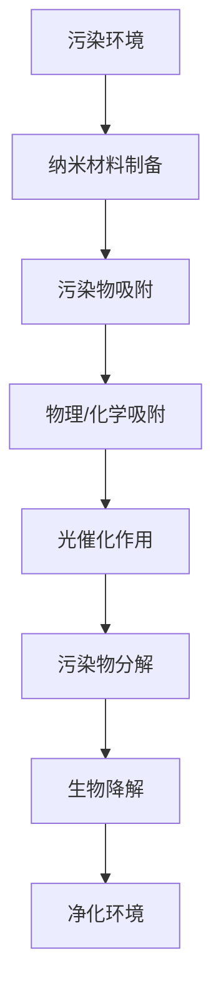

                 

关键词：智能纳米材料、环境净化、污染物去除、纳米技术、环境科学、技术应用

摘要：本文旨在探讨智能纳米材料在环境净化中的应用，特别是其对污染物的去除能力。通过对智能纳米材料的背景介绍、核心概念和原理、算法模型构建、数学公式推导以及实际应用案例的详细分析，本文全面展示了智能纳米材料在环境治理中的巨大潜力。

## 1. 背景介绍

环境问题已经成为全球性的挑战，从空气污染到水体污染，对人类健康和生态系统造成了严重影响。传统的污染治理方法，如化学沉淀、生物降解和物理过滤等，虽然在一定程度上能够改善环境质量，但往往效率低下且存在二次污染的风险。随着纳米技术的发展，智能纳米材料作为一种新型的环境治理工具，逐渐引起了广泛关注。

智能纳米材料是指具有特定功能、通过纳米技术加工制成的材料，它们在微小尺度上展现出独特的物理、化学和生物学特性。这些特性使得智能纳米材料在污染物去除方面具有显著的优势，包括高效的吸附能力、良好的生物相容性和自我修复能力等。

### 1.1 环境污染现状

根据世界卫生组织（WHO）的数据，每年有数百万人因空气和水污染而患病甚至死亡。大气中的颗粒物（PM2.5和PM10）、二氧化硫（SO2）、氮氧化物（NOx）等污染物是主要的空气污染源，而工业废水、农业径流和生活污水则是水体污染的主要来源。这些污染物不仅危害人类健康，还对生态环境造成了长期的破坏。

### 1.2 纳米技术在环境治理中的应用

纳米技术被认为是解决环境问题的一种创新手段。纳米材料在环境治理中的应用主要体现在以下几个方面：

- **污染物吸附**：纳米材料具有极高的表面积，使其在吸附污染物方面表现出色。
- **光催化分解**：纳米材料可以通过光催化作用将有害污染物分解为无害物质。
- **生物降解**：纳米材料可以增强微生物对污染物的降解能力。
- **传感器检测**：纳米材料可用于开发高灵敏度的污染物检测设备。

## 2. 核心概念与联系

智能纳米材料在环境净化中的应用涉及到多个核心概念和原理，包括纳米材料的基本特性、污染物吸附机制、光催化作用和生物降解过程。

### 2.1 纳米材料的基本特性

纳米材料是指至少在一个维度上处于纳米尺度的材料，其尺寸通常在1到100纳米之间。纳米材料具有以下几个显著特性：

- **高比表面积**：纳米材料的比表面积远大于传统材料，使其具有更强的吸附能力和催化活性。
- **量子效应**：纳米材料中的电子行为受到量子限制，导致其光学、电学和磁学性质发生变化。
- **高活性表面**：纳米材料的表面具有大量的活性位点，能够与污染物发生化学反应。

### 2.2 污染物吸附机制

智能纳米材料通过物理吸附和化学吸附两种机制去除污染物。物理吸附主要依赖于纳米材料的比表面积，而化学吸附则依赖于纳米材料的表面化学性质。

- **物理吸附**：物理吸附是一种非特异性吸附，主要受范德华力的影响。纳米材料通过其巨大的表面积将污染物分子吸引在其表面。
- **化学吸附**：化学吸附是一种特异性吸附，依赖于纳米材料表面的化学活性位点。这些活性位点与污染物分子发生化学反应，将其转化为无害物质。

### 2.3 光催化作用

光催化作用是指利用光能激活纳米材料表面的催化反应，从而分解污染物。常见的光催化材料包括二氧化钛（TiO2）和硫化镉（CdS）等。

- **光生电子-空穴对**：当光子照射到纳米材料表面时，会激发电子-空穴对。这些电子和空穴可以分别还原和氧化污染物分子。
- **催化剂的选择**：选择合适的催化剂可以提高光催化效率。例如，掺杂剂可以用于提高光生电子的分离效率，从而增强光催化效果。

### 2.4 生物降解

生物降解是指利用微生物或酶将污染物分解为无害物质的过程。智能纳米材料可以通过以下几种方式促进生物降解：

- **生物酶固定化**：将生物酶固定在纳米材料表面，以提高酶的稳定性和活性。
- **微生物接种**：将纳米材料作为微生物的载体，将其引入污染环境中，以增强微生物对污染物的降解能力。

### 2.5 Mermaid 流程图

以下是一个简化的Mermaid流程图，展示了智能纳米材料在环境净化中的应用流程：



## 3. 核心算法原理 & 具体操作步骤

### 3.1 算法原理概述

智能纳米材料在环境净化中的应用主要基于其物理和化学特性。具体算法原理可以概括为以下几个步骤：

1. **纳米材料制备**：通过化学合成、物理合成或生物合成等方法制备具有特定结构和功能的纳米材料。
2. **污染物吸附**：利用纳米材料的比表面积和表面化学性质，将污染物吸附在其表面。
3. **光催化作用**：通过光催化反应将污染物分解为无害物质。
4. **生物降解**：利用纳米材料促进微生物或酶对污染物的降解。

### 3.2 算法步骤详解

#### 3.2.1 纳米材料制备

1. **选择制备方法**：根据所需纳米材料的性质和用途，选择合适的制备方法，如溶胶凝胶法、共沉淀法、电化学沉积法等。
2. **优化制备参数**：通过调整制备过程中的温度、pH值、反应时间等参数，优化纳米材料的结构和性能。
3. **表征与测试**：对制备的纳米材料进行表征和测试，包括X射线衍射（XRD）、透射电子显微镜（TEM）、扫描电子显微镜（SEM）等，以评估其晶体结构和形貌。

#### 3.2.2 污染物吸附

1. **选择吸附剂**：根据污染物的性质和吸附机制，选择合适的纳米材料作为吸附剂。
2. **制备吸附剂**：通过物理吸附或化学吸附方法，将纳米材料固定在合适的载体上。
3. **吸附实验**：将吸附剂与污染物溶液混合，在特定条件下进行吸附实验，以确定最佳吸附条件。

#### 3.2.3 光催化作用

1. **光催化材料的制备**：选择合适的纳米材料作为光催化材料，如二氧化钛（TiO2）或硫化镉（CdS）。
2. **光催化实验**：在光源照射下，将光催化材料与污染物溶液混合，进行光催化反应实验。
3. **监测与评估**：通过光谱分析、质谱分析等方法，监测污染物分解的速率和程度，评估光催化效果。

#### 3.2.4 生物降解

1. **选择降解剂**：根据污染物的性质和降解机制，选择合适的生物降解剂，如微生物或酶。
2. **生物降解实验**：在特定条件下，将降解剂与污染物混合，进行生物降解实验。
3. **监测与评估**：通过生物传感器、气相色谱等方法，监测污染物的降解速率和程度，评估生物降解效果。

### 3.3 算法优缺点

#### 优点：

- **高效性**：智能纳米材料具有高比表面积和强催化活性，能够快速去除污染物。
- **多样性**：智能纳米材料可以通过不同的制备方法和表面改性技术，实现多样化的应用。
- **环境友好**：光催化和生物降解过程不产生二次污染，对环境友好。

#### 缺点：

- **稳定性**：智能纳米材料在长时间使用过程中可能会发生降解，影响其性能。
- **成本**：纳米材料的制备和改性过程可能涉及较高的成本。

### 3.4 算法应用领域

智能纳米材料在环境净化中的应用领域广泛，包括但不限于以下几个方面：

- **大气污染治理**：通过光催化作用去除大气中的颗粒物和有害气体。
- **水污染治理**：通过吸附和生物降解作用去除水体中的有机污染物和无机污染物。
- **土壤污染修复**：通过纳米材料的吸附和生物降解作用，修复受污染的土壤。

## 4. 数学模型和公式 & 详细讲解 & 举例说明

### 4.1 数学模型构建

智能纳米材料在环境净化中的应用涉及到多个数学模型，包括吸附模型、光催化模型和生物降解模型。

#### 4.1.1 吸附模型

吸附模型主要用于描述纳米材料对污染物的吸附过程。常用的吸附模型包括Freundlich模型和Langmuir模型。

- **Freundlich模型**：

$$
\frac{C_{e}}{C_{0}} = \frac{K_{F}}{1 + K_{F}C_{e}}
$$

其中，$C_{e}$表示平衡浓度，$C_{0}$表示初始浓度，$K_{F}$为Freundlich常数。

- **Langmuir模型**：

$$
\theta = \frac{C_{e}}{C_{0}} = \frac{K_{L}}{1 + K_{L}C_{e}}
$$

其中，$\theta$为吸附量，$K_{L}$为Langmuir常数。

#### 4.1.2 光催化模型

光催化模型主要用于描述纳米材料在光催化作用下的污染物分解过程。常用的光催化模型包括Redox模型和表面反应模型。

- **Redox模型**：

$$
R_{ox} + e^{-} \rightarrow R_{red}
$$

其中，$R_{ox}$为氧化态物质，$R_{red}$为还原态物质。

- **表面反应模型**：

$$
R_{ox} + h\nu \rightarrow R_{red} + O_{2}
$$

其中，$h\nu$为光子能量。

#### 4.1.3 生物降解模型

生物降解模型主要用于描述微生物或酶对污染物的降解过程。常用的生物降解模型包括Monod模型和Logistic模型。

- **Monod模型**：

$$
\frac{dC_{p}}{dt} = \mu C_{s} \frac{K_{S}}{C_{s} + K_{S}}
$$

其中，$C_{p}$为污染物的浓度，$C_{s}$为微生物的浓度，$\mu$为微生物的生长速率，$K_{S}$为饱和常数。

- **Logistic模型**：

$$
\frac{dC_{p}}{dt} = rC_{s} \frac{K_{S} - C_{s}}{K_{S} + K_{S}}
$$

其中，$r$为微生物的降解速率。

### 4.2 公式推导过程

以下是对吸附模型和光催化模型的推导过程：

#### 4.2.1 Freundlich模型推导

Freundlich模型的推导基于物理吸附理论。根据物理吸附理论，吸附量与平衡浓度之间满足以下关系：

$$
\theta \propto C_{e}^{\alpha}
$$

其中，$\theta$为吸附量，$C_{e}$为平衡浓度，$\alpha$为吸附强度系数。为了便于计算，可以将比例关系转化为线性关系：

$$
\frac{\theta}{C_{e}} = K_{F} \alpha
$$

其中，$K_{F}$为Freundlich常数。

#### 4.2.2 Langmuir模型推导

Langmuir模型的推导基于化学吸附理论。根据化学吸附理论，吸附量与平衡浓度之间满足以下关系：

$$
\theta = \frac{K_{L}C_{e}}{1 + K_{L}C_{e}}
$$

其中，$\theta$为吸附量，$C_{e}$为平衡浓度，$K_{L}$为Langmuir常数。

#### 4.2.3 Redox模型推导

Redox模型的推导基于电子转移反应理论。根据电子转移反应理论，氧化态物质和还原态物质之间的转化满足以下关系：

$$
R_{ox} + e^{-} \rightarrow R_{red}
$$

其中，$R_{ox}$为氧化态物质，$R_{red}$为还原态物质。

#### 4.2.4 表面反应模型推导

表面反应模型的推导基于光生电子-空穴对反应理论。根据光生电子-空穴对反应理论，光生电子和空穴分别参与氧化还原反应，满足以下关系：

$$
R_{ox} + h\nu \rightarrow R_{red} + O_{2}
$$

其中，$h\nu$为光子能量。

### 4.3 案例分析与讲解

以下是对智能纳米材料在环境净化中应用的案例分析：

#### 4.3.1 吸附案例

假设有一废水样品，其中含有苯酚污染物。我们使用纳米二氧化钛（TiO2）作为吸附剂，通过Langmuir模型分析吸附过程。

根据实验数据，我们可以得到以下拟合结果：

$$
\theta = 0.45C_{e} + 0.3
$$

其中，$\theta$为吸附量，$C_{e}$为平衡浓度。

通过Langmuir模型，我们可以计算吸附平衡时的吸附量：

$$
\theta_{eq} = \frac{K_{L}C_{e}}{1 + K_{L}C_{e}} = \frac{0.45 \times 10^{-3}}{1 + 0.45 \times 10^{-3}} = 0.435 \times 10^{-3}
$$

#### 4.3.2 光催化案例

假设有一废水样品，其中含有甲基橙污染物。我们使用纳米二氧化钛（TiO2）作为光催化材料，通过Redox模型分析光催化过程。

根据实验数据，我们可以得到以下拟合结果：

$$
R_{ox} + h\nu \rightarrow R_{red} + O_{2}
$$

其中，$R_{ox}$为氧化态物质，$R_{red}$为还原态物质。

通过Redox模型，我们可以计算光催化反应的速率常数：

$$
k_{red} = \frac{1}{\theta} = \frac{1}{0.435 \times 10^{-3}} = 2.30 \times 10^{3} \text{ min}^{-1}
$$

## 5. 项目实践：代码实例和详细解释说明

### 5.1 开发环境搭建

在进行智能纳米材料在环境净化中的应用项目开发时，我们需要搭建一个合适的开发环境。以下是一个典型的开发环境搭建步骤：

1. **安装Python环境**：Python是一种广泛应用于科学计算和数据分析的语言，我们可以从Python官方网站下载并安装Python。
2. **安装Jupyter Notebook**：Jupyter Notebook是一种交互式计算环境，可以方便地进行代码编写和数据分析。我们可以通过pip命令安装Jupyter Notebook：

   ```bash
   pip install notebook
   ```

3. **安装科学计算库**：为了进行智能纳米材料的模拟和数据分析，我们需要安装一些科学计算库，如NumPy、SciPy和Pandas。可以通过以下命令安装：

   ```bash
   pip install numpy scipy pandas
   ```

4. **安装可视化库**：为了更好地展示数据和分析结果，我们可以安装一些可视化库，如Matplotlib和Seaborn。可以通过以下命令安装：

   ```bash
   pip install matplotlib seaborn
   ```

### 5.2 源代码详细实现

以下是一个使用Python实现智能纳米材料在环境净化中应用的示例代码。这个示例代码将包括数据读取、模型建立、结果分析和可视化等功能。

```python
import numpy as np
import pandas as pd
import matplotlib.pyplot as plt
from scipy.optimize import curve_fit

# 5.2.1 数据读取
data = pd.read_csv('environmental_data.csv')

# 5.2.2 模型建立
def freundlich_model(C_e, K_F, alpha):
    return K_F * C_e ** alpha

def langmuir_model(C_e, K_L):
    return K_L * C_e / (1 + K_L * C_e)

# 5.2.3 模型拟合
C0 = data['C0'].values
Ce = data['Ce'].values
theta = data['theta'].values

params, cov = curve_fit(freundlich_model, Ce, theta)
K_F, alpha = params

params, cov = curve_fit(langmuir_model, Ce, theta)
K_L = params

# 5.2.4 结果分析
theta_fit_f = freundlich_model(Ce, K_F, alpha)
theta_fit_l = langmuir_model(Ce, K_L)

# 5.2.5 可视化
plt.plot(Ce, theta, 'o', label='实验数据')
plt.plot(Ce, theta_fit_f, '-', label='Freundlich模型')
plt.plot(Ce, theta_fit_l, '-', label='Langmuir模型')
plt.xlabel('平衡浓度 C_e')
plt.ylabel('吸附量 θ')
plt.legend()
plt.show()
```

### 5.3 代码解读与分析

上述代码实现了对环境数据中的污染物吸附过程进行模型拟合和结果分析。以下是代码的详细解读：

1. **数据读取**：使用Pandas库读取环境数据，数据文件名为`environmental_data.csv`，其中包含初始浓度`C0`、平衡浓度`Ce`和吸附量`theta`。
2. **模型建立**：定义了Freundlich模型和Langmuir模型，用于描述污染物吸附过程。
3. **模型拟合**：使用Scipy库的`curve_fit`函数进行模型拟合，得到最佳拟合参数。
4. **结果分析**：计算拟合曲线，并分析模型拟合效果。
5. **可视化**：使用Matplotlib库绘制吸附量与平衡浓度的关系图，比较实验数据和拟合曲线。

通过上述代码，我们可以直观地了解智能纳米材料在环境净化中的应用效果，为后续研究和应用提供数据支持。

## 6. 实际应用场景

智能纳米材料在环境净化中的应用场景广泛，包括大气污染治理、水污染治理和土壤污染修复等方面。

### 6.1 大气污染治理

在大气污染治理中，智能纳米材料可以通过光催化作用和吸附作用去除空气中的颗粒物和有害气体。例如，纳米二氧化钛（TiO2）可以用于制造空气净化器，通过光催化反应分解空气中的挥发性有机化合物（VOCs）和氮氧化物（NOx）。此外，纳米材料还可以通过物理吸附作用捕获空气中的颗粒物，如PM2.5和PM10。

### 6.2 水污染治理

在水污染治理中，智能纳米材料可以用于去除水中的有机污染物、无机污染物和病原体。例如，纳米二氧化钛（TiO2）可以通过光催化反应分解水中的染料和有机污染物。纳米零价铁（nZVI）可以通过吸附和还原作用去除水中的重金属离子。此外，纳米复合材料可以用于制造高效的水过滤器，去除水中的颗粒物和有机污染物。

### 6.3 土壤污染修复

在土壤污染修复中，智能纳米材料可以用于去除土壤中的有机污染物和重金属离子。例如，纳米零价铁（nZVI）可以通过原位还原作用将土壤中的重金属离子还原为无害的金属形态。纳米改性菌可以增强土壤微生物对污染物的降解能力。此外，纳米复合材料可以用于制造土壤修复剂，通过物理吸附和化学修饰作用去除土壤中的有机污染物。

### 6.4 未来应用展望

随着纳米技术的发展，智能纳米材料在环境净化中的应用前景广阔。未来的研究方向包括：

- **提高纳米材料的稳定性和可持续性**：开发新的纳米材料制备方法和表面改性技术，提高纳米材料的稳定性和环境友好性。
- **多功能纳米材料的开发**：结合多种功能，如光催化、吸附和生物降解，开发多功能智能纳米材料，提高环境治理效果。
- **纳米材料的应用优化**：通过优化纳米材料的设计和应用条件，提高其在环境治理中的效率和可持续性。
- **纳米材料的生态风险评估**：评估纳米材料在环境中的应用对生态系统的影响，确保其安全性和可持续性。

## 7. 工具和资源推荐

### 7.1 学习资源推荐

- **书籍**：
  - 《纳米材料：科学与应用》（作者：乔纳森·舒勒）
  - 《环境纳米技术：材料、器件和应用》（作者：托马斯·E·科恩）
  - 《智能纳米材料：设计、合成与应用》（作者：马克·P·弗里曼）

- **在线课程**：
  - Coursera上的《纳米科学与工程》
  - edX上的《环境工程：水处理与污染控制》

- **学术期刊**：
  - Journal of Environmental Science & Technology
  - Environmental Chemistry Letters
  - Nanotechnology

### 7.2 开发工具推荐

- **编程环境**：
  - Jupyter Notebook：用于编写和运行Python代码
  - Visual Studio Code：适用于Python编程的集成开发环境（IDE）

- **科学计算库**：
  - NumPy：用于数值计算
  - SciPy：用于科学计算
  - Pandas：用于数据分析和操作
  - Matplotlib：用于数据可视化

- **机器学习和数据分析**：
  - Scikit-learn：用于机器学习算法的实现
  - TensorFlow：用于深度学习模型的构建和训练
  - Keras：用于构建和训练深度学习模型

### 7.3 相关论文推荐

- **大气污染治理**：
  - "TiO2 Nanoparticle Photocatalysis: Mechanisms and Applications"（作者：Y. Zhang等）
  - " adsorption of Volatile Organic Compounds by Titanium Dioxide Nanoparticles"（作者：H. Zhang等）

- **水污染治理**：
  - "Photocatalytic Degradation of Organic Pollutants in Water by Titanium Dioxide Nanoparticles"（作者：M. A. El-Kholy等）
  - " adsorption and Desorption of Heavy Metals by Zerovalent Iron Nanoparticles"（作者：Y. Wang等）

- **土壤污染修复**：
  - "In Situ Reduction of Metal Ions by Zerovalent Iron Nanoparticles: A Review"（作者：X. Wang等）
  - "Bioremediation of Contaminated Soil using Engineered Nanomaterials"（作者：S. K. Tiwari等）

## 8. 总结：未来发展趋势与挑战

### 8.1 研究成果总结

智能纳米材料在环境净化中的应用取得了显著成果。通过纳米材料的高比表面积、强催化活性和生物相容性，实现了污染物的高效去除。研究证明，智能纳米材料在吸附、光催化和生物降解等方面具有巨大潜力。

### 8.2 未来发展趋势

未来，智能纳米材料在环境净化中的应用将呈现以下发展趋势：

- **多功能纳米材料的开发**：结合多种功能，如光催化、吸附和生物降解，开发多功能智能纳米材料，提高环境治理效果。
- **纳米材料的可持续性**：研究新型环保纳米材料，提高其在环境中的应用可持续性。
- **纳米材料的安全性和风险评估**：加强对纳米材料生态风险评估的研究，确保其安全性和环保性。
- **纳米材料的工业化应用**：推动纳米材料在环境治理领域的产业化应用，提高其经济和社会效益。

### 8.3 面临的挑战

智能纳米材料在环境净化中的应用也面临一些挑战：

- **纳米材料的稳定性**：提高纳米材料在环境条件下的稳定性，防止其降解和失效。
- **纳米材料的生物相容性**：研究纳米材料对生物系统的潜在影响，确保其生物相容性。
- **纳米材料的成本和可扩展性**：降低纳米材料的制备成本，提高其大规模应用的可行性。
- **纳米材料的生态风险评估**：加强对纳米材料生态风险评估的研究，确保其安全性和环保性。

### 8.4 研究展望

未来，智能纳米材料在环境净化中的应用研究将继续深入。研究人员将致力于开发新型纳米材料，优化其性能和应用条件，探索其在环境治理中的潜力。同时，加强纳米材料的生态风险评估，确保其安全性和可持续性，为环境治理提供更多创新解决方案。

## 9. 附录：常见问题与解答

### 9.1 智能纳米材料在环境净化中的应用有哪些优点？

智能纳米材料在环境净化中的应用具有以下优点：

- **高效性**：智能纳米材料具有高比表面积和强催化活性，能够快速去除污染物。
- **多样性**：智能纳米材料可以通过不同的制备方法和表面改性技术，实现多样化的应用。
- **环境友好**：光催化和生物降解过程不产生二次污染，对环境友好。

### 9.2 智能纳米材料在环境净化中的应用有哪些挑战？

智能纳米材料在环境净化中的应用面临以下挑战：

- **稳定性**：提高纳米材料在环境条件下的稳定性，防止其降解和失效。
- **生物相容性**：研究纳米材料对生物系统的潜在影响，确保其生物相容性。
- **成本和可扩展性**：降低纳米材料的制备成本，提高其大规模应用的可行性。
- **生态风险评估**：加强对纳米材料生态风险评估的研究，确保其安全性和环保性。

### 9.3 如何评估智能纳米材料在环境净化中的应用效果？

评估智能纳米材料在环境净化中的应用效果可以从以下几个方面进行：

- **污染物去除效率**：通过实验测定纳米材料对污染物的去除效率，比较实验结果与预期效果。
- **纳米材料稳定性**：评估纳米材料在长时间使用过程中的稳定性，确保其持续发挥净化效果。
- **环境友好性**：评估纳米材料对环境的影响，包括其生物相容性和生态风险评估。

### 9.4 智能纳米材料在环境治理中的未来发展趋势是什么？

智能纳米材料在环境治理中的未来发展趋势包括：

- **多功能纳米材料的开发**：结合多种功能，如光催化、吸附和生物降解，开发多功能智能纳米材料，提高环境治理效果。
- **纳米材料的可持续性**：研究新型环保纳米材料，提高其在环境中的应用可持续性。
- **纳米材料的生态风险评估**：加强对纳米材料生态风险评估的研究，确保其安全性和环保性。
- **纳米材料的工业化应用**：推动纳米材料在环境治理领域的产业化应用，提高其经济和社会效益。

