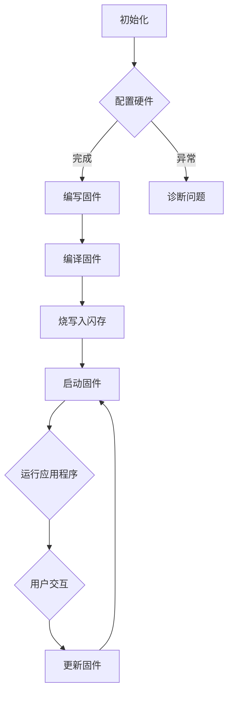

                 

关键词：智能设备、嵌入式系统、微控制器、编程、算法、数学模型、项目实践、工具和资源

> 摘要：本文深入探讨了智能设备和嵌入式系统的微控制器编程。首先介绍了微控制器编程的背景和重要性，随后详细讲解了微控制器的核心概念和架构，包括其硬件和软件组成。接着，文章介绍了微控制器编程的核心算法原理和具体操作步骤，分析了算法的优缺点以及应用领域。随后，文章通过数学模型和公式详细讲解了相关概念，并进行了案例分析与讲解。此外，文章提供了实际的代码实例，对开发环境搭建、源代码实现、代码解读与分析以及运行结果展示进行了详细解释。最后，文章讨论了实际应用场景，并展望了未来的发展趋势与挑战。

## 1. 背景介绍

随着科技的快速发展，智能设备和嵌入式系统已经成为现代生活中不可或缺的一部分。从智能家居到工业自动化，从消费电子到医疗设备，嵌入式系统正渗透到我们生活的各个方面。而微控制器（Microcontroller Unit，简称MCU）作为嵌入式系统的核心组成部分，承担了实现各种复杂功能的重任。微控制器编程作为嵌入式系统开发的关键环节，其重要性不言而喻。

在嵌入式系统开发中，程序员需要具备微控制器编程的能力，以便能够有效地设计和实现智能设备和嵌入式系统的功能。微控制器编程涉及到硬件和软件的紧密结合，需要理解微控制器的架构、指令集、寄存器以及编程语言等基本概念。此外，微控制器编程还需要掌握各种算法和数学模型，以优化系统性能和降低功耗。

本文旨在为嵌入式系统开发者和程序员提供一份全面而深入的指南，帮助他们更好地理解微控制器编程的核心概念、算法原理、数学模型和项目实践，从而提高他们的开发技能和效率。

## 2. 核心概念与联系

### 2.1 微控制器的定义和作用

微控制器是一种集成电路芯片，集成了中央处理器（CPU）、内存（RAM）、闪存（ROM）、定时器/计数器、并行接口、串行通信接口以及其他外设接口等。它是一种高度集成的微型计算机系统，专门用于控制各种电子设备和系统。

微控制器的主要作用是实现嵌入式系统的功能，包括数据采集、控制执行、通信处理、人机交互等。通过编程，微控制器可以实现对外部环境的实时响应和处理，从而实现智能设备的自主运行。

### 2.2 微控制器的架构

微控制器的架构可以分为硬件和软件两部分。

#### 硬件架构

1. **中央处理器（CPU）**：微控制器的核心，负责执行指令和处理数据。
2. **内存（Memory）**：包括随机存取存储器（RAM）和只读存储器（ROM）。RAM用于存储程序运行时的数据和变量，ROM用于存储固件和程序代码。
3. **外设接口**：包括并行接口、串行通信接口、定时器/计数器、ADC（模数转换器）、DAC（数模转换器）等，用于与外部设备进行数据交换和控制。
4. **电源管理**：包括电源电压监控、电池充电管理等功能。

#### 软件架构

1. **操作系统**：对于一些复杂的嵌入式系统，可能需要使用嵌入式操作系统（RTOS）来管理和调度任务、资源以及通信。
2. **固件和应用程序**：固件通常存储在ROM中，用于初始化硬件和提供基本的系统功能。应用程序则存储在RAM中，负责实现具体的功能和业务逻辑。

### 2.3 微控制器编程的核心概念

微控制器编程涉及以下核心概念：

1. **指令集**：微控制器支持的指令集，包括数据操作指令、控制指令、I/O操作指令等。
2. **寄存器**：微控制器内部的寄存器，用于存储数据和控制信息。常见的寄存器包括累加器、程序计数器、状态寄存器等。
3. **编程语言**：用于编写微控制器程序的编程语言，如汇编语言、C语言、C++等。汇编语言接近机器语言，更易于理解硬件操作。C语言和C++则提供了更高的抽象层次，便于编写复杂的应用程序。

### 2.4 Mermaid 流程图

以下是一个简化的微控制器编程流程图：



## 3. 核心算法原理 & 具体操作步骤

### 3.1 算法原理概述

在嵌入式系统开发中，算法起着至关重要的作用。一个高效的算法可以显著提高系统性能和响应速度，同时降低功耗。以下是几个常见的嵌入式系统算法：

1. **排序算法**：用于对数据进行排序，如快速排序、归并排序等。
2. **查找算法**：用于在数据结构中查找特定数据，如二分查找、哈希查找等。
3. **滤波算法**：用于去除信号中的噪声，如低通滤波、高通滤波等。
4. **控制算法**：用于实现闭环控制，如PID控制、模糊控制等。

### 3.2 算法步骤详解

以快速排序算法为例，其基本步骤如下：

1. **选择基准**：从数组中选择一个元素作为基准。
2. **划分**：将数组分为两部分，一部分小于基准，另一部分大于基准。
3. **递归排序**：对小于和大于基准的两部分分别递归执行快速排序。

以下是快速排序算法的具体实现步骤：

```c
void quicksort(int arr[], int low, int high) {
    if (low < high) {
        int pivot = partition(arr, low, high);
        quicksort(arr, low, pivot - 1);
        quicksort(arr, pivot + 1, high);
    }
}

int partition(int arr[], int low, int high) {
    int pivot = arr[high];
    int i = (low - 1);
    for (int j = low; j <= high - 1; j++) {
        if (arr[j] < pivot) {
            i++;
            swap(&arr[i], &arr[j]);
        }
    }
    swap(&arr[i + 1], &arr[high]);
    return (i + 1);
}
```

### 3.3 算法优缺点

快速排序算法具有以下优点：

- **高效**：平均情况下，快速排序的时间复杂度为O(nlogn)。
- **原地排序**：不需要额外的存储空间。

然而，快速排序也存在一些缺点：

- **最坏情况下性能差**：当输入数据已经有序时，快速排序的性能会退化到O(n^2)。
- **递归深度大**：快速排序使用了递归，可能导致栈溢出。

### 3.4 算法应用领域

快速排序算法广泛应用于各种嵌入式系统，如传感器数据处理、通信协议实现、实时操作系统等。此外，快速排序也是通用计算机系统中最常用的排序算法之一。

## 4. 数学模型和公式 & 详细讲解 & 举例说明

### 4.1 数学模型构建

在嵌入式系统开发中，数学模型用于描述系统的行为和性能。一个常见的数学模型是滤波器模型，用于去除信号中的噪声。

假设输入信号为\( x(t) \)，噪声信号为\( n(t) \)，滤波器输出为\( y(t) \)，则滤波器的数学模型可以表示为：

\[ y(t) = x(t) + n(t) \]

### 4.2 公式推导过程

假设滤波器是一个理想低通滤波器，其频率响应为：

\[ H(f) = \begin{cases} 
1 & \text{for } 0 \leq f \leq f_c \\
0 & \text{for } f > f_c 
\end{cases} \]

其中，\( f_c \) 为截止频率。则输出信号 \( y(t) \) 可以表示为：

\[ y(t) = x(t) * H(t) + n(t) * H(t) \]

由于 \( H(t) \) 是理想滤波器的频率响应，我们可以将其转化为时间响应：

\[ y(t) = x(t) * \int_{-\infty}^{\infty} H(f) e^{j2\pi ft} df + n(t) * \int_{-\infty}^{\infty} H(f) e^{j2\pi ft} df \]

由于 \( H(f) \) 只在 \( 0 \leq f \leq f_c \) 有值，我们可以简化积分：

\[ y(t) = x(t) * \int_{0}^{f_c} e^{j2\pi ft} df + n(t) * \int_{0}^{f_c} e^{j2\pi ft} df \]

积分结果为：

\[ y(t) = x(t) * \frac{1}{j2\pi f_c} \sin(2\pi f_c t) + n(t) * \frac{1}{j2\pi f_c} \sin(2\pi f_c t) \]

由于 \( n(t) \) 是噪声信号，其幅值通常较小，可以近似为 \( n(t) \approx 0 \)：

\[ y(t) \approx x(t) * \frac{1}{j2\pi f_c} \sin(2\pi f_c t) \]

### 4.3 案例分析与讲解

假设输入信号为 \( x(t) = \sin(2\pi \times 100t) \)，噪声信号为 \( n(t) = \sin(2\pi \times 50t) \)，截止频率为 \( f_c = 50 \) Hz。

则滤波后的输出信号为：

\[ y(t) = \sin(2\pi \times 100t) * \frac{1}{j2\pi \times 50} \sin(2\pi \times 50t) \]

计算结果为：

\[ y(t) = \sin(2\pi \times 100t) * \frac{1}{j2\pi \times 50} \sin(2\pi \times 50t) = \frac{1}{j2\pi \times 50} \sin(2\pi \times 150t) \]

由于 \( \sin(2\pi \times 150t) \) 的频率为 150 Hz，超出了截止频率 50 Hz，因此输出信号 \( y(t) \) 中将不包含噪声信号 \( \sin(2\pi \times 50t) \)，从而实现了去噪效果。

## 5. 项目实践：代码实例和详细解释说明

### 5.1 开发环境搭建

在进行微控制器编程之前，需要搭建合适的开发环境。以下是一个典型的开发环境搭建步骤：

1. **安装开发工具**：安装微控制器编程工具，如Keil、IAR、STM32CubeIDE等。
2. **选择硬件平台**：选择适合的微控制器硬件平台，如STM32、Arduino等。
3. **连接硬件**：通过USB或串口将微控制器与计算机连接。
4. **安装驱动**：根据硬件平台的文档安装必要的驱动程序。

### 5.2 源代码详细实现

以下是一个简单的微控制器编程示例，实现了一个定时器中断，每隔1秒输出一个字符。

```c
#include <stdio.h>
#include "stm32f1xx_hal.h"

// 定时器初始化
void timer_init(void) {
    TIM_HandleTypeDef htim;
    __HAL_RCC_TIM2_CLK_ENABLE();

    htim.Instance = TIM2;
    htim.Init.Prescaler = 0;
    htim.Init.CounterMode = TIM_COUNTERMODE_UP;
    htim.Init.Period = 1000 - 1; // 定时1秒
    htim.Init.ClockDivision = TIM_CLOCKDIVISION_DIV1;
    htim.Init.RepetitionCounter = 0;

    HAL_TIM_Base_Init(&htim);

    // 启动定时器中断
    HAL_NVIC_SetPriority(TIM2_IRQn, 0, 0);
    HAL_NVIC_EnableIRQ(TIM2_IRQn);
}

// 定时器中断服务程序
void TIM2_IRQHandler(void) {
    if (HAL_TIM_IRQHandler(&htim) == HAL_OK) {
        printf("1\n");
        // 重置定时器计数器
        __HAL_TIM_SET_COUNTER(&htim, 0);
    }
}

int main(void) {
    // 初始化硬件
    HAL_Init();

    // 定时器初始化
    timer_init();

    // 主循环
    while (1) {
        HAL_Delay(1000);
    }
}
```

### 5.3 代码解读与分析

该代码首先初始化定时器，配置定时器的时钟分频、计数值和时钟分频。然后，通过HAL_NVIC_SetPriority和HAL_NVIC_EnableIRQ函数设置和启用定时器中断。

在定时器中断服务程序TIM2_IRQHandler中，每当定时器计数器达到设定值时，中断服务程序会被触发，打印一个字符'1'，并重置定时器计数器。

主循环中，通过HAL_Delay函数实现1秒的延时，从而实现每隔1秒输出一个字符的功能。

### 5.4 运行结果展示

当程序运行时，每隔1秒会在终端输出一个字符'1'，从而实现了定时功能。

## 6. 实际应用场景

### 6.1 家庭自动化

家庭自动化是微控制器编程的一个重要应用场景。通过微控制器，可以实现家庭设备（如灯光、窗帘、安防系统等）的远程控制和管理。例如，使用微控制器控制智能家居设备，可以通过手机APP或语音助手实现远程开关、调节温度、监控安全等。

### 6.2 工业自动化

在工业自动化领域，微控制器广泛应用于各种控制任务，如机器人控制、生产线自动化、设备监控等。微控制器可以实时监测设备状态、控制执行机构、执行自动化操作，从而提高生产效率和质量。

### 6.3 消费电子产品

消费电子产品（如智能手机、平板电脑、智能手表等）中的许多功能都依赖于微控制器。微控制器负责管理硬件资源、处理传感器数据、实现用户交互等。例如，智能手机中的触摸屏、摄像头、GPS等模块都由微控制器控制。

### 6.4 医疗设备

微控制器在医疗设备中也有广泛应用，如监护仪、心电图机、血糖仪等。微控制器可以实时监测患者生理参数，如心率、血压、血糖等，并根据这些数据进行报警、提醒或调整设备参数，从而帮助医生进行诊断和治疗。

## 7. 工具和资源推荐

### 7.1 学习资源推荐

1. **《嵌入式系统设计与开发》**：本书详细介绍了嵌入式系统的基本概念、设计方法、开发流程和实际应用。
2. **《微控制器编程实战》**：通过实际项目案例，介绍了微控制器编程的基本原理和实践方法。
3. **《嵌入式系统嵌入式系统原理及应用》**：涵盖了嵌入式系统的硬件和软件设计，以及实际应用案例。

### 7.2 开发工具推荐

1. **Keil**：是一款功能强大的嵌入式开发工具，支持多种微控制器平台。
2. **IAR Embedded Workbench**：适用于ARM架构的嵌入式开发工具，具有强大的调试功能。
3. **STM32CubeIDE**：ST公司推出的集成开发环境，支持STM32系列微控制器。

### 7.3 相关论文推荐

1. **"Real-Time Systems: Design Principles for Distributed Embedded Applications"**：介绍了实时系统的设计和实现原理。
2. **"Embedded System Design: A Unified Hardware/Software Approach"**：探讨了嵌入式系统的硬件和软件设计方法。
3. **"Designing Embedded Systems with the PIC Microcontroller"**：针对PIC微控制器的嵌入式系统设计方法。

## 8. 总结：未来发展趋势与挑战

### 8.1 研究成果总结

近年来，智能设备和嵌入式系统取得了显著进展。微控制器性能不断提高，功耗降低，应用领域不断拓展。同时，人工智能、物联网等新兴技术也为嵌入式系统的发展带来了新的机遇。研究成果包括高效算法、低功耗设计、智能传感器等技术，为智能设备和嵌入式系统的应用提供了强有力的支持。

### 8.2 未来发展趋势

1. **高性能与低功耗的平衡**：随着物联网和智能设备的普及，嵌入式系统将面临更高的性能和更低的功耗要求。未来研究将致力于在高性能与低功耗之间找到最佳平衡点。
2. **智能化与自主化**：智能设备和嵌入式系统将更加智能化和自主化，具备自主决策、学习和优化能力，实现更加智能和高效的应用。
3. **安全性**：随着网络攻击的增多，嵌入式系统的安全性越来越重要。未来研究将关注嵌入式系统的安全设计和防护措施，确保系统的可靠性和安全性。
4. **定制化和多样化**：嵌入式系统将根据不同应用场景和需求进行定制化和多样化设计，满足不同领域的应用需求。

### 8.3 面临的挑战

1. **复杂度增加**：随着嵌入式系统的功能越来越多，系统的复杂度也在不断增加。如何有效管理和控制系统的复杂度成为一大挑战。
2. **功耗和性能的平衡**：高性能与低功耗的平衡始终是嵌入式系统设计的关键挑战。如何在高性能和低功耗之间找到最佳平衡点仍需深入研究。
3. **安全性**：嵌入式系统的安全性越来越受到关注。如何确保系统的可靠性和安全性，防止网络攻击和数据泄露，是未来研究的重要方向。
4. **系统集成**：嵌入式系统涉及多个学科和技术领域，如何实现不同组件之间的有效集成和协同工作，是嵌入式系统面临的另一个挑战。

### 8.4 研究展望

未来，嵌入式系统将朝着高性能、低功耗、智能化、安全性和系统集成方向发展。针对上述挑战，研究人员可以从以下几个方面展开研究：

1. **算法优化**：研究高效能、低功耗的算法，优化嵌入式系统的性能和功耗。
2. **硬件和软件协同设计**：探索硬件和软件协同设计的方法，提高系统的整体性能和可靠性。
3. **安全设计和防护**：研究嵌入式系统的安全设计和防护措施，确保系统的安全性。
4. **系统集成与优化**：探索嵌入式系统的集成方法和优化策略，实现不同组件之间的高效协同工作。

总之，嵌入式系统作为智能设备和物联网的核心组成部分，具有广阔的应用前景和发展空间。未来，随着科技的不断进步，嵌入式系统将不断推动社会发展和人类生活的智能化。

## 9. 附录：常见问题与解答

### 9.1 如何选择合适的微控制器？

选择合适的微控制器需要考虑以下几个因素：

- **性能要求**：根据应用场景确定所需的处理速度和性能。
- **内存需求**：根据程序和数据的规模确定所需的RAM和ROM。
- **外设接口**：根据功能需求确定所需的外设接口，如ADC、DAC、UART、SPI、I2C等。
- **功耗和成本**：根据电池寿命和成本预算选择合适的微控制器。

### 9.2 如何调试微控制器程序？

调试微控制器程序通常采用以下方法：

- **使用调试工具**：使用集成开发环境（IDE）提供的调试工具，如Keil、IAR等，进行代码调试和调试分析。
- **打印输出**：在程序中添加打印输出（如printf函数），实时查看程序运行状态和变量值。
- **模拟器**：使用模拟器进行代码调试和仿真，模拟实际硬件环境。
- **硬件调试器**：使用硬件调试器（如JTAG、SWD等）进行代码调试和硬件诊断。

### 9.3 如何优化微控制器程序性能？

优化微控制器程序性能可以从以下几个方面进行：

- **算法优化**：选择高效算法，减少计算量和资源消耗。
- **代码优化**：优化代码结构，减少代码长度和执行时间。
- **硬件优化**：利用微控制器的硬件特性，如流水线、寄存器文件等，提高执行效率。
- **内存管理**：合理管理内存，减少内存占用和访问时间。

### 9.4 如何确保微控制器程序的安全性？

确保微控制器程序的安全性可以从以下几个方面进行：

- **代码加密**：对关键代码进行加密，防止未经授权的访问和篡改。
- **访问控制**：限制对关键资源的访问，确保只有授权的用户和程序可以访问。
- **错误处理**：正确处理程序中的错误和异常，防止系统崩溃和恶意攻击。
- **安全更新**：定期更新固件和应用程序，修复已知的安全漏洞。

### 9.5 如何进行嵌入式系统测试和验证？

进行嵌入式系统测试和验证可以采用以下方法：

- **单元测试**：对嵌入式系统的各个模块进行独立测试，确保每个模块功能正常。
- **集成测试**：将各个模块集成到一起进行测试，确保系统整体功能正确。
- **性能测试**：测试嵌入式系统的性能指标，如响应时间、功耗、稳定性等。
- **可靠性测试**：在特定环境下对嵌入式系统进行长时间运行测试，验证系统的稳定性和可靠性。
- **用户测试**：邀请实际用户进行测试，收集用户反馈，改进系统功能和用户体验。

