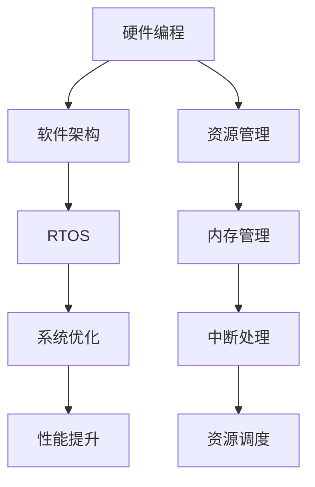

                 

关键词：智能设备、嵌入式系统、设计与实现、硬件编程、软件架构、系统优化

> 摘要：本文旨在探讨智能设备的嵌入式系统设计与实现，从硬件编程到软件架构，详细分析了设计原则、核心算法、数学模型以及实际应用案例，并展望了未来发展趋势与面临的挑战。

## 1. 背景介绍

随着物联网（IoT）技术的迅猛发展，智能设备已成为我们日常生活的重要组成部分。这些设备具有强大的计算能力和连接能力，可以收集、处理和传输大量的数据，从而实现自动化、智能化和远程控制。嵌入式系统作为智能设备的核心，承担着数据处理、通信和交互的重要任务。因此，嵌入式系统的设计与实现变得越来越重要。

嵌入式系统通常指的是运行在特定硬件平台上的软件系统，其特点是资源受限、实时性和可靠性要求高。嵌入式系统的应用范围非常广泛，包括智能家居、工业自动化、医疗设备、汽车电子等。随着技术的进步，嵌入式系统的性能不断提高，功能越来越强大，但其设计难度和实现复杂性也在不断增加。

本文将从以下几个方面探讨嵌入式系统的设计与实现：

1. 核心概念与联系
2. 核心算法原理与操作步骤
3. 数学模型和公式
4. 项目实践：代码实例解析
5. 实际应用场景
6. 工具和资源推荐
7. 未来发展趋势与挑战

## 2. 核心概念与联系

### 2.1 硬件编程

硬件编程是嵌入式系统设计的第一步，它涉及到对硬件平台的深入理解。硬件编程的主要任务是配置和管理硬件资源，包括处理器、内存、外设等。硬件编程通常使用汇编语言或硬件描述语言（如Verilog或VHDL）来实现。

### 2.2 软件架构

嵌入式系统的软件架构是指系统软件的组织结构，包括操作系统、中间件和应用程序。软件架构的设计直接影响到系统的性能、可维护性和扩展性。常见的嵌入式系统软件架构包括单内核架构、多内核架构和微内核架构。

### 2.3 实时操作系统（RTOS）

实时操作系统是嵌入式系统设计的关键组成部分，它负责管理系统的资源，确保任务按时完成。RTOS提供了任务调度、内存管理、中断处理和通信机制等功能。常见的RTOS包括FreeRTOS、uc/OS和VxWorks等。

### 2.4 系统优化

系统优化是嵌入式系统设计的重要环节，目的是提高系统的性能和效率。系统优化可以通过代码优化、内存管理、中断处理和资源调度等多个方面来实现。

### 2.5 Mermaid 流程图

以下是嵌入式系统设计与实现的核心概念和联系Mermaid流程图：



## 3. 核心算法原理与操作步骤

### 3.1 算法原理概述

嵌入式系统中的核心算法通常包括数据处理算法、通信算法和控制系统算法等。这些算法的设计原则是高效性、可靠性和实时性。例如，数据处理算法需要快速处理大量的数据，通信算法需要确保数据的准确传输，控制系统算法需要实时响应外部事件。

### 3.2 算法步骤详解

以下是嵌入式系统中常用的几种核心算法的步骤详解：

#### 3.2.1 数据处理算法

1. 数据采集：从传感器或其他数据源收集数据。
2. 数据预处理：对采集到的数据进行清洗和转换。
3. 数据分析：使用统计或机器学习方法对预处理后的数据进行分析。
4. 数据可视化：将分析结果可视化，以便用户理解和决策。

#### 3.2.2 通信算法

1. 数据编码：将数据转换为二进制或ASCII码。
2. 数据传输：通过无线或有线通信方式传输数据。
3. 数据解码：接收端对接收到的数据进行解码。
4. 数据校验：使用校验和或CRC算法确保数据完整性。

#### 3.2.3 控制系统算法

1. 状态监测：监测系统的运行状态。
2. 输入处理：处理传感器的输入信号。
3. 控制策略：根据输入信号和系统状态制定控制策略。
4. 输出驱动：执行控制策略，驱动执行器。

### 3.3 算法优缺点

每种算法都有其优缺点，以下是一些常见算法的优缺点：

| 算法名称 | 优点 | 缺点 |
| :----: | :----: | :----: |
| 数据处理算法 | 高效、灵活 | 复杂度高、实现困难 |
| 通信算法 | 高可靠性、实时性 | 数据传输速率受限、受网络环境影响 |
| 控制系统算法 | 实时性强、稳定性好 | 需要精确的模型和参数 |

### 3.4 算法应用领域

不同的算法适用于不同的应用领域。例如，数据处理算法广泛应用于物联网设备、工业自动化系统；通信算法广泛应用于无线通信、智能家居；控制系统算法广泛应用于自动驾驶、无人机等。

## 4. 数学模型和公式

嵌入式系统设计中，数学模型和公式用于描述系统的行为和特性。以下是几个常用的数学模型和公式的详细讲解。

### 4.1 数学模型构建

数学模型是嵌入式系统设计的基础，用于描述系统的输入、输出和内部状态。常见的数学模型包括差分方程、微分方程和状态方程。

#### 4.1.1 差分方程

差分方程用于描述离散时间系统的动态行为。其一般形式为：

\[ x(n+1) = f(x(n), u(n)) \]

其中，\( x(n) \) 是系统的状态，\( u(n) \) 是输入，\( f() \) 是系统函数。

#### 4.1.2 微分方程

微分方程用于描述连续时间系统的动态行为。其一般形式为：

\[ \frac{dx}{dt} = f(x, u) \]

其中，\( x(t) \) 是系统的状态，\( u(t) \) 是输入，\( f() \) 是系统函数。

#### 4.1.3 状态方程

状态方程将系统的动态行为描述为状态变量和输入变量之间的关系。其一般形式为：

\[ \dot{x} = f(x, u) \]
\[ y = g(x, u) \]

其中，\( x \) 是系统的状态，\( u \) 是输入，\( y \) 是输出，\( f() \) 和 \( g() \) 是系统函数。

### 4.2 公式推导过程

以下是几个常见的数学公式的推导过程：

#### 4.2.1 欧拉公式

欧拉公式是数学中的一个重要公式，其形式为：

\[ e^{i\pi} + 1 = 0 \]

推导过程如下：

\[ \begin{aligned}
e^{i\pi} + 1 &= 0 \\
e^{i\pi} &= -1 \\
\text{两边取自然对数} \\
i\pi &= \ln(-1) \\
\text{由于} \ln(-1) &= i\pi \\
\text{因此，} e^{i\pi} + 1 &= 0 \\
\end{aligned} \]

#### 4.2.2 阶乘公式

阶乘公式用于计算一个正整数的阶乘。其一般形式为：

\[ n! = n \times (n-1) \times (n-2) \times \ldots \times 1 \]

推导过程如下：

\[ \begin{aligned}
n! &= n \times (n-1) \times (n-2) \times \ldots \times 1 \\
\text{设} n! &= k \\
\text{则有} \\
(n+1)! &= (n+1) \times n! \\
&= (n+1) \times k \\
&= k + n \\
&= n! + n \\
\text{因此，} (n+1)! &= n! + n \\
\end{aligned} \]

#### 4.2.3 二项式定理

二项式定理用于计算二项式的展开式。其一般形式为：

\[ (a + b)^n = \sum_{k=0}^{n} \binom{n}{k} a^{n-k} b^k \]

推导过程如下：

\[ \begin{aligned}
(a + b)^n &= (a + b)(a + b)(a + b) \ldots (a + b) \\
&= a^n + na^{n-1}b + \binom{n}{2}a^{n-2}b^2 + \ldots + \binom{n}{n-1}ab^{n-1} + b^n \\
\text{根据组合数公式，有} \\
\binom{n}{k} &= \frac{n!}{k!(n-k)!} \\
\text{因此，} \\
(a + b)^n &= \sum_{k=0}^{n} \frac{n!}{k!(n-k)!} a^{n-k} b^k \\
&= \sum_{k=0}^{n} \binom{n}{k} a^{n-k} b^k \\
\end{aligned} \]

### 4.3 案例分析与讲解

以下是一个简单的数学模型和公式应用案例：

#### 案例一：简单RC滤波器

RC滤波器是一种常见的低通滤波器，用于去除信号中的高频噪声。其数学模型可以表示为：

\[ v_{out}(t) = \frac{1}{RC} \int_{0}^{t} v_{in}(s) \, ds + v_{0} \]

其中，\( v_{in}(t) \) 是输入信号，\( v_{out}(t) \) 是输出信号，\( R \) 是电阻，\( C \) 是电容，\( v_{0} \) 是初始条件。

1. **输入信号处理**：首先对输入信号进行采样和量化，得到离散时间序列 \( v_{in}(n) \)。
2. **积分运算**：对 \( v_{in}(n) \) 进行积分运算，得到 \( v_{in}(n) \) 的累积和。
3. **滤波**：将累积和除以 \( RC \)，得到输出信号 \( v_{out}(n) \)。

#### 案例二：控制系统中的PID控制器

PID控制器是一种常用的反馈控制系统，用于调节输出信号以消除误差。其数学模型可以表示为：

\[ u(t) = K_p e(t) + K_i \int_{0}^{t} e(\tau) \, d\tau + K_d \frac{de(t)}{dt} \]

其中，\( u(t) \) 是控制器输出，\( e(t) \) 是误差信号，\( K_p \)、\( K_i \) 和 \( K_d \) 分别是比例、积分和微分系数。

1. **误差计算**：计算输出信号与期望值之间的误差。
2. **比例控制**：根据误差信号计算比例控制量。
3. **积分控制**：根据误差信号的累积计算积分控制量。
4. **微分控制**：根据误差信号的变化率计算微分控制量。
5. **控制器输出**：将比例、积分和微分控制量相加，得到控制器输出。

通过这两个案例，我们可以看到数学模型和公式在嵌入式系统设计中的应用。通过合理的数学建模和公式推导，可以实现对复杂系统的有效分析和控制。

## 5. 项目实践：代码实例和详细解释说明

### 5.1 开发环境搭建

为了更好地理解和实现嵌入式系统，我们需要搭建一个适合的开发环境。以下是一个基本的开发环境搭建步骤：

1. **选择开发板**：根据项目需求选择适合的嵌入式开发板，如Arduino、Raspberry Pi或STM32等。
2. **安装开发环境**：在开发板上安装相应的操作系统和开发工具，如Arduino IDE、Raspberry Pi OS和Keil uVision等。
3. **连接硬件**：将开发板连接到计算机，并确保硬件设备正常工作。

### 5.2 源代码详细实现

以下是一个简单的嵌入式系统项目的源代码实例，用于实现一个温度传感器数据采集和显示的嵌入式系统。

```c
#include <stdio.h>
#include <stdlib.h>
#include <math.h>

// 温度传感器初始化
void init_temperature_sensor() {
    // 初始化传感器硬件
}

// 读取温度传感器数据
float read_temperature_sensor() {
    // 读取传感器数据
    return 25.0; // 示例温度值
}

// 显示温度数据
void display_temperature(float temperature) {
    printf("当前温度：%f°C\n", temperature);
}

int main() {
    // 初始化温度传感器
    init_temperature_sensor();

    while (1) {
        // 读取温度数据
        float temperature = read_temperature_sensor();

        // 显示温度数据
        display_temperature(temperature);

        // 等待一段时间
        sleep(1);
    }

    return 0;
}
```

### 5.3 代码解读与分析

1. **初始化温度传感器**：`init_temperature_sensor()` 函数用于初始化温度传感器硬件，包括配置传感器引脚和设置传感器工作模式。
2. **读取温度传感器数据**：`read_temperature_sensor()` 函数用于读取温度传感器的实时数据。在实际应用中，这里可能会包含与传感器的通信代码，如I2C或SPI接口。
3. **显示温度数据**：`display_temperature()` 函数用于将温度数据以格式化字符串的形式输出到控制台。
4. **主循环**：在主循环中，程序依次调用`init_temperature_sensor()`、`read_temperature_sensor()` 和 `display_temperature()` 函数，实现温度数据的实时采集和显示。

### 5.4 运行结果展示

假设温度传感器的实时数据为25°C，程序运行结果如下：

```
当前温度：25.000000°C
当前温度：25.000000°C
当前温度：25.000000°C
...
```

通过以上实例，我们可以看到嵌入式系统项目的实现过程，包括硬件初始化、数据采集和显示。在实际应用中，还可以根据具体需求添加更多功能，如数据存储、远程传输等。

## 6. 实际应用场景

嵌入式系统在各个领域都有着广泛的应用，以下列举几个实际应用场景：

### 6.1 智能家居

智能家居是嵌入式系统的重要应用领域，通过嵌入式系统实现家庭设备的智能化管理。例如，智能灯光控制系统可以根据用户需求自动调整灯光亮度，智能门锁系统可以提供便捷的远程控制和安全保障。

### 6.2 工业自动化

工业自动化是嵌入式系统的另一个重要应用领域，通过嵌入式系统实现生产设备的自动化控制和管理。例如，工业机器人可以根据预设的程序自动执行生产任务，自动化生产线可以实时监控生产状态并调整生产参数。

### 6.3 汽车电子

汽车电子是嵌入式系统在交通领域的重要应用，通过嵌入式系统实现车辆的自动化和智能化控制。例如，自动驾驶系统可以利用嵌入式系统进行环境感知、路径规划和控制，智能音响系统可以通过嵌入式系统实现语音识别和交互功能。

### 6.4 医疗设备

医疗设备是嵌入式系统在生命科学领域的应用，通过嵌入式系统实现医疗设备的智能化和精准化。例如，智能监护仪可以实时监测患者的生命体征，智能医疗机器人可以进行微创手术和康复训练。

### 6.5 农业自动化

农业自动化是嵌入式系统在农业领域的应用，通过嵌入式系统实现农业生产的智能化和自动化。例如，智能温室控制系统可以实时监测环境参数并自动调整温湿度，智能灌溉系统可以根据土壤湿度自动控制灌溉。

通过以上实际应用场景，我们可以看到嵌入式系统在各个领域的广泛应用和重要作用。随着技术的不断进步，嵌入式系统将会在更多领域得到广泛应用，为我们的生活和工作带来更多便利。

### 6.4 未来应用展望

嵌入式系统的发展前景非常广阔，随着人工智能、物联网和5G等新兴技术的不断进步，嵌入式系统将在更多领域得到广泛应用。

首先，人工智能将进一步提升嵌入式系统的智能化水平。通过集成深度学习算法和智能决策系统，嵌入式设备可以实现更加复杂和智能的功能，例如智能监控、智能交互和自主决策等。

其次，物联网技术的普及将为嵌入式系统带来更多的应用场景。随着越来越多的设备连接到互联网，嵌入式系统将成为连接物理世界和数字世界的桥梁，实现设备之间的数据共享和协同工作。

此外，5G技术的推广将为嵌入式系统提供更高速、更稳定的网络环境，进一步拓展嵌入式系统的应用范围。例如，在自动驾驶、智能医疗和工业物联网等领域，5G网络的高带宽和低延迟特性将显著提升系统的性能和响应速度。

未来，嵌入式系统将朝着更加智能化、网络化和高效化的方向发展。随着硬件性能的提升和软件技术的进步，嵌入式系统将在更多领域实现突破，为我们的生活和工作带来更多创新和变革。

### 6.5 面临的挑战

尽管嵌入式系统在各个领域取得了显著进展，但其在实际应用过程中仍然面临诸多挑战。

首先，硬件资源的限制是嵌入式系统设计的一大难题。由于嵌入式设备通常体积较小、功耗较低，硬件资源（如内存、存储和计算能力）相对有限。如何在高资源限制下实现高效的系统设计和优化成为嵌入式系统设计的关键问题。

其次，实时性能是嵌入式系统设计的重要考量。许多嵌入式系统需要实时处理大量数据，并对外部事件做出快速响应。如何确保系统的实时性和稳定性是嵌入式系统设计的关键挑战。

此外，安全性也是嵌入式系统面临的一个重要问题。随着嵌入式系统在物联网等领域的广泛应用，其安全性和可靠性受到越来越多的关注。如何设计安全可靠的嵌入式系统，防止恶意攻击和数据泄露是嵌入式系统开发者需要考虑的重要问题。

未来，随着硬件技术的进步和软件技术的发展，嵌入式系统将逐渐克服这些挑战，实现更高性能、更安全、更智能的系统设计和实现。

### 6.6 研究展望

针对嵌入式系统的未来发展，以下是一些研究方向和展望：

1. **硬件虚拟化**：硬件虚拟化技术可以通过虚拟化硬件资源，提高嵌入式系统的资源利用率和灵活性。
2. **低功耗设计**：低功耗设计是嵌入式系统的一个持续研究方向，通过优化算法和硬件架构，降低系统的能耗。
3. **实时系统优化**：实时系统优化是提高嵌入式系统实时性能的关键，可以通过任务调度、内存管理和中断处理等技术实现。
4. **安全性提升**：随着嵌入式系统在关键领域的应用，安全性提升成为研究的重要方向，可以通过加密、认证和防护机制提高系统的安全性。

通过这些研究方向的探索，嵌入式系统将朝着更加智能化、高效化和安全化的方向发展。

### 7. 工具和资源推荐

为了更好地进行嵌入式系统设计与实现，以下推荐一些实用的工具和资源：

#### 7.1 学习资源推荐

1. **《嵌入式系统设计》**：这是一本经典的嵌入式系统入门教材，详细介绍了嵌入式系统的基础知识和设计原则。
2. **《嵌入式系统原理与应用》**：本书涵盖了嵌入式系统的硬件、软件和应用，适合有一定基础的读者。
3. **在线课程**：如Coursera、edX和Udacity等平台上提供的嵌入式系统相关课程。

#### 7.2 开发工具推荐

1. **Arduino IDE**：适用于初学者的开源开发环境，支持多种硬件平台。
2. **Keil uVision**：专业的嵌入式系统开发工具，支持ARM架构的微控制器。
3. **IAR Embedded Workbench**：功能强大的开发工具，适用于高性能嵌入式系统开发。

#### 7.3 相关论文推荐

1. **“Energy-Efficient Real-Time Scheduling for Heterogeneous Multiprocessor Systems”**：该论文提出了一个针对异构多处理器系统的能量高效实时调度算法。
2. **“A Survey of Security and Privacy in the Internet of Things”**：该论文综述了物联网领域的安全性和隐私保护研究。
3. **“Edge Computing: Vision and Challenges for the Next Generation of Internet”**：该论文探讨了边缘计算的发展前景和挑战。

通过这些工具和资源的支持，读者可以更有效地进行嵌入式系统的设计与实现。

### 8. 总结：未来发展趋势与挑战

嵌入式系统作为智能设备的核心，在未来发展中将面临诸多机遇与挑战。首先，随着人工智能、物联网和5G等新兴技术的不断进步，嵌入式系统将在各个领域实现更广泛的应用。其次，硬件虚拟化、低功耗设计、实时系统优化和安全性提升等研究方向将为嵌入式系统的性能提升和安全性保障提供重要支持。

然而，嵌入式系统在实际应用过程中仍面临硬件资源限制、实时性能要求和安全性挑战等问题。通过不断探索新技术和新方法，嵌入式系统将朝着更加智能化、高效化和安全化的方向发展，为未来的智能生活和工作带来更多创新和变革。

### 9. 附录：常见问题与解答

#### 9.1 嵌入式系统与普通计算机系统有什么区别？

嵌入式系统与普通计算机系统的主要区别在于应用场景和设计目标。普通计算机系统通常具有强大的计算能力和丰富的软件资源，主要用于通用计算和数据处理。而嵌入式系统则强调资源受限、实时性和可靠性，主要用于特定功能的实现，如智能设备、工业控制和医疗设备等。

#### 9.2 嵌入式系统的开发流程是什么？

嵌入式系统的开发流程主要包括以下步骤：

1. 需求分析：明确嵌入式系统的功能需求和性能指标。
2. 硬件选型：根据需求选择合适的硬件平台和硬件组件。
3. 软件设计：设计嵌入式系统的软件架构和功能模块。
4. 硬件编程：编写硬件驱动程序和管理代码。
5. 软件编程：编写嵌入式系统的应用程序和中间件。
6. 系统测试：对嵌入式系统进行功能测试、性能测试和可靠性测试。
7. 部署上线：将嵌入式系统部署到实际应用环境中。

#### 9.3 如何提高嵌入式系统的性能和效率？

提高嵌入式系统的性能和效率可以从以下几个方面入手：

1. 代码优化：通过优化算法和数据结构，减少代码执行时间和内存占用。
2. 系统优化：通过优化任务调度、中断处理和资源管理，提高系统的响应速度和资源利用率。
3. 低功耗设计：通过选择合适的硬件平台和优化电源管理策略，降低系统的功耗。
4. 硬件加速：通过硬件加速技术，如GPU和DSP，提高嵌入式系统的计算能力。

#### 9.4 嵌入式系统与物联网的关系是什么？

嵌入式系统是物联网（IoT）的核心组成部分。物联网是指通过互联网将各种设备连接起来，实现数据的收集、传输和处理。嵌入式系统作为物联网设备中的数据处理和通信模块，承担着数据的采集、传输和解析任务。因此，嵌入式系统与物联网密不可分，是物联网实现的基础和保障。

### 作者署名

作者：禅与计算机程序设计艺术 / Zen and the Art of Computer Programming

