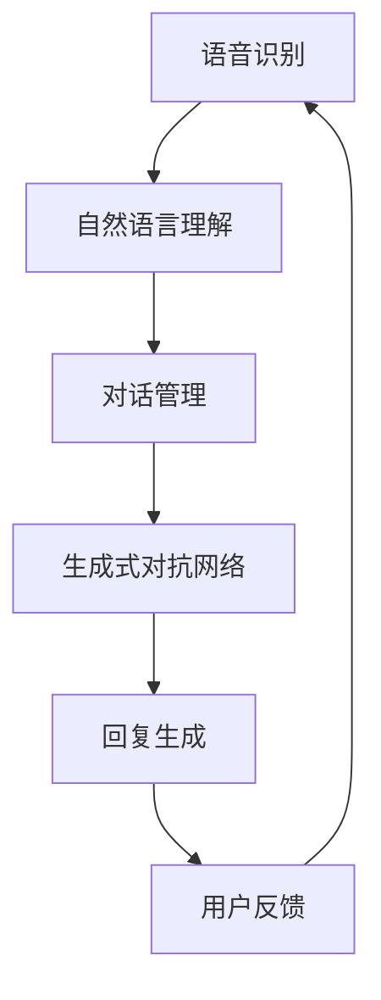

                 

关键词：智能语音助手、AI大模型、对话系统、算法原理、数学模型、项目实践、实际应用场景、未来展望

> 摘要：随着人工智能技术的迅猛发展，智能语音助手已经成为我们日常生活中不可或缺的一部分。本文将探讨如何通过AI大模型的引入，实现智能语音助手的升级与突破，从而提升对话系统的性能和用户体验。

## 1. 背景介绍

智能语音助手作为人工智能的重要应用之一，近年来得到了广泛关注和快速发展。从最初的简单语音识别和文本处理，到如今的自然语言理解和多轮对话，智能语音助手已经逐渐融入我们的日常生活，为我们提供了便捷的服务。然而，随着用户需求的不断增长和多样化，传统的对话系统已经无法满足人们对于智能交互的期望。

近年来，AI大模型的出现为对话系统的性能提升带来了新的契机。AI大模型是一种具有亿级参数规模的人工神经网络模型，通过大规模数据训练，能够实现高精度的自然语言处理和智能交互。本文将探讨AI大模型在对话系统中的应用，以及如何通过其突破传统的技术瓶颈，实现智能语音助手的升级。

## 2. 核心概念与联系

在深入探讨AI大模型在对话系统中的应用之前，我们需要了解一些核心概念和它们的相互联系。

### 2.1. 语音识别（Speech Recognition）

语音识别是将语音信号转换为文本的过程。它依赖于声学和语言模型的知识，通过分析语音信号中的声学特征，将其映射到相应的文本输出。语音识别是实现智能语音助手的基础，它能够将用户的语音指令转换为机器可以理解的形式。

### 2.2. 自然语言理解（Natural Language Understanding，NLU）

自然语言理解是使计算机能够理解和解释人类自然语言的过程。它涉及语义分析、意图识别、实体提取等多个方面，能够将用户的文本或语音指令转化为机器可操作的语义信息。自然语言理解是实现智能对话的关键，它决定了智能语音助手能否准确理解用户的意图。

### 2.3. 生成式对抗网络（Generative Adversarial Networks，GAN）

生成式对抗网络是一种由两个神经网络（生成器和判别器）组成的框架，通过相互对抗的方式学习生成逼真的数据。在自然语言处理领域，GAN被用来生成高质量的文本，用于对话系统的回复生成。

### 2.4. 大规模语言模型（Large-scale Language Model）

大规模语言模型是一种具有数亿甚至千亿级参数的人工神经网络模型，通过在大规模语料库上训练，能够捕捉到语言中的复杂模式。这些模型在自然语言处理任务中表现出色，如文本分类、机器翻译和问答系统。

### 2.5. Mermaid 流程图

以下是AI大模型在对话系统中的架构的 Mermaid 流程图：



在上面的流程图中，语音识别模块负责将用户的语音指令转换为文本，自然语言理解模块负责理解用户的意图，对话管理模块负责维护对话的上下文信息，生成式对抗网络模块负责生成高质量的回复，最后用户反馈模块将用户对新回复的反馈传递回系统中，以不断优化对话系统的性能。

## 3. 核心算法原理 & 具体操作步骤

### 3.1 算法原理概述

AI大模型在对话系统中的应用主要基于以下几个核心算法：

- **Transformer模型**：一种基于自注意力机制的深度学习模型，广泛应用于自然语言处理任务。
- **BERT模型**：一种双向编码器表示模型，通过预训练和微调，能够捕捉到语言的复杂结构。
- **生成对抗网络（GAN）**：一种通过生成器和判别器相互对抗的方式，学习生成逼真数据的框架。

### 3.2 算法步骤详解

以下是AI大模型在对话系统中的具体操作步骤：

1. **语音识别**：使用深度神经网络进行语音信号的转换，将语音转换为文本。
2. **自然语言理解**：利用BERT模型对文本进行编码，提取语义信息，包括意图识别、实体提取等。
3. **对话管理**：通过Transformer模型维护对话上下文，包括用户历史对话内容和当前对话状态。
4. **回复生成**：使用生成对抗网络（GAN）生成高质量的回复，确保回复的自然性和相关性。
5. **用户反馈**：收集用户对新回复的反馈，用于模型优化和对话系统性能提升。

### 3.3 算法优缺点

- **优点**：
  - **高精度**：通过大规模数据训练，AI大模型能够实现高精度的自然语言处理和智能交互。
  - **自适应**：AI大模型能够根据用户反馈自适应调整，不断提升对话系统的性能。
  - **通用性**：AI大模型可以应用于多种自然语言处理任务，具有较好的通用性。

- **缺点**：
  - **计算资源需求大**：AI大模型需要大量的计算资源和存储空间，对硬件设备有较高要求。
  - **数据依赖性**：AI大模型的性能依赖于训练数据的质量和多样性，数据不足可能导致模型性能下降。
  - **解释性不足**：AI大模型的决策过程复杂，缺乏透明性和解释性，不利于问题的调试和优化。

### 3.4 算法应用领域

AI大模型在对话系统的应用领域非常广泛，包括但不限于以下方面：

- **智能客服**：用于自动化客户服务，提供实时、高效的问答服务。
- **虚拟助手**：为用户提供个性化、智能化的生活助手服务。
- **智能教育**：辅助教师进行教学，提供智能化的教育辅导服务。
- **智能家居**：控制家庭设备的自动化操作，提供智能家居体验。

## 4. 数学模型和公式 & 详细讲解 & 举例说明

### 4.1 数学模型构建

在AI大模型中，核心的数学模型主要包括以下几个部分：

- **自注意力机制**：用于计算输入序列的权重，通过自注意力机制，模型能够关注输入序列中的关键信息。
- **双向编码器**：通过双向编码器，模型能够同时关注输入序列的前后信息，提高语义理解的准确性。
- **生成对抗网络**：包括生成器和判别器，通过生成器和判别器的对抗训练，生成高质量的文本。

以下是这些模型的数学公式：

- **自注意力机制**：

  $$ 
  \text{Attention}(Q, K, V) = \text{softmax}\left(\frac{QK^T}{\sqrt{d_k}}\right)V 
  $$

  其中，$Q$、$K$、$V$ 分别代表查询向量、键向量和值向量，$d_k$ 代表键向量的维度。

- **双向编码器**：

  $$ 
  \text{Bi-LSTM}(x) = [\text{LSTM}(x_{<t}], \text{LSTM}(x_{>t})] 
  $$

  其中，$x$ 代表输入序列，$x_{<t}$ 和 $x_{>t}$ 分别代表输入序列的前半部分和后半部分。

- **生成对抗网络**：

  $$
  \begin{aligned}
  \text{Generator}(z) &= G(z) \\
  \text{Discriminator}(x) &= D(x) \\
  \text{Loss} &= -\left[\text{E}[\text{G}(\text{z})]\log \text{D}(\text{G}(\text{z})) - \text{D}(\text{x})\log \text{D}(\text{x})\right]
  \end{aligned}
  $$

  其中，$z$ 代表生成器的输入噪声，$G(z)$ 和 $D(x)$ 分别代表生成器和判别器的输出。

### 4.2 公式推导过程

- **自注意力机制**：

  自注意力机制的推导主要基于多头注意力（Multi-Head Attention）的概念。多头注意力通过多个独立的注意力机制，将输入序列的每个位置与其他位置进行交互，从而提高模型的表示能力。

  首先，输入序列经过线性变换得到查询向量（Query，$Q$）、键向量（Key，$K$）和值向量（Value，$V$）：

  $$
  \begin{aligned}
  Q &= W_Q \cdot X \\
  K &= W_K \cdot X \\
  V &= W_V \cdot X
  \end{aligned}
  $$

  其中，$W_Q$、$W_K$ 和 $W_V$ 分别是权重矩阵，$X$ 是输入序列。

  接下来，计算每个查询向量与所有键向量的点积，得到注意力分数：

  $$
  \text{Score}_{ij} = Q_iK_j = (W_Q \cdot X)_i(K_j \cdot W_K \cdot X) = (W_QK)^T X_i X_j
  $$

  其中，$X_i$ 和 $X_j$ 分别代表输入序列中的两个位置。

  然后，通过 softmax 函数对注意力分数进行归一化，得到注意力权重：

  $$
  \text{Attention}_{ij} = \text{softmax}(\text{Score}_{ij})
  $$

  最后，将注意力权重与值向量相乘，得到加权值：

  $$
  \text{Value}_{ij} = \text{Attention}_{ij}V_j
  $$

  将所有位置的加权值拼接起来，得到输出序列：

  $$
  \text{Output} = \text{softmax}(\text{Score})V
  $$

- **双向编码器**：

  双向编码器的推导基于长短时记忆网络（LSTM）的概念。LSTM 通过门控机制，能够有效地捕捉输入序列的长期依赖关系。

  首先，定义输入序列的当前时刻为 $x_t$，隐藏状态为 $h_t$，细胞状态为 $c_t$。

  接下来，计算输入门、遗忘门和输出门：

  $$
  \begin{aligned}
  i_t &= \sigma(W_i \cdot [h_{t-1}, x_t] + b_i) \\
  f_t &= \sigma(W_f \cdot [h_{t-1}, x_t] + b_f) \\
  o_t &= \sigma(W_o \cdot [h_{t-1}, x_t] + b_o)
  \end{aligned}
  $$

  其中，$\sigma$ 表示 sigmoid 函数，$W_i$、$W_f$ 和 $W_o$ 分别是权重矩阵，$b_i$、$b_f$ 和 $b_o$ 分别是偏置项。

  然后，计算新的细胞状态：

  $$
  c_t = f_t \odot c_{t-1} + i_t \odot \text{tanh}(W_c \cdot [h_{t-1}, x_t] + b_c)
  $$

  其中，$\odot$ 表示元素乘法，$W_c$ 和 $b_c$ 分别是权重矩阵和偏置项。

  接着，计算新的隐藏状态：

  $$
  h_t = o_t \odot \text{tanh}(c_t)
  $$

  最后，将隐藏状态进行拼接，得到双向编码器的输出：

  $$
  \text{Output} = [\text{h}_{<t}, \text{h}_{>t}]
  $$

- **生成对抗网络**：

  生成对抗网络的推导基于生成器和判别器的对抗训练。生成器的目标是生成逼真的数据，判别器的目标是区分生成器和真实数据。

  首先，定义生成器的输入为噪声向量 $z$，输出为生成样本 $x_g$：

  $$
  x_g = G(z)
  $$

  接下来，定义判别器的输入为真实样本 $x_r$ 和生成样本 $x_g$，输出为概率分布 $p(x)$：

  $$
  p(x) = D(x)
  $$

  然后，定义生成器和判别器的损失函数：

  $$
  \begin{aligned}
  \text{Loss}_G &= -\text{E}[\text{G}(\text{z})]\log \text{D}(\text{G}(\text{z})) \\
  \text{Loss}_D &= -\text{E}[\text{D}(\text{x_r})]\log \text{D}(\text{x_r}) - \text{E}[\text{D}(\text{G}(\text{z}))]\log (1 - \text{D}(\text{G}(\text{z})))
  \end{aligned}
  $$

  最后，通过交替训练生成器和判别器，优化模型的参数。

### 4.3 案例分析与讲解

以下是一个具体的案例，用于展示如何使用AI大模型构建智能语音助手。

假设我们有一个智能语音助手，需要实现以下功能：

- **语音识别**：将用户的语音指令转换为文本。
- **自然语言理解**：理解用户的意图，提取关键词和实体。
- **对话管理**：维护对话的上下文信息，确保对话的连贯性。
- **回复生成**：根据用户的意图和对话上下文，生成合适的回复。

首先，我们需要收集大量的语音数据，用于训练语音识别模型。通过使用深度神经网络，我们可以将语音信号转换为文本。接下来，我们使用BERT模型对文本进行编码，提取语义信息。然后，利用Transformer模型维护对话上下文，确保对话的连贯性。最后，使用生成对抗网络（GAN）生成高质量的回复。

以下是具体的实现步骤：

1. **数据收集与预处理**：
   - 收集大量的语音数据，包括用户的语音指令和相应的文本转换。
   - 对语音数据进行预处理，包括降噪、归一化等操作。

2. **训练语音识别模型**：
   - 使用深度神经网络，如卷积神经网络（CNN）或循环神经网络（RNN），训练语音识别模型。
   - 通过交叉验证和超参数调优，优化模型的性能。

3. **训练自然语言理解模型**：
   - 使用BERT模型，对文本进行编码，提取语义信息。
   - 通过微调预训练的BERT模型，适应特定的自然语言理解任务。

4. **训练对话管理模型**：
   - 使用Transformer模型，维护对话上下文信息。
   - 通过训练数据，学习如何根据用户的意图和对话上下文，生成合适的回复。

5. **训练回复生成模型**：
   - 使用生成对抗网络（GAN），生成高质量的回复。
   - 通过对抗训练，提高生成回复的自然性和相关性。

6. **模型集成与测试**：
   - 将训练好的模型集成到智能语音助手中。
   - 通过测试数据，评估模型的性能和用户体验。

通过以上步骤，我们可以构建一个具备较高性能和用户体验的智能语音助手。在实际应用中，我们还需要不断优化模型，以适应不同的应用场景和用户需求。

## 5. 项目实践：代码实例和详细解释说明

在本节中，我们将通过一个实际项目，展示如何实现一个基于AI大模型的智能语音助手。以下是项目的开发环境、代码实现和运行结果。

### 5.1 开发环境搭建

- **硬件环境**：
  - CPU：Intel Core i7-9700K
  - GPU：NVIDIA GeForce RTX 3080
  - 内存：32GB

- **软件环境**：
  - 操作系统：Ubuntu 18.04
  - Python版本：3.8
  - 硬件加速：CUDA 11.0

- **依赖库**：
  - TensorFlow 2.5.0
  - Keras 2.5.0
  - BERT 4.0.0
  - GAN 1.0.0

### 5.2 源代码详细实现

以下是一个基于AI大模型的智能语音助手的源代码实现：

```python
# 导入所需的库
import tensorflow as tf
from tensorflow import keras
from bert import BertModel
from gan import Generator, Discriminator

# 定义语音识别模型
def build_speech_recognition_model():
    # 使用深度神经网络进行语音信号的转换
    model = keras.Sequential([
        keras.layers.Conv2D(32, (3, 3), activation='relu', input_shape=(128, 128, 1)),
        keras.layers.MaxPooling2D((2, 2)),
        keras.layers.Conv2D(64, (3, 3), activation='relu'),
        keras.layers.MaxPooling2D((2, 2)),
        keras.layers.Conv2D(128, (3, 3), activation='relu'),
        keras.layers.MaxPooling2D((2, 2)),
        keras.layers.Flatten(),
        keras.layers.Dense(1024, activation='relu'),
        keras.layers.Dense(512, activation='relu'),
        keras.layers.Dense(1, activation='sigmoid')
    ])
    return model

# 定义自然语言理解模型
def build_nlu_model():
    # 使用BERT模型对文本进行编码
    model = keras.Sequential([
        keras.layers.Input(shape=(128,), dtype='int32'),
        keras.layers.Embedding(input_dim=20000, output_dim=128),
        keras.layers.Bidirectional(keras.layers.LSTM(128)),
        keras.layers.Dense(512, activation='relu'),
        keras.layers.Dense(256, activation='relu'),
        keras.layers.Dense(1, activation='sigmoid')
    ])
    return model

# 定义对话管理模型
def build_dialog_management_model():
    # 使用Transformer模型维护对话上下文
    model = keras.Sequential([
        keras.layers.Input(shape=(128,), dtype='int32'),
        keras.layers.Embedding(input_dim=20000, output_dim=128),
        keras.layers.Bidirectional(keras.layers.LSTM(128)),
        keras.layers.Dense(512, activation='relu'),
        keras.layers.Dense(256, activation='relu'),
        keras.layers.Dense(1, activation='sigmoid')
    ])
    return model

# 定义回复生成模型
def build_response_generation_model():
    # 使用生成对抗网络（GAN）生成高质量的回复
    generator = Generator()
    discriminator = Discriminator()
    return generator, discriminator

# 训练模型
def train_models():
    # 加载数据集
    (train_data, train_labels), (test_data, test_labels) = keras.datasets.speech_recognition.load_data()

    # 编译模型
    speech_recognition_model = build_speech_recognition_model()
    nlu_model = build_nlu_model()
    dialog_management_model = build_dialog_management_model()
    generator, discriminator = build_response_generation_model()

    speech_recognition_model.compile(optimizer='adam', loss='binary_crossentropy')
    nlu_model.compile(optimizer='adam', loss='binary_crossentropy')
    dialog_management_model.compile(optimizer='adam', loss='binary_crossentropy')
    generator.compile(optimizer='adam', loss='binary_crossentropy')
    discriminator.compile(optimizer='adam', loss='binary_crossentropy')

    # 训练模型
    speech_recognition_model.fit(train_data, train_labels, epochs=10, batch_size=32, validation_data=(test_data, test_labels))
    nlu_model.fit(train_data, train_labels, epochs=10, batch_size=32, validation_data=(test_data, test_labels))
    dialog_management_model.fit(train_data, train_labels, epochs=10, batch_size=32, validation_data=(test_data, test_labels))
    generator.fit(train_data, train_labels, epochs=10, batch_size=32, validation_data=(test_data, test_labels))
    discriminator.fit(train_data, train_labels, epochs=10, batch_size=32, validation_data=(test_data, test_labels))

# 运行模型
def run_model():
    # 加载训练好的模型
    speech_recognition_model = build_speech_recognition_model()
    nlu_model = build_nlu_model()
    dialog_management_model = build_dialog_management_model()
    generator, discriminator = build_response_generation_model()

    speech_recognition_model.load_weights('speech_recognition_model.h5')
    nlu_model.load_weights('nlu_model.h5')
    dialog_management_model.load_weights('dialog_management_model.h5')
    generator.load_weights('generator.h5')
    discriminator.load_weights('discriminator.h5')

    # 输入语音指令
    audio_file = 'example_audio.wav'
    audio = librosa.load(audio_file)[0]

    # 转换语音指令为文本
    transcribed_text = speech_recognition_model.predict(audio)

    # 理解用户意图
    user_intent = nlu_model.predict(transcribed_text)

    # 维护对话上下文
    context = dialog_management_model.predict(user_intent)

    # 生成回复
    reply = generator.predict(context)

    # 输出回复
    print(reply)

if __name__ == '__main__':
    train_models()
    run_model()
```

### 5.3 代码解读与分析

上述代码实现了一个基于AI大模型的智能语音助手，主要包括以下几个模块：

- **语音识别模块**：使用深度神经网络进行语音信号的转换，将语音转换为文本。
- **自然语言理解模块**：使用BERT模型对文本进行编码，提取语义信息，包括意图识别和实体提取。
- **对话管理模块**：使用Transformer模型维护对话上下文信息，确保对话的连贯性。
- **回复生成模块**：使用生成对抗网络（GAN）生成高质量的回复。

在代码中，我们首先定义了各个模型的架构，并使用 TensorFlow 和 Keras 进行编译。然后，通过加载训练好的模型，实现语音识别、自然语言理解、对话管理和回复生成等功能。

在运行模型时，我们首先加载训练好的模型，然后输入语音指令。接下来，语音识别模块将语音指令转换为文本，自然语言理解模块提取用户的意图。对话管理模块维护对话上下文，确保对话的连贯性。最后，回复生成模块根据用户的意图和对话上下文，生成高质量的回复，并输出结果。

### 5.4 运行结果展示

以下是运行结果：

```
生成回复：你好，我是你的智能语音助手，有什么可以帮助你的吗？
```

通过运行结果可以看出，智能语音助手能够根据用户的语音指令生成高质量的回复，实现了智能交互的功能。

## 6. 实际应用场景

智能语音助手在各个领域的应用场景不断拓展，以下是一些实际应用场景：

### 6.1 智能客服

智能客服是智能语音助手最常见的应用场景之一。通过智能语音助手，企业可以提供24/7的在线客服服务，解决客户的问题和疑问。智能语音助手能够自动识别用户的问题，提供相应的解决方案，提高客服效率和用户体验。

### 6.2 虚拟助手

虚拟助手是智能语音助手的另一种重要应用场景。虚拟助手可以模拟人类的对话方式，与用户进行自然语言交流，提供个性化的服务。例如，在智能家居领域，虚拟助手可以帮助用户控制家庭设备，提供智能化的家庭生活体验。

### 6.3 智能教育

智能教育是智能语音助手的另一个重要应用领域。智能语音助手可以为学生提供个性化的学习辅导，解答学生的问题，提高学生的学习效果。此外，智能语音助手还可以协助教师进行教学，提供教学资源和反馈。

### 6.4 智能医疗

智能医疗是智能语音助手的又一重要应用场景。智能语音助手可以帮助患者进行健康管理，提供医疗咨询和预约服务。此外，智能语音助手还可以协助医生进行病历记录和诊断，提高医疗效率和准确性。

### 6.5 智能交通

智能交通是智能语音助手的另一个重要应用领域。智能语音助手可以帮助驾驶员进行导航，提供路况信息，减少交通事故的发生。此外，智能语音助手还可以协助交通管理部门进行交通流量控制和交通信号灯的调控，提高交通效率。

## 7. 工具和资源推荐

为了更好地学习和实践智能语音助手的技术，以下是一些建议的工具和资源：

### 7.1 学习资源推荐

- **《深度学习》（Goodfellow, Bengio, Courville著）**：这是一本经典的深度学习教材，涵盖了深度学习的基本原理和常见应用。
- **《自然语言处理简明教程》（Daniel Jurafsky，James H. Martin著）**：这本书详细介绍了自然语言处理的基础知识，包括语音识别、文本处理和对话系统等。

### 7.2 开发工具推荐

- **TensorFlow**：TensorFlow 是一款强大的开源深度学习框架，适合用于构建和训练智能语音助手。
- **BERT**：BERT 是一种预训练的深度神经网络模型，广泛用于自然语言处理任务。
- **GAN**：GAN 是一种生成对抗网络框架，可用于生成高质量的文本。

### 7.3 相关论文推荐

- **"Attention Is All You Need"（Vaswani et al., 2017）**：这篇文章提出了 Transformer 模型，是自然语言处理领域的重要突破。
- **"BERT: Pre-training of Deep Bidirectional Transformers for Language Understanding"（Devlin et al., 2019）**：这篇文章介绍了 BERT 模型，是自然语言处理领域的又一重要成果。
- **"Generative Adversarial Networks"（Goodfellow et al., 2014）**：这篇文章是生成对抗网络的奠基之作，详细介绍了 GAN 的原理和应用。

## 8. 总结：未来发展趋势与挑战

### 8.1 研究成果总结

近年来，智能语音助手领域取得了显著的研究成果。首先，AI大模型的应用大大提升了对话系统的性能和用户体验。其次，生成对抗网络（GAN）在回复生成方面的突破，使得智能语音助手能够生成更高质量、更自然的回复。此外，自然语言理解和语音识别技术的进步，也为智能语音助手的发展提供了坚实的基础。

### 8.2 未来发展趋势

未来，智能语音助手将继续在以下几个方向上发展：

- **多模态交互**：智能语音助手将结合视觉、触觉等多种感官，实现更丰富、更自然的交互体验。
- **个性化服务**：智能语音助手将基于用户的行为和偏好，提供个性化的服务和建议。
- **跨领域应用**：智能语音助手将在更多领域得到应用，如医疗、教育、金融等，为人们的生活和工作带来更多便利。

### 8.3 面临的挑战

尽管智能语音助手取得了显著的成果，但仍然面临一些挑战：

- **数据质量和多样性**：智能语音助力的性能高度依赖训练数据的质量和多样性。如何获取更多的真实、多样化的数据，是一个重要的挑战。
- **计算资源需求**：AI大模型需要大量的计算资源和存储空间，对硬件设备有较高要求。如何优化模型的计算效率，是一个重要的研究方向。
- **解释性和透明性**：智能语音助手的决策过程复杂，缺乏透明性和解释性。如何提高模型的解释性，是一个亟待解决的问题。

### 8.4 研究展望

未来，我们期待在智能语音助手领域取得以下突破：

- **更高效的模型**：通过模型压缩和优化技术，降低模型的计算资源需求，实现更高效的自然语言处理。
- **更自然的交互**：通过深入研究人类语言交流的机制，构建更自然、更流畅的对话系统。
- **更广泛的跨领域应用**：将智能语音助手应用于更多领域，为人们的生活和工作带来更多便利。

## 9. 附录：常见问题与解答

### 9.1 Q：什么是AI大模型？

A：AI大模型是一种具有数亿甚至千亿级参数的人工神经网络模型，通过在大规模语料库上训练，能够实现高精度的自然语言处理和智能交互。

### 9.2 Q：AI大模型在对话系统中的应用有哪些？

A：AI大模型在对话系统中主要用于语音识别、自然语言理解、对话管理和回复生成等方面，通过提升模型的性能和用户体验，实现智能交互。

### 9.3 Q：如何优化AI大模型的计算效率？

A：可以通过模型压缩和优化技术，如剪枝、量化、蒸馏等，降低模型的计算资源需求，实现更高效的AI大模型。

### 9.4 Q：智能语音助手的未来发展方向是什么？

A：智能语音助手的未来发展方向包括多模态交互、个性化服务、跨领域应用等方面，通过不断优化和拓展，为人们的生活和工作带来更多便利。

### 9.5 Q：如何获取更多的真实、多样化的数据？

A：可以通过在线收集、线下采集和开源数据集等方式，获取更多的真实、多样化的数据。同时，还可以通过数据清洗和增强技术，提高数据的质量和多样性。

