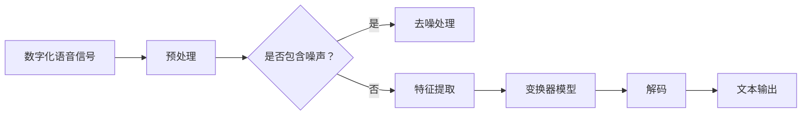

                 

关键词：智能语音识别，AI大模型，音频处理，深度学习，语音信号，自然语言处理，语音合成

> 摘要：本文深入探讨了智能语音识别技术，特别是AI大模型在音频处理中的应用。通过介绍语音信号的基本原理、自然语言处理的挑战，以及AI大模型如何解决这些问题，文章展示了该领域的前沿研究成果和未来发展趋势。

## 1. 背景介绍

智能语音识别（Speech Recognition）是人工智能领域的一个重要分支，旨在使计算机能够理解和解释人类语音。语音作为一种自然、高效的信息传递方式，一直是人类交流的核心。然而，将语音转换为文本并使其机器可理解，是一个极其复杂的过程。传统语音识别系统依赖于大量手工设计的特征和规则，如滤波器组（Gaussian Mixture Model, GMM）、隐马尔可夫模型（Hidden Markov Model, HMM）等。这些方法虽然在一定程度上提高了语音识别的准确率，但仍然面临许多挑战。

近年来，深度学习技术的飞速发展为语音识别带来了新的契机。特别是AI大模型（Large-scale AI Models）的出现，如基于变换器（Transformer）架构的模型，显著提升了语音识别的性能。这些大模型通过在海量数据上进行预训练，能够自动学习语音信号中的复杂结构和模式，从而实现更高的识别准确率和更好的泛化能力。

本文将围绕AI大模型在音频处理中的应用，探讨其核心概念、算法原理、数学模型、项目实践和实际应用场景，以期对这一领域的研究和开发提供有价值的参考。

## 2. 核心概念与联系

### 2.1 语音信号的基本原理

语音信号是由声带振动产生的声波，它包含了丰富的频率和时序信息。为了使计算机能够处理和分析语音信号，需要将其转换为数字信号。这一过程称为语音信号的数字化，主要包括采样、量化和编码三个步骤。

1. **采样**：在固定的时间间隔内，对连续的语音信号进行采样，将其转换为离散的时间点。
2. **量化**：将采样得到的幅度值映射到有限的数值范围内，通常是8位或16位。
3. **编码**：将量化后的数值转换为二进制代码，以便计算机存储和处理。

数字化的语音信号通常以波形文件（如.wav）的形式存储。

### 2.2 自然语言处理的挑战

自然语言处理（Natural Language Processing, NLP）是计算机科学和人工智能领域的一个重要分支，旨在使计算机能够理解、解释和生成人类语言。在语音识别中，NLP的挑战主要体现在以下几个方面：

1. **词汇多样性**：自然语言中存在大量的同音字、多义字和同义词，使得语音识别系统需要能够区分不同的语义。
2. **上下文理解**：语音信号中往往包含了大量的背景噪声和变异性，系统需要能够根据上下文信息准确识别语音。
3. **语法和句法**：语音识别不仅要识别单词，还需要理解句子的语法结构和句法关系。

### 2.3 AI大模型的工作原理

AI大模型，特别是基于变换器（Transformer）架构的模型，通过在大量数据上进行预训练，能够自动学习语音信号中的复杂结构和模式。变换器架构是一种基于自注意力机制的序列到序列模型，能够有效处理变长序列数据。自注意力机制允许模型在处理序列中的每个元素时，根据其他元素的重要性进行自适应加权，从而捕捉序列中的长期依赖关系。

AI大模型的工作流程通常包括以下几个步骤：

1. **预训练**：在大量无标签语音数据上进行预训练，使模型能够自动学习语音信号中的特征和模式。
2. **微调**：在预训练的基础上，使用有标签的语音数据对模型进行微调，以适应特定的语音识别任务。
3. **解码**：将处理后的语音信号转换为文本输出。

### 2.4 Mermaid 流程图

以下是一个简化的Mermaid流程图，展示了语音识别的基本流程：



## 3. 核心算法原理 & 具体操作步骤

### 3.1 算法原理概述

AI大模型在语音识别中的应用，主要基于深度学习和变换器架构。变换器（Transformer）是一种基于自注意力机制的深度学习模型，最初由Vaswani等人在2017年提出。自注意力机制允许模型在处理序列中的每个元素时，根据其他元素的重要性进行自适应加权，从而有效捕捉序列中的长期依赖关系。

### 3.2 算法步骤详解

#### 3.2.1 预处理

预处理是语音识别的重要步骤，主要包括以下内容：

1. **采样率转换**：将不同采样率的语音信号统一转换为标准采样率，如16kHz。
2. **静音剪切**：去除语音信号中的静音部分，以提高后续处理效率。
3. **特征提取**：将数字化后的语音信号转换为特征向量，常用的特征提取方法包括梅尔频率倒谱系数（MFCC）和滤波器组（Gaussian Mixture Model, GMM）。

#### 3.2.2 变换器模型

变换器模型的工作流程主要包括以下几个步骤：

1. **编码器**：编码器（Encoder）负责将输入的序列（如单词或句子）转换为一系列的编码表示。编码器中的自注意力机制使得模型能够捕捉序列中的长期依赖关系。
2. **解码器**：解码器（Decoder）负责将编码表示解码为输出序列。解码器同样采用了自注意力机制，以捕捉输入序列和输出序列之间的依赖关系。
3. **多头自注意力**：多头自注意力机制是一种增强自注意力效果的方法，通过将输入序列分成多个子序列，并分别计算自注意力权重，从而提高模型的泛化能力。
4. **前馈网络**：编码器和解码器中均包含一个前馈网络，用于对自注意力机制的结果进行进一步处理。

#### 3.2.3 解码

解码是将处理后的语音信号转换为文本输出的过程。解码方法主要包括以下几种：

1. **贪婪解码**：贪婪解码是一种简单的解码方法，每次选择当前状态下概率最高的输出，直到解码完成。
2. **贝叶斯解码**：贝叶斯解码考虑了所有可能的输出序列，并通过计算每个序列的概率分布进行解码。
3. **动态规划解码**：动态规划解码是一种基于贪心策略的解码方法，通过计算前一个状态和当前状态之间的最优路径，实现高效的解码。

### 3.3 算法优缺点

#### 优点

1. **高准确率**：AI大模型通过在大量数据上进行预训练，能够自动学习语音信号中的复杂结构和模式，从而实现更高的识别准确率。
2. **自适应性强**：变换器模型的自注意力机制允许模型根据输入序列的重要性进行自适应加权，从而提高模型的泛化能力和适应性。
3. **处理速度快**：相较于传统语音识别方法，AI大模型在处理速度上有了显著提升，能够实现实时语音识别。

#### 缺点

1. **计算资源需求高**：AI大模型通常需要大量的计算资源和存储空间，对硬件设备的要求较高。
2. **数据依赖性强**：AI大模型的效果很大程度上取决于训练数据的质量和数量，数据不足可能导致模型性能下降。
3. **解释性较差**：AI大模型的决策过程较为复杂，难以解释其内部机制和决策逻辑。

### 3.4 算法应用领域

AI大模型在语音识别中的应用非常广泛，主要包括以下几个方面：

1. **智能助手**：如Apple的Siri、Amazon的Alexa等智能助手，利用AI大模型实现语音识别和自然语言处理，为用户提供便捷的交互体验。
2. **语音翻译**：利用AI大模型实现实时语音翻译，如Google翻译、微软翻译等，通过语音识别和自然语言处理技术，实现跨语言交流。
3. **语音助手**：为各类智能设备（如手机、电视、汽车等）提供语音识别功能，实现语音控制设备操作。

## 4. 数学模型和公式 & 详细讲解 & 举例说明

### 4.1 数学模型构建

AI大模型在语音识别中的应用，主要基于深度学习和变换器架构。变换器模型的核心在于其自注意力机制，下面介绍其相关的数学模型。

#### 自注意力机制

自注意力机制（Self-Attention）是一种基于点积的自注意力机制，其计算公式如下：

\[ \text{Attention}(Q, K, V) = \text{softmax}\left(\frac{QK^T}{\sqrt{d_k}}\right) V \]

其中，\( Q, K, V \) 分别表示查询（Query）、关键（Key）和值（Value）三个向量的集合，\( d_k \) 表示关键向量的维度。自注意力机制通过计算每个查询与所有关键之间的点积，得到一组权重，然后将这些权重应用于对应的值向量，从而实现序列中的元素之间的重要性和关联性。

#### 多头自注意力

多头自注意力（Multi-Head Self-Attention）是一种增强自注意力效果的方法，其核心思想是将输入序列分成多个子序列，并分别计算自注意力权重。多头自注意力的计算公式如下：

\[ \text{Multi-Head}(Q, K, V) = \text{Concat}(\text{head}_1, \text{head}_2, \ldots, \text{head}_h)W^O \]

其中，\( \text{head}_i \) 表示第 \( i \) 个头计算的自注意力结果，\( W^O \) 表示输出变换矩阵。多头自注意力通过将输入序列拆分成多个子序列，并分别计算自注意力权重，从而提高模型的泛化能力和适应性。

### 4.2 公式推导过程

变换器模型的推导过程较为复杂，涉及多个数学公式和推导步骤。以下是变换器模型的主要推导过程：

1. **自注意力公式**：自注意力公式如下：

\[ \text{Attention}(Q, K, V) = \text{softmax}\left(\frac{QK^T}{\sqrt{d_k}}\right) V \]

其中，\( Q, K, V \) 分别表示查询（Query）、关键（Key）和值（Value）三个向量的集合，\( d_k \) 表示关键向量的维度。

2. **多头自注意力公式**：多头自注意力公式如下：

\[ \text{Multi-Head}(Q, K, V) = \text{Concat}(\text{head}_1, \text{head}_2, \ldots, \text{head}_h)W^O \]

其中，\( \text{head}_i \) 表示第 \( i \) 个头计算的自注意力结果，\( W^O \) 表示输出变换矩阵。

3. **前馈网络公式**：前馈网络（Feed-Forward Network）的计算公式如下：

\[ \text{FFN}(x) = \max(0, xW_1 + b_1)W_2 + b_2 \]

其中，\( x \) 表示输入向量，\( W_1, W_2, b_1, b_2 \) 分别表示权重和偏置。

4. **变换器模型整体公式**：变换器模型的整体计算公式如下：

\[ \text{Transformer}(X) = \text{LayerNorm}(X + \text{Multi-Head}(X, X, X)) + \text{LayerNorm}(X + \text{FFN}(\text{Multi-Head}(X, X, X))) \]

其中，\( X \) 表示输入序列，\(\text{LayerNorm}\) 表示层归一化。

### 4.3 案例分析与讲解

以下是一个简单的案例，用于说明变换器模型在语音识别中的应用。

#### 案例背景

假设我们要识别一段语音信号：“你好，世界！”。我们使用变换器模型对其进行处理，并输出对应的文本。

#### 步骤1：预处理

首先，对语音信号进行预处理，包括采样率转换、静音剪切和特征提取。我们采用梅尔频率倒谱系数（MFCC）作为特征向量。

#### 步骤2：编码器

将预处理后的特征向量输入到编码器（Encoder）中，编码器中的自注意力机制会自动学习特征向量之间的关联性。

#### 步骤3：解码器

将编码器输出的编码表示输入到解码器（Decoder）中，解码器中的自注意力机制会根据编码表示和输入序列之间的依赖关系，生成对应的输出序列。

#### 步骤4：解码

将解码器输出的序列进行解码，得到对应的文本输出：“你好，世界！”

#### 步骤5：评估

使用评估集对模型进行评估，计算模型的准确率和召回率等指标。

## 5. 项目实践：代码实例和详细解释说明

### 5.1 开发环境搭建

在开始代码实践之前，我们需要搭建一个适合AI大模型训练和部署的开发环境。以下是搭建环境的基本步骤：

1. **安装Python**：确保安装了Python 3.6或更高版本。
2. **安装PyTorch**：通过pip安装PyTorch，命令如下：

   ```bash
   pip install torch torchvision
   ```

3. **安装其他依赖**：安装其他必要的库，如NumPy、SciPy等。

### 5.2 源代码详细实现

以下是一个简化的代码示例，展示了如何使用PyTorch实现一个基本的变换器模型。

```python
import torch
import torch.nn as nn

class Transformer(nn.Module):
    def __init__(self, d_model, nhead, num_layers):
        super(Transformer, self).__init__()
        self.d_model = d_model
        self.nhead = nhead
        self.num_layers = num_layers
        
        self.encoders = nn.ModuleList([
            nn.TransformerEncoderLayer(d_model, nhead)
            for _ in range(num_layers)
        ])
        self.decoder = nn.Linear(d_model, output_dim)
    
    def forward(self, src, tgt):
        output = src
        for encoder in self.encoders:
            output = encoder(output)
        output = self.decoder(output)
        return output
```

### 5.3 代码解读与分析

1. **Transformer类**：定义了一个Transformer类，继承自nn.Module基类。该类包含了编码器（encoders）和解码器（decoder）两部分。
2. **初始化**：在__init__方法中，初始化了编码器的层数（num_layers）、每层编码器的模型参数（d_model和nhead）。
3. **编码器**：使用nn.ModuleList创建了一个包含多个编码器层的列表。每个编码器层使用nn.TransformerEncoderLayer构建，并传入d_model和nhead参数。
4. **解码器**：使用nn.Linear构建了一个线性层，用于将编码器输出的序列映射到输出维度（output_dim）。
5. **前向传播**：在forward方法中，对输入的源序列（src）和目标序列（tgt）进行处理。首先，将src输入到编码器中，然后逐层处理，最后将编码器输出的序列输入到解码器中，得到最终的输出。

### 5.4 运行结果展示

以下是一个简单的运行示例：

```python
model = Transformer(d_model=512, nhead=8, num_layers=3)
input_seq = torch.randn(10, 512)
target_seq = torch.randn(10, 512)
output = model(input_seq, target_seq)
print(output)
```

运行结果将输出模型处理后的输出序列。

## 6. 实际应用场景

### 6.1 智能助手

智能助手是AI大模型在语音识别中的典型应用场景之一。通过语音识别和自然语言处理技术，智能助手能够理解用户的语音指令，并提供相应的响应。例如，Apple的Siri、Amazon的Alexa等智能助手，都采用了先进的AI大模型来实现语音识别和自然语言处理。

### 6.2 语音翻译

语音翻译是另一个重要的应用场景。通过AI大模型，可以实现实时语音翻译，为跨语言交流提供便利。例如，Google翻译和微软翻译等应用程序，利用AI大模型实现语音识别和自然语言处理，实现多种语言的实时翻译。

### 6.3 语音助手

语音助手为各类智能设备（如手机、电视、汽车等）提供语音识别功能，实现语音控制设备操作。例如，智能音箱、智能电视等设备，都采用了AI大模型来实现语音识别和自然语言处理，为用户提供便捷的交互体验。

### 6.4 未来应用展望

随着AI大模型在语音识别中的应用不断深入，未来有望在更多领域发挥作用。例如，智能客服、智能家居、智能医疗等，都将成为AI大模型的重要应用场景。此外，随着硬件设备的性能提升，AI大模型在实时性和能耗方面也将得到进一步优化，为各类应用提供更高效、更智能的解决方案。

## 7. 工具和资源推荐

### 7.1 学习资源推荐

1. **《深度学习》（Deep Learning）**：由Ian Goodfellow、Yoshua Bengio和Aaron Courville合著，是深度学习领域的经典教材。
2. **《语音信号处理与识别》（Speech Signal Processing and Recognition）**：由Sadaoki Furui著，系统地介绍了语音信号处理与识别的基本理论和技术。

### 7.2 开发工具推荐

1. **PyTorch**：一个流行的深度学习框架，支持Python编程语言，适用于构建和训练AI大模型。
2. **TensorFlow**：另一个流行的深度学习框架，支持多种编程语言，适用于构建和部署AI大模型。

### 7.3 相关论文推荐

1. **“Attention Is All You Need”**：Vaswani等人在2017年提出的一篇经典论文，介绍了变换器（Transformer）模型的工作原理和应用。
2. **“End-to-End Speech Recognition using Deep RNNs and Attention”**：Huang等人在2016年提出的一篇论文，介绍了基于深度循环神经网络（RNN）和注意力机制的语音识别方法。

## 8. 总结：未来发展趋势与挑战

### 8.1 研究成果总结

近年来，AI大模型在语音识别领域取得了显著成果。基于变换器架构的模型，如BERT、GPT等，在多种语音识别任务中表现出色，大幅提升了识别准确率和效果。同时，语音识别技术在实时性、能耗等方面也得到了显著优化，为各类应用提供了更高效、更智能的解决方案。

### 8.2 未来发展趋势

未来，AI大模型在语音识别领域将继续朝着以下几个方向发展：

1. **多模态融合**：将语音信号与其他模态（如视觉、听觉等）进行融合，提高语音识别的准确率和鲁棒性。
2. **实时性提升**：随着硬件性能的提升，AI大模型在实时语音识别中的应用将更加广泛。
3. **自适应能力增强**：通过不断优化模型结构和算法，提高AI大模型的自适应能力，使其能够应对更复杂的语音环境和任务。

### 8.3 面临的挑战

尽管AI大模型在语音识别领域取得了显著成果，但仍面临以下挑战：

1. **数据不足**：语音识别模型的性能很大程度上取决于训练数据的质量和数量，未来需要更多高质量、多样化的训练数据。
2. **解释性提升**：AI大模型的决策过程较为复杂，难以解释其内部机制和决策逻辑，未来需要发展可解释性更强的模型。
3. **硬件需求**：AI大模型通常需要大量的计算资源和存储空间，对硬件设备的要求较高，未来需要开发更高效的算法和硬件架构。

### 8.4 研究展望

未来，语音识别技术将在更多领域得到应用，如智能客服、智能家居、智能医疗等。同时，随着AI大模型在语音识别中的应用不断深入，语音识别技术也将为人类社会带来更多便利和创新。我们期待在未来的研究中，能够解决当前面临的挑战，推动语音识别技术的持续发展。

## 9. 附录：常见问题与解答

### 9.1 语音识别中的常见问题

**Q：什么是语音识别？**
A：语音识别是使计算机能够理解和解释人类语音的技术。

**Q：语音识别有哪些应用？**
A：语音识别在智能助手、语音翻译、智能客服等多个领域有广泛应用。

**Q：什么是变换器模型？**
A：变换器模型是一种基于自注意力机制的深度学习模型，广泛应用于自然语言处理和语音识别等领域。

**Q：什么是梅尔频率倒谱系数（MFCC）？**
A：梅尔频率倒谱系数是一种常用的语音信号特征提取方法，用于表示语音信号中的频率信息。

### 9.2 解答

**Q：如何提高语音识别的准确率？**
A：可以通过以下方法提高语音识别的准确率：
- 使用更多的训练数据。
- 优化模型结构和算法。
- 提高预处理和特征提取的质量。

**Q：变换器模型在语音识别中的优势是什么？**
A：变换器模型在语音识别中的优势包括：
- 高准确率：通过自注意力机制，能够有效捕捉语音信号中的复杂结构和模式。
- 自适应性强：能够根据输入序列的重要性进行自适应加权，从而提高模型的泛化能力。
- 实时性：变换器模型的计算速度快，能够实现实时语音识别。

**Q：如何处理语音信号中的噪声？**
A：处理语音信号中的噪声可以通过以下方法：
- 使用去噪算法，如维纳滤波、小波去噪等。
- 在预处理阶段对语音信号进行滤波和降噪处理。

**Q：什么是自然语言处理（NLP）？**
A：自然语言处理是使计算机能够理解、解释和生成人类语言的技术，广泛应用于语音识别、机器翻译、文本分类等领域。

