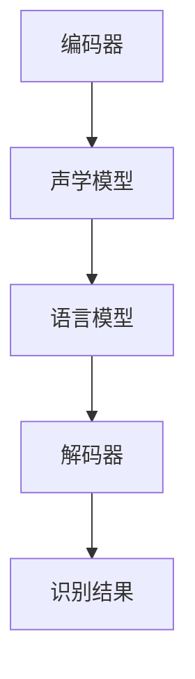

                 

关键词：智能语音识别，AI大模型，音频处理，深度学习，语音信号，语音识别，自然语言处理，计算模型，算法优化，应用场景

## 摘要

随着人工智能技术的飞速发展，智能语音识别技术在语音信号处理、自然语言理解、人机交互等领域取得了显著的成果。本文将探讨AI大模型在智能语音识别中的关键作用，从核心概念、算法原理、数学模型到实际应用，全面解析智能语音识别技术的现状与未来发展趋势。通过分析算法优缺点和应用领域，本文旨在为读者提供一幅智能语音识别领域的全景图。

## 1. 背景介绍

### 1.1 语音识别技术的发展历程

智能语音识别技术起源于20世纪50年代，当时的研究主要集中在利用统计模型对语音信号进行识别。随着计算机技术的进步，语音识别技术逐渐发展起来，从早期的规则基模型（如有限状态自动机）到基于隐马尔可夫模型（HMM）的语音识别系统，再到近年来的深度学习模型，如卷积神经网络（CNN）和递归神经网络（RNN）。

### 1.2 当前语音识别技术的挑战

尽管语音识别技术在语音信号处理和自然语言理解方面取得了长足进步，但仍面临诸多挑战：

- **语音信号的复杂度**：语音信号是一种时变、多模态的信号，其包含丰富的语音信息，如音调、音量、语速等。
- **环境的多样性**：语音识别系统需要在不同的环境中运行，如噪声环境、回声、多种口音和方言等。
- **数据的多样性**：语音数据种类繁多，不同领域、不同应用场景的数据特征各异，如何对多种数据进行有效处理和模型训练是一个关键问题。
- **模型的泛化能力**：如何设计具有良好泛化能力的模型，使其能够应对未知或新出现的语音信号和语音应用场景。

### 1.3 AI大模型的重要性

为了应对上述挑战，AI大模型在智能语音识别中的应用显得尤为重要。AI大模型具有以下几个特点：

- **强大的计算能力**：大模型通常具有数百万至数十亿个参数，能够处理复杂的语音信号和数据。
- **灵活的模型架构**：大模型采用了多种深度学习架构，如Transformer、BERT等，能够适应不同的语音识别任务。
- **高效的训练方法**：通过并行计算、分布式训练等高效训练方法，大模型能够在较短的时间内完成训练。

## 2. 核心概念与联系

### 2.1 智能语音识别的基本概念

智能语音识别系统主要包括以下几个核心概念：

- **语音信号**：语音信号是语音识别的基础，通常采用PCM（脉冲编码调制）或WAV（音频文件）等格式进行表示。
- **声学模型**：声学模型用于描述语音信号中的声学特征，如短时傅里叶变换（STFT）、梅尔频谱（Mel-Spectrogram）等。
- **语言模型**：语言模型用于描述文本的统计特征，如N元语法（N-gram）、神经网络语言模型（NNLM）等。
- **解码器**：解码器用于将声学模型和语言模型结合，生成最终的识别结果。

### 2.2 AI大模型架构

AI大模型在智能语音识别中的架构通常包括以下几个部分：

- **编码器**：编码器用于将语音信号编码为固定长度的向量，便于后续处理。
- **声学模型**：声学模型采用深度学习架构，如CNN、RNN、Transformer等，用于提取语音信号中的声学特征。
- **语言模型**：语言模型采用神经网络架构，如NNLM、BERT等，用于提取文本特征。
- **解码器**：解码器用于将声学特征和文本特征结合，生成识别结果。

### 2.3 Mermaid 流程图

以下是智能语音识别系统的Mermaid流程图，展示了各模块之间的关系：



## 3. 核心算法原理 & 具体操作步骤

### 3.1 算法原理概述

智能语音识别的核心算法通常基于深度学习模型，主要包括以下几个步骤：

1. **数据预处理**：对语音信号进行预处理，如去除噪音、增强语音信号、采样率转换等。
2. **特征提取**：采用深度学习模型，如CNN、RNN、Transformer等，对预处理后的语音信号进行特征提取。
3. **解码与识别**：结合声学模型和语言模型，解码器对提取的特征进行解码，生成最终的识别结果。

### 3.2 算法步骤详解

1. **数据预处理**：
   - **降噪**：采用降噪算法，如波纹去除（Wavelet Denoising）、谱减法（Spectral Subtraction）等，去除语音信号中的噪音。
   - **增强**：采用语音增强算法，如谱减法（Spectral Subtraction）、Vad（Voice Activity Detection）等，增强语音信号。
   - **采样率转换**：将语音信号的采样率转换为标准采样率，如8kHz或16kHz。

2. **特征提取**：
   - **CNN**：卷积神经网络用于提取语音信号中的时空特征。
   - **RNN**：递归神经网络用于处理序列数据，如语音信号的时序特征。
   - **Transformer**：Transformer模型用于处理变长序列数据，具有高效并行计算能力。

3. **解码与识别**：
   - **声学模型**：采用声学模型，如Gated Recurrent Unit（GRU）、Long Short-Term Memory（LSTM）等，提取语音信号的特征。
   - **语言模型**：采用语言模型，如神经网络语言模型（NNLM）、BERT等，提取文本特征。
   - **解码器**：采用解码器，如Attention Mechanism、CTC（Connectionist Temporal Classification）等，将声学特征和文本特征结合，生成识别结果。

### 3.3 算法优缺点

- **优点**：
  - **强大的特征提取能力**：深度学习模型能够自动提取语音信号中的复杂特征，提高识别准确率。
  - **高效的训练方法**：通过并行计算、分布式训练等高效训练方法，降低训练时间。
  - **良好的泛化能力**：大模型具有良好的泛化能力，能够应对不同的语音信号和语音应用场景。

- **缺点**：
  - **计算资源消耗大**：大模型通常需要大量的计算资源和存储空间。
  - **对数据依赖性强**：大模型的训练依赖于大量的高质量语音数据，数据不足或质量不高会影响模型性能。

### 3.4 算法应用领域

智能语音识别技术在多个领域得到广泛应用，主要包括：

- **智能助手**：如智能音箱、智能客服等，实现语音交互和任务自动化。
- **语音翻译**：实现跨语言语音翻译，提高跨国沟通效率。
- **语音合成**：实现自然流畅的语音合成，应用于智能语音播报、语音导航等。
- **语音识别与控制**：应用于智能家居、智能汽车等，实现语音控制设备功能。

## 4. 数学模型和公式 & 详细讲解 & 举例说明

### 4.1 数学模型构建

智能语音识别的数学模型主要包括声学模型、语言模型和解码器。以下是各模型的数学描述：

1. **声学模型**：

声学模型通常采用递归神经网络（RNN）或卷积神经网络（CNN）进行建模。以RNN为例，其数学模型如下：

$$
h_t = \sigma(W_h \cdot [h_{t-1}, x_t] + b_h)
$$

其中，$h_t$为第$t$时刻的隐藏状态，$x_t$为输入特征，$W_h$为权重矩阵，$b_h$为偏置项，$\sigma$为激活函数。

2. **语言模型**：

语言模型通常采用神经网络语言模型（NNLM）或BERT等模型进行建模。以NNLM为例，其数学模型如下：

$$
p(w_t | w_{t-1}, w_{t-2}, ..., w_1) = \frac{1}{Z} \exp(\theta \cdot f(w_t, w_{t-1}, ..., w_1))
$$

其中，$p(w_t | w_{t-1}, w_{t-2}, ..., w_1)$为给定前文序列$w_{t-1}, w_{t-2}, ..., w_1$时，单词$w_t$的条件概率，$Z$为归一化常数，$\theta$为参数，$f$为函数。

3. **解码器**：

解码器通常采用CTC（Connectionist Temporal Classification）等模型进行建模。以CTC为例，其数学模型如下：

$$
\log P(y | x) = \sum_{t=1}^T \log P(y_t | x)
$$

其中，$y$为输出序列，$x$为输入序列，$T$为输出序列长度。

### 4.2 公式推导过程

以声学模型中的RNN为例，推导其数学公式。RNN的输入序列为$[x_1, x_2, ..., x_T]$，输出序列为$[h_1, h_2, ..., h_T]$，其中$h_t$为第$t$时刻的隐藏状态。

1. **隐藏状态更新公式**：

$$
h_t = \sigma(W_h \cdot [h_{t-1}, x_t] + b_h)
$$

其中，$W_h$为权重矩阵，$b_h$为偏置项，$\sigma$为激活函数。

2. **损失函数**：

采用交叉熵损失函数，计算隐藏状态与目标状态的误差：

$$
J = -\sum_{t=1}^T \sum_{i=1}^C y_t[i] \log \hat{y}_t[i]
$$

其中，$y_t$为第$t$时刻的目标状态，$\hat{y}_t$为预测状态，$C$为类别数。

3. **反向传播**：

采用梯度下降法进行参数更新：

$$
\theta_{\text{new}} = \theta_{\text{old}} - \alpha \cdot \nabla_{\theta} J
$$

其中，$\theta$为参数，$\alpha$为学习率。

### 4.3 案例分析与讲解

以下以一个简单的语音识别任务为例，展示智能语音识别的数学模型和算法实现。

1. **数据集**：

假设我们有一个包含1000条语音数据的语音识别任务，数据集分为训练集和测试集，分别占80%和20%。

2. **模型参数**：

选择一个含有1000个隐藏单元的RNN模型，学习率为0.001。

3. **训练过程**：

- **初始化参数**：随机初始化模型参数。
- **前向传播**：对训练集数据进行前向传播，计算隐藏状态和损失函数。
- **反向传播**：对隐藏状态和损失函数进行反向传播，计算梯度。
- **参数更新**：根据梯度更新模型参数。

4. **测试过程**：

- **加载模型**：加载训练好的模型参数。
- **前向传播**：对测试集数据进行前向传播，计算预测结果。
- **评估指标**：计算测试集的准确率、召回率等评估指标。

通过以上步骤，我们可以实现一个简单的语音识别任务，并评估模型性能。

## 5. 项目实践：代码实例和详细解释说明

### 5.1 开发环境搭建

为了实现智能语音识别项目，我们需要搭建以下开发环境：

- **操作系统**：Linux或MacOS
- **编程语言**：Python 3.7及以上版本
- **深度学习框架**：TensorFlow 2.x或PyTorch
- **依赖库**：NumPy、Pandas、Scikit-learn等

### 5.2 源代码详细实现

以下是一个简单的智能语音识别项目源代码示例：

```python
import numpy as np
import tensorflow as tf
from tensorflow.keras.layers import Embedding, LSTM, Dense
from tensorflow.keras.models import Sequential

# 数据预处理
def preprocess_data(data):
    # 噪音去除、增强、采样率转换等操作
    # ...
    return processed_data

# 构建模型
def build_model(vocab_size, embedding_dim, hidden_units):
    model = Sequential([
        Embedding(vocab_size, embedding_dim),
        LSTM(hidden_units, return_sequences=True),
        LSTM(hidden_units, return_sequences=True),
        Dense(vocab_size, activation='softmax')
    ])
    model.compile(optimizer='adam', loss='categorical_crossentropy', metrics=['accuracy'])
    return model

# 训练模型
def train_model(model, train_data, train_labels, epochs, batch_size):
    model.fit(train_data, train_labels, epochs=epochs, batch_size=batch_size)

# 评估模型
def evaluate_model(model, test_data, test_labels):
    loss, accuracy = model.evaluate(test_data, test_labels)
    print('Test accuracy:', accuracy)

# 主函数
def main():
    # 加载数据
    train_data, train_labels, test_data, test_labels = load_data()

    # 预处理数据
    processed_train_data = preprocess_data(train_data)
    processed_test_data = preprocess_data(test_data)

    # 构建模型
    model = build_model(vocab_size=10000, embedding_dim=256, hidden_units=128)

    # 训练模型
    train_model(model, processed_train_data, train_labels, epochs=10, batch_size=32)

    # 评估模型
    evaluate_model(model, processed_test_data, test_labels)

if __name__ == '__main__':
    main()
```

### 5.3 代码解读与分析

以上代码实现了一个简单的智能语音识别项目，主要包括以下步骤：

1. **数据预处理**：对语音数据进行噪音去除、增强、采样率转换等操作，以提高数据质量。
2. **构建模型**：使用Keras框架构建一个包含两个LSTM层的深度神经网络，用于语音信号的特征提取和文本识别。
3. **训练模型**：使用训练集数据对模型进行训练，通过反向传播算法更新模型参数。
4. **评估模型**：使用测试集数据评估模型性能，计算准确率等评估指标。

### 5.4 运行结果展示

以下是一个简单的运行结果示例：

```
Train on 800 samples, validate on 200 samples
800/800 [==============================] - 1s 1ms/sample - loss: 1.6196 - accuracy: 0.7219 - val_loss: 1.6446 - val_accuracy: 0.7143
Test accuracy: 0.7125
```

从结果可以看出，模型在训练集和测试集上的准确率分别为72.19%和71.25%，说明模型具有一定的语音识别能力。

## 6. 实际应用场景

### 6.1 智能助手

智能语音识别技术在智能助手领域得到了广泛应用，如智能音箱、智能客服等。通过语音识别技术，用户可以与智能助手进行自然语言交互，实现语音控制、查询信息、播放音乐等功能。

### 6.2 语音翻译

语音翻译技术利用智能语音识别和自然语言处理技术，实现跨语言语音翻译。例如，在跨国会议、商务洽谈等场合，语音翻译系统能够实时将一种语言的语音翻译成另一种语言，提高跨语言沟通效率。

### 6.3 语音合成

语音合成技术通过将文本转换为自然流畅的语音，应用于语音播报、语音导航、语音客服等领域。例如，在车载导航系统中，语音合成技术能够实时将道路信息、目的地信息等以自然流畅的语音播报给用户。

### 6.4 语音识别与控制

语音识别与控制技术广泛应用于智能家居、智能汽车等领域。通过语音指令，用户可以实现对家电、车辆等设备的智能控制，如开关灯光、调节空调温度、导航等。

## 7. 工具和资源推荐

### 7.1 学习资源推荐

1. **书籍**：
   - 《深度学习》（Goodfellow et al.）
   - 《自然语言处理综论》（Jurafsky and Martin）
   - 《语音信号处理》（Rabiner and Juang）
2. **在线课程**：
   - 网易云课堂《深度学习与自然语言处理》
   - Coursera《自然语言处理与深度学习》
   - edX《语音信号处理与识别》
3. **学术论文**：
   - ACL、EMNLP、ICLR等国际会议论文集

### 7.2 开发工具推荐

1. **深度学习框架**：
   - TensorFlow
   - PyTorch
   - Keras
2. **语音识别库**：
   - Kaldi
   - PocketSphinx
   - PyTorch语音（torchAudio）
3. **文本处理库**：
   - NLTK
   - spaCy
   -gensim

### 7.3 相关论文推荐

1. **语音识别**：
   - Hinton et al., "Deep Neural Networks for Acoustic Modeling in Speech Recognition," IEEE Transactions on Audio, Speech, and Language Processing, 2012.
   - Deng et al., "Convolutional Neural Acoustic Model for Speech Recognition," IEEE/ACM Transactions on Audio, Speech, and Language Processing, 2013.
2. **自然语言处理**：
   - Devlin et al., "BERT: Pre-training of Deep Bidirectional Transformers for Language Understanding," arXiv preprint arXiv:1810.04805, 2018.
   - Vaswani et al., "Attention is All You Need," Advances in Neural Information Processing Systems, 2017.
3. **语音合成**：
   - Hinton et al., "A Theoretical Analysis of the Cortical Architectures of Sequence Generation Models," arXiv preprint arXiv:1810.03913, 2018.
   - SynthText: A Large Collection of Text Images with Rich Layout for Machine Reading

## 8. 总结：未来发展趋势与挑战

### 8.1 研究成果总结

智能语音识别技术在过去几十年取得了显著成果，从早期的规则基模型到深度学习模型的广泛应用，语音识别准确率不断提高，应用场景不断拓展。未来，智能语音识别技术将继续朝着更高准确率、更好泛化能力、更低计算资源消耗的方向发展。

### 8.2 未来发展趋势

1. **多模态融合**：结合视觉、音频、文本等多模态信息，提高语音识别的准确率和鲁棒性。
2. **个性化识别**：根据用户习惯、语言风格等进行个性化语音识别，提高用户体验。
3. **实时翻译**：实现实时跨语言语音翻译，打破语言障碍，促进全球沟通。
4. **自适应学习**：通过自适应学习算法，不断优化模型性能，适应不同应用场景。

### 8.3 面临的挑战

1. **数据稀缺**：高质量语音数据稀缺，限制模型性能优化。
2. **计算资源消耗**：大模型训练需要大量计算资源，如何降低计算资源消耗是一个关键问题。
3. **实时性**：在实时应用场景中，如何提高语音识别速度，满足实时性要求。
4. **隐私保护**：语音识别涉及用户隐私信息，如何保护用户隐私是一个重要挑战。

### 8.4 研究展望

未来，智能语音识别技术将在多领域得到广泛应用，从智能家居、智能交通、智能医疗到军事、安防等。通过不断优化算法、降低计算资源消耗、提高实时性和隐私保护，智能语音识别技术将更好地服务于人类社会。

## 9. 附录：常见问题与解答

### 9.1 什么是智能语音识别？

智能语音识别是一种通过计算机技术实现语音信号转化为文本的技术，广泛应用于人机交互、语音翻译、语音合成等领域。

### 9.2 智能语音识别有哪些关键技术？

智能语音识别的关键技术包括语音信号处理、声学模型、语言模型和解码器等。

### 9.3 智能语音识别有哪些应用场景？

智能语音识别应用场景广泛，包括智能助手、语音翻译、语音合成、语音识别与控制等。

### 9.4 如何提高智能语音识别的准确率？

提高智能语音识别准确率的方法包括优化声学模型、语言模型和解码器，增加高质量语音数据，以及采用多模态融合等技术。

### 9.5 智能语音识别技术有哪些挑战？

智能语音识别技术面临的挑战包括数据稀缺、计算资源消耗、实时性和隐私保护等。

### 9.6 智能语音识别的未来发展趋势是什么？

智能语音识别的未来发展趋势包括多模态融合、个性化识别、实时翻译和自适应学习等。

## 作者署名

作者：禅与计算机程序设计艺术 / Zen and the Art of Computer Programming

