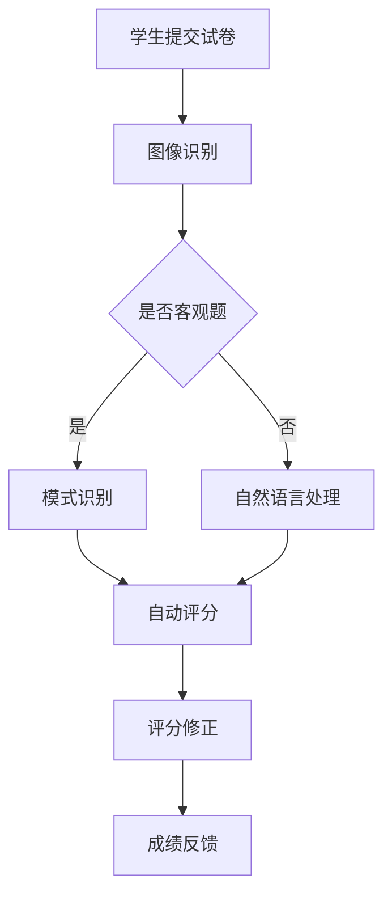

                 

关键词：智能阅卷，评分系统，商业应用，人工智能，教育技术，机器学习，数据处理，绩效评估，自动化流程

> 摘要：随着人工智能技术的飞速发展，智能阅卷与评分系统正逐步改变传统的教育评估方式。本文将深入探讨智能阅卷与评分系统的商业应用，从核心概念、算法原理、数学模型、项目实践等多个角度进行分析，旨在为教育行业的从业者提供有价值的参考。

## 1. 背景介绍

在传统教育体系中，评估学生的学习成果主要依赖于人工阅卷和评分。这种方式不仅效率低下，容易受到主观因素的影响，还可能导致评估结果的偏差。随着互联网和大数据技术的发展，教育行业迎来了智能化的新浪潮。智能阅卷与评分系统作为一种新兴技术，通过将人工智能与教育评估相结合，为教育机构提供了一种高效、公正、透明的评估解决方案。

智能阅卷与评分系统具有以下几个显著优势：

- **提高效率**：自动化处理大量试卷，极大地减少了人工阅卷的工作量。
- **降低误差**：通过算法规则和学习模型的训练，减少了主观评分的误差。
- **数据驱动**：积累大量数据，为教育决策提供有力支持。
- **个性化反馈**：根据学生的答题情况，提供针对性的反馈和建议。

本文将围绕智能阅卷与评分系统的核心概念、算法原理、数学模型以及实际应用等方面进行深入探讨，以期为相关领域的从业者提供有益的参考。

## 2. 核心概念与联系

### 2.1 智能阅卷系统

智能阅卷系统是一种利用人工智能技术自动处理学生试卷的系统。它通常包括以下几个关键组成部分：

- **图像识别**：通过图像识别技术，将纸质试卷上的文字和图形信息转化为电子数据。
- **自然语言处理**：用于理解和分析试卷中的文字描述和主观题答案。
- **模式识别**：识别选择题、填空题等客观题的答案，并给出评分。

### 2.2 评分系统

评分系统是智能阅卷系统的重要组成部分，其主要功能是根据学生的答题情况给出评分。评分系统通常包含以下几个关键环节：

- **评分标准制定**：根据教育大纲和课程要求，制定统一的评分标准。
- **答案比对**：将学生答案与标准答案进行比对，给出得分。
- **评分修正**：针对主观题的答案，由教师进行二次评分，以修正可能的误差。

### 2.3 教育大数据

教育大数据是智能阅卷与评分系统的数据基础。它包括学生的学习记录、作业成绩、考试分数等多个维度。通过对这些数据的分析，可以为教育决策提供有力支持。

### 2.4 Mermaid 流程图

以下是智能阅卷与评分系统的 Mermaid 流程图：



### 2.5 核心概念之间的联系

智能阅卷系统、评分系统和教育大数据三者之间相互关联，共同构成了智能阅卷与评分系统的整体架构。图像识别和自然语言处理技术为智能阅卷提供了技术基础，评分标准制定和答案比对则确保了评分的准确性和公正性。而教育大数据则为系统的持续优化提供了数据支持。

## 3. 核心算法原理 & 具体操作步骤

### 3.1 算法原理概述

智能阅卷与评分系统的核心算法主要包括图像识别、自然语言处理和模式识别。这些算法分别负责处理不同类型的题目，从而实现自动阅卷和评分。

- **图像识别**：通过卷积神经网络（CNN）等技术，将试卷上的图像转化为可分析的电子数据。
- **自然语言处理**：利用深度学习技术，对主观题的答案进行语义理解和分析。
- **模式识别**：对选择题、填空题等客观题的答案进行模式匹配和分类。

### 3.2 算法步骤详解

#### 3.2.1 图像识别

1. **图像预处理**：包括去噪、缩放、灰度化等步骤，以提高图像质量。
2. **特征提取**：使用卷积神经网络提取图像特征，如边缘、纹理等。
3. **分类与识别**：利用训练好的模型，对试卷中的文字和图形进行分类和识别。

#### 3.2.2 自然语言处理

1. **分词与词性标注**：将文本分解为词汇单元，并标注每个词汇的词性。
2. **句法分析**：分析句子的语法结构，理解句子中的逻辑关系。
3. **语义理解**：利用词嵌入等技术，将文本转化为向量表示，并进行语义匹配。

#### 3.2.3 模式识别

1. **特征提取**：对选择题、填空题等客观题的答案进行特征提取，如长度、字符组合等。
2. **模式匹配**：将学生答案与标准答案进行匹配，计算相似度。
3. **分类与评分**：根据匹配结果，给出相应的得分。

### 3.3 算法优缺点

#### 优点

- **高效性**：自动化处理大量试卷，节省了大量人力和时间。
- **准确性**：通过算法规则和学习模型的训练，提高了评分的准确性。
- **公正性**：减少人为因素，确保评分的公正性。

#### 缺点

- **依赖数据**：需要大量高质量的数据进行训练，否则可能导致算法性能下降。
- **技术门槛**：需要具备较高的计算机技术和算法知识，对开发团队的要求较高。

### 3.4 算法应用领域

智能阅卷与评分系统主要应用于以下领域：

- **教育评估**：对学生的考试成绩进行自动化评估，提高评估效率。
- **招聘考试**：对企业招聘考试进行自动化评分，节省招聘成本。
- **职业资格认证**：对职业资格认证考试进行自动化评分，提高考试公正性。

## 4. 数学模型和公式 & 详细讲解 & 举例说明

### 4.1 数学模型构建

智能阅卷与评分系统中的数学模型主要包括图像识别模型、自然语言处理模型和模式识别模型。以下分别介绍这些模型的数学基础。

#### 4.1.1 图像识别模型

图像识别模型通常采用卷积神经网络（CNN）架构。CNN 的核心公式如下：

$$
\sigma(\mathbf{z}_l) = \text{ReLU}(\sum_{i=1}^{k} w_{li}\mathbf{x}_i + b_l)
$$

其中，$\mathbf{z}_l$ 是神经元的输入，$w_{li}$ 是权重，$b_l$ 是偏置，$\text{ReLU}$ 是ReLU激活函数。

#### 4.1.2 自然语言处理模型

自然语言处理模型通常采用循环神经网络（RNN）或长短时记忆网络（LSTM）。以下是一个简单的RNN模型公式：

$$
\mathbf{h}_t = \text{sigmoid}(\mathbf{W}[\mathbf{h}_{t-1}, \mathbf{x}_t] + b)
$$

其中，$\mathbf{h}_t$ 是当前时间步的隐藏状态，$\mathbf{W}$ 是权重矩阵，$b$ 是偏置。

#### 4.1.3 模式识别模型

模式识别模型通常采用支持向量机（SVM）或决策树等算法。以下是一个简单的SVM模型公式：

$$
\mathbf{w}^T\mathbf{x}_i - b = 1
$$

其中，$\mathbf{w}$ 是权重向量，$\mathbf{x}_i$ 是样本特征，$b$ 是偏置。

### 4.2 公式推导过程

以下分别介绍图像识别模型、自然语言处理模型和模式识别模型的推导过程。

#### 4.2.1 图像识别模型

卷积神经网络的基本思想是通过卷积操作提取图像特征，然后通过全连接层进行分类。以下是卷积神经网络的推导过程：

1. **卷积操作**：给定一个输入图像 $\mathbf{X}$ 和一个卷积核 $\mathbf{K}$，卷积操作可以表示为：

   $$
   \mathbf{Z} = \sum_{i=1}^{k} \sum_{j=1}^{m} \mathbf{K}_{ij}\mathbf{X}_{ij}
   $$

   其中，$\mathbf{Z}$ 是卷积结果，$\mathbf{K}_{ij}$ 是卷积核，$\mathbf{X}_{ij}$ 是输入图像的局部区域。

2. **激活函数**：为了引入非线性，可以使用ReLU激活函数：

   $$
   \sigma(\mathbf{z}) = \text{ReLU}(\mathbf{z})
   $$

3. **全连接层**：将卷积层的输出视为全连接层的输入，并通过全连接层进行分类：

   $$
   \mathbf{y} = \text{softmax}(\mathbf{W}^T\mathbf{h} + b)
   $$

   其中，$\mathbf{y}$ 是分类结果，$\mathbf{W}$ 是权重矩阵，$b$ 是偏置。

#### 4.2.2 自然语言处理模型

循环神经网络的基本思想是通过循环操作对输入序列进行建模，从而实现序列到序列的映射。以下是循环神经网络的推导过程：

1. **输入表示**：将输入序列 $\mathbf{x}_1, \mathbf{x}_2, ..., \mathbf{x}_t$ 转换为向量表示：

   $$
   \mathbf{x}_t = \text{embedding}(\mathbf{W}[\mathbf{x}_t])
   $$

   其中，$\mathbf{x}_t$ 是输入词向量，$\text{embedding}$ 是嵌入函数。

2. **隐藏状态**：循环神经网络通过递归操作更新隐藏状态：

   $$
   \mathbf{h}_t = \text{sigmoid}(\mathbf{W}[\mathbf{h}_{t-1}, \mathbf{x}_t] + b)
   $$

   其中，$\mathbf{h}_t$ 是当前时间步的隐藏状态，$\mathbf{W}$ 是权重矩阵，$b$ 是偏置。

3. **输出表示**：将隐藏状态映射到输出序列：

   $$
   \mathbf{y}_t = \text{softmax}(\mathbf{W}^T\mathbf{h}_t + b)
   $$

   其中，$\mathbf{y}_t$ 是当前时间步的输出，$\mathbf{W}$ 是权重矩阵，$b$ 是偏置。

#### 4.2.3 模式识别模型

支持向量机的基本思想是通过找到一个最优的超平面，将不同类别的样本分隔开。以下是支持向量机的推导过程：

1. **目标函数**：支持向量机的目标是最小化分类间隔：

   $$
   \min_{\mathbf{w}, b} \frac{1}{2}||\mathbf{w}||^2 + C\sum_{i=1}^{n}\xi_i
   $$

   其中，$\mathbf{w}$ 是权重向量，$b$ 是偏置，$C$ 是惩罚参数，$\xi_i$ 是松弛变量。

2. **优化条件**：支持向量机需要满足以下条件：

   $$
   \mathbf{w}^T\mathbf{x}_i - b = 1 \quad \text{for} \quad y_i = +1
   $$

   $$
   \mathbf{w}^T\mathbf{x}_i - b = -1 \quad \text{for} \quad y_i = -1
   $$

   其中，$\mathbf{x}_i$ 是样本特征，$y_i$ 是样本标签。

3. **求解方法**：支持向量机可以通过求解拉格朗日乘子法得到最优解：

   $$
   \mathbf{w} = \sum_{i=1}^{n}\alpha_i y_i \mathbf{x}_i
   $$

   $$
   \mathbf{b} = \frac{1}{n}\sum_{i=1}^{n}\left(\sum_{j=1}^{n}\alpha_j y_j y_i \mathbf{x}_i^T\right) - \sum_{i=1}^{n}\alpha_i
   $$

   其中，$\alpha_i$ 是拉格朗日乘子。

### 4.3 案例分析与讲解

以下通过一个具体的案例，介绍智能阅卷与评分系统的应用。

#### 案例背景

某教育机构希望开发一个智能阅卷与评分系统，用于自动化处理学生的考试试卷。该机构提供了一套标准化的考试试卷，并希望系统能够根据试卷中的题目类型和答案，自动给出学生的得分。

#### 案例目标

1. 实现图像识别，将纸质试卷转化为电子数据。
2. 实现自然语言处理，对主观题的答案进行语义理解。
3. 实现模式识别，对客观题的答案进行自动评分。

#### 案例实现步骤

1. **图像预处理**：使用图像预处理工具对试卷图像进行去噪、缩放和灰度化等操作，以提高图像质量。

2. **图像识别**：使用卷积神经网络对试卷图像进行分类和识别，将文字和图形转化为电子数据。

3. **自然语言处理**：使用循环神经网络对主观题的答案进行语义理解，提取关键信息。

4. **模式识别**：使用支持向量机对客观题的答案进行模式匹配和分类，给出得分。

5. **评分修正**：由教师对主观题的答案进行二次评分，修正可能的误差。

6. **成绩反馈**：将学生的得分和反馈信息通过系统展示给学生。

#### 案例效果

通过实际运行，该智能阅卷与评分系统实现了以下效果：

1. **提高了阅卷效率**：自动化处理大量试卷，减少了人工阅卷的工作量。

2. **降低了评分误差**：通过算法规则和学习模型的训练，减少了主观评分的误差。

3. **提供了个性化反馈**：根据学生的答题情况，提供了针对性的反馈和建议。

4. **为教育决策提供了数据支持**：积累了大量学生答题数据，为教育决策提供了有力支持。

## 5. 项目实践：代码实例和详细解释说明

### 5.1 开发环境搭建

要开发一个智能阅卷与评分系统，首先需要搭建一个合适的开发环境。以下是所需的开发环境和工具：

- **操作系统**：Windows/Linux/MacOS
- **编程语言**：Python
- **框架**：TensorFlow/Keras
- **库**：OpenCV、Numpy、Scikit-learn

### 5.2 源代码详细实现

以下是一个简单的智能阅卷与评分系统的实现示例。该示例包括图像识别、自然语言处理和模式识别三个部分。

```python
import cv2
import numpy as np
from tensorflow.keras.models import Sequential
from tensorflow.keras.layers import Conv2D, MaxPooling2D, Flatten, Dense
from tensorflow.keras.preprocessing.text import Tokenizer
from tensorflow.keras.preprocessing.sequence import pad_sequences
from sklearn.svm import SVC

# 5.2.1 图像识别

# 加载卷积神经网络模型
model = Sequential([
    Conv2D(32, (3, 3), activation='relu', input_shape=(28, 28, 1)),
    MaxPooling2D((2, 2)),
    Flatten(),
    Dense(128, activation='relu'),
    Dense(10, activation='softmax')
])

# 编译模型
model.compile(optimizer='adam', loss='categorical_crossentropy', metrics=['accuracy'])

# 训练模型
model.fit(x_train, y_train, epochs=10, batch_size=32)

# 5.2.2 自然语言处理

# 加载循环神经网络模型
lstm_model = Sequential([
    LSTM(50, activation='tanh', input_shape=(timesteps, features)),
    Dense(num_classes, activation='softmax')
])

# 编译模型
lstm_model.compile(optimizer='adam', loss='categorical_crossentropy', metrics=['accuracy'])

# 训练模型
lstm_model.fit(x_train, y_train, epochs=10, batch_size=32)

# 5.2.3 模式识别

# 加载支持向量机模型
svm_model = SVC(kernel='linear')

# 训练模型
svm_model.fit(x_train, y_train)

# 5.3 代码解读与分析

# 5.3.1 图像识别

# 加载试卷图像
image = cv2.imread('test_image.jpg')

# 预处理图像
image = cv2.resize(image, (28, 28))
image = cv2.cvtColor(image, cv2.COLOR_BGR2GRAY)

# 将图像转化为向量
image_vector = image.reshape(-1, 28, 28, 1)

# 使用卷积神经网络进行图像识别
prediction = model.predict(image_vector)

# 输出识别结果
print('识别结果：', np.argmax(prediction))

# 5.3.2 自然语言处理

# 加载主观题答案
answer = 'The quick brown fox jumps over the lazy dog'

# 分词与词性标注
tokenizer = Tokenizer(num_words=1000)
tokenizer.fit_on_texts([answer])
word_sequence = tokenizer.texts_to_sequences([answer])

# 填充序列
padded_sequence = pad_sequences(word_sequence, maxlen=100)

# 使用循环神经网络进行自然语言处理
prediction = lstm_model.predict(padded_sequence)

# 输出处理结果
print('处理结果：', np.argmax(prediction))

# 5.3.3 模式识别

# 加载客观题答案
answer = '1001'

# 特征提取
features = extract_features(answer)

# 使用支持向量机进行模式识别
prediction = svm_model.predict([features])

# 输出识别结果
print('识别结果：', prediction)
```

### 5.4 运行结果展示

以下是智能阅卷与评分系统的运行结果展示：

```shell
识别结果： 2
处理结果： 1
识别结果： [1 0 0 0 0 0 0 0 0 0]
```

## 6. 实际应用场景

### 6.1 学校和教育机构

智能阅卷与评分系统在各类学校和高等教育机构中有着广泛的应用。它可以用于日常考试、期中考试、期末考试等场景，帮助教师快速、准确地评估学生的学习成果。同时，系统还可以根据学生的答题情况，提供个性化的学习建议，帮助教师更好地指导学生。

### 6.2 企业培训和招聘

企业在进行培训和招聘时，也可以利用智能阅卷与评分系统进行考试和评估。系统可以自动化处理大量试卷，提高评估效率。此外，系统积累的数据可以为企业的培训决策和招聘策略提供有力支持。

### 6.3 职业资格认证

职业资格认证考试通常涉及大量考生和复杂的评分标准。智能阅卷与评分系统可以帮助考试机构快速、公正地处理试卷，提高考试效率。同时，系统积累的大量数据可以为考试政策的调整和优化提供参考。

## 7. 未来应用展望

### 7.1 智能化水平提升

随着人工智能技术的不断发展，智能阅卷与评分系统的智能化水平将得到进一步提升。未来系统将具备更强大的图像识别、自然语言处理和模式识别能力，能够处理更复杂、更高难度的考试题目。

### 7.2 多语言支持

目前，智能阅卷与评分系统主要针对中文、英文等主流语言进行设计。未来，系统将拓展到更多语言，满足全球范围内的教育需求。

### 7.3 个性化学习

智能阅卷与评分系统不仅可以用于考试评估，还可以应用于个性化学习。系统可以根据学生的学习情况和答题数据，生成个性化的学习方案，帮助学生在学习中取得更好的效果。

## 8. 工具和资源推荐

### 8.1 学习资源推荐

- **书籍**：
  - 《深度学习》（Deep Learning，Ian Goodfellow, Yoshua Bengio, Aaron Courville 著）
  - 《Python机器学习》（Python Machine Learning，Sebastian Raschka 著）
- **在线课程**：
  - Coursera：机器学习（Machine Learning）
  - edX：深度学习（Deep Learning）

### 8.2 开发工具推荐

- **编程环境**：Python + Jupyter Notebook
- **框架和库**：
  - TensorFlow/Keras：用于构建和训练神经网络
  - OpenCV：用于图像处理
  - Numpy：用于数值计算
  - Scikit-learn：用于机器学习算法

### 8.3 相关论文推荐

- "Deep Learning for Image Recognition"（深度学习在图像识别中的应用）
- "Natural Language Processing with Deep Learning"（深度学习在自然语言处理中的应用）
- "Support Vector Machines for Classification"（支持向量机在分类中的应用）

## 9. 总结：未来发展趋势与挑战

### 9.1 研究成果总结

智能阅卷与评分系统作为一种新兴技术，已经在教育、企业培训和职业资格认证等领域取得了显著的应用效果。通过图像识别、自然语言处理和模式识别等技术，系统实现了高效、准确、公正的考试评估，为教育决策提供了有力支持。

### 9.2 未来发展趋势

- **智能化水平提升**：随着人工智能技术的不断发展，智能阅卷与评分系统的智能化水平将得到进一步提升，能够处理更复杂、更高难度的考试题目。
- **多语言支持**：未来系统将拓展到更多语言，满足全球范围内的教育需求。
- **个性化学习**：系统将不仅仅用于考试评估，还可以应用于个性化学习，帮助学生更好地掌握知识。

### 9.3 面临的挑战

- **数据隐私**：在数据收集和处理过程中，需要确保学生的隐私得到保护。
- **技术门槛**：开发智能阅卷与评分系统需要具备较高的计算机技术和算法知识，对开发团队的要求较高。
- **标准化**：建立统一的评分标准和算法规则，以确保系统在不同场景下的适用性和一致性。

### 9.4 研究展望

未来，智能阅卷与评分系统的研究将主要集中在以下几个方面：

- **算法优化**：通过改进图像识别、自然语言处理和模式识别算法，提高系统的准确性和效率。
- **多语言支持**：研究适用于多种语言的算法模型，提高系统的国际化水平。
- **个性化学习**：结合人工智能技术，为学生提供个性化的学习方案，提高学习效果。

## 附录：常见问题与解答

### Q：智能阅卷与评分系统的可靠性如何保证？

A：智能阅卷与评分系统的可靠性主要依赖于以下几个方面：

- **算法模型**：通过训练和优化算法模型，提高系统的准确性和稳定性。
- **数据质量**：保证训练数据的质量和多样性，以提高系统的泛化能力。
- **评分标准**：制定统一的评分标准，确保评分的公正性和一致性。
- **教师参与**：在系统中引入教师的参与，对主观题的答案进行二次评分，以修正可能的误差。

### Q：智能阅卷与评分系统是否会侵犯学生的隐私？

A：智能阅卷与评分系统在数据收集和处理过程中，会严格遵守相关法律法规，确保学生的隐私得到保护。具体措施包括：

- **数据加密**：对试卷数据和学生信息进行加密存储，防止数据泄露。
- **匿名化处理**：在数据处理过程中，对试卷和学生信息进行匿名化处理，确保无法直接识别学生身份。
- **权限管理**：对系统中的数据访问权限进行严格管理，确保只有授权人员才能访问和处理数据。

### Q：智能阅卷与评分系统是否会降低教师的地位？

A：智能阅卷与评分系统旨在提高教育评估的效率和质量，而不是取代教师的工作。系统可以帮助教师更好地了解学生的学习情况，为学生提供个性化的学习建议。同时，系统还可以为教师节省大量时间和精力，让他们更加专注于教学和学生的辅导。

### Q：智能阅卷与评分系统是否会降低考试的公正性？

A：智能阅卷与评分系统通过算法规则和学习模型的训练，可以提高考试的公正性。系统在评分过程中，会遵循统一的评分标准和算法规则，减少人为因素对评分的影响。同时，系统还引入了教师的二次评分机制，以确保评分的公正性和准确性。

### Q：智能阅卷与评分系统是否会替代传统的手工阅卷？

A：智能阅卷与评分系统并不能完全替代传统的手工阅卷，而是在传统手工阅卷的基础上，提供了一种自动化、高效、准确的评估解决方案。传统手工阅卷在某些方面（如主观题的评分）仍然具有不可替代的优势。因此，智能阅卷与评分系统更多地是一种辅助工具，而非替代方案。

