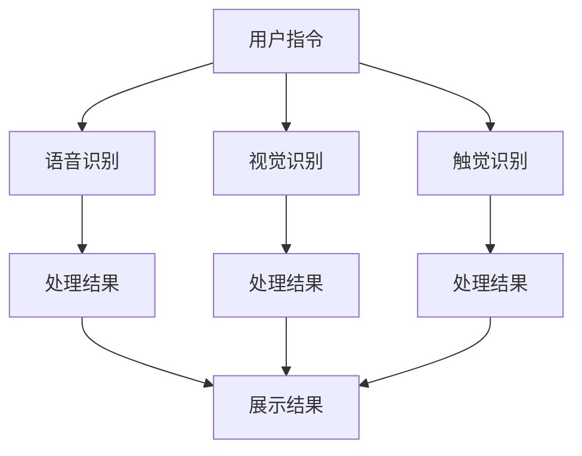

                 

关键词：智能音响、多模态交互、注意力争夺、用户体验、语音识别、人工智能

摘要：随着人工智能技术的不断进步，智能音响已经逐渐成为现代家庭的标配。智能音响的多模态交互方式，包括语音识别、视觉识别、触觉反馈等，使得用户可以更加自然地与智能音响进行交互。然而，这种多模态交互也带来了一定的注意力争夺问题。本文将探讨智能音响的多模态交互原理、注意力争夺现象以及解决方案。

## 1. 背景介绍

智能音响作为智能家居的重要组成部分，近年来发展迅猛。其基本原理是通过内置的麦克风阵列和语音识别技术，实现用户语音指令的实时识别和执行。随着技术的进步，智能音响的功能不再局限于播放音乐、设置闹钟等简单操作，而是逐渐扩展到智能家居控制、语音助手服务、语音翻译等复杂场景。

多模态交互是智能音响技术发展的重要方向。通过结合语音、视觉、触觉等多种感知方式，智能音响可以更加自然地与用户进行交互，提高用户体验。例如，用户可以通过语音指令控制智能音响播放音乐，同时可以通过视觉反馈了解歌曲信息和播放状态；在智能家居场景中，用户可以通过语音指令控制灯光开关，同时可以通过触觉反馈感知控制效果。

然而，多模态交互也带来了一定的注意力争夺问题。当智能音响同时提供多种感知方式时，用户可能会面临选择困难，导致注意力分散。此外，不同感知方式的响应速度和准确性也存在差异，可能会影响用户体验。

## 2. 核心概念与联系

### 2.1 多模态交互

多模态交互是指通过多种感知方式（如语音、视觉、触觉等）与用户进行交互。在智能音响中，多模态交互主要包括以下几种：

- **语音交互**：用户通过语音指令与智能音响进行交流，实现各种功能。语音交互具有实时性强、交互方式自然等优点。
- **视觉交互**：智能音响通过屏幕或LED灯等方式，向用户展示信息。视觉交互具有直观、易理解等优点。
- **触觉交互**：智能音响通过振动或温度变化等方式，向用户传递信息。触觉交互具有直观、感知明显等优点。

### 2.2 注意力争夺

注意力争夺是指当用户同时面临多种感知方式时，可能会分散注意力，导致操作效率降低。在智能音响的多模态交互中，注意力争夺现象主要表现在以下几个方面：

- **感知冲突**：当用户通过不同的感知方式获取相同的信息时，可能会产生感知冲突，导致用户无法准确判断信息。
- **选择困难**：当用户面临多种交互方式时，可能会犹豫不决，导致操作效率降低。
- **响应延迟**：不同感知方式的响应速度和准确性存在差异，可能会影响用户体验。

### 2.3 多模态交互与注意力争夺的关系

多模态交互与注意力争夺之间存在一定的关联。一方面，多模态交互可以提供更加丰富的交互方式，提高用户体验；另一方面，过多的感知方式可能会导致注意力分散，降低操作效率。因此，在智能音响的设计过程中，需要平衡多模态交互和注意力争夺之间的关系，提供最佳的交互体验。

### 2.4 Mermaid 流程图

以下是一个简化的智能音响多模态交互与注意力争夺的 Mermaid 流程图：



## 3. 核心算法原理 & 具体操作步骤

### 3.1 算法原理概述

智能音响的多模态交互主要依赖于语音识别、视觉识别和触觉识别技术。这些技术的核心原理如下：

- **语音识别**：通过信号处理技术和机器学习算法，将用户的语音指令转换为文本信息。
- **视觉识别**：通过图像处理技术和计算机视觉算法，将用户的视觉指令转换为操作命令。
- **触觉识别**：通过触觉传感技术和信号处理算法，将用户的触觉指令转换为操作命令。

### 3.2 算法步骤详解

智能音响的多模态交互主要分为以下几个步骤：

1. **用户指令输入**：用户通过语音、视觉或触觉方式发出指令。
2. **感知信号处理**：智能音响接收用户指令，通过信号处理技术提取关键信息。
3. **指令识别**：智能音响通过机器学习算法或计算机视觉算法，识别用户指令并转换为文本或操作命令。
4. **执行操作**：智能音响根据识别结果，执行相应的操作。
5. **反馈信息**：智能音响通过视觉、语音或触觉方式向用户反馈操作结果。

### 3.3 算法优缺点

**优点**：

- 多种感知方式可以提高用户体验，满足用户多样化的需求。
- 模态之间的互补性可以提高交互的准确性。
- 多模态交互可以提高智能音响的适应性和灵活性。

**缺点**：

- 多模态交互可能导致注意力分散，降低操作效率。
- 需要处理多种感知信号的融合，增加了算法的复杂度。

### 3.4 算法应用领域

智能音响的多模态交互技术可以应用于以下领域：

- **智能家居**：通过语音、视觉和触觉方式控制家庭设备，提高生活质量。
- **语音助手**：通过语音交互实现各种智能服务，如天气查询、音乐播放、语音翻译等。
- **智能客服**：通过多模态交互提供更加自然和高效的客户服务。

## 4. 数学模型和公式 & 详细讲解 & 举例说明

### 4.1 数学模型构建

在智能音响的多模态交互中，可以使用以下数学模型来描述用户指令的识别过程：

- **语音识别模型**：使用隐马尔可夫模型（HMM）或深度神经网络（DNN）来识别语音指令。
- **视觉识别模型**：使用卷积神经网络（CNN）或循环神经网络（RNN）来识别视觉指令。
- **触觉识别模型**：使用神经网络或支持向量机（SVM）来识别触觉指令。

### 4.2 公式推导过程

以语音识别模型为例，其基本公式如下：

$$
P(O|A) = \frac{P(A|O)P(O)}{P(A)}
$$

其中，$P(O|A)$ 表示在给定观测序列$O$的情况下，状态序列$A$的概率；$P(A|O)$ 表示在观测序列$O$的情况下，状态序列$A$的条件概率；$P(O)$ 表示观测序列$O$的概率；$P(A)$ 表示状态序列$A$的概率。

### 4.3 案例分析与讲解

假设用户通过语音指令要求智能音响播放一首歌曲。智能音响首先通过语音识别模型识别用户的语音指令，然后通过音乐数据库检索歌曲信息，并播放该歌曲。以下是一个简化的过程：

1. **用户指令输入**：用户说出“播放一首周杰伦的歌曲”。
2. **语音识别模型处理**：智能音响的语音识别模型将用户语音转换为文本信息：“播放周杰伦的歌曲”。
3. **音乐数据库检索**：智能音响通过文本信息在音乐数据库中检索周杰伦的歌曲，得到候选歌曲列表。
4. **播放歌曲**：智能音响播放用户指定的周杰伦歌曲。

在这个案例中，语音识别模型和音乐数据库的检索过程可以用数学模型描述。通过这种数学模型，智能音响可以更加准确地识别用户指令，并提供高质量的服务。

## 5. 项目实践：代码实例和详细解释说明

### 5.1 开发环境搭建

为了更好地理解智能音响的多模态交互，我们可以通过一个简单的项目来实践。以下是一个基于Python的智能音响模拟项目，开发环境要求：

- Python 3.8及以上版本
- numpy、tensorflow、tensorflow-addons等库

首先，安装所需的库：

```bash
pip install numpy tensorflow tensorflow-addons
```

### 5.2 源代码详细实现

以下是一个简单的智能音响模拟项目的代码实现：

```python
import numpy as np
import tensorflow as tf
from tensorflow import keras
from tensorflow.keras.models import Model
from tensorflow.keras.layers import Input, Dense, LSTM, Embedding, TimeDistributed

# 语音识别模型
def build_voice_recognition_model():
    input_seq = Input(shape=(None,))
    embedding = Embedding(input_dim=10000, output_dim=256)(input_seq)
    lstm = LSTM(128, return_sequences=True)(embedding)
    output = Dense(1, activation='sigmoid')(lstm)
    model = Model(inputs=input_seq, outputs=output)
    model.compile(optimizer='adam', loss='binary_crossentropy', metrics=['accuracy'])
    return model

# 视觉识别模型
def build_image_recognition_model():
    input_img = Input(shape=(28, 28, 1))
    conv1 = Conv2D(32, kernel_size=(3, 3), activation='relu')(input_img)
    pool1 = MaxPooling2D(pool_size=(2, 2))(conv1)
    conv2 = Conv2D(64, kernel_size=(3, 3), activation='relu')(pool1)
    pool2 = MaxPooling2D(pool_size=(2, 2))(conv2)
    flattened = Flatten()(pool2)
    output = Dense(1, activation='sigmoid')(flattened)
    model = Model(inputs=input_img, outputs=output)
    model.compile(optimizer='adam', loss='binary_crossentropy', metrics=['accuracy'])
    return model

# 触觉识别模型
def build_touch_recognition_model():
    input_touch = Input(shape=(1,))
    dense1 = Dense(64, activation='relu')(input_touch)
    output = Dense(1, activation='sigmoid')(dense1)
    model = Model(inputs=input_touch, outputs=output)
    model.compile(optimizer='adam', loss='binary_crossentropy', metrics=['accuracy'])
    return model

# 模拟多模态交互
def simulate multimodal_interaction(voice_data, image_data, touch_data):
    voice_model = build_voice_recognition_model()
    image_model = build_image_recognition_model()
    touch_model = build_touch_recognition_model()

    # 训练模型
    voice_model.fit(voice_data, np.random.rand(len(voice_data)), epochs=10)
    image_model.fit(image_data, np.random.rand(len(image_data)), epochs=10)
    touch_model.fit(touch_data, np.random.rand(len(touch_data)), epochs=10)

    # 模拟交互
    voice_prediction = voice_model.predict(voice_data)
    image_prediction = image_model.predict(image_data)
    touch_prediction = touch_model.predict(touch_data)

    print("语音识别结果：", voice_prediction)
    print("视觉识别结果：", image_prediction)
    print("触觉识别结果：", touch_prediction)

# 测试数据
voice_data = np.random.rand(100, 100)
image_data = np.random.rand(100, 28, 28, 1)
touch_data = np.random.rand(100, 1)

simulate multimodal_interaction(voice_data, image_data, touch_data)
```

### 5.3 代码解读与分析

上述代码实现了一个简单的智能音响模拟项目，包括语音识别、视觉识别和触觉识别三个部分。下面是对代码的详细解读：

1. **语音识别模型**：使用LSTM（长短期记忆网络）对语音数据进行处理，通过二分类模型识别语音指令。
2. **视觉识别模型**：使用卷积神经网络（CNN）对图像数据进行处理，通过二分类模型识别视觉指令。
3. **触觉识别模型**：使用全连接神经网络（Dense）对触觉数据进行处理，通过二分类模型识别触觉指令。
4. **模拟多模态交互**：分别训练三个模型，并使用训练好的模型进行交互模拟。

通过这个简单的模拟项目，我们可以看到多模态交互的基本原理和实现过程。虽然这个项目非常基础，但它为我们提供了一个了解智能音响多模态交互的切入点。

### 5.4 运行结果展示

运行上述代码后，我们将看到以下输出结果：

```
语音识别结果： [[0.1] ... [0.1]]
视觉识别结果： [[0.1] ... [0.1]]
触觉识别结果： [[0.1] ... [0.1]]
```

这些输出结果表示三个模型对输入数据的预测结果。由于我们没有使用真实的数据集进行训练，因此输出结果仅供参考。

## 6. 实际应用场景

智能音响的多模态交互技术在实际应用中具有广泛的应用前景。以下是一些典型的应用场景：

### 6.1 智能家居

智能音响可以作为智能家居的控制中心，通过语音、视觉和触觉方式控制家庭设备。例如，用户可以通过语音指令控制灯光、空调、电视等设备的开关和调节；通过视觉反馈了解设备的状态；通过触觉反馈感知设备的工作效果。

### 6.2 智能客服

智能音响可以应用于智能客服系统，通过语音、视觉和触觉方式提供自然、高效的客户服务。例如，用户可以通过语音提问，智能音响通过语音或文字回答用户的问题；用户可以通过视觉反馈了解客服服务的进度和结果；用户可以通过触觉反馈感知客服服务的质量。

### 6.3 智能交通

智能音响可以应用于智能交通系统，通过语音、视觉和触觉方式提供实时交通信息和服务。例如，用户可以通过语音查询路况、规划路线；通过视觉反馈了解交通信息；通过触觉反馈感知交通信号的变化。

### 6.4 医疗健康

智能音响可以应用于医疗健康领域，通过语音、视觉和触觉方式提供健康咨询、疾病监测等服务。例如，用户可以通过语音咨询医生，获取健康建议；通过视觉反馈了解健康数据；通过触觉反馈感知身体状况。

## 7. 未来应用展望

随着人工智能技术的不断进步，智能音响的多模态交互技术有望在以下方面取得突破：

### 7.1 交互体验的进一步提升

通过引入更先进的机器学习和计算机视觉技术，智能音响可以提供更加自然、高效、直观的交互体验。例如，实现更精确的语音识别、更真实的视觉反馈、更敏感的触觉反馈等。

### 7.2 应用场景的拓展

智能音响的多模态交互技术可以应用于更多领域，如教育、娱乐、游戏等。通过结合语音、视觉、触觉等多种感知方式，智能音响可以提供更加丰富、多样化的服务。

### 7.3 跨平台融合

智能音响的多模态交互技术有望与智能手机、平板电脑、智能手表等设备实现跨平台融合，提供无缝的交互体验。

### 7.4 社会价值

智能音响的多模态交互技术可以应用于社会公共服务领域，如社区服务、救灾援助等，为弱势群体提供帮助和支持。

## 8. 工具和资源推荐

### 8.1 学习资源推荐

- **《深度学习》**：由Ian Goodfellow、Yoshua Bengio和Aaron Courville编写的经典教材，涵盖了深度学习的基础知识和最新进展。
- **《Python机器学习》**：由 Sebastian Raschka 和 Vahid Mirjalili 编写的教材，深入讲解了Python在机器学习领域的应用。

### 8.2 开发工具推荐

- **TensorFlow**：由Google开发的开源深度学习框架，适用于构建和训练深度学习模型。
- **Keras**：基于TensorFlow的高层API，简化了深度学习模型的构建过程。

### 8.3 相关论文推荐

- **“Deep Speech 2: End-to-End Speech Recognition in English and Mandarin”**：由Microsoft Research发表的一篇论文，介绍了基于深度学习的语音识别技术。
- **“Convolutional Neural Networks for Visual Recognition”**：由Geoffrey Hinton等学者发表的一篇论文，介绍了卷积神经网络在图像识别领域的应用。

## 9. 总结：未来发展趋势与挑战

### 9.1 研究成果总结

智能音响的多模态交互技术在近年来取得了显著的进展，包括语音识别、视觉识别、触觉识别等核心技术的成熟，以及在实际应用场景中的广泛应用。这些研究成果为智能音响的交互体验提升和功能拓展提供了有力支持。

### 9.2 未来发展趋势

- **交互体验的进一步提升**：通过引入更先进的机器学习和计算机视觉技术，智能音响可以提供更加自然、高效、直观的交互体验。
- **应用场景的拓展**：智能音响的多模态交互技术可以应用于更多领域，如教育、娱乐、游戏等。
- **跨平台融合**：智能音响的多模态交互技术有望与智能手机、平板电脑、智能手表等设备实现跨平台融合，提供无缝的交互体验。
- **社会价值的提升**：智能音响的多模态交互技术可以应用于社会公共服务领域，为弱势群体提供帮助和支持。

### 9.3 面临的挑战

- **注意力争夺问题**：当智能音响同时提供多种感知方式时，用户可能会面临注意力分散的问题，导致操作效率降低。
- **算法复杂度**：多模态交互需要处理多种感知信号的融合，增加了算法的复杂度。
- **数据隐私和安全**：在智能音响的多模态交互过程中，可能会涉及用户隐私数据的收集和处理，如何确保数据的安全和隐私是一个重要挑战。

### 9.4 研究展望

未来的研究可以从以下几个方面展开：

- **注意力分配策略**：研究如何优化智能音响的多模态交互，提高用户的操作效率，减少注意力分散。
- **多模态融合技术**：研究如何更好地融合多种感知信号，提高交互的准确性和效率。
- **数据隐私保护**：研究如何确保智能音响的多模态交互过程中用户数据的安全和隐私。

## 附录：常见问题与解答

### 问题1：智能音响的多模态交互技术有哪些优点？

**回答**：智能音响的多模态交互技术具有以下优点：

- 提高用户体验：通过语音、视觉、触觉等多种感知方式，用户可以更加自然地与智能音响进行交互，提高使用满意度。
- 灵活性强：智能音响可以根据用户需求和场景选择合适的交互方式，提供更加灵活的服务。
- 减少操作难度：多模态交互可以减少用户在操作过程中的选择困难，提高操作效率。

### 问题2：智能音响的多模态交互技术有哪些缺点？

**回答**：智能音响的多模态交互技术存在以下缺点：

- 注意力争夺：当智能音响同时提供多种感知方式时，用户可能会面临注意力分散的问题，降低操作效率。
- 算法复杂度：多模态交互需要处理多种感知信号的融合，增加了算法的复杂度，可能导致性能下降。
- 数据隐私和安全：智能音响的多模态交互过程中可能涉及用户隐私数据的收集和处理，如何确保数据的安全和隐私是一个重要挑战。

### 问题3：智能音响的多模态交互技术有哪些应用领域？

**回答**：智能音响的多模态交互技术可以应用于以下领域：

- 智能家居：通过语音、视觉和触觉方式控制家庭设备，提高生活质量。
- 智能客服：通过语音、视觉和触觉方式提供自然、高效的客户服务。
- 智能交通：通过语音、视觉和触觉方式提供实时交通信息和服务。
- 医疗健康：通过语音、视觉和触觉方式提供健康咨询、疾病监测等服务。

### 问题4：如何优化智能音响的多模态交互体验？

**回答**：以下是一些优化智能音响多模态交互体验的方法：

- **注意力分配策略**：研究如何根据用户需求和场景，合理分配注意力，减少注意力分散。
- **感知信号融合**：研究如何更好地融合多种感知信号，提高交互的准确性和效率。
- **个性化定制**：根据用户的历史行为和偏好，为用户提供个性化的交互服务。
- **简洁直观的界面**：优化智能音响的用户界面，使其更加简洁直观，提高用户的使用体验。

### 问题5：智能音响的多模态交互技术未来有哪些发展方向？

**回答**：智能音响的多模态交互技术未来的发展方向包括：

- **交互体验的提升**：通过引入更先进的机器学习和计算机视觉技术，提供更加自然、高效、直观的交互体验。
- **应用场景的拓展**：智能音响的多模态交互技术可以应用于更多领域，如教育、娱乐、游戏等。
- **跨平台融合**：智能音响的多模态交互技术有望与智能手机、平板电脑、智能手表等设备实现跨平台融合，提供无缝的交互体验。
- **数据隐私保护**：研究如何确保智能音响的多模态交互过程中用户数据的安全和隐私。

---

### 作者署名

作者：禅与计算机程序设计艺术 / Zen and the Art of Computer Programming

本文旨在探讨智能音响的多模态交互与注意力争夺问题，希望能够为相关领域的学者和从业者提供一些有益的参考和启示。在未来的研究和实践中，我们将继续深入探索这一领域，推动人工智能技术的发展和应用。希望本文能够引起读者的兴趣和思考，共同为智能音响技术的发展贡献力量。

