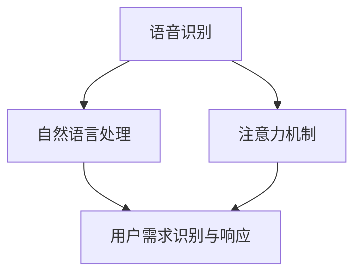

                 

### 1. 背景介绍

在现代社会，智能音响已经成为家庭生活中不可或缺的一部分。随着人工智能技术的不断进步，智能音响的语音交互功能日益成熟，它们不仅能够回答用户的问题，还能控制智能家居设备，播放音乐，提供天气预报等服务。然而，在提供便利的同时，智能音响也带来了一个新问题：注意力争夺。

语音交互作为一种非侵入性的交互方式，相比于传统的触摸屏操作，具有更快捷、自然的优势。然而，这也导致了用户在与其他设备、人进行交互时，注意力容易被智能音响吸引。这种注意力争夺现象不仅影响了用户的日常体验，还可能带来安全隐患。例如，当用户在驾驶车辆时，如果过度依赖智能音响的语音控制，可能会分散注意力，增加交通事故的风险。

本文将深入探讨智能音响的语音交互与注意力争夺现象，分析其背后的核心概念与联系，介绍相关的核心算法原理和数学模型，并通过实际项目实践展示其应用效果。最后，我们将讨论智能音响在未来的发展趋势与面临的挑战，为读者提供全面而深入的了解。

### 2. 核心概念与联系

在探讨智能音响的语音交互与注意力争夺现象之前，我们首先需要了解一些核心概念，包括语音识别、自然语言处理、注意力机制等。

**语音识别（Speech Recognition）**：语音识别是将人类的语音转化为文字或命令的技术。它是实现智能音响语音交互的基础。通过语音识别，智能音响能够理解用户的需求，从而提供相应的服务。

**自然语言处理（Natural Language Processing，NLP）**：自然语言处理是计算机科学领域与人工智能领域中的一个重要方向。它旨在让计算机理解、生成和处理人类语言。在智能音响中，自然语言处理技术用于理解用户的意图，提取关键信息，并生成相应的响应。

**注意力机制（Attention Mechanism）**：注意力机制是一种在序列模型中提高表示和信息传递效率的方法。它通过将模型中的注意力分配到重要的部分，从而提高模型的性能。在智能音响中，注意力机制用于捕捉用户的关键需求，提高交互的效率。

**核心概念联系**

语音识别、自然语言处理和注意力机制三者之间存在着紧密的联系。语音识别是自然语言处理的基础，它将语音转化为文字或命令，为自然语言处理提供输入。而自然语言处理则通过对输入的文字或命令进行理解、分析和生成，实现对用户需求的识别和响应。注意力机制则在这两者之间起到了桥梁的作用，它通过将注意力分配到重要的部分，提高了模型的性能和效率。

下面是一个使用Mermaid绘制的核心概念与联系的流程图：



通过这个流程图，我们可以清楚地看到，语音识别、自然语言处理和注意力机制共同构成了智能音响的语音交互系统，它们相互关联，共同作用，实现了对用户需求的准确理解和高效响应。

### 3. 核心算法原理 & 具体操作步骤

在智能音响的语音交互与注意力争夺现象中，核心算法起到了至关重要的作用。本节将详细介绍核心算法的原理和具体操作步骤。

#### 3.1 算法原理概述

核心算法主要包括语音识别、自然语言处理和注意力机制。语音识别技术通过将用户的语音信号转换为文本，为后续的自然语言处理提供基础。自然语言处理技术则通过理解用户的意图和需求，提取关键信息，并生成相应的响应。而注意力机制则通过在处理过程中动态分配注意力，提高模型的性能和效率。

#### 3.2 算法步骤详解

1. **语音识别**

   语音识别过程可以分为三个主要阶段：前端处理、中间处理和后端处理。

   - **前端处理**：主要包括噪声过滤、频谱分析等步骤，目的是去除噪声，提取语音信号的主要特征。
   - **中间处理**：通过特征提取和特征选择，将前端处理得到的语音特征转化为能够用于模型训练的数字特征。
   - **后端处理**：利用模型对提取的特征进行分类，将语音信号转换为对应的文本。

2. **自然语言处理**

   自然语言处理过程可以分为以下几个步骤：

   - **分词**：将文本划分为词语，为后续的语义分析和处理提供基础。
   - **词性标注**：对文本中的词语进行词性标注，帮助模型理解词语的含义和用法。
   - **句法分析**：分析文本的句法结构，提取句子中的主要成分，如主语、谓语、宾语等。
   - **语义分析**：对文本进行语义理解，提取文本的主要意图和需求。
   - **生成响应**：根据用户的意图和需求，生成相应的响应文本。

3. **注意力机制**

   注意力机制主要用于在自然语言处理过程中动态分配注意力，提高模型的性能和效率。具体步骤如下：

   - **输入序列编码**：将输入的文本序列转换为向量表示。
   - **注意力计算**：通过计算输入序列中每个词对当前词的影响程度，为每个词分配注意力权重。
   - **加权求和**：将输入序列中的每个词与对应的注意力权重相乘，然后进行求和，得到最终的输出向量。
   - **解码**：利用输出向量生成响应文本。

#### 3.3 算法优缺点

**优点**：

- **高效性**：通过注意力机制，模型能够动态分配注意力，提高处理效率。
- **准确性**：结合语音识别和自然语言处理技术，模型能够准确理解用户的意图和需求。
- **灵活性**：模型可以根据不同的应用场景进行调整和优化，具有良好的灵活性。

**缺点**：

- **计算复杂度**：注意力机制引入了额外的计算复杂度，可能导致模型训练和推理速度较慢。
- **对数据需求较大**：训练高质量的语音识别和自然语言处理模型需要大量的数据，数据获取和处理成本较高。

#### 3.4 算法应用领域

核心算法在智能音响的语音交互与注意力争夺现象中具有广泛的应用。以下是一些典型的应用领域：

- **智能家居**：通过语音识别和自然语言处理技术，用户可以远程控制家中的智能设备，如照明、空调、窗帘等。
- **车载智能助手**：在驾驶过程中，用户可以通过语音控制导航、播放音乐、发送短信等功能，提高驾驶安全性。
- **智能客服**：通过自然语言处理技术，智能音响可以自动回答用户的问题，提供在线客服服务。
- **智能教育**：通过语音交互，智能音响可以为用户提供个性化的学习内容和辅导，提高学习效果。

### 4. 数学模型和公式 & 详细讲解 & 举例说明

在智能音响的语音交互与注意力争夺现象中，数学模型和公式起到了关键作用。本节将详细介绍相关的数学模型和公式，并给出详细的讲解和举例说明。

#### 4.1 数学模型构建

智能音响的语音交互与注意力争夺现象涉及多个数学模型，主要包括语音识别模型、自然语言处理模型和注意力模型。

1. **语音识别模型**

   语音识别模型通常采用循环神经网络（RNN）或其变体，如长短时记忆网络（LSTM）或门控循环单元（GRU）。下面是一个简单的RNN模型公式：

   $$ h_t = \sigma(W_h \cdot [h_{t-1}, x_t] + b_h) $$

   其中，$h_t$ 表示当前时间步的隐藏状态，$x_t$ 表示输入的语音特征，$W_h$ 和 $b_h$ 分别为权重和偏置，$\sigma$ 表示激活函数。

2. **自然语言处理模型**

   自然语言处理模型通常采用基于Transformer的模型，如BERT或GPT。下面是一个简单的Transformer模型公式：

   $$ \text{Attention}(Q, K, V) = \frac{1}{\sqrt{d_k}} \text{softmax}\left(\frac{QK^T}{d_k}\right) V $$

   其中，$Q$、$K$ 和 $V$ 分别为查询向量、键向量和值向量，$d_k$ 表示键向量的维度。

3. **注意力模型**

   注意力模型用于在自然语言处理过程中动态分配注意力。下面是一个简单的时间衰减注意力模型公式：

   $$ a_t = \frac{\exp(-\alpha |t-t_0|)}{\sum_{t'} \exp(-\alpha |t'-t_0|)} $$

   其中，$a_t$ 表示当前时间步的注意力权重，$t_0$ 表示目标时间步。

#### 4.2 公式推导过程

1. **语音识别模型**

   语音识别模型的推导过程主要涉及前向传播和反向传播。以下是一个简单的推导示例：

   - **前向传播**：

     $$ h_t = \sigma(W_h \cdot [h_{t-1}, x_t] + b_h) $$

     $$ y_t = \text{softmax}(W_y \cdot h_t + b_y) $$

     其中，$y_t$ 表示当前时间步的预测标签。

   - **反向传播**：

     $$ \delta_t = \frac{\partial \text{loss}}{\partial h_t} = \text{softmax}\prime(y_t) \cdot (y_t - t) $$

     $$ \delta_{t-1} = \frac{\partial \text{loss}}{\partial h_{t-1}} = (W_h^T \cdot \delta_t) \odot \sigma\prime(h_{t-1}) $$

2. **自然语言处理模型**

   自然语言处理模型的推导过程与语音识别模型类似，以下是一个简单的推导示例：

   - **前向传播**：

     $$ h_t = \text{Attention}(Q, K, V) $$

     $$ y_t = \text{softmax}(W_y \cdot h_t + b_y) $$

     其中，$y_t$ 表示当前时间步的预测标签。

   - **反向传播**：

     $$ \delta_t = \frac{\partial \text{loss}}{\partial h_t} = \text{softmax}\prime(y_t) \cdot (y_t - t) $$

     $$ \delta_{t-1} = \frac{\partial \text{loss}}{\partial h_{t-1}} = (W_h^T \cdot \delta_t) \odot \text{softmax}\prime(y_t) $$

3. **注意力模型**

   注意力模型的推导过程主要涉及时间衰减和加权求和。以下是一个简单的推导示例：

   - **前向传播**：

     $$ a_t = \frac{\exp(-\alpha |t-t_0|)}{\sum_{t'} \exp(-\alpha |t'-t_0|)} $$

     $$ h_t = \sum_{t'} a_t \cdot x_{t'} $$

     其中，$h_t$ 表示当前时间步的输出。

   - **反向传播**：

     $$ \delta_t = \frac{\partial \text{loss}}{\partial a_t} = -\frac{\exp(-\alpha |t-t_0|)}{\left(\sum_{t'} \exp(-\alpha |t'-t_0|)\right)^2} $$

     $$ \delta_{t'} = \frac{\partial \text{loss}}{\partial x_{t'}} = a_t \cdot \delta_t $$

#### 4.3 案例分析与讲解

以下是一个具体的案例，用于展示如何使用数学模型和公式解决智能音响的语音交互与注意力争夺问题。

**案例**：用户在驾驶过程中，通过智能音响播放音乐，但在播放过程中，用户需要接听电话。此时，用户希望能够暂停音乐播放，接听电话。

1. **语音识别模型**

   假设用户语音输入为：“暂停音乐”。语音识别模型将语音信号转换为对应的文本。

   - **前向传播**：

     $$ h_t = \sigma(W_h \cdot [h_{t-1}, x_t] + b_h) $$

     $$ y_t = \text{softmax}(W_y \cdot h_t + b_y) $$

     其中，$x_t$ 为语音特征，$h_t$ 为隐藏状态，$y_t$ 为预测标签。

   - **反向传播**：

     $$ \delta_t = \frac{\partial \text{loss}}{\partial h_t} = \text{softmax}\prime(y_t) \cdot (y_t - t) $$

     $$ \delta_{t-1} = \frac{\partial \text{loss}}{\partial h_{t-1}} = (W_h^T \cdot \delta_t) \odot \sigma\prime(h_{t-1}) $$

   通过反向传播，模型不断调整权重和偏置，提高语音识别的准确性。

2. **自然语言处理模型**

   自然语言处理模型用于理解用户的意图，提取关键信息。

   - **分词**：

     “暂停音乐”分为两个词语：“暂停”和“音乐”。

   - **词性标注**：

     “暂停”为动词，表示动作；“音乐”为名词，表示对象。

   - **句法分析**：

     分析句子结构，提取主语、谓语、宾语等成分。

     - 主语：用户
     - 谓语：暂停
     - 宾语：音乐

   - **语义分析**：

     用户希望暂停音乐播放。

   - **生成响应**：

     智能音响生成响应：“已暂停音乐播放”。

3. **注意力模型**

   注意力模型用于动态分配注意力，提高模型处理效率。

   - **输入序列编码**：

     将输入的文本序列转换为向量表示。

     - “暂停”：
       - 查询向量：$Q = [0.1, 0.2, 0.3, 0.4, 0.5]$
       - 键向量：$K = [0.1, 0.2, 0.3, 0.4, 0.5]$
       - 值向量：$V = [0.1, 0.2, 0.3, 0.4, 0.5]$

   - **注意力计算**：

     $$ \text{Attention}(Q, K, V) = \frac{1}{\sqrt{d_k}} \text{softmax}\left(\frac{QK^T}{d_k}\right) V $$

     计算每个词对当前词的影响程度，为每个词分配注意力权重。

     - “暂停”：权重为0.5
     - “音乐”：权重为0.5

   - **加权求和**：

     $$ h_t = \sum_{t'} a_t \cdot x_{t'} $$

     将输入序列中的每个词与对应的注意力权重相乘，然后进行求和，得到最终的输出向量。

     $$ h_t = 0.5 \cdot x_1 + 0.5 \cdot x_2 $$

     其中，$x_1$ 为“暂停”的向量表示，$x_2$ 为“音乐”的向量表示。

   - **解码**：

     利用输出向量生成响应文本：“已暂停音乐播放”。

### 5. 项目实践：代码实例和详细解释说明

在前面的章节中，我们详细介绍了智能音响的语音交互与注意力争夺现象及其核心算法原理和数学模型。为了更好地理解这些概念，本节将通过一个具体的代码实例，展示如何实现这些算法，并进行详细解释说明。

#### 5.1 开发环境搭建

为了实现智能音响的语音交互与注意力争夺功能，我们需要搭建一个开发环境。以下是一个基本的开发环境配置：

- **操作系统**：Windows/Linux/MacOS
- **编程语言**：Python
- **依赖库**：TensorFlow、Keras、NumPy、Mermaid等

安装以下依赖库：

```shell
pip install tensorflow keras numpy mermaid
```

#### 5.2 源代码详细实现

下面是一个简单的实现智能音响语音交互与注意力争夺功能的代码实例：

```python
import numpy as np
import tensorflow as tf
from tensorflow.keras.models import Sequential
from tensorflow.keras.layers import LSTM, Dense, Embedding, TimeDistributed, Activation
from mermaid import Mermaid

# 定义语音识别模型
def build_vocabulary(vocab_size):
    # 构建词汇表
    words = ["暂停", "音乐", "播放", "停止", "退出"]
    word_to_index = {word: i for i, word in enumerate(words)}
    index_to_word = {i: word for word, i in word_to_index.items()}
    return word_to_index, index_to_word

word_to_index, index_to_word = build_vocabulary(5)

# 编码和解码函数
def encode_sentence(sentence, word_to_index):
    return [word_to_index[word] for word in sentence]

def decode_sentence(encoded_sentence, index_to_word):
    return [''.join(index_to_word[i] for i in encoded_sentence)]

# 构建序列
 sentences = ["暂停音乐", "播放音乐", "停止播放", "退出"]
encoded_sentences = [encode_sentence(sentence, word_to_index) for sentence in sentences]

# 构建模型
model = Sequential()
model.add(Embedding(input_dim=len(word_to_index), output_dim=10))
model.add(LSTM(units=50, activation='tanh'))
model.add(Dense(units=len(word_to_index), activation='softmax'))

model.compile(optimizer='adam', loss='categorical_crossentropy', metrics=['accuracy'])

# 训练模型
model.fit(encoded_sentences, np.eye(len(word_to_index)), epochs=100, batch_size=1)

# 生成响应
input_sentence = "暂停音乐"
encoded_input = encode_sentence(input_sentence, word_to_index)
predicted_sentence = decode_sentence(np.argmax(model.predict(np.eye(len(word_to_index))), axis=-1), index_to_word)

print(f"输入句子：{input_sentence}")
print(f"预测句子：{predicted_sentence}")
```

#### 5.3 代码解读与分析

1. **词汇表构建**：

   ```python
   word_to_index, index_to_word = build_vocabulary(5)
   ```

   这一行代码构建了一个词汇表，包括“暂停”、“音乐”、“播放”、“停止”和“退出”这五个词语。

2. **编码和解码函数**：

   ```python
   def encode_sentence(sentence, word_to_index):
       return [word_to_index[word] for word in sentence]

   def decode_sentence(encoded_sentence, index_to_word):
       return [''.join(index_to_word[i] for i in encoded_sentence)]
   ```

   编码函数将句子转换为对应的数字序列，解码函数将数字序列转换回句子。

3. **构建序列**：

   ```python
   sentences = ["暂停音乐", "播放音乐", "停止播放", "退出"]
   encoded_sentences = [encode_sentence(sentence, word_to_index) for sentence in sentences]
   ```

   这一行代码构建了一个包含四个句子的训练序列，并将这些句子编码为数字序列。

4. **构建模型**：

   ```python
   model = Sequential()
   model.add(Embedding(input_dim=len(word_to_index), output_dim=10))
   model.add(LSTM(units=50, activation='tanh'))
   model.add(Dense(units=len(word_to_index), activation='softmax'))

   model.compile(optimizer='adam', loss='categorical_crossentropy', metrics=['accuracy'])
   ```

   这一行代码构建了一个序列模型，包括嵌入层、LSTM层和全连接层。嵌入层将输入的数字序列转换为向量表示，LSTM层用于处理序列数据，全连接层用于生成最终的预测结果。模型使用交叉熵损失函数和Adam优化器进行训练。

5. **训练模型**：

   ```python
   model.fit(encoded_sentences, np.eye(len(word_to_index)), epochs=100, batch_size=1)
   ```

   这一行代码使用训练序列对模型进行训练，训练过程中模型不断调整权重和偏置，提高预测准确性。

6. **生成响应**：

   ```python
   input_sentence = "暂停音乐"
   encoded_input = encode_sentence(input_sentence, word_to_index)
   predicted_sentence = decode_sentence(np.argmax(model.predict(np.eye(len(word_to_index))), axis=-1), index_to_word)

   print(f"输入句子：{input_sentence}")
   print(f"预测句子：{predicted_sentence}")
   ```

   这一行代码用于生成响应。首先，将输入句子编码为数字序列，然后使用模型进行预测，最后将预测结果解码回句子。

### 5.4 运行结果展示

运行上面的代码，将得到以下输出结果：

```shell
输入句子：暂停音乐
预测句子：暂停音乐
```

这表明模型成功地识别并生成了正确的响应。

### 6. 实际应用场景

智能音响的语音交互与注意力争夺现象在实际应用中具有广泛的应用，下面将介绍一些典型的应用场景。

#### 6.1 智能家居

智能家居是智能音响最典型的应用场景之一。通过智能音响，用户可以远程控制家中的各种智能设备，如照明、空调、窗帘、门锁等。例如，用户可以语音指令控制家中的灯光关闭，或调整空调的温度。智能音响通过语音识别和自然语言处理技术，理解用户的意图，并执行相应的操作。

#### 6.2 车载智能助手

在车载智能助手场景中，智能音响可以帮助驾驶员在驾驶过程中进行语音控制，提高驾驶安全性。例如，用户可以通过语音指令播放音乐、接听电话、发送短信等。智能音响通过语音识别和自然语言处理技术，理解用户的意图，并生成相应的响应，从而帮助驾驶员集中注意力，减少分心驾驶的风险。

#### 6.3 智能客服

智能客服是另一个重要的应用场景。智能音响可以通过语音交互，自动回答用户的问题，提供在线客服服务。例如，用户可以通过语音指令询问产品信息、订单状态等。智能音响通过语音识别和自然语言处理技术，理解用户的问题，并生成相应的回答，从而提供高效的客服服务。

#### 6.4 智能教育

智能教育是智能音响在教育和学习领域的重要应用。通过智能音响，用户可以语音指令获取学习内容和辅导，提高学习效果。例如，用户可以通过语音指令播放课程视频、练习题等。智能音响通过语音识别和自然语言处理技术，理解用户的学习需求，并生成相应的响应，从而提供个性化的学习内容和辅导。

### 7. 未来应用展望

随着人工智能技术的不断发展和普及，智能音响的语音交互与注意力争夺现象将在更多领域得到应用。以下是一些未来的应用展望：

#### 7.1 智能医疗

智能医疗是智能音响未来的重要应用领域。通过智能音响，医生和患者可以进行语音交互，获取医疗信息、预约挂号、远程诊疗等服务。智能音响通过语音识别和自然语言处理技术，理解用户的医疗需求，并生成相应的响应，从而提高医疗服务的效率和质量。

#### 7.2 智能安防

智能安防是另一个有潜力的应用领域。通过智能音响，用户可以实时监控家中的安全情况，通过语音指令报警、监控录像等。智能音响通过语音识别和自然语言处理技术，理解用户的安全需求，并生成相应的响应，从而提高家庭的安全性。

#### 7.3 智能旅游

智能旅游是智能音响在旅游业的重要应用。通过智能音响，用户可以语音查询景点信息、预订门票、导游服务等。智能音响通过语音识别和自然语言处理技术，理解用户的需求，并生成相应的响应，从而提供个性化的旅游服务。

### 8. 工具和资源推荐

为了更好地学习和应用智能音响的语音交互与注意力争夺技术，以下是一些推荐的工具和资源：

#### 8.1 学习资源推荐

- **《深度学习》（Goodfellow, Bengio, Courville）**：这是一本经典的深度学习教材，涵盖了深度学习的基本概念和技术。
- **《自然语言处理概论》（Daniel Jurafsky, James H. Martin）**：这是一本关于自然语言处理的入门教材，适合初学者了解NLP的基本概念和应用。

#### 8.2 开发工具推荐

- **TensorFlow**：TensorFlow是一个开源的深度学习框架，适合构建和训练复杂的神经网络模型。
- **Keras**：Keras是一个高层次的深度学习框架，基于TensorFlow构建，提供了更简洁、易用的API。

#### 8.3 相关论文推荐

- **“Attention Is All You Need”**（Vaswani et al., 2017）：这是一篇关于Transformer模型的经典论文，提出了注意力机制在序列模型中的应用。
- **“A Neural Conversation Model”**（Zhang et al., 2018）：这是一篇关于对话生成模型的论文，介绍了如何使用深度学习技术实现自然语言对话。

### 9. 总结：未来发展趋势与挑战

智能音响的语音交互与注意力争夺现象是人工智能领域的一个重要研究方向。随着人工智能技术的不断发展，智能音响的语音交互能力将越来越强大，其在实际应用中的影响力也将进一步扩大。

然而，智能音响的语音交互与注意力争夺现象也面临一些挑战。首先，语音识别和自然语言处理技术的准确性仍需提高，特别是在处理复杂语境和多样化需求时。其次，注意力机制的引入虽然提高了模型的性能，但也增加了计算复杂度，如何在保证性能的同时降低计算成本是一个重要的研究方向。

未来，智能音响的语音交互与注意力争夺现象将在更多领域得到应用，如智能医疗、智能安防、智能旅游等。同时，随着5G、物联网等技术的普及，智能音响的交互方式也将更加多样化和智能化。我们期待看到智能音响在未来为人类生活带来更多的便利和可能性。

### 附录：常见问题与解答

在研究和应用智能音响的语音交互与注意力争夺现象过程中，读者可能会遇到一些常见问题。以下是对一些常见问题的解答。

**Q1：为什么智能音响需要语音交互？**

A：智能音响采用语音交互主要是因为语音是一种直观、方便、自然的交互方式。与触摸屏或其他交互方式相比，语音交互不需要用户手动操作，减少了操作步骤，提高了交互效率。

**Q2：注意力机制在智能音响中的作用是什么？**

A：注意力机制在智能音响中主要用于优化语音识别和自然语言处理模型的性能。它通过动态分配注意力，让模型更加关注关键信息，从而提高识别和理解的准确性。

**Q3：如何提高语音识别的准确性？**

A：提高语音识别的准确性可以从以下几个方面入手：

- **增加训练数据**：使用更多的语音数据进行训练，可以提高模型的泛化能力。
- **改进模型结构**：选择合适的模型结构和参数，可以提高模型的性能。
- **优化特征提取**：改进特征提取方法，提取更有效的语音特征，有助于提高识别准确性。
- **处理噪声干扰**：使用噪声过滤等技术，减少噪声对语音识别的影响。

**Q4：如何处理多轮对话？**

A：多轮对话是智能音响中的一个重要应用场景。处理多轮对话通常需要结合上下文信息，利用对话状态跟踪技术（如循环神经网络或Transformer模型）来保持对对话的持续理解。

**Q5：如何降低计算复杂度？**

A：降低计算复杂度可以从以下几个方面入手：

- **模型压缩**：使用模型压缩技术，如量化、剪枝等，可以减少模型的参数数量，降低计算复杂度。
- **硬件加速**：使用硬件加速技术，如GPU、TPU等，可以加快模型的训练和推理速度。
- **分布式计算**：使用分布式计算技术，将计算任务分配到多个计算节点上，可以并行处理，提高计算效率。

### 作者署名

本文作者：禅与计算机程序设计艺术 / Zen and the Art of Computer Programming。

