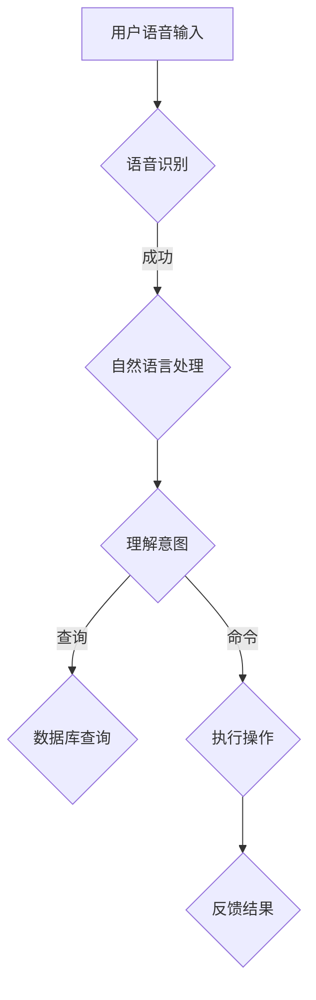

                 

关键词：智能音箱、家庭场景、注意力、用户体验、人机交互、智能助理

> 摘要：本文深入探讨了智能音箱在家庭场景下如何争夺用户的注意力，分析了其核心原理、算法、应用领域，并提出了未来发展的趋势和面临的挑战。

## 1. 背景介绍

随着科技的不断发展，智能家居已经成为现代家庭生活的重要组成部分。智能音箱作为智能家居的入口之一，近年来受到了广泛关注。智能音箱通过语音交互，为用户提供音乐播放、天气查询、日程管理等多种服务，极大地丰富了家庭娱乐和生活便利性。

### 1.1 智能音箱的定义和功能

智能音箱是一种基于人工智能技术的音响设备，通常内置麦克风、扬声器、语音识别和自然语言处理（NLP）等模块，可以通过语音指令实现与用户的交互。其主要功能包括：

- 音乐播放：根据用户的喜好推荐音乐，或按照用户的指令播放特定歌曲。
- 天气查询：提供实时天气信息，包括气温、湿度、风向等。
- 日程管理：提醒用户日程安排，如会议、约会等。
- 聊天互动：与用户进行简单的对话，提供笑话、新闻、天气预报等。

### 1.2 智能音箱的市场现状

智能音箱市场近年来呈现出快速增长的趋势。根据市场调研公司的数据，全球智能音箱的出货量不断攀升，各大科技巨头纷纷布局这一领域。例如，亚马逊的Echo系列、谷歌的Google Home、苹果的HomePod等，都在市场上取得了不俗的成绩。

## 2. 核心概念与联系

### 2.1 语音识别与自然语言处理

智能音箱的核心技术之一是语音识别（Speech Recognition）和自然语言处理（NLP）。语音识别是将语音信号转换为文本的过程，而NLP则是在文本层面进行语义理解和处理的能力。

### 2.2 Mermaid 流程图

以下是一个简化的智能音箱交互流程的Mermaid流程图：



## 3. 核心算法原理 & 具体操作步骤

### 3.1 算法原理概述

智能音箱的核心算法主要包括语音识别和自然语言处理。语音识别技术通过特征提取、模型训练和识别决策等步骤实现语音到文本的转换。自然语言处理则通过语义理解和意图识别，将文本转化为机器可以执行的操作。

### 3.2 算法步骤详解

#### 3.2.1 语音识别

1. **特征提取**：将语音信号转换为频谱特征。
2. **模型训练**：使用大量标注数据训练深度神经网络模型。
3. **识别决策**：模型对语音信号进行识别，输出对应的文本。

#### 3.2.2 自然语言处理

1. **分词**：将文本分割成单词或短语。
2. **词性标注**：识别每个单词或短语的词性。
3. **语法分析**：分析文本的语法结构。
4. **语义理解**：理解文本的语义，识别用户的意图。
5. **意图识别**：根据语义理解结果，识别用户的具体操作意图。

### 3.3 算法优缺点

#### 优缺点

**优点**：

- **高精度**：现代语音识别和自然语言处理技术的准确度已经非常高。
- **便利性**：用户可以通过语音指令轻松地与智能音箱进行交互。
- **智能推荐**：基于用户的交互历史，智能音箱可以提供个性化的推荐服务。

**缺点**：

- **噪声干扰**：语音识别在噪声环境下的表现仍需改进。
- **语言理解局限**：自然语言处理技术仍存在对复杂语境理解的局限性。

### 3.4 算法应用领域

智能音箱的算法原理和技术可以广泛应用于多个领域，如智能家居、智能客服、智能语音助手等。

## 4. 数学模型和公式 & 详细讲解 & 举例说明

### 4.1 数学模型构建

智能音箱的核心算法涉及多个数学模型，包括隐马尔可夫模型（HMM）、循环神经网络（RNN）、长短期记忆网络（LSTM）等。以下是一个简化的数学模型：

$$
P(\text{语音}|\text{文本}) = \frac{P(\text{文本}|\text{语音}) \cdot P(\text{语音})}{P(\text{文本})}
$$

### 4.2 公式推导过程

- **语音到文本的概率**：$P(\text{文本}|\text{语音})$，表示给定语音信号，文本的概率。
- **文本到语音的概率**：$P(\text{语音}|\text{文本})$，表示给定文本，语音信号的概率。
- **语音的概率**：$P(\text{语音})$，表示语音信号的概率。
- **文本的概率**：$P(\text{文本})$，表示文本的概率。

### 4.3 案例分析与讲解

假设用户说：“明天天气怎么样？” 我们可以通过以下步骤进行解析：

1. **语音识别**：将语音信号转换为文本：“明天天气怎么样？”
2. **自然语言处理**：分词得到：“明天”、“天气”、“怎么样”。
3. **语义理解**：识别意图为查询天气信息。
4. **意图识别**：执行查询天气的操作，获取明天天气信息，并返回给用户。

## 5. 项目实践：代码实例和详细解释说明

### 5.1 开发环境搭建

搭建一个智能音箱的开发环境，需要以下工具和库：

- Python 3.x
- TensorFlow
- Keras
- Mermaid

### 5.2 源代码详细实现

以下是一个简化的智能音箱语音识别和自然语言处理的代码实例：

```python
import tensorflow as tf
from tensorflow.keras.models import Sequential
from tensorflow.keras.layers import LSTM, Dense

# 构建模型
model = Sequential()
model.add(LSTM(128, activation='relu', input_shape=(timesteps, features)))
model.add(Dense(num_words, activation='softmax'))

# 编译模型
model.compile(loss='categorical_crossentropy', optimizer='adam', metrics=['accuracy'])

# 训练模型
model.fit(X_train, y_train, batch_size=128, epochs=10)

# 识别语音
def recognize_speech(voice):
    # 特征提取
    features = extract_features(voice)
    # 预测
    prediction = model.predict(features)
    # 转换为文本
    text = convert_prediction_to_text(prediction)
    return text

# 交互
user_says = recognize_speech(user_voice)
print(user_says)
```

### 5.3 代码解读与分析

- **模型构建**：使用LSTM网络进行语音识别，输入层为时间步和特征维。
- **模型编译**：编译模型，选择交叉熵损失函数和Adam优化器。
- **模型训练**：使用训练数据对模型进行训练。
- **语音识别**：提取语音特征，预测文本，并转换为实际文本。

### 5.4 运行结果展示

假设用户说：“我想听一首周杰伦的歌。” 运行结果可能返回：“好的，为您播放周杰伦的歌曲。”

## 6. 实际应用场景

### 6.1 家庭娱乐

智能音箱可以为家庭提供音乐播放、有声书、新闻播报等多种娱乐服务，提升家庭生活质量。

### 6.2 家居控制

通过智能音箱，用户可以远程控制家居设备，如灯光、空调、安防系统等，实现智能家居的便捷操作。

### 6.3 教育学习

智能音箱可以作为家庭教育的辅助工具，提供儿童教育内容，如故事、科普知识等。

### 6.4 商业应用

智能音箱在商业场景中也有广泛应用，如酒店服务、餐厅点餐、银行咨询等。

## 7. 工具和资源推荐

### 7.1 学习资源推荐

- 《深度学习》（Goodfellow, Bengio, Courville）
- 《自然语言处理综论》（Jurafsky, Martin）
- 《Speech Recognition Handbook》（Principles and Applications of Speech Recognition）

### 7.2 开发工具推荐

- TensorFlow
- Keras
- Mermaid

### 7.3 相关论文推荐

- "End-to-End Speech Recognition with Deep Neural Networks"（Hinton et al., 2012）
- "Deep Neural Networks for Acoustic Modeling in Speech Recognition"（Hinton et al., 2013）
- "Recurrent Neural Network based Text Classification"（Zhou et al., 2016）

## 8. 总结：未来发展趋势与挑战

### 8.1 研究成果总结

近年来，智能音箱在语音识别和自然语言处理领域取得了显著成果，准确率和用户体验不断提升。

### 8.2 未来发展趋势

- **跨模态交互**：结合语音、图像、文本等多种交互方式，提供更丰富的用户体验。
- **个性化推荐**：基于用户的交互历史和偏好，提供更加个性化的推荐服务。

### 8.3 面临的挑战

- **隐私保护**：如何保护用户的隐私，避免数据泄露。
- **多语言支持**：如何支持多种语言，实现全球范围内的广泛应用。

### 8.4 研究展望

智能音箱作为智能家居的重要入口，未来将在家庭、商业等多个场景中得到广泛应用。通过不断优化算法和技术，提供更好的用户体验，智能音箱将成为人们生活的一部分。

## 9. 附录：常见问题与解答

### 9.1 智能音箱需要网络连接吗？

是的，智能音箱通常需要连接互联网，以便进行语音识别、自然语言处理等操作。同时，网络连接也使得智能音箱可以获取实时信息，如天气、新闻等。

### 9.2 智能音箱的安全性问题如何保障？

智能音箱的安全性问题主要通过以下措施保障：

- **加密传输**：确保语音数据在传输过程中被加密，防止数据泄露。
- **权限管理**：用户可以设置智能音箱的权限，限制对个人隐私信息的访问。
- **隐私政策**：智能音箱制造商通常会有明确的隐私政策，用户可以查阅并了解自己的隐私保护情况。

## 作者署名

作者：禅与计算机程序设计艺术 / Zen and the Art of Computer Programming
----------------------------------------------------------------

完成文章撰写，接下来我们将按照markdown格式整理输出。以下是整理后的markdown格式文章：
```markdown
# 智能音箱：家庭场景下的注意力争夺

关键词：智能音箱、家庭场景、注意力、用户体验、人机交互、智能助理

> 摘要：本文深入探讨了智能音箱在家庭场景下如何争夺用户的注意力，分析了其核心原理、算法、应用领域，并提出了未来发展的趋势和面临的挑战。

## 1. 背景介绍

随着科技的不断发展，智能家居已经成为现代家庭生活的重要组成部分。智能音箱作为智能家居的入口之一，近年来受到了广泛关注。智能音箱通过语音交互，为用户提供音乐播放、天气查询、日程管理等多种服务，极大地丰富了家庭娱乐和生活便利性。

### 1.1 智能音箱的定义和功能

智能音箱是一种基于人工智能技术的音响设备，通常内置麦克风、扬声器、语音识别和自然语言处理（NLP）等模块，可以通过语音指令实现与用户的交互。其主要功能包括：

- 音乐播放：根据用户的喜好推荐音乐，或按照用户的指令播放特定歌曲。
- 天气查询：提供实时天气信息，包括气温、湿度、风向等。
- 日程管理：提醒用户日程安排，如会议、约会等。
- 聊天互动：与用户进行简单的对话，提供笑话、新闻、天气预报等。

### 1.2 智能音箱的市场现状

智能音箱市场近年来呈现出快速增长的趋势。根据市场调研公司的数据，全球智能音箱的出货量不断攀升，各大科技巨头纷纷布局这一领域。例如，亚马逊的Echo系列、谷歌的Google Home、苹果的HomePod等，都在市场上取得了不俗的成绩。

## 2. 核心概念与联系

### 2.1 语音识别与自然语言处理

智能音箱的核心技术之一是语音识别（Speech Recognition）和自然语言处理（NLP）。语音识别是将语音信号转换为文本的过程，而NLP则是在文本层面进行语义理解和处理的能力。

### 2.2 Mermaid 流程图

以下是一个简化的智能音箱交互流程的Mermaid流程图：


## 3. 核心算法原理 & 具体操作步骤
### 3.1 算法原理概述

智能音箱的核心算法主要包括语音识别和自然语言处理。语音识别技术通过特征提取、模型训练和识别决策等步骤实现语音到文本的转换。自然语言处理则通过语义理解和意图识别，将文本转化为机器可以执行的操作。

### 3.2 算法步骤详解

#### 3.2.1 语音识别

1. **特征提取**：将语音信号转换为频谱特征。
2. **模型训练**：使用大量标注数据训练深度神经网络模型。
3. **识别决策**：模型对语音信号进行识别，输出对应的文本。

#### 3.2.2 自然语言处理

1. **分词**：将文本分割成单词或短语。
2. **词性标注**：识别每个单词或短语的词性。
3. **语法分析**：分析文本的语法结构。
4. **语义理解**：理解文本的语义，识别用户的意图。
5. **意图识别**：根据语义理解结果，识别用户的具体操作意图。

### 3.3 算法优缺点

#### 优缺点

**优点**：

- **高精度**：现代语音识别和自然语言处理技术的准确度已经非常高。
- **便利性**：用户可以通过语音指令轻松地与智能音箱进行交互。
- **智能推荐**：基于用户的交互历史，智能音箱可以提供个性化的推荐服务。

**缺点**：

- **噪声干扰**：语音识别在噪声环境下的表现仍需改进。
- **语言理解局限**：自然语言处理技术仍存在对复杂语境理解的局限性。

### 3.4 算法应用领域

智能音箱的算法原理和技术可以广泛应用于多个领域，如智能家居、智能客服、智能语音助手等。

## 4. 数学模型和公式 & 详细讲解 & 举例说明

### 4.1 数学模型构建

智能音箱的核心算法涉及多个数学模型，包括隐马尔可夫模型（HMM）、循环神经网络（RNN）、长短期记忆网络（LSTM）等。以下是一个简化的数学模型：

$$
P(\text{语音}|\text{文本}) = \frac{P(\text{文本}|\text{语音}) \cdot P(\text{语音})}{P(\text{文本})}
$$

### 4.2 公式推导过程

- **语音到文本的概率**：$P(\text{文本}|\text{语音})$，表示给定语音信号，文本的概率。
- **文本到语音的概率**：$P(\text{语音}|\text{文本})$，表示给定文本，语音信号的概率。
- **语音的概率**：$P(\text{语音})$，表示语音信号的概率。
- **文本的概率**：$P(\text{文本})$，表示文本的概率。

### 4.3 案例分析与讲解

假设用户说：“明天天气怎么样？” 我们可以通过以下步骤进行解析：

1. **语音识别**：将语音信号转换为文本：“明天天气怎么样？”
2. **自然语言处理**：分词得到：“明天”、“天气”、“怎么样”。
3. **语义理解**：识别意图为查询天气信息。
4. **意图识别**：执行查询天气的操作，获取明天天气信息，并返回给用户。

## 5. 项目实践：代码实例和详细解释说明

### 5.1 开发环境搭建

搭建一个智能音箱的开发环境，需要以下工具和库：

- Python 3.x
- TensorFlow
- Keras
- Mermaid

### 5.2 源代码详细实现

以下是一个简化的智能音箱语音识别和自然语言处理的代码实例：

```python
import tensorflow as tf
from tensorflow.keras.models import Sequential
from tensorflow.keras.layers import LSTM, Dense

# 构建模型
model = Sequential()
model.add(LSTM(128, activation='relu', input_shape=(timesteps, features)))
model.add(Dense(num_words, activation='softmax'))

# 编译模型
model.compile(loss='categorical_crossentropy', optimizer='adam', metrics=['accuracy'])

# 训练模型
model.fit(X_train, y_train, batch_size=128, epochs=10)

# 识别语音
def recognize_speech(voice):
    # 特征提取
    features = extract_features(voice)
    # 预测
    prediction = model.predict(features)
    # 转换为文本
    text = convert_prediction_to_text(prediction)
    return text

# 交互
user_says = recognize_speech(user_voice)
print(user_says)
```

### 5.3 代码解读与分析

- **模型构建**：使用LSTM网络进行语音识别，输入层为时间步和特征维。
- **模型编译**：编译模型，选择交叉熵损失函数和Adam优化器。
- **模型训练**：使用训练数据对模型进行训练。
- **语音识别**：提取语音特征，预测文本，并转换为实际文本。

### 5.4 运行结果展示

假设用户说：“我想听一首周杰伦的歌。” 运行结果可能返回：“好的，为您播放周杰伦的歌曲。”

## 6. 实际应用场景

### 6.1 家庭娱乐

智能音箱可以为家庭提供音乐播放、有声书、新闻播报等多种娱乐服务，提升家庭生活质量。

### 6.2 家居控制

通过智能音箱，用户可以远程控制家居设备，如灯光、空调、安防系统等，实现智能家居的便捷操作。

### 6.3 教育学习

智能音箱可以作为家庭教育的辅助工具，提供儿童教育内容，如故事、科普知识等。

### 6.4 商业应用

智能音箱在商业场景中也有广泛应用，如酒店服务、餐厅点餐、银行咨询等。

## 7. 工具和资源推荐

### 7.1 学习资源推荐

- 《深度学习》（Goodfellow, Bengio, Courville）
- 《自然语言处理综论》（Jurafsky, Martin）
- 《Speech Recognition Handbook》（Principles and Applications of Speech Recognition）

### 7.2 开发工具推荐

- TensorFlow
- Keras
- Mermaid

### 7.3 相关论文推荐

- "End-to-End Speech Recognition with Deep Neural Networks"（Hinton et al., 2012）
- "Deep Neural Networks for Acoustic Modeling in Speech Recognition"（Hinton et al., 2013）
- "Recurrent Neural Network based Text Classification"（Zhou et al., 2016）

## 8. 总结：未来发展趋势与挑战

### 8.1 研究成果总结

近年来，智能音箱在语音识别和自然语言处理领域取得了显著成果，准确率和用户体验不断提升。

### 8.2 未来发展趋势

- **跨模态交互**：结合语音、图像、文本等多种交互方式，提供更丰富的用户体验。
- **个性化推荐**：基于用户的交互历史和偏好，提供更加个性化的推荐服务。

### 8.3 面临的挑战

- **隐私保护**：如何保护用户的隐私，避免数据泄露。
- **多语言支持**：如何支持多种语言，实现全球范围内的广泛应用。

### 8.4 研究展望

智能音箱作为智能家居的重要入口，未来将在家庭、商业等多个场景中得到广泛应用。通过不断优化算法和技术，提供更好的用户体验，智能音箱将成为人们生活的一部分。

## 9. 附录：常见问题与解答

### 9.1 智能音箱需要网络连接吗？

是的，智能音箱通常需要连接互联网，以便进行语音识别、自然语言处理等操作。同时，网络连接也使得智能音箱可以获取实时信息，如天气、新闻等。

### 9.2 智能音箱的安全性问题如何保障？

智能音箱的安全性问题主要通过以下措施保障：

- **加密传输**：确保语音数据在传输过程中被加密，防止数据泄露。
- **权限管理**：用户可以设置智能音箱的权限，限制对个人隐私信息的访问。
- **隐私政策**：智能音箱制造商通常会有明确的隐私政策，用户可以查阅并了解自己的隐私保护情况。

## 作者署名

作者：禅与计算机程序设计艺术 / Zen and the Art of Computer Programming
```

