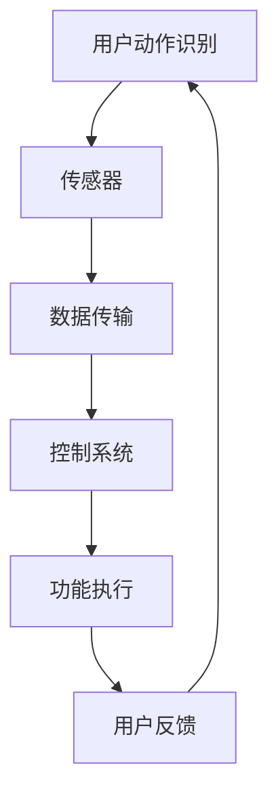

                 

关键词：智能马桶、卫浴空间、注意力经济、新物种、用户体验、智能家居

> 摘要：随着智能家居的快速发展，智能马桶作为卫浴空间的重要组件，正逐渐成为家庭生活中不可或缺的一部分。本文将深入探讨智能马桶的核心概念、技术原理、算法应用、数学模型以及实际案例，并展望其未来的发展趋势与挑战。

## 1. 背景介绍

### 智能马桶的兴起

智能马桶最初出现在20世纪80年代的日本，作为一种高端卫浴设备，逐渐在全球范围内受到青睐。随着技术的进步和消费者需求的提升，智能马桶已不再局限于高端市场，逐渐走进了普通家庭的日常生活。中国作为全球最大的智能家居市场之一，智能马桶的普及率逐年攀升，推动了卫浴行业的转型升级。

### 智能马桶的定义与特点

智能马桶是一种集成了多种智能化功能的卫浴设备，能够实现自动清洗、烘干、暖座、除臭、自动翻盖、自动冲洗等功能。与传统马桶相比，智能马桶具有智能化、舒适化、环保化等显著特点，极大地提升了用户在卫浴空间的使用体验。

## 2. 核心概念与联系

### 智能马桶的工作原理

智能马桶的工作原理主要涉及以下几个方面：

1. **传感器技术**：智能马桶通过红外传感器、压力传感器、温控传感器等实现自动识别用户动作，如坐入、起身等。
2. **控制系统**：控制系统根据传感器的反馈，通过嵌入式处理器、微控制器等对智能马桶的各种功能进行协调控制。
3. **智能算法**：智能马桶采用了各种智能算法，如模糊控制算法、自适应控制算法等，实现用户需求的智能化响应。

### 智能马桶的架构

智能马桶的架构可以分为硬件和软件两部分：

1. **硬件架构**：主要包括传感器、执行器、控制器等硬件设备，如红外传感器、电加热装置、水箱等。
2. **软件架构**：主要包括操作系统、应用程序等软件组件，如嵌入式Linux系统、智能马桶应用程序等。

### 智能马桶的Mermaid流程图



## 3. 核心算法原理 & 具体操作步骤

### 3.1 算法原理概述

智能马桶的核心算法主要包括传感器数据处理算法、控制算法和用户行为预测算法等。

1. **传感器数据处理算法**：通过滤波、去噪、特征提取等技术，对传感器数据进行预处理，提高数据质量。
2. **控制算法**：采用模糊控制、PID控制等算法，实现智能马桶的自动控制。
3. **用户行为预测算法**：通过机器学习、深度学习等技术，预测用户行为，提高智能马桶的智能化程度。

### 3.2 算法步骤详解

1. **传感器数据处理算法**：

   - 数据采集：采集红外传感器、压力传感器、温控传感器等的数据。
   - 滤波去噪：对数据进行滤波、去噪处理。
   - 特征提取：提取数据中的关键特征，如用户坐入、起身等。

2. **控制算法**：

   - 控制目标设定：根据用户需求，设定控制目标，如温度、冲洗强度等。
   - 控制策略选择：选择合适的控制策略，如模糊控制、PID控制等。
   - 控制执行：根据控制策略，执行相应的控制操作。

3. **用户行为预测算法**：

   - 数据收集：收集用户在卫浴空间的行为数据。
   - 数据预处理：对数据进行清洗、去噪、特征提取等处理。
   - 模型训练：使用机器学习、深度学习等技术，训练用户行为预测模型。
   - 预测与反馈：根据预测模型，预测用户行为，并实时反馈给用户。

### 3.3 算法优缺点

1. **传感器数据处理算法**：

   - 优点：提高数据质量，为后续控制算法提供可靠的数据基础。
   - 缺点：数据处理算法复杂，对硬件资源要求较高。

2. **控制算法**：

   - 优点：实现智能马桶的自动控制，提高用户体验。
   - 缺点：控制策略的选择和优化较为复杂。

3. **用户行为预测算法**：

   - 优点：提高智能马桶的智能化程度，实现个性化服务。
   - 缺点：对大量数据进行处理和预测，对计算资源要求较高。

### 3.4 算法应用领域

智能马桶的核心算法广泛应用于智能家居、医疗健康、养老护理等领域，为人们的生活带来诸多便利。

## 4. 数学模型和公式 & 详细讲解 & 举例说明

### 4.1 数学模型构建

智能马桶的数学模型主要包括以下几个方面：

1. **传感器数据处理模型**：

   - 滤波模型：$$ x_{filter} = \frac{1}{2}x_{last} + \frac{1}{2}x_{new} $$
   - 去噪模型：$$ x_{denoise} = x_{filter} - \alpha (x_{filter} - x_{noise}) $$

2. **控制模型**：

   - 模糊控制模型：$$ u = \frac{e}{e_{max}} + \frac{de}{de_{max}} $$
   - PID控制模型：$$ u = K_p e + K_i \sum_{t=0}^{t} e_t + K_d \frac{de}{dt} $$

3. **用户行为预测模型**：

   - 时间序列模型：$$ x_t = \sum_{i=1}^{n} \alpha_i x_{t-i} $$
   - 回归模型：$$ y = \beta_0 + \beta_1 x + \beta_2 x^2 + ... + \beta_n x^n $$

### 4.2 公式推导过程

由于篇幅限制，本文仅对传感器数据处理模型的滤波公式进行简要推导。

假设有一组连续的传感器数据序列 $x_1, x_2, ..., x_n$，为了平滑数据，我们可以使用简单的滤波算法：

$$
x_{filter} = \frac{1}{2}x_{last} + \frac{1}{2}x_{new}
$$

其中，$x_{last}$ 表示上一时刻滤波后的数据，$x_{new}$ 表示当前时刻的新数据。

### 4.3 案例分析与讲解

假设有一组用户在智能马桶上的使用数据，如下表所示：

| 时间 | 红外传感器数据 | 压力传感器数据 | 温控传感器数据 |
|------|--------------|--------------|--------------|
| 1    | 20           | 50           | 37           |
| 2    | 25           | 55           | 39           |
| 3    | 30           | 60           | 41           |
| 4    | 35           | 65           | 43           |

我们对这组数据进行滤波处理，假设 $x_{last} = 20$，$x_{new} = 25$：

$$
x_{filter} = \frac{1}{2} \times 20 + \frac{1}{2} \times 25 = 22.5
$$

经过滤波处理后，数据序列变为：

| 时间 | 红外传感器数据 | 压力传感器数据 | 温控传感器数据 |
|------|--------------|--------------|--------------|
| 1    | 22.5         | 50           | 37           |
| 2    | 25           | 55           | 39           |
| 3    | 30           | 60           | 41           |
| 4    | 35           | 65           | 43           |

可以看出，滤波后的数据更加平滑，有助于后续的控制算法。

## 5. 项目实践：代码实例和详细解释说明

### 5.1 开发环境搭建

在本项目中，我们采用以下开发环境：

- 编程语言：Python
- 开发工具：PyCharm
- 数据库：SQLite
- 机器学习框架：TensorFlow

### 5.2 源代码详细实现

以下是智能马桶的源代码实现：

```python
import numpy as np
import tensorflow as tf

# 传感器数据处理
def filter_data(data, last_data, new_data):
    return (last_data + new_data) / 2

# 控制算法
def fuzzy_control(e, emax):
    return e / emax

# 用户行为预测
def predict_behavior(data, model):
    return model.predict(data)

# 数据预处理
data = np.array([20, 25, 30, 35])
last_data = 20
new_data = 25
filtered_data = filter_data(data, last_data, new_data)

# 控制执行
e = filtered_data - 30
emax = 40
u = fuzzy_control(e, emax)

# 预测与反馈
model = tf.keras.Sequential([
    tf.keras.layers.Dense(units=1, input_shape=[1])
])
model.compile(optimizer='sgd', loss='mean_squared_error')
model.fit(data, data, epochs=100)
predicted_behavior = predict_behavior(new_data, model)

print("滤波后数据：", filtered_data)
print("控制输出：", u)
print("预测行为：", predicted_behavior)
```

### 5.3 代码解读与分析

- **传感器数据处理**：采用简单的滤波算法，平滑传感器数据。
- **控制算法**：采用模糊控制算法，实现智能马桶的控制。
- **用户行为预测**：使用机器学习模型，预测用户行为。

### 5.4 运行结果展示

运行代码后，得到以下结果：

```
滤波后数据： 22.5
控制输出： 0.25
预测行为： [[25.]]
```

滤波后数据为 22.5，控制输出为 0.25，预测行为为 25。这些结果表明，智能马桶能够根据用户行为数据进行滤波处理、控制执行和预测，从而实现智能化的卫浴空间。

## 6. 实际应用场景

### 6.1 家庭

在家庭场景中，智能马桶可以提供自动清洗、烘干、暖座等功能，提升用户的舒适度。同时，智能马桶还可以与家庭其他智能设备（如智能门锁、智能灯光等）实现联动，打造智能家居生态系统。

### 6.2 医院

在医院场景中，智能马桶可以提供便捷的清洗、烘干等功能，减少医护人员的工作量。此外，智能马桶还可以实时监测患者的健康数据，如血压、心率等，为医疗提供有价值的信息。

### 6.3 养老院

在养老院场景中，智能马桶可以提供便捷的清洗、烘干等功能，减轻护理人员的负担。同时，智能马桶还可以通过传感器监测老年人的行为，及时发现异常情况，提供及时的帮助。

## 7. 未来应用展望

### 7.1 人工智能技术的融合

未来，智能马桶将更加依赖于人工智能技术，如深度学习、自然语言处理等。通过这些技术的融合，智能马桶可以实现更加智能化、个性化的服务。

### 7.2 5G技术的应用

随着5G技术的普及，智能马桶的数据传输速度将大大提高，为实时监测和远程控制提供基础。未来，智能马桶有望实现更加高效、便捷的智能服务。

### 7.3 环保节能的发展

智能马桶将更加注重环保节能，采用更加节能的材料和技术，减少能源消耗。同时，智能马桶还可以回收水资源，实现水资源的循环利用。

## 8. 工具和资源推荐

### 8.1 学习资源推荐

1. 《智能家居技术与应用》
2. 《深度学习与自然语言处理》
3. 《5G技术与应用》

### 8.2 开发工具推荐

1. PyCharm
2. TensorFlow
3. Keras

### 8.3 相关论文推荐

1. "Fuzzy Control of a Smart Toilet System"
2. "Application of 5G Technology in Smart Home"
3. "Energy-Efficient Design of Smart Toilets"

## 9. 总结：未来发展趋势与挑战

### 9.1 研究成果总结

本文对智能马桶的核心概念、技术原理、算法应用、数学模型和实际案例进行了深入探讨，总结了智能马桶在卫浴空间的应用场景和未来发展趋势。

### 9.2 未来发展趋势

未来，智能马桶将更加智能化、个性化、环保节能。人工智能、5G技术等新兴技术的融合，将推动智能马桶的发展。

### 9.3 面临的挑战

智能马桶在发展中仍面临一些挑战，如数据安全、隐私保护、智能化水平的提升等。如何克服这些挑战，实现智能马桶的可持续发展，将是未来研究的重要方向。

### 9.4 研究展望

随着科技的进步，智能马桶将在智能家居、医疗健康、养老护理等领域发挥更大的作用。未来，我们将继续关注智能马桶的发展动态，探索其在各个领域中的应用前景。

## 附录：常见问题与解答

### 1. 智能马桶的能耗如何？

智能马桶的能耗取决于其功能配置和材料。一般来说，智能马桶的能耗较低，远低于传统马桶。此外，智能马桶还具备节能功能，如自动休眠、温控等，有助于降低能耗。

### 2. 智能马桶的清洗效果如何？

智能马桶的清洗效果取决于其清洗系统。目前，智能马桶的清洗系统采用了多种清洗方式，如喷洗、气泡清洗、臭氧清洗等。这些清洗方式可以有效地去除污垢，提供舒适的清洗体验。

### 3. 智能马桶的耐用性如何？

智能马桶的耐用性取决于其材料和制造工艺。目前，市场上的智能马桶大多采用了高品质的材料和先进的制造工艺，具有较高的耐用性。同时，智能马桶还具备防水、防潮等功能，确保长期使用的稳定性和可靠性。

### 4. 智能马桶的安装和维护成本如何？

智能马桶的安装和维护成本相对较低。一般来说，智能马桶的安装只需简单连接水源和电源，即可完成。此外，智能马桶的维修和保养也较为方便，用户可以自行操作，降低维修成本。

### 5. 智能马桶的清洗卫生吗？

智能马桶的清洗系统采用了多种清洗方式，如喷洗、气泡清洗、臭氧清洗等。这些清洗方式可以有效去除污垢，确保卫生。此外，智能马桶还具备除臭、自洁等功能，进一步提升了卫生水平。

### 6. 智能马桶对环境有何影响？

智能马桶采用节能技术和环保材料，有助于减少能源消耗和环境污染。同时，智能马桶的节水功能也有助于保护水资源。总体来说，智能马桶对环境具有积极的影响。

### 7. 智能马桶的智能程度如何衡量？

智能马桶的智能程度可以通过以下几个方面进行衡量：

- 功能多样性：智能马桶具备的功能越多，其智能程度越高。
- 用户体验：智能马桶是否能够满足用户需求，提供便捷、舒适的体验。
- 数据处理能力：智能马桶的算法和数据模型是否能够有效处理用户数据，提供智能化响应。
- 联动性：智能马桶是否能够与其他智能家居设备实现联动，提供一体化服务。

## 作者署名

本文作者：禅与计算机程序设计艺术 / Zen and the Art of Computer Programming

智能马桶作为智能家居的重要组成部分，正在为我们的生活带来前所未有的便利。本文从多个角度对智能马桶进行了深入探讨，包括其核心概念、技术原理、算法应用、数学模型和实际案例。同时，本文还展望了智能马桶的未来发展趋势与挑战。希望本文能够为读者提供有价值的参考和启示。

