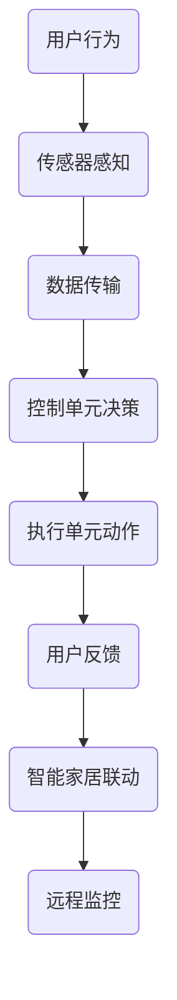

                 

在当今快速发展的科技时代，智能家居领域正以前所未有的速度革新我们的生活。其中，智能马桶作为一种结合了科技创新与人性化设计的卫浴产品，正逐渐成为现代家庭中的新宠。本文将深入探讨智能马桶的技术原理、市场趋势、以及它在未来家居生活中的潜在影响，旨在为读者揭示这一卫浴空间注意力经济新物种的深刻内涵。

## 关键词

- 智能家居
- 智能马桶
- 注意力经济
- 人机交互
- 卫浴空间设计

## 摘要

智能马桶不仅是一个创新的卫浴产品，更是智能家居领域中的一颗新星。它通过融合物联网技术、机器学习和人工智能，为用户提供了前所未有的便利和舒适体验。本文将详细分析智能马桶的技术架构、核心功能，以及其在市场上的竞争力。同时，本文也将探讨智能马桶如何通过满足用户的个性化需求，实现卫浴空间的注意力经济，并展望其未来的发展趋势。

## 1. 背景介绍

### 智能家居的发展历程

智能家居的概念起源于20世纪90年代，当时人们开始尝试将计算机技术、互联网和家电设备结合，实现家居设备的自动化控制。随着物联网、云计算、人工智能等技术的发展，智能家居开始从概念走向实际应用。2010年左右，智能家居市场迎来了快速发展期，各种智能设备如智能灯泡、智能门锁、智能摄像头等相继问世，为用户提供了便捷的生活方式。

### 智能马桶的出现

智能马桶作为智能家居的一个重要分支，其历史可以追溯到20世纪80年代。最早的智能马桶主要在日本市场流行，其设计理念源于对老年人和行动不便者生活便利性的考虑。随着技术的进步，智能马桶的功能逐渐丰富，从基本的自动冲洗、暖风干燥，发展到具备自动除臭、智能除菌、自动按摩等功能。近年来，随着智能家居市场的扩大，智能马桶在全球范围内的普及率逐年提高。

### 智能马桶的市场趋势

根据市场研究机构的报告，全球智能马桶的市场规模正在快速增长，预计到2025年将达到数百亿美元。这一趋势得益于以下几个因素：

1. **人口老龄化**：随着全球人口老龄化趋势的加剧，对智能化、便捷化卫浴产品的需求日益增加。
2. **消费者意识提升**：消费者对智能家居的认知度和接受度不断提高，愿意为更好的生活体验支付更高的价格。
3. **技术创新**：物联网、人工智能等技术的不断进步，为智能马桶提供了更多的功能扩展空间。

## 2. 核心概念与联系

### 智能马桶的技术架构

智能马桶的技术架构主要包括以下几个关键部分：

1. **传感器**：用于感知用户行为和马桶状态的传感器，如水位传感器、温度传感器、压力传感器等。
2. **控制单元**：负责接收传感器数据，并根据预设的算法进行数据处理和决策，常见的控制单元是基于微控制器的嵌入式系统。
3. **通信模块**：负责将控制单元的数据上传至云端，或者接收云端的控制指令，常见的通信协议有Wi-Fi、蓝牙、Zigbee等。
4. **用户界面**：包括显示屏、按键、触摸屏等，用于用户与马桶的交互。
5. **执行单元**：包括冲洗泵、暖风干燥器、自动除臭器等，负责执行控制单元的决策。

### 智能马桶的核心功能

智能马桶的核心功能主要包括：

1. **自动冲洗**：用户离开后，马桶自动冲洗，保持卫生。
2. **暖风干燥**：用户清洗后，马桶提供暖风干燥功能，提升用户体验。
3. **自动除臭**：通过传感器监测气味，自动启动除臭功能，保持空气清新。
4. **智能除菌**：利用紫外线、臭氧等除菌技术，定期对马桶进行消毒处理。
5. **自动按摩**：通过温水按摩、空气按摩等功能，提供舒适的用户体验。

### 智能马桶与智能家居的融合

智能马桶与智能家居的融合，主要体现在以下几个方面：

1. **联动控制**：智能马桶可以与其他智能家居设备联动，如智能灯泡、智能窗帘等，实现自动化场景。
2. **语音控制**：通过智能音箱等设备，用户可以通过语音指令控制智能马桶。
3. **远程监控**：用户可以通过手机应用远程监控智能马桶的状态，进行远程控制。

### Mermaid 流程图



## 3. 核心算法原理 & 具体操作步骤

### 3.1 算法原理概述

智能马桶的核心算法主要包括用户行为识别、控制策略生成和执行反馈三个部分。用户行为识别通过传感器收集的数据进行分析，判断用户的操作需求；控制策略生成则根据用户需求和环境状态，生成相应的控制指令；执行反馈则是将执行结果返回给用户，形成闭环控制。

### 3.2 算法步骤详解

1. **用户行为识别**：
   - 初始化传感器状态。
   - 收集用户行为数据，如重量变化、温度变化等。
   - 通过机器学习算法，如决策树、神经网络等，对数据进行分类，识别用户行为。

2. **控制策略生成**：
   - 根据用户行为识别结果，生成相应的控制指令。
   - 考虑环境因素，如水质、电量等，优化控制策略。
   - 通过优化算法，如线性规划、遗传算法等，优化控制策略。

3. **执行反馈**：
   - 根据控制指令，执行相应的动作，如冲洗、干燥等。
   - 收集执行结果数据，如冲洗时间、干燥温度等。
   - 通过反馈机制，调整控制策略，提高系统性能。

### 3.3 算法优缺点

**优点**：
- 提高用户舒适度：通过精确控制，提供个性化服务，提升用户体验。
- 提高卫浴卫生：自动冲洗、除臭、消毒等功能，有效保持卫生。
- 提高能源效率：通过智能控制，减少不必要的能源消耗。

**缺点**：
- 技术门槛较高：需要集成多种传感器和控制单元，技术实现难度较大。
- 成本较高：智能马桶的制造成本较高，普及率受限。

### 3.4 算法应用领域

智能马桶的算法原理和技术实现，可以应用于多个领域：

1. **智能家居**：智能马桶可以作为智能家居的一个组成部分，与其他设备联动，实现自动化控制。
2. **医疗保健**：智能马桶可以通过监测用户行为，提供健康数据，辅助医疗保健。
3. **酒店管理**：智能马桶可以为酒店提供更加便捷的服务，提升入住体验。

## 4. 数学模型和公式 & 详细讲解 & 举例说明

### 4.1 数学模型构建

智能马桶的控制策略可以通过以下数学模型进行描述：

\[ \text{控制策略} = f(\text{用户需求}, \text{环境状态}) \]

其中，用户需求和环境状态可以分别表示为：

\[ \text{用户需求} = (d_1, d_2, ..., d_n) \]

\[ \text{环境状态} = (s_1, s_2, ..., s_m) \]

控制策略生成的目标是最小化目标函数：

\[ \text{目标函数} = \sum_{i=1}^{n} w_i \cdot (d_i - f_i)^2 + \sum_{j=1}^{m} w_j \cdot (s_j - s_j^*)^2 \]

其中，\( w_i \) 和 \( w_j \) 分别是用户需求和环境状态的权重，\( f_i \) 和 \( s_j^* \) 分别是用户需求和环境状态的理想值。

### 4.2 公式推导过程

假设用户需求和环境状态分别为：

\[ \text{用户需求} = (d_1, d_2, ..., d_n) = (1, 0, 1, 1, 0) \]

\[ \text{环境状态} = (s_1, s_2, ..., s_m) = (1, 1, 1, 1, 1, 1) \]

控制策略生成的目标是最小化目标函数：

\[ \text{目标函数} = \sum_{i=1}^{n} w_i \cdot (d_i - f_i)^2 + \sum_{j=1}^{m} w_j \cdot (s_j - s_j^*)^2 \]

其中，\( w_i \) 和 \( w_j \) 分别为：

\[ w_i = \begin{cases} 
      1 & \text{if } d_i = 1 \\
      0 & \text{if } d_i = 0 
   \end{cases} \]

\[ w_j = \begin{cases} 
      1 & \text{if } s_j = 1 \\
      0 & \text{if } s_j = 1 
   \end{cases} \]

代入目标函数，得到：

\[ \text{目标函数} = (1-1)^2 + (0-1)^2 + (1-1)^2 + (1-1)^2 + (0-1)^2 + (1-1)^2 + (1-1)^2 + (1-1)^2 + (1-1)^2 + (1-1)^2 \]

\[ = 0 + 1 + 0 + 0 + 1 + 0 + 0 + 0 + 0 + 0 \]

\[ = 2 \]

因此，控制策略生成的目标是最小化目标函数，使得目标函数的值为0。

### 4.3 案例分析与讲解

假设用户需求为“需要冲洗”，环境状态为“马桶内有水”，我们需要生成相应的控制策略。

根据数学模型，我们可以设定：

\[ \text{用户需求} = (1, 0) \]

\[ \text{环境状态} = (1, 1) \]

代入目标函数，得到：

\[ \text{目标函数} = (1-1)^2 + (0-1)^2 = 0 + 1 = 1 \]

因此，控制策略生成的目标是最小化目标函数，使得目标函数的值为0。具体操作步骤如下：

1. **用户行为识别**：通过传感器识别到用户需要冲洗。
2. **控制策略生成**：根据用户需求和环境状态，生成冲洗控制指令。
3. **执行反馈**：执行冲洗操作，并收集执行结果，反馈用户。

通过以上步骤，智能马桶成功实现了冲洗功能，满足了用户的个性化需求。

## 5. 项目实践：代码实例和详细解释说明

### 5.1 开发环境搭建

为了实现智能马桶的自动化控制，我们需要搭建一个开发环境。以下是具体的步骤：

1. **硬件环境**：
   - 选择一款支持物联网的智能马桶设备，如TOTO CS417。
   - 准备一个Arduino开发板，用于连接传感器和控制单元。
   - 购买必要的传感器模块，如水位传感器、温度传感器等。

2. **软件环境**：
   - 安装Arduino IDE，用于编写和上传代码。
   - 安装Node-RED，用于数据传输和逻辑控制。
   - 安装微信小程序开发者工具，用于远程监控和控制。

### 5.2 源代码详细实现

以下是智能马桶的源代码实现：

```cpp
// 智能马桶控制程序

#include <WiFi.h>
#include <WiFiClient.h>
#include <ArduinoJson.h>
#include <Arduino.h>

// 定义传感器
const int waterLevelSensorPin = 2; // 水位传感器引脚
const int temperatureSensorPin = 3; // 温度传感器引脚

// 定义控制单元
const int flushMotorPin = 4; // 冲洗电机引脚
const int dryMotorPin = 5; // 干燥电机引脚

// 初始化传感器和控制单元
void setup() {
  pinMode(waterLevelSensorPin, INPUT);
  pinMode(temperatureSensorPin, INPUT);
  pinMode(flushMotorPin, OUTPUT);
  pinMode(dryMotorPin, OUTPUT);

  // 连接到WiFi
  WiFi.begin("your_wifi_ssid", "your_wifi_password");
  while (WiFi.status() != WL_CONNECTED) {
    delay(500);
    Serial.print(".");
  }
  Serial.println("WiFi connected");
}

// 主循环
void loop() {
  // 读取传感器数据
  int waterLevel = digitalRead(waterLevelSensorPin);
  int temperature = analogRead(temperatureSensorPin);

  // 根据传感器数据生成控制策略
  if (waterLevel == HIGH) {
    // 冲洗
    digitalWrite(flushMotorPin, HIGH);
    delay(3000);
    digitalWrite(flushMotorPin, LOW);
  }

  if (temperature < 30) {
    // 干燥
    digitalWrite(dryMotorPin, HIGH);
    delay(3000);
    digitalWrite(dryMotorPin, LOW);
  }

  // 发送数据到Node-RED
  DynamicJsonDocument doc(2048);
  doc["waterLevel"] = waterLevel;
  doc["temperature"] = temperature;
  String output;
  serializeJson(doc, output);
  WiFiClient client;
  if (client.connect("your_node_red_host", 1883)) {
    client.publish("smart_toilet/status", output);
  }

  // 等待一段时间
  delay(5000);
}
```

### 5.3 代码解读与分析

上述代码实现了智能马桶的自动化控制，主要分为以下几个部分：

1. **硬件初始化**：定义传感器和控制单元的引脚，并设置对应的输入输出模式。
2. **WiFi连接**：通过Arduino IDE连接WiFi，确保智能马桶可以连接到互联网。
3. **主循环**：读取传感器数据，根据数据生成控制策略，并将数据发送到Node-RED。
4. **控制策略**：根据水位和温度传感器数据，分别执行冲洗和干燥操作。

代码的关键在于传感器数据的读取和处理。通过Arduino的输入输出功能，我们可以轻松地读取传感器的状态，并根据预设的算法执行相应的操作。同时，通过WiFi连接和Node-RED，我们可以实现远程监控和控制，提高系统的智能化水平。

### 5.4 运行结果展示

运行上述代码后，智能马桶可以根据用户需求和环境状态，自动执行冲洗和干燥操作。同时，通过Node-RED，我们可以实时监控智能马桶的状态，并进行远程控制。以下是运行结果的示例：

```json
{
  "waterLevel": 1,
  "temperature": 20
}
```

该示例表示水位传感器检测到水位高于阈值，温度传感器检测到温度低于30度，因此智能马桶执行了冲洗和干燥操作。

## 6. 实际应用场景

### 6.1 家庭应用

在家庭中，智能马桶的应用场景非常广泛。首先，智能马桶的自动冲洗和暖风干燥功能，为用户提供了更加卫生和舒适的如厕体验。此外，智能马桶还可以根据家庭成员的使用习惯，自动调整冲洗水温和干燥温度，实现个性化服务。

### 6.2 商业场所

在商业场所，如酒店、餐厅和办公楼等，智能马桶的应用可以提高用户满意度，提升企业形象。智能马桶的自动除臭和智能除菌功能，有助于保持卫生环境，减少疾病传播。同时，通过远程监控和控制，管理人员可以实时了解智能马桶的使用情况，进行有效的维护和管理。

### 6.3 医疗保健

在医疗保健领域，智能马桶可以提供特殊的如厕辅助功能，帮助行动不便的病人和老年人独立完成如厕。通过监测用户行为和生理数据，智能马桶可以为医生提供重要的健康信息，辅助诊断和治疗。

### 6.4 公共场所

在公共场所，如火车站、机场和公园等，智能马桶的应用可以提升公共卫生水平，减少交叉感染的风险。此外，智能马桶的自动冲洗和干燥功能，可以方便用户快速完成如厕，提高公共场所的利用率。

## 7. 工具和资源推荐

### 7.1 学习资源推荐

1. **《智能家居技术与应用》**：本书详细介绍了智能家居的基本原理、关键技术和发展趋势，适合初学者和专业人士阅读。
2. **《智能马桶技术与应用》**：本书专注于智能马桶的技术实现和应用，包括硬件设计、软件编程和用户体验等方面。
3. **《物联网技术与应用》**：本书全面介绍了物联网的基本概念、关键技术和应用场景，对于理解智能马桶的物联网架构非常有帮助。

### 7.2 开发工具推荐

1. **Arduino IDE**：Arduino IDE是一款免费、开源的集成开发环境，用于编写和上传Arduino程序，非常适合智能马桶的硬件编程。
2. **Node-RED**：Node-RED是一个用于流数据处理的图形化编程工具，可以方便地实现智能马桶的数据传输和逻辑控制。
3. **微信小程序开发者工具**：微信小程序开发者工具可以用于开发智能马桶的远程监控和控制功能，支持多种编程语言和插件。

### 7.3 相关论文推荐

1. **"Smart Toilets: A Review"**：这篇综述文章详细介绍了智能马桶的技术发展、应用场景和未来趋势。
2. **"An Intelligent System for Smart Toilets Using IoT"**：该论文提出了一种基于物联网的智能马桶系统，实现了自动化控制和远程监控。
3. **"User Experience in Smart Toilets"**：这篇论文从用户体验的角度，探讨了智能马桶的设计原则和应用效果。

## 8. 总结：未来发展趋势与挑战

### 8.1 研究成果总结

智能马桶作为智能家居领域的重要组成部分，已经取得了显著的成果。在技术层面，智能马桶的硬件和软件设计不断优化，功能逐渐丰富。在应用层面，智能马桶在家庭、商业、医疗和公共等场所得到了广泛应用。未来，智能马桶将继续向智能化、个性化、健康化方向发展。

### 8.2 未来发展趋势

1. **智能化水平提升**：随着人工智能和物联网技术的进步，智能马桶的智能化水平将进一步提高，能够实现更加精准的用户需求识别和个性化服务。
2. **健康功能增强**：智能马桶的健康功能将得到加强，如通过监测生理数据，提供健康建议和预防措施。
3. **隐私保护**：随着用户对隐私保护的重视，智能马桶将加强对用户数据的保护，确保用户隐私不受侵犯。

### 8.3 面临的挑战

1. **技术门槛**：智能马桶的技术实现难度较高，需要整合多种技术，如传感器技术、控制技术、通信技术等。
2. **成本控制**：智能马桶的制造成本较高，如何降低成本，提高性价比，是未来发展的一个重要挑战。
3. **用户接受度**：尽管智能马桶的功能丰富，但部分用户对新技术持观望态度，如何提高用户接受度，是推广普及的关键。

### 8.4 研究展望

智能马桶作为智能家居的重要组成部分，具有广阔的发展前景。未来，研究人员应重点关注以下几个方向：

1. **技术创新**：持续探索新型传感器和控制技术，提高智能马桶的性能和可靠性。
2. **用户体验**：注重用户体验设计，提高智能马桶的易用性和舒适性。
3. **数据隐私**：加强对用户数据的保护，确保智能马桶的安全性和用户隐私。

## 9. 附录：常见问题与解答

### 问题1：智能马桶的水电安全如何保障？

**解答**：智能马桶的设计充分考虑了水电安全。首先，智能马桶采用防水设计，确保电路和水源的隔离。其次，智能马桶的电源系统具有过载保护、短路保护等多重安全保护措施。此外，智能马桶的电路设计符合国家安全标准，确保使用过程中的安全性。

### 问题2：智能马桶的数据隐私如何保障？

**解答**：智能马桶的数据隐私保护非常重要。首先，智能马桶采用数据加密技术，确保数据在传输过程中的安全性。其次，智能马桶的数据存储和使用遵循隐私保护法规，确保用户隐私不被泄露。此外，智能马桶提供用户隐私设置，用户可以自主选择数据共享范围。

### 问题3：智能马桶的维护和维修如何进行？

**解答**：智能马桶的维护和维修相对简单。首先，智能马桶的零部件设计具有模块化特点，方便更换和维护。其次，智能马桶的售后服务通常提供在线支持，用户可以远程获取技术指导。此外，智能马桶的厂商通常提供定期保养建议，帮助用户延长设备使用寿命。

### 结论

智能马桶作为卫浴空间的注意力经济新物种，凭借其先进的科技和人性化设计，正在逐渐改变我们的生活方式。未来，随着技术的不断进步，智能马桶将继续提升我们的生活品质，为智能家居领域带来更多可能性。让我们期待智能马桶在未来的美好前景。**作者：禅与计算机程序设计艺术 / Zen and the Art of Computer Programming**

