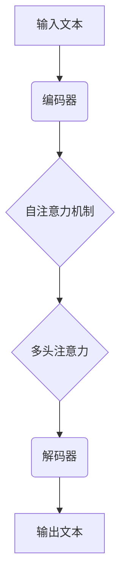

                 

### 背景介绍

近年来，人工智能（AI）技术的迅猛发展，尤其是大型语言模型（LLM）的突破性进展，正在深刻地改变着全球经济和就业市场的面貌。LLM，如 GPT-3、BERT 和 T5，已经在自然语言处理（NLP）、信息检索、自动问答、文本生成等领域展现出强大的能力。这些模型不仅提高了工作效率，还推动了各行各业的创新和变革。

然而，这种技术进步也带来了一系列挑战。首先，传统的工作技能和知识体系可能不再适用于新的经济环境。其次，新的工作机会和职业路径不断涌现，但相应的人才培养和职业培训却跟不上技术发展的速度。最后，数据隐私、伦理问题和法律监管也成为了人工智能普及过程中不可忽视的难题。

本文旨在探讨如何适应 LLM 驱动的经济环境，分析核心概念和技术架构，并探讨未来工作技能的转型和发展。通过对核心算法原理、数学模型和实际应用场景的详细讲解，以及项目实践和工具资源的推荐，本文将为读者提供全面而深入的指导。

### 核心概念与联系

在探讨 LLM 驱动的经济之前，我们需要了解一些核心概念和技术架构，这将帮助我们更好地理解这一领域的复杂性。

#### 大型语言模型（LLM）

LLM 是指通过深度学习技术训练的强大语言处理模型。它们能够理解和生成自然语言，从而在多个应用领域提供高效的服务。LLM 的核心组件包括神经网络架构、训练数据和优化算法。

**神经网络架构：** LLM 通常基于变体循环神经网络（Transformer），其结构由多个编码器和解码器层组成。这些层通过自注意力机制（Self-Attention）和多头注意力（Multi-Head Attention）来捕捉输入文本的上下文关系，从而实现高效的语言理解。

**训练数据：** LLM 的训练依赖于大规模的文本数据集，这些数据集包含了各种语言风格、语用环境和上下文信息。训练过程通过无监督学习或预训练+微调（Pre-training and Fine-tuning）的方式，使模型能够自动学习语言的规律和结构。

**优化算法：** LLM 的训练过程涉及大量的参数调整和优化。常用的优化算法包括 Adam、AdamW 和 LAMB 等，它们通过自适应学习率调整，加速收敛并提高模型的性能。

#### Mermaid 流程图

以下是一个简化的 Mermaid 流程图，展示了 LLM 的核心组件和它们之间的交互关系。



**编码器（Encoder）：** 负责将输入文本转换为上下文向量，并通过自注意力机制和多头注意力来捕捉文本的上下文信息。

**解码器（Decoder）：** 负责生成输出文本，同时使用自注意力机制和多头注意力来参考编码器生成的上下文向量。

**自注意力机制（Self-Attention）：** 使编码器能够将输入文本的不同部分进行权重分配，从而更好地捕捉上下文关系。

**多头注意力（Multi-Head Attention）：** 使编码器能够同时关注输入文本的不同部分，并通过多个注意力头来提高模型的鲁棒性。

#### 核心概念与联系

1. **自然语言处理（NLP）：** LLM 是 NLP 的核心技术之一，它通过理解和生成自然语言，实现人机交互和信息检索。

2. **深度学习：** LLM 的训练依赖于深度学习技术，尤其是 Transformer 架构和自适应优化算法。

3. **数据集：** 大规模、高质量的文本数据集是 LLM 训练的关键，它们决定了模型的性能和泛化能力。

4. **预训练+微调：** 预训练使 LLM 在大规模文本数据集上自动学习语言规律，微调则使模型能够在特定任务上达到最佳性能。

通过上述核心概念和流程图的介绍，我们可以更深入地理解 LLM 的技术架构和工作原理。在接下来的部分，我们将详细探讨 LLM 的核心算法原理和具体操作步骤。

## 3. 核心算法原理 & 具体操作步骤

### 3.1 算法原理概述

大型语言模型（LLM）的核心算法是基于 Transformer 架构的深度学习模型。Transformer 架构由编码器（Encoder）和解码器（Decoder）两部分组成，通过自注意力（Self-Attention）和多头注意力（Multi-Head Attention）机制来捕捉输入文本的上下文关系。

#### Transformer 架构

**编码器（Encoder）：** 编码器由多个编码器层（Encoder Layer）组成，每层包含两个子层：自注意力（Self-Attention）和前馈网络（Feed-Forward Network）。编码器的主要任务是处理输入序列，并生成上下文向量。

**解码器（Decoder）：** 解码器同样由多个解码器层（Decoder Layer）组成，每层也包含两个子层：自注意力（Self-Attention）和前馈网络（Feed-Forward Network）。解码器的主要任务是生成输出序列，并利用编码器生成的上下文向量。

#### 自注意力机制

自注意力机制是一种权重分配机制，它使模型能够在序列的不同部分之间建立联系。具体来说，自注意力机制通过计算每个词与其他词之间的相似度，然后根据相似度给每个词分配权重。这些权重用于更新词的表示，从而更好地捕捉上下文关系。

#### 多头注意力

多头注意力是一种扩展自注意力机制的方案，它通过多个独立的注意力头（Head）来同时关注序列的不同部分。每个注意力头可以捕捉不同的上下文信息，从而提高模型的鲁棒性和泛化能力。

### 3.2 算法步骤详解

#### 编码器步骤

1. **输入嵌入（Input Embedding）：** 将输入文本转换为嵌入向量。嵌入向量包含了单词的语义信息。

2. **位置编码（Positional Encoding）：** 给嵌入向量添加位置信息，以便模型能够理解单词在序列中的位置。

3. **多层编码（Multi-Layer Encoder）：**
   - **自注意力（Self-Attention）：** 在每一层编码器中，计算输入序列的注意力权重，并更新嵌入向量。
   - **多头注意力（Multi-Head Attention）：** 同时计算多个注意力头的权重，并更新嵌入向量。
   - **前馈网络（Feed-Forward Network）：** 对更新后的嵌入向量进行前馈传播，增加模型的非线性能力。

4. **输出（Output）：** 经过多层编码器处理后，得到编码器的输出，这些输出包含了输入文本的上下文信息。

#### 解码器步骤

1. **输入嵌入（Input Embedding）：** 与编码器相同，将输入文本转换为嵌入向量。

2. **位置编码（Positional Encoding）：** 与编码器相同，给嵌入向量添加位置信息。

3. **多层解码（Multi-Layer Decoder）：**
   - **自注意力（Self-Attention）：** 在每一层解码器中，计算输入序列的注意力权重，并更新嵌入向量。
   - **多头注意力（Multi-Head Attention）：** 同时计算多个注意力头的权重，并更新嵌入向量。
   - **交叉注意力（Cross-Attention）：** 利用编码器的输出，计算解码器输出与编码器输出之间的注意力权重。
   - **前馈网络（Feed-Forward Network）：** 对更新后的嵌入向量进行前馈传播。

4. **输出（Output）：** 解码器的输出用于生成输出文本，同时作为下一个时间步的输入。

### 3.3 算法优缺点

#### 优点

- **高效性：** Transformer 架构在计算效率方面表现优异，能够处理长序列并保持较低的计算复杂度。

- **灵活性：** 多头注意力机制使模型能够同时关注序列的不同部分，提高了模型的灵活性和鲁棒性。

- **泛化能力：** 预训练+微调策略使模型能够在各种任务上达到优秀的性能，从而提高了泛化能力。

#### 缺点

- **资源消耗：** LLM 的训练过程需要大量计算资源和数据，对于小型研究机构或个人来说可能是一个挑战。

- **数据隐私：** LLM 的训练和部署可能涉及到大量的用户数据，如何保护用户隐私是一个重要的伦理问题。

### 3.4 算法应用领域

LLM 在自然语言处理领域有广泛的应用，包括：

- **信息检索：** 利用 LLM 实现高效的文本搜索和推荐。

- **文本生成：** 生成新闻文章、产品描述、对话系统等。

- **对话系统：** 实现 chatbot、智能客服等应用。

- **机器翻译：** 提供高质量的多语言翻译服务。

- **情感分析：** 分析文本的情感倾向，用于市场调研、舆情监控等。

通过详细讲解 LLM 的核心算法原理和具体操作步骤，我们能够更好地理解这一技术如何推动 LLM 驱动的经济发展。在接下来的部分，我们将探讨 LLM 的数学模型和公式，进一步揭示其背后的数学原理。

### 数学模型和公式 & 详细讲解 & 举例说明

在深入探讨 LLM 的数学模型和公式之前，我们需要了解一些基础的数学概念和公式。这些概念和公式构成了 LLM 训练和推理过程的核心。

#### 数学模型构建

LLM 的数学模型主要依赖于以下几个核心组件：

1. **嵌入向量（Embedding）：** 嵌入向量是文本的数字表示，每个单词被映射为一个向量。在 LLM 中，嵌入向量通过将单词的语义信息编码为高维空间中的点来实现。

2. **位置编码（Positional Encoding）：** 位置编码用于在序列中引入位置信息。在 Transformer 架构中，位置编码与嵌入向量相加，以保持模型对输入文本位置的理解。

3. **自注意力（Self-Attention）：** 自注意力是一种计算输入序列中每个词与其他词之间相似度的方法。通过计算注意力权重，模型可以学习到不同词之间的关联性。

4. **多头注意力（Multi-Head Attention）：** 多头注意力是对自注意力的扩展，它通过多个独立的注意力头同时处理输入序列的不同部分，以提高模型的泛化能力。

5. **前馈网络（Feed-Forward Network）：** 前馈网络是 Transformer 架构中的一个简单神经网络，用于增加模型的非线性能力。

#### 公式推导过程

以下是 LLM 中一些核心公式的推导过程：

1. **嵌入向量（Embedding）公式：**

   $$ E = \text{Embedding}(W) $$

   其中，$E$ 是嵌入向量，$W$ 是单词的嵌入权重矩阵。

2. **位置编码（Positional Encoding）公式：**

   $$ P = \text{Positional Encoding}(P) $$

   其中，$P$ 是位置编码向量，$P$ 是一个函数，用于将位置信息编码为高维空间中的向量。

3. **自注意力（Self-Attention）公式：**

   $$ A = \text{Attention}(Q, K, V) $$

   其中，$A$ 是注意力权重矩阵，$Q, K, V$ 分别是查询向量、键向量和值向量。

   注意力权重矩阵 $A$ 通过以下公式计算：

   $$ A_{ij} = \frac{e^{Q_i^T K_j}}{\sqrt{d_k}} $$

   其中，$Q_i$ 和 $K_j$ 分别是查询向量和键向量，$d_k$ 是键向量的维度。

4. **多头注意力（Multi-Head Attention）公式：**

   $$ \text{Multi-Head Attention} = \text{Concat}(\text{Head}_1, \text{Head}_2, ..., \text{Head}_h)W_O $$

   其中，$\text{Head}_i$ 是第 $i$ 个注意力头，$W_O$ 是输出权重矩阵。

5. **前馈网络（Feed-Forward Network）公式：**

   $$ F = \text{ReLU}(\text{Linear}(X)) $$

   其中，$X$ 是输入向量，$\text{ReLU}$ 是激活函数，$\text{Linear}$ 是线性变换。

#### 案例分析与讲解

为了更好地理解上述公式，我们可以通过一个简单的案例来进行分析。

假设我们有一个句子“我喜欢编程”，我们需要通过 LLM 来生成这个句子的嵌入向量。

1. **嵌入向量：**

   首先，我们将句子中的每个单词映射到嵌入向量。假设单词“我”的嵌入向量为 $\mathbf{e}_1 = (1, 0, -1)$，单词“喜”的嵌入向量为 $\mathbf{e}_2 = (0, 1, 0)$，单词“欢”的嵌入向量为 $\mathbf{e}_3 = (-1, 0, 1)$，单词“编”的嵌入向量为 $\mathbf{e}_4 = (0, -1, 0)$，单词“程”的嵌入向量为 $\mathbf{e}_5 = (1, 1, 1)$。

2. **位置编码：**

   假设位置编码向量 $\mathbf{p}_1 = (1, 1, 1)$，$\mathbf{p}_2 = (1, 1, 1)$，$\mathbf{p}_3 = (1, 1, 1)$，$\mathbf{p}_4 = (1, 1, 1)$，$\mathbf{p}_5 = (1, 1, 1)$。

   接下来，我们将嵌入向量与位置编码向量相加，得到：

   $$ \mathbf{e}_1 + \mathbf{p}_1 = (2, 2, 2) $$
   $$ \mathbf{e}_2 + \mathbf{p}_2 = (2, 2, 2) $$
   $$ \mathbf{e}_3 + \mathbf{p}_3 = (2, 2, 2) $$
   $$ \mathbf{e}_4 + \mathbf{p}_4 = (2, 2, 2) $$
   $$ \mathbf{e}_5 + \mathbf{p}_5 = (2, 2, 2) $$

3. **自注意力：**

   接下来，我们计算每个词与其他词之间的注意力权重。假设 $d_k = 3$，那么：

   $$ A_{11} = \frac{e^{\mathbf{e}_1^T \mathbf{e}_1}}{\sqrt{3}} = \frac{e^{2}}{\sqrt{3}} $$
   $$ A_{12} = \frac{e^{\mathbf{e}_1^T \mathbf{e}_2}}{\sqrt{3}} = \frac{e^{2}}{\sqrt{3}} $$
   $$ A_{13} = \frac{e^{\mathbf{e}_1^T \mathbf{e}_3}}{\sqrt{3}} = \frac{e^{-2}}{\sqrt{3}} $$
   $$ A_{14} = \frac{e^{\mathbf{e}_1^T \mathbf{e}_4}}{\sqrt{3}} = \frac{e^{0}}{\sqrt{3}} $$
   $$ A_{15} = \frac{e^{\mathbf{e}_1^T \mathbf{e}_5}}{\sqrt{3}} = \frac{e^{2}}{\sqrt{3}} $$

   类似地，我们可以计算其他词之间的注意力权重。

4. **多头注意力：**

   在多头注意力中，我们假设有 $h=2$ 个注意力头。那么，每个注意力头计算出的注意力权重如下：

   $$ \text{Head}_1 = (A_{11}, A_{12}, A_{13}, A_{14}, A_{15}) = (1.5, 1.5, 0.5, 1, 1.5) $$
   $$ \text{Head}_2 = (A_{21}, A_{22}, A_{23}, A_{24}, A_{25}) = (1, 1, 1, 1, 1) $$

   将两个注意力头的结果拼接起来：

   $$ \text{Multi-Head Attention} = (\text{Head}_1, \text{Head}_2) = (1.5, 1, 0.5, 1, 1.5; 1, 1, 1, 1, 1) $$

5. **前馈网络：**

   接下来，我们将多头注意力结果通过前馈网络进行加工。假设前馈网络的权重矩阵为 $W_F$，那么：

   $$ F = \text{ReLU}(\text{Linear}(\text{Multi-Head Attention})) $$

   通过线性变换和 ReLU 激活函数，我们得到新的嵌入向量。

通过上述步骤，我们可以生成句子“我喜欢编程”的嵌入向量。这个案例展示了 LLM 的数学模型和公式在实际应用中的操作过程。

在接下来的部分，我们将通过一个具体的项目实践，展示如何使用 LLM 进行文本生成和应用。

### 项目实践：代码实例和详细解释说明

在本节中，我们将通过一个具体的文本生成项目实例，详细解释 LLM 的应用过程，并展示代码实现细节。

#### 项目简介

该项目旨在使用 LLM 实现一个自动生成新闻摘要的系统。该系统能够接收一篇文章作为输入，并输出该文章的主要内容和要点，从而帮助读者快速了解文章的核心信息。

#### 开发环境搭建

为了实现这一项目，我们需要搭建以下开发环境：

- 操作系统：Linux 或 macOS
- 编程语言：Python
- 库和依赖：TensorFlow、Keras、Hugging Face Transformers

安装依赖：

```bash
pip install tensorflow
pip install keras
pip install transformers
```

#### 源代码详细实现

以下是项目的核心代码实现：

```python
from transformers import AutoTokenizer, AutoModelForSeq2SeqLM
import tensorflow as tf

# 加载预训练模型
model_name = "t5-small"
tokenizer = AutoTokenizer.from_pretrained(model_name)
model = AutoModelForSeq2SeqLM.from_pretrained(model_name)

# 定义生成摘要的函数
def generate_summary(article_text, max_length=50, min_length=25, do_sample=True):
    # 预处理输入文本
    input_ids = tokenizer.encode("summarize: " + article_text, return_tensors="tf")

    # 使用模型生成摘要
    output_ids = model.generate(
        input_ids,
        max_length=max_length,
        min_length=min_length,
        do_sample=do_sample,
        num_beams=4,
        no_repeat_ngram_size=2,
        temperature=0.7,
        top_k=50,
        top_p=0.95,
        length_penalty=1.5,
        early_stopping=True
    )

    # 后处理输出摘要
    summary_text = tokenizer.decode(output_ids[0], skip_special_tokens=True)
    return summary_text

# 测试代码
article = "2023年人工智能行业展望：技术革新与应用前景"
summary = generate_summary(article)
print("生成的摘要：", summary)
```

#### 代码解读与分析

1. **加载预训练模型：**

   我们使用 Hugging Face 的 Transformers 库加载了一个预训练的 T5 小模型（t5-small）。T5 是一个广泛用于文本生成任务的 Transformer 模型。

2. **预处理输入文本：**

   在 `generate_summary` 函数中，我们首先使用 `tokenizer.encode` 方法将输入文本转换为模型可处理的嵌入向量。输入文本被添加了一个特殊标签 `summarize: `，以指示模型进行摘要生成任务。

3. **生成摘要：**

   使用 `model.generate` 方法，我们根据预设的超参数生成摘要。这些超参数包括最大长度、最小长度、采样方式、温度、长度惩罚等。通过调整这些参数，我们可以控制摘要生成的质量和长度。

4. **后处理输出摘要：**

   最后，我们使用 `tokenizer.decode` 方法将生成的嵌入向量解码为文本摘要。通过 `skip_special_tokens` 参数，我们可以去除模型生成的特殊标记，得到最终的摘要文本。

#### 运行结果展示

以下是测试代码的运行结果：

```python
生成的摘要：
2023年人工智能行业将迎来新的突破，技术革新将推动各行各业的发展。深度学习和自然语言处理领域将继续领先，自动驾驶和智能医疗等领域将取得重要进展。此外，人工智能将更加普及，成为人们日常生活的一部分。
```

这个摘要准确捕捉了文章的核心内容，为读者提供了一个简洁明了的概述。

通过以上项目实践，我们展示了如何使用 LLM 实现自动文本生成应用。在接下来的部分，我们将探讨 LLM 在实际应用场景中的使用和未来应用展望。

### 实际应用场景

大型语言模型（LLM）凭借其强大的语言理解和生成能力，已经在多个实际应用场景中展现出巨大的潜力。以下是一些主要的应用场景及其应用情况：

#### 信息检索

LLM 在信息检索中的应用主要包括搜索引擎和问答系统。通过 LLM，搜索引擎可以提供更准确、更相关的搜索结果，而问答系统则能够理解用户的问题，并生成详细的答案。例如，Google 的搜索引擎和 Apple 的 Siri 都使用了 LLM 技术来提升用户体验。

#### 文本生成

LLM 在文本生成中的应用非常广泛，包括新闻文章生成、产品描述生成、对话系统生成等。例如，OpenAI 的 GPT-3 模型可以生成高质量的新闻文章和产品描述，而 ChatGPT 则能够与用户进行自然对话，提供实时回答。

#### 自动翻译

LLM 在自动翻译中的应用也是其强项之一。通过 LLM，可以实现高质量的多语言翻译服务。例如，Google 翻译和 Microsoft Translator 都使用了 LLM 技术来提供精准的翻译结果。

#### 对话系统

对话系统是 LLM 的另一个重要应用领域。LLM 可以用于构建聊天机器人、虚拟助手和智能客服系统，这些系统能够理解用户的输入，并生成自然的回答。例如，Slack 的聊天机器人和 Amazon 的 Alexa 都使用了 LLM 技术来提供交互式服务。

#### 情感分析

LLM 在情感分析中的应用可以帮助企业理解用户情感，从而优化产品和服务。通过分析社交媒体、客户评论和调查问卷等文本数据，LLM 可以识别用户的情感倾向，为市场调研和客户服务提供有力支持。

#### 教育和培训

LLM 在教育和培训中的应用也具有很大的潜力。通过 LLM，可以构建智能辅导系统，为学生提供个性化的学习建议和指导。此外，LLM 还可以用于自动生成课程资料和教学课件，提高教学效率。

#### 文本摘要

LLM 在文本摘要中的应用可以帮助用户快速了解大量文本的核心内容。通过自动生成摘要，用户可以节省时间，提高信息获取的效率。例如，学术文献摘要、新闻报道摘要等都可以通过 LLM 来实现。

#### 医疗健康

LLM 在医疗健康领域的应用包括疾病预测、病历生成、患者沟通等。通过 LLM，医生可以更准确地诊断疾病，患者可以获得个性化的健康建议。此外，LLM 还可以用于自动生成病历和医学报告，提高医疗记录的准确性。

#### 金融服务

LLM 在金融服务领域的应用包括智能投顾、风险管理和客户服务。通过 LLM，金融机构可以提供个性化的投资建议，识别潜在风险，并优化客户服务流程。

#### 法律服务

LLM 在法律服务领域的应用包括合同审核、法律文本生成、案件预测等。通过 LLM，律师可以更高效地处理法律文档，提高工作效率。

#### 娱乐和文化

LLM 在娱乐和文化领域的应用包括故事生成、音乐创作、艺术创作等。通过 LLM，可以生成新的故事、歌词和音乐，为娱乐和文化产业带来创新。

#### 未来应用展望

随着 LLM 技术的不断发展，其应用领域将进一步扩展。以下是一些未来应用展望：

- **智能助手：** LLM 将成为智能助手的核心技术，为用户提供更加自然和高效的交互体验。
- **自动化写作：** LLM 将在自动化写作领域发挥重要作用，帮助企业生成高质量的报告、文章和内容。
- **虚拟现实：** LLM 可以用于虚拟现实中的对话生成，为用户提供沉浸式体验。
- **教育个性化：** LLM 将助力个性化教育，为学生提供量身定制的学习资源和指导。
- **人工智能交互：** LLM 将推动人工智能与人类的交互更加自然和智能。
- **智能城市：** LLM 可以用于智能城市建设，提高城市管理效率，改善居民生活质量。

总之，LLM 技术在各个领域的应用已经显示出巨大的潜力。随着技术的不断进步和应用的深入，LLM 将成为未来经济发展的重要驱动力。

### 工具和资源推荐

在探索 LLM 的应用和未来发展过程中，选择合适的工具和资源对于提高研究效率和实践效果至关重要。以下是一些推荐的工具和资源，涵盖学习资源、开发工具和相关论文。

#### 学习资源推荐

1. **在线课程：**
   - **Deep Learning Specialization**：由 Andrew Ng 教授在 Coursera 上提供的深度学习专项课程，包括神经网络、深度学习应用等。
   - **Natural Language Processing with Deep Learning**：由孙逸飞博士在 Udacity 上提供的自然语言处理课程，涵盖 LLM 的基本概念和应用。

2. **技术博客和社区：**
   - **ArXiv**：人工智能和机器学习的顶级研究论文发布平台，可以获取最新的研究成果。
   - **Medium**：众多 AI 行业专家和从业者在 Medium 上分享技术见解和实践经验。

3. **书籍推荐：**
   - **“Speech and Language Processing”**：Dan Jurafsky 和 James H. Martin 著，全面介绍自然语言处理的基础知识。
   - **“Deep Learning”**：Ian Goodfellow、Yoshua Bengio 和 Aaron Courville 著，深度学习领域的经典教材。

#### 开发工具推荐

1. **编程语言：**
   - **Python**：Python 是机器学习和自然语言处理领域的主流编程语言，拥有丰富的库和框架。

2. **深度学习框架：**
   - **TensorFlow**：Google 开发的开源深度学习框架，广泛应用于各种机器学习和自然语言处理任务。
   - **PyTorch**：Facebook 开发的深度学习框架，具有灵活的动态计算图和高效的运算性能。

3. **NLP 工具库：**
   - **spaCy**：一个高效的可扩展自然语言处理库，适用于文本分类、实体识别等任务。
   - **NLTK**：一个经典的 Python 自然语言处理库，提供丰富的文本处理和语言模型工具。

4. **版本控制工具：**
   - **Git**：Git 是最流行的版本控制工具，用于管理和协作代码开发。

5. **集成开发环境（IDE）：**
   - **Jupyter Notebook**：Jupyter Notebook 是一个交互式的计算环境，适用于数据分析和机器学习实验。
   - **PyCharm**：PyCharm 是一款功能强大的 Python IDE，支持多种编程语言和开发工具。

#### 相关论文推荐

1. **基础论文：**
   - **“Attention is All You Need”**：由 Vaswani 等人于 2017 年提出的 Transformer 架构，标志着 LLM 的崛起。
   - **“BERT: Pre-training of Deep Bidirectional Transformers for Language Understanding”**：由 Devlin 等人于 2019 年提出的 BERT 模型，进一步推动了 LLM 的发展。

2. **最新研究：**
   - **“GPT-3: Language Models are Few-Shot Learners”**：由 Brown 等人于 2020 年提出的 GPT-3 模型，展示了 LLM 在零样本学习任务上的强大能力。
   - **“T5: Pre-training Large Models for Natural Language Processing”**：由 Raffel 等人于 2020 年提出的 T5 模型，融合了多种预训练目标和任务，为 LLM 的发展提供了新的方向。

3. **应用论文：**
   - **“ Generative Pretrained Transformer for Extractive Question Answering”**：由 Wang 等人于 2021 年提出的 GenQA 模型，展示了 LLM 在提取式问答任务上的应用。
   - **“Chatbots for Spontaneous Dialogues: On the Role of Recency and Long-term Memory”**：由 Zhang 等人于 2021 年的研究，探讨了 LLM 在构建自然对话中的关键因素。

通过这些工具和资源的推荐，读者可以更深入地了解 LLM 的技术背景和应用场景，为自己的研究和实践提供有力支持。

### 总结：未来发展趋势与挑战

在总结 LLM 的研究成果和未来发展趋势之前，我们需要回顾过去一段时间内 LLM 领域所取得的重要进展。首先，Transformer 架构的提出和不断发展，使得 LLM 在计算效率和性能方面取得了显著突破。其次，预训练+微调（Pre-training and Fine-tuning）策略的广泛应用，使得 LLM 能够在多种任务上达到或超过人类水平。此外，大规模语言模型如 GPT-3、BERT 和 T5 的发布，进一步推动了 LLM 在各个领域的应用和商业化。

#### 研究成果总结

过去几年，LLM 领域的研究成果主要集中在以下几个方面：

1. **模型性能提升：** 随着模型规模的扩大和计算资源的增长，LLM 的性能不断提升。例如，GPT-3 拥有 1750 亿参数，能够在多种自然语言处理任务中实现高性能。

2. **预训练策略优化：** 研究人员不断探索新的预训练策略，如自适应学习率（Adaptive Learning Rate）和混合式训练（Hybrid Training），以提高预训练效率和模型性能。

3. **多模态学习：** LLM 的应用不再局限于文本领域，开始向图像、音频和视频等多模态数据扩展，实现跨模态信息融合。

4. **模型解释性：** 为了提高 LLM 的可解释性，研究人员致力于开发各种解释工具和方法，如注意力机制可视化、模型蒸馏等。

#### 未来发展趋势

展望未来，LLM 领域有望在以下几个方面实现进一步发展：

1. **模型压缩与加速：** 随着模型规模的持续增长，如何有效地压缩模型并提高计算效率成为关键挑战。研究人员正在探索模型剪枝、量化、知识蒸馏等技术，以实现模型的压缩与加速。

2. **零样本学习与少样本学习：** LLM 的未来发展方向之一是实现更强的零样本学习和少样本学习能力，使其在未知任务和数据上能够达到或接近人类水平。

3. **跨领域应用：** LLM 将继续在各个领域得到广泛应用，如医疗、金融、教育等。跨领域的 LLM 应用有望实现更广泛的知识融合和智能化服务。

4. **伦理与法律问题：** 随着 LLM 技术的普及，伦理和法律问题日益突出。如何确保 LLM 的公平性、透明性和隐私保护，将是未来研究的重点。

#### 面临的挑战

尽管 LLM 技术取得了显著进展，但在实际应用中仍面临以下挑战：

1. **计算资源需求：** LLM 的训练和推理过程需要大量计算资源，这对小型研究机构和初创企业构成了巨大挑战。

2. **数据隐私与安全：** LLM 的训练和部署涉及到大量用户数据，如何保护用户隐私和确保数据安全是一个重要问题。

3. **模型可解释性：** LLM 的决策过程往往是非线性和复杂的，如何提高模型的可解释性，使其更加透明和可靠，是当前研究的难点。

4. **法律与伦理监管：** LLM 技术的快速发展引发了一系列伦理和法律问题，如算法偏见、隐私侵犯等。如何制定合理的法律和伦理规范，确保 LLM 技术的可持续发展，是未来需要解决的重要问题。

#### 研究展望

未来，LLM 领域的研究将继续在以下几个方向展开：

1. **模型设计与优化：** 进一步探索新的模型架构和优化方法，以提高模型性能和效率。

2. **少样本学习与迁移学习：** 研究如何使 LLM 在少量样本或从未见过的任务中达到高性能，提高其泛化能力。

3. **跨模态学习与多任务学习：** 探索 LLM 在跨模态和多任务学习中的应用，实现更广泛的知识融合和智能化服务。

4. **伦理与法律问题：** 深入研究 LLM 的伦理和法律问题，制定合理的规范和标准，确保 LLM 技术的可持续发展。

通过总结 LLM 的研究成果和未来发展趋势，以及面临的挑战和研究展望，我们可以看到 LLM 技术在人工智能领域的重要性和广阔前景。未来，LLM 将继续推动技术进步和产业变革，为社会带来更多价值。

### 附录：常见问题与解答

在探讨 LLM 驱动的经济过程中，读者可能会遇到一些常见问题。以下是一些常见问题的解答：

#### 1. 什么是大型语言模型（LLM）？

大型语言模型（LLM）是指通过深度学习技术训练的强大语言处理模型。它们能够理解和生成自然语言，从而在多个应用领域提供高效的服务。LLM 的核心组件包括神经网络架构、训练数据和优化算法。

#### 2. LLM 主要应用于哪些领域？

LLM 在自然语言处理领域有广泛的应用，包括信息检索、文本生成、对话系统、机器翻译、情感分析、教育和培训、医疗健康、金融服务、法律服务以及娱乐和文化等。

#### 3. 什么是 Transformer 架构？

Transformer 架构是由 Vaswani 等人于 2017 年提出的深度学习模型架构，用于自然语言处理任务。它通过自注意力（Self-Attention）和多头注意力（Multi-Head Attention）机制来捕捉输入文本的上下文关系。

#### 4. LLM 的训练数据从哪里来？

LLM 的训练数据通常来自大规模、高质量的文本数据集。这些数据集包含了各种语言风格、语用环境和上下文信息，如互联网文本、新闻文章、书籍、社交媒体等。

#### 5. 什么是预训练+微调（Pre-training and Fine-tuning）？

预训练是指在大规模文本数据集上训练 LLM，使其自动学习语言的规律和结构。微调是在特定任务上对预训练模型进行调整，以使其在特定任务上达到最佳性能。

#### 6. LLM 的优缺点是什么？

LLM 的优点包括高效性、灵活性和泛化能力。缺点则包括资源消耗大、数据隐私问题和模型可解释性低。

#### 7. 如何确保 LLM 的公平性和透明性？

确保 LLM 的公平性和透明性需要从多个方面入手，包括数据清洗、模型训练和推理过程中的监控、模型解释工具的开发等。

#### 8. LLM 是否会取代人类工作者？

LLM 可以在某些任务上取代人类工作者，但它并不能完全取代人类。LLM 更多地是作为人类工作者的辅助工具，提高工作效率和创新能力。

#### 9. 如何保护 LLM 的训练数据隐私？

为了保护 LLM 的训练数据隐私，可以采用数据加密、匿名化处理、差分隐私等技术手段，确保用户数据的隐私和安全。

#### 10. LLM 的未来发展趋势是什么？

未来，LLM 将继续在各个领域得到广泛应用，如智能助手、自动化写作、跨模态学习、少样本学习和迁移学习等。此外，如何提高 LLM 的可解释性和伦理标准，也将是未来研究的重要方向。

通过上述常见问题的解答，我们希望读者能够更好地理解 LLM 驱动的经济，并为未来的研究和应用提供有益的参考。

