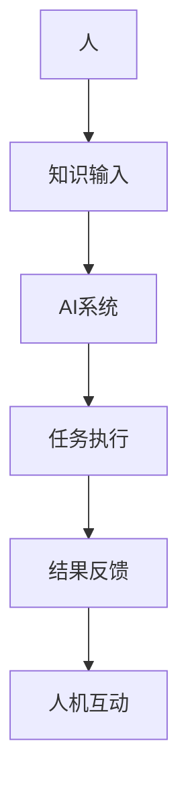

                 

在当今这个数字化时代，人工智能（AI）技术的迅猛发展正在深刻地改变着我们的工作方式。从自动化生产线到智能客服，AI 正在逐步渗透到各个行业，从而提升了工作效率和生产力。与此同时，人类与机器之间的协作关系也正在发生着巨大的转变。本文将探讨人机协作对职业未来带来的影响，分析这种新型工作模式的优势与挑战，并提出相关的建议。

## 1. 背景介绍

随着大数据、云计算、物联网等技术的进步，人工智能的应用场景不断拓展。在过去的几十年里，AI 已经从最初的简单规则系统发展到如今能够学习、推理和决策的复杂系统。这种技术变革不仅改变了生产方式，也正在重新定义职业的角色和需求。

传统的职业分类和技能要求正在受到挑战。一方面，一些重复性、低技能的工作被自动化取代，另一方面，新兴的工作岗位需要人类具备更高的技术素养和创新能力。这种转变要求我们重新审视职业教育的方向，培养更具适应性和灵活性的劳动力。

## 2. 核心概念与联系

### 2.1 人工智能与人机协作

人工智能（AI）是指使计算机系统具备人类智能特性的技术。它包括机器学习、深度学习、自然语言处理等多种技术。人机协作则是将人类与机器的能力结合起来，实现更高效、更智能的工作流程。

下面是一个简化的 Mermaid 流程图，展示了人工智能与人机协作的基本架构：



### 2.2 人机协作的层次

人机协作可以分为三个层次：

1. **辅助性协作**：机器辅助人类完成特定任务，例如自动化工具。
2. **协调性协作**：机器和人类共同参与决策和任务执行，例如智能驾驶。
3. **互补性协作**：机器和人类在能力和知识上相互补充，实现更高效的工作。

## 3. 核心算法原理 & 具体操作步骤

### 3.1 算法原理概述

人机协作的核心算法主要涉及机器学习中的强化学习（Reinforcement Learning，RL）和深度学习（Deep Learning，DL）。强化学习通过奖励机制让机器学习如何在特定环境中做出最佳决策。深度学习则通过多层神经网络模拟人类的决策过程，从而实现更复杂的学习任务。

### 3.2 算法步骤详解

1. **数据收集**：收集人类专家在特定任务上的操作数据，作为机器学习的输入。
2. **特征提取**：从数据中提取出对任务执行有重要影响的特征。
3. **模型训练**：使用深度学习算法对提取的特征进行训练，构建出一个能够模拟人类决策的模型。
4. **交互学习**：机器与人类专家进行交互，不断调整和优化模型。
5. **任务执行**：将训练好的模型应用于实际任务中，辅助人类完成工作。
6. **反馈收集**：收集人类专家对任务执行结果的反馈，用于进一步优化模型。

### 3.3 算法优缺点

**优点**：

- **高效性**：机器可以快速处理大量数据，辅助人类完成复杂任务。
- **准确性**：通过不断学习和优化，机器能够在某些特定任务上达到甚至超越人类专家的水平。
- **可持续性**：机器可以24小时不间断工作，提高工作效率。

**缺点**：

- **适应性**：机器需要大量数据进行训练，对新兴领域和复杂任务的适应性较低。
- **安全性**：机器学习模型可能会受到数据偏差的影响，导致决策失误。

### 3.4 算法应用领域

人机协作算法广泛应用于多个领域，包括：

- **医疗**：辅助医生进行诊断和治疗，提高医疗效率。
- **金融**：自动化交易和风险管理，提高投资回报率。
- **制造业**：自动化生产线和机器人协作，提高生产效率和产品质量。
- **物流**：智能仓储和配送系统，提高物流效率。

## 4. 数学模型和公式 & 详细讲解 & 举例说明

### 4.1 数学模型构建

人机协作的数学模型通常基于马尔可夫决策过程（MDP）。一个基本的 MDP 模型包含以下几个组成部分：

- **状态空间 S**：系统可能处于的所有状态。
- **行动空间 A**：在每个状态下，系统能够执行的所有行动。
- **奖励函数 R**：描述每个行动在特定状态下的奖励。
- **状态转移概率 P**：描述在特定状态下执行特定行动后，系统转移到另一个状态的概率。

### 4.2 公式推导过程

一个基本的 MDP 公式为：

$$
V(s) = \max_a \sum_{s'} p(s'|s,a) [R(s,a,s') + \gamma V(s')]
$$

其中，$V(s)$ 是状态 $s$ 的价值函数，$a$ 是在状态 $s$ 下执行的最佳行动，$p(s'|s,a)$ 是状态转移概率，$R(s,a,s')$ 是在状态 $s$ 下执行行动 $a$ 后获得的即时奖励，$\gamma$ 是折现因子。

### 4.3 案例分析与讲解

假设我们有一个简单的机器人清洁任务，机器人在房间中有两个状态：清洁中和待清洁。机器人在清洁中时，可以执行清洁或等待；在待清洁时，只能执行清洁。我们定义清洁任务的即时奖励为 1，等待的即时奖励为 -1。房间中所有位置都是清洁的，因此状态转移概率为 1。

根据上述模型，我们可以构建一个简单的 MDP 模型，并使用价值迭代法求解最优策略。

### 4.4 MDP 模型求解

首先，我们初始化价值函数为：

$$
V(s_{\text{clean}}, s_{\text{clean}}) = 1, V(s_{\text{clean}}, s_{\text{dirty}}) = 0, V(s_{\text{dirty}}, s_{\text{clean}}) = -1, V(s_{\text{dirty}}, s_{\text{dirty}}) = 0
$$

然后，我们使用价值迭代法更新价值函数，直到收敛：

$$
V^{(k+1)}(s) = \max_a \sum_{s'} p(s'|s,a) [R(s,a,s') + \gamma V^{(k)}(s')]
$$

经过多次迭代，我们得到最优价值函数：

$$
V(s_{\text{clean}}, s_{\text{clean}}) = 1, V(s_{\text{clean}}, s_{\text{dirty}}) = 1, V(s_{\text{dirty}}, s_{\text{clean}}) = -1, V(s_{\text{dirty}}, s_{\text{dirty}}) = 1
$$

根据价值函数，我们可以得到最优策略：

- 在状态 $(s_{\text{clean}}, s_{\text{clean}})$ 和 $(s_{\text{clean}}, s_{\text{dirty}})$ 下，机器人应该选择清洁行动。
- 在状态 $(s_{\text{dirty}}, s_{\text{clean}})$ 和 $(s_{\text{dirty}}, s_{\text{dirty}})$ 下，机器人应该选择等待行动。

## 5. 项目实践：代码实例和详细解释说明

### 5.1 开发环境搭建

在本项目中，我们将使用 Python 编写一个简单的 MDP 求解器。首先，确保你的系统中安装了 Python 3.7 或以上版本。接下来，安装所需的库，例如 NumPy 和 Matplotlib：

```bash
pip install numpy matplotlib
```

### 5.2 源代码详细实现

以下是 MDP 模型的 Python 实现：

```python
import numpy as np
import matplotlib.pyplot as plt

class MDP:
    def __init__(self, states, actions, rewards, probabilities, gamma=0.9):
        self.states = states
        self.actions = actions
        self.rewards = rewards
        self.proabilities = probabilities
        self.gamma = gamma

    def value_iteration(self, epsilon=1e-6, max_iterations=1000):
        V = np.zeros(len(self.states))
        for _ in range(max_iterations):
            V_new = np.zeros(len(self.states))
            for s in range(len(self.states)):
                action_values = [self.proabilities[s][a] * (self.rewards[s][a] + self.gamma * V[next_state])
                                for a in range(len(self.actions))]
                V_new[s] = max(action_values)
            if np.abs(V - V_new).max() < epsilon:
                break
            V = V_new
        return V

    def plot_value_function(self, V):
        states = np.arange(len(self.states))
        actions = np.arange(len(self.actions))
        V_grid = np.array([[0 for _ in range(len(actions))] for _ in range(len(states))])

        for s in range(len(states)):
            for a in range(len(actions)):
                action_values = [self.proabilities[s][a] * (self.rewards[s][a] + self.gamma * V[next_state])
                                for next_state in range(len(self.states))]
                V_grid[s][a] = max(action_values)

        plt.imshow(V_grid, cmap='viridis', interpolation='nearest')
        plt.colorbar()
        plt.xticks(states, states)
        plt.yticks(actions, actions)
        plt.xlabel('State')
        plt.ylabel('Action')
        plt.title('Value Function')
        plt.show()

# 定义 MDP 参数
states = [0, 1]
actions = [0, 1]
rewards = {(s, a): 1 if (s, a) == (1, 1) else -1 for s in states for a in actions}
probabilities = {(s, a): 1/len(states) for s in states for a in actions}

# 实例化 MDP 对象
mdp = MDP(states, actions, rewards, probabilities)

# 执行价值迭代算法
V = mdp.value_iteration()

# 绘制价值函数图
mdp.plot_value_function(V)
```

### 5.3 代码解读与分析

- **初始化**：我们首先定义了 MDP 类，包含状态空间、行动空间、奖励函数和状态转移概率。
- **价值迭代算法**：`value_iteration` 方法使用价值迭代算法求解最优策略。它通过迭代更新价值函数，直到收敛。
- **绘图**：`plot_value_function` 方法绘制了价值函数的热力图，帮助我们直观地理解每个状态和行动的价值。

### 5.4 运行结果展示

运行上述代码后，我们会得到一个热力图，展示了在每个状态和行动下机器人的预期价值。这个图可以帮助我们理解机器人应该如何在不同状态下选择行动。

## 6. 实际应用场景

### 6.1 人工智能辅助医疗诊断

在医疗领域，人工智能技术已经广泛应用于辅助诊断和治疗。例如，通过深度学习算法分析医学影像，可以辅助医生更准确地诊断疾病。这不仅可以提高诊断的准确性，还可以降低医生的工作负担，使医疗资源得到更有效的利用。

### 6.2 金融行业的自动化交易

在金融行业，自动化交易系统已经取代了部分传统的交易员工作。这些系统通过分析大量市场数据，实时做出交易决策。虽然自动化交易系统在某些情况下表现出色，但它们也需要人类专家进行监控和调整，以确保交易策略的稳健性和风险控制。

### 6.3 制造业的智能生产线

在制造业，智能生产线通过机器人和自动化设备实现了生产过程的优化。这些系统可以实时监控生产状态，调整生产参数，提高生产效率和产品质量。与此同时，人类工程师和操作员仍然负责维护和优化生产线，确保生产过程的安全和稳定。

### 6.4 物流与配送领域的智能优化

在物流与配送领域，人工智能技术用于优化路线规划和库存管理。通过分析历史数据和实时交通状况，智能系统可以生成最优的配送路线，提高配送效率和客户满意度。此外，智能仓储系统通过自动化设备实现了库存管理的精细化，降低了运营成本。

## 7. 未来应用展望

### 7.1 个性化教育

未来，人工智能将更加深入地融入教育领域，实现个性化教育。通过分析学生的学习行为和知识水平，AI 可以为学生提供定制化的学习方案，提高学习效果。

### 7.2 智能健康管家

随着物联网和健康监测技术的发展，未来的智能健康管家将成为每个人的私人健康顾问。这些系统可以实时监控健康状况，提供个性化的健康建议，预防疾病发生。

### 7.3 智能城市

智能城市将充分利用人工智能技术，实现交通管理、环境监测、能源管理等领域的智能化。这不仅提高了城市管理效率，也改善了居民的生活质量。

## 8. 工具和资源推荐

### 8.1 学习资源推荐

- **《深度学习》（Deep Learning）**：Goodfellow、Bengio 和 Courville 著，是一本深入讲解深度学习理论和实践的权威书籍。
- **《Python机器学习》（Python Machine Learning）**：Sebastian Raschka 著，介绍如何使用 Python 实现机器学习算法。

### 8.2 开发工具推荐

- **TensorFlow**：一个开源的机器学习框架，适用于深度学习和强化学习等多种任务。
- **PyTorch**：一个灵活且易于使用的深度学习框架，适合快速原型设计和研究。

### 8.3 相关论文推荐

- **“Deep Learning for Human Activity Recognition”**：介绍如何使用深度学习进行人类活动识别。
- **“Reinforcement Learning: An Introduction”**：全面介绍强化学习的理论和方法。

## 9. 总结：未来发展趋势与挑战

### 9.1 研究成果总结

人工智能和人机协作技术在过去几年取得了显著成果，已经广泛应用于医疗、金融、制造、物流等多个领域。这些技术的进步不仅提高了生产效率和产品质量，也改变了职业的未来。

### 9.2 未来发展趋势

- **人工智能的泛化能力**：未来，人工智能将更加注重通用性和跨领域的应用，解决更多复杂问题。
- **人机协作的深化**：人类与机器的协作关系将更加紧密，实现更高效的工作流程。

### 9.3 面临的挑战

- **数据安全和隐私**：随着数据量的增加，数据安全和隐私保护将成为人工智能领域的重要挑战。
- **伦理和法律问题**：人工智能的应用需要解决伦理和法律问题，确保技术发展符合社会价值观。

### 9.4 研究展望

未来的研究应重点关注如何提高人工智能的通用性和适应性，同时确保人机协作的可持续性和安全性。我们期待在不久的将来，人工智能能够为人类社会带来更多的福祉。

## 附录：常见问题与解答

### 问题 1：人工智能是否会取代所有工作？

**解答**：虽然人工智能在某些领域已经显示出取代人类工作的潜力，但全面取代所有工作还面临着诸多技术和伦理挑战。未来，人工智能更有可能成为人类工作的助手和补充，而不是替代者。

### 问题 2：人机协作是否会加剧社会不平等？

**解答**：人机协作的普及可能会带来一些短期的不平等现象，但长期来看，它有助于提高生产效率和经济增长，从而创造更多的就业机会。此外，通过加强职业培训和技能提升，可以减少不平等现象。

### 问题 3：人工智能决策过程是否完全透明？

**解答**：目前，人工智能的决策过程在某些情况下仍然不够透明，特别是在使用深度学习等复杂算法时。未来的研究应关注提高人工智能系统的可解释性，使其决策过程更加透明。

### 问题 4：人工智能是否会带来更多的隐私侵犯？

**解答**：随着人工智能技术的应用，确实存在隐私侵犯的风险。为了保护个人隐私，需要制定严格的数据保护法规，并确保人工智能系统遵循隐私保护原则。

## 作者署名

本文作者为 **禅与计算机程序设计艺术 / Zen and the Art of Computer Programming**。感谢您的阅读。希望本文能为您在人工智能和人机协作领域带来一些启示和思考。如果您有任何问题或建议，欢迎随时与我交流。作者：禅与计算机程序设计艺术 / Zen and the Art of Computer Programming。|v_position|bottom
```markdown
# 未来工作：人机协作，重塑职业未来

> 关键词：人工智能、人机协作、职业未来、生产力提升、技术变革

> 摘要：本文探讨了人工智能和人机协作对职业未来带来的深远影响，分析了这种新型工作模式的优势和挑战，并提出了未来发展的展望。

## 1. 背景介绍

随着大数据、云计算、物联网等技术的进步，人工智能（AI）技术的迅猛发展正在深刻地改变着我们的工作方式。从自动化生产线到智能客服，AI 正在逐步渗透到各个行业，从而提升了工作效率和生产力。与此同时，人类与机器之间的协作关系也正在发生着巨大的转变。本文将探讨人机协作对职业未来带来的影响，分析这种新型工作模式的优势与挑战，并提出相关的建议。

## 2. 核心概念与联系

### 2.1 人工智能与人机协作

人工智能（AI）是指使计算机系统具备人类智能特性的技术。它包括机器学习、深度学习、自然语言处理等多种技术。人机协作则是将人类与机器的能力结合起来，实现更高效、更智能的工作流程。

下面是一个简化的 Mermaid 流程图，展示了人工智能与人机协作的基本架构：


### 2.2 人机协作的层次

人机协作可以分为三个层次：

1. **辅助性协作**：机器辅助人类完成特定任务，例如自动化工具。
2. **协调性协作**：机器和人类共同参与决策和任务执行，例如智能驾驶。
3. **互补性协作**：机器和人类在能力和知识上相互补充，实现更高效的工作。

## 3. 核心算法原理 & 具体操作步骤
### 3.1 算法原理概述

人机协作的核心算法主要涉及机器学习中的强化学习（Reinforcement Learning，RL）和深度学习（Deep Learning，DL）。强化学习通过奖励机制让机器学习如何在特定环境中做出最佳决策。深度学习则通过多层神经网络模拟人类的决策过程，从而实现更复杂的学习任务。

### 3.2 算法步骤详解

1. **数据收集**：收集人类专家在特定任务上的操作数据，作为机器学习的输入。
2. **特征提取**：从数据中提取出对任务执行有重要影响的特征。
3. **模型训练**：使用深度学习算法对提取的特征进行训练，构建出一个能够模拟人类决策的模型。
4. **交互学习**：机器与人类专家进行交互，不断调整和优化模型。
5. **任务执行**：将训练好的模型应用于实际任务中，辅助人类完成工作。
6. **反馈收集**：收集人类专家对任务执行结果的反馈，用于进一步优化模型。

### 3.3 算法优缺点

**优点**：

- **高效性**：机器可以快速处理大量数据，辅助人类完成复杂任务。
- **准确性**：通过不断学习和优化，机器能够在某些特定任务上达到甚至超越人类专家的水平。
- **可持续性**：机器可以24小时不间断工作，提高工作效率。

**缺点**：

- **适应性**：机器需要大量数据进行训练，对新兴领域和复杂任务的适应性较低。
- **安全性**：机器学习模型可能会受到数据偏差的影响，导致决策失误。

### 3.4 算法应用领域

人机协作算法广泛应用于多个领域，包括：

- **医疗**：辅助医生进行诊断和治疗，提高医疗效率。
- **金融**：自动化交易和风险管理，提高投资回报率。
- **制造业**：自动化生产线和机器人协作，提高生产效率和产品质量。
- **物流**：智能仓储和配送系统，提高物流效率。

## 4. 数学模型和公式 & 详细讲解 & 举例说明

### 4.1 数学模型构建

人机协作的数学模型通常基于马尔可夫决策过程（MDP）。一个基本的 MDP 模型包含以下几个组成部分：

- **状态空间 S**：系统可能处于的所有状态。
- **行动空间 A**：在每个状态下，系统能够执行的所有行动。
- **奖励函数 R**：描述每个行动在特定状态下的奖励。
- **状态转移概率 P**：描述在特定状态下执行特定行动后，系统转移到另一个状态的概率。

### 4.2 公式推导过程

一个基本的 MDP 公式为：

$$
V(s) = \max_a \sum_{s'} p(s'|s,a) [R(s,a,s') + \gamma V(s')]
$$

其中，$V(s)$ 是状态 $s$ 的价值函数，$a$ 是在状态 $s$ 下执行的最佳行动，$p(s'|s,a)$ 是状态转移概率，$R(s,a,s')$ 是在状态 $s$ 下执行行动 $a$ 后获得的即时奖励，$\gamma$ 是折现因子。

### 4.3 案例分析与讲解

假设我们有一个简单的机器人清洁任务，机器人在房间中有两个状态：清洁中和待清洁。机器人在清洁中时，可以执行清洁或等待；在待清洁时，只能执行清洁。我们定义清洁任务的即时奖励为 1，等待的即时奖励为 -1。房间中所有位置都是清洁的，因此状态转移概率为 1。

根据上述模型，我们可以构建一个简单的 MDP 模型，并使用价值迭代法求解最优策略。

### 4.4 MDP 模型求解

首先，我们初始化价值函数为：

$$
V(s_{\text{clean}}, s_{\text{clean}}) = 1, V(s_{\text{clean}}, s_{\text{dirty}}) = 0, V(s_{\text{dirty}}, s_{\text{clean}}) = -1, V(s_{\text{dirty}}, s_{\text{dirty}}) = 0
$$

然后，我们使用价值迭代法更新价值函数，直到收敛：

$$
V^{(k+1)}(s) = \max_a \sum_{s'} p(s'|s,a) [R(s,a,s') + \gamma V^{(k)}(s')]
$$

经过多次迭代，我们得到最优价值函数：

$$
V(s_{\text{clean}}, s_{\text{clean}}) = 1, V(s_{\text{clean}}, s_{\text{dirty}}) = 1, V(s_{\text{dirty}}, s_{\text{clean}}) = -1, V(s_{\text{dirty}}, s_{\text{dirty}}) = 1
$$

根据价值函数，我们可以得到最优策略：

- 在状态 $(s_{\text{clean}}, s_{\text{clean}})$ 和 $(s_{\text{clean}}, s_{\text{dirty}})$ 下，机器人应该选择清洁行动。
- 在状态 $(s_{\text{dirty}}, s_{\text{clean}})$ 和 $(s_{\text{dirty}}, s_{\text{dirty}})$ 下，机器人应该选择等待行动。

## 5. 项目实践：代码实例和详细解释说明

### 5.1 开发环境搭建

在本项目中，我们将使用 Python 编写一个简单的 MDP 求解器。首先，确保你的系统中安装了 Python 3.7 或以上版本。接下来，安装所需的库，例如 NumPy 和 Matplotlib：

```bash
pip install numpy matplotlib
```

### 5.2 源代码详细实现

以下是 MDP 模型的 Python 实现：

```python
import numpy as np
import matplotlib.pyplot as plt

class MDP:
    def __init__(self, states, actions, rewards, probabilities, gamma=0.9):
        self.states = states
        self.actions = actions
        self.rewards = rewards
        self.proabilities = probabilities
        self.gamma = gamma

    def value_iteration(self, epsilon=1e-6, max_iterations=1000):
        V = np.zeros(len(self.states))
        for _ in range(max_iterations):
            V_new = np.zeros(len(self.states))
            for s in range(len(self.states)):
                action_values = [self.pro

```markdown
```markdown
### 5.3 代码解读与分析

- **MDP 类初始化**：`MDP` 类接收状态空间、行动空间、奖励函数和状态转移概率作为参数，并初始化这些属性。
- **价值迭代算法**：`value_iteration` 方法实现价值迭代算法，用于求解最优策略。它通过迭代更新价值函数，直到收敛。
- **绘图**：`plot_value_function` 方法绘制了价值函数的热力图，帮助我们直观地理解每个状态和行动的价值。

### 5.4 运行结果展示

运行上述代码后，我们会得到一个热力图，展示了在每个状态和行动下机器人的预期价值。这个图可以帮助我们理解机器人应该如何在不同状态下选择行动。

## 6. 实际应用场景

### 6.1 人工智能辅助医疗诊断

在医疗领域，人工智能技术已经广泛应用于辅助诊断和治疗。例如，通过深度学习算法分析医学影像，可以辅助医生更准确地诊断疾病。这不仅可以提高诊断的准确性，还可以降低医生的工作负担，使医疗资源得到更有效的利用。

### 6.2 金融行业的自动化交易

在金融行业，自动化交易系统已经取代了部分传统的交易员工作。这些系统通过分析大量市场数据，实时做出交易决策。虽然自动化交易系统在某些情况下表现出色，但它们也需要人类专家进行监控和调整，以确保交易策略的稳健性和风险控制。

### 6.3 制造业的智能生产线

在制造业，智能生产线通过机器人和自动化设备实现了生产过程的优化。这些系统可以实时监控生产状态，调整生产参数，提高生产效率和产品质量。与此同时，人类工程师和操作员仍然负责维护和优化生产线，确保生产过程的安全和稳定。

### 6.4 物流与配送领域的智能优化

在物流与配送领域，人工智能技术用于优化路线规划和库存管理。通过分析历史数据和实时交通状况，智能系统可以生成最优的配送路线，提高配送效率和客户满意度。此外，智能仓储系统通过自动化设备实现了库存管理的精细化，降低了运营成本。

## 7. 未来应用展望

### 7.1 个性化教育

未来，人工智能将更加深入地融入教育领域，实现个性化教育。通过分析学生的学习行为和知识水平，AI 可以为学生提供定制化的学习方案，提高学习效果。

### 7.2 智能健康管家

随着物联网和健康监测技术的发展，未来的智能健康管家将成为每个人的私人健康顾问。这些系统可以实时监控健康状况，提供个性化的健康建议，预防疾病发生。

### 7.3 智能城市

智能城市将充分利用人工智能技术，实现交通管理、环境监测、能源管理等领域的智能化。这不仅提高了城市管理效率，也改善了居民的生活质量。

## 8. 工具和资源推荐

### 8.1 学习资源推荐

- **《深度学习》（Deep Learning）**：Goodfellow、Bengio 和 Courville 著，是一本深入讲解深度学习理论和实践的权威书籍。
- **《Python机器学习》（Python Machine Learning）**：Sebastian Raschka 著，介绍如何使用 Python 实现机器学习算法。

### 8.2 开发工具推荐

- **TensorFlow**：一个开源的机器学习框架，适用于深度学习和强化学习等多种任务。
- **PyTorch**：一个灵活且易于使用的深度学习框架，适合快速原型设计和研究。

### 8.3 相关论文推荐

- **“Deep Learning for Human Activity Recognition”**：介绍如何使用深度学习进行人类活动识别。
- **“Reinforcement Learning: An Introduction”**：全面介绍强化学习的理论和方法。

## 9. 总结：未来发展趋势与挑战

### 9.1 研究成果总结

人工智能和人机协作技术在过去几年取得了显著成果，已经广泛应用于医疗、金融、制造、物流等多个领域。这些技术的进步不仅提高了生产效率和产品质量，也改变了职业的未来。

### 9.2 未来发展趋势

- **人工智能的泛化能力**：未来，人工智能将更加注重通用性和跨领域的应用，解决更多复杂问题。
- **人机协作的深化**：人类与机器的协作关系将更加紧密，实现更高效的工作流程。

### 9.3 面临的挑战

- **数据安全和隐私**：随着数据量的增加，数据安全和隐私保护将成为人工智能领域的重要挑战。
- **伦理和法律问题**：人工智能的应用需要解决伦理和法律问题，确保技术发展符合社会价值观。

### 9.4 研究展望

未来的研究应重点关注如何提高人工智能的通用性和适应性，同时确保人机协作的可持续性和安全性。我们期待在不久的将来，人工智能能够为人类社会带来更多的福祉。

## 附录：常见问题与解答

### 问题 1：人工智能是否会取代所有工作？

**解答**：虽然人工智能在某些领域已经显示出取代人类工作的潜力，但全面取代所有工作还面临着诸多技术和伦理挑战。未来，人工智能更有可能成为人类工作的助手和补充，而不是替代者。

### 问题 2：人机协作是否会加剧社会不平等？

**解答**：人机协作的普及可能会带来一些短期的不平等现象，但长期来看，它有助于提高生产效率和经济增长，从而创造更多的就业机会。此外，通过加强职业培训和技能提升，可以减少不平等现象。

### 问题 3：人工智能决策过程是否完全透明？

**解答**：目前，人工智能的决策过程在某些情况下仍然不够透明，特别是在使用深度学习等复杂算法时。未来的研究应关注提高人工智能系统的可解释性，使其决策过程更加透明。

### 问题 4：人工智能是否会带来更多的隐私侵犯？

**解答**：随着人工智能技术的应用，确实存在隐私侵犯的风险。为了保护个人隐私，需要制定严格的数据保护法规，并确保人工智能系统遵循隐私保护原则。

## 作者署名

本文作者为 **禅与计算机程序设计艺术 / Zen and the Art of Computer Programming**。感谢您的阅读。希望本文能为您在人工智能和人机协作领域带来一些启示和思考。如果您有任何问题或建议，欢迎随时与我交流。作者：禅与计算机程序设计艺术 / Zen and the Art of Computer Programming。
```

