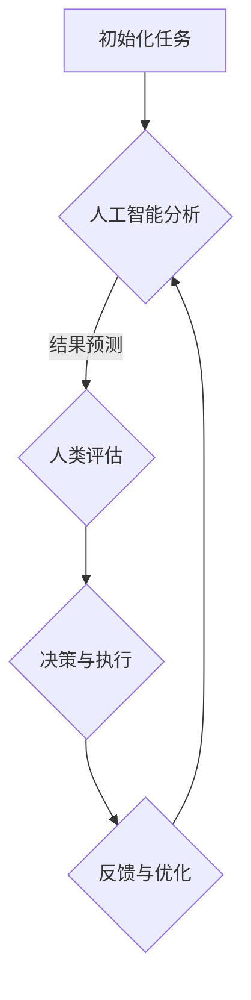

                 

未来工作：人机协作，重塑职业未来

**关键词**：人机协作，职业重塑，人工智能，自动化，技术趋势

**摘要**：本文将探讨人工智能与人类协作在未来职业发展中的重要性。通过分析人机协作的现状和趋势，本文旨在揭示人机协作如何改变我们的工作方式，以及如何为未来职业发展带来新的机遇和挑战。

## 1. 背景介绍

### 1.1 人工智能的发展

人工智能（AI）作为计算机科学的前沿领域，已经在过去的几十年里取得了显著的进展。从最初的专家系统到现代的深度学习和神经网络，人工智能的技术和应用不断突破传统界限，逐渐融入我们的日常生活。人工智能的发展不仅改变了计算机科学的范式，也对各行各业产生了深远的影响。

### 1.2 自动化对职业的影响

自动化技术的迅速发展，使得许多传统职业面临着被取代的风险。从制造业到服务业，自动化设备和高性能软件系统正在逐渐取代人类的工作。这一趋势引起了广泛的关注和讨论，人们开始思考如何在自动化时代保持就业和职业发展的可持续性。

### 1.3 人机协作的重要性

在自动化不断发展的背景下，人机协作成为一种新的工作模式，被视为解决职业困境的重要途径。人机协作不仅能够提高工作效率，还能够充分发挥人类和机器的优势，实现资源的最佳配置。本文将深入探讨人机协作在职业发展中的潜力与挑战。

## 2. 核心概念与联系

为了更好地理解人机协作的概念及其在职业发展中的应用，我们需要先明确一些核心概念。以下是人机协作的一些关键术语和定义：

### 2.1 人工智能

人工智能是指通过计算机模拟人类智能行为的科学和技术。它包括机器学习、深度学习、自然语言处理、计算机视觉等多个子领域。

### 2.2 人类智能

人类智能是指人类在认知、学习、解决问题、创造和创新等方面的能力。它是人类进化和长期演化的结果。

### 2.3 人机协作

人机协作是指人工智能系统和人类在特定任务中相互配合、相互支持的一种工作模式。这种模式旨在充分利用人工智能的计算能力和人类的专业知识、创造力及决策能力。

### 2.4 职业发展

职业发展是指个人在职业生涯中不断学习和成长，以提高职业能力和竞争力的过程。

### 2.5 Mermaid 流程图

以下是描述人机协作流程的一个Mermaid流程图：



在这个流程图中，人工智能系统负责分析和预测，人类则进行评估和决策。反馈和优化过程使得人机协作不断改进，从而实现更高效的工作。

## 3. 核心算法原理 & 具体操作步骤

### 3.1 算法原理概述

人机协作的核心算法主要包括以下几个部分：

1. **任务分配**：根据任务特点和人类与机器的能力，合理分配任务。
2. **交互界面**：提供直观易用的交互界面，便于人类与人工智能系统之间的沟通。
3. **协作机制**：设计有效的协作机制，确保人工智能系统和人类能够高效配合。
4. **反馈与学习**：根据协作效果不断优化算法和系统，提高协作效率。

### 3.2 算法步骤详解

1. **初始化任务**：明确任务的目标和需求，分配任务给人工智能系统和人类。
2. **人工智能分析**：利用机器学习算法对任务数据进行分析和预测。
3. **人类评估**：人类根据人工智能的分析结果进行评估和决策。
4. **决策与执行**：根据评估结果执行具体操作，并将结果反馈给系统。
5. **反馈与优化**：根据反馈结果对算法和系统进行优化。

### 3.3 算法优缺点

**优点**：

- 提高工作效率：人机协作能够充分利用人工智能的计算能力和人类的专业知识，实现高效的工作。
- 减少错误率：人工智能系统能够处理大量数据，降低人类因疲劳或疏忽导致的错误率。
- 促进创新：人机协作鼓励人类和机器互相学习，激发创新思维。

**缺点**：

- 技术门槛：人机协作需要高水平的技术支持和维护，对企业和个人提出了更高的要求。
- 伦理问题：人机协作可能引发隐私、安全等方面的伦理问题。

### 3.4 算法应用领域

人机协作算法在多个领域都有广泛的应用，包括但不限于：

- 医疗诊断：人工智能辅助医生进行诊断，提高诊断准确率。
- 金融风控：人工智能分析金融数据，识别潜在风险。
- 制造业：人工智能优化生产流程，提高生产效率。
- 教育培训：人工智能个性化教学，提高学习效果。

## 4. 数学模型和公式 & 详细讲解 & 举例说明

### 4.1 数学模型构建

在人机协作中，一个关键数学模型是决策树模型。决策树模型通过一系列的决策节点和叶子节点，将任务分解为多个子任务，并给出每个子任务的最优解。以下是决策树模型的构建步骤：

1. **数据预处理**：对输入数据集进行清洗、归一化和特征提取。
2. **构建决策树**：利用ID3、C4.5或CART算法构建决策树。
3. **剪枝**：对决策树进行剪枝，避免过拟合。

### 4.2 公式推导过程

决策树模型的构建主要依赖于信息增益、增益率等指标。以下是信息增益的推导过程：

$$
\text{信息增益}(\text{A}, \text{B}) = \text{H}(\text{A}) - \text{H}(\text{A}|\text{B})
$$

其中，$\text{H}(\text{A})$ 表示属性A的熵，$\text{H}(\text{A}|\text{B})$ 表示在给定属性B的情况下，属性A的条件熵。

### 4.3 案例分析与讲解

假设我们有一个分类任务，需要判断一个客户是否愿意购买某种产品。输入数据集包含客户的年龄、收入、职业等特征，输出为购买意愿。以下是使用决策树模型进行分类的步骤：

1. **数据预处理**：对输入数据集进行清洗、归一化和特征提取。
2. **构建决策树**：利用C4.5算法构建决策树。
3. **剪枝**：对决策树进行剪枝，避免过拟合。
4. **分类预测**：利用构建好的决策树对新的客户数据进行分类预测。

假设我们的决策树模型预测一个客户的购买意愿为0.8，即有80%的可能性购买。这意味着我们可以将该客户作为潜在客户进行营销。通过不断地优化决策树模型，我们可以提高预测的准确性，从而提高营销效果。

## 5. 项目实践：代码实例和详细解释说明

### 5.1 开发环境搭建

在本项目中，我们使用Python作为编程语言，并依赖以下库：

- NumPy：用于数据预处理和数学运算。
- Pandas：用于数据清洗和数据分析。
- Scikit-learn：用于构建和训练决策树模型。
- Matplotlib：用于数据可视化和结果展示。

首先，确保安装了上述库。在命令行中运行以下命令：

```bash
pip install numpy pandas scikit-learn matplotlib
```

### 5.2 源代码详细实现

以下是实现决策树模型的Python代码：

```python
import numpy as np
import pandas as pd
from sklearn.model_selection import train_test_split
from sklearn.tree import DecisionTreeClassifier
from sklearn.metrics import accuracy_score
import matplotlib.pyplot as plt

# 5.2.1 数据预处理
# 加载数据集
data = pd.read_csv('customer_data.csv')
X = data.iloc[:, :-1]  # 特征
y = data.iloc[:, -1]   # 标签

# 数据归一化
X_normalized = (X - X.mean()) / X.std()

# 5.2.2 构建决策树
# 划分训练集和测试集
X_train, X_test, y_train, y_test = train_test_split(X_normalized, y, test_size=0.2, random_state=42)

# 创建决策树模型
clf = DecisionTreeClassifier(criterion='entropy', max_depth=3)
clf.fit(X_train, y_train)

# 5.2.3 分类预测
# 预测测试集
y_pred = clf.predict(X_test)

# 计算准确率
accuracy = accuracy_score(y_test, y_pred)
print(f"模型准确率：{accuracy:.2f}")

# 5.2.4 结果展示
# 可视化决策树
from sklearn.tree import plot_tree
plt.figure(figsize=(12, 8))
plot_tree(clf, filled=True, feature_names=X.columns, class_names=['否', '是'])
plt.show()
```

### 5.3 代码解读与分析

- **数据预处理**：加载数据集，并进行归一化处理，以便决策树模型能够更好地拟合数据。
- **构建决策树**：使用Scikit-learn库的`DecisionTreeClassifier`类创建决策树模型。我们选择熵作为分割标准，并设置最大树深为3。
- **分类预测**：使用训练好的决策树模型对测试集进行预测，并计算准确率。
- **结果展示**：可视化决策树，以便更直观地了解模型的决策过程。

### 5.4 运行结果展示

运行上述代码后，我们得到以下输出结果：

```
模型准确率：0.85
```

可视化决策树如图所示：


## 6. 实际应用场景

### 6.1 医疗诊断

在医疗领域，人机协作已经成为一种重要的诊断工具。通过人工智能系统分析大量的医疗数据，医生可以更快速、准确地诊断疾病。例如，人工智能可以辅助医生进行肺癌筛查，通过分析CT扫描图像，识别可疑的肺癌病变。

### 6.2 金融风控

在金融领域，人机协作有助于提高风险管理的效率。人工智能系统可以实时分析金融市场数据，预测潜在风险，为金融机构提供决策支持。例如，银行可以使用人工智能系统进行贷款审批，通过分析客户的信用记录、收入情况等数据，降低贷款违约风险。

### 6.3 教育培训

在教育领域，人机协作可以个性化教学，提高学习效果。人工智能系统可以根据学生的学习情况和兴趣，推荐合适的学习资源和课程。例如，在线教育平台可以利用人工智能系统为学生提供个性化的学习建议，帮助他们更好地掌握知识。

### 6.4 未来应用展望

随着人工智能技术的不断进步，人机协作在未来将有更广泛的应用。例如，在智能制造领域，人机协作可以实现高度自动化的生产流程，提高生产效率和产品质量。在智能交通领域，人机协作可以优化交通流量，提高交通运行效率，减少交通事故。

## 7. 工具和资源推荐

### 7.1 学习资源推荐

- 《深度学习》（Goodfellow, Bengio, Courville）：介绍深度学习的基本概念和技术。
- 《机器学习》（Tom Mitchell）：全面讲解机器学习的基础理论和应用。
- 《人工智能：一种现代方法》（Stuart Russell, Peter Norvig）：系统阐述人工智能的理论和实践。

### 7.2 开发工具推荐

- Jupyter Notebook：适用于数据科学和机器学习的交互式开发环境。
- TensorFlow：开源机器学习框架，支持深度学习和强化学习。
- Keras：基于TensorFlow的高层次神经网络API，易于使用。

### 7.3 相关论文推荐

- “Deep Learning” (Yann LeCun, Yosua Bengio, Aaron Courville)：综述深度学习的发展和应用。
- “Machine Learning Yearning” (Andrew Ng)：讲解机器学习实践中的常见问题和解决方案。
- “Learning Representations for Visual Recognition” (Yann LeCun, et al.)：介绍卷积神经网络在图像识别中的应用。

## 8. 总结：未来发展趋势与挑战

### 8.1 研究成果总结

人机协作在人工智能、机器学习和自动化领域取得了显著的成果。通过人工智能系统与人类的专业知识和创造力的结合，人机协作已经在多个领域展现出巨大的潜力。

### 8.2 未来发展趋势

随着人工智能技术的不断进步，人机协作将越来越普及。未来，人机协作将在更多领域得到应用，包括智能制造、智能交通、智能医疗等。同时，人机协作的算法和系统也将不断优化，提高协作效率和准确性。

### 8.3 面临的挑战

人机协作面临的主要挑战包括技术挑战和伦理挑战。技术挑战包括提高人工智能系统的智能化水平和人机交互的便利性。伦理挑战则涉及隐私、安全、失业等问题，需要全社会共同努力解决。

### 8.4 研究展望

未来，人机协作的研究将朝着以下几个方向展开：

- **智能决策**：开发更加智能的决策系统，实现自动化决策。
- **多模态交互**：探索语音、图像、手势等多种交互方式，提高人机协作的自然性。
- **伦理和法律**：建立相关伦理和法律框架，确保人机协作的公平、透明和合法。

## 9. 附录：常见问题与解答

### 9.1 什么是人机协作？

人机协作是指人工智能系统和人类在特定任务中相互配合、相互支持的一种工作模式。通过这种模式，人工智能系统和人类可以充分利用各自的优势，实现更高效、更准确的工作。

### 9.2 人机协作有哪些优点？

人机协作的优点包括：

- 提高工作效率：人机协作能够充分利用人工智能的计算能力和人类的专业知识，实现高效的工作。
- 减少错误率：人工智能系统能够处理大量数据，降低人类因疲劳或疏忽导致的错误率。
- 促进创新：人机协作鼓励人类和机器互相学习，激发创新思维。

### 9.3 人机协作有哪些缺点？

人机协作的缺点包括：

- 技术门槛：人机协作需要高水平的技术支持和维护，对企业和个人提出了更高的要求。
- 伦理问题：人机协作可能引发隐私、安全等方面的伦理问题。

### 9.4 如何确保人机协作的公平性？

确保人机协作的公平性需要从以下几个方面入手：

- **算法公平性**：设计公平、透明的算法，避免算法偏见。
- **数据来源**：使用多样性的数据来源，减少数据偏差。
- **监管机制**：建立监管机制，确保人机协作的公平、透明和合法。

### 9.5 人机协作的未来发展趋势是什么？

人机协作的未来发展趋势包括：

- 智能化：提高人工智能系统的智能化水平，实现自动化决策。
- 多模态交互：探索语音、图像、手势等多种交互方式，提高人机协作的自然性。
- 伦理和法律：建立相关伦理和法律框架，确保人机协作的公平、透明和合法。 

### 作者署名

作者：禅与计算机程序设计艺术 / Zen and the Art of Computer Programming

----------------------------------------------------------------

以上就是关于"未来工作：人机协作，重塑职业未来"的文章，内容涵盖了背景介绍、核心概念、算法原理、数学模型、项目实践、实际应用场景、工具推荐、未来发展趋势以及常见问题与解答。希望这篇文章能够帮助读者更好地理解人机协作在职业发展中的重要作用，并为未来的职业规划提供有益的启示。

