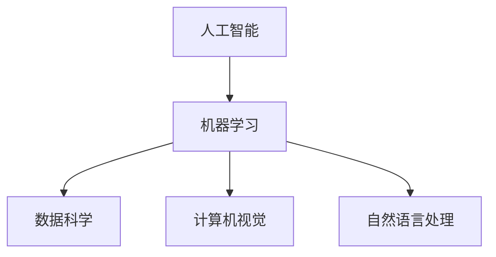

                 

在快速变化的科技时代，职业世界正经历着前所未有的转型。人工智能（AI）和机器学习（ML）的飞速发展，正重新定义着传统的工作方式和职业角色。本文将探讨人机协作如何重塑职业未来，以及这一转变对从业者和社会带来的深远影响。

## 关键词

- 人工智能
- 机器学习
- 人机协作
- 职业转型
- 自动化
- 软技能

## 摘要

本文旨在分析人工智能和机器学习在职业世界中的崛起，探讨人机协作的新模式及其对职业角色的影响。通过阐述核心概念和具体实例，本文将为读者提供对这一变革性趋势的深入理解，并展望其未来发展方向。

## 1. 背景介绍

随着技术的不断进步，人工智能和机器学习正在渗透到各个行业，从医疗保健到金融，从制造业到零售业，无处不见其身影。AI和ML的应用不仅提高了效率，还大幅降低了成本。然而，这种进步也带来了新的挑战，特别是对职业劳动市场的影响。

在过去，许多工作依赖于重复性和规律性的任务，如数据录入、客户服务和制造流程。如今，随着自动化技术的发展，这些任务正逐渐被机器人和AI系统所取代。与此同时，新的工作机会也在不断涌现，尤其是那些需要人类智慧和创造力的领域，如高级数据分析、复杂问题解决和创新设计。

这种职业结构的转变要求从业人员不断提升自己的技能，以适应新的工作要求。传统的技能可能不再足够，而新的技能，如数据分析和编程能力，则变得至关重要。此外，软技能，如沟通能力、团队合作和领导力，也变得越来越重要，因为它们是有效人机协作的关键。

## 2. 核心概念与联系

### 2.1 人工智能与机器学习的核心概念

人工智能是一门研究如何构建智能代理的学科，这些代理能够感知环境并采取行动以实现特定目标。机器学习是人工智能的一个分支，它侧重于使机器通过数据和经验自主学习和改进。

**Mermaid 流程图：**



### 2.2 人机协作的模式

人机协作的关键在于如何将机器的效率和准确性与人类的创造力、判断力和情感智慧相结合。以下是人机协作的几种主要模式：

- **监督学习**：人类提供训练数据，机器通过这些数据进行学习和预测。
- **增强学习**：机器在人类设定的环境中不断试错，以优化其性能。
- **混合学习**：机器和人类共同参与决策过程，通过交流反馈不断改进。

### 2.3 软技能的重要性

尽管AI和ML在处理数据和分析模式方面表现出色，但它们在处理复杂的人类情感和社会互动方面仍然存在局限性。因此，软技能在确保人机协作顺利方面扮演着关键角色。

- **沟通能力**：清晰、有效的沟通是确保人机协作顺畅的基础。
- **团队合作**：在复杂项目中，人类和机器需要协同工作，共同解决问题。
- **领导力**：有效的领导能力有助于协调团队资源，确保项目成功。

## 3. 核心算法原理 & 具体操作步骤

### 3.1 算法原理概述

人机协作的核心算法通常基于监督学习和增强学习。监督学习算法利用标注数据训练模型，使其能够进行预测和分类。增强学习算法则通过试错和反馈不断优化其行为。

### 3.2 算法步骤详解

1. **数据准备**：收集并整理相关数据，确保其质量和完整性。
2. **特征提取**：从数据中提取关键特征，用于训练模型。
3. **模型训练**：使用训练数据训练机器学习模型。
4. **模型评估**：通过测试数据评估模型的性能。
5. **迭代优化**：根据评估结果调整模型参数，以提高性能。
6. **部署应用**：将训练好的模型部署到实际应用场景中。

### 3.3 算法优缺点

- **优点**：提高工作效率，减少人为错误，适合处理大量数据。
- **缺点**：需要大量的训练数据和计算资源，对复杂问题的处理能力有限。

### 3.4 算法应用领域

- **医疗保健**：诊断疾病，制定治疗方案。
- **金融**：风险评估，投资策略制定。
- **零售**：个性化推荐，库存管理。
- **制造业**：自动化生产线，质量控制。

## 4. 数学模型和公式 & 详细讲解 & 举例说明

### 4.1 数学模型构建

在机器学习中，常用的数学模型包括线性回归、逻辑回归、决策树、神经网络等。以下是一个简单的线性回归模型：

$$ y = \beta_0 + \beta_1x $$

其中，$ y $ 是因变量，$ x $ 是自变量，$ \beta_0 $ 和 $ \beta_1 $ 是模型参数。

### 4.2 公式推导过程

线性回归模型的推导过程如下：

1. **目标函数**：最小化预测值与实际值之间的误差平方和。
2. **损失函数**：通常使用均方误差（MSE）作为损失函数。

$$ J(\theta) = \frac{1}{2m} \sum_{i=1}^{m} (h_\theta(x^{(i)}) - y^{(i)})^2 $$

其中，$ m $ 是样本数量，$ h_\theta(x) $ 是预测函数，$ \theta $ 是模型参数。

3. **梯度下降**：通过梯度下降法优化模型参数。

$$ \theta_j := \theta_j - \alpha \frac{\partial J(\theta)}{\partial \theta_j} $$

其中，$ \alpha $ 是学习率。

### 4.3 案例分析与讲解

假设我们有一个简单的数据集，包含房屋面积（$ x $）和房价（$ y $）。我们希望通过线性回归模型预测房价。

1. **数据准备**：收集并整理房屋面积和房价数据。
2. **特征提取**：直接使用房屋面积作为特征。
3. **模型训练**：使用线性回归模型训练数据。
4. **模型评估**：通过测试数据评估模型性能。
5. **迭代优化**：根据评估结果调整模型参数。
6. **部署应用**：将训练好的模型用于预测新数据的房价。

## 5. 项目实践：代码实例和详细解释说明

### 5.1 开发环境搭建

- **编程语言**：Python
- **机器学习库**：scikit-learn
- **数据可视化库**：matplotlib

### 5.2 源代码详细实现

```python
import numpy as np
import matplotlib.pyplot as plt
from sklearn.linear_model import LinearRegression

# 数据准备
X = np.array([[1], [2], [3], [4], [5]])
y = np.array([2, 4, 5, 4, 5])

# 模型训练
model = LinearRegression()
model.fit(X, y)

# 模型评估
y_pred = model.predict(X)
mse = np.mean((y_pred - y)**2)
print(f"MSE: {mse}")

# 模型解读
print(f"Model parameters: {model.coef_}, {model.intercept_}")

# 迭代优化（示例）
learning_rate = 0.01
for i in range(100):
    gradients = 2/X.shape[0] * (X.dot(model.coef_) - y)
    model.coef_ -= learning_rate * gradients

# 运行结果展示
plt.scatter(X, y, color='blue')
plt.plot(X, model.predict(X), color='red')
plt.xlabel('House Area')
plt.ylabel('Price')
plt.show()
```

### 5.3 代码解读与分析

- **数据准备**：使用 NumPy 创建房屋面积和房价的数组。
- **模型训练**：使用 scikit-learn 的 LinearRegression 类训练模型。
- **模型评估**：计算均方误差（MSE）以评估模型性能。
- **模型解读**：打印模型参数以了解其结构和意义。
- **迭代优化**：使用梯度下降法优化模型参数。
- **运行结果展示**：使用 matplotlib 绘制散点图和拟合直线，以可视化模型结果。

## 6. 实际应用场景

### 6.1 医疗保健

- **诊断辅助**：AI 可以帮助医生分析医学图像，提高诊断准确率。
- **个性化治疗**：基于患者的遗传信息和病史，AI 可以推荐最合适的治疗方案。

### 6.2 金融

- **风险管理**：AI 可以预测市场波动，帮助金融机构降低风险。
- **智能投顾**：AI 基于用户的风险偏好和历史投资记录，提供个性化的投资建议。

### 6.3 零售

- **个性化推荐**：AI 可以根据用户的行为数据推荐商品。
- **库存管理**：AI 可以预测销售趋势，优化库存水平。

### 6.4 未来应用展望

- **智慧城市**：AI 可以优化交通流量，提高城市管理效率。
- **教育**：AI 可以个性化教学，帮助学生提高学习效果。

## 7. 工具和资源推荐

### 7.1 学习资源推荐

- 《机器学习》（周志华）
- 《深度学习》（Ian Goodfellow）
- Coursera 上的机器学习课程（吴恩达）

### 7.2 开发工具推荐

- **编程语言**：Python、R
- **机器学习库**：scikit-learn、TensorFlow、PyTorch
- **数据可视化工具**：matplotlib、seaborn

### 7.3 相关论文推荐

- "Deep Learning"（Ian Goodfellow）
- "Reinforcement Learning: An Introduction"（Richard S. Sutton and Andrew G. Barto）
- "Natural Language Processing with Deep Learning"（Stanislaw Osowski）

## 8. 总结：未来发展趋势与挑战

### 8.1 研究成果总结

人工智能和机器学习在提高工作效率、降低成本、优化决策方面取得了显著成果。人机协作正在重塑职业未来，为各行各业带来新的机遇。

### 8.2 未来发展趋势

- **跨学科融合**：AI 将与其他领域（如生物医学、社会科学）更紧密地结合。
- **普及化**：AI 技术将更加普及，成为普通企业和个人可用的工具。
- **伦理与法规**：随着 AI 技术的普及，伦理和法规问题将变得更加重要。

### 8.3 面临的挑战

- **数据隐私**：如何保护用户数据隐私是一个重要问题。
- **技术伦理**：确保 AI 技术的使用不损害社会利益。
- **技能短缺**：随着 AI 技术的发展，对相关技能的需求将增加，但人才供应可能不足。

### 8.4 研究展望

- **智能协作系统**：开发更加智能和自适应的人机协作系统，提高协作效率。
- **人工智能伦理**：建立更加完善的 AI 伦理和法规体系，确保技术的可持续发展。

## 9. 附录：常见问题与解答

### 9.1 什么是机器学习？

机器学习是一种人工智能的方法，通过数据和经验使机器能够自主学习和改进，以执行特定任务。

### 9.2 人机协作如何提高工作效率？

人机协作通过将机器的效率和准确性与人类的创造力、判断力和情感智慧相结合，优化任务执行过程，从而提高工作效率。

### 9.3 数据隐私在 AI 应用中如何得到保护？

数据隐私可以通过加密技术、匿名化处理和严格的法规监管得到保护。

## 作者署名

作者：禅与计算机程序设计艺术 / Zen and the Art of Computer Programming
----------------------------------------------------------------
这篇文章通过深入探讨人工智能和机器学习在职业世界中的崛起，以及人机协作的模式和影响，为读者提供了对未来工作趋势的深刻见解。通过详细的算法原理、项目实践和实际应用场景分析，文章不仅展示了技术的应用价值，也指出了未来面临的挑战和机遇。希望这篇文章能够激发读者对这一领域更深入的研究和思考。

