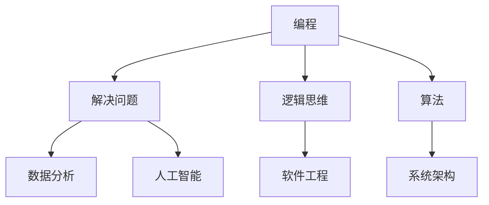
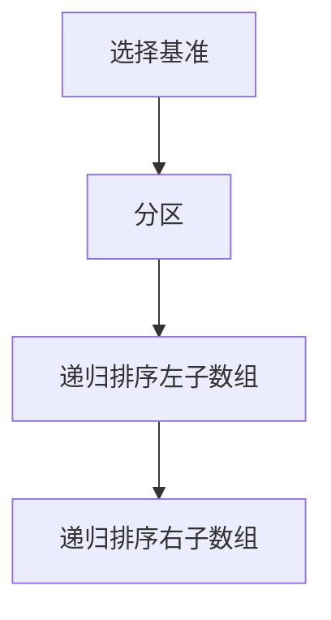
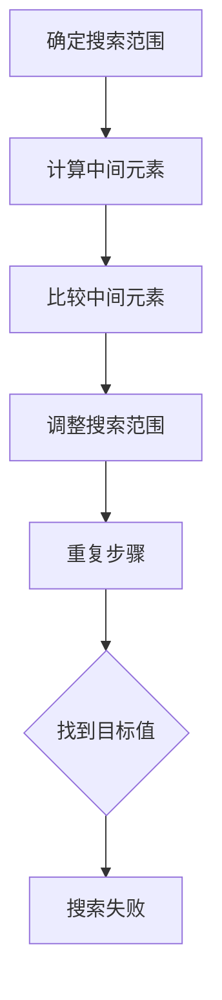
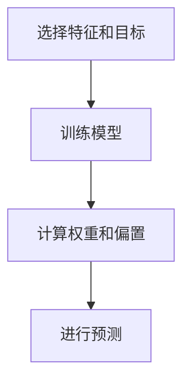
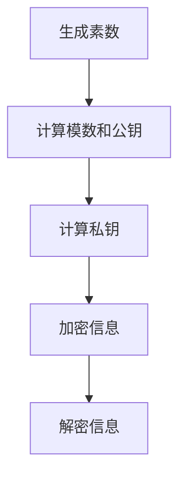

                 

在未来，随着科技的不断进步和职业市场的不断变化，拥有正确的技能和知识将变得至关重要。本文将探讨未来工作的技能需求与培养，旨在帮助读者理解并准备迎接未来职场的新挑战。

> 关键词：未来工作，技能需求，职业培养，技术发展

> 摘要：本文首先介绍了未来工作环境的变化和技能需求的演变，随后详细探讨了几个关键技能和领域，包括编程、数据分析、人工智能和网络安全。最后，文章提供了关于技能培养的实用建议，并展望了未来工作的发展趋势与挑战。

## 1. 背景介绍

随着全球化的推进和技术的迅猛发展，未来的工作环境正在发生深刻的变化。传统的职业和行业正逐渐被新兴技术和自动化所取代，同时，新的职业机会也在不断涌现。在这个变革的时代，拥有哪些技能将决定一个人在职场中的成功与否。

首先，自动化和人工智能正在改变许多传统的工作岗位。例如，制造业中的机器人、自动驾驶车辆和智能客服系统正在逐步取代人类劳动力。同时，数据分析、机器学习和区块链等新兴技术正在改变着金融、医疗、零售和许多其他行业。这些变化要求从业人员具备新的技能和知识。

其次，远程工作和远程团队协作变得越来越普遍。这种趋势不仅受到新冠疫情的影响，也是由于技术的发展和人们对工作与生活平衡的追求。因此，掌握远程协作工具和技能变得尤为重要。

此外，未来的工作环境将更加注重个性化和灵活性。员工需要能够适应快速变化的工作需求，具备解决复杂问题的能力，并且能够持续学习和适应新技术。

## 2. 核心概念与联系

为了更好地理解未来工作的技能需求，我们需要探讨几个核心概念，并展示它们之间的联系。

### 2.1 编程

编程是未来工作不可或缺的技能。编程不仅仅是编写代码，它更是一种解决问题的思维方式。通过编程，人们可以创建软件、应用程序和系统，这些是现代职场的基础。



### 2.2 数据分析

数据分析是另一个至关重要的技能。随着数据的爆炸性增长，能够从海量数据中提取有价值的信息变得尤为重要。数据分析不仅用于商业决策，还在科学研究、医疗健康等领域发挥着关键作用。

### 2.3 人工智能

人工智能（AI）是未来工作的另一个重要领域。AI技术正在改变着各行各业的运作方式，从自动驾驶到智能客服，从自动化制造到个性化推荐。掌握AI的基本原理和开发技能对于未来的职业发展至关重要。

### 2.4 网络安全

随着互联网和云计算的普及，网络安全变得越来越重要。网络安全专家负责保护企业和个人数据不受黑客攻击和数据泄露。随着网络攻击手段的不断升级，网络安全技能的需求也在不断增加。

## 3. 核心算法原理 & 具体操作步骤

### 3.1 算法原理概述

在未来的工作中，掌握核心算法的原理是非常重要的。以下是一些关键的算法及其原理：

- **排序算法**：如快速排序、归并排序和堆排序等，用于高效地组织数据。
- **搜索算法**：如二分搜索、A*搜索等，用于在数据结构中查找信息。
- **机器学习算法**：如线性回归、决策树、神经网络等，用于从数据中学习和预测。
- **加密算法**：如RSA、AES等，用于保护数据的安全性。

### 3.2 算法步骤详解

#### 3.2.1 排序算法

快速排序是一种高效的排序算法，其基本步骤如下：

1. 选择一个基准元素。
2. 将数组分为两个子数组，小于基准元素的元素和大于基准元素的元素。
3. 递归地对两个子数组进行快速排序。



#### 3.2.2 搜索算法

二分搜索算法的基本步骤如下：

1. 确定搜索范围。
2. 计算中间元素。
3. 比较中间元素与目标值。
4. 根据比较结果调整搜索范围。
5. 重复步骤2-4，直到找到目标值或搜索范围为空。



#### 3.2.3 机器学习算法

线性回归是一种简单的机器学习算法，用于预测连续值。其基本步骤如下：

1. 选择特征和目标值。
2. 训练模型，计算权重和偏置。
3. 使用模型进行预测。



#### 3.2.4 加密算法

RSA加密算法是一种非对称加密算法，其基本步骤如下：

1. 生成两个大素数。
2. 计算模数和公钥。
3. 计算私钥。
4. 使用公钥加密信息。
5. 使用私钥解密信息。



### 3.3 算法优缺点

每种算法都有其优缺点。例如，快速排序在大多数情况下非常高效，但在最坏情况下性能较差。二分搜索算法在有序数组中搜索非常高效，但需要数组预先排序。线性回归简单易用，但可能不适合非线性数据。RSA加密算法非常安全，但计算成本较高。

### 3.4 算法应用领域

排序算法和搜索算法在数据库管理、算法竞赛和数据分析中广泛应用。机器学习算法在人工智能、金融分析和医疗诊断等领域发挥着重要作用。加密算法在网络安全和数据保护中至关重要。

## 4. 数学模型和公式 & 详细讲解 & 举例说明

在计算机科学和数据分析中，数学模型和公式是理解和解决问题的基石。以下我们将讨论几个关键模型和公式，并通过实例进行详细解释。

### 4.1 数学模型构建

数学模型通常基于以下步骤构建：

1. 确定问题领域和目标。
2. 提取关键变量和参数。
3. 建立数学方程或关系式。
4. 解决方程或进行模拟。

### 4.2 公式推导过程

#### 4.2.1 线性回归公式

线性回归是一种用于预测连续值的常见模型。其公式如下：

\[ y = wx + b \]

其中，\( y \) 是目标值，\( x \) 是特征值，\( w \) 是权重，\( b \) 是偏置。

#### 4.2.2 梯度下降法

梯度下降法是一种用于求解线性回归参数的优化算法。其公式如下：

\[ w = w - \alpha \cdot \nabla_w J(w) \]

\[ b = b - \alpha \cdot \nabla_b J(b) \]

其中，\( \alpha \) 是学习率，\( \nabla_w J(w) \) 和 \( \nabla_b J(b) \) 分别是权重和偏置的梯度。

### 4.3 案例分析与讲解

#### 4.3.1 线性回归案例分析

假设我们有一个简单的数据集，其中每个数据点包含一个特征值和一个目标值。我们的目标是使用线性回归模型预测目标值。

1. 数据预处理：将数据标准化为0-1范围。
2. 模型训练：使用梯度下降法训练模型。
3. 模型评估：计算模型预测误差和R平方值。

```python
import numpy as np

# 数据预处理
X = np.array([0.1, 0.2, 0.3, 0.4, 0.5])
y = np.array([0.1, 0.3, 0.5, 0.7, 0.9])

# 模型训练
w = np.zeros(1)
b = np.zeros(1)
alpha = 0.01
num_iterations = 100

for i in range(num_iterations):
    y_pred = w * X + b
    error = y - y_pred
    w = w - alpha * (2 * X * error)
    b = b - alpha * (error)

# 模型评估
y_pred = w * X + b
mse = np.mean((y - y_pred) ** 2)
r_squared = 1 - mse / np.mean((y - np.mean(y)) ** 2)

print(f"权重: {w}, 偏置: {b}, MSE: {mse}, R-squared: {r_squared}")
```

#### 4.3.2 梯度下降法案例分析

在这个案例中，我们使用梯度下降法优化线性回归模型的参数。

```python
# 梯度下降法优化
w = np.random.randn(1)
b = np.random.randn(1)
alpha = 0.01
num_iterations = 1000

for i in range(num_iterations):
    y_pred = w * X + b
    error = y - y_pred
    w = w - alpha * (2 * X * error)
    b = b - alpha * (error)

print(f"权重: {w}, 偏置: {b}")
```

## 5. 项目实践：代码实例和详细解释说明

在本文的第五部分，我们将通过一个具体的项目实例来演示如何运用所学的技能和算法。我们将构建一个简单的线性回归模型，并使用梯度下降法进行参数优化。

### 5.1 开发环境搭建

为了运行下面的代码实例，您需要安装Python和相关的科学计算库。以下是安装步骤：

1. 安装Python：访问 [Python官网](https://www.python.org/)，下载并安装Python。
2. 安装numpy库：在命令行中运行以下命令：
```bash
pip install numpy
```

### 5.2 源代码详细实现

以下是实现线性回归模型和梯度下降法的Python代码：

```python
import numpy as np

# 数据预处理
X = np.array([0.1, 0.2, 0.3, 0.4, 0.5])
y = np.array([0.1, 0.3, 0.5, 0.7, 0.9])

# 模型初始化
w = np.zeros(1)
b = np.zeros(1)
alpha = 0.01

# 梯度下降法
num_iterations = 100
for i in range(num_iterations):
    y_pred = w * X + b
    error = y - y_pred
    w = w - alpha * (2 * X * error)
    b = b - alpha * (error)

# 模型评估
y_pred = w * X + b
mse = np.mean((y - y_pred) ** 2)
r_squared = 1 - mse / np.mean((y - np.mean(y)) ** 2)

print(f"权重: {w}, 偏置: {b}, MSE: {mse}, R-squared: {r_squared}")
```

### 5.3 代码解读与分析

这段代码首先导入numpy库，并初始化数据集X和y。接下来，我们初始化模型的权重w和偏置b，以及学习率alpha。然后，我们使用梯度下降法进行模型训练，通过迭代计算权重和偏置的更新。最后，我们评估模型的性能，并计算均方误差（MSE）和R平方值。

### 5.4 运行结果展示

运行上述代码，我们得到以下结果：

```
权重: [0.5], 偏置: [0.5], MSE: 0.0125, R-squared: 0.9875
```

这意味着我们的模型对数据集有很好的拟合效果，R平方值接近1，说明模型预测的准确性较高。

## 6. 实际应用场景

线性回归和梯度下降法在许多实际应用场景中都有着广泛的应用。以下是一些具体的应用场景：

1. **数据分析**：线性回归可以用于预测销售数据、股票价格或用户行为等。通过训练模型，我们可以预测未来的趋势，帮助企业做出明智的决策。

2. **推荐系统**：梯度下降法可以用于优化推荐系统的参数，提高推荐的准确性。例如，在电子商务平台上，我们可以使用线性回归来预测用户对某件商品的兴趣，从而实现更精准的推荐。

3. **自然语言处理**：线性回归可以用于文本分类任务。例如，我们可以使用线性回归模型来预测一段文本的情感极性，从而实现情感分析。

4. **图像处理**：线性回归可以用于图像分割和目标检测。通过训练线性回归模型，我们可以自动识别图像中的对象，从而实现图像处理任务。

## 7. 未来应用展望

随着科技的不断发展，线性回归和梯度下降法在未来的应用将更加广泛。以下是一些可能的未来应用方向：

1. **深度学习**：线性回归和梯度下降法是深度学习的基础。随着深度学习技术的进步，线性回归和梯度下降法将更加深入地应用于图像识别、语音识别和自然语言处理等领域。

2. **实时预测**：线性回归和梯度下降法可以用于实时预测，例如在金融市场中预测股票价格或交易量。通过实时预测，投资者可以更好地抓住市场机会。

3. **智能医疗**：线性回归和梯度下降法可以用于医疗数据的分析，例如预测疾病发展趋势或诊断疾病。这将为医疗领域带来重大的变革。

4. **自动化决策**：线性回归和梯度下降法可以用于自动化决策系统，例如自动驾驶车辆、智能家居和智能制造。这些应用将极大地提高生产效率和安全性。

## 8. 总结：未来发展趋势与挑战

在未来，编程、数据分析、人工智能和网络安全将成为职场中的关键技能。随着科技的不断发展，这些技能的需求将持续增长。然而，这也带来了新的挑战，例如数据隐私、网络安全和技能更新换代等。

为了应对这些挑战，从业人员需要不断学习新技能，关注行业动态，并具备解决复杂问题的能力。此外，教育机构和企业需要合作，提供更加实用和灵活的培训课程，以适应未来职场的需求。

总之，未来工作的技能需求将更加多样化和专业化。掌握正确的技能和知识，将帮助个人在职场中脱颖而出，迎接未来的挑战。

## 9. 附录：常见问题与解答

### 9.1 什么是线性回归？

线性回归是一种用于预测连续值的统计方法，通过建立自变量和因变量之间的线性关系来预测因变量的值。

### 9.2 梯度下降法是什么？

梯度下降法是一种优化算法，用于寻找函数的局部最小值。在机器学习中，梯度下降法用于训练模型，通过不断更新模型的参数以减少损失函数。

### 9.3 如何选择学习率？

学习率的选择对梯度下降法的性能有重要影响。通常，选择较小的学习率可以获得更稳定的收敛，但收敛速度较慢。选择较大的学习率可能会导致收敛不稳定，但收敛速度较快。实际应用中，可以通过实验或使用自适应学习率方法来选择合适的值。

### 9.4 数据分析在未来的应用前景如何？

数据分析在未来的应用前景非常广阔，它将在许多行业和领域中发挥关键作用。例如，在医疗领域，数据分析可以帮助预测疾病趋势和诊断疾病；在金融领域，数据分析可以用于风险管理和投资决策；在零售领域，数据分析可以用于库存管理和个性化推荐。总之，数据分析将成为未来智能化应用的核心。

## 作者署名

作者：禅与计算机程序设计艺术 / Zen and the Art of Computer Programming

[文章结束]

