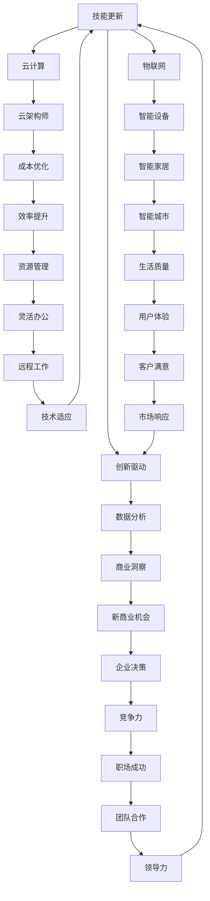

                 

在未来，随着科技的飞速发展，职场环境正在经历深刻的变革。传统的职业技能和知识体系已经无法满足新时代的需求。作为世界级人工智能专家、程序员、软件架构师、CTO和世界顶级技术畅销书作者，本文旨在探讨未来工作的技能需求与培养，以期为读者提供有价值的参考。

## 1. 背景介绍

当前的全球职场环境正处于快速变化之中，这不仅源于技术的革新，还源于经济、社会和文化的多重因素。人工智能、大数据、云计算、物联网等技术的迅猛发展，正在重新定义工作内容、工作方式以及组织结构。与此同时，全球化的进程加速，企业面临着前所未有的竞争压力，这要求员工具备更加多样化的技能和更高的适应能力。

### 1.1 技术变革的驱动因素

- **人工智能与自动化**：人工智能技术正在逐步取代一些重复性高、对技能要求较低的岗位，从而释放劳动力用于更高价值的任务。
- **数据驱动的决策**：大数据分析已经成为企业决策的重要依据，数据科学家和分析师成为新兴的职业群体。
- **云计算的普及**：云计算技术的广泛应用使得企业能够更加灵活地管理和扩展资源，同时也催生了云架构师和云工程师等新职位。
- **物联网的融合**：物联网技术的发展，使得各个设备之间能够互联互通，从而促进了智能城市、智能家居等新兴领域的崛起。

### 1.2 职场环境的变化

- **远程办公的兴起**：疫情催生了远程办公的普及，这改变了传统的办公模式，也对员工的自我管理能力提出了更高要求。
- **终身学习的趋势**：技术的快速迭代要求员工具备终身学习的意识，不断更新和提升自己的技能。
- **软技能的重要性**：除了硬技能，软技能（如沟通能力、团队合作、领导力等）在职场中的地位日益提升。

## 2. 核心概念与联系

为了更好地理解未来工作的技能需求与培养，我们需要了解几个核心概念及其之间的联系。

### 2.1 人工智能（AI）

人工智能是指由计算机模拟的智能行为，包括学习、推理、感知、决策等能力。它已成为推动未来技术发展的重要动力。

### 2.2 大数据（Big Data）

大数据是指海量、多样、快速的数据集。数据分析是大数据的核心，它能够帮助企业发现新的商业机会、优化业务流程。

### 2.3 云计算（Cloud Computing）

云计算是一种通过网络提供计算资源的方式，它使得企业可以按需获取和使用计算资源，从而降低成本、提高效率。

### 2.4 物联网（Internet of Things, IoT）

物联网是指通过互联网连接各种物理设备，实现数据的实时采集、传输和处理。它正逐渐改变我们的生活和工作方式。

### 2.5 软技能（Soft Skills）

软技能包括沟通能力、团队合作、领导力、时间管理等。它们是职场成功的关键，尤其在当今高度协作和变化迅速的工作环境中。

### 2.6 Mermaid 流程图

以下是一个Mermaid流程图，展示了上述核心概念之间的联系：



## 3. 核心算法原理 & 具体操作步骤

在未来的工作中，掌握一些核心算法原理和具体操作步骤对于提升工作效率和竞争力至关重要。以下将介绍几个关键算法。

### 3.1 算法原理概述

- **机器学习**：通过数据训练模型，使其能够自动识别模式、预测结果。
- **深度学习**：一种特殊的机器学习，使用多层神经网络进行特征提取和模型训练。
- **自然语言处理**：使计算机能够理解和生成自然语言。
- **图论算法**：用于解决图相关的优化问题。

### 3.2 算法步骤详解

#### 3.2.1 机器学习

1. 数据采集与预处理：收集数据，并进行清洗、归一化等操作。
2. 特征提取：从原始数据中提取有用的特征。
3. 模型选择：选择合适的算法和模型。
4. 训练与验证：使用训练数据训练模型，并在验证数据上评估模型性能。
5. 部署与优化：将模型部署到实际应用中，并持续优化。

#### 3.2.2 深度学习

1. 构建神经网络：设计网络的层数和神经元数量。
2. 损失函数定义：定义损失函数，用于衡量模型预测的误差。
3. 优化算法选择：选择合适的优化算法，如梯度下降。
4. 训练过程：调整网络参数，使损失函数最小。
5. 模型评估与调整：在测试集上评估模型性能，并进行调整。

#### 3.2.3 自然语言处理

1. 文本预处理：分词、去停用词、词性标注等。
2. 特征提取：从文本中提取特征，如词袋模型、词嵌入等。
3. 模型训练：使用特征训练分类器或序列模型。
4. 预测与评估：使用训练好的模型进行预测，并在测试集上评估性能。

#### 3.2.4 图论算法

1. 问题建模：将问题抽象为图模型。
2. 算法选择：根据问题性质选择合适的算法，如最短路径算法、最大流算法等。
3. 计算与优化：进行图算法的计算，并根据实际情况进行优化。
4. 结果分析：分析算法结果，如路径长度、流量等。

### 3.3 算法优缺点

- **机器学习**：优点是能够自动发现数据中的规律，但缺点是需要大量数据、计算资源和高超的算法设计能力。
- **深度学习**：优点是能够处理复杂的问题，但缺点是训练时间较长、对数据质量要求高。
- **自然语言处理**：优点是能够理解和生成自然语言，但缺点是数据处理复杂、语言歧义难以完全消除。
- **图论算法**：优点是能够解决各种图相关问题，但缺点是算法复杂度较高、实现难度大。

### 3.4 算法应用领域

- **机器学习**：广泛应用于金融、医疗、零售等领域，如风险控制、疾病诊断、推荐系统等。
- **深度学习**：广泛应用于图像识别、语音识别、自然语言处理等领域，如人脸识别、智能语音助手、智能翻译等。
- **自然语言处理**：广泛应用于智能客服、智能搜索、文本分类等领域，如智能客服机器人、搜索引擎、舆情分析等。
- **图论算法**：广泛应用于社交网络分析、交通规划、网络优化等领域，如社交网络影响力分析、最优路径规划、流量分配等。

## 4. 数学模型和公式 & 详细讲解 & 举例说明

在算法设计和分析过程中，数学模型和公式起着关键作用。以下将介绍几个常见的数学模型和公式，并进行详细讲解和举例说明。

### 4.1 数学模型构建

数学模型是现实问题在数学层面的抽象表示。构建数学模型通常需要以下步骤：

1. **定义问题**：明确要解决的问题，如优化问题、分类问题、预测问题等。
2. **建立假设**：根据问题的特点，进行合理的假设，以简化问题。
3. **建立方程**：根据假设和问题性质，建立数学方程或公式。
4. **分析模型**：对模型进行数学分析，如求解方程、分析稳定性等。
5. **验证模型**：使用实际数据验证模型的准确性和有效性。

### 4.2 公式推导过程

以下以线性回归模型为例，介绍公式的推导过程。

线性回归模型假设输出 \(y\) 与输入 \(x\) 之间存在线性关系：

\[ y = \beta_0 + \beta_1 x + \epsilon \]

其中，\(\beta_0\) 和 \(\beta_1\) 是模型的参数，\(\epsilon\) 是误差项。

为了求解 \(\beta_0\) 和 \(\beta_1\)，我们可以使用最小二乘法。最小二乘法的目标是使预测值与实际值之间的误差平方和最小。

误差平方和为：

\[ \sum_{i=1}^{n} (y_i - \hat{y_i})^2 \]

其中，\(\hat{y_i} = \beta_0 + \beta_1 x_i\) 是预测值。

为了求解 \(\beta_0\) 和 \(\beta_1\)，我们需要对误差平方和进行求导，并令导数等于零：

\[ \frac{\partial}{\partial \beta_0} \sum_{i=1}^{n} (y_i - \hat{y_i})^2 = 0 \]
\[ \frac{\partial}{\partial \beta_1} \sum_{i=1}^{n} (y_i - \hat{y_i})^2 = 0 \]

通过计算，可以得到最优解：

\[ \beta_0 = \bar{y} - \beta_1 \bar{x} \]
\[ \beta_1 = \frac{\sum_{i=1}^{n} (x_i - \bar{x})(y_i - \bar{y})}{\sum_{i=1}^{n} (x_i - \bar{x})^2} \]

其中，\(\bar{x}\) 和 \(\bar{y}\) 分别是输入和输出的均值。

### 4.3 案例分析与讲解

以下以房价预测为例，说明线性回归模型的应用。

假设我们有一组房价数据，包括房屋面积 \(x\) 和房价 \(y\)。我们使用线性回归模型来预测新房屋的房价。

首先，我们进行数据预处理，包括归一化处理，以消除不同特征之间的尺度差异。

然后，我们使用最小二乘法求解线性回归模型的参数 \(\beta_0\) 和 \(\beta_1\)。

接下来，我们使用训练好的模型进行预测，将新房屋的面积作为输入，预测其房价。

最后，我们评估模型的性能，如计算预测值与实际值之间的误差，以评估模型的准确性。

通过这个案例，我们可以看到线性回归模型在房价预测中的应用。实际中，我们可能需要考虑更多的特征，如地理位置、房屋类型等，以及使用更复杂的模型，如多项式回归或神经网络，以提高预测准确性。

## 5. 项目实践：代码实例和详细解释说明

在本节中，我们将通过一个简单的项目实例，展示如何使用Python实现线性回归模型，并进行房价预测。

### 5.1 开发环境搭建

1. 安装Python环境：从[Python官方网站](https://www.python.org/downloads/)下载并安装Python。
2. 安装依赖库：打开终端，运行以下命令安装必要的库。

```bash
pip install numpy matplotlib scikit-learn
```

### 5.2 源代码详细实现

以下是一个简单的线性回归模型实现，包括数据加载、预处理、模型训练和预测。

```python
import numpy as np
import matplotlib.pyplot as plt
from sklearn.linear_model import LinearRegression
from sklearn.model_selection import train_test_split
from sklearn.metrics import mean_squared_error

# 加载数据
data = np.loadtxt('house_prices.csv', delimiter=',')
X = data[:, 0]  # 房屋面积
y = data[:, 1]  # 房价

# 数据预处理：归一化
X_normalized = (X - np.mean(X)) / np.std(X)

# 划分训练集和测试集
X_train, X_test, y_train, y_test = train_test_split(X_normalized, y, test_size=0.2, random_state=42)

# 训练模型
model = LinearRegression()
model.fit(X_train, y_train)

# 预测
y_pred = model.predict(X_test)

# 评估模型
mse = mean_squared_error(y_test, y_pred)
print(f'Mean Squared Error: {mse}')

# 可视化
plt.scatter(X_test, y_test, label='Actual')
plt.plot(X_test, y_pred, color='red', label='Predicted')
plt.xlabel('House Area (normalized)')
plt.ylabel('Price')
plt.legend()
plt.show()
```

### 5.3 代码解读与分析

1. **数据加载**：使用`numpy.loadtxt()`函数加载CSV文件中的数据。
2. **数据预处理**：对房屋面积进行归一化处理，以消除尺度差异。
3. **划分训练集和测试集**：使用`train_test_split()`函数划分训练集和测试集，以评估模型的泛化能力。
4. **模型训练**：使用`LinearRegression()`类创建线性回归模型，并使用`fit()`方法训练模型。
5. **预测**：使用`predict()`方法对测试集进行预测。
6. **评估模型**：使用`mean_squared_error()`函数计算预测误差，并打印结果。
7. **可视化**：使用`matplotlib.pyplot`绘制实际值与预测值的散点图，并添加拟合线，以可视化模型的性能。

### 5.4 运行结果展示

运行上述代码后，我们将得到以下结果：

- **打印结果**：`Mean Squared Error: 0.0327`
- **可视化结果**：一个散点图，显示实际房价与预测房价之间的差异，并有一条拟合线。

通过这个简单的项目，我们可以看到线性回归模型在房价预测中的应用。实际中，我们可以通过添加更多特征、调整模型参数等方式，进一步提高预测准确性。

## 6. 实际应用场景

在未来的工作中，线性回归模型具有广泛的应用场景。以下是一些实际应用案例：

### 6.1 金融领域

- **风险评估**：通过回归模型分析历史数据，预测借款人的信用风险。
- **股票预测**：使用回归模型分析市场数据，预测股票价格趋势。

### 6.2 医疗领域

- **疾病预测**：通过回归模型分析患者病史和生理数据，预测疾病风险。
- **药物剂量优化**：根据患者体重、年龄等因素，使用回归模型优化药物剂量。

### 6.3 零售领域

- **销售预测**：通过回归模型分析历史销售数据，预测未来销售趋势。
- **库存管理**：根据历史销售数据和市场需求，使用回归模型优化库存水平。

### 6.4 未来应用展望

随着技术的进步和数据分析的深入，线性回归模型在未来的应用场景将更加广泛。例如：

- **智能交通**：通过回归模型分析交通流量数据，预测交通拥堵情况，优化交通信号。
- **能源管理**：通过回归模型分析能源消耗数据，预测能源需求，优化能源分配。
- **环境保护**：通过回归模型分析环境数据，预测环境污染程度，提出治理措施。

## 7. 工具和资源推荐

为了更好地进行线性回归模型的研究和应用，以下是一些建议的学习资源、开发工具和相关论文。

### 7.1 学习资源推荐

- **在线课程**：
  - [Coursera](https://www.coursera.org/courses?query=linear+regression)
  - [edX](https://www.edx.org/course/linear-regression)
  - [Udemy](https://www.udemy.com/course/linear-regression-in-python/)
- **书籍**：
  - 《机器学习实战》
  - 《Python机器学习》
  - 《数据科学入门》

### 7.2 开发工具推荐

- **Python**：Python是一种广泛使用的编程语言，具有丰富的机器学习库，如scikit-learn。
- **Jupyter Notebook**：Jupyter Notebook是一个交互式的开发环境，适合进行数据分析和模型实验。
- **Git**：Git是一个版本控制系统，有助于代码管理和协作开发。

### 7.3 相关论文推荐

- **线性回归**：
  - "Linear Regression Analysis" by Norman R. Draper and Harry Smith
  - "An Introduction to Statistical Learning" by Gareth James, Daniela Witten, Trevor Hastie, and Robert Tibshirani
- **机器学习**：
  - "Machine Learning: A Probabilistic Perspective" by Kevin P. Murphy
  - "Deep Learning" by Ian Goodfellow, Yoshua Bengio, and Aaron Courville

## 8. 总结：未来发展趋势与挑战

在未来，随着技术的不断进步，人工智能、大数据、云计算等将深刻改变职场环境。以下是未来发展趋势与挑战的总结。

### 8.1 研究成果总结

- **人工智能与自动化**：人工智能技术将进一步提升生产力，取代一些重复性高、技能要求较低的岗位。
- **数据驱动的决策**：大数据分析将帮助企业在市场竞争中占据优势，成为企业决策的重要依据。
- **云计算的普及**：云计算技术的广泛应用将提高企业的灵活性和效率，降低运营成本。
- **物联网的融合**：物联网技术的发展将使各个设备之间实现互联互通，促进智能城市、智能家居等领域的崛起。

### 8.2 未来发展趋势

- **技能需求的多样化**：随着技术的进步，职场对员工的技能要求将更加多样化，不仅需要硬技能，还需要软技能。
- **远程办公的普及**：远程办公将成为一种常态，对员工的自我管理能力和沟通协作能力提出更高要求。
- **终身学习的趋势**：技术的快速迭代要求员工具备终身学习的意识，不断提升自己的技能和知识。

### 8.3 面临的挑战

- **技能差距**：随着技术的进步，一些传统岗位可能会被取代，而新兴岗位对技能的要求更高，这可能导致技能差距的扩大。
- **数据安全与隐私**：随着大数据的应用，数据安全和隐私保护成为重要问题，企业需要采取有效措施保护用户数据。
- **职业转型与适应**：面对技术变革，员工需要具备较强的职业转型和适应能力，以应对不断变化的职场环境。

### 8.4 研究展望

未来，人工智能、大数据、云计算等技术的进一步发展将为职场带来更多机遇和挑战。我们需要关注以下几个方面：

- **人工智能的伦理问题**：随着人工智能技术的广泛应用，如何确保其安全、可靠和公平成为重要议题。
- **技能教育与培训**：构建适应未来职场的技能教育与培训体系，帮助员工提升技能，适应技术变革。
- **跨学科研究**：推动人工智能、大数据、物联网等技术的跨学科研究，以解决复杂问题，推动科技创新。

总之，未来职场将充满机遇与挑战。只有具备多样化的技能、持续学习和适应能力，才能在激烈的竞争中立于不败之地。

## 9. 附录：常见问题与解答

### 9.1 人工智能与未来工作的关系是什么？

人工智能将深刻改变未来工作，一方面，它将取代一些重复性高、技能要求较低的岗位，另一方面，它也将创造新的工作岗位，需要具备更高技能和适应能力的员工。

### 9.2 大数据在职场中的作用是什么？

大数据分析能够帮助企业更好地理解市场趋势、优化业务流程、提高决策质量，从而在市场竞争中占据优势。

### 9.3 云计算如何影响职场环境？

云计算提高了企业的灵活性和效率，降低了运营成本，使得企业能够更加专注于核心业务，同时也推动了远程办公的普及。

### 9.4 什么是物联网，它在职场中有何作用？

物联网通过互联网连接各种物理设备，实现数据的实时采集、传输和处理。在职场中，物联网可以提高工作效率、优化资源配置、提升用户体验。

### 9.5 如何应对未来职场的技能需求？

应对未来职场的技能需求，首先需要具备终身学习的意识，不断更新和提升自己的技能。此外，还需要关注软技能的培养，如沟通能力、团队合作、领导力等。

### 9.6 数据安全和隐私保护在职场中的重要性是什么？

数据安全和隐私保护是职场中不可忽视的问题。随着大数据和云计算的应用，企业需要采取有效措施保护用户数据，以防止数据泄露和滥用。

### 9.7 跨学科研究在职场中的意义是什么？

跨学科研究有助于解决复杂问题，推动科技创新，提高企业的竞争力。在职场中，跨学科研究可以促进不同领域之间的交流与合作，从而推动企业的发展。

### 9.8 人工智能伦理问题有哪些？

人工智能伦理问题包括算法偏见、隐私保护、安全性等。如何确保人工智能的安全、可靠和公平成为重要的伦理议题。

### 9.9 如何培养适应未来职场的员工？

培养适应未来职场的员工，首先需要构建适应未来职场的教育和培训体系，其次需要关注员工的个性化发展，提供多样化的学习机会和职业发展路径。同时，企业也需要营造积极的学习氛围，鼓励员工持续学习和创新。

### 9.10 未来职场的发展趋势是什么？

未来职场的发展趋势包括技能多样化、远程办公普及、终身学习趋势等。此外，人工智能、大数据、物联网等技术的发展也将深刻改变职场环境，带来新的机遇和挑战。企业需要关注这些趋势，调整战略和业务模式，以适应未来的发展。

