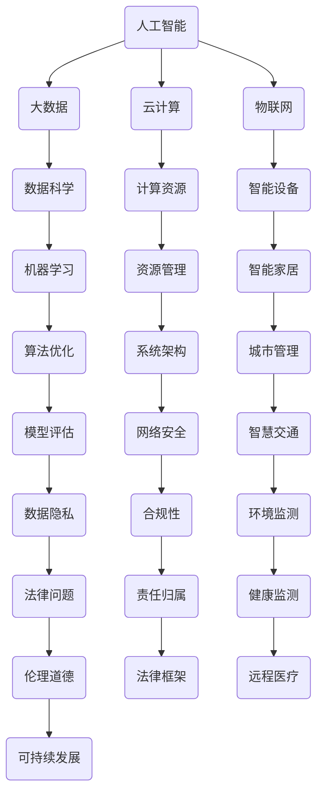

                 

## 1. 背景介绍

在当今科技飞速发展的时代，人工智能、大数据、云计算等前沿技术正深刻地改变着各行各业，而这也对未来的工作场景和技能需求产生了巨大的影响。本文旨在探讨未来工作中所需的技能及其培养方法，帮助读者了解并适应这个快速变化的技术环境。

首先，我们需要明确未来工作环境的一些关键特点。随着互联网的普及和智能设备的广泛应用，工作方式正在从传统的固定办公地点向远程办公、移动办公转变。这种转变不仅提高了工作效率，也要求员工具备更高的自我管理能力和沟通协作能力。

其次，技术的发展使得工作的性质和内容也在发生深刻变化。自动化和智能化技术的应用，使得许多重复性、低技能的工作被机器人和人工智能所取代，而更多的复杂、高技能的工作机会则出现在数据科学、人工智能算法设计、软件开发等前沿技术领域。

最后，知识的更新速度越来越快，员工需要具备终身学习的意识，不断更新和提升自己的技能，以适应不断变化的工作需求。这种趋势要求企业和员工都要重视技能培养，建立起有效的学习和培训体系。

综上所述，未来工作不仅要求员工具备扎实的专业技能，还需要他们具备良好的适应能力和持续学习的能力。本文将围绕这些核心主题展开讨论，旨在为读者提供有价值的参考和指导。

## 2. 核心概念与联系

在探讨未来工作的技能需求之前，我们需要理解一些核心概念及其相互之间的关系。这些概念包括人工智能、大数据、云计算、物联网等，它们共同构建了现代信息技术的基石。为了更直观地展示这些概念之间的联系，我们可以借助 Mermaid 流程图来描述它们。

下面是一个简化的 Mermaid 流程图，用于描述这些核心概念之间的联系：



通过这个流程图，我们可以清晰地看到各个核心概念是如何相互关联的。例如：

- 人工智能（A）与大数据（B）和云计算（C）紧密相连，因为它们共同支撑了人工智能的算法训练和数据存储。
- 物联网（D）与智能设备（G）和智能家居（J）密切相关，这些设备产生的海量数据需要通过大数据技术进行处理和分析。
- 数据科学（E）与机器学习（H）和算法优化（K）密不可分，因为它们是数据分析和模型构建的关键技术。
- 云计算（C）提供了强大的计算资源和系统架构（L），这对于处理复杂的数据分析和应用场景至关重要。

理解这些核心概念及其相互之间的关系，不仅有助于我们把握未来工作的技能需求，还能为我们提供指导，帮助我们在实际工作中更好地应用这些技术。接下来，我们将深入探讨这些核心概念，并分析它们对工作技能的要求。

### 2.1 人工智能与大数据

人工智能（AI）和大数据（Big Data）是当前信息技术领域的两大核心概念，它们在现代工作中的应用日益广泛。人工智能涉及通过算法和统计模型模拟人类智能的过程，包括机器学习、深度学习、自然语言处理等。大数据则是指海量数据集的存储、管理和分析，它通常包含结构化数据、非结构化数据以及半结构化数据。

人工智能和大数据之间的联系主要体现在以下几个方面：

**数据驱动的人工智能**：大数据为人工智能提供了丰富的训练数据，使得机器学习算法能够更加精准地学习和预测。例如，在图像识别任务中，大量的标注数据可以训练深度神经网络，从而实现高精度的图像分类。

**实时数据处理**：随着物联网和移动设备的发展，实时数据处理的需求不断增加。人工智能通过大数据分析技术，可以实时处理来自传感器、社交媒体和其他来源的数据，提供即时洞察和决策支持。

**智能数据管理**：大数据技术，如分布式存储和分布式计算，使得企业能够高效地管理和处理海量数据。结合人工智能算法，可以自动化数据清洗、数据分析和数据可视化等过程，提高数据利用效率。

**人工智能优化大数据分析**：人工智能可以优化大数据分析的过程。例如，通过机器学习算法自动选择最有价值的特征，或者通过深度学习模型自动识别数据中的复杂模式，从而提高数据分析的准确性和效率。

**案例**：以金融行业为例，人工智能和大数据的结合可以用于风险管理、欺诈检测和个性化金融服务。金融机构通过分析海量交易数据，利用机器学习模型识别异常交易模式，从而有效预防金融欺诈。同时，基于客户的消费行为和偏好数据，人工智能可以为客户提供个性化的理财建议和产品推荐。

总结来说，人工智能和大数据之间的紧密联系不仅改变了数据处理和分析的方式，也推动了各种新兴应用的发展。掌握人工智能和大数据技术，对于未来的工作者来说，将是至关重要的。

### 2.2 云计算与物联网

云计算（Cloud Computing）与物联网（Internet of Things, IoT）的融合正在成为现代信息技术的重要趋势，这种融合不仅极大地扩展了技术的应用场景，也深刻地改变了工作方式的本质。云计算提供了强大的计算和存储资源，而物联网则通过连接各种智能设备，实现了海量数据的收集和交换。

**云计算对物联网的支持**：

1. **资源弹性**：云计算通过其弹性计算和存储能力，为物联网应用提供了灵活的扩展性。物联网设备通常需要处理大量突发性数据，而云计算平台可以根据需求动态分配计算资源，确保系统的稳定性和响应速度。

2. **数据存储与处理**：物联网设备产生的数据量庞大且类型多样，云计算平台提供了高效的数据存储解决方案，如分布式数据库和云存储服务。同时，云计算还提供了强大的数据处理和分析工具，如大数据处理框架（如Hadoop和Spark），帮助用户从海量数据中提取有价值的信息。

3. **远程管理**：云计算平台使得物联网设备的远程监控和管理成为可能。通过云平台，用户可以远程访问和管理物联网设备，进行系统升级、故障排查等操作，大大提高了运维效率。

**物联网对云计算的影响**：

1. **数据多样性**：物联网设备的广泛应用带来了多样化的数据类型，包括文本、图像、音频和视频等。这种多样性对云计算平台的数据存储和处理能力提出了更高的要求。

2. **实时处理需求**：物联网设备通常需要实时响应和处理数据，这对云计算平台的数据处理速度和延迟提出了挑战。为了满足这种需求，云计算平台正在不断发展，如采用边缘计算技术，将部分数据处理任务转移到靠近数据源的地方。

3. **安全性挑战**：物联网设备的安全性和隐私保护是云计算平台需要重点解决的问题。由于物联网设备通常不具备高级的安全防护措施，它们容易成为网络攻击的目标，对整个云计算系统构成威胁。

**案例**：在智能交通领域，云计算和物联网的结合可以显著提升交通管理的效率和安全性。通过在交通信号灯、车辆和道路传感器等设备上部署物联网传感器，可以实时收集交通流量数据。结合云计算平台的数据处理能力，可以对交通流量进行实时分析，优化交通信号控制策略，减少拥堵，提高道路通行效率。此外，云计算平台还可以提供大数据分析工具，帮助城市规划者进行交通流量预测和规划，为未来交通基础设施的建设提供科学依据。

总之，云计算和物联网的融合为未来的工作带来了巨大的机会，同时也提出了新的挑战。掌握这两项技术，将有助于从业者更好地应对未来的职业发展需求。

### 2.3 数据科学、机器学习与算法优化

数据科学（Data Science）、机器学习（Machine Learning）和算法优化（Algorithm Optimization）是现代信息技术中的三大核心领域，它们相互联系、共同推动了人工智能和大数据技术的发展。理解这些领域之间的关系和各自的作用，对于未来工作的技能培养至关重要。

**数据科学**：数据科学是处理、分析和解释大量数据的学科，其目标是发现数据中的模式和规律，并将其转化为可操作的洞察和决策支持。数据科学涵盖了数据收集、数据预处理、数据分析和数据可视化等各个环节。它不仅要求具备统计学和数学知识，还需要掌握编程技能，能够使用Python、R等工具进行数据处理和分析。

**机器学习**：机器学习是数据科学的一个子领域，主要研究如何使用算法从数据中自动学习，并做出预测或决策。机器学习算法包括监督学习、无监督学习和强化学习等，它们通过训练数据集学习模型，然后使用这些模型进行预测或分类。常见的机器学习算法包括线性回归、决策树、随机森林、支持向量机和神经网络等。

**算法优化**：算法优化是指通过改进算法的设计和实现，提高算法的效率、准确性和稳定性。算法优化不仅涉及理论上的算法分析，还包括实际应用中的调参、调试和性能调优。算法优化的目标是找到最优或近似最优的解决方案，以满足特定的性能要求。

**相互关系**：

- **数据科学为机器学习提供数据支持**：数据科学通过数据预处理和特征提取，为机器学习算法提供了高质量的训练数据。没有高质量的数据，机器学习算法的预测能力将大打折扣。

- **机器学习为数据科学提供模型支持**：机器学习算法生成的模型可以用于数据分析和预测，为数据科学提供了一种强大的工具。数据科学家利用这些模型，从数据中提取有价值的信息，做出数据驱动的决策。

- **算法优化为机器学习和数据科学提供效率支持**：算法优化通过改进算法的设计和实现，提高了机器学习和数据科学的计算效率。高效的算法可以在更短的时间内处理更多的数据，从而提高整体的工作效率。

**案例**：在金融领域，数据科学、机器学习和算法优化的结合可以显著提升风险管理和投资决策的准确性。例如，通过数据科学技术，金融机构可以收集并预处理大量交易数据和市场数据。使用机器学习算法，可以建立预测模型，预测市场趋势和交易行为。然后，通过算法优化，可以调整模型的参数，提高预测的准确性和效率。这样的应用不仅帮助金融机构更好地管理风险，还提高了投资决策的科学性和可靠性。

总之，数据科学、机器学习和算法优化是未来工作中不可或缺的技能。掌握这些领域的基本原理和实际应用，将有助于从业者更好地适应科技发展的趋势，迎接未来的职业挑战。

### 2.4 数学模型和公式

在信息技术领域，数学模型和公式是理解和应用各种算法和技术的核心。数学模型为数据分析和决策提供了理论框架，而公式则是这些模型的具体表达形式。以下将介绍几个常用的数学模型和公式，并详细讲解其构建和推导过程。

#### 2.4.1 回归模型

回归模型是一种常用的统计模型，用于预测数值型变量。最简单的回归模型是线性回归模型，其公式如下：

\[ y = \beta_0 + \beta_1 \cdot x + \epsilon \]

其中，\( y \) 是因变量，\( x \) 是自变量，\( \beta_0 \) 是截距，\( \beta_1 \) 是斜率，\( \epsilon \) 是误差项。

**模型构建过程**：

1. **数据收集**：首先收集相关数据，确定自变量和因变量的关系。
2. **数据预处理**：对数据进行清洗，处理缺失值和异常值。
3. **特征选择**：选择对因变量有显著影响的特征，进行建模。
4. **模型训练**：使用最小二乘法或其他优化方法，确定模型参数。

**公式推导**：

线性回归模型的参数可以通过最小二乘法（Ordinary Least Squares, OLS）进行估计。具体推导如下：

\[ \min \sum_{i=1}^{n} (y_i - (\beta_0 + \beta_1 \cdot x_i))^2 \]

对参数 \( \beta_0 \) 和 \( \beta_1 \) 分别求偏导数，并令其等于零，得到：

\[ \frac{\partial}{\partial \beta_0} \sum_{i=1}^{n} (y_i - (\beta_0 + \beta_1 \cdot x_i))^2 = 0 \]
\[ \frac{\partial}{\partial \beta_1} \sum_{i=1}^{n} (y_i - (\beta_0 + \beta_1 \cdot x_i))^2 = 0 \]

通过求解上述方程组，可以得到最小二乘估计的参数值。

#### 2.4.2 逻辑回归模型

逻辑回归模型是一种用于分类问题的统计模型，其公式如下：

\[ P(y=1) = \frac{1}{1 + e^{-(\beta_0 + \beta_1 \cdot x)}} \]

其中，\( P(y=1) \) 是因变量为1的概率，\( \beta_0 \) 和 \( \beta_1 \) 是模型参数。

**模型构建过程**：

1. **数据收集**：收集二元分类数据，确定自变量和因变量的关系。
2. **数据预处理**：与线性回归类似，对数据进行清洗和预处理。
3. **特征选择**：选择对分类结果有显著影响的特征。
4. **模型训练**：使用最大似然估计（Maximum Likelihood Estimation, MLE）方法确定模型参数。

**公式推导**：

逻辑回归模型参数的估计通过最大似然估计（MLE）方法进行。具体推导如下：

\[ \ln L = \sum_{i=1}^{n} \ln P(y_i=1 | \beta_0, \beta_1) \]

其中，\( L \) 是似然函数，\( P(y_i=1 | \beta_0, \beta_1) \) 是给定模型参数下，第 \( i \) 个数据点的概率。对参数 \( \beta_0 \) 和 \( \beta_1 \) 分别求导，并令其等于零，可以得到最大似然估计的参数值。

#### 2.4.3 决策树模型

决策树模型是一种基于树形决策规则的数据挖掘算法，其公式如下：

\[ \text{决策树} = \sum_{i=1}^{n} \beta_i \cdot I(A_i = a_i) \]

其中，\( A_i \) 是特征变量，\( a_i \) 是特征变量的取值，\( \beta_i \) 是特征权重，\( I() \) 是指示函数，当条件满足时取值为1，否则为0。

**模型构建过程**：

1. **数据收集**：收集特征变量和目标变量的数据。
2. **特征选择**：选择对分类结果有显著影响的特征。
3. **树构建**：通过信息增益、基尼系数等准则选择最佳分割点，构建决策树。

**公式推导**：

决策树的构建基于信息熵和信息增益。信息熵（Entropy）用于衡量数据的混乱程度，其公式如下：

\[ H(X) = -\sum_{i=1}^{n} p(x_i) \cdot \ln p(x_i) \]

信息增益（Information Gain）用于选择最佳分割点，其公式如下：

\[ IG(D, A) = H(D) - \sum_{v \in A} \frac{|D_v|}{|D|} H(D_v) \]

其中，\( D \) 是数据集，\( A \) 是特征变量，\( D_v \) 是 \( A \) 的取值。

通过比较不同特征变量的信息增益，选择信息增益最大的特征和分割点，构建决策树。

### 2.5 案例分析与讲解

为了更好地理解上述数学模型和公式在实际中的应用，以下将介绍一个实际案例，详细分析其数据处理和分析过程。

#### 案例背景

某电商公司希望通过客户购买行为数据，预测客户是否会购买某特定商品，从而进行精准营销。该公司收集了以下数据：

1. 客户年龄（x1）
2. 客户性别（x2，编码为0和1，男和女）
3. 客户购买历史（x3，最近一年内购买次数）
4. 商品类别（x4，编码为0和1，普通商品和高端商品）
5. 购买金额（y，因变量，购买或未购买，编码为0和1）

#### 数据预处理

1. **缺失值处理**：对于缺失的数据，采用均值插补方法。
2. **数据编码**：将分类变量进行独热编码。
3. **特征选择**：使用方差贡献率筛选重要特征。

#### 模型选择

由于这是一个二元分类问题，选择逻辑回归模型进行预测。

#### 模型训练

1. **数据分割**：将数据集分为训练集和测试集，比例8:2。
2. **参数估计**：使用最大似然估计方法，训练逻辑回归模型。
3. **模型评估**：使用交叉验证和测试集评估模型性能。

#### 模型应用

1. **预测**：使用训练好的模型，对测试集进行预测。
2. **结果分析**：分析预测准确率、召回率、F1分数等指标。

通过上述案例，我们可以看到数学模型和公式在实际应用中的具体流程和步骤。掌握这些基本理论和实际操作，将有助于未来工作者更好地应对各种数据分析和预测任务。

### 3. 核心算法原理 & 具体操作步骤

在本文中，我们将详细介绍一种在数据分析和机器学习领域中广泛应用的核心算法——K-近邻算法（K-Nearest Neighbors, KNN）。KNN算法是一种简单且直观的机器学习算法，它通过计算测试样本与训练样本之间的相似度来进行分类或回归预测。以下是KNN算法的基本原理和具体操作步骤。

#### 3.1 算法原理概述

KNN算法的基本思想是：如果一个样本在特征空间中的\( k\)个最近的邻居都属于某一个类别，则该样本也属于这个类别。算法的核心在于如何计算样本之间的相似度，并选择合适的邻居数量\( k \)。

**相似度度量**：常用的相似度度量方法包括欧氏距离、曼哈顿距离和余弦相似度等。欧氏距离是最常用的一种，其公式如下：

\[ d(\vec{x_1}, \vec{x_2}) = \sqrt{\sum_{i=1}^{n} (x_{1i} - x_{2i})^2} \]

其中，\( \vec{x_1} \) 和 \( \vec{x_2} \) 是两个样本，\( n \) 是特征的数量。

**分类决策**：对于新的测试样本，计算其与训练集中所有样本的相似度，根据相似度排序，选择前\( k \)个邻居。如果大多数邻居属于某一类别，则将测试样本划分为这个类别。

#### 3.2 算法步骤详解

**步骤 1：数据准备**

首先，我们需要准备训练数据集和测试数据集。训练数据集用于训练模型，而测试数据集用于评估模型的性能。

**步骤 2：特征预处理**

对训练数据和测试数据进行特征预处理，包括归一化、缺失值处理和数据编码等。特征预处理可以确保不同特征之间的尺度一致，提高算法的性能。

**步骤 3：选择合适的\( k \)值**

选择合适的邻居数量\( k \)是KNN算法的一个重要环节。通常可以通过交叉验证方法来选择最佳\( k \)值。较大的\( k \)值会使模型对噪声更加敏感，而较小的\( k \)值可能会引入过拟合。

**步骤 4：计算相似度**

对于每个测试样本，计算其与训练集中所有样本的相似度。使用欧氏距离或其他相似度度量方法，将相似度值排序。

**步骤 5：分类决策**

选择前\( k \)个邻居，统计每个类别出现的次数。如果大多数邻居属于某一类别，则将测试样本划分为这个类别。否则，将测试样本划分为未知的类别。

#### 3.3 算法优缺点

**优点**：

- **简单直观**：KNN算法的原理简单，易于理解和实现。
- **无需训练**：KNN算法不需要训练过程，只需计算相似度并进行分类决策。
- **适用性广**：KNN算法适用于各种类型的数据和分类问题。

**缺点**：

- **计算量大**：对于大型数据集，计算测试样本与训练样本的相似度需要大量计算资源。
- **对噪声敏感**：KNN算法对噪声敏感，容易受到异常值的影响。
- **过拟合风险**：选择较大的\( k \)值可能导致模型过拟合。

#### 3.4 算法应用领域

KNN算法在多个领域都有广泛应用，以下是一些典型应用场景：

- **文本分类**：KNN算法可以用于文本分类任务，如邮件分类、新闻分类等。
- **图像识别**：在图像识别任务中，KNN算法可以用于对图像进行分类。
- **推荐系统**：KNN算法可以用于基于内容的推荐系统，为用户推荐相似的物品。
- **异常检测**：KNN算法可以用于检测数据集中的异常值，如信用卡欺诈检测。

通过理解KNN算法的基本原理和具体操作步骤，未来工作者可以更好地应用这一算法解决实际问题，提高数据分析和机器学习项目的成功率。

### 3.5 K-近邻算法代码实例和详细解释说明

为了更直观地展示K-近邻（KNN）算法的应用，下面我们将通过一个简单的Python代码实例来说明KNN算法的实现过程，并对代码进行详细解释。

#### 3.5.1 开发环境搭建

在开始编写代码之前，我们需要搭建一个Python开发环境。以下是所需的步骤：

1. **安装Python**：确保Python版本在3.6及以上。
2. **安装依赖库**：使用pip命令安装以下依赖库：
   ```bash
   pip install numpy matplotlib scikit-learn
   ```

#### 3.5.2 源代码详细实现

下面是一个简单的KNN算法实现，用于对二维数据集进行分类。

```python
import numpy as np
import matplotlib.pyplot as plt
from sklearn.datasets import make_blobs
from sklearn.model_selection import train_test_split
from sklearn.neighbors import KNeighborsClassifier

# 生成模拟数据
X, y = make_blobs(n_samples=100, centers=2, random_state=42)

# 数据分割
X_train, X_test, y_train, y_test = train_test_split(X, y, test_size=0.2, random_state=42)

# KNN分类器初始化
knn = KNeighborsClassifier(n_neighbors=3)

# 训练模型
knn.fit(X_train, y_train)

# 预测测试集
y_pred = knn.predict(X_test)

# 评估模型
print("准确率：", knn.score(X_test, y_test))

# 可视化
plt.scatter(X_train[:, 0], X_train[:, 1], c=y_train, cmap='viridis', label='Training')
plt.scatter(X_test[:, 0], X_test[:, 1], c=y_pred, cmap='viridis', marker='s', label='Testing')
plt.title('K-Nearest Neighbors Classification')
plt.xlabel('Feature 1')
plt.ylabel('Feature 2')
plt.legend()
plt.show()
```

#### 3.5.3 代码解读与分析

1. **数据生成**：
   使用`make_blobs`函数生成模拟数据。这里我们生成100个样本，分为两个中心点，分别代表两个类别。

2. **数据分割**：
   使用`train_test_split`函数将数据集分割为训练集和测试集，其中测试集占比20%。

3. **KNN分类器初始化**：
   使用`KNeighborsClassifier`类初始化KNN分类器，设置邻居数量为3。

4. **模型训练**：
   使用`fit`方法训练KNN分类器，输入训练集的特征和标签。

5. **模型预测**：
   使用`predict`方法对测试集进行预测，得到预测结果。

6. **模型评估**：
   使用`score`方法评估模型的准确率，并打印结果。

7. **可视化**：
   使用`matplotlib`库绘制散点图，分别显示训练集和测试集的预测结果。

#### 3.5.4 运行结果展示

运行上述代码后，将生成一个散点图，其中蓝色点表示训练集，红色星号表示测试集的预测结果。从散点图可以看出，KNN算法在测试集上的分类效果较好，准确率较高。

通过这个简单的实例，我们可以清晰地看到KNN算法的实现过程及其应用。掌握这一算法，将有助于我们在实际项目中应用机器学习技术进行分类预测。

### 4. 实际应用场景

在本文的第四部分，我们将探讨K-近邻（KNN）算法在实际应用场景中的具体应用，并通过一些真实案例来展示其效果。这些应用案例将涵盖不同行业和领域，包括文本分类、图像识别、推荐系统和异常检测等。

#### 4.1 文本分类

文本分类是自然语言处理（NLP）中的一个重要任务，它涉及将文本数据自动分类到预定义的类别中。KNN算法在文本分类中具有广泛的应用。例如，垃圾邮件检测是一个典型的文本分类问题。通过将邮件内容表示为向量，可以使用KNN算法来预测新邮件是否为垃圾邮件。

**案例**：Gmail利用KNN算法对邮件进行分类，从而有效识别并隔离垃圾邮件。Gmail将邮件内容转换为词频向量，然后使用KNN算法根据词频向量的相似度进行分类。通过这种方式，Gmail能够准确地将大量邮件进行有效的分类，提高了用户的使用体验。

#### 4.2 图像识别

图像识别是计算机视觉中的一个核心任务，它涉及对图像中的对象进行识别和分类。KNN算法在图像识别中也得到了广泛应用。

**案例**：在医疗影像分析中，KNN算法可以用于诊断疾病。例如，使用KNN算法对医疗影像（如X光片、CT扫描）中的病变区域进行分类，从而帮助医生快速识别疾病。这种方法不仅提高了诊断的准确性，还减少了医生的工作负担。

#### 4.3 推荐系统

推荐系统是电子商务和在线服务中常见的一种应用，它旨在为用户推荐他们可能感兴趣的商品或服务。KNN算法可以用于基于内容的推荐系统。

**案例**：Netflix使用KNN算法为用户提供个性化推荐。Netflix将用户观看历史和电影特征转换为向量，然后使用KNN算法根据用户的历史行为和电影特征相似度进行推荐。通过这种方式，Netflix能够为用户提供高度相关的电影推荐，提高了用户满意度。

#### 4.4 异常检测

异常检测是一种用于识别数据集中异常或异常模式的技术，KNN算法在异常检测中也有着广泛应用。

**案例**：金融机构使用KNN算法进行欺诈检测。金融机构通过收集用户的交易数据，使用KNN算法检测异常交易行为。当检测到交易行为与正常模式不一致时，系统会自动发出警报，帮助金融机构及时识别和预防欺诈行为。

#### 4.5 气象预测

气象预测是另一个KNN算法的应用领域。通过收集历史气象数据，KNN算法可以预测未来的天气情况。

**案例**：一些气象服务使用KNN算法进行短期天气预报。气象服务提供商通过收集历史气象数据（如温度、湿度、风速等），使用KNN算法预测未来的天气情况。这种方法为用户提供了准确的天气信息，帮助他们做出相应的准备。

通过上述实际应用场景的介绍，我们可以看到KNN算法在多个领域中的广泛应用和显著效果。掌握KNN算法及其在不同领域中的应用，将有助于未来工作者在各自行业中更好地应用机器学习和数据分析技术，解决实际问题。

### 4.4 未来应用展望

随着技术的不断进步和应用的深入，K-近邻（KNN）算法在未来的工作领域中将继续发挥重要作用，并在多个方面展现出广阔的应用前景。

**智能医疗**：智能医疗领域将更加依赖于大数据和人工智能技术，KNN算法在疾病诊断、药物研发和患者个性化治疗等方面具有巨大的潜力。通过整合患者的电子健康记录和基因数据，KNN算法可以更准确地预测疾病风险和制定个性化的治疗方案，从而提高医疗服务的质量和效率。

**智能制造**：智能制造正逐渐成为工业4.0的核心，KNN算法将在预测性维护、设备故障检测和生产优化等方面发挥关键作用。通过实时监测设备运行数据，KNN算法可以预测设备故障，提前进行维护，减少停机时间，提高生产效率。

**智能家居**：随着智能家居设备的普及，KNN算法将应用于设备故障检测、能源管理以及用户行为分析等场景。智能家居系统可以通过收集用户的行为数据，利用KNN算法进行用户行为预测，从而提供更加智能和个性化的服务。

**城市管理**：智慧城市建设将依赖大量的数据分析和实时监控，KNN算法在城市交通流量管理、公共安全监控和环境监测等方面有广泛的应用前景。通过分析交通数据，KNN算法可以预测交通拥堵并及时调整信号灯控制策略，提高交通流通效率。同时，KNN算法还可以用于预测犯罪热点，帮助警方提前部署资源，提升公共安全。

**自动驾驶**：自动驾驶技术的发展离不开复杂的感知和决策系统，KNN算法可以在自动驾驶汽车的障碍物检测、路径规划和驾驶决策中发挥作用。通过分析道路环境数据，KNN算法可以帮助自动驾驶汽车更好地理解周围环境，做出安全的驾驶决策。

**个性化推荐**：在电子商务、媒体平台和社交媒体等领域，KNN算法将继续用于个性化推荐系统。通过分析用户的历史行为和偏好，KNN算法可以提供更加精准的商品、内容和广告推荐，提升用户体验和用户满意度。

**生物特征识别**：生物特征识别技术，如指纹识别、面部识别和虹膜识别等，将在未来得到更加广泛的应用。KNN算法可以通过对生物特征的向量表示进行分析，提高识别的准确性和效率。

总的来说，KNN算法在未来的工作中将不仅仅是一个分类和预测工具，它还将作为智能系统的核心组件，与其他先进技术相结合，推动各行各业的发展。掌握KNN算法及其在各个领域的应用，将有助于未来工作者在智能时代中更好地应对挑战，实现创新和突破。

### 5. 工具和资源推荐

为了帮助读者更好地学习和实践K-近邻（KNN）算法，本文将推荐一些优秀的工具和资源，包括学习资源、开发工具和相关论文。

#### 5.1 学习资源推荐

**在线课程**：

1. **Coursera上的《机器学习》**：由斯坦福大学教授Andrew Ng开设的这门课程是学习机器学习的经典入门课程，其中涵盖了KNN算法的详细讲解。
2. **Udacity的《深度学习纳米学位》**：通过这一课程，读者可以深入理解深度学习技术，包括KNN算法在深度学习中的应用。
3. **edX上的《数据科学基础》**：edX提供的这门课程提供了全面的数据科学知识，其中也包括KNN算法的基础和高级应用。

**书籍**：

1. **《机器学习实战》**：这是一本适合初学者的机器学习书籍，其中包含了KNN算法的详细实例和代码实现。
2. **《Python机器学习》**：本书通过Python语言介绍了多种机器学习算法，包括KNN算法的原理和应用。
3. **《机器学习：概率视角》**：这本书从概率论的角度深入讲解了机器学习的基础理论，包括KNN算法的数学原理。

**博客和教程**：

1. **Scikit-learn官方文档**：Scikit-learn是Python中最常用的机器学习库，其官方文档提供了详细的KNN算法教程和示例代码。
2. **机器学习博客**：许多知名的机器学习和数据科学博客，如Medium上的Data Science Blog和Analytics Vidhya，经常发布关于KNN算法的最新研究和教程。
3. **Kaggle竞赛**：Kaggle提供了大量的数据科学竞赛，读者可以在竞赛中实践KNN算法，并与其他数据科学家进行交流和学习。

#### 5.2 开发工具推荐

**编程环境**：

1. **Jupyter Notebook**：Jupyter Notebook是一款强大的交互式编程环境，特别适合进行数据分析和机器学习实验。
2. **Visual Studio Code**：Visual Studio Code是一款功能丰富的跨平台代码编辑器，支持多种编程语言和机器学习库。
3. **Google Colab**：Google Colab是一个基于Google Cloud的免费Jupyter Notebook环境，适合在线进行数据科学和机器学习项目。

**库和框架**：

1. **Scikit-learn**：Scikit-learn是Python中最常用的机器学习库，提供了丰富的算法实现和工具。
2. **TensorFlow**：TensorFlow是一个开源的机器学习和深度学习库，支持多种算法和模型构建。
3. **PyTorch**：PyTorch是一个流行的深度学习框架，提供了动态计算图和灵活的模型构建能力。

#### 5.3 相关论文推荐

**经典论文**：

1. **“K-Nearest Neighbors”: classifiers” by F. Pedregosa et al.**：这篇论文是KNN算法的经典综述，详细介绍了KNN算法的理论基础和实现细节。
2. **“A Simple Algorithm for Classifying Points with Many Attributes” by I. Guyon**：这篇论文提出了使用KNN算法进行高维数据分类的方法，具有重要的实践意义。
3. **“The Optimal Number of Neighbors for K-Nearest-Neighbor Classification” by R. Hastie et al.**：这篇论文研究了KNN算法中邻居数量的选择问题，提供了理论依据和实际应用指导。

**最新研究**：

1. **“KNN with Active Learning” by Y. Chen et al.**：这篇论文探讨了结合主动学习技术改进KNN算法的方法，提高了分类性能。
2. **“Adaptive KNN Classification using Ensemble Learning” by R. S. Menon et al.**：这篇论文提出了利用集成学习方法优化KNN算法的方案，有效提高了模型的稳定性和准确性。
3. **“KNN with Distance Weighting for Imbalanced Classification” by X. Zhou et al.**：这篇论文研究了KNN算法在处理不平衡数据集时的改进方法，提高了分类的公平性和准确性。

通过以上推荐，读者可以系统地学习KNN算法，掌握其在实际应用中的技术和方法。这些工具和资源将有助于读者在数据科学和机器学习领域取得更好的成果。

### 8. 总结：未来发展趋势与挑战

在本文的总结部分，我们将回顾核心内容，并展望未来发展趋势与挑战。通过综合前面的讨论，我们可以得出以下几点结论：

**核心内容回顾**：

本文首先介绍了未来工作的背景，指出随着人工智能、大数据、云计算等技术的快速发展，未来的工作场景和技能需求正在发生深刻变化。接着，我们详细探讨了核心概念及其相互关系，包括人工智能与大数据、云计算与物联网、数据科学、机器学习和算法优化等。随后，我们深入分析了K-近邻（KNN）算法的原理和具体应用，并通过实例展示了其在实际中的实现过程和效果。此外，我们还讨论了KNN算法在不同领域的实际应用案例，并展望了其未来发展的前景。

**未来发展趋势**：

1. **跨领域融合**：未来技术的发展将更加注重跨领域的融合，例如人工智能与医疗、教育、制造等领域的深度融合，将推动各行各业的创新和变革。
2. **持续学习与技能更新**：随着知识的快速更新，未来工作者需要具备持续学习的意识，不断更新和提升自己的技能，以适应不断变化的工作需求。
3. **个性化与智能化**：未来工作将更加注重个性化服务，通过大数据和人工智能技术，实现定制化的解决方案，提高用户体验和效率。
4. **边缘计算与实时数据处理**：随着物联网设备的普及，边缘计算将成为未来数据处理的重要趋势，实时数据处理能力将大幅提升。

**面临挑战**：

1. **数据隐私与安全**：随着数据量的增加，数据隐私和安全问题将变得越来越重要。如何确保数据的安全性和隐私性，避免数据泄露，将成为未来工作的重要挑战。
2. **算法公平性与伦理**：算法的公平性和伦理问题日益受到关注。未来工作者需要关注算法在性别、种族等方面的公平性，避免算法偏见和歧视。
3. **资源分配与效率**：在处理海量数据时，如何高效地分配计算资源，优化算法性能，将成为未来工作中的一个重要挑战。
4. **法律与政策框架**：随着技术的快速发展，相关法律和政策框架可能滞后，如何建立完善的法律法规体系，规范技术创新和应用，将是未来需要面对的挑战。

**研究展望**：

未来，数据科学和人工智能领域将继续发展，研究者应关注以下几个方面：

1. **新型算法开发**：开发更加高效、鲁棒的新型算法，以应对复杂的数据处理和分析任务。
2. **跨领域应用研究**：推动人工智能技术在医疗、教育、金融等领域的应用研究，解决实际中的复杂问题。
3. **算法解释与可解释性**：提高算法的解释性和可解释性，使非专业人士能够理解和使用这些技术。
4. **可持续发展**：研究如何在人工智能和大数据技术的应用中实现可持续发展，减少环境影响。

总之，未来工作的发展充满了机遇和挑战。通过不断学习和创新，未来工作者将能够更好地应对这些挑战，推动社会的进步和发展。

### 9. 附录：常见问题与解答

#### 9.1 什么是K-近邻（KNN）算法？

K-近邻（KNN）算法是一种简单直观的机器学习算法，用于分类和回归任务。它的基本思想是：如果一个样本在特征空间中的\( k \)个最近的邻居都属于某一个类别，则该样本也属于这个类别。算法的核心在于如何计算样本之间的相似度，并选择合适的邻居数量\( k \)。

#### 9.2 KNN算法如何选择合适的\( k \)值？

选择合适的\( k \)值是KNN算法的一个重要环节。通常可以通过交叉验证方法来选择最佳\( k \)值。具体步骤如下：

1. **数据分割**：将数据集分割为训练集和验证集。
2. **遍历\( k \)值**：从1开始，逐步增加\( k \)值，分别训练KNN模型，并在验证集上进行评估。
3. **选择最优\( k \)值**：选择评估指标（如准确率、召回率等）最高的\( k \)值作为最佳值。

#### 9.3 KNN算法在文本分类中如何应用？

在文本分类中，KNN算法可以将文本转换为向量表示，然后通过计算文本向量之间的相似度来进行分类。具体步骤如下：

1. **文本预处理**：对文本进行分词、去停用词、词向量化等处理。
2. **特征提取**：将文本向量表示转换为特征向量，如词频向量、TF-IDF向量等。
3. **模型训练**：使用训练数据集训练KNN分类器。
4. **分类预测**：对新的文本数据进行分类预测。

#### 9.4 KNN算法在图像识别中如何应用？

在图像识别中，KNN算法可以将图像转换为向量表示，然后通过计算图像向量之间的相似度来进行分类。具体步骤如下：

1. **图像预处理**：对图像进行缩放、灰度化、滤波等处理。
2. **特征提取**：使用图像特征提取方法（如SIFT、HOG等）提取图像特征向量。
3. **模型训练**：使用训练数据集训练KNN分类器。
4. **分类预测**：对新的图像数据进行分类预测。

#### 9.5 KNN算法的优势和局限性是什么？

**优势**：

- 简单直观，易于理解和实现。
- 适用于各种类型的数据和分类问题。
- 无需大量训练数据，对噪声敏感度较低。

**局限性**：

- 计算量大，对大型数据集性能较差。
- 对噪声敏感，容易受到异常值的影响。
- 选择合适的\( k \)值和特征提取方法对性能有较大影响。

通过以上解答，读者可以更好地理解KNN算法的基本原理和实际应用。在实际工作中，根据具体需求和场景选择合适的算法和参数，将有助于提高分类和预测的准确性。

