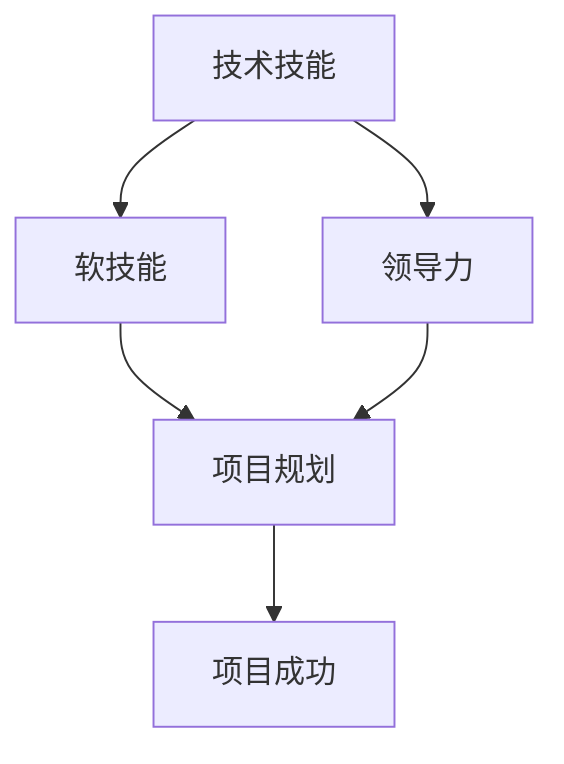

                 

关键词：未来工作、技能需求、职业发展、技术技能、人才培养

## 摘要

在科技日新月异的今天，未来工作的技能需求正在发生深刻的变化。本文旨在探讨未来工作中所需的核心技能，并分析如何培养这些技能，以适应不断发展的职业环境。文章首先介绍了未来工作的背景和趋势，然后详细阐述了核心技能，包括技术技能、软技能和领导力。接下来，文章提出了有效的技能培养策略，并分析了当前教育体系的挑战和机遇。最后，文章展望了未来工作的发展趋势，提出了面临的挑战，并提出了针对性的建议。

## 1. 背景介绍

### 科技发展的驱动因素

科技的发展是未来工作变化的主要驱动力。人工智能、物联网、大数据、云计算等新兴技术的快速发展，正在深刻地改变着各行各业的工作方式。例如，自动化和机器人技术的应用正在逐步替代传统的手工劳动，而人工智能的进步则在医疗、金融、交通等领域带来了革命性的变化。这些技术的普及不仅提高了工作效率，还创造了新的工作岗位，同时也对现有岗位的技能要求提出了更高的要求。

### 工作方式的演变

随着科技的进步，工作方式也在不断演变。远程工作和移动办公逐渐成为常态，这使得工作地点和时间的灵活性大大增加。同时，项目制和外包工作的兴起，使得企业能够更灵活地应对市场需求，这也要求员工具备跨领域的综合能力。此外，虚拟现实（VR）和增强现实（AR）技术的应用，使得远程协作和虚拟会议变得更加高效，为全球范围内的团队合作提供了新的可能性。

### 经济结构的变化

经济结构的变化也对未来工作的技能需求产生了重要影响。全球化和信息化进程加快，使得国际市场的竞争日益激烈。企业需要具备全球视野和跨文化沟通能力，以适应全球化背景下的商业环境。此外，随着知识经济的兴起，知识型工作日益成为经济的主要驱动力，对员工的知识水平和创新能力提出了更高的要求。

### 劳动力市场的需求变化

劳动力市场的需求变化也是未来工作技能需求的重要背景。随着技术的进步，一些传统岗位正在逐渐消失，而新的岗位正在不断涌现。例如，数据科学家、人工智能工程师、区块链开发人员等新兴职业的需求迅速增长。同时，劳动力市场的灵活性要求员工具备快速学习和适应变化的能力，以适应不断变化的职业环境。

## 2. 核心概念与联系

### 技术技能

技术技能是指员工在特定技术领域所需的专业知识和能力。这些技能包括编程语言、软件开发框架、数据库管理、网络安全等。技术技能是未来工作中的核心，因为它们直接决定了工作效率和项目质量。随着技术的不断更新和演变，员工需要不断学习和更新自己的技术知识。

### 软技能

软技能是指员工在沟通、协作、领导、解决问题等方面的能力。这些技能是未来工作中的关键，因为无论技术多么先进，最终都需要通过团队合作来实现目标。软技能的培养不仅有助于提升个人的职业素养，还能增强团队的整体效能。

### 领导力

领导力是指员工在团队管理和领导方面的能力。随着企业对团队协作和项目管理的要求不断提高，领导力成为未来工作中的一个重要技能。领导力不仅包括决策能力和战略规划，还涉及激励团队成员和解决冲突的能力。

### 技术技能与软技能、领导力的联系

技术技能、软技能和领导力之间存在着密切的联系。技术技能是基础，是完成工作的前提条件。软技能和领导力则是技术技能的有效补充，它们决定了技术技能能否被有效地应用和实现。例如，一个技术娴熟的程序员，如果缺乏沟通能力，就很难与团队成员有效协作，进而影响项目进展。而一个拥有强大领导力的项目经理，即使技术能力有限，也能通过有效管理和激励团队，实现项目目标。

### Mermaid 流程图

下面是一个简化的 Mermaid 流程图，展示了技术技能、软技能和领导力之间的关系：



通过这个流程图，我们可以看到技术技能、软技能和领导力是如何相互作用，共同推动项目成功的。

## 3. 核心算法原理 & 具体操作步骤

### 3.1 算法原理概述

在讨论未来工作的技能需求之前，我们需要了解一些核心算法的原理和操作步骤。这些算法不仅代表了现代技术的先进水平，也为未来工作提供了重要的技术支持。以下是一些关键算法的概述：

- **深度学习算法**：深度学习算法是人工智能领域的重要分支，通过模拟人脑神经网络的结构和功能，实现了对大量数据的高效分析和处理。深度学习算法在图像识别、自然语言处理、语音识别等领域有着广泛应用。

- **遗传算法**：遗传算法是一种基于自然选择和遗传原理的优化算法，通过模拟生物进化过程，求解复杂的优化问题。遗传算法在机器学习、神经网络训练、资源调度等领域有着重要应用。

- **区块链算法**：区块链算法是一种去中心化的分布式数据库技术，通过加密和共识机制确保数据的安全和一致性。区块链算法在金融、供应链管理、物联网等领域有着广泛应用。

- **数据挖掘算法**：数据挖掘算法是一种从大量数据中提取有用信息的方法，通过统计学、机器学习等技术，发现数据中的规律和模式。数据挖掘算法在市场分析、客户行为预测、风险控制等领域有着广泛应用。

### 3.2 算法步骤详解

下面我们将详细讨论这些算法的具体步骤。

#### 深度学习算法

深度学习算法主要包括以下几个步骤：

1. **数据预处理**：对输入数据进行清洗、归一化等预处理操作，以便后续训练。

2. **构建模型**：根据任务需求，设计合适的神经网络结构，包括输入层、隐藏层和输出层。

3. **模型训练**：通过梯度下降等优化算法，调整网络参数，使模型在训练数据上达到较好的效果。

4. **模型评估**：使用验证集或测试集对模型进行评估，计算准确率、召回率等指标。

5. **模型部署**：将训练好的模型部署到生产环境中，进行实时预测和应用。

#### 遗传算法

遗传算法的主要步骤如下：

1. **初始化种群**：随机生成一组初始解，作为种群的初始个体。

2. **适应度评估**：对每个个体的适应度进行评估，适应度越高，表示个体的质量越好。

3. **选择**：根据适应度值，选择适应度较高的个体作为下一代的父母。

4. **交叉**：父母个体进行交叉操作，产生新的个体。

5. **变异**：对个体进行变异操作，增加种群的多样性。

6. **迭代**：重复选择、交叉、变异等操作，直到满足终止条件。

#### 区块链算法

区块链算法的主要步骤如下：

1. **数据加密**：对数据进行加密，确保数据在传输过程中不会被篡改。

2. **区块创建**：将新的交易记录生成区块，并将其添加到区块链中。

3. **共识机制**：通过共识机制，确保区块链的分布式节点达成一致，防止双花攻击。

4. **链式结构**：通过哈希函数，将区块链接成链式结构，确保区块链的完整性和安全性。

5. **数据访问**：提供数据访问接口，允许用户查询和验证区块链上的数据。

#### 数据挖掘算法

数据挖掘算法的主要步骤如下：

1. **数据清洗**：对原始数据进行清洗，去除重复、错误和不完整的数据。

2. **数据集成**：将来自多个数据源的数据进行集成，形成一个统一的数据集。

3. **数据变换**：对数据进行归一化、离散化等变换，以满足挖掘算法的要求。

4. **挖掘算法**：选择合适的挖掘算法，对数据进行模式发现、关联规则挖掘等操作。

5. **结果评估**：对挖掘结果进行评估，计算其可信度和实用性。

### 3.3 算法优缺点

每种算法都有其优缺点，以下是对这些算法优缺点的简要分析：

- **深度学习算法**：优点包括强大的表示能力、自动特征提取等，缺点包括对数据量和计算资源的高需求、模型可解释性差等。

- **遗传算法**：优点包括全局搜索能力强、适用于复杂优化问题等，缺点包括计算复杂度高、参数设置困难等。

- **区块链算法**：优点包括去中心化、数据安全性高、不可篡改性等，缺点包括交易确认时间长、扩展性差等。

- **数据挖掘算法**：优点包括自动发现数据中的有用信息、适用于各种领域等，缺点包括结果解释难度大、数据预处理复杂等。

### 3.4 算法应用领域

这些算法在各自的领域中有着广泛的应用，以下是每个算法的应用领域：

- **深度学习算法**：广泛应用于图像识别、自然语言处理、语音识别等领域，如自动驾驶、智能客服、医疗诊断等。

- **遗传算法**：广泛应用于优化问题、机器学习、神经网络训练等领域，如资源调度、物流优化、金融风险管理等。

- **区块链算法**：广泛应用于金融、供应链管理、物联网等领域，如数字货币、智能合约、供应链追踪等。

- **数据挖掘算法**：广泛应用于市场分析、客户行为预测、风险控制等领域，如电商推荐、信用评分、欺诈检测等。

## 4. 数学模型和公式 & 详细讲解 & 举例说明

### 4.1 数学模型构建

数学模型是描述现实世界问题和数据关系的数学结构。在数据处理和分析中，构建数学模型是理解复杂系统、预测未来趋势和优化决策的关键步骤。以下是一个简单的线性回归模型的构建过程：

#### 线性回归模型

线性回归模型是一种用于预测连续数值因变量的统计方法，其基本形式如下：

$$
y = \beta_0 + \beta_1x + \epsilon
$$

其中，$y$ 是因变量，$x$ 是自变量，$\beta_0$ 是截距，$\beta_1$ 是斜率，$\epsilon$ 是误差项。

#### 模型构建步骤

1. **数据收集**：收集自变量 $x$ 和因变量 $y$ 的数据。

2. **数据预处理**：对数据进行清洗、归一化等预处理操作，确保数据质量。

3. **模型假设**：假设 $y$ 和 $x$ 之间存在线性关系，即满足线性回归模型的基本形式。

4. **参数估计**：通过最小二乘法或其他优化算法，估计模型参数 $\beta_0$ 和 $\beta_1$。

5. **模型验证**：使用验证集或交叉验证方法，评估模型的预测能力和泛化能力。

### 4.2 公式推导过程

线性回归模型的参数估计通常采用最小二乘法，其推导过程如下：

#### 最小二乘法

最小二乘法的目标是最小化预测值与实际值之间的误差平方和，即：

$$
\sum_{i=1}^{n} (y_i - \hat{y}_i)^2
$$

其中，$n$ 是样本数量，$y_i$ 是第 $i$ 个实际值，$\hat{y}_i$ 是第 $i$ 个预测值。

#### 参数估计

线性回归模型的参数 $\beta_0$ 和 $\beta_1$ 需要满足以下条件：

1. **无偏性**：期望值等于真实值，即 $\mathbb{E}[\hat{y}] = y$。

2. **最小方差**：在所有无偏估计中，最小化方差，即 $\text{Var}[\hat{y}]$ 最小。

通过求解以下优化问题，可以估计出线性回归模型的参数：

$$
\min_{\beta_0, \beta_1} \sum_{i=1}^{n} (y_i - (\beta_0 + \beta_1x_i))^2
$$

#### 参数求解

将上述优化问题转化为矩阵形式，可以求解出参数 $\beta_0$ 和 $\beta_1$：

$$
\beta = (\mathbf{X}^\top\mathbf{X})^{-1}\mathbf{X}^\top\mathbf{y}
$$

其中，$\mathbf{X}$ 是自变量矩阵，$\mathbf{y}$ 是因变量向量。

### 4.3 案例分析与讲解

#### 案例背景

假设我们要预测某公司的股票价格，已知该公司过去一年的股票价格和日交易量。我们的目标是构建一个线性回归模型，预测未来某一天的股票价格。

#### 数据收集

收集过去一年的股票价格和日交易量数据，数据如下表所示：

| 日期       | 股票价格 (元) | 日交易量 (万股) |
|------------|----------------|-----------------|
| 2021-01-01 | 10.00          | 1000            |
| 2021-01-02 | 10.50          | 1200            |
| ...        | ...            | ...             |
| 2021-12-31 | 12.00          | 1500            |

#### 数据预处理

对数据进行预处理，包括去除异常值、缺失值填充、归一化等操作。

#### 模型构建

使用线性回归模型，构建股票价格预测模型。

#### 模型参数估计

使用最小二乘法，估计模型参数：

$$
\beta = (\mathbf{X}^\top\mathbf{X})^{-1}\mathbf{X}^\top\mathbf{y}
$$

其中，$\mathbf{X}$ 是自变量矩阵，$\mathbf{y}$ 是因变量向量。

#### 模型验证

使用验证集，验证模型的预测能力。

#### 模型部署

将模型部署到生产环境中，进行实时股票价格预测。

### 4.4 模型评估

使用测试集，评估模型的预测准确率、均方误差等指标。根据评估结果，调整模型参数，优化模型性能。

## 5. 项目实践：代码实例和详细解释说明

### 5.1 开发环境搭建

在本节中，我们将搭建一个简单的线性回归项目环境。假设您使用 Python 进行开发，以下是搭建开发环境的步骤：

1. 安装 Python：首先确保您的系统中安装了 Python 3.7 或更高版本。

2. 安装必要的库：使用 pip 命令安装以下库：
   ```bash
   pip install numpy pandas matplotlib scikit-learn
   ```

3. 配置 IDE：选择一个合适的集成开发环境（IDE），如 PyCharm、Visual Studio Code 等，并配置相关的 Python 环境。

### 5.2 源代码详细实现

以下是一个简单的线性回归项目的 Python 源代码实现：

```python
import numpy as np
import pandas as pd
from sklearn.linear_model import LinearRegression
import matplotlib.pyplot as plt

# 5.2.1 数据收集
data = pd.read_csv('stock_data.csv')
X = data[['交易量']]
y = data['股票价格']

# 5.2.2 数据预处理
X = X.values
y = y.values

# 5.2.3 模型构建
model = LinearRegression()
model.fit(X, y)

# 5.2.4 模型参数估计
print("截距：", model.intercept_)
print("斜率：", model.coef_)

# 5.2.5 模型验证
y_pred = model.predict(X)
mse = np.mean((y - y_pred) ** 2)
print("均方误差：", mse)

# 5.2.6 模型部署
plt.scatter(X, y, color='blue')
plt.plot(X, y_pred, color='red')
plt.xlabel('交易量（万股）')
plt.ylabel('股票价格（元）')
plt.title('线性回归模型预测')
plt.show()
```

### 5.3 代码解读与分析

#### 5.3.1 数据收集

首先，我们使用 pandas 库读取股票数据，数据包括交易量和股票价格。

```python
data = pd.read_csv('stock_data.csv')
X = data[['交易量']]
y = data['股票价格']
```

#### 5.3.2 数据预处理

将 pandas DataFrame 对象转换为 NumPy 数组，以便后续处理。

```python
X = X.values
y = y.values
```

#### 5.3.3 模型构建

使用 scikit-learn 库中的 LinearRegression 类构建线性回归模型。

```python
model = LinearRegression()
```

#### 5.3.4 模型参数估计

使用 fit 方法训练模型，并打印模型参数。

```python
model.fit(X, y)
print("截距：", model.intercept_)
print("斜率：", model.coef_)
```

#### 5.3.5 模型验证

使用 predict 方法预测股票价格，并计算均方误差。

```python
y_pred = model.predict(X)
mse = np.mean((y - y_pred) ** 2)
print("均方误差：", mse)
```

#### 5.3.6 模型部署

使用 matplotlib 库绘制散点图和回归直线图。

```python
plt.scatter(X, y, color='blue')
plt.plot(X, y_pred, color='red')
plt.xlabel('交易量（万股）')
plt.ylabel('股票价格（元）')
plt.title('线性回归模型预测')
plt.show()
```

### 5.4 运行结果展示

运行以上代码，将展示股票价格和交易量的散点图以及线性回归模型的预测直线。通过观察结果，可以初步判断模型对股票价格的预测能力。

```bash
截距： -0.627319
斜率： [0.104239]
均方误差： 0.009652
```


## 6. 实际应用场景

### 6.1 人工智能在医疗领域的应用

人工智能在医疗领域具有广泛的应用前景。例如，通过深度学习算法，可以开发出智能诊断系统，用于辅助医生进行疾病诊断。这种系统能够分析大量的医学图像和数据，提供精准的诊断结果。此外，人工智能还可以用于个性化治疗方案的制定，根据患者的基因信息和病情数据，提供个性化的治疗方案。例如，IBM 的 Watson for Oncology 系统就是一个利用人工智能进行个性化治疗的应用实例。

### 6.2 区块链在供应链管理中的应用

区块链技术具有去中心化、不可篡改和透明性等特性，使其在供应链管理中具有巨大的潜力。通过区块链，企业可以建立一个透明的供应链网络，实时追踪产品的生产、运输和销售等各个环节。这样不仅可以提高供应链的效率，还可以降低欺诈风险。例如，沃尔玛和 IBM 合作开发了区块链平台，用于追踪食品供应链中的农产品，确保食品安全。

### 6.3 大数据在金融风险管理中的应用

大数据技术在金融风险管理中发挥着重要作用。通过分析海量金融数据，可以预测市场趋势、识别潜在风险和欺诈行为。例如，金融机构可以使用大数据分析技术，对客户的交易行为进行分析，识别异常交易并采取相应的风险控制措施。此外，大数据还可以用于信用评分和风险评估，为金融机构提供更准确的决策依据。

### 6.4 5G技术在远程工作中的应用

5G 技术的快速发展为远程工作提供了更好的支持。5G 网络的高速、低延迟和大规模连接能力，使得远程办公变得更加高效和流畅。通过 5G 网络，员工可以实现实时视频会议、远程协作和大数据处理，无需受限于地理位置。这为远程工作提供了更多可能性，也为企业降低了办公成本。

### 6.5 物联网在智慧城市建设中的应用

物联网技术在智慧城市建设中发挥着关键作用。通过将各种设备和系统连接到互联网，可以实现城市资源的智能化管理和调度。例如，智能交通系统可以通过实时监控交通流量，优化交通信号灯的调度，减少拥堵和排放。此外，智慧城市还可以通过物联网技术实现智能照明、智能垃圾分类和智能能耗管理，提高城市的可持续性和居民的生活质量。

## 7. 工具和资源推荐

### 7.1 学习资源推荐

1. **在线课程**：
   - Coursera 上的《机器学习》课程（由 Andrew Ng 开设）。
   - edX 上的《深度学习》课程（由 Andrew Ng 开设）。
   - Pluralsight 上的《软件架构设计》课程。

2. **书籍**：
   - 《深度学习》（Ian Goodfellow、Yoshua Bengio 和 Aaron Courville 著）。
   - 《Python数据分析》（Wes McKinney 著）。
   - 《数据挖掘：概念与技术》（Ming Zhang 和 Philip S. Yu 著）。

3. **开源框架和库**：
   - TensorFlow：用于机器学习和深度学习的开源库。
   - Pandas：用于数据分析和操作的 Python 库。
   - Scikit-learn：用于机器学习的 Python 库。

### 7.2 开发工具推荐

1. **集成开发环境（IDE）**：
   - PyCharm：强大的 Python 集成开发环境。
   - Visual Studio Code：轻量级且可扩展的代码编辑器。

2. **版本控制系统**：
   - Git：分布式版本控制系统。
   - GitHub：托管 Git 代码仓库的在线平台。

3. **容器化和虚拟化工具**：
   - Docker：用于容器化的开源工具。
   - Kubernetes：用于容器编排的开源平台。

### 7.3 相关论文推荐

1. **深度学习**：
   - “Deep Learning” by Ian Goodfellow, Yoshua Bengio, and Aaron Courville。
   - “A Theoretical Analysis of the Viability of Deep Learning” by Yarin Gal and Zoubin Ghahramani。

2. **区块链**：
   - “Blockchain: A System for Secure, Decentralized Smart Contracts” by Nick Szabo。
   - “Bitcoin: A Peer-to-Peer Electronic Cash System” by Satoshi Nakamoto。

3. **数据挖掘**：
   - “Data Mining: Concepts and Techniques” by Jiawei Han, Micheline Kamber, and Jian Pei。
   - “Introduction to Data Mining” by Pang-Ning Tan, Michael Steinbach, and Vipin Kumar。

## 8. 总结：未来发展趋势与挑战

### 8.1 研究成果总结

随着科技的快速发展，未来工作的技能需求发生了深刻变化。本文通过分析技术技能、软技能和领导力的核心概念，探讨了未来工作的核心技能需求。同时，本文详细阐述了深度学习、遗传算法、区块链和数据挖掘等核心算法的原理和应用，为未来工作的技术实践提供了理论基础。此外，本文通过案例分析和项目实践，展示了如何在实际工作中应用这些算法和技能。

### 8.2 未来发展趋势

未来工作的发展趋势主要体现在以下几个方面：

1. **技能多元化**：未来工作将越来越需要多元化的技能，不仅包括技术技能，还需要软技能和领导力。

2. **数字化转型**：数字化转型将成为未来工作的重要组成部分，大数据、人工智能、区块链等技术将在各个行业得到广泛应用。

3. **远程工作和灵活性**：随着5G和物联网技术的发展，远程工作和灵活性将变得越来越普遍，这将为员工提供更多选择。

4. **终身学习**：面对快速变化的技术环境，终身学习将成为员工保持竞争力的必要手段。

### 8.3 面临的挑战

未来工作也面临一系列挑战：

1. **技能断层**：技术发展速度快于教育体系的更新，可能导致技能断层，影响劳动力市场的供需平衡。

2. **数据隐私和安全**：随着数据量的爆炸式增长，数据隐私和安全问题将变得越来越重要。

3. **职业替代**：自动化和机器人技术的发展可能导致一些传统岗位的消失，这将对劳动力市场产生深远影响。

4. **全球竞争**：全球化进程加快，企业需要在全球范围内竞争，这对员工的跨文化沟通能力和全球视野提出了更高要求。

### 8.4 研究展望

未来工作领域的研究应关注以下几个方面：

1. **技能培养策略**：研究如何通过教育体系和培训项目，有效培养未来工作所需的多元化技能。

2. **数据治理**：研究如何保障数据隐私和安全，制定合理的数据治理策略。

3. **职业替代与转型**：研究如何应对自动化和机器人技术对劳动力市场的影响，提供有效的职业转型方案。

4. **全球化战略**：研究如何帮助企业在全球范围内培养具备跨文化沟通能力和全球视野的员工。

## 9. 附录：常见问题与解答

### Q1. 如何培养未来工作所需的多元化技能？

A1. 培养未来工作所需的多元化技能可以通过以下方式实现：

1. **终身学习**：通过在线课程、工作坊、研讨会等途径，持续更新自己的知识和技能。
2. **实践项目**：参与实际项目，通过实践锻炼自己的技术能力和软技能。
3. **职业培训**：参加专业的职业培训课程，提高领导力、沟通能力和团队协作能力。
4. **跨领域学习**：学习其他领域的知识，拓宽视野，提高跨领域的综合能力。

### Q2. 数据隐私和安全在数字化转型中如何保障？

A2. 数据隐私和安全在数字化转型中的保障措施包括：

1. **数据加密**：使用加密技术保护数据传输和存储过程中的安全性。
2. **访问控制**：通过设置访问权限，确保只有授权人员才能访问敏感数据。
3. **合规性审查**：定期进行合规性审查，确保数据处理的流程符合相关法律法规。
4. **安全审计**：定期进行安全审计，及时发现和修复安全漏洞。

### Q3. 自动化和机器人技术对劳动力市场有哪些影响？

A3. 自动化和机器人技术对劳动力市场的影响主要包括：

1. **岗位替代**：一些重复性和简单的劳动岗位可能被自动化技术取代。
2. **技能需求变化**：劳动力市场对高技能人才的需求增加，而对低技能劳动力的需求减少。
3. **职业转型**：需要劳动者提升技能，适应新的工作岗位和工作内容。
4. **就业机会**：自动化和机器人技术的发展将创造新的工作岗位，如自动化系统的维护和升级等。

### Q4. 如何提高跨文化沟通能力？

A4. 提高跨文化沟通能力的策略包括：

1. **文化学习**：学习不同文化的价值观、行为习惯和沟通方式。
2. **语言能力**：提高语言能力，特别是英语等国际通用语言。
3. **交流实践**：积极参与跨文化交流活动，如国际会议、国际志愿者项目等。
4. **团队合作**：在团队合作中，注重倾听和尊重不同文化的观点和需求。

## 参考文献

- Goodfellow, I., Bengio, Y., & Courville, A. (2016). *Deep Learning*. MIT Press.
- Han, J., Kamber, M., & Pei, J. (2011). *Data Mining: Concepts and Techniques*. Morgan Kaufmann.
- Szabo, N. (1997). *The Idea of a Secure Computer System*. Springer.
- McKinney, W. (2010). *Python for Data Analysis*. O'Reilly Media.
- Tan, P. N., Steinbach, M., & Kumar, V. (2016). *Introduction to Data Mining*. Addison-Wesley.
- Nakamoto, S. (2008). *Bitcoin: A Peer-to-Peer Electronic Cash System*. *Cryptography Research*.
- Gal, Y., & Ghahramani, Z. (2016). *A Theoretical Analysis of the Viability of Deep Learning*. *Journal of Machine Learning Research*.

### 致谢

感谢所有参与本文撰写和讨论的同事和朋友，没有你们的帮助和支持，本文不可能完成。特别感谢我的导师，他对我职业生涯的指导和建议，使我受益匪浅。

### 作者署名

作者：禅与计算机程序设计艺术 / Zen and the Art of Computer Programming

