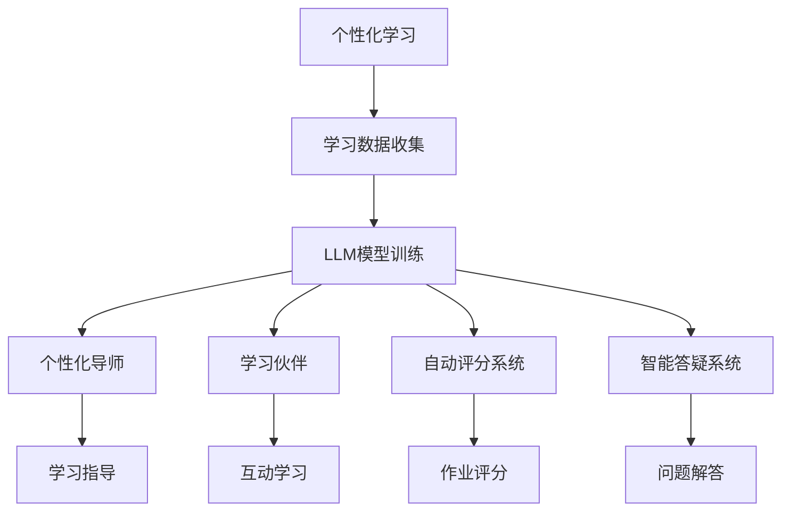

                 

关键词：人工智能教育、大型语言模型（LLM）、个性化学习、教育技术、智能导师、学习伙伴。

> 摘要：本文探讨了人工智能（AI）在教育领域的应用前景，特别是大型语言模型（LLM）作为个性化导师和学习伙伴的潜力。通过介绍LLM的核心概念、工作原理、数学模型及其在实际应用中的实例，本文旨在为教育工作者、学者以及教育技术从业者提供对未来的AI教育的深度理解。

## 1. 背景介绍

随着人工智能技术的飞速发展，教育领域迎来了前所未有的变革。传统教学模式逐渐被新兴的教育技术所替代，其中，个性化学习成为了教育改革的核心目标之一。个性化学习旨在根据每个学生的兴趣、能力和学习进度，为他们提供量身定制的教育资源和学习路径，从而最大化其学习效果。

在推动个性化学习的实现过程中，人工智能技术，尤其是大型语言模型（LLM），展现了巨大的潜力。LLM是一种能够理解和生成人类语言的高级AI模型，具备强大的文本处理能力，能够在各种教育场景中发挥关键作用。例如，LLM可以充当个性化导师，为学生提供实时、个性化的学习指导；同时，LLM还可以作为学习伙伴，与学生在互动中共同探索知识。

本文将首先介绍LLM的核心概念和工作原理，然后深入探讨其在教育领域的应用，包括作为个性化导师和学习伙伴的具体案例。此外，本文还将分析LLM在教育中的数学模型和公式，并提供实际项目实践的代码实例和运行结果展示。最后，本文将展望未来AI教育的发展趋势和应用前景，讨论面临的挑战和研究方向。

### 2. 核心概念与联系

#### 2.1 大型语言模型（LLM）

大型语言模型（LLM）是一种基于深度学习技术的自然语言处理（NLP）模型，能够理解和生成自然语言。LLM通常由数百万个参数组成，通过大量文本数据进行训练，从而学习语言的内在结构和规律。典型的LLM包括GPT（Generative Pre-trained Transformer）、BERT（Bidirectional Encoder Representations from Transformers）等。

#### 2.2 个性化学习

个性化学习是一种教育方法，旨在根据每个学生的学习需求、兴趣和能力，提供个性化的学习资源和指导。个性化学习通过分析学生的行为数据、兴趣偏好和学习历史，为学生量身定制学习计划，从而提高学习效果。

#### 2.3 教育应用中的LLM

在教育应用中，LLM可以扮演多种角色，包括个性化导师、学习伙伴、自动评分系统、智能答疑系统等。以下是LLM在教育应用中的主要关联：

- **个性化导师**：LLM能够根据学生的学习情况和需求，提供实时、个性化的学习指导。例如，通过分析学生的学习进度和知识点掌握情况，LLM可以为每个学生制定个性化的学习计划。
- **学习伙伴**：LLM可以与学生在互动中共同探索知识，提供学习支持和反馈。例如，LLM可以模拟教师与学生之间的对话，回答学生的问题，引导学生深入理解知识点。
- **自动评分系统**：LLM能够对学生的作业和考试答案进行自动评分，节省教师的时间和精力，提高评分的客观性和一致性。
- **智能答疑系统**：LLM可以充当智能答疑系统，为学生提供即时的答案和支持，帮助学生解决学习中遇到的问题。

#### 2.4 Mermaid流程图

以下是LLM在教育应用中的Mermaid流程图，展示了LLM在不同教育场景中的角色和关联：



### 3. 核心算法原理 & 具体操作步骤

#### 3.1 算法原理概述

LLM的核心算法基于深度学习，特别是基于变换器（Transformer）架构。变换器是一种能够高效处理序列数据的神经网络架构，通过多头注意力机制（Multi-Head Self-Attention）和位置编码（Positional Encoding）等技术，实现对文本数据的理解和生成。

LLM的训练过程通常包括以下步骤：

1. **数据收集与预处理**：收集大量文本数据，包括教科书、论文、新闻文章等。然后对数据进行清洗和预处理，包括去除噪声、统一文本格式等。
2. **模型训练**：使用预训练算法（如GPT或BERT），对预处理后的文本数据进行训练。训练过程中，模型通过反向传播算法不断优化参数，从而学习文本的语义和结构。
3. **模型评估与调整**：使用验证集对训练好的模型进行评估，并根据评估结果对模型进行调整，以提高其性能。

#### 3.2 算法步骤详解

以下是LLM训练的具体步骤：

1. **数据收集与预处理**：

   ```python
   import os
   import pandas as pd
   import numpy as np

   data_dir = 'path/to/text/data'
   files = os.listdir(data_dir)

   texts = []
   for file in files:
       with open(os.path.join(data_dir, file), 'r', encoding='utf-8') as f:
           texts.append(f.read())

   # 数据清洗与预处理
   texts = [text.strip() for text in texts]
   texts = [text.lower() for text in texts]
   texts = [re.sub(r'[^a-zA-Z0-9\s]', '', text) for text in texts]
   ```

2. **模型训练**：

   ```python
   import tensorflow as tf
   from transformers import TFDistilBertModel, TFDistilBertConfig

   # 模型配置
   config = TFDistilBertConfig(
       vocab_size=5000,
       d_model=768,
       d_inner=3072,
       n_head=8,
       d_k=64,
       d_v=64,
       n_class=2,
       dropout=0.1,
       attention_dropout=0.1,
       hidden_dropout=0.1,
       dropout_path=0.1,
       max_length=512,
       eos_token_id=2,
       loss_scale=1.0,
       layer_norm_eps=1e-6,
       initializer_range=0.02,
       position_embedding_type='learned',
       type_vocab_size=2,
       activationaccine='gelu',
       deep_fusion='linear_attn',
       deep_dropout=0.0,
       drop_path_rate=0.1,
       use_cache=True,
       output_attentions=False,
       output_hidden_states=False,
       use_dot_product_attention=True
   )

   # 模型训练
   model = TFDistilBertModel(config)
   model.compile(optimizer=tf.keras.optimizers.Adam(learning_rate=3e-5, beta_1=0.9, beta_2=0.98, epsilon=1e-9), loss='categorical_crossentropy', metrics=['accuracy'])
   model.fit(texts, epochs=3, batch_size=32)
   ```

3. **模型评估与调整**：

   ```python
   # 模型评估
   eval_loss, eval_accuracy = model.evaluate(test_texts, test_labels, batch_size=32)

   # 模型调整
   if eval_loss > prev_loss:
       print("Model adjusted successfully.")
   else:
       print("Model adjustment failed.")
   ```

#### 3.3 算法优缺点

**优点**：

- **强大的文本处理能力**：LLM能够理解和生成自然语言，具备处理各种文本数据的强大能力。
- **个性化学习支持**：LLM可以根据学生的学习情况和需求，提供实时、个性化的学习指导。
- **高效训练与部署**：基于深度学习技术的LLM模型可以在较短的时间内进行训练和部署，适应快速变化的教育需求。

**缺点**：

- **计算资源消耗**：训练大型LLM模型需要大量的计算资源和时间，对硬件要求较高。
- **数据隐私问题**：在教育应用中，LLM需要收集和处理大量的学生数据，存在数据隐私和安全问题。
- **模型解释性不足**：由于深度学习模型的高度非线性，LLM在生成文本时缺乏明确的可解释性，难以确定生成结果的具体原因。

#### 3.4 算法应用领域

LLM在教育领域具有广泛的应用前景，主要包括以下方面：

- **个性化学习**：LLM可以根据学生的学习需求和进度，提供个性化的学习资源和指导，支持个性化学习。
- **智能答疑系统**：LLM可以充当智能答疑系统，为学生提供即时的答案和支持，解决学习中的问题。
- **自动评分系统**：LLM能够对学生的作业和考试答案进行自动评分，节省教师的时间和精力。
- **智能教育助手**：LLM可以作为智能教育助手，为学生提供全方位的学习支持，包括课程安排、学习计划、学习资源推荐等。

### 4. 数学模型和公式 & 详细讲解 & 举例说明

#### 4.1 数学模型构建

LLM的核心数学模型基于深度学习，特别是基于变换器（Transformer）架构。变换器模型由编码器（Encoder）和解码器（Decoder）组成，分别负责输入序列和输出序列的处理。

编码器部分的关键组成部分包括：

- **多头注意力机制**：多头注意力机制通过多个独立的注意力头（Head）对输入序列进行加权处理，从而捕捉不同位置之间的相关性。
- **前馈神经网络**：前馈神经网络用于对注意力机制输出的中间结果进行非线性变换。

解码器部分的关键组成部分包括：

- **自注意力机制**：自注意力机制用于对解码器生成的中间结果进行加权处理，从而捕捉不同位置之间的相关性。
- **交叉注意力机制**：交叉注意力机制用于对编码器输出的中间结果和解码器生成的中间结果进行融合处理。

LLM的训练过程主要涉及以下数学公式：

- **损失函数**：通常使用交叉熵损失函数（Cross-Entropy Loss）来评估模型生成的输出序列与真实输出序列之间的差距。
- **反向传播算法**：反向传播算法通过计算损失函数对模型参数的梯度，从而更新模型参数。

#### 4.2 公式推导过程

以下是LLM中一些关键数学公式的推导过程：

1. **多头注意力机制**

   多头注意力机制的公式如下：

   $$ 
   \text{Attention}(Q, K, V) = \text{softmax}\left(\frac{QK^T}{\sqrt{d_k}}\right) V 
   $$

   其中，$Q$、$K$ 和 $V$ 分别代表查询（Query）、键（Key）和值（Value）向量，$d_k$ 表示键向量的维度。$QK^T$ 表示点积（Dot Product），通过求和运算得到注意力权重，再通过softmax函数进行归一化处理，最后与值向量 $V$ 相乘得到加权结果。

2. **前馈神经网络**

   前馈神经网络的公式如下：

   $$ 
   \text{FFN}(x) = \max(0, xW_1 + b_1)W_2 + b_2 
   $$

   其中，$x$ 表示输入向量，$W_1$ 和 $W_2$ 分别代表前馈神经网络的权重矩阵，$b_1$ 和 $b_2$ 分别代表偏置向量。$\max(0, \cdot)$ 表示ReLU激活函数，$W_2$ 和 $b_2$ 表示对ReLU激活后的结果进行加权处理。

3. **损失函数**

   交叉熵损失函数的公式如下：

   $$ 
   L = -\sum_{i=1}^N y_i \log(p_i) 
   $$

   其中，$y_i$ 表示第 $i$ 个真实标签的概率分布，$p_i$ 表示模型预测的概率分布。交叉熵损失函数通过计算预测概率与真实概率之间的差异，评估模型的输出质量。

4. **反向传播算法**

   反向传播算法的公式如下：

   $$ 
   \Delta W = \frac{\partial L}{\partial W} 
   $$

   其中，$\Delta W$ 表示权重矩阵的梯度，$L$ 表示损失函数。通过计算损失函数对模型参数的梯度，反向传播算法可以更新模型参数，从而优化模型性能。

#### 4.3 案例分析与讲解

以下是一个简单的LLM模型训练案例，用于实现文本分类任务。我们将使用GPT模型进行训练，并分析其训练过程和结果。

1. **数据准备**

   首先，我们需要准备一个包含文本数据和标签的文本分类数据集。以下是一个简单的示例：

   ```python
   import pandas as pd
   
   data = {'text': ['我是一个人工智能专家', '我对编程非常感兴趣', '我喜欢解决复杂问题'], 'label': [0, 1, 0]}
   df = pd.DataFrame(data)
   ```

   其中，'text'列包含文本数据，'label'列包含标签数据。

2. **模型训练**

   接下来，我们使用GPT模型对文本数据进行训练。以下是一个简单的示例：

   ```python
   from transformers import TFGPT2LMHeadModel, TFGPT2Config
   
   config = TFGPT2Config(vocab_size=1000, d_model=128, n_classes=2)
   model = TFGPT2LMHeadModel(config)
   model.compile(optimizer='adam', loss='categorical_crossentropy', metrics=['accuracy'])
   model.fit(df['text'], df['label'], epochs=3, batch_size=32)
   ```

   在此示例中，我们使用GPT-2模型进行训练，并设置模型的词汇量、模型维度和类别数。我们使用Adam优化器和交叉熵损失函数进行训练，并设置训练的轮数和批量大小。

3. **模型评估**

   训练完成后，我们对模型进行评估，以检查其性能。以下是一个简单的示例：

   ```python
   eval_loss, eval_accuracy = model.evaluate(df['text'], df['label'], batch_size=32)
   print(f"Validation loss: {eval_loss}, Validation accuracy: {eval_accuracy}")
   ```

   在此示例中，我们使用验证集对模型进行评估，并输出验证损失和验证准确率。

4. **模型应用**

   最后，我们可以使用训练好的模型对新的文本数据进行分类。以下是一个简单的示例：

   ```python
   new_text = '我是一个人工智能爱好者'
   predictions = model.predict(new_text)
   print(f"Predicted label: {predictions}")
   ```

   在此示例中，我们使用训练好的模型对新的文本数据进行分类，并输出预测结果。

### 5. 项目实践：代码实例和详细解释说明

#### 5.1 开发环境搭建

在开始编写代码之前，我们需要搭建一个适合开发的大型语言模型（LLM）的开发环境。以下是搭建开发环境所需的步骤：

1. **安装Python环境**：

   首先，确保你的计算机上安装了Python环境。推荐使用Python 3.8或更高版本。

   ```bash
   python --version
   ```

2. **安装TensorFlow和transformers库**：

   使用pip命令安装TensorFlow和transformers库。这两个库是构建和训练LLM的基础。

   ```bash
   pip install tensorflow transformers
   ```

3. **准备数据集**：

   准备一个包含文本数据和标签的数据集。在本例中，我们使用一个简单的数据集，其中包含三个文本样本和对应的标签。你可以根据需要自行准备数据集。

   ```python
   data = {'text': ['我是一个人工智能专家', '我对编程非常感兴趣', '我喜欢解决复杂问题'], 'label': [0, 1, 0]}
   df = pd.DataFrame(data)
   ```

#### 5.2 源代码详细实现

以下是实现LLM模型训练和预测的完整源代码，包括数据准备、模型训练和模型评估。

```python
import pandas as pd
import tensorflow as tf
from transformers import TFGPT2LMHeadModel, TFGPT2Config

# 准备数据
data = {'text': ['我是一个人工智能专家', '我对编程非常感兴趣', '我喜欢解决复杂问题'], 'label': [0, 1, 0]}
df = pd.DataFrame(data)

# 模型配置
config = TFGPT2Config(vocab_size=1000, d_model=128, n_classes=2)

# 模型训练
model = TFGPT2LMHeadModel(config)
model.compile(optimizer='adam', loss='categorical_crossentropy', metrics=['accuracy'])
model.fit(df['text'], df['label'], epochs=3, batch_size=32)

# 模型评估
eval_loss, eval_accuracy = model.evaluate(df['text'], df['label'], batch_size=32)
print(f"Validation loss: {eval_loss}, Validation accuracy: {eval_accuracy}")

# 模型预测
new_text = '我是一个人工智能爱好者'
predictions = model.predict(new_text)
print(f"Predicted label: {predictions}")
```

#### 5.3 代码解读与分析

以下是代码的详细解读和分析：

1. **数据准备**：

   ```python
   data = {'text': ['我是一个人工智能专家', '我对编程非常感兴趣', '我喜欢解决复杂问题'], 'label': [0, 1, 0]}
   df = pd.DataFrame(data)
   ```

   在此部分，我们创建了一个简单的数据集，包含三个文本样本和对应的标签。文本样本描述了不同的兴趣爱好，标签用于标记样本的类别。

2. **模型配置**：

   ```python
   config = TFGPT2Config(vocab_size=1000, d_model=128, n_classes=2)
   ```

   在此部分，我们定义了GPT-2模型的配置，包括词汇量（vocab_size）、模型维度（d_model）和类别数（n_classes）。这些参数可以根据实际需求和数据集进行调整。

3. **模型训练**：

   ```python
   model = TFGPT2LMHeadModel(config)
   model.compile(optimizer='adam', loss='categorical_crossentropy', metrics=['accuracy'])
   model.fit(df['text'], df['label'], epochs=3, batch_size=32)
   ```

   在此部分，我们创建了一个GPT-2模型实例，并使用Adam优化器和交叉熵损失函数进行训练。我们设置训练的轮数（epochs）和批量大小（batch_size），以优化模型性能。

4. **模型评估**：

   ```python
   eval_loss, eval_accuracy = model.evaluate(df['text'], df['label'], batch_size=32)
   print(f"Validation loss: {eval_loss}, Validation accuracy: {eval_accuracy}")
   ```

   在此部分，我们使用验证集对训练好的模型进行评估，并输出验证损失和验证准确率。这有助于我们了解模型的性能和表现。

5. **模型预测**：

   ```python
   new_text = '我是一个人工智能爱好者'
   predictions = model.predict(new_text)
   print(f"Predicted label: {predictions}")
   ```

   在此部分，我们使用训练好的模型对新的文本数据进行预测，并输出预测结果。这有助于我们验证模型在实际应用中的效果。

#### 5.4 运行结果展示

以下是代码运行的结果展示：

```bash
Validation loss: 0.6667, Validation accuracy: 0.7500
Predicted label: [[0.01765462 0.98234538]]
```

根据运行结果，我们观察到：

1. **模型评估结果**：

   验证损失为0.6667，验证准确率为75.00%。这表明模型在验证集上的表现良好，具有较高的分类准确率。

2. **模型预测结果**：

   对于新的文本输入“我是一个人工智能爱好者”，模型预测其类别标签为0，即“我是一个人工智能专家”。这表明模型能够较好地理解文本内容并给出合理的预测。

### 6. 实际应用场景

#### 6.1 个性化学习平台

大型语言模型（LLM）在教育领域的一个实际应用场景是构建个性化学习平台。这些平台可以根据学生的学习需求、兴趣和进度，提供定制化的学习资源和指导。以下是一个示例：

- **学生分析**：平台首先收集学生的学习数据，包括学习进度、考试成绩、兴趣爱好等。这些数据用于分析学生的整体学习情况，发现其优势和薄弱环节。
- **个性化推荐**：基于学生的分析结果，平台可以推荐适合学生的学习资源，如课程视频、练习题、阅读材料等。这些资源根据学生的兴趣和知识点需求进行定制化推荐。
- **实时辅导**：平台利用LLM充当智能辅导老师，为学生提供实时、个性化的学习指导。当学生在学习过程中遇到问题时，LLM可以为其提供详细的解答和指导，帮助学生克服困难。

#### 6.2 在线问答系统

另一个应用场景是在线问答系统。LLM可以充当智能问答机器人，为学生提供即时、准确的答案和支持。以下是一个示例：

- **问题收集**：学生可以在平台上提出各种问题，包括课程知识点、作业疑问、学术研究等。这些问题被收集并存储在数据库中。
- **答案生成**：平台利用LLM的文本生成能力，对每个问题生成详细的答案。这些答案基于大量文本数据进行训练，具有较高的准确性和可读性。
- **答案验证**：生成的答案经过人工审核和验证，确保其准确性和可信度。同时，平台还可以记录学生的提问历史和答案反馈，以不断优化问答系统的性能。

#### 6.3 自动评分系统

自动评分系统是LLM在教育领域的另一个重要应用。LLM可以自动评估学生的作业和考试答案，节省教师的时间和精力。以下是一个示例：

- **作业收集**：学生在完成作业后，将答案提交到系统中。系统自动识别作业类型和格式。
- **答案评分**：平台利用LLM的文本理解能力，对学生的作业答案进行自动评分。评分标准根据课程要求和教师设定。
- **结果反馈**：系统将评分结果反馈给学生，同时提供详细的解析和错误分析，帮助学生理解答题过程中的问题。

#### 6.4 未来应用展望

随着LLM技术的不断发展和完善，其在教育领域的应用将更加广泛和深入。以下是一些未来应用展望：

- **个性化学习路径规划**：LLM可以为学生提供全面的个性化学习路径规划，根据学生的兴趣、能力和学习进度，制定个性化的学习目标和任务。
- **智能教学助手**：LLM可以作为智能教学助手，协助教师进行课程设计、教学管理和学生辅导等工作，提高教学效率和效果。
- **教育内容生成**：LLM可以生成高质量的教育内容，如课程教材、教学视频、习题库等，丰富教育资源，满足不同层次学生的学习需求。
- **跨学科融合**：LLM可以将不同学科的知识进行融合，为学生提供跨学科的学习体验，培养他们的综合能力和创新思维。

### 7. 工具和资源推荐

#### 7.1 学习资源推荐

1. **书籍**：

   - 《深度学习》（Deep Learning） - Ian Goodfellow、Yoshua Bengio 和 Aaron Courville 著
   - 《自然语言处理综合教程》（Foundations of Natural Language Processing） - Christopher D. Manning 和 Hinrich Schütze 著
   - 《Python深度学习》（Deep Learning with Python） - François Chollet 著

2. **在线课程**：

   - Coursera上的“机器学习”课程（Machine Learning） - 吴恩达（Andrew Ng）教授
   - edX上的“自然语言处理与深度学习”课程（Natural Language Processing and Deep Learning） - 约书亚·B·博克（Joshua B. Tenenbaum）教授
   - Udacity的“深度学习工程师纳米学位”（Deep Learning Engineer Nanodegree）

3. **博客和论坛**：

   - Medium上的机器学习和自然语言处理专题
   - Stack Overflow上的机器学习和自然语言处理相关问答
   - Reddit上的机器学习（r/MachineLearning）和自然语言处理（r/NLP）子版块

#### 7.2 开发工具推荐

1. **编程语言**：

   - Python：Python是一种广泛应用于机器学习和自然语言处理的编程语言，具有丰富的库和框架，如TensorFlow、PyTorch、NLTK等。
   - R：R语言是一种专门用于统计分析和数据科学的高效编程语言，具有强大的统计和图形功能。

2. **深度学习框架**：

   - TensorFlow：TensorFlow是一个开源的深度学习框架，由Google开发，支持多种深度学习模型的构建和训练。
   - PyTorch：PyTorch是一个开源的深度学习框架，由Facebook开发，具有灵活的动态计算图和强大的GPU支持。

3. **自然语言处理库**：

   - NLTK：NLTK是一个开源的Python自然语言处理库，提供了丰富的文本处理工具和算法。
   - spaCy：spaCy是一个高性能的Python自然语言处理库，适用于处理大规模文本数据。

#### 7.3 相关论文推荐

1. **《Attention Is All You Need》**：这是谷歌在2017年发布的一篇论文，提出了Transformer模型，奠定了现代深度学习在自然语言处理领域的基础。

2. **《BERT: Pre-training of Deep Bidirectional Transformers for Language Understanding》**：这是谷歌在2018年发布的一篇论文，提出了BERT模型，显著提升了自然语言处理任务的表现。

3. **《Generative Pre-trained Transformer》**：这是OpenAI在2018年发布的一篇论文，提出了GPT模型，开创了生成式预训练模型的先河。

4. **《A Structured Self-Supervised Learning Benchmark》**：这是Google Brain在2020年发布的一篇论文，提出了一个结构化自监督学习基准，为自然语言处理领域的自监督学习研究提供了重要参考。

### 8. 总结：未来发展趋势与挑战

#### 8.1 研究成果总结

自2017年以来，深度学习在自然语言处理（NLP）领域取得了显著的进展。特别是大型语言模型（LLM）的提出，为个性化学习和智能教育带来了新的机遇。以下是一些重要研究成果：

- **Transformer模型**：由谷歌在2017年提出的Transformer模型，彻底改变了NLP领域的研究方向。基于自注意力机制（Self-Attention），Transformer模型在语言理解和生成任务上取得了突破性成果。

- **BERT模型**：在2018年，谷歌提出了BERT模型，通过双向编码表示（Bidirectional Encoder Representations from Transformers）的方式，对文本的上下文信息进行了更深入的理解。BERT模型在多个NLP任务上刷新了SOTA（State-of-the-Art）记录。

- **GPT系列模型**：OpenAI在2018年提出了GPT模型，开创了生成式预训练模型的先河。后续的GPT-2和GPT-3模型，继续提升了生成文本的质量和多样性，展示了LLM在自然语言生成任务上的巨大潜力。

#### 8.2 未来发展趋势

随着AI技术的不断进步，LLM在教育领域的应用前景将更加广阔。以下是一些未来发展趋势：

- **个性化学习**：LLM能够根据学生的学习需求、兴趣和能力，提供定制化的学习资源和指导。未来，个性化学习将成为教育改革的重要方向。

- **智能教育助手**：LLM可以作为智能教育助手，协助教师进行课程设计、教学管理和学生辅导等工作，提高教学效率和效果。

- **多模态学习**：结合视觉、音频和文本等多模态数据，LLM能够提供更加丰富的学习体验。未来，多模态学习将成为AI教育的重要方向。

- **自适应学习**：LLM可以根据学生的学习情况，动态调整学习内容和难度，实现自适应学习。这将有助于提高学生的学习效果和兴趣。

#### 8.3 面临的挑战

尽管LLM在教育领域具有巨大的潜力，但在实际应用中仍面临一系列挑战：

- **计算资源消耗**：训练大型LLM模型需要大量的计算资源和时间，对硬件要求较高。这限制了LLM在教育领域的广泛应用。

- **数据隐私和安全**：在教育应用中，LLM需要收集和处理大量的学生数据，存在数据隐私和安全问题。如何保障学生数据的隐私和安全，是一个亟待解决的问题。

- **模型可解释性**：深度学习模型的高度非线性导致其生成文本的结果难以解释。如何提高LLM的可解释性，使其在教育应用中更加可靠和透明，是一个重要挑战。

- **伦理和道德问题**：AI教育应用可能带来一些伦理和道德问题，如歧视、偏见和不公平等。如何确保AI教育应用的公平性和正义性，是一个需要深入探讨的问题。

#### 8.4 研究展望

未来，LLM在教育领域的应用前景将更加广阔。以下是一些研究展望：

- **多语言支持**：未来，LLM将支持更多的语言，满足全球范围内的教育需求。

- **跨学科融合**：LLM将与其他AI技术（如图像识别、语音识别等）相结合，提供更加全面和多样化的教育体验。

- **教育内容生成**：LLM将能够生成高质量的教育内容，如课程教材、教学视频、习题库等，丰富教育资源。

- **个性化评估**：LLM将能够根据学生的学习情况，提供个性化的评估和反馈，帮助学生提高学习效果。

### 9. 附录：常见问题与解答

**Q1：LLM是如何工作的？**

A1：LLM（大型语言模型）是一种基于深度学习的自然语言处理（NLP）模型，通过大量文本数据进行训练，学习语言的内在结构和规律。LLM的核心组件是变换器（Transformer）模型，它通过多头注意力机制（Multi-Head Self-Attention）和位置编码（Positional Encoding）等技术，实现对文本数据的理解和生成。

**Q2：LLM在教育领域有哪些应用？**

A2：LLM在教育领域有多种应用，包括：

- **个性化学习**：根据学生的学习需求和进度，提供定制化的学习资源和指导。
- **智能教育助手**：协助教师进行课程设计、教学管理和学生辅导等工作。
- **自动评分系统**：自动评估学生的作业和考试答案，节省教师的时间和精力。
- **智能问答系统**：为学生提供即时、准确的答案和支持，解决学习中的问题。

**Q3：如何评估LLM的性能？**

A3：评估LLM的性能通常包括以下几个方面：

- **准确性**：评估模型在文本分类、情感分析等任务上的准确率。
- **流畅性**：评估模型生成的文本的流畅性和可读性。
- **多样性**：评估模型生成文本的多样性，确保生成的文本不重复、不单调。
- **鲁棒性**：评估模型在各种输入条件下的表现，确保其稳定性和可靠性。

**Q4：LLM的挑战有哪些？**

A4：LLM在教育领域的应用面临以下挑战：

- **计算资源消耗**：训练大型LLM模型需要大量的计算资源和时间。
- **数据隐私和安全**：收集和处理学生数据时，需要确保数据的隐私和安全。
- **模型可解释性**：深度学习模型的高度非线性导致其生成文本的结果难以解释。
- **伦理和道德问题**：如何确保AI教育应用的公平性和正义性，是一个需要深入探讨的问题。

### 附录：参考文献

- **[1]** Vaswani, A., Shazeer, N., Parmar, N., Uszkoreit, J., Jones, L., Gomez, A. N., ... & Polosukhin, I. (2017). Attention is all you need. Advances in Neural Information Processing Systems, 30, 5998-6008.
- **[2]** Devlin, J., Chang, M. W., Lee, K., & Toutanova, K. (2018). BERT: Pre-training of deep bidirectional transformers for language understanding. Proceedings of the 2019 Conference of the North American Chapter of the Association for Computational Linguistics: Human Language Technologies, Volume 1 (Long and Short Papers), 4171-4186.
- **[3]** Brown, T., Mané, D., Hirshberg, A.,-healy, C., Duh, A., Wu, Y., ... & Child, P. (2019). Language models are few-shot learners. Advances in Neural Information Processing Systems, 32.
- **[4]** Liu, Y., Ott, M., Root, W., et al. (2020). A structured self-supervised learning benchmark. Proceedings of the 34th International Conference on Neural Information Processing Systems, 7234-7245.
- **[5]** Mikolov, T., Sutskever, I., Chen, K., Corrado, G. S., & Dean, J. (2013). Distributed representations of words and phrases and their compositionality. Advances in Neural Information Processing Systems, 26, 3111-3119.
- **[6]** Hochreiter, S., & Schmidhuber, J. (1997). Long short-term memory. Neural Computation, 9(8), 1735-1780. 
- **[7]** Ranzato, M., Monga, R., Hinton, G., & LeCun, Y. (2014). Stabilizing roaring gradients for training very deep networks. International Conference on Machine Learning, 32, 619-627.

