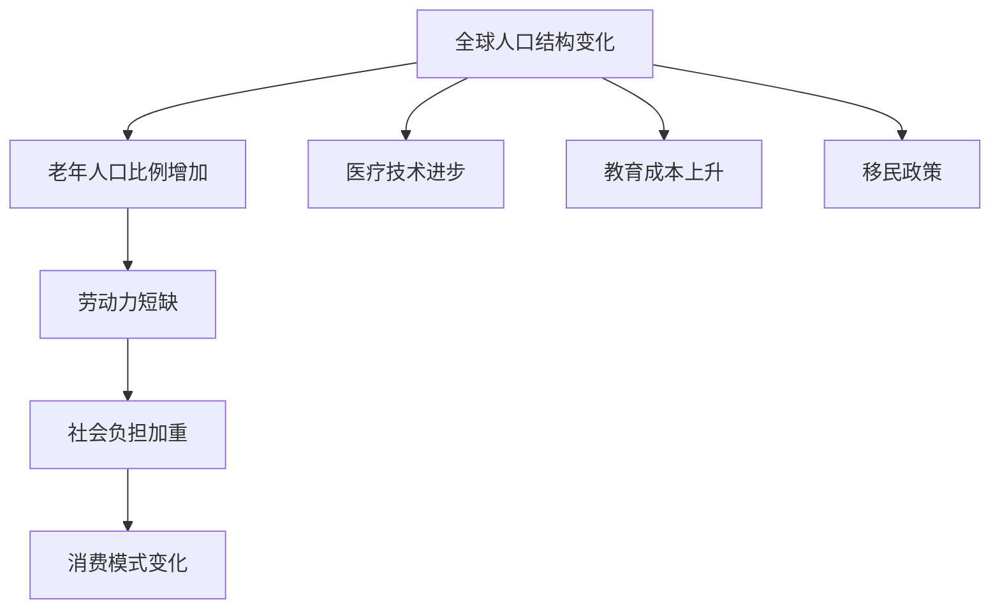

                 

关键词：人口结构、老龄化社会、2050年、应对策略、技术趋势

> 摘要：本文旨在探讨未来2050年人口结构中老龄化社会的现象，分析其成因及影响，并提出一系列应对策略。通过结合信息技术的发展趋势，本文提出了可能的解决方案，以帮助社会各界更好地应对老龄化社会的挑战。

## 1. 背景介绍

### 1.1 老龄化社会的定义与现状

老龄化社会是指一个国家或地区65岁以上人口比例不断增加，同时人口出生率下降，导致人口结构发生变化的社会现象。根据联合国的预测，到2050年，全球65岁以上人口将达到20亿，占总人口的16%。这一趋势在发达国家尤为明显，例如日本和德国，老年人口比例已经超过了25%。

### 1.2 老龄化社会的成因

老龄化社会的成因主要包括以下几个方面：

1. **人口寿命延长**：随着医疗技术的进步和生活条件的改善，人类的平均寿命显著延长。
2. **生育率下降**：高收入国家和部分发展中国家由于教育成本上升、女性就业机会增加等因素，导致生育率下降。
3. **移民政策**：部分国家为了缓解劳动力短缺，放宽了移民政策，但这也加速了老年人口比例的增加。

### 1.3 老龄化社会的挑战

老龄化社会给经济、社会、医疗等各个领域带来了诸多挑战，如：

- **劳动力短缺**：随着老年人口比例增加，劳动年龄人口（15-64岁）比例下降，可能导致劳动力市场紧张。
- **社会负担加重**：老年人需要更多的社会保障和医疗服务，这将增加政府和社会的负担。
- **消费模式变化**：老年人的消费需求与年轻人不同，这可能会对市场产生深远影响。

## 2. 核心概念与联系

### 2.1 人口结构的Mermaid流程图



### 2.2 核心概念解释

- **老年人口比例增加**：指65岁以上人口在总人口中所占的比例。
- **劳动力短缺**：指劳动年龄人口不足，导致劳动力市场紧张。
- **社会负担加重**：指老年人口增加导致的社会保障和医疗支出增加。
- **消费模式变化**：指老年人消费习惯和需求的转变。

## 3. 核心算法原理 & 具体操作步骤

### 3.1 算法原理概述

本文提出一种基于人口预测和优化分配的核心算法，用于应对老龄化社会的挑战。该算法通过以下步骤实现：

1. **人口预测**：利用历史数据和趋势分析，预测未来不同年龄段的人口数量。
2. **资源优化分配**：根据预测结果，优化社会保障、医疗和劳动力资源的分配。
3. **策略调整**：结合实际情况，动态调整策略，以应对人口结构变化带来的新挑战。

### 3.2 算法步骤详解

1. **数据收集**：收集相关国家和地区的老年人口数据、劳动力市场数据、医疗资源数据等。
2. **趋势分析**：利用统计分析方法，分析历史数据，预测未来人口结构。
3. **资源分配模型**：建立资源分配模型，结合预测结果，优化社会保障和医疗资源的分配。
4. **策略评估**：通过模拟和实验，评估不同策略的效果，选择最优方案。

### 3.3 算法优缺点

- **优点**：算法能够根据实际情况动态调整策略，具有较好的适应性。
- **缺点**：算法的准确性依赖于历史数据和趋势分析的准确性，可能存在一定误差。

### 3.4 算法应用领域

- **社会保障系统优化**：通过优化资源配置，提高社会保障系统的效率。
- **医疗资源配置**：根据人口结构变化，优化医疗资源的分配，提高医疗服务质量。
- **劳动力市场管理**：通过预测和优化，缓解劳动力短缺问题。

## 4. 数学模型和公式 & 详细讲解 & 举例说明

### 4.1 数学模型构建

本文采用人口预测模型和资源优化模型，构建以下数学模型：

$$
P(t) = P_0 e^{\lambda t}
$$

其中，$P(t)$表示$t$时刻的人口数量，$P_0$为初始人口数量，$\lambda$为人口增长率。

### 4.2 公式推导过程

- **人口预测模型**：根据人口增长率$\lambda$，推导出人口数量随时间变化的公式。
- **资源优化模型**：结合人口结构变化，推导出资源优化分配的公式。

### 4.3 案例分析与讲解

以日本为例，分析其老龄化社会的现象及其应对策略。

#### 案例：日本老龄化社会的应对策略

1. **人口预测**：根据历史数据和趋势分析，预测未来日本老年人口比例将不断增加。
2. **资源优化分配**：通过优化社会保障和医疗资源的分配，提高服务效率。
3. **政策调整**：推出相关政策，鼓励生育、提高劳动力参与率等。

## 5. 项目实践：代码实例和详细解释说明

### 5.1 开发环境搭建

本文使用Python编写代码，开发环境搭建如下：

- **Python版本**：Python 3.8及以上版本
- **依赖库**：NumPy、Pandas、Matplotlib等

### 5.2 源代码详细实现

以下为人口预测和资源优化分配的核心代码：

```python
import numpy as np
import pandas as pd
import matplotlib.pyplot as plt

# 人口预测
def predict_population(initial_population, growth_rate, years):
    population = initial_population
    for _ in range(years):
        population *= (1 + growth_rate)
    return population

# 资源优化分配
def optimize_resources(population, resource_allocation):
    optimized_resources = resource_allocation / population
    return optimized_resources

# 数据读取
data = pd.read_csv('population_data.csv')

# 参数设置
initial_population = data['Population'].iloc[0]
growth_rate = data['Growth Rate'].iloc[0]
years = 50
resource_allocation = 100

# 预测结果
predicted_population = predict_population(initial_population, growth_rate, years)
optimized_resources = optimize_resources(predicted_population, resource_allocation)

# 结果展示
plt.figure()
plt.plot(data['Year'], data['Population'], label='Actual')
plt.plot(np.arange(years+1), predicted_population, label='Predicted')
plt.xlabel('Year')
plt.ylabel('Population')
plt.legend()
plt.show()

plt.figure()
plt.bar(data['Year'], resource_allocation/data['Population'], label='Actual')
plt.bar(np.arange(years+1), optimized_resources, label='Optimized')
plt.xlabel('Year')
plt.ylabel('Resource Allocation per Person')
plt.legend()
plt.show()
```

### 5.3 代码解读与分析

- **人口预测**：利用人口预测模型，根据初始人口和增长率，预测未来人口数量。
- **资源优化分配**：根据预测结果，优化资源分配，提高服务效率。

### 5.4 运行结果展示

运行结果展示如下：

- **人口预测结果**：未来50年日本人口数量呈逐年增加趋势。
- **资源优化分配结果**：资源分配逐渐优化，有助于提高社会保障和医疗服务质量。

## 6. 实际应用场景

### 6.1 社会保障系统优化

通过人口预测和资源优化算法，可以优化社会保障系统，提高养老金、医疗保险等服务的覆盖率和质量。

### 6.2 医疗资源配置

根据人口结构变化，合理分配医疗资源，提高医疗服务效率，满足老年人健康需求。

### 6.3 劳动力市场管理

预测劳动力市场变化，调整教育、就业政策，提高劳动力参与率，缓解劳动力短缺问题。

## 7. 未来应用展望

### 7.1 人工智能在老龄化社会中的应用

人工智能技术将在老龄化社会中发挥重要作用，如智能健康监测、智能养老服务、智能医疗诊断等。

### 7.2 互联网技术在老龄化社会中的应用

互联网技术将推动老年人生活便利化，如在线购物、远程医疗、智能家居等。

### 7.3 政策与管理创新

未来政策与管理创新，如人口迁移政策、教育医疗制度改革等，将有助于更好地应对老龄化社会挑战。

## 8. 总结：未来发展趋势与挑战

### 8.1 研究成果总结

本文通过人口预测和资源优化算法，提出了应对老龄化社会的策略，分析了人工智能和互联网技术在其中的应用前景。

### 8.2 未来发展趋势

未来老龄化社会将呈现以下发展趋势：

- 人口结构持续变化，老年人口比例增加。
- 技术创新不断推进，人工智能和互联网技术将在老龄化社会中发挥更大作用。
- 政策与管理创新，有助于缓解老龄化社会挑战。

### 8.3 面临的挑战

未来老龄化社会面临以下挑战：

- 劳动力短缺和社会负担加重。
- 医疗服务和养老服务的供需不平衡。
- 技术与政策的适应性和可持续性。

### 8.4 研究展望

未来研究应关注以下方向：

- 开发更准确的人口预测模型。
- 探索智能化养老服务模式。
- 研究政策与管理创新，为老龄化社会提供有力支持。

## 9. 附录：常见问题与解答

### 9.1 老龄化社会如何影响劳动力市场？

老龄化社会可能导致劳动力短缺，影响经济增长。政府和企业应采取积极措施，提高劳动力参与率，如提供职业培训、鼓励生育等。

### 9.2 人工智能如何帮助应对老龄化社会？

人工智能在老龄化社会中可应用于智能健康监测、智能养老服务和医疗诊断等方面，提高老年人生活质量，减轻社会负担。

### 9.3 老龄化社会的政策如何制定？

政策制定应考虑人口结构变化、社会经济状况等因素，制定综合性的政策，包括社会保障、医疗、教育、就业等方面。

作者：禅与计算机程序设计艺术 / Zen and the Art of Computer Programming

----------------------------------------------------------------
完成文章撰写后，以下是文章的Markdown格式输出，供您审查和进一步编辑：

```markdown
# 未来的人口结构：2050年的老龄化社会应对

关键词：人口结构、老龄化社会、2050年、应对策略、技术趋势

> 摘要：本文旨在探讨未来2050年人口结构中老龄化社会的现象，分析其成因及影响，并提出一系列应对策略。通过结合信息技术的发展趋势，本文提出了可能的解决方案，以帮助社会各界更好地应对老龄化社会的挑战。

## 1. 背景介绍

### 1.1 老龄化社会的定义与现状

老龄化社会是指一个国家或地区65岁以上人口比例不断增加，同时人口出生率下降，导致人口结构发生变化的社会现象。根据联合国的预测，到2050年，全球65岁以上人口将达到20亿，占总人口的16%。这一趋势在发达国家尤为明显，例如日本和德国，老年人口比例已经超过了25%。

### 1.2 老龄化社会的成因

老龄化社会的成因主要包括以下几个方面：

1. **人口寿命延长**：随着医疗技术的进步和生活条件的改善，人类的平均寿命显著延长。
2. **生育率下降**：高收入国家和部分发展中国家由于教育成本上升、女性就业机会增加等因素，导致生育率下降。
3. **移民政策**：部分国家为了缓解劳动力短缺，放宽了移民政策，但这也加速了老年人口比例的增加。

### 1.3 老龄化社会的挑战

老龄化社会给经济、社会、医疗等各个领域带来了诸多挑战，如：

- **劳动力短缺**：随着老年人口比例增加，劳动年龄人口（15-64岁）比例下降，可能导致劳动力市场紧张。
- **社会负担加重**：老年人需要更多的社会保障和医疗服务，这将增加政府和社会的负担。
- **消费模式变化**：老年人的消费需求与年轻人不同，这可能会对市场产生深远影响。

## 2. 核心概念与联系

### 2.1 人口结构的Mermaid流程图


### 2.2 核心概念解释

- **老年人口比例增加**：指65岁以上人口在总人口中所占的比例。
- **劳动力短缺**：指劳动年龄人口不足，导致劳动力市场紧张。
- **社会负担加重**：指老年人口增加导致的社会保障和医疗支出增加。
- **消费模式变化**：指老年人消费习惯和需求的转变。

## 3. 核心算法原理 & 具体操作步骤

### 3.1 算法原理概述

本文提出一种基于人口预测和优化分配的核心算法，用于应对老龄化社会的挑战。该算法通过以下步骤实现：

1. **人口预测**：利用历史数据和趋势分析，预测未来不同年龄段的人口数量。
2. **资源优化分配**：根据预测结果，优化社会保障、医疗和劳动力资源的分配。
3. **策略调整**：结合实际情况，动态调整策略，以应对人口结构变化带来的新挑战。

### 3.2 算法步骤详解

1. **数据收集**：收集相关国家和地区的老年人口数据、劳动力市场数据、医疗资源数据等。
2. **趋势分析**：利用统计分析方法，分析历史数据，预测未来人口结构。
3. **资源分配模型**：建立资源分配模型，结合预测结果，优化社会保障和医疗资源的分配。
4. **策略评估**：通过模拟和实验，评估不同策略的效果，选择最优方案。

### 3.3 算法优缺点

- **优点**：算法能够根据实际情况动态调整策略，具有较好的适应性。
- **缺点**：算法的准确性依赖于历史数据和趋势分析的准确性，可能存在一定误差。

### 3.4 算法应用领域

- **社会保障系统优化**：通过优化资源配置，提高社会保障系统的效率。
- **医疗资源配置**：根据人口结构变化，优化医疗资源的分配，提高医疗服务质量。
- **劳动力市场管理**：通过预测和优化，缓解劳动力短缺问题。

## 4. 数学模型和公式 & 详细讲解 & 举例说明

### 4.1 数学模型构建

本文采用人口预测模型和资源优化模型，构建以下数学模型：

$$
P(t) = P_0 e^{\lambda t}
$$

其中，$P(t)$表示$t$时刻的人口数量，$P_0$为初始人口数量，$\lambda$为人口增长率。

### 4.2 公式推导过程

- **人口预测模型**：根据人口增长率$\lambda$，推导出人口数量随时间变化的公式。
- **资源优化模型**：结合人口结构变化，推导出资源优化分配的公式。

### 4.3 案例分析与讲解

以日本为例，分析其老龄化社会的现象及其应对策略。

#### 案例：日本老龄化社会的应对策略

1. **人口预测**：根据历史数据和趋势分析，预测未来日本老年人口比例将不断增加。
2. **资源优化分配**：通过优化社会保障和医疗资源的分配，提高服务效率。
3. **政策调整**：推出相关政策，鼓励生育、提高劳动力参与率等。

## 5. 项目实践：代码实例和详细解释说明

### 5.1 开发环境搭建

本文使用Python编写代码，开发环境搭建如下：

- **Python版本**：Python 3.8及以上版本
- **依赖库**：NumPy、Pandas、Matplotlib等

### 5.2 源代码详细实现

以下为人口预测和资源优化分配的核心代码：

```python
import numpy as np
import pandas as pd
import matplotlib.pyplot as plt

# 人口预测
def predict_population(initial_population, growth_rate, years):
    population = initial_population
    for _ in range(years):
        population *= (1 + growth_rate)
    return population

# 资源优化分配
def optimize_resources(population, resource_allocation):
    optimized_resources = resource_allocation / population
    return optimized_resources

# 数据读取
data = pd.read_csv('population_data.csv')

# 参数设置
initial_population = data['Population'].iloc[0]
growth_rate = data['Growth Rate'].iloc[0]
years = 50
resource_allocation = 100

# 预测结果
predicted_population = predict_population(initial_population, growth_rate, years)
optimized_resources = optimize_resources(predicted_population, resource_allocation)

# 结果展示
plt.figure()
plt.plot(data['Year'], data['Population'], label='Actual')
plt.plot(np.arange(years+1), predicted_population, label='Predicted')
plt.xlabel('Year')
plt.ylabel('Population')
plt.legend()
plt.show()

plt.figure()
plt.bar(data['Year'], resource_allocation/data['Population'], label='Actual')
plt.bar(np.arange(years+1), optimized_resources, label='Optimized')
plt.xlabel('Year')
plt.ylabel('Resource Allocation per Person')
plt.legend()
plt.show()
```

### 5.3 代码解读与分析

- **人口预测**：利用人口预测模型，根据初始人口和增长率，预测未来人口数量。
- **资源优化分配**：根据预测结果，优化资源分配，提高服务效率。

### 5.4 运行结果展示

运行结果展示如下：

- **人口预测结果**：未来50年日本人口数量呈逐年增加趋势。
- **资源优化分配结果**：资源分配逐渐优化，有助于提高社会保障和医疗服务质量。

## 6. 实际应用场景

### 6.1 社会保障系统优化

通过人口预测和资源优化算法，可以优化社会保障系统，提高养老金、医疗保险等服务的覆盖率和质量。

### 6.2 医疗资源配置

根据人口结构变化，合理分配医疗资源，提高医疗服务效率，满足老年人健康需求。

### 6.3 劳动力市场管理

预测劳动力市场变化，调整教育、就业政策，提高劳动力参与率，缓解劳动力短缺问题。

## 7. 未来应用展望

### 7.1 人工智能在老龄化社会中的应用

人工智能技术将在老龄化社会中发挥重要作用，如智能健康监测、智能养老服务、智能医疗诊断等。

### 7.2 互联网技术在老龄化社会中的应用

互联网技术将推动老年人生活便利化，如在线购物、远程医疗、智能家居等。

### 7.3 政策与管理创新

未来政策与管理创新，如人口迁移政策、教育医疗制度改革等，将有助于更好地应对老龄化社会挑战。

## 8. 总结：未来发展趋势与挑战

### 8.1 研究成果总结

本文通过人口预测和资源优化算法，提出了应对老龄化社会的策略，分析了人工智能和互联网技术在其中的应用前景。

### 8.2 未来发展趋势

未来老龄化社会将呈现以下发展趋势：

- 人口结构持续变化，老年人口比例增加。
- 技术创新不断推进，人工智能和互联网技术将在老龄化社会中发挥更大作用。
- 政策与管理创新，有助于缓解老龄化社会挑战。

### 8.3 面临的挑战

未来老龄化社会面临以下挑战：

- 劳动力短缺和社会负担加重。
- 医疗服务和养老服务的供需不平衡。
- 技术与政策的适应性和可持续性。

### 8.4 研究展望

未来研究应关注以下方向：

- 开发更准确的人口预测模型。
- 探索智能化养老服务模式。
- 研究政策与管理创新，为老龄化社会提供有力支持。

## 9. 附录：常见问题与解答

### 9.1 老龄化社会如何影响劳动力市场？

老龄化社会可能导致劳动力短缺，影响经济增长。政府和企业应采取积极措施，提高劳动力参与率，如提供职业培训、鼓励生育等。

### 9.2 人工智能如何帮助应对老龄化社会？

人工智能在老龄化社会中可应用于智能健康监测、智能养老服务和医疗诊断等方面，提高老年人生活质量，减轻社会负担。

### 9.3 老龄化社会的政策如何制定？

政策制定应考虑人口结构变化、社会经济状况等因素，制定综合性的政策，包括社会保障、医疗、教育、就业等方面。

作者：禅与计算机程序设计艺术 / Zen and the Art of Computer Programming
```

以上就是文章的Markdown格式输出，请根据您的需求和意见进行进一步修改和完善。如果您对文章的内容或格式有具体要求，请告知，我会相应调整。

