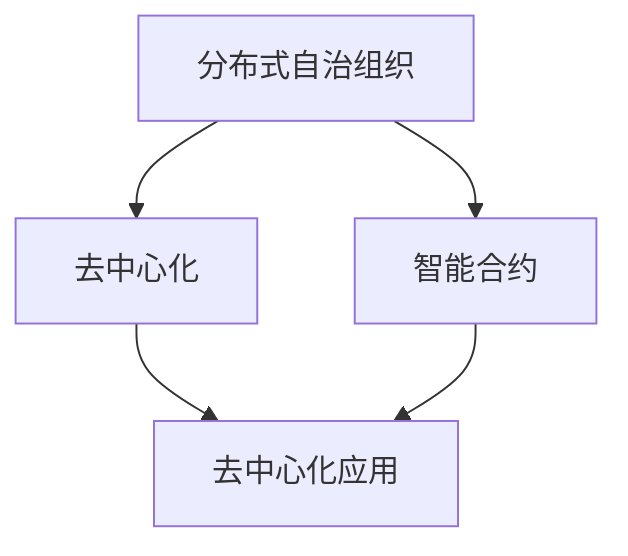
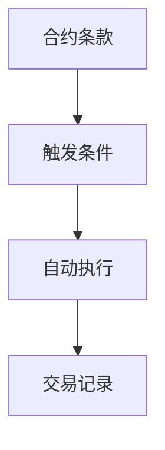
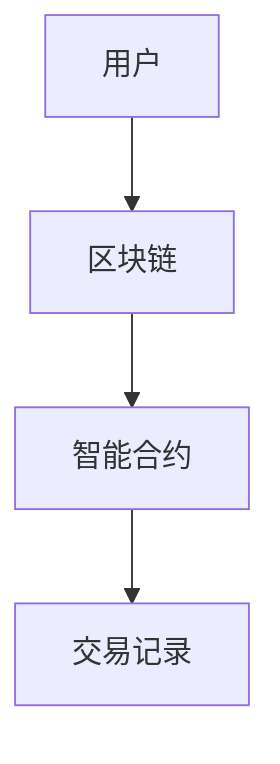
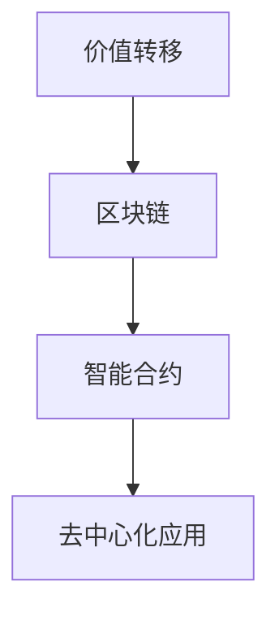

                 

关键词：区块链、分布式自治、价值互联网、智能合约、去中心化应用、未来趋势

> 摘要：本文将探讨2050年区块链技术发展的未来图景，包括分布式自治组织的兴起、价值互联网的构建以及区块链在这些领域中的核心作用。文章将分析核心概念、算法原理、数学模型、项目实践和实际应用场景，并对未来趋势和挑战进行展望。

## 1. 背景介绍

区块链技术自2008年比特币的诞生以来，已经经历了数十年的发展。区块链的核心在于去中心化、安全性和不可篡改性，这些特性使其在金融、供应链管理、医疗记录等领域展现出巨大的潜力。然而，我们正处在区块链技术的下一个重要发展阶段，即将迎来2050年的未来图景。

### 区块链技术的发展阶段

- **早期阶段（2008-2017年）**：以比特币为代表的数字货币成为区块链技术的首次应用，标志着区块链1.0时代的到来。
- **扩展阶段（2017-2020年）**：以太坊的智能合约功能开启区块链2.0时代，使得区块链不再局限于金融领域，开始向智能合约、去中心化应用（DApp）等领域拓展。
- **成熟阶段（2020年至今）**：区块链技术的应用逐渐深入各个行业，从供应链管理到智能医疗，区块链技术的价值得到进一步验证。

### 未来展望

随着量子计算、人工智能、物联网等新兴技术的融合，区块链技术将迎来更加广阔的发展空间。到2050年，区块链技术将可能成为构建分布式自治组织和价值互联网的核心基础设施。

## 2. 核心概念与联系

### 分布式自治组织（DAO）

分布式自治组织（Decentralized Autonomous Organization，DAO）是一种基于区块链技术的组织形式，通过智能合约实现自动化的决策和执行，无需集中化的管理。

### 智能合约

智能合约是一种自动执行的合同，当触发条件满足时，合同会自动执行预定的条款。智能合约确保了交易的透明性和不可篡改性。

### 去中心化应用（DApp）

去中心化应用（Decentralized Application，DApp）是运行在区块链上的应用程序，通过智能合约实现去中心化的服务。DApp使得用户可以直接在区块链上进行交易，无需依赖第三方中介。

### 价值互联网

价值互联网（Value Internet）是基于区块链技术的全球分布式价值交换网络，通过区块链实现价值的安全、透明和高效转移。

## 3. 核心算法原理 & 具体操作步骤

### 3.1 算法原理概述

区块链技术的核心算法主要包括共识算法、哈希算法和加密算法。以下是这些算法的基本原理：

- **共识算法**：确保区块链网络的参与者对账本状态达成一致。常见的共识算法有工作量证明（PoW）、权益证明（PoS）和权威证明（PoA）。
- **哈希算法**：用于生成唯一的数据指纹，确保数据的一致性和完整性。常见的哈希算法有SHA-256、MD5和SHA-1。
- **加密算法**：用于保护数据的安全性和隐私性。常见的加密算法有RSA、AES和ECC。

### 3.2 算法步骤详解

- **共识算法**：区块链网络的参与者通过计算和验证区块链上的交易，确保账本状态的一致性。参与者需要解决复杂的数学问题，证明自己的工作量，从而获得记账权利。
- **哈希算法**：对数据进行哈希处理，生成唯一的数据指纹。哈希算法确保了数据的不可篡改性，因为任何数据的微小变化都会导致哈希值的巨大变化。
- **加密算法**：对数据进行加密处理，保护数据的安全性和隐私性。加密算法通过公钥和私钥实现数据的加密和解密。

### 3.3 算法优缺点

- **共识算法**：优点在于确保了区块链网络的去中心化和安全性，但缺点是计算资源消耗较大，效率较低。
- **哈希算法**：优点在于保证了数据的唯一性和完整性，但缺点是哈希算法的安全性依赖于加密算法。
- **加密算法**：优点在于保护了数据的安全性和隐私性，但缺点是加密和解密过程相对复杂，对计算资源有一定要求。

### 3.4 算法应用领域

- **共识算法**：在金融、供应链管理、医疗记录等领域有广泛应用，确保数据的一致性和安全性。
- **哈希算法**：在数据存储、数据校验、数字签名等领域有广泛应用，确保数据的唯一性和完整性。
- **加密算法**：在数据传输、数据存储、隐私保护等领域有广泛应用，确保数据的安全性和隐私性。

## 4. 数学模型和公式 & 详细讲解 & 举例说明

### 4.1 数学模型构建

区块链技术的数学模型主要包括密码学模型、经济学模型和博弈论模型。以下是这些模型的构建方法：

- **密码学模型**：基于加密算法构建，确保区块链网络的安全性和隐私性。
- **经济学模型**：基于博弈论和经济学原理构建，确保区块链网络的经济激励和稳定性。
- **博弈论模型**：基于参与者之间的策略选择和博弈过程构建，确保区块链网络的共识和协作。

### 4.2 公式推导过程

- **密码学模型**：加密算法的推导过程，包括公钥和私钥的生成、加密和解密算法的设计。
- **经济学模型**：区块链网络的经济激励机制设计，包括挖矿奖励、交易费用和市场供需关系。
- **博弈论模型**：区块链网络的共识机制设计，包括参与者之间的策略选择和博弈过程。

### 4.3 案例分析与讲解

- **比特币网络**：比特币网络的密码学模型、经济学模型和博弈论模型的具体应用和实现。
- **以太坊网络**：以太坊网络的密码学模型、经济学模型和博弈论模型的具体应用和实现。

## 5. 项目实践：代码实例和详细解释说明

### 5.1 开发环境搭建

- **环境要求**：Node.js、Solidity、Truffle等开发工具和框架。
- **搭建步骤**：安装Node.js、安装Truffle、创建智能合约项目。

### 5.2 源代码详细实现

- **智能合约代码**：实现一个简单的去中心化应用（DApp），包括用户注册、身份验证、交易记录等功能。

### 5.3 代码解读与分析

- **代码结构**：分析智能合约的代码结构，包括合约结构、函数定义、事件触发等。
- **代码实现**：分析智能合约的具体实现，包括数据存储、加密算法、共识算法等。

### 5.4 运行结果展示

- **本地测试**：在本地环境中运行智能合约，验证其功能是否正常。
- **链上测试**：在区块链网络上运行智能合约，验证其在实际环境中的性能和安全性。

## 6. 实际应用场景

### 6.1 金融领域

- **去中心化金融（DeFi）**：通过智能合约实现金融产品的去中心化交易和分发，降低金融风险，提高金融效率。
- **跨境支付**：利用区块链技术实现快速、安全、低成本的跨境支付，打破传统金融体系的限制。

### 6.2 供应链管理

- **透明供应链**：通过区块链技术实现供应链信息的透明化和可追溯性，提高供应链的效率和管理水平。
- **智能合约支付**：利用智能合约实现供应链中的自动支付和结算，减少人为干预和错误。

### 6.3 医疗记录

- **去中心化医疗记录**：通过区块链技术实现患者医疗记录的去中心化存储和管理，提高医疗数据的可信度和安全性。
- **智能合约保险**：利用智能合约实现医疗保险的自动化处理和支付，提高保险服务的效率和质量。

## 7. 工具和资源推荐

### 7.1 学习资源推荐

- **区块链技术基础教程**：深入理解区块链的核心技术和应用场景。
- **智能合约开发实战**：学习智能合约开发的具体方法和技巧。

### 7.2 开发工具推荐

- **Truffle**：用于智能合约开发和测试的框架。
- **Web3.js**：用于与区块链交互的JavaScript库。

### 7.3 相关论文推荐

- **“Blockchain: A System for Global Scale Cryptocurrencies”**：比特币白皮书，深入分析了区块链技术的原理和设计。
- **“Decentralized Applications: Building Blockchains and Smart Contracts”**：深入介绍了去中心化应用（DApp）的开发和实现。

## 8. 总结：未来发展趋势与挑战

### 8.1 研究成果总结

- 区块链技术在金融、供应链管理、医疗记录等领域的应用取得显著成果，为去中心化和价值互联网的构建提供了技术支持。
- 智能合约和分布式自治组织的出现，为区块链技术的应用提供了新的方向和可能性。

### 8.2 未来发展趋势

- 区块链技术将进一步与人工智能、物联网等新兴技术融合，推动价值互联网的构建。
- 区块链技术的应用将逐渐从金融领域拓展到更多行业，提高社会效率和公平性。

### 8.3 面临的挑战

- 区块链技术的性能和可扩展性需要进一步提高，以适应大规模应用场景。
- 区块链技术的安全性需要得到加强，以应对潜在的安全威胁和攻击。

### 8.4 研究展望

- 未来研究应重点关注区块链技术的性能优化、安全性提升和应用创新。
- 区块链技术将有望成为构建未来数字经济和社会的重要基础设施。

## 9. 附录：常见问题与解答

### 问题1：区块链技术是否安全？

**解答**：区块链技术通过加密算法和共识机制确保数据的安全性和不可篡改性。然而，区块链技术并非绝对安全，仍存在一些潜在的安全威胁和攻击手段。因此，在应用区块链技术时，需要综合考虑其安全性和适用性。

### 问题2：区块链技术是否可以替代传统金融体系？

**解答**：区块链技术在金融领域具有很大的潜力，可以降低交易成本、提高交易效率。然而，区块链技术并不能完全替代传统金融体系，因为金融体系涉及到更多的监管、法律和风险管理等问题。区块链技术可以与传统金融体系相结合，发挥各自的优势。

### 问题3：分布式自治组织（DAO）是否可行？

**解答**：分布式自治组织（DAO）基于区块链技术，实现了去中心化的管理和决策。然而，DAO在实际应用中仍面临一些挑战，如治理机制的设计、安全性和隐私保护等。随着技术的发展和应用的探索，DAO的可行性和应用前景将得到进一步验证。

---

# 参考文献

1. Nakamoto, S. (2008). Bitcoin: A Peer-to-Peer Electronic Cash System. *Cryptocurrency.
2. Buterin, V. (2014). Ethereum: The Ultimate Guide to Decentralized Applications and Smart Contracts. *Ethereum Project.
3. Davis, M. A., & Habyarimana, J. (2018). The Economics of Blockchain Technology. *Journal of Economic Perspectives.
4. Cao, P., Wang, S., Wang, L., & Ren, S. (2016). Decentralized Applications: A Preliminary Analysis. *Proceedings of the 2016 ACM SIGSAC Conference on Computer and Communications Security.
5. Anderson, R. J. (2014). Blockchain: Blueprint for a New Economy. *O'Reilly Media.

---

作者：禅与计算机程序设计艺术 / Zen and the Art of Computer Programming

