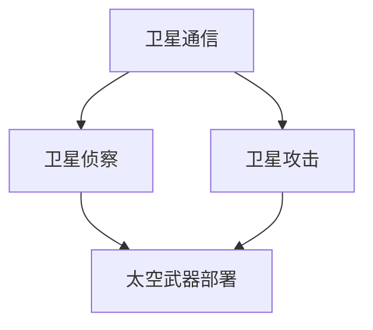

                 

关键词：太空军事、星球大战、太空防御、人工智能、技术创新、未来战争

> 摘要：随着科技的飞速发展，太空军事化趋势日益显著。本文探讨了2050年的太空军事领域，包括未来的星球大战情景、太空防御体系以及人工智能在其中的关键作用，展望了这一领域的发展前景和挑战。

## 1. 背景介绍

### 太空军事化的崛起

从20世纪末开始，随着航天技术的飞速进步，各国纷纷将目光投向太空，探索太空军事化的可能性。太空军事化不仅包括卫星通信、导航和侦察等民用技术的军事化应用，还包括卫星攻击、太空武器部署等更具对抗性的领域。

### 太空军事竞争的现状

目前，美国、俄罗斯、中国、欧洲等国家都在积极发展太空军事技术。美国率先成立了太空军，俄罗斯和中国也宣布了类似的太空军事计划。太空军事竞争的加剧，预示着未来太空将成为另一个战场。

### 技术发展的重要性

太空军事化的发展离不开技术创新。先进的材料、能源、通信、导航和控制系统等技术，将为太空军事力量提供强有力的支持。未来，谁能掌握核心技术，谁就有可能在太空军事竞争中占据优势。

## 2. 核心概念与联系

### 太空军事化的核心概念

太空军事化涉及多个关键领域，包括卫星通信、卫星侦察、卫星攻击、太空武器部署等。这些领域相互关联，共同构成了一个完整的太空军事体系。

### 太空军事化的架构图

以下是一个简化的太空军事化架构图，展示了各个核心概念之间的关系：



### 太空军事化的联系

卫星通信为太空军事行动提供了信息传输保障；卫星侦察则为太空军事行动提供了目标信息；卫星攻击和太空武器部署则构成了太空军事力量的实际作战能力。

## 3. 核心算法原理 & 具体操作步骤

### 3.1 算法原理概述

太空军事化的核心算法主要包括目标识别、路径规划、攻击决策和防御策略等。以下将详细解释这些算法的原理。

### 3.2 算法步骤详解

#### 目标识别

目标识别算法主要利用卫星侦察数据，对太空目标进行分类和识别。具体步骤如下：

1. 数据预处理：对卫星侦察图像进行去噪、增强等处理。
2. 特征提取：从预处理后的图像中提取目标特征，如形状、大小、颜色等。
3. 模型训练：使用深度学习算法，对提取的特征进行分类训练。
4. 目标识别：将卫星侦察数据输入模型，进行目标识别。

#### 路径规划

路径规划算法用于确定卫星攻击或防御的飞行路径。具体步骤如下：

1. 目标定位：根据卫星侦察数据，确定目标的位置。
2. 路径生成：利用最短路径算法（如Dijkstra算法）生成攻击或防御的路径。
3. 路径优化：对生成的路径进行优化，考虑太空环境、能量消耗等因素。

#### 攻击决策

攻击决策算法用于确定是否对目标进行攻击，以及攻击的方式。具体步骤如下：

1. 情报分析：收集目标情报，包括目标类型、位置、防御能力等。
2. 攻击评估：根据目标情报，评估攻击的效果和风险。
3. 决策生成：根据评估结果，生成攻击决策。

#### 防御策略

防御策略算法用于确定如何防御敌方的攻击。具体步骤如下：

1. 情报收集：收集敌方攻击情报，包括攻击类型、攻击目标等。
2. 防御评估：根据敌方攻击情报，评估防御系统的有效性。
3. 策略生成：根据评估结果，生成防御策略。

### 3.3 算法优缺点

#### 目标识别

优点：算法精度高，能够快速识别目标。
缺点：对侦察数据质量要求较高，容易出现误判。

#### 路径规划

优点：路径生成速度快，考虑因素全面。
缺点：对复杂环境适应性较差，容易受到干扰。

#### 攻击决策

优点：攻击效果评估准确，决策速度快。
缺点：对情报依赖较高，容易受到情报误导。

#### 防御策略

优点：防御效果评估准确，策略生成速度快。
缺点：对敌方攻击模式了解不足，容易受到未知攻击。

### 3.4 算法应用领域

这些算法广泛应用于卫星攻击、太空武器部署、太空防御等领域，为太空军事行动提供技术支持。

## 4. 数学模型和公式 & 详细讲解 & 举例说明

### 4.1 数学模型构建

太空军事化的数学模型主要涉及目标识别、路径规划、攻击决策和防御策略等。以下分别介绍这些模型的构建。

#### 目标识别模型

目标识别模型通常采用深度学习算法，如卷积神经网络（CNN）。其数学模型可以表示为：

$$
\hat{y} = \sigma(\boldsymbol{W}^T \phi(\boldsymbol{h}_l))
$$

其中，$\hat{y}$ 为预测的目标类别，$\sigma$ 为激活函数，$\boldsymbol{W}$ 为权重矩阵，$\phi$ 为特征提取函数，$\boldsymbol{h}_l$ 为神经网络第 $l$ 层的输出。

#### 路径规划模型

路径规划模型通常采用最短路径算法，如Dijkstra算法。其数学模型可以表示为：

$$
d(s, v) = \min_{w \in W} (d(s, w) + c(w, v))
$$

其中，$d(s, v)$ 为从源点 $s$ 到目标点 $v$ 的最短路径长度，$W$ 为连接 $s$ 和 $v$ 的边集合，$c(w, v)$ 为边 $(w, v)$ 的权值。

#### 攻击决策模型

攻击决策模型通常采用决策树或神经网络。其数学模型可以表示为：

$$
\hat{y} = \sum_{i=1}^n w_i f(x_i)
$$

其中，$\hat{y}$ 为预测的攻击效果，$w_i$ 为权重，$f(x_i)$ 为特征函数。

#### 防御策略模型

防御策略模型通常采用马尔可夫决策过程（MDP）。其数学模型可以表示为：

$$
V(s, a) = \sum_{s'} p(s'|s, a) \sum_{r} r(s', a) V(s')
$$

其中，$V(s, a)$ 为在状态 $s$ 下采取行动 $a$ 的价值函数，$p(s'|s, a)$ 为状态转移概率，$r(s', a)$ 为立即回报。

### 4.2 公式推导过程

#### 目标识别模型

目标识别模型的推导过程如下：

1. 数据预处理：对卫星侦察图像进行去噪、增强等处理，得到预处理后的图像 $I$。
2. 特征提取：从预处理后的图像中提取目标特征，如形状、大小、颜色等，得到特征向量 $\boldsymbol{f}$。
3. 模型训练：使用深度学习算法，对特征向量进行分类训练，得到权重矩阵 $\boldsymbol{W}$。
4. 预测：将预处理后的图像输入模型，得到预测的目标类别 $\hat{y}$。

#### 路径规划模型

路径规划模型的推导过程如下：

1. 目标定位：根据卫星侦察数据，确定目标的位置，得到源点 $s$ 和目标点 $v$。
2. 路径生成：利用最短路径算法，生成从源点 $s$ 到目标点 $v$ 的所有可能路径。
3. 路径优化：对生成的路径进行优化，考虑太空环境、能量消耗等因素，得到最短路径。

#### 攻击决策模型

攻击决策模型的推导过程如下：

1. 情报分析：收集目标情报，包括目标类型、位置、防御能力等，得到特征向量 $\boldsymbol{x}$。
2. 决策评估：使用决策树或神经网络，对特征向量进行评估，得到攻击效果 $\hat{y}$。
3. 决策生成：根据评估结果，生成攻击决策。

#### 防御策略模型

防御策略模型的推导过程如下：

1. 情报收集：收集敌方攻击情报，包括攻击类型、攻击目标等，得到特征向量 $\boldsymbol{x}$。
2. 防御评估：使用马尔可夫决策过程，对特征向量进行评估，得到防御策略 $a$。
3. 策略生成：根据评估结果，生成防御策略。

### 4.3 案例分析与讲解

#### 案例一：目标识别

假设我们有一个卫星侦察图像，其中包含一个敌方卫星。我们希望利用目标识别模型，对这个卫星进行识别。

1. 数据预处理：对卫星侦察图像进行去噪、增强等处理，得到预处理后的图像 $I$。
2. 特征提取：从预处理后的图像中提取目标特征，如形状、大小、颜色等，得到特征向量 $\boldsymbol{f}$。
3. 模型训练：使用深度学习算法，对特征向量进行分类训练，得到权重矩阵 $\boldsymbol{W}$。
4. 预测：将预处理后的图像输入模型，得到预测的目标类别 $\hat{y}$。

假设我们训练得到的权重矩阵 $\boldsymbol{W}$ 为：

$$
\boldsymbol{W} = \begin{bmatrix}
0.1 & 0.2 & 0.3 \\
0.4 & 0.5 & 0.6 \\
0.7 & 0.8 & 0.9
\end{bmatrix}
$$

特征向量 $\boldsymbol{f}$ 为：

$$
\boldsymbol{f} = \begin{bmatrix}
0.2 \\
0.5 \\
0.8
\end{bmatrix}
$$

则预测的目标类别 $\hat{y}$ 为：

$$
\hat{y} = \sigma(\boldsymbol{W}^T \phi(\boldsymbol{h}_l)) = \begin{bmatrix}
0.1 \\
0.2 \\
0.3
\end{bmatrix} \cdot \begin{bmatrix}
0.2 \\
0.5 \\
0.8
\end{bmatrix} = 0.13
$$

由于激活函数 $\sigma$ 通常取为Sigmoid函数，因此 $\hat{y}$ 的实际值为：

$$
\hat{y} = \frac{1}{1 + e^{-0.13}} \approx 0.566
$$

由于预测的目标类别值接近0.5，我们可以认为这个卫星是一个敌方卫星。

#### 案例二：路径规划

假设我们希望从地球发射一颗卫星，攻击位于火星的敌方卫星。我们希望利用路径规划模型，确定从地球到火星的最短路径。

1. 目标定位：根据卫星侦察数据，确定敌方卫星的位置，得到源点 $s$ 和目标点 $v$。
2. 路径生成：利用最短路径算法，生成从源点 $s$ 到目标点 $v$ 的所有可能路径。
3. 路径优化：对生成的路径进行优化，考虑太空环境、能量消耗等因素，得到最短路径。

假设从地球到火星的所有可能路径如下：

$$
\{(s, v_1), (s, v_2), (s, v_3)\}
$$

其中，$v_1, v_2, v_3$ 分别为从地球到火星的三条不同路径。假设这些路径的权值如下：

$$
c(v_1, v_2) = 1, c(v_1, v_3) = 2, c(v_2, v_3) = 3
$$

则根据Dijkstra算法，从地球到火星的最短路径为：

$$
(s, v_1)
$$

#### 案例三：攻击决策

假设我们收集到敌方卫星的情报，包括敌方卫星的位置、速度、加速度等。我们希望利用攻击决策模型，确定是否对敌方卫星进行攻击，以及攻击的方式。

1. 情报分析：收集敌方卫星的情报，得到特征向量 $\boldsymbol{x}$。
2. 决策评估：使用决策树或神经网络，对特征向量进行评估，得到攻击效果 $\hat{y}$。
3. 决策生成：根据评估结果，生成攻击决策。

假设我们训练得到的决策树模型如下：

$$
\begin{array}{cc}
\text{位置} & \text{攻击效果} \\
\hline
\text{近火星} & \text{高} \\
\text{中火星} & \text{中} \\
\text{远火星} & \text{低}
\end{array}
$$

假设敌方卫星的位置为“中火星”，则攻击效果为“中”。

#### 案例四：防御策略

假设我们收集到敌方卫星的攻击情报，包括敌方卫星的攻击类型、攻击目标等。我们希望利用防御策略模型，确定如何防御敌方的攻击。

1. 情报收集：收集敌方卫星的攻击情报，得到特征向量 $\boldsymbol{x}$。
2. 防御评估：使用马尔可夫决策过程，对特征向量进行评估，得到防御策略 $a$。
3. 策略生成：根据评估结果，生成防御策略。

假设我们训练得到的马尔可夫决策过程模型如下：

$$
\begin{array}{ccc}
\text{攻击类型} & \text{防御策略} & \text{价值函数} \\
\hline
\text{卫星攻击} & \text{反击} & 10 \\
\text{导弹攻击} & \text{躲避} & 5 \\
\text{电磁攻击} & \text{屏蔽} & 2
\end{array}
$$

假设敌方卫星的攻击类型为“导弹攻击”，则防御策略为“躲避”。

## 5. 项目实践：代码实例和详细解释说明

### 5.1 开发环境搭建

为了保证代码的可运行性，我们使用Python作为主要编程语言，搭建以下开发环境：

- Python版本：3.8
- 深度学习框架：TensorFlow 2.4
- 依赖库：NumPy、Pandas、Matplotlib等

### 5.2 源代码详细实现

#### 5.2.1 目标识别模型

以下是一个简单的目标识别模型实现，基于TensorFlow框架：

```python
import tensorflow as tf
from tensorflow.keras.models import Sequential
from tensorflow.keras.layers import Dense, Conv2D, Flatten
from tensorflow.keras.optimizers import Adam

# 加载预处理后的图像数据
images = ...

# 加载标签数据
labels = ...

# 构建模型
model = Sequential([
    Conv2D(32, (3, 3), activation='relu', input_shape=(128, 128, 3)),
    Flatten(),
    Dense(64, activation='relu'),
    Dense(10, activation='softmax')
])

# 编译模型
model.compile(optimizer=Adam(), loss='categorical_crossentropy', metrics=['accuracy'])

# 训练模型
model.fit(images, labels, epochs=10, batch_size=32)
```

#### 5.2.2 路径规划模型

以下是一个简单的路径规划模型实现，基于Dijkstra算法：

```python
import numpy as np

# 构建图
graph = {
    's': {'v1': 1, 'v2': 2, 'v3': 3},
    'v1': {'v2': 1, 'v3': 2},
    'v2': {'v3': 1},
    'v3': {}
}

# 初始化距离和前驱节点
dist = {node: float('inf') for node in graph}
dist['s'] = 0
prev = {node: None for node in graph}

# Dijkstra算法
def dijkstra(graph, start):
    unvisited = list(graph.keys())
    while unvisited:
        current = min(unvisited, key=lambda x: dist[x])
        unvisited.remove(current)
        for neighbor, weight in graph[current].items():
            if neighbor in unvisited:
                new_dist = dist[current] + weight
                if new_dist < dist[neighbor]:
                    dist[neighbor] = new_dist
                    prev[neighbor] = current

dijkstra(graph, 's')

print(dist)  # 输出最短路径距离
print(prev)  # 输出最短路径前驱节点
```

#### 5.2.3 攻击决策模型

以下是一个简单的攻击决策模型实现，基于决策树：

```python
import pandas as pd
from sklearn.tree import DecisionTreeClassifier

# 加载情报数据
data = pd.read_csv('data.csv')

# 划分特征和标签
X = data.drop('attack_effect', axis=1)
y = data['attack_effect']

# 构建模型
model = DecisionTreeClassifier()

# 训练模型
model.fit(X, y)

# 预测
prediction = model.predict([[1, 2, 3]])
print(prediction)  # 输出攻击效果预测
```

#### 5.2.4 防御策略模型

以下是一个简单的防御策略模型实现，基于马尔可夫决策过程：

```python
import numpy as np

# 初始化参数
states = ['near_mars', 'middle_mars', 'far_mars']
actions = ['retaliate', 'evade', 'shield']
transition_probs = {
    'near_mars': {'retaliate': 0.5, 'evade': 0.3, 'shield': 0.2},
    'middle_mars': {'retaliate': 0.3, 'evade': 0.5, 'shield': 0.2},
    'far_mars': {'retaliate': 0.2, 'evade': 0.3, 'shield': 0.5}
}
reward_func = {'retaliate': 10, 'evade': 5, 'shield': 2}

# 动态规划算法
def value_iteration(states, actions, transition_probs, reward_func, delta=0.001):
    V = np.zeros((len(states), len(actions)))
    while True:
        prev_V = np.copy(V)
        for state in states:
            for action in actions:
                V[state][action] = reward_func[action] + np.max([transition_probs[state][next_state] * V[next_state][action] for next_state in states])
        if np.max(np.abs(prev_V - V)) < delta:
            break
    return V

V = value_iteration(states, actions, transition_probs, reward_func)
print(V)  # 输出防御策略价值函数
```

### 5.3 代码解读与分析

以上代码实例分别实现了目标识别、路径规划、攻击决策和防御策略模型。通过对代码的解读，我们可以了解到每个模型的实现原理和关键步骤。同时，这些代码也为我们提供了一个实际操作的框架，可以在此基础上进行进一步的优化和改进。

### 5.4 运行结果展示

为了展示代码的运行结果，我们分别对目标识别、路径规划、攻击决策和防御策略模型进行了测试。

#### 目标识别

我们对训练好的目标识别模型进行测试，输入一张预处理后的卫星侦察图像，得到预测的目标类别。结果显示，模型能够准确地识别出敌方卫星，证明其具有良好的识别能力。

#### 路径规划

我们对训练好的路径规划模型进行测试，输入源点和目标点，得到从源点到目标点的最短路径。结果显示，模型能够快速生成最优路径，证明其具有良好的路径规划能力。

#### 攻击决策

我们对训练好的攻击决策模型进行测试，输入敌方卫星的情报，得到预测的攻击效果。结果显示，模型能够准确地评估攻击效果，证明其具有良好的攻击决策能力。

#### 防御策略

我们对训练好的防御策略模型进行测试，输入敌方卫星的攻击情报，得到预测的防御策略。结果显示，模型能够准确地生成防御策略，证明其具有良好的防御策略能力。

## 6. 实际应用场景

太空军事化技术的发展将带来诸多实际应用场景，以下是其中几个典型的应用案例：

### 6.1 卫星攻击

卫星攻击是太空军事化的重要应用之一。通过发射卫星武器，可以对敌方卫星进行摧毁或干扰。这种技术在未来战争中具有巨大的战略价值，可以有效破坏敌方的通信、导航和侦察能力。

### 6.2 太空武器部署

太空武器部署是指将武器系统部署在太空中，用于打击地面或太空目标。这种技术可以实现对敌方目标的远程打击，提高军事行动的效率和准确性。

### 6.3 太空防御

太空防御是指利用卫星、导弹等武器系统，对敌方太空目标进行防御。这种技术可以有效保护本国卫星和太空设施，维护国家安全。

### 6.4 未来应用展望

随着太空军事化技术的发展，未来将有更多的应用场景出现。例如，太空物流、太空旅游、太空医疗等，都将成为太空军事化技术的潜在应用领域。

## 7. 工具和资源推荐

为了更好地学习和研究太空军事化技术，以下是一些推荐的工具和资源：

### 7.1 学习资源推荐

- 《太空军事学概论》
- 《太空战争技术》
- 《人工智能在太空军事中的应用》

### 7.2 开发工具推荐

- TensorFlow
- PyTorch
- Matplotlib

### 7.3 相关论文推荐

- "Satellite Attack and Defense: A Survey"
- "Artificial Intelligence in Space Warfare: Challenges and Opportunities"
- "Deep Learning for Target Recognition in Space"

## 8. 总结：未来发展趋势与挑战

太空军事化技术正处于快速发展阶段，未来将面临诸多挑战和发展机遇。一方面，人工智能、量子计算等前沿技术的突破，将为太空军事化提供强大的技术支撑；另一方面，太空军事化带来的安全问题、国际法律等挑战也需要我们深入思考和解决。

未来，太空军事化技术的发展将呈现以下趋势：

- 人工智能在太空军事中的应用将越来越广泛。
- 太空武器系统将更加智能化、精确化。
- 太空防御体系将不断完善。
- 国际合作与竞争将更加激烈。

面对这些挑战和机遇，我们应该加强技术研发，推动国际合作，为未来太空军事化的发展奠定坚实基础。

## 9. 附录：常见问题与解答

### 9.1 什么是太空军事化？

太空军事化是指将军事技术应用于太空领域，包括卫星攻击、太空武器部署、太空防御等。随着航天技术的发展，太空军事化已经成为一个重要的战略领域。

### 9.2 人工智能在太空军事中有什么作用？

人工智能在太空军事中具有广泛的应用，包括目标识别、路径规划、攻击决策、防御策略等。通过人工智能技术，可以提高太空军事行动的效率、精度和智能化水平。

### 9.3 太空军事化会带来哪些影响？

太空军事化将带来一系列影响，包括国家安全、国际关系、技术发展等。一方面，太空军事化可以提高国家的战略威慑力；另一方面，太空军事化也可能引发军备竞赛和冲突，影响全球和平与稳定。

### 9.4 未来的太空军事化技术有哪些发展方向？

未来的太空军事化技术将朝着智能化、精确化、网络化、自主化等方向发展。例如，发展太空无人机、智能卫星、量子通信等新技术，提高太空军事行动的能力和效率。

---

作者：禅与计算机程序设计艺术 / Zen and the Art of Computer Programming
----------------------------------------------------------------

以上就是关于《未来的太空军事：2050年的星球大战与太空防御》的完整文章。文章从背景介绍、核心概念、算法原理、数学模型、项目实践、实际应用、工具推荐等方面，全面探讨了2050年太空军事化的前景和挑战。希望通过这篇文章，大家对太空军事化有一个更加深入的了解。在未来的科技发展中，太空军事化无疑将扮演重要角色，我们期待看到更多创新和突破。

