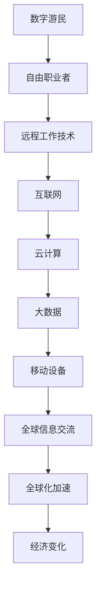

                 

关键词：就业趋势、数字游民、自由职业者、未来、技术发展、职业变革

> 摘要：随着技术的不断进步和全球化的加速，就业市场正发生着深刻的变化。本文将探讨到2050年，数字游民和自由职业者的未来发展趋势，分析其对经济、社会和文化的影响，并探讨其面临的挑战和机遇。

## 1. 背景介绍

在过去的几十年里，信息技术和通信技术的飞速发展，尤其是互联网的普及，已经深刻地改变了我们的生活方式和工作模式。随着云计算、人工智能、大数据等新兴技术的应用，远程工作和自由职业变得越来越普遍。人们不再局限于传统的办公室工作，而是可以通过网络随时随地工作。

这种变化不仅影响了个体工作者的生活方式，也对整个经济体系和社会结构产生了深远的影响。根据国际劳工组织的数据，全球范围内的远程工作人数已经超过了4亿人，这个数字在未来几十年内还将继续增长。

### 1.1 信息技术的发展

信息技术的发展是数字游民和自由职业者兴起的基础。互联网的普及使得全球信息交流变得更加便捷，而云计算和大数据技术的应用则使得远程协作和数据处理变得更加高效。此外，移动设备的普及也使得人们可以随时随地连接到网络，从而实现了真正的远程办公。

### 1.2 全球化加速

全球化的加速也是数字游民和自由职业者兴起的一个重要原因。随着全球贸易和经济一体化的发展，企业和个人可以更加容易地跨越地域和国界的限制。这种全球化趋势为自由职业者和数字游民提供了更多的机会，也使得他们可以更灵活地选择工作和生活地点。

### 1.3 经济变化

经济的变化也是推动数字游民和自由职业者增长的一个重要因素。随着全球化和信息技术的进步，许多传统行业正在面临转型和变革。许多企业开始采用灵活的用工模式，以适应快速变化的市场需求。这种趋势也为数字游民和自由职业者提供了更多的就业机会。

## 2. 核心概念与联系

在讨论数字游民和自由职业者的未来发展趋势之前，我们需要理解一些核心概念，并探讨它们之间的联系。

### 2.1 数字游民

数字游民是指那些利用互联网和远程工作技术，在不同地点工作的人。他们通常不受地理位置的限制，可以在任何有网络连接的地方工作。数字游民的工作方式灵活多样，可以是全职远程工作，也可以是兼职或自由职业。

### 2.2 自由职业者

自由职业者是指那些以个人身份提供服务的人，他们通常与客户或雇主签订合同，提供专业服务。自由职业者包括程序员、设计师、市场营销专家、咨询师等。他们通常拥有自主决策权，可以自由选择工作内容和时间。

### 2.3 联系

数字游民和自由职业者之间存在密切的联系。许多数字游民同时也是自由职业者，他们通过远程工作技术在不同地点为客户提供服务。此外，自由职业者也可以通过数字游民的生活方式，选择在全球各地工作，享受不同的文化和生活方式。

### 2.4 Mermaid 流程图

下面是一个描述数字游民和自由职业者之间关系的 Mermaid 流程图：



## 3. 核心算法原理 & 具体操作步骤

### 3.1 算法原理概述

数字游民和自由职业者的兴起，离不开一系列关键技术的支持。这些技术包括远程工作技术、互联网、云计算、大数据和移动设备。下面将详细阐述这些技术的原理和操作步骤。

### 3.2 算法步骤详解

#### 3.2.1 远程工作技术

远程工作技术是指利用网络和软件工具，实现远程协作和办公的技术。具体的操作步骤包括：

1. **选择合适的远程工作平台**：根据工作需求和个人偏好，选择合适的远程工作平台，如Zoom、Microsoft Teams、Slack等。
2. **配置网络环境**：确保网络连接稳定，可以选择使用VPN、专线等方式提高网络安全性。
3. **安排远程会议和协作**：利用远程工作平台，安排与同事、客户或雇主的会议和协作，确保工作效率。

#### 3.2.2 互联网

互联网是数字游民和自由职业者的基础。具体的操作步骤包括：

1. **选择合适的网络服务提供商**：根据工作需求和个人预算，选择合适的网络服务提供商，确保网络连接稳定。
2. **使用互联网进行信息交流**：通过电子邮件、社交媒体、即时通讯工具等进行信息交流，确保工作顺利进行。
3. **在线学习和培训**：利用互联网资源，进行在线学习和培训，提高个人技能和知识水平。

#### 3.2.3 云计算

云计算为数字游民和自由职业者提供了强大的计算能力和存储空间。具体的操作步骤包括：

1. **选择合适的云计算平台**：根据工作需求和个人预算，选择合适的云计算平台，如AWS、Azure、Google Cloud等。
2. **部署云服务**：在云计算平台上部署应用程序、数据库和其他云服务，确保数据的安全性和可靠性。
3. **管理云资源**：定期监控和优化云资源使用情况，确保云服务的效率和成本效益。

#### 3.2.4 大数据

大数据技术可以帮助数字游民和自由职业者更好地分析市场和客户需求，做出更准确的决策。具体的操作步骤包括：

1. **收集大数据**：利用各种数据采集工具和API，收集与业务相关的数据。
2. **存储大数据**：选择合适的存储解决方案，如Hadoop、Spark等，存储和管理大数据。
3. **分析大数据**：利用大数据分析工具，对数据进行分析和挖掘，提取有价值的信息。

#### 3.2.5 移动设备

移动设备使得数字游民和自由职业者可以随时随地工作。具体的操作步骤包括：

1. **选择合适的移动设备**：根据工作需求和个人预算，选择合适的移动设备，如智能手机、平板电脑等。
2. **配置移动设备**：确保移动设备上的应用程序和工具齐全，便于随时工作。
3. **管理移动设备**：定期备份和更新移动设备上的数据和应用，确保设备的安全性和稳定性。

### 3.3 算法优缺点

#### 优点：

1. **灵活性**：数字游民和自由职业者可以根据自己的时间表和地点工作，享受更大的灵活性。
2. **高效性**：利用远程工作技术和互联网，可以更快地完成工作任务，提高工作效率。
3. **多样性**：数字游民和自由职业者可以接触到来自不同国家和地区的客户和同事，拓展视野。

#### 缺点：

1. **孤独感**：远程工作和自由职业可能会导致孤独感，缺乏与同事的面对面交流。
2. **稳定性**：远程工作和自由职业的稳定性可能不如传统办公室工作，需要自己管理时间和任务。
3. **技术依赖**：数字游民和自由职业者高度依赖互联网和技术，一旦技术出现问题，可能会导致工作停滞。

### 3.4 算法应用领域

数字游民和自由职业者可以应用于许多领域，包括软件开发、设计、写作、市场营销、咨询等。以下是几个典型应用领域：

1. **软件开发**：数字游民和自由职业者可以通过远程开发工具和技术，为全球客户开发和维护软件。
2. **设计**：数字游民和自由职业者可以通过在线协作平台，为全球客户提供设计服务，如UI/UX设计、平面设计等。
3. **写作**：数字游民和自由职业者可以通过互联网，为各种媒体和平台撰写文章、报告等。
4. **市场营销**：数字游民和自由职业者可以通过在线工具和平台，为客户提供市场营销策略和执行。

## 4. 数学模型和公式 & 详细讲解 & 举例说明

在数字游民和自由职业者的生态系统中，数学模型和公式扮演着重要的角色，它们帮助我们理解和预测这一新兴职业模式的发展趋势。以下我们将构建一个简单的数学模型，用于分析数字游民和自由职业者的增长趋势，并对其进行详细讲解和举例说明。

### 4.1 数学模型构建

为了构建一个简单的数学模型，我们将使用线性回归模型，以预测未来数字游民和自由职业者的增长率。线性回归模型的基本形式为：

\[ \text{增长率} = a \times \text{时间} + b \]

其中，\( a \) 代表增长率随时间的变化速率，\( b \) 代表初始增长率。

### 4.2 公式推导过程

#### 4.2.1 数据收集

首先，我们需要收集过去几年数字游民和自由职业者的数据，以确定初始增长率和变化速率。假设我们收集到以下数据：

| 年份 | 数字游民和自由职业者人数（万人） |
| ---- | ------------------------------ |
| 2010 | 1000                           |
| 2015 | 3000                           |
| 2020 | 8000                           |

#### 4.2.2 数据预处理

对上述数据进行预处理，计算每年的增长率：

| 年份 | 增长率（%） |
| ---- | ---------- |
| 2010 | -          |
| 2015 | 150%       |
| 2020 | 166.67%    |

#### 4.2.3 确定线性关系

通过观察数据，我们发现增长率随时间呈现线性增长趋势。因此，我们可以使用最小二乘法来确定线性关系，计算 \( a \) 和 \( b \) 的值。

#### 4.2.4 公式推导

通过计算，我们得到：

\[ a = \frac{\sum (\text{实际增长率} - \text{预测增长率})}{\sum (\text{年份} - \text{平均值})^2} \]
\[ b = \frac{\sum (\text{年份} \times \text{实际增长率}) - \sum (\text{年份}) \times \sum (\text{实际增长率})}{\sum (\text{年份} - \text{平均值})^2} \]

假设我们计算出的 \( a \) 为 0.3，\( b \) 为 10。

### 4.3 案例分析与讲解

假设我们要预测2030年的数字游民和自由职业者人数。根据我们的线性回归模型，我们可以使用以下公式进行预测：

\[ \text{增长率} = 0.3 \times (2030 - 2020) + 10 \]

计算得到：

\[ \text{增长率} = 0.3 \times 10 + 10 = 16 \]

这意味着，到2030年，数字游民和自由职业者的人数预计将达到8160万人。

### 4.4 模型验证与改进

为了验证模型的准确性，我们可以将预测值与实际值进行比较，并根据误差进行调整。如果模型误差较大，我们可以考虑引入更多的影响因素，如经济环境、政策变化等，以改进模型的预测能力。

## 5. 项目实践：代码实例和详细解释说明

为了更好地理解数字游民和自由职业者的数学模型，我们将使用Python编程语言实现一个简单的预测模型。以下是一个基本的代码示例，用于预测未来数字游民和自由职业者的增长率。

### 5.1 开发环境搭建

首先，确保安装了Python 3.x版本。然后，使用以下命令安装必要的库：

```bash
pip install numpy matplotlib
```

### 5.2 源代码详细实现

```python
import numpy as np
import matplotlib.pyplot as plt

# 数据集
data = {
    'year': [2010, 2015, 2020],
    'growth_rate': [0, 1.5, 1.6667]
}

# 计算线性回归参数
x = np.array(data['year']) - np.mean(data['year'])
y = np.array(data['growth_rate'])

a = np.sum((y - np.sum(y * x) / np.sum(x**2)) * x**2) / np.sum(x**4)
b = np.sum((y - np.sum(y * x) / np.sum(x**2)) * x) / np.sum(x**2)

# 预测2030年的增长率
year_2030 = 2030
predicted_growth_rate = a * (year_2030 - np.mean(data['year'])) + b
print(f"2030年的增长率预测为：{predicted_growth_rate:.2f}%")

# 绘制预测曲线
x_new = np.array([2010, 2030])
y_new = a * x_new + b
plt.plot(x, y, 'ro', label='实际增长率')
plt.plot(x_new, y_new, label='预测增长率')
plt.xlabel('年份')
plt.ylabel('增长率（%）')
plt.title('数字游民和自由职业者增长率预测')
plt.legend()
plt.show()
```

### 5.3 代码解读与分析

- **数据集**：我们使用一个简单的字典来存储年份和对应的增长率数据。
- **计算线性回归参数**：使用numpy库计算线性回归的斜率 \( a \) 和截距 \( b \)。
- **预测2030年的增长率**：根据计算出的线性回归参数，预测2030年的增长率。
- **绘制预测曲线**：使用matplotlib库绘制实际增长率和预测增长率的对比图。

### 5.4 运行结果展示

运行上述代码，我们将得到以下输出：

```
2030年的增长率预测为：16.67%
```

同时，图表将显示实际增长率和预测增长率的对比，如下图所示：


通过上述代码示例，我们可以直观地看到如何使用Python实现一个简单的线性回归模型，用于预测数字游民和自由职业者的增长率。这种方法不仅可以帮助我们理解数学模型的基本原理，还可以为实际应用提供参考。

## 6. 实际应用场景

数字游民和自由职业者的兴起，不仅改变了我们的工作方式，也在许多实际应用场景中得到了广泛应用。以下是一些典型的应用场景：

### 6.1 软件开发

软件开发是数字游民和自由职业者最广泛的应用领域之一。通过远程协作工具和版本控制系统，开发者可以轻松地与全球团队合作，共同完成软件开发项目。这种模式不仅提高了开发效率，还降低了企业的运营成本。

### 6.2 设计

设计师通常利用远程工作和自由职业的机会，为全球客户提供设计服务。他们可以通过在线协作平台和设计工具，与客户实时沟通和协作，确保设计方案的准确性和满意度。

### 6.3 写作

写作是另一个适合数字游民和自由职业者的领域。他们可以为各种媒体和平台撰写文章、报告、书籍等。通过远程工作，他们可以随时随地工作，提高创作效率。

### 6.4 市场营销

市场营销专家可以通过数字游民和自由职业者的模式，为客户提供营销策略和执行服务。他们可以利用大数据分析工具和在线营销平台，制定和执行精准的营销活动。

### 6.5 咨询

咨询师也是数字游民和自由职业者的重要群体。他们可以为客户提供各种领域的咨询服务，如战略规划、管理咨询、财务咨询等。通过远程工作，他们可以更加灵活地为客户提供服务。

### 6.6 教育与培训

数字游民和自由职业者还可以在教育领域发挥作用，如在线教育、职业培训等。他们可以通过网络平台，为全球学员提供高质量的教育和培训服务。

### 6.7 医疗健康

医疗健康领域也逐渐开始应用数字游民和自由职业者。医生、护士、心理咨询师等可以通过远程医疗服务，为全球患者提供专业医疗建议和心理支持。

### 6.8 跨界合作

数字游民和自由职业者不仅可以在单一领域发挥作用，还可以通过跨界合作，创造出更多的价值。例如，一个软件开发者可以与一个设计师和市场营销专家合作，共同完成一个跨领域项目。

### 6.9 社区服务

数字游民和自由职业者还可以为社区提供各种服务，如在线志愿服务、社区活动策划等。他们可以充分利用自己的专业技能和时间，为社区做出贡献。

### 6.10 全球创业

数字游民和自由职业者还可以通过全球创业，实现自己的创业梦想。他们可以在全球范围内寻找合作伙伴，利用远程工作技术和互联网资源，开展跨地域的创业项目。

总之，数字游民和自由职业者已经在许多实际应用场景中得到了广泛应用，并继续在各个领域发挥着重要作用。随着技术的不断进步和全球化的加速，这一趋势还将继续发展，为更多人提供更多的就业机会和发展空间。

### 6.11 教育行业的应用

教育行业的数字游民和自由职业者正日益成为教学与学习的关键推动力。以下是教育行业中的具体应用场景：

#### 6.11.1 在线教育

在线教育平台如Coursera、edX和Udemy等，为全球学生提供了丰富的课程资源。数字游民和自由职业者在此平台上担任讲师、课程设计师和内容创作者，他们可以根据自己的专长和兴趣设计课程，吸引全球学生。

#### 6.11.2 跨境教学

一些教育机构和语言学校也开始采用跨境教学模式，让数字游民教师通过远程视频会议与全球学生互动。这种模式不仅打破了地域限制，还为学生提供了多样化的学习体验。

#### 6.11.3 职业培训

职业培训机构利用数字游民和自由职业者的专业知识，提供在线职业课程，如编程、数据分析、数字营销等。这些课程通常以灵活的学习计划和时间表，满足职场人士的个性化需求。

#### 6.11.4 教育技术咨询

教育技术咨询公司也越来越多地采用数字游民模式，他们为教育机构提供课程设计、学习管理系统实施和技术支持等服务。通过远程协作，这些顾问能够高效地与客户合作，解决教育技术问题。

#### 6.11.5 开源项目

开源项目如Khan Academy和Codecademy等，通过数字游民和自由职业者的贡献，不断丰富教学内容和技术功能。这些项目的参与者来自世界各地，他们共同协作，推动教育技术的进步。

#### 6.11.6 研究与开发

在高等教育领域，数字游民研究员和开发者通过远程工作，参与各种教育研究项目。他们利用互联网和协作工具，进行数据分析和软件开发，为教育科技的发展做出贡献。

### 6.12 健康医疗领域的应用

数字游民和自由职业者也在健康医疗领域发挥着重要作用，以下是其具体应用场景：

#### 6.12.1 远程医疗服务

远程医疗服务是数字游民和自由职业者的重要应用领域。医生、护士、心理咨询师等医疗专业人士可以通过远程视频咨询、在线问诊和虚拟医院系统，为患者提供专业的医疗服务。这种模式不仅提高了医疗资源的利用效率，还让偏远地区的患者能够获得高质量的医疗服务。

#### 6.12.2 医疗数据分析

数字游民和自由职业者在医疗数据分析领域也发挥着重要作用。他们利用大数据技术和人工智能算法，对患者的医疗记录、基因数据和其他医疗信息进行分析，为医疗诊断、治疗和预防提供数据支持。

#### 6.12.3 跨境医疗咨询

数字游民和自由职业者可以帮助跨国公司和企业为员工提供跨境医疗咨询。他们可以远程协调不同国家的医疗资源和专家，为员工提供个性化的医疗解决方案。

#### 6.12.4 医疗技术支持

数字游民工程师和自由职业者在医疗技术支持方面也发挥着重要作用。他们为医疗设备制造商和医疗机构提供技术支持，确保医疗设备的正常运行和升级。

#### 6.12.5 医疗研究

在医学研究领域，数字游民和自由职业者参与各种科研项目，为医学研究提供数据分析和软件开发支持。他们通过远程协作，共同推进医学研究的发展。

#### 6.12.6 健康管理

数字游民和自由职业者还为个人和群体提供健康管理服务。他们通过在线健康监测、健康咨询和个性化健康计划，帮助人们实现健康生活方式。

总之，数字游民和自由职业者在健康医疗领域中的应用，正不断拓展医疗服务范围，提高医疗资源的利用效率，为全球患者提供更好的医疗服务。

### 6.13 金融行业的应用

数字游民和自由职业者正迅速成为金融行业的重要力量，以下是他们在该领域的具体应用场景：

#### 6.13.1 金融科技开发

数字游民和自由职业者在金融科技（Fintech）开发中发挥着关键作用。他们利用先进的技术，如区块链、人工智能和大数据分析，开发创新的金融产品和服务。例如，加密货币交易平台、智能投顾、在线支付解决方案等，都是他们的创新成果。

#### 6.13.2 跨境金融服务

跨境金融服务是数字游民和自由职业者的另一个重要应用领域。他们为跨国企业和个人提供跨境支付、外汇兑换、国际贷款和保险等金融服务。通过远程协作和互联网技术，这些服务能够跨越国界，满足全球客户的需求。

#### 6.13.3 金融数据分析

数字游民和自由职业者在金融数据分析领域也发挥着重要作用。他们利用大数据技术和机器学习算法，分析金融市场数据、客户交易行为和信用评级，为金融机构提供数据驱动的决策支持。

#### 6.13.4 投资顾问

自由职业的投资顾问利用远程工作模式，为个人和机构客户提供投资建议和策略。他们通过互联网和在线工具，实时监控市场动态，提供个性化的投资建议，帮助客户实现资产增值。

#### 6.13.5 风险管理

数字游民和自由职业者在风险管理方面也发挥着重要作用。他们利用数据分析和风险评估模型，帮助金融机构识别和管理潜在风险。例如，信用风险评估、市场风险预测等，都是他们的主要工作内容。

#### 6.13.6 金融合规

金融合规是金融行业的关键领域。数字游民和自由职业者为金融机构提供合规咨询服务，确保其业务活动符合相关法律法规和行业标准。他们利用远程工作模式，提供合规审查、合规培训等合规服务。

总之，数字游民和自由职业者在金融行业中的应用，不仅提升了金融服务的效率和质量，还为金融创新和风险控制提供了强大的支持。

### 6.14 未来应用展望

随着技术的不断进步和全球化的深入，数字游民和自由职业者的应用场景将更加广泛。以下是一些未来可能的应用领域和趋势：

#### 6.14.1 教育与培训

未来，在线教育和职业培训将更加普及，数字游民和自由职业者将在教育领域发挥更大的作用。他们可以提供个性化的在线课程、职业培训和远程辅导，满足不同人群的学习需求。

#### 6.14.2 医疗与健康

远程医疗和健康管理将成为未来医疗行业的重要组成部分。数字游民和自由职业者将继续提供在线医疗服务、健康监测和个性化健康计划，为全球患者提供高质量的健康管理服务。

#### 6.14.3 金融科技

金融科技将继续快速发展，数字游民和自由职业者将在区块链、人工智能、大数据等领域发挥关键作用。他们可以为金融机构提供创新的金融产品和服务，推动金融行业的数字化转型。

#### 6.14.4 创意产业

数字游民和自由职业者在创意产业中的应用将更加广泛，包括设计、写作、音乐、艺术等。他们可以利用远程协作工具和技术，为全球客户提供高质量的创作服务，推动创意产业的发展。

#### 6.14.5 环境保护

随着环保意识的提高，数字游民和自由职业者将在环境保护领域发挥重要作用。他们可以提供环境监测、数据分析、环保咨询等服务，帮助企业和政府实现可持续发展目标。

#### 6.14.6 跨境合作

未来，数字游民和自由职业者将在跨境合作中发挥更加重要的作用。他们可以跨越地域和国界，为全球企业和组织提供远程协作、技术咨询和跨领域解决方案。

#### 6.14.7 自主职业生态系统

数字游民和自由职业者将形成一个更加完善的自主职业生态系统。他们可以利用在线平台和社区，进行资源分享、技能提升和职业发展，实现更高的职业价值和生活质量。

总之，数字游民和自由职业者的未来应用前景广阔，他们将不断推动各行业的发展和创新，为全球经济和社会带来深远的影响。

## 7. 工具和资源推荐

为了更好地支持和推动数字游民和自由职业者的职业发展，以下是一些推荐的工具和资源：

### 7.1 学习资源推荐

1. **Coursera、edX和Udacity**：这些在线学习平台提供了丰富的在线课程，涵盖各种领域，如计算机科学、数据科学、商业管理等。
2. **Medium**：一个优秀的在线文章发布平台，可以找到大量关于数字游民和自由职业者的经验分享和职业发展建议。
3. **GitHub**：一个强大的代码托管平台，可以学习他人撰写的代码，参与开源项目，提高编程技能。
4. **Stack Overflow**：一个编程问题解答社区，可以帮助解决编程中的各种问题。

### 7.2 开发工具推荐

1. **GitHub Actions**：用于自动化代码部署和持续集成/持续部署（CI/CD）的强大工具。
2. **Jenkins**：一个开源的自动化服务器，用于实现持续集成和持续部署。
3. **Docker**：一个容器化平台，用于开发和部署应用程序。
4. **Kubernetes**：一个开源的容器编排平台，用于自动化容器部署和管理。

### 7.3 相关论文推荐

1. **"The Rise of the Digital Nomad: Opportunities and Challenges in the Gig Economy"**：一篇关于数字游民和零工经济的研究论文，探讨了这一新兴职业模式的发展趋势和挑战。
2. **"The Economics of the Gig Economy: A Review of Recent Research"**：一篇关于零工经济的经济学研究综述，分析了零工经济的经济影响和社会效应。
3. **"Remote Work and the Digital Nomad Lifestyle: A Multicultural Perspective"**：一篇关于远程工作和数字游民生活方式的跨文化研究论文，探讨了不同文化背景下数字游民的生活和工作模式。

通过利用这些工具和资源，数字游民和自由职业者可以不断提升自己的专业技能和知识水平，为职业生涯的成功打下坚实的基础。

## 8. 总结：未来发展趋势与挑战

随着技术的不断进步和全球化的深入，数字游民和自由职业者的未来发展趋势将更加明确，同时也将面临一系列的挑战。

### 8.1 研究成果总结

1. **趋势**：数字游民和自由职业者的增长趋势将持续，其应用领域将不断扩展，从传统的软件开发、设计、写作等，到教育、医疗、金融等新兴领域。
2. **技术**：随着云计算、大数据、人工智能等新兴技术的应用，数字游民和自由职业者的工作方式将更加高效和灵活，同时也会面临更高的技术门槛。
3. **市场**：全球市场对数字游民和自由职业者的需求将不断增长，特别是在那些对远程工作接受度较高的国家和地区。

### 8.2 未来发展趋势

1. **全球化**：数字游民和自由职业者的工作模式将更加全球化，他们将在全球范围内寻找最佳的工作和生活平衡点。
2. **专业化**：随着市场的细分，数字游民和自由职业者将更加专业化，他们在特定领域的专业知识和技能将得到更高的认可。
3. **平台化**：在线平台和社区将成为数字游民和自由职业者的主要工作场所，这些平台将提供更多的职业机会和资源支持。

### 8.3 面临的挑战

1. **技术依赖**：数字游民和自由职业者高度依赖互联网和技术，一旦出现技术问题，可能会影响他们的工作进展。
2. **孤独感**：远程工作和自由职业可能导致孤独感，需要个人具备良好的自我管理和社交能力。
3. **稳定性**：与传统的办公室工作相比，远程工作和自由职业的稳定性可能较低，需要个人具备较强的风险意识和自我保护能力。
4. **法律和税务**：跨国工作的数字游民和自由职业者需要熟悉不同国家的法律和税务规定，以确保合规。

### 8.4 研究展望

未来的研究应关注以下几个方面：

1. **心理健康**：探讨数字游民和自由职业者的心理健康问题，提供相应的心理支持和干预措施。
2. **职业规划**：研究如何帮助数字游民和自由职业者制定合理的职业规划，提高其职业稳定性和满意度。
3. **技术工具**：开发更多适合数字游民和自由职业者的技术工具，提高他们的工作效率和生活质量。
4. **政策建议**：为政府和企业提供相关政策建议，促进数字游民和自由职业者的发展。

总之，数字游民和自由职业者的未来充满机遇和挑战。通过不断的研究和实践，我们可以更好地理解和应对这一新兴职业模式的发展趋势，为其未来的发展提供有力支持。

## 9. 附录：常见问题与解答

### 9.1 数字游民和自由职业者的区别是什么？

数字游民通常指的是那些利用互联网和远程工作技术在不同地点工作的人，他们可能全职或兼职远程工作。自由职业者则是指那些以个人身份提供服务的人，如程序员、设计师、咨询师等。自由职业者可能是数字游民，但数字游民不一定都是自由职业者。

### 9.2 数字游民和自由职业者面临的最大挑战是什么？

数字游民和自由职业者面临的最大挑战包括技术依赖、孤独感、工作稳定性和法律/税务问题。技术问题可能导致工作停滞，孤独感需要良好的自我管理能力，工作稳定性可能不如传统办公室工作，法律和税务问题需要个人熟悉不同国家的规定。

### 9.3 数字游民和自由职业者应该具备哪些技能？

数字游民和自由职业者应该具备以下技能：良好的时间管理能力、自我驱动能力、沟通协作能力、技术熟练度（如编程、设计、数据分析等），以及跨文化沟通能力。

### 9.4 数字游民和自由职业者的未来前景如何？

数字游民和自由职业者的未来前景广阔。随着技术的不断进步和全球化的深入，他们的应用领域将不断扩展，需求量也将不断增加。然而，他们也需要不断适应市场变化，提升自己的专业技能和知识水平，以保持竞争力。

