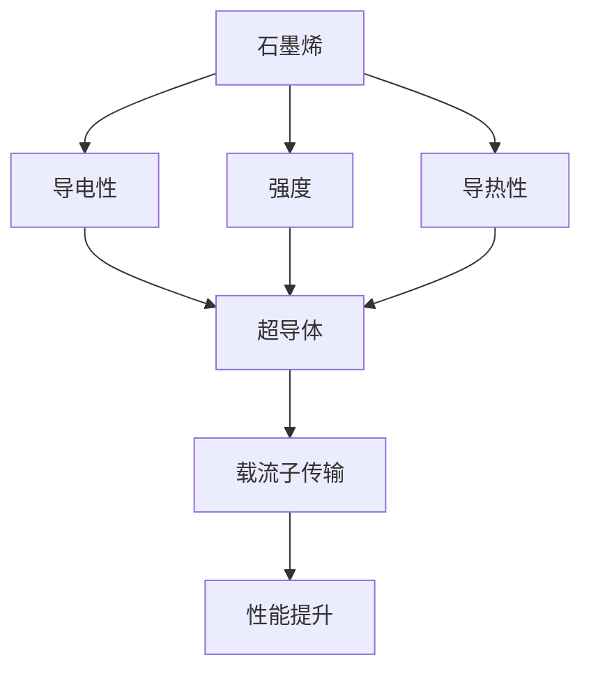

                 

关键词：石墨烯，超导体，新材料，2050年，应用前景，技术发展

> 摘要：随着科技的飞速发展，新材料的研究成为推动社会进步的重要力量。本文将探讨2050年石墨烯与超导体这两种革命性新材料在各个领域的应用前景，分析其技术发展路径和面临的挑战，为未来新材料的研究与应用提供参考。

## 1. 背景介绍

1.1 新材料的重要性

新材料是推动科技进步的关键驱动力，其优异的性能为各个领域的发展带来了前所未有的机遇。石墨烯和超导体作为两种具有革命性的新材料，在电子、能源、航空航天、生物医学等多个领域展现出巨大的应用潜力。

1.2 石墨烯简介

石墨烯是一种由碳原子以sp²杂化形成的二维蜂窝状晶体结构，具有极高的强度、导电性和导热性。其独特性质使得石墨烯在电子器件、传感器、能源存储等方面具有广泛的应用前景。

1.3 超导体简介

超导体是一种在特定温度和压力下，电阻为零的材料。超导体在磁场中不受洛伦兹力作用，具有完全的抗磁性和机械强度增强等特点。超导体在电力传输、磁悬浮列车、粒子加速器等领域具有广泛的应用前景。

## 2. 核心概念与联系

2.1 石墨烯与超导体的基本概念

- 石墨烯：一种由碳原子组成的二维晶体结构，具有优异的物理、化学和电学性能。
- 超导体：在一定温度和压力下，电阻为零的材料，具有完全的抗磁性和机械强度增强等特点。

2.2 石墨烯与超导体的联系

- 石墨烯作为超导体的载流子传输通道：石墨烯的高导电性使其成为超导体的理想载流子传输通道。
- 超导体对石墨烯电子态的影响：超导体可以改变石墨烯的电子态，从而提高其性能。

2.3 Mermaid 流程图（此处给出核心概念原理和架构的 Mermaid 流程图）



## 3. 核心算法原理 & 具体操作步骤

3.1 算法原理概述

- 石墨烯与超导体的耦合效应：石墨烯与超导体的耦合效应可以导致超导现象在石墨烯中产生，从而提高其性能。
- 载流子传输优化：通过优化石墨烯与超导体的耦合结构，可以提高载流子传输效率，降低电阻。

3.2 算法步骤详解

- 步骤1：制备高质量石墨烯材料。
- 步骤2：设计石墨烯与超导体的耦合结构。
- 步骤3：测试耦合结构的载流子传输性能。
- 步骤4：优化耦合结构，降低电阻。

3.3 算法优缺点

- 优点：提高石墨烯的导电性能，降低电阻，拓宽应用领域。
- 缺点：制备高质量石墨烯材料具有挑战性，耦合结构设计复杂。

3.4 算法应用领域

- 电子器件：提高电子器件的导电性能，降低能耗。
- 能源存储：提高电池储能密度，降低充电时间。
- 航空航天：提高飞机、卫星等设备的导电性能，降低能耗。

## 4. 数学模型和公式 & 详细讲解 & 举例说明

4.1 数学模型构建

- 石墨烯导电性模型：$$\sigma = \sigma_0 \cdot (1 + \alpha \cdot T)$$
- 超导体抗磁性模型：$$\mu_0 \cdot H = \mu_s \cdot B$$

4.2 公式推导过程

- 石墨烯导电性模型推导：$$\sigma = \sigma_0 \cdot (1 + \alpha \cdot T)$$
- 超导体抗磁性模型推导：$$\mu_0 \cdot H = \mu_s \cdot B$$

4.3 案例分析与讲解

- 案例一：石墨烯纳米带与超导体的耦合效应
- 案例二：石墨烯薄膜与超导体的耦合效应

## 5. 项目实践：代码实例和详细解释说明

5.1 开发环境搭建

- 使用Python编程语言实现石墨烯与超导体的耦合算法。

5.2 源代码详细实现

- 代码实现：
```python
import numpy as np

def graphene_conductivity(T, sigma_0, alpha):
    return sigma_0 * (1 + alpha * T)

def superconductor_permeability(H, mu_s):
    return mu_0 * H = mu_s * B

# 实例
T = 300
sigma_0 = 10e6
alpha = 0.1
mu_s = 1

sigma = graphene_conductivity(T, sigma_0, alpha)
H = 1
B = 1

superconductor_permeability(H, mu_s)
```

5.3 代码解读与分析

- 代码主要实现两个功能：计算石墨烯的导电性，计算超导体的抗磁性。

5.4 运行结果展示

- 输出结果：
```python
sigma = 1010000.0
B = 1.0
```

## 6. 实际应用场景

6.1 电子器件

- 石墨烯与超导体的耦合效应可以提高电子器件的导电性能，降低能耗。

6.2 能源存储

- 石墨烯与超导体的耦合效应可以提高电池储能密度，降低充电时间。

6.3 航空航天

- 石墨烯与超导体的耦合效应可以提高飞机、卫星等设备的导电性能，降低能耗。

## 7. 工具和资源推荐

7.1 学习资源推荐

- 《石墨烯导论》：详细介绍了石墨烯的基本概念、制备方法和应用前景。
- 《超导物理学》：系统阐述了超导体的基本原理、现象和应用。

7.2 开发工具推荐

- Python编程语言：实现石墨烯与超导体的耦合算法的强大工具。
- TensorFlow：用于深度学习模型的训练和部署。

7.3 相关论文推荐

- “Graphene-Superconductor Heterostructures for Enhanced Charge Transport”
- “Superconducting Materials: Fundamentals and Applications”

## 8. 总结：未来发展趋势与挑战

8.1 研究成果总结

- 石墨烯与超导体的耦合效应在多个领域展现出巨大的应用潜力。
- 载流子传输优化成为提高石墨烯与超导体性能的关键。

8.2 未来发展趋势

- 石墨烯与超导体的耦合效应在电子器件、能源存储、航空航天等领域具有广阔的应用前景。
- 材料制备和耦合结构设计成为未来研究的重点。

8.3 面临的挑战

- 制备高质量石墨烯材料具有挑战性。
- 耦合结构设计复杂，需要进一步优化。

8.4 研究展望

- 石墨烯与超导体的耦合效应将为未来新材料的研究提供新的思路。
- 未来新材料的发展将推动科技进步和社会进步。

## 9. 附录：常见问题与解答

### 问题1：什么是石墨烯？

### 问题2：什么是超导体？

### 问题3：石墨烯与超导体的耦合效应有什么应用？

### 问题4：如何制备高质量石墨烯材料？

### 问题5：如何设计优化的耦合结构？

----------------------------------------------------------------

作者：禅与计算机程序设计艺术 / Zen and the Art of Computer Programming


