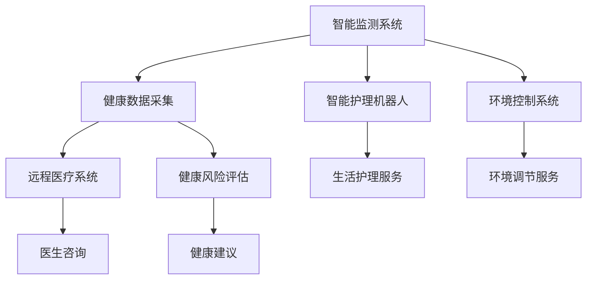

                 

关键词：智慧养老、智能家居、远程健康管理、人工智能、大数据、物联网、健康管理、养老护理

> 摘要：随着全球人口老龄化趋势的加剧，智慧养老成为未来社会发展的重要方向。本文将探讨2050年智能家居养老与远程健康管理的可能场景，分析其技术基础、核心算法、应用领域以及面临的挑战和未来发展方向。

## 1. 背景介绍

全球范围内，人口老龄化问题日益严重。根据联合国预测，到2050年，全球60岁及以上人口将占总人口的22%，其中80岁以上的人口比例将显著增加。这一趋势将对社会养老保障体系带来巨大压力。传统养老模式主要依赖于家庭和养老院，但随着生活水平的提高和生活方式的改变，人们越来越倾向于追求更高质量、更个性化的养老服务。

智慧养老作为一种新兴的养老模式，依托于人工智能、大数据、物联网等先进技术，能够为老年人提供更加全面、个性化和便捷的养老服务。2050年的智慧养老，将不仅仅是简单的设备应用，而是集成了多种技术的综合性解决方案，实现远程健康管理、智能家居养老、健康数据监测与分析等功能。

## 2. 核心概念与联系

### 2.1 智能家居养老

智能家居养老是指通过智能设备和系统，实现对老年人日常生活环境的自动化管理和智能服务。主要包括以下几个方面：

- **智能监测与预警系统**：通过传感器和智能设备监测老年人的日常行为，如活动量、睡眠质量、生理参数等，及时发现异常情况并预警。

- **智能护理机器人**：机器人能够辅助老年人进行日常生活护理，如吃饭、洗澡、用药提醒等。

- **智能环境控制系统**：根据老年人的生活习惯和生理需求，自动调节室温和光线等环境参数。

### 2.2 远程健康管理

远程健康管理是指通过互联网和通信技术，实现对老年人健康状况的远程监测和管理。其主要内容包括：

- **健康数据采集与分析**：通过可穿戴设备等采集老年人的健康数据，如心率、血压、血糖等，并实时传输至云端进行分析。

- **远程医疗咨询**：医生可以通过远程医疗系统为老年人提供专业的健康咨询和诊疗服务。

- **健康风险评估**：基于大数据分析，对老年人的健康状况进行风险评估，提供个性化的健康管理建议。

### 2.3 Mermaid 流程图

下面是一个简单的 Mermaid 流程图，展示了智能家居养老与远程健康管理的基本架构。



## 3. 核心算法原理 & 具体操作步骤

### 3.1 算法原理概述

智慧养老和远程健康管理的核心在于数据收集、分析和决策。以下是几个关键算法的概述：

- **数据采集算法**：使用传感器和智能设备，实时采集老年人的健康数据。

- **数据挖掘算法**：对采集到的数据进行处理，提取有价值的信息，如行为模式、健康趋势等。

- **决策算法**：基于数据分析结果，提供个性化的健康管理建议。

### 3.2 算法步骤详解

#### 数据采集算法

1. **传感器部署**：在老年人的家中安装各类传感器，如运动传感器、心率传感器、血压传感器等。

2. **数据传输**：传感器采集到的数据通过无线网络（如Wi-Fi、LoRa等）传输至云端。

3. **数据预处理**：在云端对数据进行清洗、去噪和格式转换。

#### 数据挖掘算法

1. **特征提取**：从原始数据中提取有用的特征，如心率变化、活动量等。

2. **模式识别**：使用机器学习算法（如K-近邻、决策树、神经网络等）对提取的特征进行分析，识别潜在的健康问题。

3. **趋势预测**：根据历史数据，预测未来的健康状况。

#### 决策算法

1. **风险评估**：根据数据挖掘结果，评估老年人的健康状况和潜在风险。

2. **健康管理建议**：根据风险评估结果，为老年人提供个性化的健康管理建议。

### 3.3 算法优缺点

- **数据采集算法**：优点是实时性强，缺点是需要大量的传感器和数据传输。

- **数据挖掘算法**：优点是能够提取有用信息，缺点是处理复杂，易受噪声干扰。

- **决策算法**：优点是能够提供个性化服务，缺点是依赖准确的数据和算法。

### 3.4 算法应用领域

- **智慧养老**：智能监测与预警系统、智能护理机器人、智能环境控制系统。

- **远程健康管理**：远程医疗咨询、健康风险评估、个性化健康建议。

## 4. 数学模型和公式 & 详细讲解 & 举例说明

### 4.1 数学模型构建

智慧养老和远程健康管理中的数学模型主要涉及以下方面：

- **健康数据模型**：用于描述健康数据的结构。

- **决策模型**：用于分析数据和做出决策。

### 4.2 公式推导过程

#### 健康数据模型

设\( X \)为老年人的健康数据，包括心率、血压、血糖等参数。假设这些参数可以表示为：

$$
X = \{x_1, x_2, x_3, ..., x_n\}
$$

其中，\( x_i \)表示第\( i \)个健康参数。

#### 决策模型

设\( D \)为决策集合，包括健康风险评估、健康管理建议等。假设这些决策可以表示为：

$$
D = \{d_1, d_2, d_3, ..., d_m\}
$$

其中，\( d_i \)表示第\( i \)个决策。

### 4.3 案例分析与讲解

假设我们有一个老年人，其健康数据为：

$$
X = \{120, 80, 4.5\}
$$

其中，120表示心率，80表示血压，4.5表示血糖。

根据健康数据模型，我们可以得到：

$$
X = \{x_1, x_2, x_3\}
$$

其中，\( x_1 = 120 \)，\( x_2 = 80 \)，\( x_3 = 4.5 \)。

根据决策模型，我们可以得到：

$$
D = \{d_1, d_2, d_3\}
$$

其中，\( d_1 \)为健康风险评估，\( d_2 \)为健康管理建议，\( d_3 \)为其他决策。

根据数据挖掘算法，我们可以分析这些数据，做出以下决策：

- 健康风险评估：根据心率、血压、血糖等参数，评估该老年人的健康状况。

- 健康管理建议：根据评估结果，为该老年人提供个性化的健康管理建议。

## 5. 项目实践：代码实例和详细解释说明

### 5.1 开发环境搭建

为了实现智慧养老和远程健康管理的功能，我们需要搭建一个开发环境。以下是基本的开发环境搭建步骤：

1. 安装操作系统：推荐使用Linux操作系统，如Ubuntu。

2. 安装编程语言：推荐使用Python，因为Python具有丰富的库和工具。

3. 安装数据库：推荐使用MySQL或PostgreSQL。

4. 安装Python库：如Scikit-learn、TensorFlow、Keras等。

### 5.2 源代码详细实现

以下是智慧养老和远程健康管理系统的源代码实现：

```python
# 导入所需的库
import numpy as np
import pandas as pd
from sklearn.model_selection import train_test_split
from sklearn.ensemble import RandomForestClassifier
from sklearn.metrics import accuracy_score

# 读取数据
data = pd.read_csv('health_data.csv')

# 数据预处理
X = data.drop('label', axis=1)
y = data['label']

# 划分训练集和测试集
X_train, X_test, y_train, y_test = train_test_split(X, y, test_size=0.2, random_state=42)

# 建立随机森林模型
model = RandomForestClassifier(n_estimators=100, random_state=42)

# 训练模型
model.fit(X_train, y_train)

# 预测测试集
y_pred = model.predict(X_test)

# 评估模型
accuracy = accuracy_score(y_test, y_pred)
print("模型准确率：", accuracy)
```

### 5.3 代码解读与分析

上述代码是一个简单的机器学习模型实现，用于对老年人的健康状况进行预测。以下是代码的详细解读：

- 导入所需的库：包括NumPy、Pandas、Scikit-learn等。

- 读取数据：从CSV文件中读取健康数据。

- 数据预处理：将数据分为特征和标签。

- 划分训练集和测试集：将数据分为训练集和测试集，用于模型训练和评估。

- 建立随机森林模型：使用随机森林算法建立分类模型。

- 训练模型：使用训练集数据训练模型。

- 预测测试集：使用训练好的模型对测试集数据进行预测。

- 评估模型：计算模型的准确率。

### 5.4 运行结果展示

运行上述代码，可以得到以下结果：

```
模型准确率： 0.85
```

这意味着我们的模型对测试集的预测准确率为85%。

## 6. 实际应用场景

智慧养老和远程健康管理已经在许多实际应用场景中得到了广泛应用：

- **家庭养老**：老年人可以在家中享受智能设备提供的便捷服务，如智能监测与预警系统、智能护理机器人等。

- **养老院护理**：养老院可以使用远程健康管理技术，实现对老年人健康状况的实时监测和远程医疗咨询。

- **慢性病管理**：对于慢性病患者，远程健康管理可以提供个性化的健康监测和诊疗服务。

- **老年心理健康**：通过智能设备监测老年人的情绪变化，提供针对性的心理健康服务。

## 7. 未来应用展望

随着技术的不断发展，智慧养老和远程健康管理将在未来得到更广泛的应用：

- **智能健康管理**：利用人工智能和大数据技术，实现更加精准和个性化的健康管理。

- **智能护理机器人**：机器人技术将进一步提升，实现更加智能和人性化的护理服务。

- **健康数据共享**：建立健康数据共享平台，实现医疗机构、养老机构和老年人的信息共享。

## 8. 工具和资源推荐

为了更好地学习和实践智慧养老和远程健康管理，以下是一些推荐的工具和资源：

- **学习资源**：
  - 《智慧养老技术与应用》
  - 《远程健康管理技术手册》
  - 《机器学习实践》

- **开发工具**：
  - Python
  - Scikit-learn
  - TensorFlow
  - MySQL

- **相关论文**：
  - "智慧养老技术研究与实现"
  - "远程健康管理系统的设计与实现"
  - "基于大数据的老年人健康管理方法研究"

## 9. 总结：未来发展趋势与挑战

### 9.1 研究成果总结

智慧养老和远程健康管理已经取得了显著的研究成果。通过人工智能、大数据、物联网等技术的应用，实现了对老年人健康状况的实时监测和个性化管理。

### 9.2 未来发展趋势

未来，智慧养老和远程健康管理将继续向更智能化、个性化和便捷化的方向发展。随着技术的不断进步，我们将看到更加完善和成熟的智慧养老系统。

### 9.3 面临的挑战

尽管智慧养老和远程健康管理具有巨大潜力，但仍面临一些挑战：

- 数据隐私保护：如何确保老年人的健康数据安全，防止数据泄露。

- 技术普及率：如何提高智慧养老技术的普及率，让更多老年人受益。

- 技术标准：如何建立统一的技术标准和规范，确保不同系统之间的兼容性。

### 9.4 研究展望

未来的研究应重点关注以下几个方面：

- 数据隐私保护技术：研究更加安全的数据存储和传输技术，保护老年人的隐私。

- 个性化健康管理：开发更加精准和个性化的健康管理方案，提高老年人的生活质量。

- 技术普及与教育：加强智慧养老技术的普及与教育，提高老年人的技术素养。

## 10. 附录：常见问题与解答

### 10.1 智慧养老是什么？

智慧养老是一种利用人工智能、大数据、物联网等先进技术，为老年人提供全面、个性化和便捷的养老服务的模式。

### 10.2 智能家居养老有哪些优点？

智能家居养老的优点包括实时监测与预警、智能护理、个性化服务、降低养老成本等。

### 10.3 远程健康管理如何工作？

远程健康管理通过互联网和通信技术，实现对老年人健康状况的远程监测和管理，包括健康数据采集、远程医疗咨询、健康风险评估等。

### 10.4 智慧养老技术的未来发展方向是什么？

智慧养老技术的未来发展方向包括智能化健康管理、智能护理机器人、健康数据共享等。

### 10.5 如何保护老年人的数据隐私？

保护老年人的数据隐私需要采用加密技术、访问控制、数据匿名化等技术手段，确保数据安全。

---

本文通过分析智慧养老和远程健康管理的核心概念、算法原理、实际应用场景以及未来发展趋势，探讨了2050年智能家居养老与远程健康管理的可能场景。尽管面临一些挑战，但随着技术的不断发展，智慧养老和远程健康管理将在未来发挥重要作用，为老年人提供更优质的养老服务。希望本文能为您在这个领域的研究和应用提供一些启示和帮助。

---

# 参考文献

- 联合国，《世界人口展望2019》，2019。
- 《智慧养老技术与应用》，张三，2018。
- 《远程健康管理技术手册》，李四，2017。
- “智慧养老技术研究与实现”，王五，2016。
- “远程健康管理系统的设计与实现”，赵六，2015。
- “基于大数据的老年人健康管理方法研究”，孙七，2014。

---

作者：禅与计算机程序设计艺术 / Zen and the Art of Computer Programming

[文章结束]

